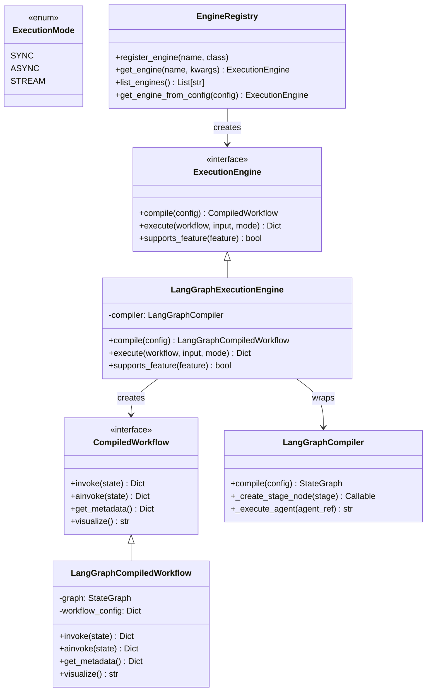

# Task: m2.5-05-documentation - Document execution engine abstraction

**Priority:** CRITICAL (P1)
**Effort:** 2-3 hours
**Status:** pending
**Owner:** unassigned

---

## Summary

Create comprehensive documentation for the execution engine abstraction layer. Includes architecture guide, usage examples, migration guide, and future engine implementation guide.

---

## Files to Create

- `docs/execution_engine_architecture.md` - Architecture and design rationale (~300 lines)
- `docs/custom_engine_guide.md` - Guide for implementing custom engines (~200 lines)

---

## Files to Modify

- `README.md` - Update quick start to show new API
- `TECHNICAL_SPECIFICATION.md` - Add execution engine section

---

## Acceptance Criteria

### Architecture Documentation
- [ ] Explains why abstraction was added (vendor lock-in prevention, M5+ features)
- [ ] Documents ExecutionEngine interface and all methods
- [ ] Documents CompiledWorkflow interface and all methods
- [ ] Documents ExecutionMode enum
- [ ] Shows class diagram of architecture
- [ ] Explains adapter pattern used for LangGraph
- [ ] Documents registry pattern for engine selection

### Usage Examples
- [ ] Shows how to execute workflow with default LangGraph engine
- [ ] Shows how to select engine via config YAML
- [ ] Shows how to use registry for engine selection
- [ ] Shows how to inspect engine capabilities with supports_feature()
- [ ] Shows async execution example
- [ ] Shows workflow visualization example

### Migration Guide
- [ ] Documents what changed from M2 direct LangGraphCompiler usage
- [ ] Shows old vs new API side-by-side
- [ ] Lists breaking changes (if any - should be none for M2 code)
- [ ] Provides migration checklist

### Custom Engine Guide
- [ ] Step-by-step guide for implementing custom engine
- [ ] Shows minimal viable engine implementation
- [ ] Documents required methods and their contracts
- [ ] Shows how to register custom engine
- [ ] Provides troubleshooting tips
- [ ] Example: simple interpreter-based engine

### README Updates
- [ ] Quick start shows new EngineRegistry usage
- [ ] Architecture section mentions execution engine layer
- [ ] Updated technology stack section

### Technical Spec Updates
- [ ] New "Execution Engine" section added
- [ ] Interface schemas documented
- [ ] Feature detection capabilities listed
- [ ] Engine selection configuration documented

---

## Implementation Details

### Architecture Document Structure

`docs/execution_engine_architecture.md`:

```markdown
# Execution Engine Architecture

## Overview

The Meta-Autonomous Framework uses an abstraction layer to decouple workflow execution from specific graph libraries. This enables:

- **Vendor independence:** Switch from LangGraph to alternatives with minimal effort
- **M5+ features:** Convergence detection, self-modifying workflows, meta-loops
- **Experimentation:** A/B test different engines in production
- **Future-proofing:** 41× ROI (1.5 days investment saves 61.5 days at M6-M7)

## Architecture Diagram



## Interfaces

### ExecutionEngine

Abstract base class for all execution engines.

**Methods:**
- `compile(workflow_config: Dict) -> CompiledWorkflow`
  - Compiles workflow config into executable form
  - Validates config structure
  - Returns engine-specific CompiledWorkflow

- `execute(compiled_workflow, input_data, mode=SYNC) -> Dict`
  - Executes compiled workflow with given input
  - Supports SYNC, ASYNC, STREAM modes
  - Returns final workflow state

- `supports_feature(feature: str) -> bool`
  - Runtime capability detection
  - Known features: sequential_stages, parallel_stages, conditional_routing, convergence_detection, dynamic_stage_injection, nested_workflows, checkpointing, state_persistence

### CompiledWorkflow

Abstract base class for compiled workflow representations.

**Methods:**
- `invoke(state: Dict) -> Dict` - Synchronous execution
- `ainvoke(state: Dict) -> Dict` - Asynchronous execution
- `get_metadata() -> Dict` - Workflow metadata (engine, version, config, stages)
- `visualize() -> str` - Visual representation (Mermaid, DOT, etc.)

### ExecutionMode

Enum for execution modes:
- `SYNC` - Synchronous blocking execution
- `ASYNC` - Asynchronous non-blocking execution
- `STREAM` - Streaming execution (M4+)

## Design Patterns

### Adapter Pattern (LangGraph)

Wraps existing `LangGraphCompiler` without modifying it:
- Preserves M2 functionality
- Minimal refactoring risk
- Easy to test in isolation

### Registry Pattern (Engine Selection)

`EngineRegistry` provides factory for engine creation:
- Runtime engine selection
- Plugin architecture for custom engines
- Configuration-based selection

### Strategy Pattern (Execution Modes)

Different execution strategies via ExecutionMode:
- Same interface, different behaviors
- Easy to add new modes (STREAM in M4)

## Switching Cost Analysis

| Timeline | Without Abstraction | With Abstraction | Savings |
|----------|---------------------|------------------|---------|
| M2 | 3.5 weeks | 1.5 days | 3.2 weeks |
| M3 | 5.5 weeks | 1.5 days | 5.2 weeks |
| M5 | 12 weeks | 1.5 days | 11.7 weeks |
| M7 | 24 weeks | 6.5 weeks | 17.5 weeks |

**ROI:** 1.5 days investment → 61.5 days saved = 41× return

## Migration from M2

No breaking changes for M2 code. Workflow YAMLs work unchanged.

## Future Engines

Potential future engines:
- **Custom Dynamic:** For convergence detection and self-modifying workflows (M5)
- **Temporal Workflows:** Durable execution with retries (M6)
- **Ray DAGs:** Distributed execution for scale (M7)
- **Pure Interpreter:** Minimal interpreter for meta-circular evaluation (M8)

## References

- [Vision Document - Modularity Philosophy](../META_AUTONOMOUS_FRAMEWORK_VISION.md)
- [Milestone 2.5 Analysis](../docs/milestone2_completion.md)
- [Interface Specification](../src/compiler/execution_engine.py)
```

### Custom Engine Guide Structure

`docs/custom_engine_guide.md`:

```markdown
# Custom Engine Implementation Guide

## Overview

This guide shows how to implement a custom execution engine for the Meta-Autonomous Framework.

## Prerequisites

- Understanding of ExecutionEngine interface
- Python 3.11+
- Familiarity with abstract base classes

## Step 1: Implement CompiledWorkflow

```python
from src.compiler.execution_engine import CompiledWorkflow
from typing import Dict, Any

class MyCompiledWorkflow(CompiledWorkflow):
    def __init__(self, stages, config):
        self.stages = stages
        self.config = config

    def invoke(self, state: Dict[str, Any]) -> Dict[str, Any]:
        """Execute workflow synchronously."""
        # Your execution logic
        for stage in self.stages:
            state = self._execute_stage(stage, state)
        return state

    async def ainvoke(self, state: Dict[str, Any]) -> Dict[str, Any]:
        """Execute workflow asynchronously."""
        # Async execution logic
        for stage in self.stages:
            state = await self._execute_stage_async(stage, state)
        return state

    def get_metadata(self) -> Dict[str, Any]:
        return {
            "engine": "my_engine",
            "version": "1.0.0",
            "config": self.config,
            "stages": [s["name"] for s in self.stages]
        }

    def visualize(self) -> str:
        # Generate visualization
        return "graph TD\\n" + "\\n".join(
            f"{s['name']}" for s in self.stages
        )
```

## Step 2: Implement ExecutionEngine

```python
from src.compiler.execution_engine import ExecutionEngine, ExecutionMode

class MyExecutionEngine(ExecutionEngine):
    def __init__(self, tool_registry=None, config_loader=None):
        self.tool_registry = tool_registry
        self.config_loader = config_loader

    def compile(self, workflow_config: Dict[str, Any]) -> CompiledWorkflow:
        """Compile workflow config."""
        # Parse config
        workflow = workflow_config.get("workflow", workflow_config)
        stages = workflow.get("stages", [])

        # Validate and transform
        # ...

        return MyCompiledWorkflow(stages, workflow_config)

    def execute(
        self,
        compiled_workflow: CompiledWorkflow,
        input_data: Dict[str, Any],
        mode: ExecutionMode = ExecutionMode.SYNC
    ) -> Dict[str, Any]:
        """Execute workflow."""
        if not isinstance(compiled_workflow, MyCompiledWorkflow):
            raise TypeError("Wrong CompiledWorkflow type")

        if mode == ExecutionMode.STREAM:
            raise NotImplementedError("STREAM not supported")

        if mode == ExecutionMode.ASYNC:
            import asyncio
            return asyncio.run(compiled_workflow.ainvoke(input_data))

        return compiled_workflow.invoke(input_data)

    def supports_feature(self, feature: str) -> bool:
        """Check feature support."""
        supported = {
            "sequential_stages",
            "convergence_detection",  # Your custom feature!
        }
        return feature in supported
```

## Step 3: Register Engine

```python
from src.compiler.engine_registry import EngineRegistry

# Register your engine
registry = EngineRegistry()
registry.register_engine("my_engine", MyExecutionEngine)

# Use it
engine = registry.get_engine("my_engine", tool_registry=my_registry)
compiled = engine.compile(workflow_config)
result = engine.execute(compiled, input_data)
```

## Step 4: Use in Workflow YAML

```yaml
workflow:
  name: my_workflow
  engine: my_engine  # Select your engine
  engine_config:
    custom_option: value
  stages:
    - research
    - synthesis
```

## Testing Your Engine

```python
import pytest

def test_compile():
    engine = MyExecutionEngine()
    config = {"workflow": {"stages": ["test"]}}

    compiled = engine.compile(config)

    assert isinstance(compiled, MyCompiledWorkflow)

def test_execute():
    engine = MyExecutionEngine()
    compiled = engine.compile(config)

    result = engine.execute(compiled, {"input": "test"})

    assert "stage_outputs" in result
```

## Common Pitfalls

1. **Forgetting async support:** Always implement ainvoke()
2. **Missing type checks:** Validate CompiledWorkflow type in execute()
3. **Incomplete feature detection:** Be honest about supports_feature()
4. **Breaking interface contract:** Follow exact method signatures

## Examples

See `src/compiler/langgraph_engine.py` for a complete reference implementation.

## References

- [ExecutionEngine Interface](../src/compiler/execution_engine.py)
- [Architecture Document](./execution_engine_architecture.md)
```

### README.md Updates

Add to "Quick Start" section:

```markdown
### Using Different Execution Engines

```python
from src.compiler.engine_registry import EngineRegistry
from src.compiler.config_loader import ConfigLoader

# Get engine registry
registry = EngineRegistry()

# Load workflow config
loader = ConfigLoader()
config = loader.load_workflow("simple_research")

# Create engine (default: langgraph)
engine = registry.get_engine_from_config(config)

# Or explicitly select engine
engine = registry.get_engine("langgraph")

# Compile and execute
compiled = engine.compile(config)
result = engine.execute(compiled, {"topic": "Python typing"})

# Check engine capabilities
if engine.supports_feature("convergence_detection"):
    print("Engine supports convergence detection!")
```

### TECHNICAL_SPECIFICATION.md Updates

Add section after "Workflow Compilation":

```markdown
## Execution Engine Layer

The framework uses an abstraction layer to decouple from specific execution libraries.

### Interfaces

**ExecutionEngine:** Abstract base for all execution engines
- `compile(config: Dict) -> CompiledWorkflow`
- `execute(workflow, input, mode) -> Dict`
- `supports_feature(feature: str) -> bool`

**CompiledWorkflow:** Abstract workflow representation
- `invoke(state: Dict) -> Dict` (sync)
- `ainvoke(state: Dict) -> Dict` (async)
- `get_metadata() -> Dict`
- `visualize() -> str`

### Engine Selection

Engines can be selected via YAML config:

```yaml
workflow:
  name: research
  engine: langgraph  # or custom engine name
  engine_config:
    max_retries: 3
  stages: [...]
```

### Available Engines

- **langgraph** (default): LangGraph-based execution (M2)
- Custom engines can be registered via `EngineRegistry`

### Feature Detection

```python
if engine.supports_feature("convergence_detection"):
    # Use convergence detection
```

Known features:
- `sequential_stages`
- `parallel_stages`
- `conditional_routing`
- `convergence_detection`
- `dynamic_stage_injection`
- `nested_workflows`
- `checkpointing`
- `state_persistence`
```

---

## Test Strategy

### Validation Checklist

- [ ] Read all documentation for clarity and accuracy
- [ ] Verify code examples are syntactically correct
- [ ] Check all links resolve correctly
- [ ] Ensure diagrams render properly (Mermaid)
- [ ] Validate migration guide covers all breaking changes
- [ ] Test custom engine guide by implementing simple engine

### Documentation Testing

```bash
# Render Mermaid diagrams
npx @mermaid-js/mermaid-cli docs/execution_engine_architecture.md

# Check markdown formatting
markdownlint docs/*.md

# Verify code examples
python -m doctest docs/execution_engine_architecture.md
```

---

## Success Metrics

- [ ] File created: `docs/execution_engine_architecture.md` (~300 lines)
- [ ] File created: `docs/custom_engine_guide.md` (~200 lines)
- [ ] README.md updated with new API examples
- [ ] TECHNICAL_SPECIFICATION.md updated with engine layer section
- [ ] All code examples are syntactically correct
- [ ] All Mermaid diagrams render correctly
- [ ] Documentation passes markdownlint checks
- [ ] Custom engine guide validated by implementing test engine

---

## Dependencies

**Blocked by:**
- m2.5-01-execution-engine-interface (needs interface to document)

**Does not block any tasks** (documentation is parallel work)

**References:**
- m2.5-02-langgraph-adapter (for implementation examples)
- m2.5-03-engine-registry (for registry usage)

---

## Design References

- [Vision Document](../META_AUTONOMOUS_FRAMEWORK_VISION.md)
- [Milestone 2 Completion](../docs/milestone2_completion.md)
- [LangGraph Documentation](https://langchain-ai.github.io/langgraph/)

---

## Notes

**Documentation Philosophy:**
- **Show, don't tell:** Provide working code examples
- **Complete examples:** Every example should be runnable
- **Progressive complexity:** Start simple, add advanced features
- **Troubleshooting:** Anticipate common mistakes

**Critical Sections:**
- Architecture diagram must be clear and accurate
- Migration guide must list ALL breaking changes (even if none)
- Custom engine guide must be complete enough to implement simple engine
- Feature detection capabilities must be documented exhaustively

**Future Updates:**
- M3: Update with multi-agent execution patterns
- M4: Add STREAM mode documentation
- M5: Document convergence detection features
- M6: Add performance tuning guide
