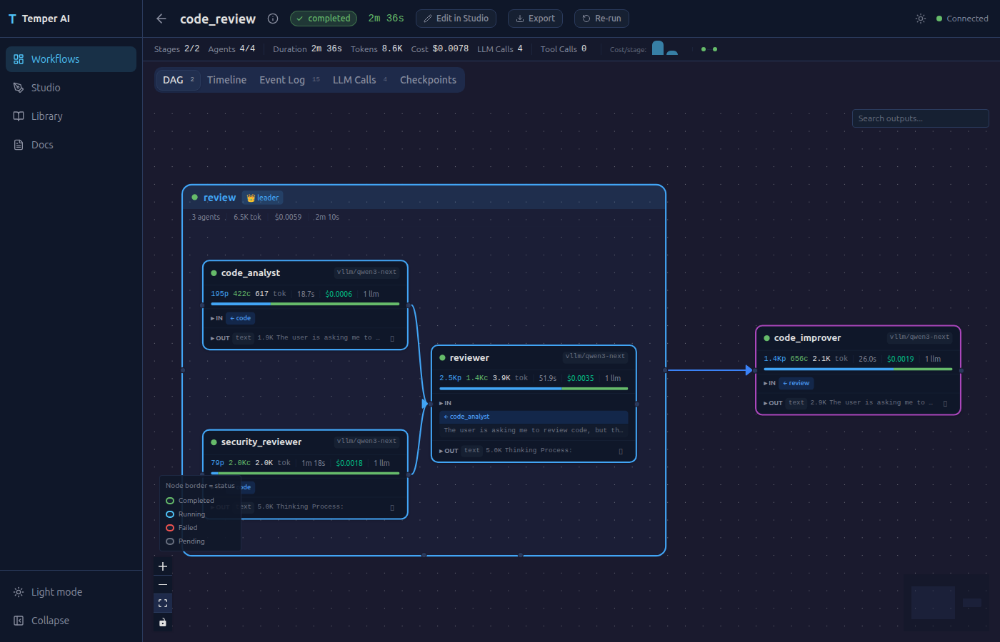
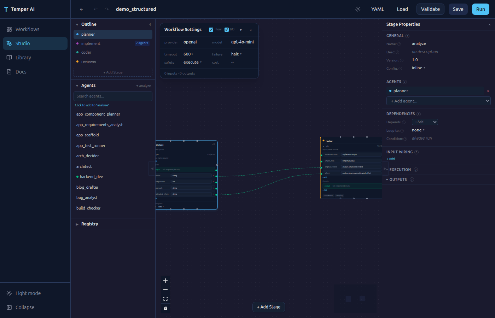

# Temper AI

[](LICENSE)
[](https://python.org)
[](https://github.com/shine2lay/temper-ai/actions/workflows/ci.yml)
[](pyproject.toml)

> **Early Access (v0.1.0)** — Temper AI is under active development and not production-ready. It is designed for **local development and self-hosted use only**. Do not expose to the public internet. See [Security Note](#security-note) for details.

**Multi-agent workflows through YAML. No framework to build. Just define and run.**

We're in the early days of agentic AI — the right architecture, the right model, the right prompts, the right agent topology — nobody has figured it out yet. Temper AI is built for this moment.

Define your multi-agent workflow in YAML. Pick your LLM provider. Run it. **See exactly what each agent received, what it produced, and how data flowed between them.** Swap the model, change the strategy, add a tool — one line change, no code to rewrite.

```yaml
workflow:
  name: code_review
  nodes:
    - name: plan
      type: agent
      agent: planner

    - name: code
      type: stage
      strategy: parallel
      agents: [coder_a, coder_b]
      depends_on: [plan]

    - name: review
      type: agent
      agent: reviewer
      depends_on: [code]
```

That's a complete workflow. Three agents, parallel coding, sequential review. No Python classes, no framework boilerplate, no engine to wire up.

**Why Temper:**
- **YAML-first** — define agents, wiring, safety, and strategies in config. Zero code to get started.
- **Full observability** — see every step: what each agent received, what it produced, every LLM call, every tool invocation, the full context flow. In the dashboard, in the CLI, in the API.
- **Radically modular** — swap providers, tools, strategies, even the execution engine. Every piece is independent.
- **Safety built in** — budget limits, file access control, forbidden ops. Declared in YAML, enforced on every action.
- **Experiment-ready** — same workflow, different model? One line change. Different strategy? One line. Compare results.

---

## See Every Step

Multi-agent workflows are hard to debug because you can't see what's happening inside. Temper makes every step visible.

### Dashboard — Live DAG Execution

Watch your workflow execute as a live DAG. Click any node to inspect its inputs, outputs, LLM calls, tool invocations, and token usage. Trace how context flows from one agent to the next.



### CLI — Structured Terminal Output

```
$ temper run code_review --input task="Build a REST API" -v

╭──────────────────────── code_review ─────────────────────────╮
│ openai/gpt-4o-mini | budget: $5.00                            │
╰──────────────────────────────────────────────────────────────╯

━━━━━━━━━━━━━━━━ plan ━━━━━━━━━━━━━━━━
  planner
    input:  task="Build a REST API"
    output: {"steps": ["Design endpoints", "Implement CRUD", ...]}
  ✓ planner 9.7s | 206 tokens

━━━━━━━━━━━━━━━━ code (parallel) ━━━━━━━━━━━━━━━━
  coder_a ✓ 12.3s | 450 tokens
  coder_b ✓ 11.1s | 380 tokens

━━━━━━━━━━━━━━━━ review ━━━━━━━━━━━━━━━━
  reviewer ✓ 8.2s | 290 tokens

────────────────────────────────────────
Completed in 31.2s | 1,326 tokens | $0.02
```

Three verbosity levels: default (progress), `-v` (inputs/outputs), `-vv` (full dump — see every token).

### API — Programmatic Access

Every event is queryable: `GET /api/workflows/{id}` returns the full execution tree with all agent inputs, outputs, LLM calls, tool results, and timing data.

### Studio

Build and edit workflows visually. Drag agents, connect stages, configure strategies — all synced to the underlying YAML.



---

## Quick Start

```bash
git clone https://github.com/shine2lay/temper-ai.git
cd temper-ai
cp .env.example .env   # configure your LLM provider
docker compose up
```

Dashboard at **http://localhost:8420/app/**

### `.env` — pick one provider

```bash
# Quickest: OpenAI (most developers have this)
OPENAI_API_KEY=sk-...
OPENAI_MODEL=gpt-4o-mini

# Or Anthropic
# ANTHROPIC_API_KEY=sk-ant-...
# ANTHROPIC_MODEL=claude-sonnet-4-20250514
```

> **No API key?** Use Ollama — it's free and runs locally:
> ```bash
> brew install ollama && ollama pull llama3.2
> # Then in .env:
> OLLAMA_BASE_URL=http://host.docker.internal:11434
> OLLAMA_MODEL=llama3.2
> ```

See [LLM Providers](docs/reference/providers/index.md) for all 5 providers (including vLLM and Gemini).

### Without Docker

```bash
pip install -e .

# Build the dashboard (requires Node.js)
cd frontend && npm install && npx vite build && cd ..

temper serve --port 8420
```

> **Note:** Without Docker, the server defaults to SQLite — no database setup needed. Set `TEMPER_DATABASE_URL` in `.env` to use PostgreSQL instead.

---

## Core Concepts

```
Workflow
  ├── Agent Node ── runs a single agent (LLM call + tools)
  └── Stage Node ── groups agents with a strategy
        ├── parallel   ── all agents run concurrently
        ├── sequential ── linear chain, each sees previous output
        └── leader     ── workers in parallel, leader synthesizes
```

**Workflow** — a DAG of nodes defined in YAML. Independent nodes run in parallel automatically.

**Agent** — a configured LLM identity with a system prompt, task template (Jinja2), optional tools and memory. Defined in a separate YAML, referenced by workflows.

**Stage** — groups agents with a collaboration strategy. Acts as a context boundary — you control what data flows in and out.

**Strategy** — how agents within a stage are wired. See [Strategies Reference](docs/reference/strategies/index.md).

**Dispatch** — an agent can mutate the running DAG at runtime based on its own reasoning. Add new nodes, remove pending ones, replace existing ones (remove + re-add with same name). Two tiers: declarative (`dispatch:` block in agent YAML, Jinja-rendered against the agent's output) and imperative (`AddNode` / `RemoveNode` tools the agent calls). Cap-enforced, resume-safe, observable. See [llms.txt §13b](llms.txt) and `configs/workflows/demo_dispatch*.yaml` for runnable examples.

---

## Your First Workflow

### 1. Define agents

```yaml
# configs/agents/planner.yaml
agent:
  name: planner
  type: llm
  system_prompt: |
    You are a software architect. Create implementation plans.
  task_template: |
    Task: {{ task }}
    Output as JSON: {"steps": [...], "approach": "..."}
```

```yaml
# configs/agents/coder.yaml
agent:
  name: coder
  type: llm
  system_prompt: |
    You are an expert programmer. Implement the plan you receive.
  task_template: |
    Implement this plan:
    {{ task }}
  tools: [Bash, FileWriter]
```

See [Agent Types Reference](docs/reference/agents/index.md) for all configuration options.

### 2. Define workflow

```yaml
# configs/workflows/my_workflow.yaml
workflow:
  name: my_workflow
  defaults:
    provider: openai       # or: anthropic, ollama, vllm
    model: gpt-4o-mini     # change to match your provider
  safety:
    policies:
      - type: budget
        max_cost_usd: 5.00
  nodes:
    - name: plan
      type: agent
      agent: planner

    - name: code
      type: agent
      agent: coder
      depends_on: [plan]
      input_map:
        task: plan.output
```

`input_map` wires the planner's output into the coder's `{{ task }}` variable. Sources: `node.output`, `node.structured.field`, `node.status`, `workflow.field`.

### 3. Run it

```bash
temper run my_workflow --input task="Build a calculator in Python"
```

Or via API:

```bash
curl -X POST http://localhost:8420/api/runs \
  -H "Content-Type: application/json" \
  -d '{"workflow": "my_workflow", "inputs": {"task": "Build a calculator"}}'
```

---

## CLI

```bash
temper run <workflow> --input key=value [-v] [-vv] [--no-db] [--debug]
temper serve [--port 8420] [--dev] [--debug]
temper validate <workflow> [--debug]
```

| Flag | Description |
|------|-------------|
| `-v` | Show agent inputs/outputs (truncated) |
| `-vv` | Full dump (no truncation) |
| `--no-db` | Ephemeral run, no event persistence |
| `--dev` | Hot reload for server mode |
| `--debug` | Enable debug logging (config loading, provider init, LLM requests) |

---

## Safety

Declared in YAML, enforced on every tool call. First-deny-wins.

```yaml
safety:
  policies:
    - type: budget
      max_cost_usd: 5.00
      max_tokens: 500000
    - type: file_access
      denied_paths: [".env", "credentials", "/etc/"]
    - type: forbidden_ops
```

See [Safety Policies Reference](docs/reference/policies/index.md).

---

## Built-in Tools

| Tool | Description |
|------|-------------|
| `Bash` | Execute shell commands (env sanitized, command allowlist) |
| `FileWriter` | Write files with path protection |
| `FileEdit` | Replace exact text in files (path protected) |
| `FileAppend` | Append to existing files (path protected) |
| `Delegate` | Spawn sub-agents as visible DAG nodes |
| `WebSearch` | Search the web via SearXNG |
| `Calculator` | Safe math evaluation |
| `git` | Git operations in workspace |
| `http` | HTTP requests with domain allowlist |

See [Tools Reference](docs/reference/tools/index.md).

---

## Extending

Every component is pluggable. No forking required.

```python
from temper_ai.tools import register_tool, BaseTool, ToolResult

class WebSearch(BaseTool):
    name = "WebSearch"
    description = "Search the web"
    parameters = {"type": "object", "properties": {"query": {"type": "string"}}, "required": ["query"]}
    def execute(self, **params) -> ToolResult:
        return ToolResult(success=True, result="...")

register_tool("WebSearch", WebSearch)
```

Same pattern for [providers](docs/reference/providers/index.md), [strategies](docs/reference/strategies/index.md), and [policies](docs/reference/policies/index.md).

---

## Architecture

```
temper_ai/
  agent/         Agent types (LLM, Script) + registry
  api/           REST API + WebSocket + data service
  cli/           CLI + Rich terminal output
  config/        DB-backed config store + YAML importer
  database/      SQLModel engine + sessions
  llm/           Tool-calling loop + 5 providers + prompt renderer
  memory/        mem0 + InMemory backends
  observability/ Event recording
  safety/        Policy engine + 3 policies
  shared/        Cross-module types
  stage/         Graph executor + topology generators + loader
  tools/         9 tools + executor with sandbox
```

---

## Contributing

```bash
git clone https://github.com/shine2lay/temper-ai.git
cd temper-ai
pip install -e ".[dev]"
pytest                                                 # 900+ tests
ruff check temper_ai/                                  # lint
python -m scripts.code_quality_check.runner temper_ai   # quality report
```

Docs auto-regenerate on commit when source files change. See [CONTRIBUTING.md](CONTRIBUTING.md).

---

## What Temper AI is NOT

- **Not a code framework** like LangChain or LangGraph — no Python classes to write. Agents are YAML configs.
- **Not a role-based DSL** like CrewAI — no "Researcher" or "Manager" abstractions. You define exact prompts and wiring.
- **Not a no-code platform** — you write YAML, not drag-and-drop (though the Studio provides a visual editor that generates YAML).
- **Not a hosted service** — you run it on your own infrastructure with your own API keys.

## Security Note

Temper AI v0.1.0 is designed for **local development and self-hosted use only**. It is not production-ready.

**Current limitations:**
- **No API authentication** — all endpoints are open. Anyone with network access can start workflows and consume your LLM API credits.
- **No rate limiting** — the API can be called without restriction.
- **LLM agents execute real commands** — agents use Bash, file operations, and HTTP requests. Always use `safety:` policies in your workflow configs to set budget limits and restrict file access.

**Do not expose port 8420 to the public internet.**

For local use, these limitations are acceptable — you are the only user. Production hardening (authentication, rate limiting, sandboxing) is on the [Roadmap](docs/ROADMAP.md).

---

[Open an issue](https://github.com/shine2lay/temper-ai/issues) | [Roadmap](docs/ROADMAP.md) | [Reference Docs](docs/reference/index.md)

[Apache 2.0 License](LICENSE)
