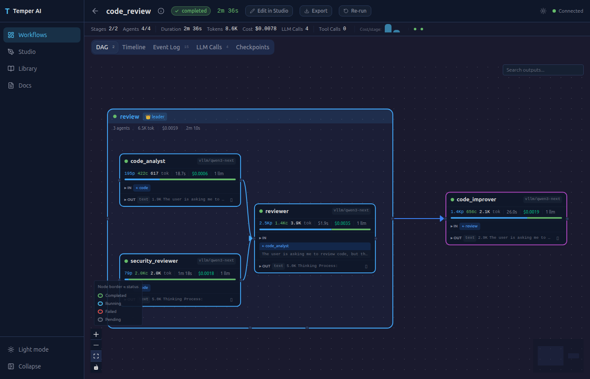
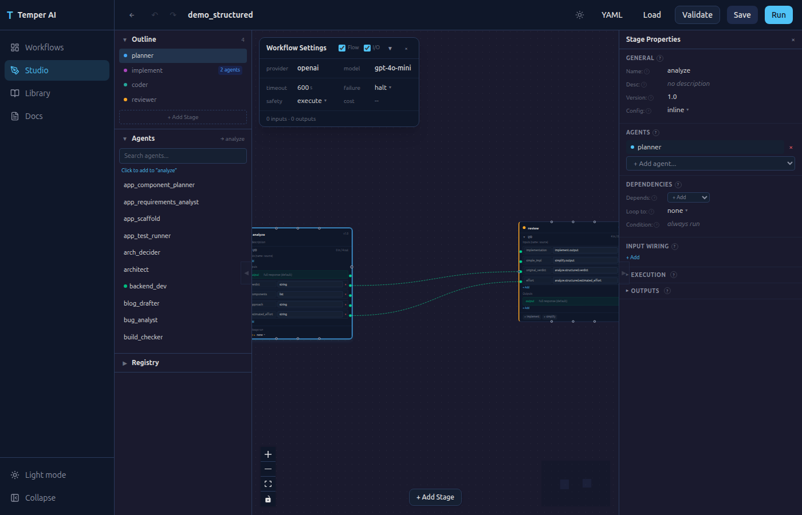

# Temper AI

[](LICENSE)
[](https://python.org)
[](https://github.com/shine2lay/temper-ai/actions/workflows/ci.yml)
[](pyproject.toml)

> **Early Access (v0.1.0)** — Temper AI is under active development and not production-ready. It is designed for **local development and self-hosted use only**. Do not expose to the public internet. See [Security Note](#security-note) for details.

**Multi-agent workflows through YAML. No framework to build. Just define and run.**

We're in the early days of agentic AI — the right architecture, the right model, the right prompts, the right agent topology — nobody has figured it out yet. Temper AI is built for this moment.

Define your multi-agent workflow in YAML. Pick your LLM provider. Run it. **See exactly what each agent received, what it produced, and how data flowed between them.** Swap the model, change the strategy, add a tool — one line change, no code to rewrite.

```yaml
workflow:
  name: code_review
  nodes:
    - name: plan
      type: agent
      agent: planner

    - name: code
      type: stage
      strategy: parallel
      agents: [coder_a, coder_b]
      depends_on: [plan]

    - name: review
      type: agent
      agent: reviewer
      depends_on: [code]
```

That's a complete workflow. Three agents, parallel coding, sequential review. No Python classes, no framework boilerplate, no engine to wire up.

**Why Temper:**
- **YAML-first** — define agents, wiring, safety, and strategies in config. Zero code to get started.
- **Full observability** — see every step: what each agent received, what it produced, every LLM call, every tool invocation, the full context flow. In the dashboard, in the CLI, in the API.
- **Radically modular** — swap providers, tools, strategies, even the execution engine. Every piece is independent.
- **Safety built in** — budget limits, file access control, forbidden ops. Declared in YAML, enforced on every action.
- **Experiment-ready** — same workflow, different model? One line change. Different strategy? One line. Compare results.

---

## See Every Step

Multi-agent workflows are hard to debug because you can't see what's happening inside. Temper makes every step visible.

### Dashboard — Live DAG Execution

Watch your workflow execute as a live DAG. Click any node to inspect its inputs, outputs, LLM calls, tool invocations, and token usage. Trace how context flows from one agent to the next.



### CLI — Start a Run and Follow It

```
$ temper run code_review --input task="Build a REST API"
Started code_review on the temper server: run 6c0f9d1e-5b2a-4d8e-9f31-2a7c4e8b1d90
  https://temper.wai2shine.com/app/workflow/6c0f9d1e-5b2a-4d8e-9f31-2a7c4e8b1d90
Following it here; Ctrl+C stops following, the run keeps going.
  started  plan
  done     plan (10s)
  started  code
  done     code (12s)
  started  review
  done     review (8s)
Run completed in 31s, $0.02: https://temper.wai2shine.com/app/workflow/6c0f9d1e-5b2a-4d8e-9f31-2a7c4e8b1d90
```

`temper run` starts the run on the server, the same way the dashboard does, so
every run shows on the dashboard; the terminal only follows it. `-v` adds
nested stages and the output at the end; `--detach` prints the link and
returns at once.

### API — Programmatic Access

Every event is queryable: `GET /api/workflows/{id}` returns the full execution tree with all agent inputs, outputs, LLM calls, tool results, and timing data.

For a script that audits its own run, `GET /api/runs/{id}/tool-calls` lists every tool call with its attempt, agent, round, status and the file paths it named, plus the calls the run refused. It never returns what a call was given or gave back (no Write content, Edit strings, Bash commands or outputs): ask with `contains=` (up to 20 strings) and each call's `hits` say which of them its inputs held.

### MCP — Agents Run Workflows

Temper is an MCP server, so a coding agent can start a workflow and inspect
what happened inside it:

```json
{ "mcpServers": { "temper": { "url": "http://localhost:8420/mcp" } } }
```

```python
list_workflows()                                  # what can I run, which inputs?
run_workflow("blog_writer", {"topic": "otters"})  # -> execution_id
wait_for_run(execution_id)                        # -> status + one line per node
get_node_output(execution_id, "draft")            # drill down only when needed
```

Inspection is layered on purpose: a full run payload can be ~23,500 tokens,
while `get_run` answers the same questions in ~300. See [docs/mcp.md](docs/mcp.md).

### Studio

Build and edit workflows visually. Drag agents, connect stages, configure strategies — all synced to the underlying YAML.



---

## Quick Start

```bash
git clone https://github.com/shine2lay/temper-ai.git
cd temper-ai
cp .env.example .env   # configure your LLM provider
docker compose up
```

Dashboard at **http://localhost:8420/app/**

### Check the install — no API key, no spend

```bash
temper run smoke_test --input message="hello"
```

`smoke_test` is two script nodes and no LLM calls, so it works before you
have configured a provider. `temper run` asks the server you just started to
run it (http://127.0.0.1:8420 unless `TEMPER_SERVER_URL` says otherwise). If it completes, the engine, the database, the
event stream and the dashboard are all working.

### `.env` — pick one provider

```bash
# Quickest: OpenAI (most developers have this)
OPENAI_API_KEY=sk-...
OPENAI_MODEL=gpt-4o-mini

# Or Anthropic
# ANTHROPIC_API_KEY=sk-ant-...
# ANTHROPIC_MODEL=claude-sonnet-4-20250514
```

> **No API key?** Use Ollama — it's free and runs locally:
> ```bash
> brew install ollama && ollama pull llama3.2
> # Then in .env:
> OLLAMA_BASE_URL=http://host.docker.internal:11434
> OLLAMA_MODEL=llama3.2
> ```

See [LLM Providers](docs/reference/providers/index.md) for all 5 providers (including vLLM and Gemini).

### Without Docker

```bash
pip install -e .

# Build the dashboard (requires Node.js)
cd frontend && npm install && npx vite build && cd ..

temper serve --port 8420
```

> **Note:** Without Docker, the server defaults to SQLite — no database setup needed. Set `TEMPER_DATABASE_URL` in `.env` to use PostgreSQL instead.

---

## Core Concepts

```
Workflow
  ├── Agent Node ── runs a single agent (LLM call + tools)
  └── Stage Node ── groups agents with a strategy
        ├── parallel   ── all agents run concurrently
        ├── sequential ── linear chain, each sees previous output
        └── leader     ── workers in parallel, leader synthesizes
```

**Workflow** — a DAG of nodes defined in YAML. Independent nodes run in parallel automatically.

**Agent** — a configured LLM identity with a system prompt, task template (Jinja2), optional tools and memory. Defined in a separate YAML, referenced by workflows.

**Stage** — groups agents with a collaboration strategy. Acts as a context boundary — you control what data flows in and out.

**Strategy** — how agents within a stage are wired. See [Strategies Reference](docs/reference/strategies/index.md).

**Dispatch** — an agent can mutate the running DAG at runtime based on its own reasoning. Add new nodes, remove pending ones, replace existing ones (remove + re-add with same name). Two tiers: declarative (`dispatch:` block in agent YAML, Jinja-rendered against the agent's output) and imperative (`AddNode` / `RemoveNode` tools the agent calls). Cap-enforced, resume-safe, observable. See [llms.txt §13b](llms.txt) and `configs/workflows/demo_dispatch*.yaml` for runnable examples.

---

## Your First Workflow

### 1. Define agents

```yaml
# configs/agents/planner.yaml
agent:
  name: planner
  type: llm
  system_prompt: |
    You are a software architect. Create implementation plans.
  task_template: |
    Task: {{ task }}
    Output as JSON: {"steps": [...], "approach": "..."}
```

```yaml
# configs/agents/coder.yaml
agent:
  name: coder
  type: llm
  system_prompt: |
    You are an expert programmer. Implement the plan you receive.
  task_template: |
    Implement this plan:
    {{ task }}
  tools: [Bash, FileWriter]
```

See [Agent Types Reference](docs/reference/agents/index.md) for all configuration options.

### 2. Define workflow

```yaml
# configs/workflows/my_workflow.yaml
workflow:
  name: my_workflow
  inputs:
    task:                  # declared inputs become typed fields in the
      type: string         # dashboard's New Run form, and tell an agent
      required: true       # driving temper over MCP what to pass
  # No `defaults.provider`: whichever provider you configured is used.
  # Pin one with `provider:` + `model:` when a workflow needs a specific
  # model, or set TEMPER_DEFAULT_PROVIDER to choose between several.
  safety:
    policies:
      - type: budget
        max_cost_usd: 5.00
  nodes:
    - name: plan
      type: agent
      agent: planner

    - name: code
      type: agent
      agent: coder
      depends_on: [plan]
      input_map:
        task: plan.output
```

`input_map` wires the planner's output into the coder's `{{ task }}` variable. Sources: `node.output`, `node.structured.field`, `node.status`, `workflow.field`.

### 3. Run it

```bash
temper run my_workflow --input task="Build a calculator in Python"
```

The server runs it with the configs in its own `configs/` folder, so save the
file there. Or via API:

```bash
curl -X POST http://localhost:8420/api/runs \
  -H "Content-Type: application/json" \
  -d '{"workflow": "my_workflow", "inputs": {"task": "Build a calculator"}}'
```

---

## CLI

```bash
temper run <workflow> [--input key=value ...] [--workspace PATH] [--detach] [-v] [--server URL]
temper serve [--port 8420] [--dev] [--debug]
temper validate <workflow> [--debug]

# Worker-mode (opt-in, see Execution Modes below)
temper run-workflow --execution-id <id>           # worker entry point
temper watch-queue [--poll-interval N]            # daemon: claim queued runs
```

| Flag | Description |
|------|-------------|
| `--input`, `-i` | `key=value`, repeatable; a value that parses as JSON is sent as JSON |
| `--workspace` | Workspace folder for the run's tools (a path the server can see) |
| `--detach` | Print the run's dashboard link and return without following |
| `-v` | While following, show nested stages and the output at the end |
| `--server` | The temper server (default `$TEMPER_SERVER_URL`, else `http://127.0.0.1:8420`) |
| `--dev` | Hot reload for server mode |
| `--debug` | Enable debug logging (config loading, provider init, LLM requests) |

### Starting runs

Runs start only on the server: the dashboard, `POST /api/runs`, the
`temper_start_run` MCP tool, Slack, Telegram, triggers, or `temper run`. The
server runs the workflow with its own configs (its `configs/` folder; here the
`~/temper-ai` master folder), not the folder you type the command in, and
records it in its own database, so every run shows on the dashboard.

`temper run` posts the workflow and inputs to `POST /api/runs`, prints the run
id and its link (`$TEMPER_UI_URL/app/workflow/<id>`, default
`https://temper.wai2shine.com`), then follows the run: a line as each stage
starts or ends, and one line for each wait on you, which you answer on the
dashboard or in Slack/Telegram. It exits 0 when the run completed, 1 when it
failed, 2 when it was cancelled, 3 when nothing was started (the server isn't
answering, or refused the start), 4 when it stopped following before the end,
and 130 on Ctrl+C; after 4 and 130 the run keeps going on the server. Nothing
ever runs in the terminal: when the server isn't answering, `temper run` says
so and runs nothing. The old in-terminal flags (`--provider`, `--model`,
`--config-dir`, `--no-db`) are refused, each with what to do instead.

To try a config that hasn't landed, save it under a new name through the
Studio config API ([docs/product-runs.md](docs/product-runs.md)) or start a
throwaway stack (`scripts/temper_ci/stack.py`).

---

## Execution Modes

How a workflow run is hosted is configurable per server via `TEMPER_EXECUTION_MODE`:

| Mode | What runs where | When to use |
|------|-----------------|-------------|
| `inprocess` (default) | Workflow runs in a server thread | Local dev, single-host, low-isolation OK |
| `subprocess` | Server forks a child process inside its own container | Crash isolation; same toolchain as server |
| `external` | Server inserts a queued `WorkflowRun` row + returns. A separate `temper-ai-worker` container picks it up via `temper watch-queue` and spawns a subprocess locally to itself. | When agents need a heavier toolchain (pytest, npm, docker CLI, db clients) than the server should carry |

The `temper-ai-worker` service is profile-gated in docker-compose:

```bash
docker compose --profile worker up -d
```

The worker does not get the host's docker socket by default — a node's Bash runs as the worker's uid, and a uid that can reach the socket is root on the host. The opt-in overlay mounts it, and `TEMPER_SPAWNER` decides who gets to use it:

```bash
# sandbox: the worker starts a container per run; runs never see the socket
TEMPER_SPAWNER=docker docker compose -f docker-compose.yml -f docker-compose.host-docker.yml --profile worker up -d worker

# shared: runs execute inside the worker and can drive the host daemon themselves
# (engineer agents bringing a repository's compose stack up) — root on the host
docker compose -f docker-compose.yml -f docker-compose.host-docker.yml --profile worker up -d worker
```

Live LLM token streams flow from the worker via Redis Streams — the dashboard sees chunks the same way regardless of which container produced them. JSONL forensic logs land at `${TEMPER_LOG_DIR}/{execution_id}/events.jsonl` per run.

See [docs/reference/architecture.md](docs/reference/architecture.md) for the full server-and-worker design and when each mode is appropriate.

---

## Safety

Declared in YAML, enforced on every tool call. First-deny-wins.

```yaml
safety:
  policies:
    - type: budget
      max_cost_usd: 5.00
      max_tokens: 500000
    - type: file_access
      denied_paths: [".env", "credentials", "/etc/"]
    - type: forbidden_ops
```

Every run also gets a platform baseline before its own policies: a `forbidden_ops` that refuses and records a command naming the host docker socket, a mounted credential file or another process's `/proc/<pid>/environ`. It is a tripwire on the command text, not a sandbox — the boundary is the container the run executes in.

See [Safety Policies Reference](docs/reference/policies/index.md).

---

## Built-in Tools

| Tool | Description |
|------|-------------|
| `Bash` | Execute shell commands (env sanitized, command allowlist) |
| `FileWriter` | Write files with path protection |
| `FileEdit` | Replace exact text in files (path protected) |
| `FileAppend` | Append to existing files (path protected) |
| `Delegate` | Spawn sub-agents as visible DAG nodes |
| `WebSearch` | Search the web via SearXNG |
| `Calculator` | Safe math evaluation |
| `git` | Git operations in workspace |
| `http` | HTTP requests with domain allowlist |

See [Tools Reference](docs/reference/tools/index.md).

---

## Extending

Every component is pluggable. No forking required.

```python
from temper_ai.tools import register_tool, BaseTool, ToolResult

class WebSearch(BaseTool):
    name = "WebSearch"
    description = "Search the web"
    parameters = {"type": "object", "properties": {"query": {"type": "string"}}, "required": ["query"]}
    def execute(self, **params) -> ToolResult:
        return ToolResult(success=True, result="...")

register_tool("WebSearch", WebSearch)
```

Same pattern for [providers](docs/reference/providers/index.md), [strategies](docs/reference/strategies/index.md), and [policies](docs/reference/policies/index.md).

---

## Architecture

```
temper_ai/
  agent/         Agent types (LLM, Script) + registry
  api/           REST API + WebSocket + data service
  cli/           CLI: `temper run` (starts runs on the server), serve, worker entry points
  config/        DB-backed config store + YAML importer
  database/      SQLModel engine + sessions
  llm/           Tool-calling loop + 5 providers + prompt renderer
  memory/        mem0 + InMemory backends
  observability/ Event recording + per-run JSONL forensic log + composite notifier
  runner/        Portable workflow execution — execute_workflow() + RunnerContext
  safety/        Policy engine + 3 policies
  shared/        Cross-module types
  spawner/       Worker process management — Spawner ABC, SubprocessSpawner, Reaper
  stage/         Graph executor + topology generators + loader
  streaming/     Redis Streams chunk publisher + subscriber + EventNotifier adapter
  tools/         9 tools + executor with sandbox
  worker_proto/  Wire-protocol Pydantic schemas (RunRequest, ProcessHandle, etc.)
```

The server-and-worker split (see [Execution Modes](#execution-modes)) means orchestration (`api/`, the FastAPI server) and execution (`runner/` + `cli/run_workflow.py` + `cli/watch_queue.py`) can run in separate containers. The `worker_proto/` package defines the wire shapes; the `spawner/` package is how the server (or a watcher) launches workers.

---

## Contributing

```bash
git clone https://github.com/shine2lay/temper-ai.git
cd temper-ai
uv sync --frozen --extra dev      # exactly uv.lock: the versions CI and the server use
uv run pytest tests/              # ~3,500 tests, about 20s at -n 8
uv run ruff check .               # lint
uv run mypy temper_ai/ --ignore-missing-imports
```

Install with `uv`, not `pip install -e .[dev]`: pip takes the newest of
everything, which is how CI and the server drifted apart and master stayed
red for eight days. [docs/testing.md](docs/testing.md) has the whole picture:
the Postgres tier, the browser tests, the nightly, and where to look when
something is red.

Docs auto-regenerate on commit when source files change. See [CONTRIBUTING.md](CONTRIBUTING.md).

---

## What Temper AI is NOT

- **Not a code framework** like LangChain or LangGraph — no Python classes to write. Agents are YAML configs.
- **Not a role-based DSL** like CrewAI — no "Researcher" or "Manager" abstractions. You define exact prompts and wiring.
- **Not a no-code platform** — you write YAML, not drag-and-drop (though the Studio provides a visual editor that generates YAML).
- **Not a hosted service** — you run it on your own infrastructure with your own API keys.

## Security Note

Temper AI v0.1.0 is designed for **local development and self-hosted use only**. It is not production-ready.

**Current limitations:**
- **No API authentication** — all endpoints are open. Anyone with network access can start workflows and consume your LLM API credits.
- **No rate limiting** — the API can be called without restriction.
- **LLM agents execute real commands** — agents use Bash, file operations, and HTTP requests. Always use `safety:` policies in your workflow configs to set budget limits and restrict file access.

**Do not expose port 8420 to the public internet.**

For local use, these limitations are acceptable — you are the only user. Production hardening (authentication, rate limiting, sandboxing) is on the [Roadmap](docs/ROADMAP.md).

---

[Open an issue](https://github.com/shine2lay/temper-ai/issues) | [Roadmap](docs/ROADMAP.md) | [Reference Docs](docs/reference/index.md)

[Apache 2.0 License](LICENSE)
