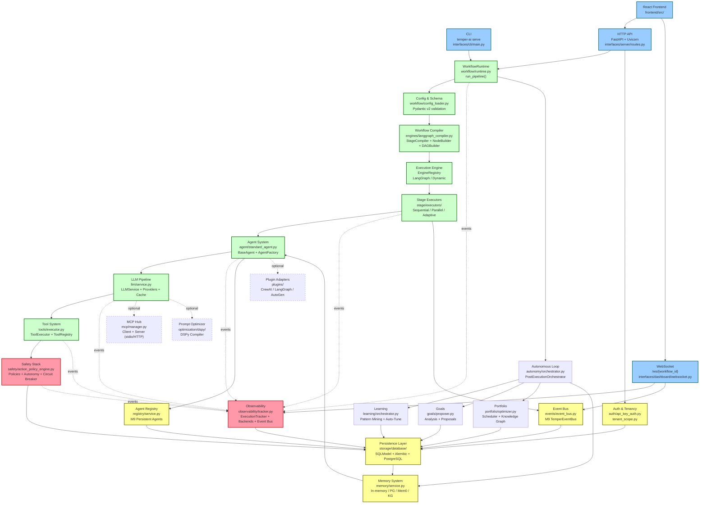
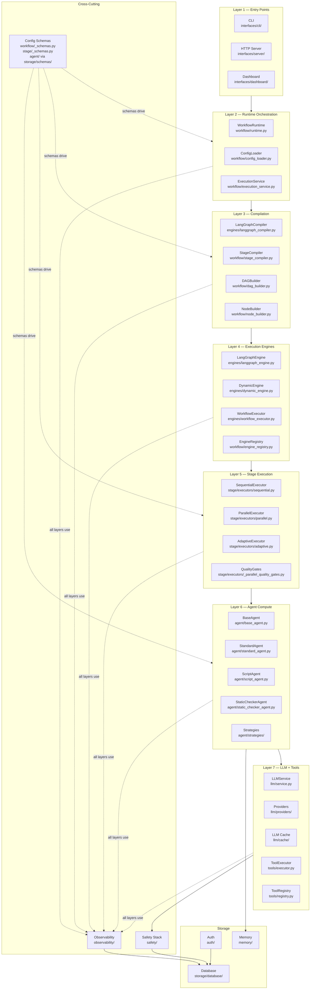
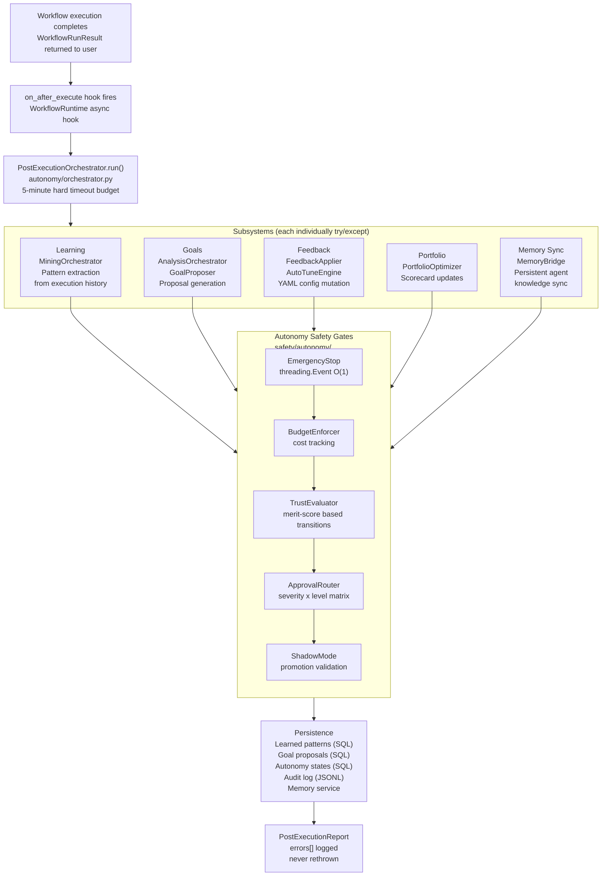
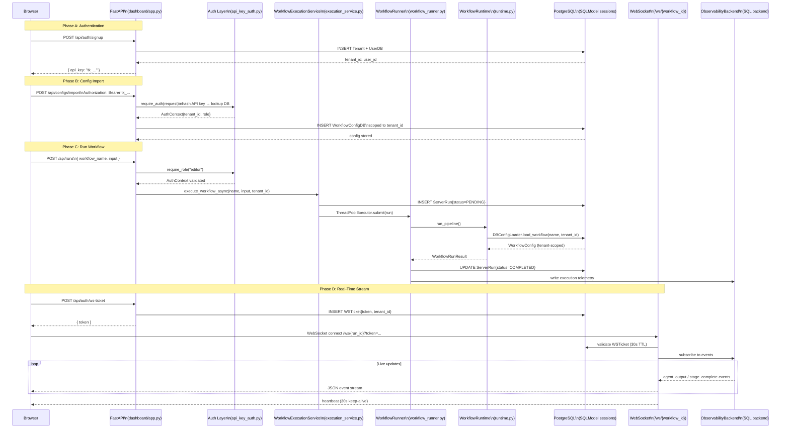
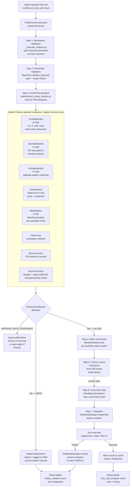
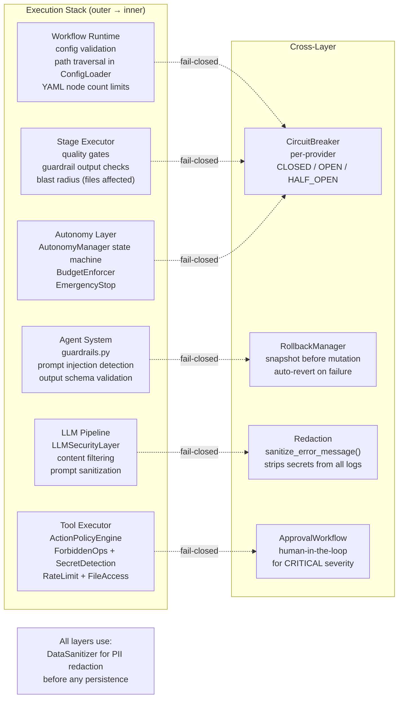
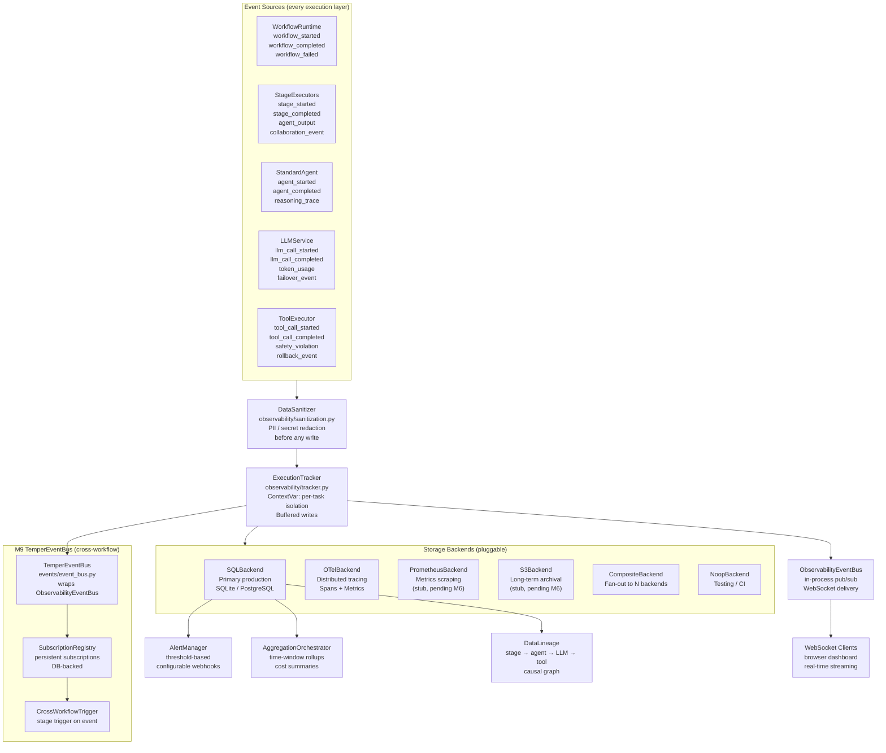
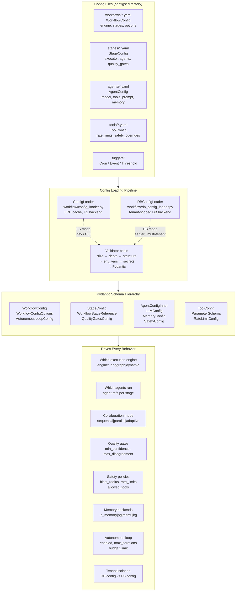
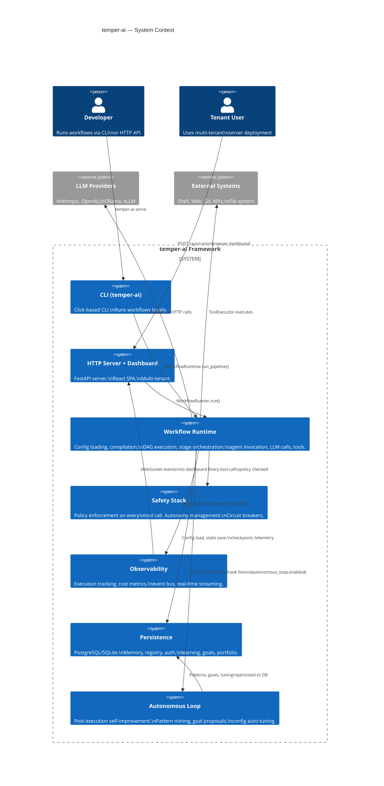

# temper-ai — Master System Architecture

**Document:** 00-system-architecture.md
**System:** temper-ai (Meta-Autonomous Framework)
**Version:** Post-M10 (Multi-Tenant Access Control complete)
**Date:** 2026-02-22
**Status:** Capstone reference — synthesizes all 16 architecture documents

---

## Table of Contents

1. [Executive Summary](#1-executive-summary)
2. [System Architecture Map](#2-system-architecture-map)
3. [Component Summary Table](#3-component-summary-table)
4. [Primary Data Flows](#4-primary-data-flows)
   - 4.1 [Happy-Path Request Flow](#41-happy-path-request-flow)
   - 4.2 [Autonomous Feedback Loop](#42-autonomous-feedback-loop)
   - 4.3 [Multi-Tenant Server Flow](#43-multi-tenant-server-flow)
   - 4.4 [Safety Interception Points](#44-safety-interception-points)
5. [Cross-Cutting Concerns](#5-cross-cutting-concerns)
   - 5.1 [Safety Composition Across Layers](#51-safety-composition-across-layers)
   - 5.2 [Observability Tracking Across Layers](#52-observability-tracking-across-layers)
   - 5.3 [Configuration as the Universal Driver](#53-configuration-as-the-universal-driver)
6. [Design Principles](#6-design-principles)
7. [Reading Guide](#7-reading-guide)
8. [Codebase Statistics](#8-codebase-statistics)

---

## 1. Executive Summary

### What is temper-ai?

temper-ai is a production-grade, multi-agent AI workflow orchestration framework. Users define pipelines as YAML files — declaring stages, which agents run in each stage, how they collaborate, and when the pipeline branches or loops — and then execute those pipelines via the HTTP API (`POST /api/runs`) served by `temper-ai serve`. The framework turns declarative configuration into a live multi-agent execution graph, with every agent backed by a configurable LLM provider and equipped with tool access to interact with external systems.

The framework operates at two levels simultaneously. At the workflow level, it provides a DAG-based execution engine (built on LangGraph) that routes between stages, handles fan-out and fan-in for parallel agents, evaluates conditions, supports loop-back for iterative refinement, and persists checkpoints for resume. At the agent level, it provides a full LLM call pipeline — prompt templating, tool-calling loops, multi-round collaboration strategies, output guardrails, structured output validation, provider failover, response caching, and streaming — wrapped in a safety stack that intercepts every tool call before execution.

Beyond single-run execution, temper-ai includes a continuous self-improvement layer. When the workflow YAML has `autonomous_loop.enabled: true`, a post-execution feedback loop mines patterns from execution history, proposes configuration improvements via a goals system, applies approved changes through an auto-tune engine, and synchronizes learnings into persistent agent memory — all without blocking the user's primary result. The system also supports multi-tenant server deployment (M10) with API key authentication, per-tenant config isolation, a React-based dashboard with real-time WebSocket streaming, and a visual Workflow Studio for editing pipelines in-browser.

### Technology Stack Summary

| Layer | Technology |
|---|---|
| Language | Python 3.11+ with full type annotations |
| CLI Framework | Click + Rich (output rendering) |
| HTTP Server | FastAPI + Uvicorn |
| Workflow Engine (primary) | LangGraph (StateGraph / Pregel) |
| Workflow Engine (secondary) | DynamicExecutionEngine (Python loop) |
| Database ORM | SQLModel (Pydantic + SQLAlchemy hybrid) |
| Primary Database | PostgreSQL (production) / SQLite (dev/test) |
| Migrations | Alembic (version-controlled DDL) |
| Config Validation | Pydantic v2 (BaseModel, field_validator, model_validator) |
| Config Parsing | PyYAML (safe_load only) |
| Prompt Templating | Jinja2 (ImmutableSandboxedEnvironment — SSTI-safe) |
| LLM Providers | Anthropic (Claude), OpenAI (GPT), Ollama (local), vLLM (self-hosted) |
| HTTP Client | httpx (async/sync, HTTP/2, connection pooling) |
| Token Counting | tiktoken (optional, accurate) |
| Frontend | React 18 + TypeScript + ReactFlow + Zustand + TanStack Query + Tailwind CSS |
| Tracing (optional) | OpenTelemetry SDK |
| Secret Handling | cryptography.Fernet (in-memory obfuscation), HMAC-SHA256 (API keys, cache keys) |
| Semantic Similarity | SentenceTransformers (optional, convergence checks) |
| Prompt Optimization | DSPy (optional, R7) |
| Agent Plugins | CrewAI, LangGraph, OpenAI Agents, AutoGen (plugin adapters, R6) |

### Key Design Principles (synthesized from all 16 documents)

1. **Configuration as the single source of truth.** Every behavior — which agents run, which tools they can use, how they collaborate, what safety policies apply, whether output is streamed — is declared in YAML and validated through a multi-stage Pydantic pipeline before any execution begins.

2. **Defense in depth.** No single safety check is sufficient. Every tool call traverses at least six independent enforcement layers: workspace validation, parameter validation, policy check (ActionPolicyEngine), rate limiting, cache lookup, and auto-rollback on failure. Policy execution errors themselves produce CRITICAL violations; the system defaults to deny when no policies are registered.

3. **Fail-closed autonomy.** The autonomous loop never blocks the primary result and never propagates its own failures. Subsystems are individually wrapped with five-minute budgets, and all errors are logged to the audit trail without crashing the loop.

4. **Pluggable everything.** Providers, backends, executors, strategies, tools, and memory adapters are all registered through protocol-based registries. Adding a new LLM provider means implementing one ABC and registering it; adding a new collaboration strategy means implementing one ABC and adding a YAML name.

5. **Observability as a first-class citizen.** Every significant operation — from workflow start to individual token consumption — emits structured events that are sanitized, buffered, and written to pluggable backends. The system never logs raw LLM output without first applying PII and secret redaction.

6. **Tenant isolation at every layer.** In server mode, the `tenant_id` from the `AuthContext` is injected into every database query via `scoped_query()`. There is no single query that returns cross-tenant data without an explicit tenant scope override.

---

## 2. System Architecture Map

### 2.1 Full Subsystem Interaction Map



### 2.2 Module Dependency Layers



---

## 3. Component Summary Table

| # | Subsystem | Purpose | Key Classes / Files | Est. Source Files | Doc |
|---|---|---|---|---|---|
| 01 | **Request Lifecycle** | Entry points and shared runtime pipeline | `WorkflowRuntime`, `ExecutionHooks`, `RuntimeConfig`, `InfrastructureBundle` | ~12 | [01](01-request-lifecycle.md) |
| 02 | **Config & Schemas** | YAML parsing → Pydantic validation → typed objects | `ConfigLoader`, `DBConfigLoader`, `WorkflowConfig`, `StageConfig`, `AgentConfig` | ~15 | [02](02-config-schemas.md) |
| 03 | **Workflow Compilation** | DAG construction, checkpoint, state management | `LangGraphCompiler`, `StageCompiler`, `DAGBuilder`, `NodeBuilder`, `CheckpointManager` | ~18 | [03](03-workflow-compilation.md) |
| 04 | **Execution Engines** | Run compiled graphs; dynamic routing, state merging | `EngineRegistry`, `LangGraphExecutionEngine`, `DynamicExecutionEngine`, `WorkflowExecutor` | ~14 | [04](04-execution-engines.md) |
| 05 | **Stage Executors** | Fan-out/fan-in, agent orchestration, quality gates | `SequentialStageExecutor`, `ParallelStageExecutor`, `AdaptiveStageExecutor` | ~16 | [05](05-stage-executors.md) |
| 06 | **Agent System** | LLM agent lifecycle, strategies, guardrails, reasoning | `BaseAgent`, `StandardAgent`, `AgentFactory`, `CollaborationStrategy` (9 strategies) | ~20 | [06](06-agent-system.md) |
| 07 | **LLM Pipeline** | Provider-agnostic LLM calls, caching, failover, streaming | `LLMService`, `BaseLLMProvider`, `FailoverProvider`, `LLMCache`, `PromptEngine` | ~28 | [07](07-llm-pipeline.md) |
| 08 | **Tool System** | Safe, observable tool execution with layered security | `ToolExecutor`, `ToolRegistry`, `BaseTool` + 10 built-in tools | ~24 | [08](08-tool-system.md) |
| 09 | **Safety Stack** | Defense-in-depth policy enforcement + autonomy management | `ActionPolicyEngine`, `PolicyRegistry`, `AutonomyManager`, `CircuitBreaker`, `RollbackManager` | ~45 | [09](09-safety-stack.md) |
| 10 | **Observability & Events** | Execution tracking, metric aggregation, event bus | `ExecutionTracker`, `ObservabilityEventBus`, `TemperEventBus`, `CompositeBackend`, `AlertManager` | ~45 | [10](10-observability-events.md) |
| 11 | **Persistence Layer** | All data durability — DB, auth, memory, registry | `DatabaseManager`, `MemoryService`, `AgentRegistry`, `ConfigSyncService` | ~55 | [11](11-persistence-layer.md) |
| 12 | **Server & Frontend** | API, WebSocket, dashboard, Workflow Studio | `FastAPI app`, `WorkflowExecutionService`, `StudioService`, React SPA | ~40 | [12](12-server-frontend.md) |

---

## 4. Primary Data Flows

### 4.1 Happy-Path Request Flow

This is the complete path from `POST /api/runs` to workflow output.

```mermaid
flowchart LR
    U["Client\nHTTP API"] --> A

    subgraph A["Phase 1: API Entry\ninterfaces/server/routes.py"]
        A1["POST /api/runs\n{ workflow_name, input }"]
        A2["WorkflowExecutionService\nexecute_workflow_async()"]
        A1 --> A2
    end

    A --> B

    subgraph B["Phase 2: Config Load\nworkflow/runtime.py load_config()"]
        B1["YAML safe_load\nsize + depth limits"]
        B2["Env var substitution\ncharacter whitelisting"]
        B3["Secret resolution\nFernet obfuscation"]
        B4["Pydantic validation\nWorkflowConfig"]
        B1 --> B2 --> B3 --> B4
    end

    B --> C

    subgraph C["Phase 3: Compile\nengines/langgraph_compiler.py"]
        C1["StageCompiler\nStateGraph creation"]
        C2["DAGBuilder\ntopological sort"]
        C3["NodeBuilder\nstage node closures"]
        C4["graph.compile()\n→ Pregel"]
        C1 --> C2 --> C3 --> C4
    end

    C --> D

    subgraph D["Phase 4: Execute\nengines/langgraph_engine.py"]
        D1["Build initial state dict"]
        D2["compiled.invoke(state)"]
        D3["Stage routing\n_next_stage signals"]
        D1 --> D2 --> D3
    end

    D --> E

    subgraph E["Phase 5: Stage Executor\nstage/executors/sequential.py"]
        E1["AgentFactory.create()\nper agent config"]
        E2["run_all_agents()\nsequential / parallel"]
        E3["CollaborationStrategy\nsynthesis"]
        E4["Quality gates\nvalidation"]
        E1 --> E2 --> E3 --> E4
    end

    E --> F

    subgraph F["Phase 6: Agent LLM Loop\nagent/standard_agent.py"]
        F1["Reasoning pass\n(optional)"]
        F2["LLMService.run()\nprompt + tools"]
        F3["Tool-calling loop\nmax_iterations"]
        F4["Guardrails check\noutput validation"]
        F1 --> F2 --> F3 --> F4
    end

    F --> G

    subgraph G["Phase 7: LLM + Tools\nllm/service.py + tools/executor.py"]
        G1["Cache lookup\nSHA-256 key"]
        G2["Provider call\nAnthropic/OpenAI/vLLM/Ollama"]
        G3["Tool call dispatch\nToolExecutor.execute()"]
        G4["Safety policy check\nActionPolicyEngine"]
        G1 --> G2 --> G3 --> G4
    end

    G --> H

    subgraph H["Phase 8: Result\ninterfaces/server/workflow_runner.py"]
        H1["WorkflowRunResult\nstate extraction"]
        H2["ServerRun record\nstatus + output"]
        H3["Autonomous loop\n(if autonomous_loop.enabled)"]
        H1 --> H2 --> H3
    end
```



### 4.2 Autonomous Feedback Loop

After every execution where the workflow config has `autonomous_loop.enabled: true`, a post-execution orchestrator runs independently of the primary result delivery.



### 4.3 Multi-Tenant Server Flow



### 4.4 Safety Interception Points

Every tool call passes through this pipeline before the actual tool executes.



---

## 5. Cross-Cutting Concerns

### 5.1 Safety Composition Across Layers

Safety is not a single gate — it operates at every layer of the stack with different policies appropriate to that layer.



### 5.2 Observability Tracking Across Layers

Every layer emits structured events into the same `ExecutionTracker`, which buffers and fans out to pluggable backends.



### 5.3 Configuration as the Universal Driver

Configuration drives every behavioral decision in the system. No behavior is hardcoded without a corresponding YAML override.



---

## 6. Design Principles

### 6.1 Patterns Identified Across All 16 Documents

**Template Method Pattern — Agent and Executor ABCs**
`BaseAgent` defines `execute()` / `aexecute()` as the skeleton algorithm, calling `_run()` / `_arun()` as abstract hooks. Subclasses (`StandardAgent`, `ScriptAgent`, `StaticCheckerAgent`) override only the innermost logic. Similarly, `BaseStageExecutor` defines the stage orchestration skeleton while delegating agent creation and synthesis to subclasses. This pattern appears in at least 6 subsystems.

**Registry + Factory Pattern — Tools, Agents, Engines, Strategies**
Every pluggable component has a singleton registry (thread-safe dict or enum dispatch) and a factory function that takes a schema and returns an instance. `EngineRegistry`, `ToolRegistry`, `StrategyRegistry`, `AgentFactory`, `PolicyRegistry` all follow this model. Adding a new implementation requires only one ABC implementation and one registry registration call.

**Protocol-Based Structural Typing**
Rather than requiring inheritance from a shared base class, most integration points use Python `Protocol` definitions. `BaseLLMProvider`, `ObservabilityBackend`, `ParallelRunner`, `CheckpointBackend`, `MemoryAdapter`, `StageExecutor` are all protocols. This allows third-party frameworks (LangGraph nodes, CrewAI agents) to satisfy interfaces without subclassing temper-ai classes.

**Composition Over Inheritance for Safety**
The `PolicyComposer` and `PolicyRegistry` build a composable tree of `BaseSafetyPolicy` objects at startup. A single call to `ActionPolicyEngine.validate_action()` fans out to all registered policies. New policies are added to the composition at `create_safety_stack()` time without modifying existing policies. The fail-closed default means an empty policy set denies all actions.

**Hook-Based Extensibility at Runtime**
`WorkflowRuntime` exposes `ExecutionHooks` — named callbacks injected at `on_config_loaded`, `on_state_built`, and `on_after_execute`. The CLI uses these hooks to inject `StreamDisplay`, the autonomous loop, and the planning pass. The server uses them for run status updates. This allows caller-specific behavior without modifying the core runtime.

**Barrier Node Synchronization for Parallel Fan-In**
When multiple parallel agents need to converge before the next stage, the `StageCompiler` inserts synthetic barrier nodes into the LangGraph `StateGraph`. These barrier nodes act as join points, using annotated reducers on `LangGraphWorkflowState` fields to merge parallel outputs safely. The state merging algorithm resolves conflicts by preserving non-None values and collecting list fields additively.

**SKIP_TO_END Signal for Conditional Short-Circuit**
When a quality gate or condition evaluator decides the workflow should stop early (e.g., a discovery stage rejects a task), it writes `_skip_to_end: True` into the state dict. Every subsequent stage checks this signal before doing work. This avoids complex conditional edge wiring for the common case of early termination.

**Re-Export Shims for Backward Compatibility**
When a module is split into smaller pieces (e.g., `langgraph_engine.py` → `engines/langgraph_engine.py`), the original path is kept as a thin module that re-exports everything from the new location. This pattern appears throughout the codebase (`workflow/langgraph_engine.py`, `observability/aggregation.py`, `stage/stage_compiler.py`) and prevents breaking imports in downstream code.

**Content-Addressed Caching**
Both the LLM response cache (`llm/cache/llm_cache.py`) and the tool result cache (`tools/tool_cache.py`) use SHA-256 hashes of the request content as cache keys. This provides exact deduplication without per-component cache invalidation logic. The LLM cache additionally incorporates `tenant_id` and `user_id` into the key for tenant isolation.

**Lazy Import Pattern for Fan-Out Control**
Modules with many inter-subsystem imports (particularly `workflow/_schemas.py`) use lazy imports inside methods rather than at module level. This prevents circular import chains and keeps the module fan-out (number of distinct imported modules) below the 8-module architectural limit. The `AutonomousLoopConfig` field factory is the canonical example.

### 6.2 Key Architectural Decisions

| Decision | Rationale | Trade-off |
|---|---|---|
| Two execution engines (LangGraph + Dynamic) | LangGraph provides production-grade checkpointing and graph visualization; Dynamic provides simple Python loop for debugging | Increased complexity; engine selection via YAML `engine:` field |
| Pydantic v2 for all config validation | Field validators and model validators run at parse time, not execute time; type safety throughout | Verbose schema definitions; migration effort from v1 |
| PyYAML `safe_load` only | Prevents arbitrary Python object construction from YAML | No custom constructors; struct-based config only |
| ImmutableSandboxedEnvironment for Jinja2 | SSTI prevention; no access to `__class__`, `__mro__`, `os`, `sys` in templates | No dynamic Python in prompt templates |
| HMAC-SHA256 for API keys (not bcrypt) | Fast O(1) verification; bcrypt is unnecessary for randomly-generated tokens with high entropy | Keys must be regenerated if the HMAC secret rotates |
| `fail_open=False` default for safety | Production-safe: no action allowed without explicit policy permission | Must register policies at startup or all tool calls fail |
| Post-execution autonomous loop (not blocking) | User gets primary result immediately; self-improvement is a side effect | Async failures in the loop are silent unless audit log is checked |
| Per-route `Depends(require_auth)` not global middleware | Backward compatibility: dev mode skips auth entirely; specific routes opt in | Risk of accidentally unauthenticated routes if a new route omits `Depends` |
| ThreadPoolExecutor for blocking workflow work in server mode | asyncio event loop is not blocked by LLM network calls | Context variables must be propagated manually into thread pool workers |

### 6.3 What Makes This Architecture Unique

**Graduated autonomy with circuit breakers and merit scores.** Most AI orchestration frameworks either run workflows deterministically or rely entirely on LLM judgment. temper-ai adds a structured autonomy state machine (`AutonomyManager`) that gates what the system is allowed to do based on a computed trust score derived from historical performance metrics. The system literally earns its own permissions over time.

**Configuration mutation as a first-class capability.** The `AutoTuneEngine` and `FeedbackApplier` can modify YAML configuration files as part of normal workflow operation. This is not a debug feature — it is the mechanism by which the autonomous loop improves the system over time. The safety stack wraps these mutations with the same policies that apply to any other tool call.

**Unified multi-round collaboration strategies.** Rather than having separate debate, dialogue, and multi-round implementations, the framework unifies them into a single `MultiRoundStrategy` ABC with `DebateAndSynthesize` and `DialogueOrchestrator` as thin shims. The strategy registry makes collaboration mode a single YAML string: `collaboration_strategy: debate`.

**Event-triggered stages (M9).** Workflow stages can be configured to fire in response to cross-workflow events via the `TemperEventBus`. This allows one workflow's completion to trigger a stage in another workflow without polling, making the framework capable of event-driven multi-workflow pipelines.

---

## 7. Reading Guide

### 7.1 Document Summaries

| Doc | Title | Summary | When to Read |
|---|---|---|---|
| **01** | Request Lifecycle | Traces both CLI and HTTP server entry points through `WorkflowRuntime.run_pipeline()` — the 10-step canonical execution pipeline. Covers `ExecutionHooks`, `InfrastructureBundle`, `RuntimeConfig`, server delegation, and graceful shutdown. | Start here to understand how any request enters the system. |
| **02** | Config & Schemas | Complete reference for the YAML-to-Pydantic pipeline: size/depth limits, env var substitution character whitelisting, secret resolution, migration BFS path finding, and every field in `WorkflowConfig` / `StageConfig` / `AgentConfig`. | Read when writing or debugging configuration, or when adding a new config field. |
| **03** | Workflow Compilation | Covers the full DAG construction pipeline: `LangGraphCompiler` → `StageCompiler` → `DAGBuilder` → `NodeBuilder` → barrier node insertion → `graph.compile()` → checkpoint integration. | Read when adding new DAG topologies, debugging graph compilation errors, or implementing checkpoints. |
| **04** | Execution Engines | Deep reference for both `LangGraphExecutionEngine` and `DynamicExecutionEngine`, including `WorkflowExecutor`'s DAG-walking loop, parallel `ThreadPoolExecutor`, state merging algorithm, `_next_stage` signal protocol, and `SKIP_TO_END`. | Read when debugging execution routing, adding a new engine, or understanding how stage outputs flow between stages. |
| **05** | Stage Executors | Exhaustive reference for all three executor modes (sequential/parallel/adaptive), quality gates, retry logic with backoff, collaboration strategy invocation, synthesis, and the full `StateKeys` dictionary contract. | Read when modifying how stages run, adding new collaboration modes, or debugging stage-level failures. |
| **06** | Agent System | Complete lifecycle documentation: `BaseAgent` Template Method, `StandardAgent` LLM loop, `ScriptAgent`, `StaticCheckerAgent`, `AgentFactory` dispatch, `AgentObserver`, all 9 collaboration strategies, guardrails, and M9 persistent context injection. | Read when modifying agent behavior, adding new strategies, or understanding what happens inside a single agent invocation. |
| **07** | LLM Pipeline | Complete reference for `LLMService`: tool-calling loop, all four provider implementations, content-addressed cache, failover with sticky-session semantics, prompt engine, streaming (NDJSON/SSE), structured output validation, and per-model pricing. | Read when integrating a new LLM provider, debugging LLM call failures, or understanding cost tracking. |
| **08** | Tool System | Reference for `ToolRegistry`, `ToolExecutor` 10-step pipeline, all 10 built-in tools (Bash, Calculator, CodeExecutor, FileWriter, Git, HTTPClient, JSONParser, WebScraper, SearXNGSearch, TavilySearch), rate limiting, caching, and safety integration. | Read when adding a new tool, debugging tool execution, or understanding the safety pipeline. |
| **09** | Safety Stack | Complete documentation of all 9 safety policies (with priority numbers), `ActionPolicyEngine` composition, approval workflow, circuit breaker state machine, rollback system, LLM security layer, and the full autonomy management subsystem (`AutonomyManager`, `TrustEvaluator`, `BudgetEnforcer`, `ApprovalRouter`, `ShadowMode`, `EmergencyStop`). | Essential reading for security reviewers and anyone modifying safety policies. |
| **10** | Observability & Events | Covers `ExecutionTracker`, all five backends (SQL, OTel, Prometheus, S3, Noop), `CompositeBackend`, `ObservabilityBuffer`, `DataSanitizer`, `AlertManager`, 9 specialized metric trackers, and the M9 `TemperEventBus` with `SubscriptionRegistry` and `CrossWorkflowTrigger`. | Read when adding instrumentation, debugging telemetry, or implementing a new observability backend. |
| **11** | Persistence Layer | Database schema reference, session management, all 10+ DB model groups (observability, tenancy, auth, memory, registry, lifecycle, goals, portfolio, learning, autonomy, events), Alembic migration history, and the memory adapter hierarchy. | Read when modifying the database schema, understanding multi-tenant isolation, or working with persistent agent memory. |
| **12** | Server & Frontend | FastAPI application factory, middleware stack, all route groups, `WorkflowExecutionService`, `DashboardDataService`, `StudioService`, WebSocket lifecycle (tickets, heartbeat, DB polling loop), and React frontend architecture (Zustand stores, ReactFlow DAG, TanStack Query). | Read when adding new API endpoints, modifying the dashboard, or debugging WebSocket streaming. |
| **13** | *(Removed — CLI-specific trace superseded by HTTP API workflow)* | See doc **15** (Multi-Tenant Flow) for the current end-to-end trace via `POST /api/runs`. | — |
| **14** | Flow: Autonomous Loop | Traces `--autonomous` from CLI flag through `PostExecutionOrchestrator` → Learning → Goals → Feedback → Portfolio → Memory Sync, with detailed coverage of all autonomy safety gates, the trust evaluation decision tree, and audit trail persistence. | Read when working on the self-improvement layer, debugging autonomous mode failures, or understanding the safety gates around config mutation. |
| **15** | Flow: Multi-Tenant | Complete server-mode lifecycle: startup, tenant signup, API key HMAC generation, config import/export, workflow execution via API, WebSocket ticket exchange, streaming loop, dashboard result viewing, and all six tenant isolation enforcement points. | Essential reading for ops engineers deploying temper-ai as a multi-tenant service. |
| **16** | Flow: Safety & Errors | Eight failure scenario traces: forbidden operation blocked, secret in LLM output, LLM provider failure with failover, tool failure with rollback, circuit breaker trip, approval for high-risk action, emergency stop, and stage retry with exponential backoff. Includes exception hierarchy and error propagation model. | Read when debugging production failures, implementing error handling, or understanding failure modes. |

### 7.2 Suggested Reading Orders

**New Developer (understanding the full system)**
1. Start with doc **15** (Multi-Tenant Flow) — see the whole system working via the HTTP API
2. Read doc **01** (Request Lifecycle) — understand the entry points and runtime
3. Read doc **02** (Config & Schemas) — understand how YAML becomes code
4. Read doc **06** (Agent System) — understand the compute unit
5. Read doc **05** (Stage Executors) — understand how agents are orchestrated
6. Read doc **07** (LLM Pipeline) — understand how LLM calls work
7. Read doc **08** (Tool System) — understand tool execution
8. Read docs **03** and **04** (Compilation and Engines) — understand the graph
9. Read docs **09**, **10**, **11** (Safety, Observability, Persistence) — understand infrastructure
10. Read docs **14**, **15**, **16** (Flow traces) — understand advanced scenarios

**Security Reviewer**
1. Doc **09** (Safety Stack) — complete safety architecture
2. Doc **16** (Safety & Error Flows) — failure mode traces
3. Doc **02** (Config & Schemas) — input validation pipeline
4. Doc **08** (Tool System) sections 9-10 (rate limiting, safety integration)
5. Doc **15** (Multi-Tenant Flow) sections 11 (security design decisions)
6. Doc **07** (LLM Pipeline) section 17 (safety integration)

**Ops / DevOps Engineer**
1. Doc **15** (Multi-Tenant Server Flow) — server deployment lifecycle
2. Doc **12** (Server & Frontend) — FastAPI app, middleware, routes
3. Doc **11** (Persistence Layer) — database schema and Alembic migrations
4. Doc **01** (Request Lifecycle) sections 4, 7 (server path, shutdown)
5. Doc **10** (Observability) — backend configuration and alerting
6. Doc **09** (Safety Stack) section 14 (autonomy management configuration)

**Adding a New Feature (e.g., new LLM provider)**
1. Doc **07** (LLM Pipeline) — provider ABC, factory, failover registration
2. Doc **06** (Agent System) — how agents invoke the provider
3. Doc **13** (Happy Path) section 10.5 — provider call trace

**Adding a New Collaboration Strategy**
1. Doc **06** (Agent System) sections 13-15 — strategy ABC, registry, existing strategies
2. Doc **05** (Stage Executors) section 12 — how strategies are invoked from executors
3. Doc **13** (Happy Path) section 9.2 — parallel+leader stage trace

---

## 8. Codebase Statistics

### 8.1 Scale

| Metric | Value |
|---|---|
| Total Python source files (`temper_ai/`) | ~350+ files |
| Total Python test files (`tests/`) | ~200+ files |
| Total test functions (`def test_*`) | ~675+ (58 files sampled) |
| Total source classes | ~500+ (across all modules) |
| Architecture documents (this series) | 17 (including this master doc) |
| Total lines in architecture documents | ~31,000+ lines |
| Mermaid diagrams in architecture docs | ~100+ diagrams |
| Built-in tools | 10 |
| LLM providers | 4 (Anthropic, OpenAI, Ollama, vLLM) |
| Memory adapters | 4 (in-memory, PostgreSQL, Mem0, Knowledge Graph) |
| Observability backends | 5 (SQL, OTel, Prometheus, S3, Noop) |
| Collaboration strategies | 9 (consensus, concatenate, multi-round, debate, dialogue, leader, conflict-resolution, merit-weighted, human-escalation) |
| Safety policies | 9 (forbidden-ops, secret-detection, blast-radius, file-access, window-rate-limit, token-bucket, resource-limit, config-change, prompt-injection) |
| Alembic migrations | 5+ (initial schema, M9 event bus, M10 multi-tenant, P1 tenant-scope x2) |
| Milestones completed | 18+ (M1-M10 + R0-R7) |

### 8.2 Key File Locations Reference

```
temper_ai/
├── interfaces/cli/main.py           ← CLI entry point (temper-ai command)
├── interfaces/dashboard/app.py      ← FastAPI application factory
├── interfaces/server/routes.py      ← Workflow API routes (POST /api/runs)
├── interfaces/server/auth_routes.py ← Auth API routes (M10)
├── workflow/runtime.py              ← WorkflowRuntime.run_pipeline()
├── workflow/config_loader.py        ← ConfigLoader (FS + LRU cache)
├── workflow/db_config_loader.py     ← DBConfigLoader (multi-tenant, M10)
├── workflow/engines/
│   ├── langgraph_compiler.py        ← LangGraphCompiler (main compilation)
│   ├── langgraph_engine.py          ← LangGraphExecutionEngine
│   ├── dynamic_engine.py            ← DynamicExecutionEngine
│   └── workflow_executor.py        ← WorkflowExecutor (DAG walker)
├── workflow/stage_compiler.py       ← StageCompiler (node + edge wiring)
├── workflow/dag_builder.py          ← DAGBuilder (topological sort)
├── workflow/node_builder.py         ← NodeBuilder (stage node closures)
├── workflow/execution_service.py    ← WorkflowExecutionService (server mode)
├── stage/executors/
│   ├── sequential.py                ← SequentialStageExecutor
│   ├── parallel.py                  ← ParallelStageExecutor
│   └── adaptive.py                  ← AdaptiveStageExecutor
├── agent/
│   ├── base_agent.py                ← BaseAgent ABC (Template Method)
│   ├── standard_agent.py            ← StandardAgent (LLM + Tool loop)
│   ├── script_agent.py              ← ScriptAgent (zero-LLM, subprocess)
│   ├── static_checker_agent.py      ← StaticCheckerAgent
│   └── strategies/                  ← 9 collaboration strategy classes
│       └── registry.py              ← StrategyRegistry singleton
├── llm/
│   ├── service.py                   ← LLMService (main public API)
│   ├── failover.py                  ← FailoverProvider
│   ├── cache/llm_cache.py           ← Content-addressed response cache
│   ├── prompts/engine.py            ← PromptEngine (Jinja2 sandbox)
│   └── providers/                   ← anthropic, openai, ollama, vllm
├── tools/
│   ├── executor.py                  ← ToolExecutor (10-step pipeline)
│   ├── registry.py                  ← ToolRegistry singleton
│   └── {bash,calculator,...}.py     ← 10 built-in tool implementations
├── safety/
│   ├── action_policy_engine.py      ← ActionPolicyEngine (central enforcement)
│   ├── factory.py                   ← create_safety_stack()
│   ├── policy_registry.py           ← PolicyRegistry (routing)
│   ├── autonomy/
│   │   ├── manager.py               ← AutonomyManager state machine
│   │   ├── trust_evaluator.py       ← Merit-based trust scoring
│   │   ├── budget_enforcer.py       ← Cost budget enforcement
│   │   └── emergency_stop.py        ← O(1) cross-thread stop signal
│   └── {forbidden_operations,...}.py ← 9 concrete policy implementations
├── observability/
│   ├── tracker.py                   ← ExecutionTracker (central hub)
│   ├── event_bus.py                 ← ObservabilityEventBus
│   └── backends/                    ← sql, otel, prometheus, s3, composite, noop
├── events/
│   ├── event_bus.py                 ← TemperEventBus (M9 cross-workflow)
│   └── subscription_registry.py    ← Persistent event subscriptions
├── auth/
│   ├── api_key_auth.py              ← require_auth(), require_role() (M10)
│   └── tenant_scope.py             ← scoped_query() tenant isolation (M10)
├── storage/database/
│   ├── manager.py                   ← DatabaseManager + session factory
│   ├── models.py                    ← Core observability DB models
│   ├── models_tenancy.py            ← M10 tenancy models
│   └── models_registry.py          ← M9 agent registry models
├── memory/service.py                ← MemoryService (namespace-based)
├── registry/service.py              ← AgentRegistry service (M9)
├── autonomy/orchestrator.py         ← PostExecutionOrchestrator
├── learning/orchestrator.py         ← MiningOrchestrator
├── goals/proposer.py                ← GoalProposer
└── optimization/dspy/               ← DSPy prompt optimization (R7)
```

### 8.3 Mermaid Diagrams Across Architecture Series

| Doc | Diagrams | Notable Diagram Types |
|---|---|---|
| 01 Request Lifecycle | 7 | flowchart (CLI+API paths), sequence (run + server mode), state (execution status), flowchart (hook injection) |
| 02 Config & Schemas | 6 | flowchart (pipeline stages), classDiagram (schema hierarchy), flowchart (env var substitution, secret resolution) |
| 03 Workflow Compilation | 8+ | flowchart (compilation pipeline), classDiagram (DAG structures), sequence (compile phases), state (checkpoint lifecycle) |
| 04 Execution Engines | 7 | flowchart (engine selection), classDiagram (engine ABCs), sequence (dynamic execution loop), state (parallel merge) |
| 05 Stage Executors | 8+ | flowchart (executor modes), classDiagram (executor hierarchy), sequence (parallel quality gates), state (retry logic) |
| 06 Agent System | 8+ | classDiagram (BaseAgent hierarchy), flowchart (strategy dispatch), sequence (LLM loop), state (guardrail checks) |
| 07 LLM Pipeline | 8 | flowchart (provider call path), sequence (tool-calling loop), flowchart (failover), state (cache hit/miss), sequence (streaming) |
| 08 Tool System | 7 | flowchart (execution pipeline), classDiagram (BaseTool), sequence (safety check), flowchart (rollback) |
| 09 Safety Stack | 9+ | flowchart (policy composition), classDiagram (policy hierarchy), sequence (approval workflow), state (circuit breaker), state (autonomy levels), flowchart (trust evaluation) |
| 10 Observability | 8+ | flowchart (tracking pipeline), classDiagram (backend hierarchy), sequence (event bus), flowchart (sanitization), sequence (WS delivery) |
| 11 Persistence Layer | 7 | classDiagram (DB models), flowchart (session management), sequence (tenant isolation), flowchart (memory adapters) |
| 12 Server & Frontend | 6 | flowchart (FastAPI middleware), sequence (WebSocket lifecycle), flowchart (studio CRUD), component (React store relationships) |
| 13 Flow: Happy Path | *(Removed)* | *(Superseded by doc 15 — Multi-Tenant Flow)* |
| 14 Flow: Autonomous Loop | 7 | flowchart (complete loop), sequence (full iteration), flowchart (trust + budget decision tree), flowchart (feedback generation), state (loop states), matrix (approval router), state (goal proposals) |
| 15 Flow: Multi-Tenant | 8 | flowchart (server startup), sequence (tenant onboarding), flowchart (auth pipeline), sequence (workflow via API), sequence (WebSocket lifecycle), flowchart (tenant isolation), flowchart (config management), state (full server state machine) |
| 16 Flow: Safety & Errors | 7 | flowchart (safety topology), state (exception hierarchy), sequence (each of 8 failure scenarios), flowchart (error propagation) |
| **00 Master (this doc)** | **10** | flowchart (full system map), flowchart (module layers), flowchart (happy path), flowchart (autonomous loop), sequence (multi-tenant), flowchart (safety intercepts), flowchart (safety cross-cutting), flowchart (observability), flowchart (config driver), flowchart (layer dependencies) |

---

## Appendix: Quick Orientation Diagram

For anyone opening this documentation for the first time, this single diagram shows where the most important code lives relative to what a user experiences.



---

*This document synthesizes information from 16 detailed architecture documents (01-16) written 2026-02-22. Each subsystem document contains exhaustive file-level analysis, complete field references, extension guides, and additional Mermaid diagrams. Consult the individual documents for implementation-level detail.*
