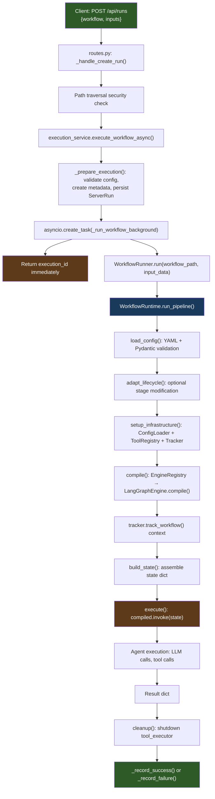
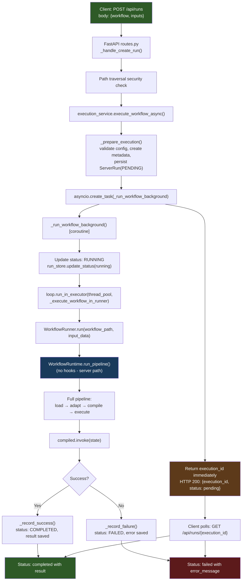
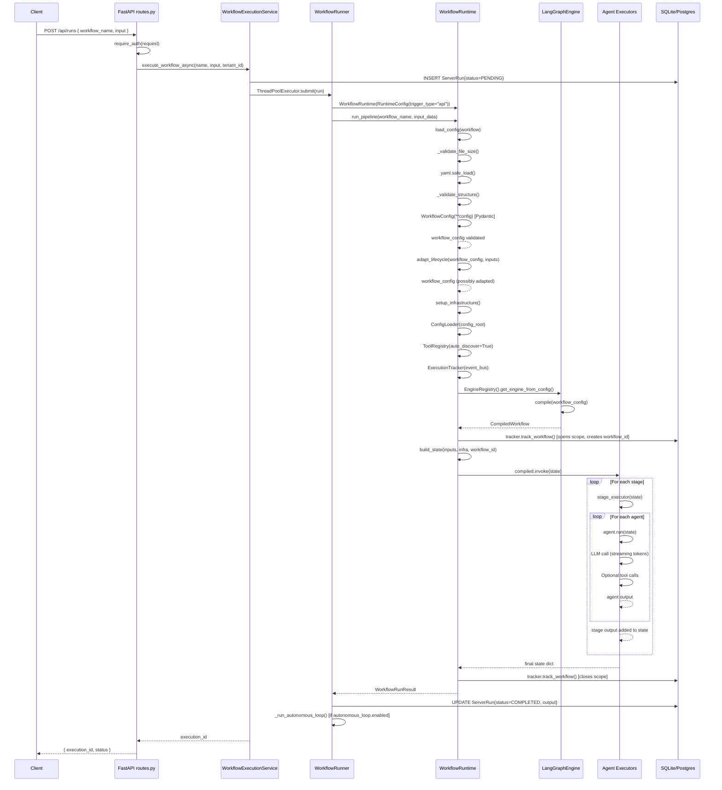
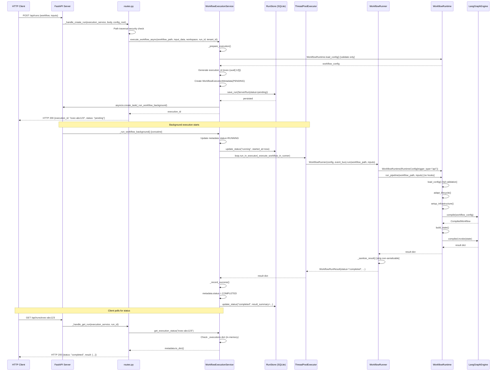
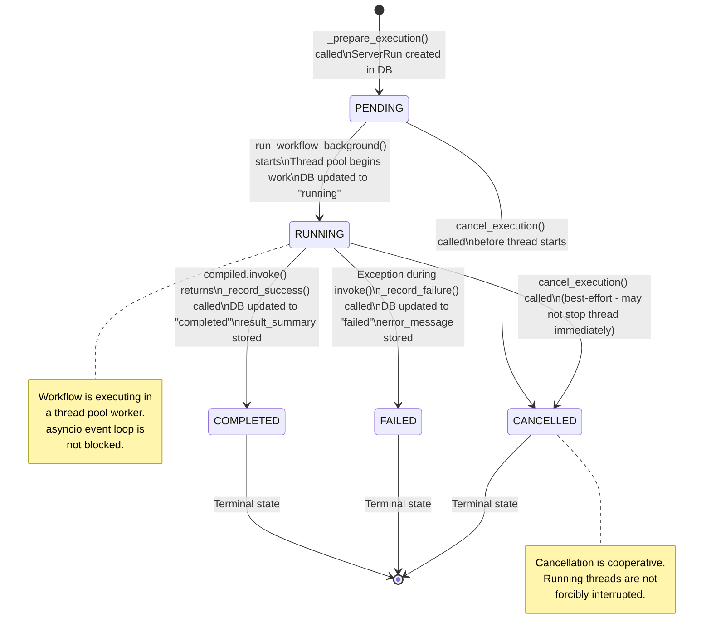
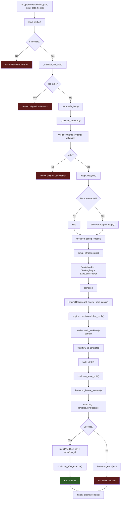
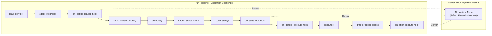

# Request Lifecycle Architecture

**Document:** 01-request-lifecycle.md
**System:** temper-ai (Meta-Autonomous Framework)
**Scope:** Full trace of how a user request enters the system and flows through to completion via the HTTP Server/API (`temper-ai serve`).
**Last Updated:** 2026-02-22

---

## Table of Contents

1. [Executive Summary](#1-executive-summary)
2. [System Architecture Overview](#2-system-architecture-overview)
3. [Legacy CLI Path (Removed)](#3-legacy-cli-path-removed)
   - 3.1 [Former CLI Entry Point — `main.py`](#31-former-cli-entry-point--mainpy)
   - 3.2 [The `run` Command and `_run_local_workflow()`](#32-the-run-command-and-_run_local_workflow)
   - 3.3 [Infrastructure Initialization](#33-infrastructure-initialization)
   - 3.4 [ExecutionHooks: CLI-Specific Behaviour Injection](#34-executionhooks-cli-specific-behaviour-injection)
   - 3.5 [Server Delegation Path (Removed)](#35-server-delegation-path-removed)
   - 3.6 [StreamDisplay: Real-Time Agent Output](#36-streamdisplay-real-time-agent-output)
4. [Entry Point 2: HTTP Server/API Path](#4-entry-point-2-http-serverapi-path)
   - 4.1 [Server Startup — `serve` Command](#41-server-startup--serve-command)
   - 4.2 [API Routes — `routes.py`](#42-api-routes--routespy)
   - 4.3 [WorkflowExecutionService — `execution_service.py`](#43-workflowexecutionservice--execution_servicepy)
   - 4.4 [WorkflowRunner — `workflow_runner.py`](#44-workflowrunner--workflow_runnerpy)
   - 4.5 [RunStore — `run_store.py`](#45-runstore--run_storepy)
   - 4.6 [Server Models — `models.py`](#46-server-models--modelspy)
   - 4.7 [Graceful Shutdown — `lifecycle.py`](#47-graceful-shutdown--lifecyclepy)
5. [Shared Core: WorkflowRuntime](#5-shared-core-workflowruntime)
   - 5.1 [RuntimeConfig](#51-runtimeconfig)
   - 5.2 [InfrastructureBundle](#52-infrastructurebundle)
   - 5.3 [ExecutionHooks](#53-executionhooks)
   - 5.4 [`run_pipeline()` — The Canonical Entry Point](#54-run_pipeline--the-canonical-entry-point)
   - 5.5 [`load_config()` — Load and Validate](#55-load_config--load-and-validate)
   - 5.6 [`adapt_lifecycle()` — Optional Adaptation](#56-adapt_lifecycle--optional-adaptation)
   - 5.7 [`setup_infrastructure()` — Create Components](#57-setup_infrastructure--create-components)
   - 5.8 [`compile()` — Build Executable Graph](#58-compile--build-executable-graph)
   - 5.9 [`build_state()` — Assemble State Dict](#59-build_state--assemble-state-dict)
   - 5.10 [`execute()` — Run the Graph](#510-execute--run-the-graph)
   - 5.11 [`cleanup()` — Resource Teardown](#511-cleanup--resource-teardown)
6. [ExecutionEngine and EngineRegistry](#6-executionengine-and-engineregistry)
   - 6.1 [`ExecutionEngine` ABC](#61-executionengine-abc)
   - 6.2 [`CompiledWorkflow` ABC](#62-compiledworkflow-abc)
   - 6.3 [`EngineRegistry` — Factory Singleton](#63-engineregistry--factory-singleton)
   - 6.4 [Available Engines](#64-available-engines)
7. [Server Client and Delegation](#7-server-client-and-delegation)
   - 7.1 [`MAFServerClient`](#71-mafserverclient)
   - 7.2 [`server_delegation.py` (Removed)](#72-server_delegationpy-removed)
8. [Data Models and State](#8-data-models-and-state)
   - 8.1 [WorkflowExecutionStatus Enum](#81-workflowexecutionstatus-enum)
   - 8.2 [WorkflowExecutionMetadata](#82-workflowexecutionmetadata)
   - 8.3 [ServerRun DB Model](#83-serverrun-db-model)
   - 8.4 [WorkflowRunResult](#84-workflowrunresult)
   - 8.5 [RuntimeConfig Dataclass](#85-runtimeconfig-dataclass)
   - 8.6 [InfrastructureBundle Dataclass](#86-infrastructurebundle-dataclass)
9. [Mermaid Diagrams](#9-mermaid-diagrams)
   - 9.1 [High-Level Request Flow (via HTTP API)](#91-high-level-request-flow-via-http-api)
   - 9.2 [High-Level API/Server Request Flow](#92-high-level-apiserver-request-flow)
   - 9.3 [HTTP API Request Sequence Diagram](#93-http-api-request-sequence-diagram)
   - 9.4 [Server-Mode Execution Sequence Diagram](#94-server-mode-execution-sequence-diagram)
   - 9.5 [WorkflowExecutionStatus State Diagram](#95-workflowexecutionstatus-state-diagram)
   - 9.6 [`run_pipeline()` Internal Flow](#96-run_pipeline-internal-flow)
   - 9.7 [Hook Injection Points](#97-hook-injection-points)
10. [Error Handling Paths](#10-error-handling-paths)
11. [Configuration Reference](#11-configuration-reference)
12. [Extension Points](#12-extension-points)
13. [Observations and Recommendations](#13-observations-and-recommendations)

---

## 1. Executive Summary

**System Name:** temper-ai (Meta-Autonomous Framework)

**Purpose:** A multi-agent AI workflow orchestration framework that executes YAML-defined pipelines of AI agents. User requests come in via the HTTP API (`POST /api/runs`) served by `temper-ai serve`. The server routes requests through `WorkflowRunner` into the shared execution pipeline: `WorkflowRuntime.run_pipeline()`.

**Technology Stack:**
- Language: Python 3.11+
- HTTP Server: FastAPI + uvicorn
- Workflow Engine: LangGraph (primary), DynamicExecutionEngine (secondary)
- Database: SQLAlchemy/SQLModel (SQLite by default, PostgreSQL for production)
- Async Runtime: asyncio + ThreadPoolExecutor for blocking workflow work
- Streaming: WebSocket for server dashboard

**Scope of Analysis:** Full trace from API request to workflow completion result, covering the HTTP server entry point, the shared `WorkflowRuntime` core, the execution engine abstraction layer, infrastructure setup, and state management.

---

## 2. System Architecture Overview

```
┌─────────────────────────────────────────────────────────────────────────────────┐
│                              USER / EXTERNAL CALLER                              │
│                (Browser, curl, SDK clients, MCP clients)                         │
└───────────────────────────────────┬─────────────────────────────────────────────┘
                                    │  POST /api/runs
                                    ▼
                     ┌────────────────────────────────────┐
                     │   HTTP API Entry Point              │
                     │   interfaces/server/routes.py       │
                     │   ────────────────────────────────  │
                     │   POST /api/runs                    │
                     │   → _handle_create_run()            │
                     └───────────────┬────────────────────┘
                                     │
                                     │  async call
                                     ▼
                     ┌────────────────────────────────────┐
                     │   WorkflowExecutionService          │
                     │   workflow/execution_service.py     │
                     │   ────────────────────────────────  │
                     │   execute_workflow_async()          │
                     │   → WorkflowRunner.run()           │
                     │   → WorkflowRuntime.run_pipeline() │
                     └────────────────────────────────────┘
                                                             │
┌────────────────────────────────────────────────────────────────────────────────┐
│                         WorkflowRuntime.run_pipeline()                          │
│                         workflow/runtime.py                                      │
│  ──────────────────────────────────────────────────────────────────────────────│
│  1. load_config()       → YAML parse + Pydantic schema validation               │
│  2. adapt_lifecycle()   → Optional stage injection/removal                       │
│  3. on_config_loaded()  → Hook: planning pass, experiment variant                │
│  4. setup_infrastructure() → ConfigLoader + ToolRegistry + ExecutionTracker     │
│  5. compile()           → EngineRegistry → LangGraphExecutionEngine.compile()   │
│  6. build_state()       → Assemble initial state dict                            │
│  7. on_state_built()    → Hook: optional caller overlays                         │
│  8. execute()           → compiled.invoke(state)                                 │
│  9. on_after_execute()  → Hook: optional post-execution logic                    │
│  10. cleanup()          → Shutdown tool executor                                  │
└────────────────────────────────────────────────────────────────────────────────┘
                │
                ▼
┌──────────────────────────────────────────────────────────────────────────────────┐
│                         Execution Engine Layer                                    │
│  ─────────────────────────────────────────────────────────────────────────────── │
│  EngineRegistry (singleton)                                                       │
│    ├── LangGraphExecutionEngine   [default: "langgraph"]                          │
│    ├── DynamicExecutionEngine     ["dynamic" / "native"]                          │
│    └── (user-registered custom engines)                                           │
│                                                                                   │
│  CompiledWorkflow.invoke(state) → stage_executor(s) → agent(s) → LLM calls       │
└──────────────────────────────────────────────────────────────────────────────────┘
```

---

## 3. Legacy CLI Path (Removed)

> **Note:** The CLI entry point (`temper-ai run`, `temper-ai agent`, etc.) has been removed. The only entry point is now `temper-ai serve`, and all operations go through the HTTP API. This section is retained for historical reference only.

### 3.1 Former CLI Entry Point — `main.py`

**Location:** `temper_ai/interfaces/cli/main.py` (only `serve` command remains active)

The CLI was previously built with Click and registered as the `temper-ai` console script via `pyproject.toml`. The only remaining command is `serve`, which starts the HTTP API server.

```python
# pyproject.toml entry point:
# temper-ai = "temper_ai.interfaces.cli.main:main"

@click.group()
@click.version_option(package_name="temper-ai", prog_name="temper-ai")
def main() -> None:
    """Temper AI CLI."""
    pass
```

**Registered Commands (via `main.add_command()`):**

| Command | Module | Purpose |
|---------|--------|---------|
| `run` | `main.py` | Execute a workflow locally |
| `serve` | `main.py` | Start HTTP API server |
| `trigger` | `main.py` | Delegate run to a running server |
| `status` | `main.py` | Query server-side run status |
| `logs` | `main.py` | Fetch/stream run events |
| `validate` | `main.py` | Validate YAML without executing |
| `config` group | `main.py` | import/export/list/seed configs |
| `list` group | `main.py` | List workflows, agents, stages |
| `rollback` | `rollback.py` | Rollback management |
| `memory` | `memory_commands.py` | Memory subsystem |
| `learning` | `learning_commands.py` | Pattern mining and learning |
| `autonomy` | `autonomy_commands.py` | Post-execution autonomous loop |
| `template` | `template_commands.py` | Workflow template management |
| `lifecycle` | `lifecycle_commands.py` | Lifecycle profile management |
| `goals` | `goal_commands.py` | Goal proposal management |
| `portfolio` | `portfolio_commands.py` | Workflow portfolio management |
| `experiment` | `experiment_commands.py` | A/B experimentation |
| `chat` | `chat_commands.py` | Interactive agent chat |
| `checkpoint` | `checkpoint_commands.py` | Checkpoint resume |
| `mcp` | `mcp_commands.py` | MCP server operations (optional) |
| `create` | `create_commands.py` | Project scaffolding |
| `visualize` | `visualize_commands.py` | DAG visualization |
| `optimize` | `optimize_commands.py` | DSPy prompt optimization (optional) |
| `plugin` | `plugin_commands.py` | External agent ingestion (optional) |
| `agent` | `agent_commands.py` | Persistent agent management (M9) |
| `events` | `event_commands.py` | Event bus operations (M9) |

**Module-level constants:**
```python
PROJECT_ROOT = Path(__file__).resolve().parent.parent.parent
DEFAULT_DASHBOARD_PORT = 8420
DEFAULT_HOST = "127.0.0.1"   # Secure default: localhost only
DEFAULT_MAX_WORKERS = 4
EXIT_CODE_KEYBOARD_INTERRUPT = 130  # POSIX standard
```

---

### 3.2 The `run` Command and `_run_local_workflow()`

**Location:** `temper_ai/interfaces/cli/main.py:1035–1140`

The `run` command is defined at line 1035. It takes a mandatory `workflow` argument (path to a YAML file) and many optional flags.

**Signature:**
```python
@main.command()
@click.argument("workflow", type=click.Path(exists=True))
@click.option("--input", "input_file", type=click.Path(exists=True))
@click.option("--verbose", "-v", is_flag=True)
@click.option("--output", "-o", type=click.Path())
@click.option("--db", default=None, envvar="TEMPER_DATABASE_URL")
@click.option("--config-root", default=DEFAULT_CONFIG_ROOT, envvar="TEMPER_CONFIG_ROOT")
@click.option("--show-details", "-d", is_flag=True)
@click.option("--dashboard", type=int, default=None, flag_value=DEFAULT_DASHBOARD_PORT)
@click.option("--workspace", type=click.Path(), envvar="TEMPER_WORKSPACE")
@click.option("--events-to", type=click.Choice(["stderr", "stdout", "file"]))
@click.option("--event-format", type=click.Choice(["text", "json", "jsonl"]))
@click.option("--run-id", type=str, default=None)
@click.option("--autonomous", is_flag=True)
@click.option("--plan", "enable_plan", is_flag=True)
@click.option("--experiment", "experiment_id", default=None)
def run(...) -> None:
    _run_local_workflow(...)
```

The `run` command is a thin dispatcher — its entire body is a single call to `_run_local_workflow()`.

**`_run_local_workflow()` Signature:**
```python
def _run_local_workflow(
    workflow: str,           # Path to workflow YAML file
    input_file: str | None,  # Optional YAML input file path
    verbose: bool,           # Enable DEBUG logging
    output: str | None,      # Optional JSON output file path
    db: str | None,          # Database URL override
    config_root: str,        # Config directory root
    show_details: bool,      # Show real-time agent progress
    dashboard: int | None,   # Optional dashboard port
    workspace: str | None,   # Restrict file ops to directory
    events_to: str,          # Event routing destination
    event_format: str,       # Event output format
    run_id: str | None,      # External run ID
    autonomous: bool,        # Enable post-execution autonomous loop
    enable_plan: bool,       # Run planning pass before execution
    experiment_id: str | None,  # A/B experiment ID
) -> None:
```

**Step-by-step execution of `_run_local_workflow()`:**

**Step 1 — Configure logging** (`main.py:875`):
```python
_setup_logging(verbose, show_details)
```
- `verbose=True` → `setup_logging(level="DEBUG", format_type="console")`
- `show_details=True` → `setup_logging(level="INFO", format_type="rich")`
- Neither → `setup_logging(level="WARNING", format_type="console")`

Uses `temper_ai.shared.utils.logging.setup_logging()` which attaches `ExecutionContextFilter` to inject `workflow_id`, `stage_id`, `agent_id`, and optional OTEL trace IDs into every log record.

**Step 2 — Load input file** (`main.py:878–887`):
```python
rt_tmp = WorkflowRuntime()
inputs = {}
if input_file:
    inputs = rt_tmp.load_input_file(input_file)
```
A temporary `WorkflowRuntime` instance is created purely to call `load_input_file()`, which performs file-size checking, YAML parsing, and structure validation. The input dict (empty `{}` if no `--input` flag) is stored for later injection into the pipeline.

**Step 3 — Initialize infrastructure** (`main.py:891`):
```python
event_bus, dash_server = _initialize_infrastructure(config_root, db, dashboard, verbose)
_setup_event_routing(event_bus, events_to, event_format, run_id, verbose)
```
See [Section 3.3](#33-infrastructure-initialization) for details.

**Step 4 — Create OTEL backend factory** (`main.py:894`):
```python
backend_factory = _create_otel_backend_factory(verbose)
```
Returns a callable that creates a `CompositeBackend` (SQL + OTEL), or `None` if `opentelemetry` is not installed.

**Step 5 — Create WorkflowRuntime with config** (`main.py:896–904`):
```python
rt = WorkflowRuntime(config=RuntimeConfig(
    config_root=config_root,
    db_path=db or get_database_url(),
    trigger_type="cli",
    environment="local",
    initialize_database=False,   # Already done in step 3
    event_bus=event_bus,
    tracker_backend_factory=backend_factory,
))
```

**Step 6 — Define ExecutionHooks** (`main.py:907–1011`):

Four hook callables are defined as closures (capturing local variables) and wrapped in `ExecutionHooks`. See [Section 3.4](#34-executionhooks-cli-specific-behaviour-injection).

**Step 7 — Call `run_pipeline()`** (`main.py:1013–1020`):
```python
result = rt.run_pipeline(
    workflow_path=workflow,
    input_data=inputs,
    hooks=hooks,
    workspace=workspace,
    run_id=run_id,
    show_details=show_details,
)
```
This is the single handoff to the shared core. See [Section 5](#5-shared-core-workflowruntime).

**Step 8 — Exception handling** (`main.py:1022–1029`):
```python
except SystemExit:
    raise
except KeyboardInterrupt:
    raise SystemExit(EXIT_CODE_KEYBOARD_INTERRUPT)  # 130
except (WorkflowStageError, RuntimeError, ValueError):
    raise SystemExit(1)
```

**Step 9 — Dashboard keep-alive** (`main.py:1031–1032`):
If `--dashboard` was specified, blocks until the user presses Ctrl+C.

---

### 3.3 Infrastructure Initialization

**Location:** `temper_ai/interfaces/cli/main.py:226–280`

```python
def _initialize_infrastructure(
    config_root: str,
    db_url: str | None,
    dashboard_port: int | None,
    verbose: bool,
) -> tuple:  # (event_bus, dashboard_server)
```

**Step 1 — Create TemperEventBus:**
```python
event_bus = TemperEventBus(
    observability_bus=ObservabilityEventBus(),
    persist=False,
)
```
An always-on event bus is created so every workflow run can emit events that the dashboard can subscribe to.

**Step 2 — Ensure database:**
```python
ExecutionTracker.ensure_database(db_url or get_database_url())
```
Creates SQLite/PostgreSQL schema if it does not exist. Raises `SystemExit(1)` on failure.

**Step 3 — Optional dashboard:**
```python
if dashboard_port is not None and event_bus is not None:
    backend = SQLObservabilityBackend(buffer=False)
    dashboard_server = _start_dashboard_server(backend, event_bus, dashboard_port)
```
Starts uvicorn in a daemon thread, creates the FastAPI dashboard app, and prints the URL.

**Event routing setup** (`main.py:740–753`):
```python
def _setup_event_routing(event_bus, events_to, event_format, run_id, verbose):
    if not event_bus or (events_to == "stderr" and event_format == "text"):
        return  # default — no routing needed
    handler = EventOutputHandler(mode=events_to, fmt=event_format, run_id=run_id)
    event_bus.subscribe(handler.handle_event)
```

---

### 3.4 ExecutionHooks: CLI-Specific Behaviour Injection

**Location:** `temper_ai/interfaces/cli/main.py:915–1011`

`ExecutionHooks` is a dataclass with four optional callable fields. The CLI defines all four as closures that capture state from `_run_local_workflow`'s local scope.

**Hook 1 — `on_config_loaded(wf_config, inp) -> wf_config`** (`main.py:916–936`):

Called after `load_config()` + `adapt_lifecycle()`, before infrastructure setup.

Responsibilities:
1. `WorkflowRuntime.check_required_inputs(wf_config, inp)` — validates all required inputs are present; raises `SystemExit(1)` if not.
2. `_maybe_run_planning_pass(wf_config, inputs, enable_plan, verbose)` — if `--plan` flag is set or `config.planning.enabled: true` in YAML, calls `generate_workflow_plan()` and injects the plan string into `inputs["workflow_plan"]`.
3. `_apply_experiment_variant(experiment_id, run_id, wf_config, verbose)` — if `--experiment` is specified, calls `assign_and_merge()` to select and overlay a variant config.
4. Stores the (potentially modified) `wf_config` in `hook_state["wf_config"]` for later hooks.

**Hook 2 — `on_state_built(state, infra) -> None`** (`main.py:939–977`):

Called after `build_state()`, before `execute()`. Mutates `state` in-place.

Responsibilities:
1. If `--show-details`: injects `state["detail_console"] = console` and `state["stream_callback"] = StreamDisplay(console)`.
2. If `optimization.evaluations` configured: creates `EvaluationDispatcher` and injects into `state["evaluation_dispatcher"]`.
3. If `optimization.enabled`: creates `OptimizationEngine` and stores in `state["_optimization_engine"]` for `on_before_execute` to intercept.

**Hook 3 — `on_after_execute(result, workflow_id) -> None`** (`main.py:979–991`):

Called after successful `execute()`, outside the tracker scope.

Responsibilities:
1. Records `workflow_id` and `wf_name` in `hook_state`.
2. Calculates duration: `time.monotonic() - start_time`.
3. Calls `_maybe_track_experiment()` to record A/B results.
4. Calls `_handle_post_execution()` which chains:
   - `_print_run_summary()` — Rich table with workflow_id, status, duration, tokens, cost.
   - `_display_detailed_report()` — per-stage breakdown if `--show-details`.
   - `_display_gantt_chart()` — hierarchical Gantt if tracing data is available.
   - `_run_autonomous_loop()` — post-execution pattern mining/goals/portfolio if `--autonomous`.
   - `_save_results()` — JSON dump to file if `--output`.

**Hook 4 — `on_error(exc) -> None`** (`main.py:994–1004`):

Called when `run_pipeline()` raises. Provides Rich-formatted error messages based on exception type:
- `SystemExit` → silent passthrough.
- `WorkflowStageError` → `[red]Stage failure:[/red] {stage_name} — {exc}`.
- `KeyboardInterrupt` → `[yellow]Interrupted[/yellow]`.
- Other → `[red]Workflow execution error:[/red] {exc}`.

---

### 3.5 Server Delegation Path (Removed)

> **Note:** The `temper-ai trigger` command and related `server_delegation.py` / `server_client.py` modules have been removed. Workflow execution is now done exclusively via `POST /api/runs`.

Previously, the `temper-ai trigger` command was used to submit a workflow to a running Temper AI server:

```python
@main.command()
@click.argument("workflow")
@click.option("--server", envvar="TEMPER_SERVER_URL")
@click.option("--api-key", envvar="TEMPER_API_KEY")
@click.option("--wait", is_flag=True)
def trigger(workflow, input_file, server, api_key, workspace, wait):
    client = MAFServerClient(base_url=server or DEFAULT_SERVER_URL, api_key=api_key)
    result = client.trigger_run(workflow, inputs=inputs, workspace=workspace)
    execution_id = result.get("execution_id", "")
    console.print(f"[green]Triggered:[/green] {execution_id}")
    if wait:
        _poll_until_complete(client, execution_id)
```

**`MAFServerClient.trigger_run()`** (`server_client.py:70–100`):
```python
def trigger_run(self, workflow, inputs=None, workspace=None, run_id=None) -> dict:
    body = {"workflow": workflow}
    if inputs: body["inputs"] = inputs
    if workspace: body["workspace"] = workspace
    if run_id: body["run_id"] = run_id
    with self._client() as client:
        resp = client.post("/api/runs", json=body)
        resp.raise_for_status()
        return resp.json()
```

HTTP client configuration:
```python
def _client(self) -> httpx.Client:
    return httpx.Client(
        base_url=self.base_url,
        headers=self._headers(),   # includes "X-API-Key" if set
        timeout=httpx.Timeout(READ_TIMEOUT=30, connect=CONNECT_TIMEOUT=10),
    )
```

**`_poll_until_complete()`** (`main.py:1944–1966`):
Polls `GET /api/runs/{execution_id}` every 2 seconds until `status` is one of `"completed"`, `"failed"`, or `"cancelled"`.

**`server_delegation.py` — `delegate_to_server()`** (`server_delegation.py:50–102`):

This was previously used for CLI-to-server delegation (auto-detect mode, not currently the default path but available for use). It:
1. Resolves workflow and workspace paths to absolute (`Path.resolve()`).
2. Calls `client.trigger_run()`.
3. Calls `_poll_with_progress()` with a 3600-second (1 hour) timeout.
4. In `_poll_with_progress()`: shows a `console.status()` spinner, polls every 2s via `client.get_status()`, logs stage transitions if `show_details=True`.

**`detect_server()` function** (`server_delegation.py:32–47`):
```python
def detect_server(server_url, api_key=None) -> MAFServerClient | None:
    client = MAFServerClient(base_url=server_url, api_key=api_key)
    if client.is_server_running():   # GET /api/health, 2s timeout
        return client
    return None
```

---

### 3.6 StreamDisplay: Real-Time Agent Output

**Location:** `temper_ai/interfaces/cli/stream_display.py`

When `--show-details` is passed, the CLI injects a `StreamDisplay` instance into `state["stream_callback"]`. Agents pick this up from state and call it with streaming LLM tokens.

**Class `StreamDisplay`:**

```python
class StreamDisplay:
    def __init__(self, console: Console) -> None:
        self._console = console
        self._lock = threading.Lock()
        self._sources: dict[str, _SourceStream] = {}
        self._color_idx = 0
        self._live: Live | None = None
        self._started = False
        self._current_stage: str = ""
```

**Key public methods:**

`make_callback(source_name: str) -> Callable`:
Returns a per-source callback for parallel agent execution. The returned callable accepts either a `StreamEvent` (new API) or a `LLMStreamChunk` (legacy, auto-adapted via `from_llm_chunk()`).

`on_chunk(chunk: Any) -> None`:
Single-source callback for backward compatibility. Routes all chunks to a stream named after the model.

**Event types handled** (from `stream_events.py`):
- `LLM_TOKEN` — append to `thinking_buffer` (if `chunk_type=="thinking"`) or `content_buffer`
- `LLM_DONE` — flush remaining content
- `TOOL_START` — show "⚡ tool_name running..."
- `TOOL_RESULT` — show "✓ tool_name (Xs)" or "✗ tool_name: error"
- `STATUS` — update status line
- `PROGRESS` — append to content buffer

**Rendering:** Uses Rich `Live` with `refresh_per_second=10`. Each source gets a colored `Panel` showing thinking/content buffers (truncated to 1500 chars), tool line, and status line. Multiple panels are grouped with `Group(*panels)`.

**Thread safety:** All state mutations are protected by `self._lock`. The `_stop()` call is triggered when all source streams have `done=True`.

---

## 4. Entry Point 2: HTTP Server/API Path

### 4.1 Server Startup — `serve` Command

**Location:** `temper_ai/interfaces/cli/main.py:1178–1244`

```python
@main.command()
@click.option("--host", default=DEFAULT_HOST, envvar="TEMPER_HOST")
@click.option("--port", default=DEFAULT_DASHBOARD_PORT, envvar="TEMPER_PORT")
@click.option("--config-root", default=DEFAULT_CONFIG_ROOT, envvar="TEMPER_CONFIG_ROOT")
@click.option("--db", default=None, envvar="TEMPER_DATABASE_URL")
@click.option("--workers", default=DEFAULT_MAX_WORKERS, envvar="TEMPER_MAX_WORKERS")
@click.option("--reload", "dev_reload", is_flag=True)
@click.option("--dev", is_flag=True)
def serve(host, port, config_root, db, workers, dev_reload, dev):
```

**Step-by-step startup:**

1. Import `uvicorn` and `create_app` — raises `SystemExit(1)` if `dashboard` extras are not installed.
2. Determine DB URL: `db or get_database_url()`.
3. `ExecutionTracker.ensure_database(db_url)` — create schema.
4. `SQLObservabilityBackend(buffer=False)` — observability backend.
5. `TemperEventBus(observability_bus=ObservabilityEventBus(), persist=False)`.
6. `mode = "dev" if dev else "server"` — determines auth behavior.
7. `create_app(backend, event_bus, mode, config_root, max_workers=workers)` — creates the FastAPI application.
8. `uvicorn.run(app, host=host, port=port, log_level="info", reload=dev_reload)`.

**Authentication behavior (M10):**
- `mode="dev"`: `auth_enabled=False` — no auth, permissive CORS.
- `mode="server"`: `auth_enabled=True` — requires `Authorization: Bearer <api_key>` on protected routes.

---

### 4.2 API Routes — `routes.py`

**Location:** `temper_ai/interfaces/server/routes.py`

The server-mode router is created by `create_server_router()`:

```python
def create_server_router(
    execution_service: Any,
    data_service: Any,
    config_root: str = "configs",
    auth_enabled: bool = False,
) -> APIRouter:
```

**Registered routes:**

| Method | Path | Handler | Auth |
|--------|------|---------|------|
| `GET` | `/api/health` | `_handle_health()` | None |
| `GET` | `/api/health/ready` | `_handle_readiness()` | None |
| `POST` | `/api/runs` | `_handle_create_run()` | owner/editor |
| `GET` | `/api/runs` | `_handle_list_runs()` | authenticated |
| `GET` | `/api/runs/{run_id}` | `_handle_get_run()` | authenticated |
| `POST` | `/api/runs/{run_id}/cancel` | `_handle_cancel_run()` | owner/editor |
| `GET` | `/api/runs/{run_id}/events` | `_handle_get_run_events()` | authenticated |
| `POST` | `/api/validate` | `_handle_validate_workflow()` | authenticated |
| `GET` | `/api/workflows/available` | `_handle_list_available_workflows()` | authenticated |

**Request Models** (defined in `routes.py`):

```python
class RunRequest(BaseModel):
    workflow: str                    # Path to workflow YAML (relative to config_root)
    inputs: dict[str, Any] = {}
    workspace: str | None = None
    run_id: str | None = None
    config: dict[str, Any] = {}

class RunResponse(BaseModel):
    execution_id: str
    status: str = "pending"
    message: str = "Workflow execution started"

class ValidateRequest(BaseModel):
    workflow: str
```

**`_handle_create_run()` — Core workflow triggering function** (`routes.py:73–101`):

```python
async def _handle_create_run(
    execution_service: Any,
    body: RunRequest,
    config_root: str,
    tenant_id: str | None = None,
) -> RunResponse:
```

Steps:
1. **Path traversal security check:** Resolves `config_root` and `body.workflow` to absolute paths, then calls `workflow_file.relative_to(config_root_resolved)`. If this raises `ValueError`, returns `HTTP 400 "Invalid workflow path"`.
2. Calls `execution_service.execute_workflow_async(workflow_path, input_data, workspace, run_id, tenant_id)`.
3. Returns `RunResponse(execution_id=execution_id)` immediately (non-blocking).
4. On `FileNotFoundError` → `HTTP 404`.
5. On other exceptions → `HTTP 500 "Internal server error: workflow execution failed"`.

**`_handle_get_run_events()`** (`routes.py:149–175`):
1. Looks up `workflow_id` from `execution_service.get_execution_status(run_id)`.
2. Creates `SQLObservabilityBackend(buffer=False)` and calls `backend.get_run_events(workflow_id, limit, offset)`.
3. Returns `{"events": events, "total": len(events)}`.

**`_handle_validate_workflow()`** (`routes.py:178–202`):
1. Path traversal security check (same as `_handle_create_run`).
2. Creates `WorkflowRuntime(config=RuntimeConfig(config_root=config_root))`.
3. Calls `rt.load_config(str(workflow_file))`.
4. Returns `{"valid": True/False, "errors": [...], "warnings": []}`.

---

### 4.3 WorkflowExecutionService — `execution_service.py`

**Location:** `temper_ai/workflow/execution_service.py`

This is the primary execution gateway. All entry points (Dashboard REST, MCP, CrossWorkflowTrigger) use this service.

**Class `WorkflowExecutionService`:**

```python
class WorkflowExecutionService:
    def __init__(
        self,
        backend: Any,                    # ObservabilityBackend
        event_bus: Any,                  # ObservabilityEventBus
        config_root: str = "configs",
        max_workers: int = DEFAULT_MAX_WORKFLOW_WORKERS,  # 4
        run_store: Any = None,           # Optional RunStore
    ):
        self.backend = backend
        self.event_bus = event_bus
        self.config_root = config_root
        self.run_store = run_store
        self._executor = ThreadPoolExecutor(max_workers=max_workers)
        self._executions: dict[str, WorkflowExecutionMetadata] = {}
        self._lock = threading.Lock()
        self._futures: dict[str, Future] = {}
```

**Concurrency model:** Workflow execution happens in a `ThreadPoolExecutor` (default 4 workers). The asyncio event loop is never blocked — workflow threads run alongside the FastAPI server event loop via `loop.run_in_executor()`.

**Three execution paths:**

**Path A — Async (Dashboard REST API):**
```python
async def execute_workflow_async(self, workflow_path, input_data, workspace, run_id, tenant_id=None) -> str:
    execution_id, workflow_file = self._prepare_execution(...)
    asyncio.create_task(
        self._run_workflow_background(execution_id, str(workflow_file), input_data, workspace)
    )
    return execution_id   # Returns immediately
```

The `asyncio.create_task()` schedules `_run_workflow_background()` as a coroutine, which in turn calls `loop.run_in_executor()` to push the blocking workflow work into the thread pool:
```python
async def _run_workflow_background(self, execution_id, workflow_path, input_data, workspace):
    # Mark as running
    with self._lock:
        metadata.status = WorkflowExecutionStatus.RUNNING
        metadata.started_at = datetime.now(UTC)

    loop = asyncio.get_running_loop()
    result = await loop.run_in_executor(
        self._executor,
        self._execute_workflow_in_runner,   # blocking function
        workflow_path, input_data, execution_id, workspace,
    )
    self._record_success(execution_id, result)
```

**Path B — Sync non-blocking (CrossWorkflowTrigger):**
```python
def submit_workflow(self, workflow_path, input_data, workspace, run_id) -> str:
    execution_id, _ = self._prepare_execution(...)
    future = self._executor.submit(self._run_workflow_with_tracking, ...)
    self._futures[execution_id] = future
    return execution_id   # Returns immediately
```

**Path C — Sync blocking (MCP):**
```python
def execute_workflow_sync(self, workflow_path, input_data, workspace, run_id) -> dict:
    execution_id = self.submit_workflow(...)
    future = self._futures.pop(execution_id, None)
    if future: future.result()   # Blocks until done
    return self.get_status_sync(execution_id) or {}
```

**`_prepare_execution()` — Registration** (`execution_service.py:431–492`):

This is called by all three paths before the actual execution.

```python
def _prepare_execution(self, workflow_path, input_data, workspace, run_id, tenant_id=None) -> tuple[str, Path]:
```

Steps:
1. Generate `execution_id`: `f"exec-{run_id}"` if `run_id` provided, else `f"exec-{uuid.uuid4().hex[:12]}"`.
2. Load and validate workflow config via `WorkflowRuntime(config=RuntimeConfig(config_root=self.config_root)).load_config(workflow_path)`.
3. Extract `workflow_name` from config.
4. Create `WorkflowExecutionMetadata(status=PENDING)` and register in `self._executions[execution_id]`.
5. If `run_store` is available, persist a `ServerRun` record with `status="pending"`.
6. Return `(execution_id, workflow_file_path)`.

**`_execute_workflow_in_runner()` — Thread pool executor** (`execution_service.py:494–534`):

This function runs inside a thread pool thread.

```python
def _execute_workflow_in_runner(self, workflow_path, input_data, execution_id, workspace=None) -> dict:
    runner = WorkflowRunner(
        config=WorkflowRunnerConfig(config_root=self.config_root, workspace=workspace),
        event_bus=self.event_bus,
    )
    run_result = runner.run(workflow_path, input_data=input_data)

    with self._lock:
        self._executions[execution_id].workflow_id = run_result.workflow_id

    if run_result.status == "failed":
        raise RuntimeError(run_result.error_message or "Workflow execution failed")

    return run_result.result or {}
```

**Status tracking:**

`_record_success()`:
```python
def _record_success(self, execution_id, result):
    with self._lock:
        metadata.status = WorkflowExecutionStatus.COMPLETED
        metadata.completed_at = datetime.now(UTC)
        metadata.result = _sanitize_workflow_result(result)
    if self.run_store:
        self.run_store.update_status(execution_id, "completed", completed_at=..., workflow_id=..., result_summary=...)
```

`_record_failure()`:
```python
def _record_failure(self, execution_id, error_message):
    with self._lock:
        metadata.status = WorkflowExecutionStatus.FAILED
        metadata.completed_at = datetime.now(UTC)
        metadata.error_message = error_message
    if self.run_store:
        self.run_store.update_status(execution_id, "failed", completed_at=..., error_message=...)
```

**`_sanitize_workflow_result(result)`** (`execution_service.py:25–47`):
Strips non-serializable keys from the workflow state dict (tracker, config_loader, tool_registry, Rich console, etc.) using `StateKeys.NON_SERIALIZABLE_KEYS`. Falls back gracefully: attempts `json.dumps(value)` and skips keys that fail.

**Status queries:**

`get_execution_status(execution_id)` (async): checks in-memory `_executions` first, then falls back to `run_store.get_run(execution_id)`.

`list_executions(status, limit, offset)` (async): merges persistent store results with in-memory active runs, deduplicating by `execution_id`.

`cancel_execution(execution_id)` (async): sets status to `CANCELLED` in memory. Note: this is best-effort — it does not interrupt an already-running thread.

---

### 4.4 WorkflowRunner — `workflow_runner.py`

**Location:** `temper_ai/interfaces/server/workflow_runner.py`

`WorkflowRunner` is a thin synchronous wrapper around `WorkflowRuntime.run_pipeline()`. It is used by `WorkflowExecutionService._execute_workflow_in_runner()` and can also be used standalone for embedding MAF in other Python programs.

**Class `WorkflowRunnerConfig`:**
```python
class WorkflowRunnerConfig(BaseModel):
    config_root: str = "configs"
    workspace: str | None = None
    show_details: bool = False
    trigger_type: str = "api"
    environment: str = "server"
```

**Class `WorkflowRunResult`:**
```python
class WorkflowRunResult(BaseModel):
    workflow_id: str
    workflow_name: str
    status: str           # "completed" | "failed"
    result: dict | None = None
    error_message: str | None = None
    started_at: datetime
    completed_at: datetime
    duration_seconds: float
```

**`WorkflowRunner.run()` Signature:**
```python
def run(
    self,
    workflow_path: str,
    input_data: dict[str, Any] | None = None,
    on_event: Callable | None = None,   # Optional event callback (subscribes to event_bus)
    run_id: str | None = None,
    workspace: str | None = None,
) -> WorkflowRunResult:
```

**Execution flow:**

```python
def run(self, workflow_path, input_data=None, on_event=None, run_id=None, workspace=None):
    started_at = datetime.now(UTC)
    sub_id = None

    if on_event and self.event_bus:
        sub_id = self.event_bus.subscribe(on_event)  # Wire event callback

    try:
        result_data, workflow_name, _, _ = self._run_core(workflow_path, input_data or {}, workspace, run_id)
        completed_at = datetime.now(UTC)
        return self._build_result("completed", result_data.get("workflow_id", ""), ...)
    except FileNotFoundError:
        raise   # Propagated to caller (HTTP 404 in routes.py)
    except ConfigValidationError:
        raise
    except Exception as exc:
        completed_at = datetime.now(UTC)
        return self._build_result("failed", "", workflow_path, ..., error_message=str(exc))
    finally:
        if sub_id and self.event_bus:
            self.event_bus.unsubscribe(sub_id)
```

**`_run_core()` Signature:**
```python
def _run_core(self, workflow_path, input_data, workspace, run_id) -> tuple:
    rt = WorkflowRuntime(config=RuntimeConfig(
        config_root=self.config.config_root,
        trigger_type=self.config.trigger_type,     # "api"
        environment=self.config.environment,         # "server"
        initialize_database=False,
        event_bus=self.event_bus,
    ))
    effective_workspace = workspace or self.config.workspace
    result_data = rt.run_pipeline(
        workflow_path=workflow_path,
        input_data=input_data,
        workspace=effective_workspace,
        run_id=run_id,
        show_details=self.config.show_details,
    )
    workflow_name = result_data.get("workflow_name", Path(workflow_path).stem)
    return result_data, workflow_name, None, rt
```

The server path uses the raw `run_pipeline()` with default hooks (all `None`).

**`_sanitize_result()`:** Delegates to `execution_service._sanitize_workflow_result()` to strip non-serializable keys before storing in `WorkflowRunResult.result`.

---

### 4.5 RunStore — `run_store.py`

**Location:** `temper_ai/interfaces/server/run_store.py`

Provides SQLite/PostgreSQL persistence for server-triggered run history. Uses a **separate** SQLAlchemy engine from the main observability database, ensuring independence.

**Class `RunStore`:**

```python
class RunStore:
    def __init__(self, database_url: str | None = None) -> None:
        self.database_url = database_url or get_database_url()
        self.engine = create_app_engine(self.database_url)
        SQLModel.metadata.create_all(self.engine, tables=[ServerRun.__table__])
```

**Methods:**

`save_run(run: ServerRun) -> None`:
Uses `session.merge(run)` (upsert semantics) — inserts on first call, updates on subsequent calls with same `execution_id`.

`get_run(execution_id: str) -> ServerRun | None`:
Simple primary-key lookup.

`list_runs(status=None, limit=100, offset=0) -> list[ServerRun]`:
Orders by `created_at DESC`. Optional `status` filter. Fully parameterized — no f-string SQL.

`update_status(execution_id, status, **kwargs) -> bool`:
Fetches record, updates `status` and any `kwargs` fields that exist as attributes, commits. Returns `False` if not found.

---

### 4.6 Server Models — `models.py`

**Location:** `temper_ai/interfaces/server/models.py`

```python
class ServerRun(SQLModel, table=True):
    __tablename__ = "server_runs"

    execution_id: str = Field(primary_key=True)
    workflow_id: str | None = Field(default=None, index=True)    # Filled after execution starts
    workflow_path: str
    workflow_name: str = Field(index=True)
    status: str = Field(index=True)    # pending|running|completed|failed|cancelled
    created_at: datetime = Field(default_factory=utcnow, index=True)
    started_at: datetime | None = None
    completed_at: datetime | None = None
    input_data: dict | None = Field(default=None, sa_column=Column(JSON))
    workspace: str | None = None
    result_summary: dict | None = Field(default=None, sa_column=Column(JSON))
    error_message: str | None = None
    tenant_id: str | None = Field(default=None, index=True)    # M10: multi-tenant
```

`to_dict()` converts the record to a JSON-safe dict suitable for API responses. Timestamps are converted to ISO 8601 strings.

---

### 4.7 Graceful Shutdown — `lifecycle.py`

**Location:** `temper_ai/interfaces/server/lifecycle.py`

**Class `GracefulShutdownManager`:**

```python
class GracefulShutdownManager:
    def __init__(self):
        self.readiness_gate: bool = True
        self._original_sigterm = None
        self._original_sigint = None
```

**`register_signals()`:**
Installs SIGTERM and SIGINT handlers that set `readiness_gate = False`. Uses `loop.add_signal_handler()` (async-safe) on platforms that support it, falls back to synchronous `signal.signal()` on Windows.

When `readiness_gate=False`, the `/api/health/ready` endpoint returns `HTTP 503 Service Unavailable`, preventing new requests from being load-balanced to this instance.

**`drain(execution_service, timeout=30)`:**
```python
async def drain(self, execution_service=None, timeout=30):
    deadline = time.monotonic() + timeout
    while time.monotonic() < deadline:
        active = sum(1 for m in execution_service._executions.values()
                     if m.status.value in ("pending", "running"))
        if active == 0:
            return
        await asyncio.sleep(1)    # Poll every second
    logger.warning("Drain timeout reached, shutting down with active workflows")
```

Checks `execution_service._executions` dict for running/pending workflows and waits up to 30 seconds for them to finish. This is used in the FastAPI `lifespan` context manager.

---

## 5. Shared Core: WorkflowRuntime

**Location:** `temper_ai/workflow/runtime.py`

`WorkflowRuntime` is the canonical execution pipeline. Both CLI and server paths converge here. It encapsulates the full sequence: load → validate → adapt → compile → execute → cleanup.

### 5.1 RuntimeConfig

```python
@dataclass
class RuntimeConfig:
    config_root: str = "configs"
    trigger_type: str = "cli"                    # "cli" | "api" | "mcp" | ...
    verbose: bool = False
    db_path: str = ".meta-autonomous/observability.db"
    tracker_backend_factory: Callable | None = None  # Optional OTEL factory
    environment: str = "development"             # "local" | "server" | ...
    initialize_database: bool = True             # Whether to create DB schema
    event_bus: Any | None = None                 # Pre-existing event bus to use
```

The server sets `trigger_type="api"` and `environment="server"`. These values are recorded in the observability database alongside each execution.

---

### 5.2 InfrastructureBundle

```python
@dataclass
class InfrastructureBundle:
    config_loader: Any = None     # ConfigLoader: resolves stage/agent YAML files
    tool_registry: Any = None     # ToolRegistry: manages available tools
    tracker: Any = None           # ExecutionTracker: records observability data
    event_bus: Any | None = None  # TemperEventBus (if created from config)
```

Created by `setup_infrastructure()` and passed to `compile()`, `build_state()`, and `on_state_built` hook.

---

### 5.3 ExecutionHooks

```python
@dataclass
class ExecutionHooks:
    on_config_loaded: Callable | None = None
    # Signature: (workflow_config: dict, input_data: dict) -> workflow_config: dict
    # Called after: load_config() + adapt_lifecycle()
    # Called before: setup_infrastructure()

    on_state_built: Callable | None = None
    # Signature: (state: dict, infra: InfrastructureBundle) -> None
    # Called after: build_state()
    # Called before: execute()
    # Mutate state in-place

    on_before_execute: Callable | None = None
    # Signature: (compiled: CompiledWorkflow, state: dict) -> None
    # Called after: on_state_built
    # Called before: compiled.invoke(state)

    on_after_execute: Callable | None = None
    # Signature: (result: dict, workflow_id: str) -> None
    # Called after: successful execute(), outside tracker scope

    on_error: Callable | None = None
    # Signature: (exception: Exception) -> None
    # Called when run_pipeline() raises (before re-raise)
```

The server (`WorkflowRunner`) passes `None` hooks (all hooks are optional). Custom callers embedding `WorkflowRuntime` directly may provide their own hooks.

---

### 5.4 `run_pipeline()` — The Canonical Entry Point

**Location:** `temper_ai/workflow/runtime.py:541–650`

```python
def run_pipeline(
    self,
    workflow_path: str,
    input_data: dict[str, Any],
    hooks: ExecutionHooks | None = None,
    workspace: str | None = None,
    run_id: str | None = None,
    show_details: bool = False,
    mode: Any | None = None,
) -> dict[str, Any]:
```

**Full execution sequence:**

```
1.  load_config(workflow_path, input_data)
        ├── _resolve_path()            → absolute Path
        ├── _validate_file_size()      → reject > CONFIG_SECURITY.MAX_CONFIG_SIZE
        ├── yaml.safe_load()           → raw dict
        ├── isinstance check           → must be mapping
        ├── _validate_structure()      → depth, node count, circular refs
        ├── _validate_schema()         → Pydantic WorkflowConfig(**config)
        └── _emit_lifecycle_event(EVENT_CONFIG_LOADED)

2.  adapt_lifecycle(workflow_config, inputs)
        ├── check lifecycle.enabled in workflow config
        ├── if disabled → return unchanged config
        └── if enabled:
              LifecycleStore() + ProfileRegistry() + ProjectClassifier()
              → LifecycleAdapter.adapt(workflow_config, inputs)
              → _emit_lifecycle_event(EVENT_LIFECYCLE_ADAPTED)

3.  hooks.on_config_loaded(workflow_config, inputs) → workflow_config
        [caller-defined: optional pre-processing]

4.  setup_infrastructure()
        ├── if initialize_database: ExecutionTracker.ensure_database()
        ├── ConfigLoader(config_root=self.config.config_root)
        ├── ToolRegistry(auto_discover=True)
        └── _create_tracker(event_bus) → ExecutionTracker

5.  compile(workflow_config, infra)
        ├── EngineRegistry().get_engine_from_config(workflow_config, ...)
        ├── _emit_lifecycle_event(EVENT_WORKFLOW_COMPILING)
        ├── engine.compile(workflow_config) → CompiledWorkflow
        └── _emit_lifecycle_event(EVENT_WORKFLOW_COMPILED)

6.  tracker.track_workflow(WorkflowTrackingParams(...)) as workflow_id:
        ├── build_state(inputs, infra, workflow_id, workflow_config, ...)
        │       ├── core keys: workflow_inputs, tracker, config_loader, tool_registry, workflow_id
        │       ├── optional: show_details, detail_console, stream_callback
        │       ├── optional: workspace_root, run_id, workflow_name
        │       └── if event_bus in config: create TemperEventBus + inject
        │
        ├── hooks.on_state_built(state, infra)
        │       [caller-defined: optional state injection]
        │
        ├── hooks.on_before_execute(compiled, state)
        │       [caller-defined: optional pre-execute logic]
        │
        ├── execute(compiled, state)
        │       └── compiled.invoke(state)     [LangGraph graph.invoke()]
        │           → emits workflow.completed event if event_bus in state
        │
        └── result["workflow_id"] = workflow_id

7.  hooks.on_after_execute(result, workflow_id)
        [caller-defined: optional post-execution logic]

8.  return result

Exception path:
    → hooks.on_error(exc) if defined
    → re-raise

Finally:
    → cleanup(engine)     [shutdown tool_executor]
```

---

### 5.5 `load_config()` — Load and Validate

**Location:** `temper_ai/workflow/runtime.py:166–228`

```python
def load_config(
    self,
    workflow_path: str,
    input_data: dict[str, Any] | None = None,
) -> tuple[dict[str, Any], dict[str, Any]]:
    # Returns: (workflow_config, inputs)
```

**Security pipeline:**

1. `_resolve_path(workflow_path)`: Checks if path is absolute (and exists), then relative to `config_root`, then as-is. Raises `FileNotFoundError` if none found.

2. `_validate_file_size(workflow_file)`: Reads `file_path.stat().st_size` and rejects if larger than `CONFIG_SECURITY.MAX_CONFIG_SIZE` (defined in `workflow/security_limits.py`). Raises `ConfigValidationError`.

3. `yaml.safe_load(f)`: Uses PyYAML's safe parser (no arbitrary Python object construction). Raises `ConfigValidationError` on YAML syntax errors.

4. Empty file check: Raises `ConfigValidationError("Empty workflow file")` if result is `None`.

5. Mapping check: Raises `ValueError` if result is not a `dict` (e.g., a YAML list).

6. `_validate_structure(config, file_path)`: Delegates to `workflow/_config_loader_helpers.validate_config_structure()`, which checks maximum nesting depth, maximum node count, and circular references. Raises `ConfigValidationError`.

7. `_validate_schema(config)`: Calls `WorkflowConfig(**config)` (Pydantic v2 model). Raises `ConfigValidationError` with full `ValidationError.errors()` detail if schema fails.

8. Emits `EVENT_CONFIG_LOADED` lifecycle event.

9. Returns `(workflow_config, dict(input_data) if input_data else {})`.

**Error classes:**
- `FileNotFoundError` — file not found
- `ConfigValidationError` — file too large, YAML error, structure invalid, schema invalid
- `ValueError` — config is not a YAML mapping

---

### 5.6 `adapt_lifecycle()` — Optional Adaptation

**Location:** `temper_ai/workflow/runtime.py:289–340`

```python
def adapt_lifecycle(
    self,
    workflow_config: dict[str, Any],
    inputs: dict[str, Any],
) -> dict[str, Any]:
```

Checks `workflow.lifecycle.enabled` in the workflow config. If disabled (the default), returns the config unchanged.

If enabled, instantiates:
```python
store = LifecycleStore()
registry = ProfileRegistry(config_dir=Path(self.config.config_root) / "lifecycle", store=store)
classifier = ProjectClassifier()
adapter = LifecycleAdapter(profile_registry=registry, classifier=classifier, store=store)
adapted = adapter.adapt(workflow_config, inputs)
```

`LifecycleAdapter.adapt()` classifies the project, finds matching profiles, applies rules (add/remove/reorder stages), and records the adaptation in `LifecycleStore`. The returned `adapted` config may have a different set of stages than the original.

On import failure (lifecycle modules not available) or any exception: logs a warning and returns the original config unchanged. Lifecycle adaptation is always optional and non-fatal.

---

### 5.7 `setup_infrastructure()` — Create Components

**Location:** `temper_ai/workflow/runtime.py:342–378`

```python
def setup_infrastructure(self, event_bus: Any | None = None) -> InfrastructureBundle:
```

1. If `self.config.initialize_database`: `ExecutionTracker.ensure_database(self.config.db_path)`.
2. `effective_event_bus = event_bus if event_bus is not None else self.config.event_bus`.
3. `ConfigLoader(config_root=self.config.config_root)` — lazily loads stage/agent YAML files.
4. `ToolRegistry(auto_discover=True)` — scans for available tools.
5. `_create_tracker(effective_event_bus)` — creates `ExecutionTracker` with optional event bus. If `tracker_backend_factory` is set (OTEL), calls factory to get composite backend.
6. Returns `InfrastructureBundle(config_loader, tool_registry, tracker, event_bus=effective_event_bus)`.

**`_create_tracker()` logic:**
```python
def _create_tracker(self, event_bus=None):
    if self.config.tracker_backend_factory is not None:
        backend = self.config.tracker_backend_factory()   # Call OTEL factory
        if backend is not None:
            return ExecutionTracker(backend=backend, event_bus=event_bus)
    if event_bus is not None:
        return ExecutionTracker(event_bus=event_bus)
    return ExecutionTracker()   # Default: SQL backend only
```

---

### 5.8 `compile()` — Build Executable Graph

**Location:** `temper_ai/workflow/runtime.py:380–421`

```python
def compile(
    self,
    workflow_config: dict[str, Any],
    infra: InfrastructureBundle,
) -> tuple[Any, Any]:   # (engine, compiled_workflow)
```

Steps:
1. `EngineRegistry().get_engine_from_config(workflow_config, tool_registry=infra.tool_registry, config_loader=infra.config_loader)`.
   - Reads `workflow.engine` key (default: `"langgraph"`).
   - Returns `LangGraphExecutionEngine(**kwargs)` or `DynamicExecutionEngine(**kwargs)`.
2. Emits `EVENT_WORKFLOW_COMPILING` with engine name.
3. `engine.compile(workflow_config)` — builds the LangGraph `StateGraph` and compiles it.
4. Emits `EVENT_WORKFLOW_COMPILED`.
5. Returns `(engine, compiled)`.

The compilation step validates stage configurations, resolves agent configs via `ConfigLoader`, sets up tool registries per agent, and wires the execution graph topology (sequential chains, parallel branches, conditional routing).

---

### 5.9 `build_state()` — Assemble State Dict

**Location:** `temper_ai/workflow/runtime.py:423–475`

```python
def build_state(
    self,
    inputs: dict[str, Any],
    infra: InfrastructureBundle,
    workflow_id: str,
    workflow_config: dict[str, Any] | None = None,
    **extras: Any,
) -> dict[str, Any]:
```

Assembles the initial state dict that is passed to `compiled.invoke(state)`.

**Core keys (always present):**
```python
state = {
    "workflow_inputs": inputs,           # User input data
    "tracker": infra.tracker,           # ExecutionTracker instance
    "config_loader": infra.config_loader, # ConfigLoader instance
    "tool_registry": infra.tool_registry, # ToolRegistry instance
    "workflow_id": workflow_id,          # UUID for this execution
    "show_details": extras.get("show_details", False),
    "detail_console": extras.get("detail_console"),    # Rich Console or None
    "stream_callback": extras.get("stream_callback"),  # StreamDisplay or None
}
```

**Optional keys (from `extras`):**
- `workspace_root`: from `workspace` extra
- `run_id`: from `run_id` extra
- `workflow_name`: from `workflow_name` extra (also auto-set from config below)

**Event bus injection (from workflow config):**
If `workflow.config.event_bus.enabled: true` in YAML, creates a `TemperEventBus(persist=...)` and injects it into `state["event_bus"]`. This enables event-triggered stages (M9 feature).

**Auto-injection from config:**
```python
stages = workflow_config.get("workflow", {}).get("stages", [])
state.setdefault("total_stages", len(stages))
wf_name = workflow_config.get("workflow", {}).get("name", "")
state.setdefault("workflow_name", wf_name)
```

---

### 5.10 `execute()` — Run the Graph

**Location:** `temper_ai/workflow/runtime.py:477–513`

```python
def execute(
    self,
    compiled: Any,
    state: dict[str, Any],
    mode: Any | None = None,
) -> dict[str, Any]:
```

The core execution step is a single line:
```python
result: dict[str, Any] = compiled.invoke(state)
```

`compiled.invoke(state)` calls into the LangGraph `CompiledGraph.invoke()`, which traverses the stage graph, executing each stage executor in turn (sequential or parallel), collecting outputs into state as it goes.

**Event emission after execution:**
```python
event_bus = state.get("event_bus")
if event_bus is not None:
    _emit_workflow_completed(event_bus, workflow_name=state.get("workflow_name"), workflow_id=state.get("workflow_id"))
```

The `workflow.completed` event is emitted with `{"workflow_name": ..., "status": "completed"}`. Any persistent agents subscribed to this event type will be triggered.

**Note on `ExecutionMode.STREAM`:** If `mode=ExecutionMode.STREAM` is passed, a warning is logged and execution falls back to synchronous mode. LLM-layer streaming (via `stream_callback` in state) remains active — the limitation is that the full workflow pipeline does not expose a streaming API at the graph level.

---

### 5.11 `cleanup()` — Resource Teardown

**Location:** `temper_ai/workflow/runtime.py:515–537`

```python
def cleanup(self, engine: Any) -> None:
```

Shuts down the tool executor (a `ThreadPoolExecutor` inside the engine) to release OS threads. Checks two locations:
1. `engine.tool_executor` — for native/dynamic engines.
2. `engine.compiler.tool_executor` — for LangGraph engines (tool executor lives in the compiler object).

Called in the `finally` block of `run_pipeline()`, guaranteeing cleanup even on exceptions.

---

## 6. ExecutionEngine and EngineRegistry

### 6.1 `ExecutionEngine` ABC

**Location:** `temper_ai/workflow/execution_engine.py:162–298`

```python
class ExecutionEngine(ABC):
    @abstractmethod
    def compile(self, workflow_config: dict) -> CompiledWorkflow: ...

    @abstractmethod
    def execute(self, compiled_workflow, input_data, mode=ExecutionMode.SYNC) -> dict: ...

    @abstractmethod
    async def async_execute(self, compiled_workflow, input_data, mode=ExecutionMode.ASYNC) -> dict: ...

    @abstractmethod
    def supports_feature(self, feature: str) -> bool: ...
```

Standard features that can be queried via `supports_feature()`:
- `"sequential_stages"`, `"parallel_stages"`, `"conditional_routing"`
- `"convergence_detection"`, `"dynamic_stage_injection"`, `"nested_workflows"`
- `"checkpointing"`, `"state_persistence"`, `"streaming_execution"`, `"distributed_execution"`

---

### 6.2 `CompiledWorkflow` ABC

**Location:** `temper_ai/workflow/execution_engine.py:50–159`

```python
class CompiledWorkflow(ABC):
    @abstractmethod
    def invoke(self, state: dict) -> dict: ...          # Synchronous

    @abstractmethod
    async def ainvoke(self, state: dict) -> dict: ...   # Asynchronous

    @abstractmethod
    def get_metadata(self) -> dict: ...    # Returns engine, version, config, stages

    @abstractmethod
    def visualize(self) -> str: ...        # Mermaid/DOT/ASCII representation

    @abstractmethod
    def cancel(self) -> None: ...          # Cooperative cancellation

    @abstractmethod
    def is_cancelled(self) -> bool: ...
```

The primary execution path uses `invoke(state)` (synchronous). The `ainvoke()` method exists for future async graph traversal.

**`WorkflowCancelledError`** is raised by `invoke()`/`ainvoke()` after `cancel()` has been called:
```python
class WorkflowCancelledError(WorkflowError):
    def __init__(self, message="Workflow was cancelled", **kwargs):
        super().__init__(message=message, error_code=ErrorCode.WORKFLOW_EXECUTION_ERROR, ...)
```

---

### 6.3 `EngineRegistry` — Factory Singleton

**Location:** `temper_ai/workflow/engine_registry.py`

Thread-safe singleton with double-checked locking.

```python
class EngineRegistry:
    _lock: threading.Lock = threading.Lock()
    _instance: Optional["EngineRegistry"] = None
    _engines: dict[str, type[ExecutionEngine]]

    def __new__(cls) -> "EngineRegistry":
        if cls._instance is None:
            with cls._lock:
                if cls._instance is None:
                    instance = super().__new__(cls)
                    instance._engines = {}
                    instance._initialize_default_engines()
                    cls._instance = instance
        return cls._instance
```

**`_initialize_default_engines()`:**
```python
from temper_ai.workflow.engines.langgraph_engine import LangGraphExecutionEngine
self._engines["langgraph"] = LangGraphExecutionEngine

from temper_ai.workflow.engines.dynamic_engine import DynamicExecutionEngine
self._engines["dynamic"] = DynamicExecutionEngine
self._engines["native"] = DynamicExecutionEngine   # Backward-compat alias
```

**`get_engine_from_config(workflow_config, **kwargs)`:**
```python
workflow = workflow_config.get("workflow", workflow_config)
engine_name = workflow.get("engine", "langgraph")   # Default: langgraph
engine_config = workflow.get("engine_config", {})
merged_kwargs = {**engine_config, **kwargs}
return self.get_engine(engine_name, **merged_kwargs)
```

**`register_engine(name, engine_class)`:**
Validates `issubclass(engine_class, ExecutionEngine)`. Raises `TypeError` if not. Raises `ValueError` if name is already registered.

**`EngineRegistry.reset()`:**
Classmethod for test isolation — resets the singleton so tests can start fresh.

---

### 6.4 Available Engines

| Name | Class | Description |
|------|-------|-------------|
| `"langgraph"` | `LangGraphExecutionEngine` | Default. Uses LangGraph `StateGraph`. Full feature set including parallel branches, conditional routing, and checkpointing. |
| `"dynamic"` / `"native"` | `DynamicExecutionEngine` | Alternative dynamic engine. Lighter-weight. |
| Custom | Any subclass of `ExecutionEngine` | Register with `EngineRegistry().register_engine("my_engine", MyEngine)`. |

---

## 7. Server Client and Delegation (Removed)

> **Note:** The `MAFServerClient` and `server_delegation.py` modules have been removed. All workflow operations now go through the HTTP API directly (`POST /api/runs`, etc.).

### 7.1 `MAFServerClient` (Removed)

**Former Location:** `temper_ai/interfaces/cli/server_client.py`

```python
class MAFServerClient:
    def __init__(self, base_url=DEFAULT_SERVER_URL, api_key=None):
        self.base_url = base_url.rstrip("/")
        self.api_key = api_key
```

HTTP client timeouts:
```python
CONNECT_TIMEOUT = 10          # seconds
READ_TIMEOUT = 30             # seconds
HEALTH_PROBE_TIMEOUT = 2      # Fast fail for auto-detection
```

Authentication header:
```python
def _headers(self) -> dict[str, str]:
    headers = {"Content-Type": "application/json"}
    if self.api_key:
        headers["X-API-Key"] = self.api_key
    return headers
```

Note: The auth header is `X-API-Key`, not `Authorization: Bearer`. This is consistent with the M10 API key authentication scheme (`tk_` prefix, SHA-256 hashed).

**Key methods:**

`is_server_running() -> bool`: `GET /api/health` with 2-second timeout. Returns `True` if `status_code == 200`. Used for auto-detection.

`trigger_run(workflow, inputs, workspace, run_id) -> dict`: `POST /api/runs`. Returns `{"execution_id": "exec-xxx", "status": "pending", "message": "..."}`.

`get_status(execution_id) -> dict`: `GET /api/runs/{execution_id}`. Returns `ServerRun.to_dict()`.

`list_runs(status, limit) -> dict`: `GET /api/runs?status=&limit=`. Returns `{"runs": [...], "total": N}`.

`cancel_run(execution_id) -> dict`: `POST /api/runs/{execution_id}/cancel`.

---

### 7.2 `server_delegation.py` (Removed)

**Former Location:** `temper_ai/interfaces/cli/server_delegation.py`

**Constants:**
```python
TERMINAL_STATUSES = frozenset({"completed", "failed", "cancelled"})
POLL_INTERVAL = 2         # seconds between status polls
MAX_POLL_SECONDS = 3600   # 1-hour timeout
```

**`delegate_to_server()` function:**
```python
def delegate_to_server(client, workflow, inputs, workspace, run_id, output_file, show_details) -> None:
    abs_workflow = str(Path(workflow).resolve())
    abs_workspace = str(Path(workspace).resolve()) if workspace else None

    result = client.trigger_run(workflow=abs_workflow, inputs=inputs, workspace=abs_workspace, run_id=run_id)
    execution_id = result.get("execution_id")

    final_status = _poll_with_progress(client, execution_id, show_details)

    if output_file:
        _save_output(final_status, output_file)

    if final_status.get("status") == "failed":
        raise SystemExit(1)
```

**`_poll_with_progress()` function:**
```python
def _poll_with_progress(client, execution_id, show_details) -> dict:
    previous_stages: set[str] = set()
    deadline = time.monotonic() + MAX_POLL_SECONDS

    with console.status("[cyan]Running on server...[/cyan]") as spinner:
        while time.monotonic() < deadline:
            try:
                status_data = client.get_status(execution_id)
            except httpx.HTTPError as exc:
                time.sleep(POLL_INTERVAL)   # Transient error retry
                continue

            spinner.update(f"[cyan]Status: {current_status}[/cyan]")

            if show_details:
                _log_stage_transitions(status_data, previous_stages)

            if current_status in TERMINAL_STATUSES:
                return status_data

            time.sleep(POLL_INTERVAL)

    raise SystemExit(1)   # Timeout
```

---

## 8. Data Models and State

### 8.1 WorkflowExecutionStatus Enum

**Location:** `temper_ai/workflow/execution_service.py:51–59`

```python
class WorkflowExecutionStatus(str, Enum):
    PENDING = "pending"       # Created, not yet running
    RUNNING = "running"       # Thread pool executing
    COMPLETED = "completed"   # Finished successfully
    FAILED = "failed"         # Exception during execution
    CANCELLED = "cancelled"   # Cancelled by user request
```

Inherits from `str` so values can be compared directly with string literals (e.g., `status == "completed"`).

---

### 8.2 WorkflowExecutionMetadata

**Location:** `temper_ai/workflow/execution_service.py:61–96`

In-memory tracking object. Lives in `WorkflowExecutionService._executions` dict during a server session.

```python
class WorkflowExecutionMetadata:
    def __init__(self, execution_id, workflow_path, workflow_name, status, ...):
        self.execution_id = execution_id
        self.workflow_path = workflow_path
        self.workflow_name = workflow_name
        self.status = status          # WorkflowExecutionStatus enum
        self.started_at = started_at  # datetime | None
        self.completed_at = completed_at  # datetime | None
        self.error_message = error_message  # str | None
        self.workflow_id: str | None = None   # Set after execution starts
        self.result: dict | None = None       # Set after completion (sanitized)
```

`to_dict()` returns a JSON-serializable dict suitable for API responses:
```python
{
    "execution_id": "exec-abc123",
    "workflow_id": "uuid-...",
    "workflow_path": "workflows/research.yaml",
    "workflow_name": "Research Workflow",
    "status": "completed",
    "started_at": "2026-02-22T10:00:00+00:00",
    "completed_at": "2026-02-22T10:05:00+00:00",
    "error_message": null,
    "result": {...}
}
```

---

### 8.3 ServerRun DB Model

**Location:** `temper_ai/interfaces/server/models.py`

SQLModel (SQLAlchemy-backed) model persisted in `server_runs` table.

Lifecycle of a `ServerRun` record:

1. Created by `RunStore.save_run()` at `_prepare_execution()` time with `status="pending"`.
2. Updated by `RunStore.update_status(execution_id, "running", started_at=...)` when thread pool starts.
3. Updated by `RunStore.update_status(execution_id, "completed", completed_at=..., workflow_id=..., result_summary=...)` on success.
4. Updated by `RunStore.update_status(execution_id, "failed", completed_at=..., error_message=...)` on failure.

`tenant_id` field supports M10 multi-tenant isolation — `scoped_query()` filters by tenant on all queries.

---

### 8.4 WorkflowRunResult

**Location:** `temper_ai/interfaces/server/workflow_runner.py:37–47`

Pydantic model returned by `WorkflowRunner.run()`.

```python
class WorkflowRunResult(BaseModel):
    workflow_id: str            # UUID from ExecutionTracker
    workflow_name: str
    status: str                 # "completed" | "failed"
    result: dict | None = None  # Sanitized workflow state (serializable keys only)
    error_message: str | None = None
    started_at: datetime
    completed_at: datetime
    duration_seconds: float
```

---

### 8.5 RuntimeConfig Dataclass

See [Section 5.1](#51-runtimeconfig).

---

### 8.6 InfrastructureBundle Dataclass

See [Section 5.2](#52-infrastructurebundle).

---

## 9. Mermaid Diagrams

### 9.1 High-Level Request Flow (via HTTP API)



---

### 9.2 High-Level API/Server Request Flow



---

### 9.3 HTTP API Request Sequence Diagram



---

### 9.4 Server-Mode Execution Sequence Diagram



---

### 9.5 WorkflowExecutionStatus State Diagram



---

### 9.6 `run_pipeline()` Internal Flow



---

### 9.7 Hook Injection Points



---

## 10. Error Handling Paths

### Server Error Handling

| Exception Type | Source | HTTP Response | Status Update |
|---------------|--------|---------------|---------------|
| `FileNotFoundError` | `_handle_create_run` / `_prepare_execution` | `HTTP 404 {detail: str(exc)}` | No execution created |
| `ValueError` (path traversal) | `_handle_create_run` | `HTTP 400 "Invalid workflow path"` | No execution created |
| Any other exception | `_handle_create_run` | `HTTP 500 "Internal server error: workflow execution failed"` | No execution created |
| `RuntimeError` | `_execute_workflow_in_runner` | — | `_record_failure()` |
| `Exception` (BLE001) | `_run_workflow_background` | — | `_record_failure()` |
| `Exception` (BLE001) | `_run_workflow_with_tracking` | — | `_record_failure()` |

### WorkflowRuntime Error Handling

`run_pipeline()` catches all exceptions in a `try/except/finally`:
- Calls `hooks.on_error(exc)` if defined.
- Re-raises all exceptions (the caller decides what to do).
- `cleanup(engine)` is always called in `finally` regardless of success or failure.

The `on_error` hook in the CLI does NOT suppress exceptions — it just renders them for the user before re-raise.

### Validation Error Detail

`ConfigValidationError` carries `validation_errors: list` (from Pydantic's `exc.errors()`), allowing callers to surface field-level validation messages. The `validate` CLI command uses this to render structured JSON output for CI/CD.

---

## 11. Configuration Reference

### Runtime Configuration Options

| Option | Source | Default | Description |
|--------|--------|---------|-------------|
| `config_root` | `TEMPER_CONFIG_ROOT` | `"configs"` | Root directory for workflow/stage/agent YAML files |
| `db_path` | `TEMPER_DATABASE_URL` | `.meta-autonomous/observability.db` | SQLite/PostgreSQL connection string |
| `trigger_type` | Hardcoded by entry point | `"api"` | Recorded in observability DB |
| `environment` | Hardcoded by entry point | `"server"` | Recorded in observability DB |
| `initialize_database` | Hardcoded | `False` (server) | Server pre-initializes in setup code |
| `event_bus` | Server startup | `None` | Pre-created `TemperEventBus` instance |
| `tracker_backend_factory` | Server startup | `None` | OTEL composite backend factory callable |

### Server Startup Options

| Option | Env Var | Default | Description |
|--------|---------|---------|-------------|
| `--host` | `TEMPER_HOST` | `"127.0.0.1"` | Bind address (warning if `0.0.0.0`) |
| `--port` | `TEMPER_PORT` | `8420` | Listen port |
| `--config-root` | `TEMPER_CONFIG_ROOT` | `"configs"` | Config directory root |
| `--db` | `TEMPER_DATABASE_URL` | SQLite default | Database URL |
| `--workers` | `TEMPER_MAX_WORKERS` | `4` | Max concurrent workflows |
| `--reload` | — | `False` | uvicorn auto-reload for development |
| `--dev` | — | `False` | Disables auth, permissive CORS |

### Security Limits

Defined in `temper_ai/workflow/security_limits.py`:
- `CONFIG_SECURITY.MAX_CONFIG_SIZE`: Maximum allowed YAML file size in bytes
- YAML is always parsed with `yaml.safe_load()` (no arbitrary Python execution)
- Path traversal prevention on all server-side workflow path resolution

---

## 12. Extension Points

### Adding a Custom Execution Engine

1. Create a class inheriting from `ExecutionEngine`:
```python
from temper_ai.workflow.execution_engine import ExecutionEngine, CompiledWorkflow

class MyCustomEngine(ExecutionEngine):
    def compile(self, workflow_config: dict) -> CompiledWorkflow: ...
    def execute(self, compiled, input_data, mode=ExecutionMode.SYNC) -> dict: ...
    async def async_execute(self, compiled, input_data, mode=ExecutionMode.ASYNC) -> dict: ...
    def supports_feature(self, feature: str) -> bool: ...
```

2. Register before use:
```python
from temper_ai.workflow.engine_registry import EngineRegistry
EngineRegistry().register_engine("my_engine", MyCustomEngine)
```

3. Reference in workflow YAML:
```yaml
workflow:
  name: my_workflow
  engine: my_engine
  engine_config:
    my_option: value
  stages: [...]
```

---

### Using ExecutionHooks for Custom Behaviour

Pass a custom `ExecutionHooks` to `WorkflowRuntime.run_pipeline()` when embedding in Python code:

```python
from temper_ai.workflow.runtime import ExecutionHooks, RuntimeConfig, WorkflowRuntime

def my_on_config_loaded(wf_config, inputs):
    print(f"Loaded: {wf_config['workflow']['name']}")
    return wf_config  # Must return (possibly modified) config

hooks = ExecutionHooks(
    on_config_loaded=my_on_config_loaded,
    on_after_execute=lambda result, wid: print(f"Done: {wid}"),
)

rt = WorkflowRuntime(config=RuntimeConfig(config_root="configs"))
result = rt.run_pipeline("my_workflow.yaml", {}, hooks=hooks)
```

---

### Embedding WorkflowRunner in Python Code

```python
from temper_ai.interfaces.server.workflow_runner import WorkflowRunner, WorkflowRunnerConfig

runner = WorkflowRunner(
    config=WorkflowRunnerConfig(
        config_root="configs",
        trigger_type="embedded",
        environment="production",
    )
)

def on_event(event):
    print(f"Event: {event}")

result = runner.run(
    "workflows/research.yaml",
    input_data={"topic": "AI safety"},
    on_event=on_event,
)
print(result.status)    # "completed" | "failed"
print(result.duration_seconds)
```

---

### Subscribing to Workflow Events

```python
from temper_ai.events.event_bus import TemperEventBus
from temper_ai.observability.event_bus import ObservabilityEventBus

event_bus = TemperEventBus(observability_bus=ObservabilityEventBus())

def handler(event):
    if event.event_type == "workflow.completed":
        print(f"Workflow done: {event.payload}")

event_bus.subscribe(handler)
```

Or configure in YAML:
```yaml
workflow:
  config:
    event_bus:
      enabled: true
      persist_events: true
```

---

## 13. Observations and Recommendations

### Strengths

**1. Single Pipeline for All Entry Points**
`WorkflowRuntime.run_pipeline()` is a genuine single-call pipeline that the server and any embedded callers use without forking. The `ExecutionHooks` pattern cleanly separates caller-specific behavior from the shared core.

**2. Hook Pattern Enables Composable Behaviour**
The five hook points (`on_config_loaded`, `on_state_built`, `on_before_execute`, `on_after_execute`, `on_error`) cover all practical extension needs without requiring subclassing or monkey-patching.

**3. Security-First Design**
Multiple security layers are applied consistently:
- File size limits on all YAML loading paths.
- `yaml.safe_load()` everywhere (no arbitrary Python execution).
- Path traversal prevention on all server-side workflow path resolution.
- M10 RBAC applied at the route level, not globally, for backward compatibility with `--dev` mode.

**4. Concurrency Architecture is Correct**
The server's pattern of using `asyncio.create_task()` + `loop.run_in_executor()` is the textbook-correct way to run blocking workflow code without blocking the FastAPI event loop. The `ThreadPoolExecutor` bounds concurrency appropriately.

**5. Observability is Baked In**
`ExecutionTracker.track_workflow()` context manager automatically records all execution metadata. OTEL integration is opt-in via a factory callable, preserving the zero-dependency default path.

---

### Areas of Concern

**1. In-Memory Execution Tracking Evicts on Restart**
`WorkflowExecutionService._executions` is a plain dict in memory. On server restart, all in-flight execution metadata is lost. The `RunStore` provides persistence, but it is optional — only provided when the server sets it up. Consider making `RunStore` mandatory in server mode.

**2. Cancellation is Best-Effort**
`cancel_execution()` sets a flag in memory but does not interrupt the thread pool worker. An executing agent will not notice the cancellation until it naturally completes or fails. True cancellation would require cooperative checking of a cancellation token inside the LangGraph stage executors.

**3. `asyncio.create_task()` Requires a Running Event Loop**
`execute_workflow_async()` calls `asyncio.create_task()` which requires an active event loop. If called from a sync context, this fails silently or raises. The sync path (`submit_workflow`) correctly uses `_executor.submit()` instead.

**4. Double Validation in Server Path**
`_prepare_execution()` calls `WorkflowRuntime.load_config()` to validate the workflow before creating the execution record. Then `_execute_workflow_in_runner()` calls `run_pipeline()` which calls `load_config()` again. This means the YAML is parsed and validated twice for every server-side execution. The cost is low (typically <50ms) but could be eliminated by caching the validated config.

**5. `EngineRegistry` Singleton Leaks Between Tests**
`EngineRegistry` is a module-level singleton with a `reset()` classmethod. Tests that register custom engines must call `EngineRegistry.reset()` in teardown to avoid polluting subsequent tests. The `# CO-02` comment in the code acknowledges this.

**6. Legacy CLI Modules Removed**
The `server_delegation.py`, `server_client.py`, and all CLI command modules (`autonomy_commands.py`, `chat_commands.py`, `visualize_commands.py`, `event_commands.py`, `plugin_commands.py`, `optimize_commands.py`, etc.) have been removed. The only remaining CLI entry point is `temper-ai serve`.

---

### Best Practices Observed

**Dataclass-based configuration** (`RuntimeConfig`, `ExecutionHooks`, `InfrastructureBundle`): Clean, typed, zero-overhead at construction. The `@dataclass` pattern makes optional fields explicit and avoids mutable default arguments.

**Lazy imports within methods**: Cross-domain dependencies (e.g., `LifecycleAdapter` in `adapt_lifecycle()`) are imported inside the method body to avoid circular imports and keep the module's fan-out below 8.

**`_sanitize_workflow_result()`**: The pattern of stripping infrastructure objects from LangGraph state before API responses is correct and consistently applied. Using `StateKeys.NON_SERIALIZABLE_KEYS` as the canonical list prevents drift.

**`utcnow()` from `storage/database/datetime_utils.py`**: All timestamps use timezone-aware UTC datetimes. The custom `utcnow()` factory centralizes the pattern, preventing the deprecated `datetime.utcnow()` from being used accidentally.

**`frozenset` for terminal statuses**: `TERMINAL_STATUSES = frozenset({"completed", "failed", "cancelled"})` is an excellent pattern — O(1) membership test, immutable, self-documenting.

---

*End of Document*
