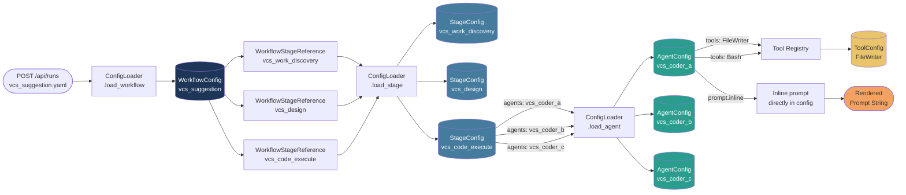

# Configuration & Schema Subsystem — Exhaustive Architecture Reference

**System:** temper-ai Meta-Autonomous Framework
**Scope:** Configuration loading, validation, and schema pipeline — from raw YAML/JSON files to typed Pydantic objects
**Version Analyzed:** Post-M10 (milestone 10 multi-tenant access control complete)
**Date:** 2026-02-22

---

## Table of Contents

1. [Executive Summary](#1-executive-summary)
2. [System Architecture Overview](#2-system-architecture-overview)
3. [Config Loading Pipeline — Step by Step](#3-config-loading-pipeline--step-by-step)
4. [Security Protections at Every Step](#4-security-protections-at-every-step)
5. [Pydantic Schema Reference — Complete Field Catalog](#5-pydantic-schema-reference--complete-field-catalog)
   - 5.1 [WorkflowConfig hierarchy](#51-workflowconfig-hierarchy)
   - 5.2 [StageConfig hierarchy](#52-stageconfig-hierarchy)
   - 5.3 [AgentConfig hierarchy](#53-agentconfig-hierarchy)
   - 5.4 [ToolConfig hierarchy](#54-toolconfig-hierarchy)
   - 5.5 [Trigger schemas](#55-trigger-schemas)
   - 5.6 [Cross-cutting embedded schemas](#56-cross-cutting-embedded-schemas)
6. [Config Resolution Chain](#6-config-resolution-chain)
7. [Environment Variable Substitution Pipeline](#7-environment-variable-substitution-pipeline)
8. [Secret Resolution Subsystem](#8-secret-resolution-subsystem)
9. [Filesystem ConfigLoader vs DB ConfigLoader](#9-filesystem-configloader-vs-db-configloader)
10. [LRU Cache Behavior](#10-lru-cache-behavior)
11. [Config Migration & Versioning](#11-config-migration--versioning)
12. [Schema Validator Dispatch Table](#12-schema-validator-dispatch-table)
13. [Real-World Configuration Examples Annotated](#13-real-world-configuration-examples-annotated)
14. [Mermaid Diagrams](#14-mermaid-diagrams)
15. [Design Patterns & Decisions](#15-design-patterns--decisions)
16. [Extension Points](#16-extension-points)
17. [Observations & Recommendations](#17-observations--recommendations)

---

## 1. Executive Summary

**System Name:** Configuration & Schema Subsystem

**Purpose:** Transforms raw YAML or JSON configuration files (or database records in multi-tenant mode) into fully validated, strongly typed Python objects using Pydantic v2, with multiple layers of security hardening along the way.

**Technology Stack:**
- Python 3.11+
- Pydantic v2 (BaseModel, field_validator, model_validator)
- PyYAML (safe_load only — no arbitrary object construction)
- SQLModel / SQLAlchemy (DB-backed multi-tenant config loading)
- Python `re` module (env var substitution, secret detection)
- `cryptography.Fernet` (in-memory credential obfuscation)
- `packaging.version` (migration BFS path finding)

**Scope of Analysis:** All files listed in the task scope were read exhaustively. The analysis covers the complete pipeline from raw bytes on disk (or in a database) to a validated `WorkflowConfig`, `StageConfig`, `AgentConfig`, or `ToolConfig` Python object.

**Key Insight:** The config system is a multi-stage transformation pipeline where each step adds a security guarantee or a type guarantee. Security operates at the file level (size limit, structure depth, node count, circular reference detection), the string level (env var character whitelisting by context, path traversal blocking, null byte rejection), the secret level (provider-specific pattern matching and resolution), and finally the schema level (Pydantic field validators and model validators enforce business rules).

---

## 2. System Architecture Overview

```
configs/
├── workflows/          ← WorkflowConfig YAML files
│   └── vcs_suggestion.yaml
├── stages/             ← StageConfig YAML files
│   └── vcs_code_execute.yaml
├── agents/             ← AgentConfig YAML files
│   └── vcs_coder.yaml
├── tools/              ← ToolConfig YAML files
│   └── calculator.yaml
├── triggers/           ← CronTrigger / EventTrigger / ThresholdTrigger YAML
└── prompts/            ← Prompt template text files (Jinja2)
```

```
temper_ai/
├── workflow/
│   ├── config_loader.py          ← ConfigLoader (filesystem, LRU cache)
│   ├── _config_loader_helpers.py ← All the heavy lifting functions
│   ├── db_config_loader.py       ← DBConfigLoader (multi-tenant DB backend)
│   ├── _schemas.py               ← WorkflowConfig + all sub-schemas
│   ├── _triggers.py              ← CronTrigger, EventTrigger, ThresholdTrigger
│   ├── security_limits.py        ← ConfigSecurityLimits singleton
│   ├── env_var_validator.py      ← EnvVarValidator (context-aware)
│   ├── constants.py              ← Re-exports from shared.constants.*
│   └── planning.py               ← PlanningConfig (lazy-imported)
├── stage/
│   └── _schemas.py               ← StageConfig + runtime state schemas
├── storage/
│   ├── schemas/
│   │   └── agent_config.py       ← AgentConfig (canonical location)
│   └── database/
│       └── models_tenancy.py     ← WorkflowConfigDB, StageConfigDB, AgentConfigDB
├── tools/
│   └── _schemas.py               ← ToolConfig
├── shared/
│   └── utils/
│       ├── config_helpers.py     ← merge_configs, sanitize_config_for_display
│       ├── config_migrations.py  ← ConfigMigrationRegistry, MigrationStep
│       └── secrets.py            ← SecretReference, resolve_secret, ObfuscatedCredential
├── autonomy/
│   └── _schemas.py               ← AutonomousLoopConfig (lazy-imported by workflow)
├── lifecycle/
│   └── _schemas.py               ← LifecycleConfig (imported by workflow)
├── optimization/
│   └── _schemas.py               ← OptimizationConfig (imported by workflow)
├── events/
│   └── _schemas.py               ← EventBusConfig, StageEventEmitConfig, StageTriggerConfig
├── safety/
│   └── autonomy/
│       └── schemas.py            ← AutonomyConfig (lazy-imported by agent)
└── mcp/
    └── _schemas.py               ← MCPServerConfig (lazy-imported by agent)
```

---

## 3. Config Loading Pipeline — Step by Step

This section traces the exact execution path from a raw file path string to a validated Python object.

### Phase 0: Entry Point — `ConfigLoader.load_workflow()` (or `load_agent()`, `load_stage()`, etc.)

**File:** `/home/shinelay/meta-autonomous-framework/temper_ai/workflow/config_loader.py:190`

```python
def load_agent(self, agent_name: str, validate: bool = True) -> dict[str, Any]:
```

The public API is one method per config type. All five delegate to the shared `_load_config()` internal method (with the exception of `load_agent()` which first checks the M5 `ConfigDeployer` integration).

### Step 1: M5 ConfigDeployer Check (agent only)

**File:** `/home/shinelay/meta-autonomous-framework/temper_ai/workflow/config_loader.py:212`

For agent configs only, the loader first checks whether an M5-improved config has been deployed via the `ConfigDeployer`. This is the self-improvement feedback loop closure:

1. `_ensure_config_deployer()` is called for lazy initialization of the deployer.
2. If a deployer is available and has a deployed config for this agent name, it is returned directly (after schema validation).
3. If deployer lookup fails or no deployed config exists, the pipeline falls through to YAML file loading.

This step is **skipped** for workflow, stage, and tool configs — they always go straight to file loading.

### Step 2: Cache Check

**File:** `/home/shinelay/meta-autonomous-framework/temper_ai/workflow/config_loader.py:150`

```python
cache_key = f"{config_type}:{name}"
if self.cache_enabled and cache_key in self._cache:
    self._cache.move_to_end(cache_key)   # LRU touch
    return self._cache[cache_key]
```

Cache key format: `"agent:vcs_coder"`, `"workflow:vcs_suggestion"`, etc.

On a cache hit, the entry is moved to the end of the `OrderedDict` (most recently used position) and returned immediately — no file I/O, no parsing, no validation.

### Step 3: File Discovery

**File:** `/home/shinelay/meta-autonomous-framework/temper_ai/workflow/_config_loader_helpers.py:40`

```python
def load_config_file(directory: Path, name: str) -> dict[str, Any]:
    for ext in [".yaml", ".yml", ".json"]:
        file_path = directory / f"{name}{ext}"
        if file_path.exists():
            return load_and_validate_config_file(file_path)
```

Extensions are tried in order: `.yaml` first, then `.yml`, then `.json`. The first match wins.

If no file is found, `ConfigNotFoundError` is raised with a descriptive message listing all tried extensions.

### Step 4: File Size Check

**File:** `/home/shinelay/meta-autonomous-framework/temper_ai/workflow/_config_loader_helpers.py:68`

```python
file_size = file_path.stat().st_size
if file_size > MAX_CONFIG_SIZE:  # 10MB
    raise ConfigValidationError(...)
```

**Security limit:** `MAX_CONFIG_SIZE = 10 * 1024 * 1024` (10MB)

This check happens before opening the file. It prevents memory exhaustion from maliciously large files without reading any content.

### Step 5: YAML/JSON Parsing

**File:** `/home/shinelay/meta-autonomous-framework/temper_ai/workflow/_config_loader_helpers.py:74`

```python
if file_path.suffix == ".json":
    config = json.load(f)
else:
    config = yaml.safe_load(f)
```

**Critical security decision:** `yaml.safe_load()` is used exclusively, never `yaml.load()`. This prevents arbitrary Python object construction from YAML anchors. `json.load()` is used for JSON files.

Parse errors are caught as `yaml.YAMLError` or `json.JSONDecodeError` and re-raised as `ConfigValidationError`.

### Step 6: Structure Validation (Depth, Node Count, Circular Reference)

**File:** `/home/shinelay/meta-autonomous-framework/temper_ai/workflow/_config_loader_helpers.py:116`

```python
def validate_config_structure(
    config: Any, file_path: Path,
    current_depth: int = 0,
    visited: set[int] | None = None,
    node_count: list[int] | None = None,
) -> None:
```

This is a recursive traversal of the parsed structure that enforces three limits:

| Limit | Value | Purpose |
|-------|-------|---------|
| `MAX_YAML_NESTING_DEPTH` | 50 | Prevent stack overflow from deeply nested structures |
| `MAX_YAML_NODES` | 100,000 | Prevent "billion laughs" YAML bomb attacks |
| Circular reference check | via `id()` set | Prevent infinite loops |

The circular reference detection uses Python's `id()` function to track visited object identities. The `visited` set is managed with `add()` at entry and `discard()` in the `finally` block, making it safe for non-tree graphs.

### Step 7: Environment Variable Substitution

**File:** `/home/shinelay/meta-autonomous-framework/temper_ai/workflow/_config_loader_helpers.py:152`

```python
def substitute_env_vars(config: Any) -> Any:
    if isinstance(config, dict):
        return {k: substitute_env_vars(v) for k, v in config.items()}
    elif isinstance(config, list):
        return [substitute_env_vars(item) for item in config]
    elif isinstance(config, str):
        return substitute_env_var_string(config)
    else:
        return config
```

The substitution is recursive. The pattern matched in strings is:

```
${VAR_NAME}           → os.environ['VAR_NAME']  (required; error if missing)
${VAR_NAME:default}   → os.environ.get('VAR_NAME', 'default')
```

**Important:** Strings that match the `SecretReference` pattern (`${env:VAR}`, `${vault:path}`, `${aws:id}`) are skipped by `substitute_env_vars` and handled separately in Step 8.

Each resolved value is validated through `validate_env_var_value()` which calls `EnvVarValidator.validate()`.

### Step 8: Environment Variable Security Validation

**File:** `/home/shinelay/meta-autonomous-framework/temper_ai/workflow/env_var_validator.py:382`

The `EnvVarValidator` provides context-aware validation. The validation level is automatically detected from the variable name:

| Context Level | Name Patterns | Allowed Characters |
|---------------|---------------|--------------------|
| `UNRESTRICTED` | prompt, description, message, text | Printable ASCII + tab/newline/CR + Unicode U+0080-FFFF |
| `EXECUTABLE` | cmd, command, exec, script, shell, run, binary | `[A-Za-z0-9_./:-]+` only |
| `PATH` | path, dir, directory, file, folder, root, home | `[A-Za-z0-9_./:\\ -]+` (path-safe chars) |
| `STRUCTURED` | url, uri, endpoint, host, address, dsn, connection | `[A-Za-z0-9_.:/@?&=#%+,;-]+` |
| `IDENTIFIER` | db, database, schema, table, collection, model, name, id | `[A-Za-z0-9_:./-]+` |
| `DATA` | key, token, secret, password, credential, api_key, auth | `[A-Za-z0-9_+=./-]+` |

Detection checks `UNRESTRICTED` first to prevent false matches (e.g., "DESCRIPTION" contains "script" but is UNRESTRICTED, not EXECUTABLE).

Additional context-specific checks:
- **PATH context:** Path traversal validation using `Path.resolve()` against `os.getcwd()` as base
- **EXECUTABLE context:** Scan for shell metacharacters: `$(`, backtick, `||`, `&&`, `;`, `|`, `>`, `<`, `${`
- **IDENTIFIER context (DB-like names):** SQL injection pattern scan

All values are also checked for:
- Length > `MAX_ENV_VAR_SIZE` (10KB): rejected
- Null bytes (`\x00`): always rejected

### Step 9: Secret Resolution

**File:** `/home/shinelay/meta-autonomous-framework/temper_ai/workflow/_config_loader_helpers.py:208`

```python
def resolve_secrets(config: Any) -> Any:
    try:
        return resolve_secret(config)
    except (ValueError, NotImplementedError) as e:
        raise ConfigValidationError(f"Secret resolution failed: {e}")
```

`resolve_secret()` from `temper_ai/shared/utils/secrets.py` is called recursively on the entire config dict. It pattern-matches against three provider schemas:

| Pattern | Provider | Status |
|---------|----------|--------|
| `${env:VAR_NAME}` | Environment variable | Implemented |
| `${vault:path/to/secret}` | HashiCorp Vault | Planned (raises `NotImplementedError`) |
| `${aws:secret-id}` | AWS Secrets Manager | Planned (raises `NotImplementedError`) |

For `${env:VAR_NAME}` resolution, the secret value is validated:
- Not empty or whitespace-only
- Length <= 10KB (`SIZE_10KB`)
- No null bytes

### Step 10: Schema Validation (Pydantic)

**File:** `/home/shinelay/meta-autonomous-framework/temper_ai/workflow/_config_loader_helpers.py:235`

```python
schema_map = {
    "agent": AgentConfig,
    "stage": StageConfig,
    "workflow": WorkflowConfig,
    "tool": ToolConfig,
}
schema_map[config_type](**config)
```

For trigger configs, a special dispatch checks `config["trigger"]["type"]` to select between `EventTrigger`, `CronTrigger`, and `ThresholdTrigger`.

Pydantic `ValidationError` exceptions are caught and re-raised as `ConfigValidationError` with the full validation error message.

### Step 11: LRU Cache Store

**File:** `/home/shinelay/meta-autonomous-framework/temper_ai/workflow/config_loader.py:164`

```python
if self.cache_enabled:
    self._cache[cache_key] = config
    while len(self._cache) > self._max_cache_size:
        self._cache.popitem(last=False)   # evict LRU (first item)
```

The cache stores the **raw dict** (post-substitution, post-validation) — not the Pydantic model. The default max cache size is 120 configs (`MEDIUM_ITEM_LIMIT * CACHE_SIZE_MULTIPLIER = 10 * 12`).

---

## 4. Security Protections at Every Step

```
Step 4:  File size <= 10MB           → Memory exhaustion DoS prevention
Step 5:  yaml.safe_load()            → No arbitrary Python object construction
Step 6:  Depth <= 50                 → Stack overflow prevention
Step 6:  Nodes <= 100,000            → Billion laughs YAML bomb prevention
Step 6:  Circular ref detection      → Infinite loop prevention
Step 7:  Env var substitution        → Only resolves ${VAR} not ${env:VAR}
Step 8:  Context-aware whitelist     → Command injection, SQL injection, path traversal
Step 8:  Null byte rejection         → Path injection / null byte attack prevention
Step 8:  Length limit 10KB           → DoS from large env var expansion
Step 9:  Secret pattern matching     → Prevents accidental plaintext secrets in configs
Step 9:  Empty/null byte validation  → Secret hygiene enforcement
Step 10: Pydantic model validation   → Type safety, field constraints, business rules
Prompt:  Path security validation    → Null bytes, control chars, path traversal for templates
```

The prompt template loader additionally validates the template path before any file access:

**File:** `/home/shinelay/meta-autonomous-framework/temper_ai/workflow/config_loader.py:255`

1. Null byte check in path string
2. ASCII control character check (all control chars except `\n`, `\r`, `\t`)
3. `Path.resolve()` and `relative_to()` check to verify path stays within `prompts_dir`

---

## 5. Pydantic Schema Reference — Complete Field Catalog

### 5.1 WorkflowConfig Hierarchy

**Root schema:** `WorkflowConfig`
**File:** `/home/shinelay/meta-autonomous-framework/temper_ai/workflow/_schemas.py`

#### `WorkflowConfig` (root)

| Field | Type | Default | Constraint | Notes |
|-------|------|---------|-----------|-------|
| `workflow` | `WorkflowConfigInner` | required | — | Main workflow body |
| `schema_version` | `str` | `"1.0"` | — | For migration/backward compat |

#### `WorkflowConfigInner`

| Field | Type | Default | Constraint | Notes |
|-------|------|---------|-----------|-------|
| `name` | `str` | required | — | Workflow identifier |
| `description` | `str` | required | — | Human-readable description |
| `version` | `str` | `DEFAULT_VERSION` | — | Semantic version string |
| `product_type` | `Literal["web_app","mobile_app","api","data_product","data_pipeline","cli_tool"] \| None` | `None` | — | Used by lifecycle/portfolio |
| `predecessor_injection` | `bool` | `False` | — | If True, stages without explicit inputs receive only DAG predecessor outputs |
| `stages` | `list[WorkflowStageReference]` | required | At least one | Ordered list of stage references |
| `config` | `WorkflowConfigOptions` | `WorkflowConfigOptions()` | — | Execution options |
| `safety` | `WorkflowSafetyConfig` | `WorkflowSafetyConfig()` | — | Safety policy |
| `optimization` | `OptimizationConfig \| None` | `None` | — | Prompt/pipeline optimization |
| `lifecycle` | `LifecycleConfig` | `LifecycleConfig()` | — | Self-modification profile |
| `autonomous_loop` | `Any` (coerced to `AutonomousLoopConfig`) | `AutonomousLoopConfig()` | — | Post-execution autonomous loop; lazy import to avoid fan-out |
| `observability` | `WorkflowObservabilityConfig` | `WorkflowObservabilityConfig()` | — | Logging/tracing config |
| `error_handling` | `WorkflowErrorHandlingConfig` | required | — | Failure handling policy |
| `metadata` | `MetadataConfig` | `MetadataConfig()` | — | Tags, owner, timestamps |

**Validators on `WorkflowConfigInner`:**
- `validate_stages` (`@field_validator("stages")`): raises if list is empty
- `validate_stage_dependencies` (`@model_validator(mode="after")`): every `depends_on` reference must name a stage that exists in the `stages` list
- `coerce_autonomous_loop` (`@field_validator("autonomous_loop", mode="before")`): dict → `AutonomousLoopConfig`

#### `WorkflowStageReference`

| Field | Type | Default | Constraint | Notes |
|-------|------|---------|-----------|-------|
| `name` | `str` | required | — | Stage name (referenced in depends_on) |
| `stage_ref` | `str \| None` | `None` | Required (or `config_path`) | Path to stage YAML config |
| `config_path` | `str \| None` | `None` | Deprecated | Old name for `stage_ref`; triggers DeprecationWarning |
| `depends_on` | `list[str]` | `[]` | — | Names of stages that must complete first |
| `optional` | `bool` | `False` | — | Whether stage failure halts the workflow |
| `skip_if` | `str \| None` | `None` | Mutually exclusive with `condition` | Jinja2 expression; if True, skip stage |
| `conditional` | `bool` | `False` | — | Marks stage as conditionally executed |
| `condition` | `str \| None` | `None` | Mutually exclusive with `skip_if` | Jinja2 expression; if False, skip stage |
| `skip_to` | `str \| None` | `None` | — | Jump-forward target stage name |
| `loops_back_to` | `str \| None` | `None` | Non-empty if set | Target stage for loop-back edges |
| `loop_condition` | `str \| None` | `None` | — | Jinja2 expression controlling loop continuation |
| `max_loops` | `int` | `MIN_RETRY_ATTEMPTS` | `> 0` | Maximum iterations for loop-back stages |
| `on_complete` | `Any \| None` (→ `StageEventEmitConfig`) | `None` | — | Event to emit on stage completion (M9) |
| `trigger` | `Any \| None` (→ `StageTriggerConfig`) | `None` | Mutually exclusive with `depends_on` | Event that triggers this stage (M9) |

**Validators on `WorkflowStageReference`:**
- `resolve_stage_ref` (`@model_validator(mode="after")`): migrates `config_path` → `stage_ref`; raises if neither is set
- `validate_conditional_config` (`@model_validator(mode="after")`): enforces mutual exclusion of `condition` and `skip_if`; validates `loops_back_to` is non-empty when set
- `validate_on_complete` (`@model_validator(mode="after")`): dict → `StageEventEmitConfig` (lazy import from `temper_ai.events._schemas`)
- `validate_trigger` (`@model_validator(mode="after")`): dict → `StageTriggerConfig` (lazy import)
- `validate_trigger_depends_exclusive` (`@model_validator(mode="after")`): raises if both `trigger` and `depends_on` are set

#### `WorkflowConfigOptions`

| Field | Type | Default | Constraint | Notes |
|-------|------|---------|-----------|-------|
| `max_iterations` | `int` | `SMALL_ITEM_LIMIT` (10) | `> 0` | Maximum workflow re-runs in autonomous mode |
| `convergence_detection` | `bool` | `False` | — | Enable convergence checking between iterations |
| `timeout_seconds` | `int` | `SECONDS_PER_HOUR` (3600) | `> 0` | Hard timeout for entire workflow |
| `budget` | `BudgetConfig` | `BudgetConfig()` | — | Cost/token budget |
| `tool_cache_enabled` | `bool` | `False` | — | Cache results of read-only tool calls |
| `rate_limit` | `WorkflowRateLimitConfig` | `WorkflowRateLimitConfig()` | — | Workflow-level rate limiting (R0.9) |
| `planning` | `Any` (→ `PlanningConfig`) | `PlanningConfig()` | — | Pre-execution planning pass (R0.8); lazy import |
| `event_bus` | `Any \| None` (→ `EventBusConfig`) | `None` | — | Event bus config (M9); lazy import |

**Validators on `WorkflowConfigOptions`:**
- `coerce_planning` (`@field_validator("planning", mode="before")`): dict → `PlanningConfig`
- `validate_event_bus` (`@model_validator(mode="after")`): dict → `EventBusConfig`

#### `BudgetConfig`

| Field | Type | Default | Constraint | Notes |
|-------|------|---------|-----------|-------|
| `max_cost_usd` | `float \| None` | `None` | `>= 0` | Hard cost cap in USD |
| `max_tokens` | `int \| None` | `None` | `> 0` | Hard token cap |
| `action_on_exceed` | `Literal["halt","continue","notify"]` | `"halt"` | — | What to do when budget exceeded |

#### `WorkflowRateLimitConfig`

| Field | Type | Default | Constraint | Notes |
|-------|------|---------|-----------|-------|
| `enabled` | `bool` | `False` | — | Enable rate limiting |
| `max_rpm` | `int` | `60` | `> 0` | Maximum requests per minute |
| `block_on_limit` | `bool` | `True` | — | Block caller vs. raising error |
| `max_wait_seconds` | `float` | `60.0` | `> 0` | Maximum wait time when blocked |

#### `WorkflowSafetyConfig`

| Field | Type | Default | Constraint | Notes |
|-------|------|---------|-----------|-------|
| `composition_strategy` | `str` | `"MostRestrictive"` | — | How to combine stage-level safety policies |
| `global_mode` | `Literal["execute","dry_run","require_approval"]` | `"execute"` | — | Default safety mode for all stages |
| `approval_required_stages` | `list[str]` | `[]` | — | Stage names requiring explicit approval |
| `dry_run_stages` | `list[str]` | `[]` | — | Stage names running in dry-run mode |
| `custom_rules` | `list[dict[str,Any]]` | `[]` | — | Additional safety rule dicts |

#### `WorkflowObservabilityConfig`

| Field | Type | Default | Constraint | Notes |
|-------|------|---------|-----------|-------|
| `console_mode` | `Literal["minimal","standard","verbose"]` | `"standard"` | — | Console output detail level |
| `trace_everything` | `bool` | `True` | — | Emit trace spans for all operations |
| `export_format` | `list[str]` | `["json"]` | — | Output formats for trace export |
| `generate_dag_visualization` | `bool` | `True` | — | Render DAG on completion |
| `waterfall_in_console` | `bool` | `True` | — | Show waterfall timeline in terminal |
| `alert_on` | `list[str]` | `[]` | — | Event types that trigger alerts |

#### `WorkflowErrorHandlingConfig`

| Field | Type | Default | Constraint | Notes |
|-------|------|---------|-----------|-------|
| `on_stage_failure` | `Literal["halt","skip","retry"]` | `"halt"` | — | Default action on stage failure |
| `max_stage_retries` | `int` | `MIN_RETRY_ATTEMPTS + 1` (4) | `>= 0` | Max retries per failed stage |
| `escalation_policy` | `str` | required | — | Module reference (e.g., `"GracefulDegradation"`) |
| `enable_rollback` | `bool` | `True` | — | Enable automatic rollback on failure |
| `rollback_on` | `list[str]` | `[]` | — | Event types that trigger rollback |

---

### 5.2 StageConfig Hierarchy

**File:** `/home/shinelay/meta-autonomous-framework/temper_ai/stage/_schemas.py`

#### `StageConfig` (root)

| Field | Type | Default | Constraint | Notes |
|-------|------|---------|-----------|-------|
| `stage` | `StageConfigInner` | required | — | Main stage body |
| `schema_version` | `str` | `"1.0"` | — | For migration/backward compat |

#### `StageConfigInner`

| Field | Type | Default | Constraint | Notes |
|-------|------|---------|-----------|-------|
| `name` | `str` | required | — | Stage identifier |
| `description` | `str` | required | — | Human-readable description |
| `version` | `str` | `DEFAULT_VERSION` | — | Semantic version |
| `agents` | `list[str]` | required | At least one | Agent names (looked up via ConfigLoader) |
| `inputs` | `dict[str,Any] \| None` | `None` | — | Input specification with source and type info |
| `outputs` | `dict[str,Any]` | `{}` | — | Output specification |
| `execution` | `StageExecutionConfig` | `StageExecutionConfig()` | — | Parallelism and timeout |
| `collaboration` | `CollaborationConfig \| None` | `None` | — | Multi-agent collaboration strategy |
| `conflict_resolution` | `ConflictResolutionConfig \| None` | `None` | — | Conflict resolution strategy |
| `safety` | `StageSafetyConfig` | `StageSafetyConfig()` | — | Stage-level safety policy |
| `error_handling` | `StageErrorHandlingConfig` | `StageErrorHandlingConfig()` | — | Failure handling policy |
| `quality_gates` | `QualityGatesConfig` | `QualityGatesConfig()` | — | Output quality enforcement |
| `convergence` | `ConvergenceConfig \| None` | `None` | — | Convergence-based re-execution |
| `metadata` | `MetadataConfig` | `MetadataConfig()` | — | Tags, owner, timestamps |

**Validators on `StageConfigInner`:**
- `validate_agents` (`@field_validator("agents")`): raises if list is empty

#### `StageExecutionConfig`

| Field | Type | Default | Constraint | Notes |
|-------|------|---------|-----------|-------|
| `agent_mode` | `Literal["parallel","sequential","adaptive"]` | `"parallel"` | — | How agents within the stage are run |
| `timeout_seconds` | `int` | `SECONDS_PER_30_MINUTES` (1800) | `> 0` | Stage-level execution timeout |
| `adaptive_config` | `dict[str,Any]` | `{}` | — | Configuration for adaptive mode |

#### `CollaborationConfig`

| Field | Type | Default | Constraint | Notes |
|-------|------|---------|-----------|-------|
| `strategy` | `str` | required | Non-empty | Module reference (e.g., `"concatenate"`, `"debate"`) |
| `max_rounds` | `int` | `DEFAULT_MAX_RETRIES` (3) | `> 0` | Maximum collaboration rounds |
| `convergence_threshold` | `float` | `PROB_VERY_HIGH` (0.9) | `0.0–1.0` | Agreement threshold for convergence |
| `config` | `dict[str,Any]` | `{}` | — | Strategy-specific extra config |
| `max_dialogue_rounds` | `int \| None` | `DEFAULT_MAX_RETRIES` | `> 0` | Max rounds for dialogue mode |
| `round_budget_usd` | `float \| None` | `None` | `> 0` | Cost cap per dialogue session |
| `dialogue_mode` | `bool` | `False` | — | Enable multi-round dialogue |
| `roles` | `dict[str,str] \| None` | `None` | — | Agent role assignments (proposer/critic) |
| `context_window_rounds` | `int \| None` | `MIN_RETRY_ATTEMPTS+1` (4) | `> 0` | Rounds kept in full context |

**Validators on `CollaborationConfig`:**
- `validate_strategy` (`@field_validator("strategy")`): enforces non-empty string

#### `ConflictResolutionConfig`

| Field | Type | Default | Constraint | Notes |
|-------|------|---------|-----------|-------|
| `strategy` | `str` | required | Non-empty | Resolution strategy name |
| `metrics` | `list[str]` | `["confidence"]` | — | Metrics to weigh for merit-based resolution |
| `metric_weights` | `dict[str,float]` | `{}` | — | Weights per metric (normalized at runtime) |
| `auto_resolve_threshold` | `float` | `PROB_CRITICAL` (0.95) | `0.0–1.0` | Auto-resolve if support >= this |
| `escalation_threshold` | `float` | `PROB_MEDIUM` (0.5) | `0.0–1.0` | Escalate if support < this |
| `config` | `dict[str,Any]` | `{}` | — | Strategy-specific config |

**Validators on `ConflictResolutionConfig`:**
- `validate_strategy`: non-empty check
- `validate_thresholds` (`@model_validator(mode="after")`): `escalation_threshold <= auto_resolve_threshold`
- `validate_metric_weights` (`@model_validator(mode="after")`): all weights >= 0; total sum > 0

#### `ConvergenceConfig`

| Field | Type | Default | Constraint | Notes |
|-------|------|---------|-----------|-------|
| `enabled` | `bool` | `False` | — | Enable convergence checking |
| `max_iterations` | `int` | `DEFAULT_CONVERGENCE_MAX_ITERATIONS` | `>= MIN_CONVERGENCE_ITERATIONS`, `<= MAX_CONVERGENCE_ITERATIONS` | Max re-runs before giving up |
| `similarity_threshold` | `float` | `PROB_NEAR_CERTAIN` (0.99) | `0.0–1.0` | Similarity required to declare convergence |
| `method` | `Literal["exact_hash","semantic"]` | `"exact_hash"` | — | How similarity is measured |

#### `StageSafetyConfig`

| Field | Type | Default | Constraint | Notes |
|-------|------|---------|-----------|-------|
| `mode` | `Literal["execute","dry_run","require_approval"]` | `"execute"` | — | Stage safety mode |
| `dry_run_first` | `bool` | `False` | — | Run dry-run pass before real execution |
| `require_approval` | `bool` | `False` | — | Require human approval before execution |
| `approval_required_when` | `list[dict[str,Any]]` | `[]` | — | Conditional approval rules |

#### `StageErrorHandlingConfig`

| Field | Type | Default | Constraint | Notes |
|-------|------|---------|-----------|-------|
| `on_agent_failure` | `Literal["halt_stage","retry_agent","skip_agent","continue_with_remaining"]` | `"continue_with_remaining"` | — | What to do when a single agent fails |
| `min_successful_agents` | `int` | `DEFAULT_MIN_ITEMS` (1) | `> 0` | Minimum agents that must succeed |
| `fallback_strategy` | `str \| None` | `None` | — | Fallback module reference |
| `retry_failed_agents` | `bool` | `True` | — | Retry failed agents before giving up |
| `max_agent_retries` | `int` | `MIN_RETRY_ATTEMPTS+1` (4) | `>= 0` | Max retries per agent |

#### `QualityGatesConfig`

| Field | Type | Default | Constraint | Notes |
|-------|------|---------|-----------|-------|
| `enabled` | `bool` | `False` | — | Disabled by default for backward compat |
| `min_confidence` | `float` | `PROB_HIGH` (0.8) | `0.0–1.0` | Minimum output confidence required |
| `min_findings` | `int` | `SMALL_ITEM_LIMIT` (10) | `>= 0` | Minimum number of findings |
| `require_citations` | `bool` | `True` | — | Require sources/citations in output |
| `on_failure` | `Literal["retry_stage","escalate","proceed_with_warning"]` | `"retry_stage"` | — | Action on gate failure |
| `max_retries` | `int` | `MIN_RETRY_ATTEMPTS+1` (4) | `>= 0` | Max gate retry attempts |

#### Runtime State Models (M3, not config — but same file)

| Model | Purpose |
|-------|---------|
| `AgentMetrics` | Tokens, cost, duration, tool calls, retries per agent |
| `AggregateMetrics` | Totals and averages across all agents in a stage |
| `MultiAgentStageState` | Tracks per-agent outputs, statuses, errors, and aggregates |

---

### 5.3 AgentConfig Hierarchy

**File:** `/home/shinelay/meta-autonomous-framework/temper_ai/storage/schemas/agent_config.py`

Note: This file is the **canonical location**. The agent config was originally in `temper_ai.workflow.schemas` and was moved here; the original location provides a re-export shim for backward compatibility.

#### `AgentConfig` (root)

| Field | Type | Default | Constraint | Notes |
|-------|------|---------|-----------|-------|
| `agent` | `AgentConfigInner` | required | — | Main agent body |
| `schema_version` | `str` | `"1.0"` | — | For migration/backward compat |

#### `AgentConfigInner`

| Field | Type | Default | Constraint | Notes |
|-------|------|---------|-----------|-------|
| `name` | `str` | required | — | Agent identifier |
| `description` | `str` | required | — | Human-readable description |
| `version` | `str` | `"1.0"` | — | Semantic version |
| `type` | `str` | `"standard"` | — | Agent type: `standard`, `debate`, `script`, plugin types |
| `script` | `str \| None` | `None` | Required if `type=="script"` | Bash script body (Jinja2 template) |
| `timeout_seconds` | `int \| None` | `None` | `> 0` | Script agent execution timeout |
| `prompt` | `PromptConfig \| None` | `None` | Required unless script or plugin | Prompt config (template or inline) |
| `inference` | `InferenceConfig \| None` | `None` | Required unless script or plugin | LLM provider settings |
| `tools` | `list[str \| ToolReference] \| None` | `None` | — | `None`=auto-discover; `[]`=no tools; list=specific tools |
| `pre_commands` | `list[PreCommand] \| None` | `None` | — | Deterministic pre-execution commands |
| `safety` | `SafetyConfig` | `SafetyConfig()` | — | Per-agent safety settings |
| `memory` | `MemoryConfig` | `MemoryConfig()` | — | Memory backend config |
| `reasoning` | `ReasoningConfig` | `ReasoningConfig()` | — | Pre-execution reasoning pass (R0.7) |
| `context_management` | `ContextManagementConfig` | `ContextManagementConfig()` | — | Context window management (R0.5) |
| `output_schema` | `OutputSchemaConfig \| None` | `None` | — | Structured output enforcement (R0.1) |
| `output_guardrails` | `OutputGuardrailsConfig` | `OutputGuardrailsConfig()` | — | Output guardrail checks (R0.2) |
| `autonomy` | `Any \| None` (→ `AutonomyConfig`) | `None` | — | Per-agent autonomy level; lazy import |
| `mcp_servers` | `list[Any] \| None` (→ `list[MCPServerConfig]`) | `None` | — | MCP server connections; lazy import |
| `prompt_optimization` | `Any \| None` (→ `PromptOptimizationConfig`) | `None` | — | DSPy optimization config; lazy import |
| `plugin_config` | `Any \| None` (→ `PluginConfig`) | `None` | — | External framework plugin config; lazy import |
| `persistent` | `bool` | `False` | — | Enable persistent identity (M9) |
| `agent_id` | `str \| None` | `None` | — | Unique persistent agent ID (M9) |
| `cross_pollination` | `Any \| None` (→ `CrossPollinationConfig`) | `None` | — | Cross-agent knowledge sharing; lazy import (M9) |
| `error_handling` | `ErrorHandlingConfig` | required | — | Retry strategy and fallback |
| `merit_tracking` | `MeritTrackingConfig` | `MeritTrackingConfig()` | — | Decision outcome tracking |
| `observability` | `ObservabilityConfig` | `ObservabilityConfig()` | — | Log inputs/outputs/reasoning |
| `metadata` | `MetadataConfig` | `MetadataConfig()` | — | Tags, owner, timestamps |
| `dialogue_aware` | `bool` | `True` | — | Auto-inject dialogue context into prompt |
| `max_dialogue_context_chars` | `int` | `DEFAULT_MAX_DIALOGUE_CONTEXT_CHARS` | `> 0` | Max chars for injected dialogue context |

**Validators on `AgentConfigInner`:**
- `validate_autonomy` (`@model_validator`): dict → `AutonomyConfig`
- `validate_mcp_servers` (`@model_validator`): list of dicts → list of `MCPServerConfig`
- `validate_prompt_optimization` (`@model_validator`): dict → `PromptOptimizationConfig`
- `validate_plugin_config` (`@model_validator`): dict → `PluginConfig`
- `validate_cross_pollination` (`@model_validator`): dict → `CrossPollinationConfig`
- `validate_agent_type_fields` (`@model_validator`): enforces `script` required for `type=="script"`; enforces `prompt` + `inference` required for non-script, non-plugin types

#### `InferenceConfig`

| Field | Type | Default | Constraint | Notes |
|-------|------|---------|-----------|-------|
| `provider` | `Literal["ollama","vllm","openai","anthropic","custom"]` | required | — | LLM provider |
| `model` | `str` | required | — | Model name/identifier |
| `base_url` | `str \| None` | `None` | — | Custom endpoint URL |
| `api_key_ref` | `str \| None` | `None` | — | Secret reference: `${env:VAR}`, `${vault:path}`, `${aws:id}` |
| `api_key` | `str \| None` | `None` | **DEPRECATED** | Use `api_key_ref` instead |
| `temperature` | `float` | `DEFAULT_TEMPERATURE` | `0.0–2.0` | Sampling temperature |
| `max_tokens` | `int` | `DEFAULT_MAX_TOKENS` | `> 0` | Maximum output tokens |
| `top_p` | `float` | `DEFAULT_TOP_P` | `0.0–1.0` | Nucleus sampling threshold |
| `timeout_seconds` | `int` | `SECONDS_PER_30_MINUTES` (1800) | `> 0` | LLM call timeout |
| `max_retries` | `int` | `DEFAULT_MAX_RETRIES` (3) | `>= 0` | Retry count on transient errors |
| `retry_delay_seconds` | `int` | `int(SHORT_BACKOFF_SECONDS)` | `>= 0` | Initial retry delay |

**Validators on `InferenceConfig`:**
- `migrate_api_key` (`@model_validator(mode="after")`): copies `api_key` → `api_key_ref` with DeprecationWarning; clears old `api_key` field

#### `SafetyConfig` (agent-level)

| Field | Type | Default | Constraint | Notes |
|-------|------|---------|-----------|-------|
| `mode` | `Literal["execute","dry_run","require_approval"]` | `"execute"` | — | Safety execution mode |
| `require_approval_for_tools` | `list[str]` | `[]` | — | Tool names requiring approval |
| `max_tool_calls_per_execution` | `int` | `MAX_TOOL_CALLS_PER_EXECUTION` | `> 0` | Tool call budget |
| `max_execution_time_seconds` | `int` | `MAX_EXECUTION_TIME_SECONDS` | `> 0` | Hard execution timeout |
| `max_prompt_length` | `int` | `MAX_PROMPT_LENGTH` | `> 0` | Max prompt character count |
| `max_tool_result_size` | `int` | `MAX_TEXT_LENGTH` | `> 0` | Max tool result size |
| `risk_level` | `Literal["low","medium","high"]` | `"medium"` | — | Risk classification |

#### `MemoryConfig`

| Field | Type | Default | Constraint | Notes |
|-------|------|---------|-----------|-------|
| `enabled` | `bool` | `False` | — | Enable memory backend |
| `type` | `Literal["vector","episodic","procedural","semantic","cross_session"] \| None` | `None` | Required if enabled | Memory type |
| `scope` | `Literal["session","project","cross_session","permanent"] \| None` | `None` | Required if enabled | Memory scope |
| `provider` | `str` | `"in_memory"` | — | Backend: `"mem0"`, `"in_memory"` |
| `memory_namespace` | `str \| None` | `None` | — | Override namespace for cross-workflow |
| `tenant_id` | `str` | `"default"` | — | Multi-tenant isolation |
| `retrieval_k` | `int` | `MEDIUM_ITEM_LIMIT` (10) | `> 0` | Number of memories to retrieve |
| `relevance_threshold` | `float` | `PROB_HIGH` (0.8) | `0.0–1.0` | Minimum relevance score |
| `embedding_model` | `str` | `"sentence-transformers/all-MiniLM-L6-v2"` | — | Embedding model for vector memory |
| `max_episodes` | `int` | `DEFAULT_QUEUE_SIZE` (100) | `> 0` | Max episodes for episodic memory |
| `decay_factor` | `float` | `PROB_NEAR_CERTAIN` (0.99) | `0.0–1.0` | Episodic memory decay rate |
| `auto_extract_procedural` | `bool` | `False` | — | Extract procedural patterns via LLM |
| `shared_namespace` | `str \| None` | `None` | — | Shared namespace for cross-agent pooling |

**Validators on `MemoryConfig`:**
- `validate_enabled_memory` (`@model_validator`): when `enabled=True`, both `type` and `scope` must be set

#### `PromptConfig`

| Field | Type | Default | Constraint | Notes |
|-------|------|---------|-----------|-------|
| `template` | `str \| None` | `None` | Mutually exclusive with `inline` | Relative path to template file in `configs/prompts/` |
| `inline` | `str \| None` | `None` | Mutually exclusive with `template` | Inline prompt string (Jinja2 supported) |
| `variables` | `dict[str,str]` | `{}` | — | Variables for template substitution |

**Validators on `PromptConfig`:**
- `validate_prompt` (`@model_validator`): exactly one of `template` or `inline` must be set

#### `ToolReference`

| Field | Type | Default | Constraint | Notes |
|-------|------|---------|-----------|-------|
| `name` | `str` | required | — | Tool name |
| `config` | `dict[str,Any]` | `{}` | — | Tool-specific configuration overrides |

#### `PreCommand`

| Field | Type | Default | Constraint | Notes |
|-------|------|---------|-----------|-------|
| `name` | `str` | required | — | Command identifier |
| `command` | `str` | required | — | Bash command (supports `{{ var }}` substitution) |
| `timeout_seconds` | `int` | `PRE_COMMAND_DEFAULT_TIMEOUT` | `> 0`, `<= PRE_COMMAND_MAX_TIMEOUT` | Max execution time |

#### `ReasoningConfig`

| Field | Type | Default | Constraint | Notes |
|-------|------|---------|-----------|-------|
| `enabled` | `bool` | `False` | — | Enable reasoning/planning pass |
| `planning_prompt` | `str \| None` | `None` | — | Custom planning prompt |
| `inject_as` | `Literal["system_prefix","context_section"]` | `"context_section"` | — | Where to inject reasoning in prompt |
| `max_planning_tokens` | `int` | `1024` | `> 0` | Token budget for reasoning pass |
| `temperature` | `float \| None` | `None` | `0.0–2.0` | Override temperature for reasoning |

#### `ContextManagementConfig`

| Field | Type | Default | Constraint | Notes |
|-------|------|---------|-----------|-------|
| `enabled` | `bool` | `False` | — | Enable context window management |
| `strategy` | `Literal["truncate","summarize","sliding_window"]` | `"truncate"` | — | Overflow handling strategy |
| `max_context_tokens` | `int \| None` | `None` | — | Token limit (model max if None) |
| `reserved_output_tokens` | `int` | `2048` | `> 0` | Tokens reserved for output |
| `token_counter` | `Literal["tiktoken","approximate"]` | `"approximate"` | — | Token counting method |

#### `OutputSchemaConfig`

| Field | Type | Default | Constraint | Notes |
|-------|------|---------|-----------|-------|
| `json_schema` | `dict[str,Any] \| None` | `None` | — | JSON schema for output validation |
| `enforce_mode` | `Literal["validate_only","response_format"]` | `"validate_only"` | — | Enforcement mode |
| `max_retries` | `int` | `2` | `>= 0` | Max retries on schema violation |
| `strict` | `bool` | `False` | — | Strict schema enforcement |

#### `OutputGuardrailsConfig`

| Field | Type | Default | Constraint | Notes |
|-------|------|---------|-----------|-------|
| `enabled` | `bool` | `False` | — | Enable output guardrails |
| `checks` | `list[GuardrailCheck]` | `[]` | — | List of check definitions |
| `max_retries` | `int` | `2` | `>= 0` | Max retries on guardrail failure |
| `inject_feedback` | `bool` | `True` | — | Inject failure feedback into next attempt |

#### `GuardrailCheck`

| Field | Type | Default | Constraint | Notes |
|-------|------|---------|-----------|-------|
| `name` | `str` | required | — | Check identifier |
| `type` | `Literal["function","regex"]` | `"function"` | — | Check implementation type |
| `check_ref` | `str \| None` | `None` | — | Python function reference |
| `pattern` | `str \| None` | `None` | — | Regex pattern for regex-type checks |
| `severity` | `Literal["block","warn"]` | `"block"` | — | Action on check failure |

#### `ErrorHandlingConfig` (agent-level)

| Field | Type | Default | Constraint | Notes |
|-------|------|---------|-----------|-------|
| `retry_strategy` | `str` | `"ExponentialBackoff"` | One of valid set | Strategy class name |
| `max_retries` | `int` | `DEFAULT_MAX_RETRIES` (3) | `>= 0` | Max retry attempts |
| `fallback` | `str` | `"GracefulDegradation"` | One of valid set | Fallback class name |
| `escalate_to_human_after` | `int` | `DEFAULT_MAX_RETRIES` | `> 0` | Escalate after N failures |
| `retry_config` | `RetryConfig` | `RetryConfig()` | — | Retry timing configuration |

**Valid retry strategies:** `ExponentialBackoff`, `LinearBackoff`, `FixedDelay`

**Valid fallbacks:** `GracefulDegradation`, `ReturnDefault`, `RaiseError`, `LogAndContinue`

**Validators on `ErrorHandlingConfig`:**
- `validate_retry_strategy` (`@field_validator`): whitelist check
- `validate_fallback` (`@field_validator`): whitelist check

#### `RetryConfig`

| Field | Type | Default | Constraint | Notes |
|-------|------|---------|-----------|-------|
| `initial_delay_seconds` | `int` | `1` | `> 0` | First retry delay |
| `max_delay_seconds` | `int` | `SECONDS_PER_MINUTE // 2` (30) | `> 0` | Maximum delay cap |
| `exponential_base` | `float` | `2.0` | `> 1.0` | Exponential backoff multiplier |

#### `MeritTrackingConfig`

| Field | Type | Default | Constraint | Notes |
|-------|------|---------|-----------|-------|
| `enabled` | `bool` | `True` | — | Enable merit score tracking |
| `track_decision_outcomes` | `bool` | `True` | — | Track outcome of agent decisions |
| `domain_expertise` | `list[str]` | `[]` | — | Domain tags for this agent |
| `decay_enabled` | `bool` | `True` | — | Enable time-based merit decay |
| `half_life_days` | `int` | `DAYS_90` (90) | `> 0` | Merit score half-life |

#### `ObservabilityConfig` (agent-level)

| Field | Type | Default | Constraint | Notes |
|-------|------|---------|-----------|-------|
| `log_inputs` | `bool` | `True` | — | Log agent input data |
| `log_outputs` | `bool` | `True` | — | Log agent output data |
| `log_reasoning` | `bool` | `True` | — | Log reasoning/chain-of-thought |
| `log_full_llm_responses` | `bool` | `False` | — | Log complete LLM responses |
| `track_latency` | `bool` | `True` | — | Track execution latency |
| `track_token_usage` | `bool` | `True` | — | Track token consumption |

#### `MetadataConfig`

| Field | Type | Default | Constraint | Notes |
|-------|------|---------|-----------|-------|
| `tags` | `list[str]` | `[]` | — | Arbitrary string tags |
| `owner` | `str \| None` | `None` | — | Owning team or person |
| `created` | `str \| None` | `None` | — | Creation timestamp (free-form string) |
| `last_modified` | `str \| None` | `None` | — | Last modification timestamp |
| `documentation_url` | `str \| None` | `None` | — | Link to docs |

---

### 5.4 ToolConfig Hierarchy

**File:** `/home/shinelay/meta-autonomous-framework/temper_ai/tools/_schemas.py`

#### `ToolConfig` (root)

| Field | Type | Default | Constraint | Notes |
|-------|------|---------|-----------|-------|
| `tool` | `ToolConfigInner` | required | — | Main tool body |

#### `ToolConfigInner`

| Field | Type | Default | Constraint | Notes |
|-------|------|---------|-----------|-------|
| `name` | `str` | required | — | Tool identifier |
| `description` | `str` | required | — | Human-readable description |
| `version` | `str` | `DEFAULT_VERSION` | — | Semantic version |
| `category` | `str \| None` | `None` | — | Tool category tag |
| `implementation` | `str` | required | — | Python class path (e.g., `"temper_ai.tools.bash.BashTool"`) |
| `default_config` | `dict[str,Any]` | `{}` | — | Default configuration values |
| `safety_checks` | `list[str \| SafetyCheck]` | `[]` | — | Safety checks to run before tool execution |
| `rate_limits` | `RateLimits` | `RateLimits()` | — | Rate limiting configuration |
| `error_handling` | `ToolErrorHandlingConfig` | `ToolErrorHandlingConfig()` | — | Retry/backoff settings |
| `observability` | `ToolObservabilityConfig` | `ToolObservabilityConfig()` | — | Logging configuration |
| `requirements` | `ToolRequirements` | `ToolRequirements()` | — | Network/credential/sandbox requirements |
| `metadata` | `MetadataConfig` | `MetadataConfig()` | — | Tags, owner, timestamps |

#### `RateLimits`

| Field | Type | Default | Constraint | Notes |
|-------|------|---------|-----------|-------|
| `max_calls_per_minute` | `int` | `SMALL_QUEUE_SIZE` (20) | `> 0` | Per-minute call limit |
| `max_calls_per_hour` | `int` | `DEFAULT_QUEUE_SIZE` (100) | `> 0` | Per-hour call limit |
| `max_concurrent_requests` | `int` | `MEDIUM_ITEM_LIMIT` (10) | `> 0` | Concurrent call limit |
| `cooldown_on_failure_seconds` | `int` | `SECONDS_PER_MINUTE` (60) | `>= 0` | Cooldown after failure |

#### `ToolErrorHandlingConfig`

| Field | Type | Default | Constraint | Notes |
|-------|------|---------|-----------|-------|
| `retry_on_status_codes` | `list[int]` | `[]` | — | HTTP status codes that trigger retry |
| `max_retries` | `int` | `DEFAULT_MAX_RETRIES` (3) | `>= 0` | Max retry attempts |
| `backoff_strategy` | `str` | `"ExponentialBackoff"` | — | Retry strategy name |
| `timeout_is_retry` | `bool` | `False` | — | Whether timeout counts as retryable |

#### `ToolRequirements`

| Field | Type | Default | Constraint | Notes |
|-------|------|---------|-----------|-------|
| `requires_network` | `bool` | `False` | — | Tool needs network access |
| `requires_credentials` | `bool` | `False` | — | Tool needs API credentials |
| `requires_sandbox` | `bool` | `False` | — | Tool needs sandboxed execution |

---

### 5.5 Trigger Schemas

**File:** `/home/shinelay/meta-autonomous-framework/temper_ai/workflow/_triggers.py`

Three trigger types share a common union type alias: `TriggerConfig = Union[EventTrigger, CronTrigger, ThresholdTrigger]`

The schema validator (`validate_config`) dispatches to the correct trigger class based on `config["trigger"]["type"]`.

#### `EventTrigger` / `EventTriggerInner`

| Field | Type | Default | Constraint | Notes |
|-------|------|---------|-----------|-------|
| `name` | `str` | required | — | Trigger identifier |
| `description` | `str` | required | — | Human-readable description |
| `type` | `Literal["EventTrigger"]` | required | — | Discriminator |
| `source` | `EventSourceConfig` | required | — | Event source (queue, webhook, etc.) |
| `filter` | `EventFilter` | required | — | Event filter conditions |
| `workflow` | `str` | required | — | Workflow name to trigger |
| `workflow_inputs` | `dict[str,Any]` | `{}` | — | Static inputs for triggered workflow |
| `concurrency` | `ConcurrencyConfig` | `ConcurrencyConfig()` | — | Parallelism and dedup settings |
| `retry` | `TriggerRetryConfig` | `TriggerRetryConfig()` | — | Retry on trigger failure |
| `metadata` | `TriggerMetadata` | `TriggerMetadata()` | — | Alerting and notification |

**`EventSourceConfig`** — source type options: `"message_queue"`, `"webhook"`, `"database_poll"`, `"file_watch"`

**`EventFilterCondition`** — operators: `"in"`, `"eq"`, `"ne"`, `"gt"`, `"lt"`, `"gte"`, `"lte"`, `"contains"`

#### `CronTrigger` / `CronTriggerInner`

| Field | Type | Default | Constraint | Notes |
|-------|------|---------|-----------|-------|
| `name` | `str` | required | — | Trigger identifier |
| `type` | `Literal["CronTrigger"]` | required | — | Discriminator |
| `schedule` | `str` | required | — | Cron format expression |
| `timezone` | `str` | `"UTC"` | — | Timezone for schedule |
| `skip_on_holiday` | `bool` | `True` | — | Skip execution on holidays |
| `skip_if_recent_execution` | `bool` | `True` | — | Skip if recently run |
| `min_hours_between_runs` | `int` | `SECONDS_PER_WEEK // SECONDS_PER_HOUR` (168) | `> 0` | Minimum gap between runs |
| `workflow` | `str` | required | — | Workflow name to trigger |

#### `ThresholdTrigger` / `ThresholdTriggerInner`

| Field | Type | Default | Constraint | Notes |
|-------|------|---------|-----------|-------|
| `name` | `str` | required | — | Trigger identifier |
| `type` | `Literal["ThresholdTrigger"]` | required | — | Discriminator |
| `metric` | `MetricConfig` | required | — | Metric source and query |
| `condition` | `Literal["greater_than","less_than","equals"]` | required | — | Comparison operator |
| `threshold` | `float` | required | — | Threshold value |
| `duration_minutes` | `int` | `MEDIUM_ITEM_LIMIT` (10) | `> 0` | Sustained duration before triggering |
| `compound_conditions` | `CompoundConditions \| None` | `None` | — | AND/OR compound conditions |
| `workflow` | `str` | required | — | Workflow name to trigger |

---

### 5.6 Cross-Cutting Embedded Schemas

These schemas are defined in subsystem modules and lazily embedded into the main config schemas via `model_validator`.

#### `AutonomousLoopConfig` (`temper_ai/autonomy/_schemas.py`)

Embedded in `WorkflowConfigInner.autonomous_loop`

| Field | Type | Default | Notes |
|-------|------|---------|-------|
| `enabled` | `bool` | `False` | Enable post-execution autonomous loop |
| `learning_enabled` | `bool` | `True` | Run learning miners |
| `goals_enabled` | `bool` | `True` | Run goals analysis |
| `portfolio_enabled` | `bool` | `True` | Run portfolio optimizer |
| `auto_apply_learning` | `bool` | `False` | Auto-apply learning recommendations |
| `auto_apply_goals` | `bool` | `False` | Auto-apply goal proposals |
| `auto_apply_min_confidence` | `float` | `DEFAULT_AUTO_APPLY_MIN_CONFIDENCE` | Minimum confidence for auto-apply |
| `max_auto_apply_per_run` | `int` | `DEFAULT_MAX_AUTO_APPLY_PER_RUN` | Cap on auto-applies per workflow run |
| `prompt_optimization_enabled` | `bool` | `False` | Enable DSPy optimization loop |
| `agent_memory_sync_enabled` | `bool` | `False` | Sync learnings to persistent agents (M9) |

#### `LifecycleConfig` (`temper_ai/lifecycle/_schemas.py`)

Embedded in `WorkflowConfigInner.lifecycle`

| Field | Type | Default | Notes |
|-------|------|---------|-------|
| `enabled` | `bool` | `False` | Enable self-modifying lifecycle |
| `profile` | `str \| None` | `None` | Named adaptation profile |
| `auto_classify` | `bool` | `True` | Auto-classify project characteristics |
| `experiment_id` | `str \| None` | `None` | Associated experiment ID |

#### `OptimizationConfig` (`temper_ai/optimization/_schemas.py`)

Embedded in `WorkflowConfigInner.optimization`

| Field | Type | Default | Notes |
|-------|------|---------|-------|
| `evaluators` | `dict[str,EvaluatorConfig]` | `{}` | Named evaluator definitions |
| `pipeline` | `list[PipelineStepConfig]` | `[]` | Optimization pipeline steps |
| `enabled` | `bool` | `True` | Enable optimization |
| `evaluations` | `dict[str,Any]` | `{}` | Per-evaluation definitions |
| `agent_evaluations` | `dict[str,list[str]]` | `{}` | Agent-to-evaluation mappings |

#### `PlanningConfig` (`temper_ai/workflow/planning.py`)

Embedded in `WorkflowConfigOptions.planning`

| Field | Type | Default | Notes |
|-------|------|---------|-------|
| `enabled` | `bool` | `False` | Enable pre-execution planning |
| `provider` | `Literal[...]` | `"openai"` | LLM provider for planning |
| `model` | `str` | `"gpt-4o-mini"` | Model for planning |
| `base_url` | `str \| None` | `None` | Custom endpoint |
| `temperature` | `float` | `0.3` | Planning temperature |
| `max_tokens` | `int` | `2048` | Planning token budget |

#### `EventBusConfig` (`temper_ai/events/_schemas.py`)

Embedded in `WorkflowConfigOptions.event_bus`

| Field | Type | Default | Notes |
|-------|------|---------|-------|
| `enabled` | `bool` | `False` | Enable event bus |
| `persist_events` | `bool` | `True` | Persist events to database |
| `max_event_age_days` | `int` | `DEFAULT_EVENT_RETENTION_DAYS` | Event retention period |

#### `StageEventEmitConfig` (`temper_ai/events/_schemas.py`)

Embedded in `WorkflowStageReference.on_complete`

| Field | Type | Default | Notes |
|-------|------|---------|-------|
| `event_type` | `str` | required | Event type string to emit |
| `include_output` | `bool` | `False` | Include stage output in event payload |

#### `StageTriggerConfig` (`temper_ai/events/_schemas.py`)

Embedded in `WorkflowStageReference.trigger`

| Field | Type | Default | Notes |
|-------|------|---------|-------|
| `event_type` | `str` | required | Event type that triggers this stage |
| `source_workflow` | `str \| None` | `None` | Filter to specific source workflow |
| `payload_filter` | `dict[str,Any] \| None` | `None` | Filter conditions on event payload |
| `timeout_seconds` | `int` | `DEFAULT_TRIGGER_TIMEOUT_SECONDS` | Timeout waiting for event |

#### `AutonomyConfig` (`temper_ai/safety/autonomy/schemas.py`)

Embedded in `AgentConfigInner.autonomy`

| Field | Type | Default | Notes |
|-------|------|---------|-------|
| `enabled` | `bool` | `False` | Enable progressive autonomy |
| `level` | `AutonomyLevel` | `AutonomyLevel.SUPERVISED` (0) | Current autonomy level |
| `allow_escalation` | `bool` | `True` | Allow level escalation |
| `max_level` | `AutonomyLevel` | `AutonomyLevel.RISK_GATED` (2) | Maximum allowed autonomy level |
| `shadow_mode` | `bool` | `True` | Run in shadow mode before escalation |
| `budget_usd` | `float \| None` | `None` | Per-agent cost budget |
| `spot_check_rate` | `float` | `SPOT_CHECK_SAMPLE_RATE` | `0.0–1.0` | Fraction of actions to spot-check |

**`AutonomyLevel` enum:** `SUPERVISED=0`, `SPOT_CHECKED=1`, `RISK_GATED=2`, `AUTONOMOUS=3`, `STRATEGIC=4`

#### `MCPServerConfig` (`temper_ai/mcp/_schemas.py`)

Embedded in `AgentConfigInner.mcp_servers`

| Field | Type | Default | Constraint | Notes |
|-------|------|---------|-----------|-------|
| `name` | `str` | required | — | Server identifier |
| `namespace` | `str \| None` | `None` | — | Tool namespace prefix (defaults to `name`) |
| `command` | `str \| None` | `None` | Exactly one of command/url | Executable for stdio transport |
| `args` | `list[str]` | `[]` | — | Arguments to pass to stdio command |
| `url` | `str \| None` | `None` | Exactly one of command/url | URL for HTTP/SSE transport |
| `env` | `dict[str,str]` | `{}` | — | Extra environment variables for server process |
| `connect_timeout` | `int` | `MCP_DEFAULT_CONNECT_TIMEOUT` | `> 0` | Connection timeout seconds |
| `call_timeout` | `int` | `MCP_DEFAULT_CALL_TIMEOUT` | `> 0` | Tool call timeout seconds |

**Validators on `MCPServerConfig`:**
- `validate_transport` (`@model_validator`): exactly one of `command` or `url` must be set (not both, not neither)

---

## 6. Config Resolution Chain

When a workflow runs, it loads its own config and then dynamically loads stage and agent configs. Here is the resolution chain:

**Step 1:** Caller invokes `ConfigLoader.load_workflow("vcs_suggestion")`
- Loads: `configs/workflows/vcs_suggestion.yaml` → `WorkflowConfig`
- The `stages` list contains `WorkflowStageReference` objects with `stage_ref` paths

**Step 2:** The workflow engine resolves each stage reference
- For each `WorkflowStageReference`, `stage_ref` is a relative path like `configs/stages/vcs_code_execute.yaml`
- `ConfigLoader.load_stage("vcs_code_execute")` is called (or the full path is resolved)
- Result: `StageConfig` object

**Step 3:** The stage executor resolves each agent reference
- `StageConfigInner.agents` is a list of agent name strings: `["vcs_coder_a", "vcs_coder_b", "vcs_coder_c"]`
- For each agent name, `ConfigLoader.load_agent("vcs_coder_a")` is called
- Result: `AgentConfig` object

**Step 4:** Agent factory loads tool configs
- `AgentConfigInner.tools` contains `ToolReference` objects with tool names
- Tool implementations are looked up by name in the tool registry
- Tool YAML configs (from `configs/tools/`) are loaded via `ConfigLoader.load_tool()` when needed
- Result: instantiated tool objects

**Step 5:** Prompt template loading (if `prompt.template` is set)
- `ConfigLoader.load_prompt_template("researcher_base.txt", variables={...})`
- Template is read from `configs/prompts/` with path security validation
- `{{var_name}}` substitution applied
- Result: rendered prompt string

---

## 7. Environment Variable Substitution Pipeline

The substitution operates on a raw dict (post-YAML-parse) and transforms it before Pydantic validation.

### Two Syntaxes

**Syntax 1: Standard env var** — `${VAR_NAME}` or `${VAR_NAME:default}`
- Handled by `substitute_env_vars()` / `substitute_env_var_string()`
- Pattern: `\$\{([A-Za-z_][A-Za-z0-9_]*)(?::([^}]*))?\}`
- If variable is set: use `os.environ[var_name]`
- If not set and default given: use the default
- If not set and no default: raise `ConfigValidationError`

**Syntax 2: Secret reference** — `${env:VAR_NAME}`, `${vault:path}`, `${aws:id}`
- Skipped by `substitute_env_vars()` (detected via `SecretReference.is_reference()`)
- Handled separately by `resolve_secrets()` in Step 9
- This separation means secret references survive the env-var substitution pass intact

### Regex Patterns

```
Env var:    \$\{([A-Za-z_][A-Za-z0-9_]*)(?::([^}]*))?\}
Secret env: \$\{env:([A-Z_][A-Z0-9_]*)\}
Secret vault: \$\{vault:([a-z0-9/_-]+)\}
Secret aws:   \$\{aws:([a-z0-9/_-]+)\}
Template:   \{\{([A-Za-z_][A-Za-z0-9_]*)\}\}
```

Note the differences:
- Standard env vars use `${VAR}` (uppercase or lowercase allowed in variable names)
- Secret env references use `${env:VAR}` (uppercase only in variable name, stricter pattern)
- Template vars use `{{var}}` (double curly braces)

### Context Detection Logic

```
EnvVarValidator.detect_context(var_name):
  var_lower = var_name.lower()
  for level in [UNRESTRICTED, EXECUTABLE, PATH, STRUCTURED, IDENTIFIER, DATA]:
    patterns = CONTEXT_PATTERNS[level]
    if any(pattern in var_lower for pattern in patterns):
      return level
  return DATA  # default for unknown patterns
```

UNRESTRICTED is checked first to prevent "DESCRIPTION" from matching EXECUTABLE (which contains "script").

---

## 8. Secret Resolution Subsystem

**File:** `/home/shinelay/meta-autonomous-framework/temper_ai/shared/utils/secrets.py`

### SecretReference class

Handles three provider types via regex pattern matching:

```python
PATTERNS = {
    "env":   re.compile(r"\$\{env:([A-Z_][A-Z0-9_]*)\}"),
    "vault": re.compile(r"\$\{vault:([a-z0-9/_-]+)\}"),
    "aws":   re.compile(r"\$\{aws:([a-z0-9/_-]+)\}"),
}
```

**Resolution flow for `${env:OPENAI_API_KEY}`:**
1. Pattern match identifies provider = "env", key = "OPENAI_API_KEY"
2. `os.environ.get("OPENAI_API_KEY")` is called
3. Value validation:
   - Not empty or whitespace-only
   - Length <= 10KB
   - No null bytes
4. Resolved value replaces the reference string

**Vault and AWS providers** raise `NotImplementedError` with a message indicating they are planned for v1.1.

### ObfuscatedCredential

Credentials resolved at runtime can be wrapped in `ObfuscatedCredential` for safe in-memory storage:

- Uses `Fernet` symmetric encryption (key generated per instance)
- `__str__()` and `__repr__()` return `"***REDACTED***"` — never expose the plaintext
- `get()` method decrypts and returns the value when needed
- Tracks `_access_count` for audit trails
- **Security caveat (documented explicitly in the code):** This is OBFUSCATION, not cryptographic security. The encryption key lives in the same process memory.

### Config Display Sanitization

`sanitize_config_for_display()` in `temper_ai/shared/utils/config_helpers.py` provides safe redaction for logging:
- Keys matching secret patterns (api_key, password, token, etc.) → value replaced with `"***REDACTED***"`
- Values matching `SecretReference` pattern → `"${env:***REDACTED***}"` etc.
- Values matching high-confidence secret patterns → `"***REDACTED***"`

---

## 9. Filesystem ConfigLoader vs DB ConfigLoader

These two classes implement the same logical interface but read from different backends.

### ConfigLoader (Filesystem)

**File:** `/home/shinelay/meta-autonomous-framework/temper_ai/workflow/config_loader.py`

- **Backend:** Local filesystem, YAML/JSON files
- **Config root discovery:** `TEMPER_CONFIG_ROOT` env var → `./configs/` → walk up directory tree
- **Subdirectory layout:** `agents/`, `stages/`, `workflows/`, `tools/`, `triggers/`, `prompts/`
- **Caching:** In-process `OrderedDict` LRU cache, default 120 entries
- **M5 integration:** Checks `ConfigDeployer` first for agent configs (closes self-improvement loop)
- **Full pipeline:** Size check → parse → structure validation → env var substitution → secret resolution → Pydantic validation → cache store
- **Prompt templates:** Additional security validation for template paths
- **Use case:** Single-tenant deployment, local development (`--dev` mode)

### DBConfigLoader (Database / Multi-Tenant)

**File:** `/home/shinelay/meta-autonomous-framework/temper_ai/workflow/db_config_loader.py`

- **Backend:** SQL database via SQLModel session
- **Config root:** None (configs are stored in DB tables per-tenant)
- **Tenant isolation:** Every query filters by `tenant_id`
- **No caching:** Each call opens a database session and queries directly
- **No security pipeline:** No size check, no env var substitution, no secret resolution (configs are stored pre-processed in the DB as `config_data: dict[str,Any]` JSON)
- **No validation:** Pydantic validation is NOT run on DB-loaded configs (the `validate` parameter is accepted for interface compatibility but ignored)
- **Use case:** Multi-tenant server mode (M10), where configs are imported once via `config_sync.py` and stored in DB

**DB Tables used by DBConfigLoader:**

| Table | SQLModel Class | Unique Constraint |
|-------|---------------|------------------|
| `workflow_configs` | `WorkflowConfigDB` | `(tenant_id, name)` |
| `stage_configs` | `StageConfigDB` | `(tenant_id, name)` |
| `agent_configs` | `AgentConfigDB` | `(tenant_id, name)` |

Each DB config row stores:
- `tenant_id` (FK to `tenants.id`)
- `name` (config identifier)
- `version` (integer, monotonically increasing)
- `description` (string)
- `config_data` (JSON column — the entire raw config dict)
- `created_by` / `updated_by` (FK to `users.id`)
- `created_at` / `updated_at` timestamps

**Interface compatibility:** Both loaders expose `load_workflow(name)`, `load_stage(name, validate=True)`, `load_agent(name, validate=True)`, and `list_configs(config_type)`. The `validate` parameter is only honored by `ConfigLoader`; `DBConfigLoader` silently accepts and ignores it.

**Key difference in `list_configs()`:**
- `ConfigLoader`: scans directory for `.yaml`, `.yml`, `.json` files
- `DBConfigLoader`: queries `SELECT name FROM <table> WHERE tenant_id = ?`

---

## 10. LRU Cache Behavior

**Implementation:** `collections.OrderedDict` used as an LRU cache

**Cache key format:** `f"{config_type}:{name}"` — examples:
- `"agent:vcs_coder"`
- `"stage:vcs_code_execute"`
- `"workflow:vcs_suggestion"`
- `"tool:calculator"`

**LRU access pattern:**
- On hit: `self._cache.move_to_end(cache_key)` — promotes to most-recently-used position
- On store: append to end (`self._cache[cache_key] = config`)
- On eviction: `self._cache.popitem(last=False)` — removes from front (least-recently-used position)

**Default size:** `MEDIUM_ITEM_LIMIT * CACHE_SIZE_MULTIPLIER = 10 * 12 = 120`

**What is cached:** The raw dict **after** env var substitution and secret resolution but **before** Pydantic model construction. Pydantic models are reconstructed from this dict on each call that gets a cache hit. This is a design choice that keeps the cache entries serializable and avoids Pydantic model state issues.

**Cache invalidation:** Manual only via `ConfigLoader.clear_cache()`. There is no automatic file-change detection. The cache is per-instance (not shared across `ConfigLoader` instances).

**Cache can be disabled:** Pass `cache_enabled=False` to the constructor for always-fresh loading (useful in testing).

---

## 11. Config Migration & Versioning

**File:** `/home/shinelay/meta-autonomous-framework/temper_ai/shared/utils/config_migrations.py`

### Schema Versioning

All root config models include a `schema_version: str = "1.0"` field. This field participates in the migration framework.

### ConfigMigrationRegistry

```python
class ConfigMigrationRegistry:
    _migrations: dict[str, list[MigrationStep]]
```

Each `MigrationStep` contains:
- `from_version: str` — source version
- `to_version: str` — target version
- `description: str` — human-readable change description
- `migrate_fn: Callable[[dict], dict]` — transforms the config dict

### Migration Path Discovery

Uses BFS (Breadth-First Search) to find the shortest migration path between versions:

```
graph: {version → [MigrationStep, ...]}
BFS finds: 1.0 → 1.1 → 2.0 (if no direct 1.0→2.0 exists)
```

This allows multi-hop migrations even if direct paths do not exist.

### Global Registries

Three pre-instantiated registries exist as module-level singletons:

```python
agent_migration_registry = ConfigMigrationRegistry()
workflow_migration_registry = ConfigMigrationRegistry()
stage_migration_registry = ConfigMigrationRegistry()
```

### Example Registered Migrations

```python
@agent_migration_registry.register("1.0", "1.1", "Add schema_version to metadata")
def _migrate_agent_1_0_to_1_1(config: dict) -> dict:
    return config  # placeholder

@workflow_migration_registry.register("1.0", "1.1", "Rename 'pipeline' to 'stages'")
def _migrate_workflow_1_0_to_1_1(config: dict) -> dict:
    if "pipeline" in config:
        config["stages"] = config.pop("pipeline")
    return config
```

### `ensure_current_version()` Helper

```python
def ensure_current_version(config, config_type, current_version) -> dict:
    # If schema_version missing, assume "1.0" with a warning
    # Then call registry.migrate(config, current_version)
```

This is the integration point: call `ensure_current_version()` before Pydantic validation to auto-migrate old configs.

---

## 12. Schema Validator Dispatch Table

The `validate_config()` function in `_config_loader_helpers.py` maintains a static dispatch map:

```python
schema_map = {
    "agent":    AgentConfig,
    "stage":    StageConfig,
    "workflow": WorkflowConfig,
    "tool":     ToolConfig,
}
```

For triggers, type-based dispatch:
```python
trigger_type = config.get("trigger", {}).get("type")
if trigger_type == "EventTrigger":     EventTrigger(**config)
elif trigger_type == "CronTrigger":    CronTrigger(**config)
elif trigger_type == "ThresholdTrigger": ThresholdTrigger(**config)
else: raise ConfigValidationError(f"Unknown trigger type: {trigger_type}")
```

All Pydantic `ValidationError` exceptions from the schema constructors are caught and re-raised as `ConfigValidationError`, ensuring consumers only need to handle one exception type.

---

## 13. Real-World Configuration Examples Annotated

### Workflow Config: `vcs_suggestion.yaml`

```yaml
workflow:
  name: vcs_suggestion
  description: "Vision-driven discovery, design, code, and quality-gate pipeline"
  version: "8.0"
  engine: dynamic                    # Extra field — not in Pydantic schema, may be custom
  product_type: api                  # → WorkflowConfigInner.product_type (Literal["api"])

  stages:
    - name: vcs_work_discovery       # → WorkflowStageReference.name
      stage_ref: configs/stages/vcs_work_discovery.yaml  # → stage_ref (relative path)
      description: "..."             # Extra field in YAML — ignored by Pydantic (extra="ignore")

    - name: vcs_design
      stage_ref: configs/stages/vcs_design.yaml
      depends_on:                    # → WorkflowStageReference.depends_on (list)
        - vcs_work_discovery
      condition: "{{ 'DECISION: APPROVE' in ... }}"  # → Jinja2 expression in condition

    - name: vcs_static_check
      stage_ref: configs/stages/vcs_static_check.yaml
      depends_on: [vcs_code_execute]
      loops_back_to: vcs_code_execute   # → loops_back_to (non-empty, validated)
      max_loops: 3                      # → max_loops (> 0)
      loop_condition: "{{ 'OVERALL: FAIL' in ... }}"  # → loop_condition

  error_handling:                    # → WorkflowErrorHandlingConfig (required)
    on_stage_failure: halt           # → Literal["halt","skip","retry"]
    max_stage_retries: 2
    escalation_policy: GracefulDegradation  # → module reference string
    enable_rollback: true

  optimization:                      # → OptimizationConfig
    enabled: false
    evaluations:
      discovery_quality:
        type: scored
        rubric: |
          ...

  autonomous_loop:                   # → AutonomousLoopConfig (coerced from dict)
    enabled: false
    learning_enabled: true
    goals_enabled: true
```

**Notable:** The `vcs_suggestion.yaml` file has several extra keys (`engine`, `execution`, `context_management`, `inputs`, `outputs`, `tags`, `use_cases`) that are not defined in `WorkflowConfigInner`. Pydantic v2's default behavior ignores extra fields unless `model_config = ConfigDict(extra="forbid")` is set. Since it's not set here, these extra keys are silently dropped during validation.

### Stage Config: `vcs_code_execute.yaml`

```yaml
stage:
  name: vcs_code_execute
  description: "3 parallel coders write assigned files from task splitter"
  version: "2.0"

  agents:                            # → StageConfigInner.agents (list[str], non-empty)
    - vcs_coder_a
    - vcs_coder_b
    - vcs_coder_c

  execution:                         # → StageExecutionConfig
    agent_mode: parallel             # → Literal["parallel","sequential","adaptive"]
    timeout_seconds: 1800

  collaboration:                     # → CollaborationConfig
    strategy: "concatenate"          # → strategy (non-empty string validator)
    max_rounds: 1

  conflict_resolution:               # → ConflictResolutionConfig
    strategy: "highest_confidence"   # → strategy (non-empty string validator)

  safety:                            # → StageSafetyConfig
    mode: execute
    require_approval: false
```

**Notable:** `inputs` and `outputs` blocks in the YAML use a schema not fully enforced by `StageConfigInner` — they are stored as `dict[str,Any]` and interpreted by the executor.

### Agent Config: `vcs_coder.yaml`

```yaml
agent:
  name: vcs_coder
  type: standard                     # → AgentConfigInner.type

  prompt:                            # → PromptConfig
    inline: |                        # → inline (validated: exactly one of template/inline)
      You are a code generation agent...

  inference:                         # → InferenceConfig (required for non-script, non-plugin)
    provider: vllm                   # → Literal["ollama","vllm","openai","anthropic","custom"]
    model: qwen3-next
    base_url: http://localhost:8000
    temperature: 0.2                 # → ge=0.0, le=2.0
    max_tokens: 16384                # → gt=0
    timeout_seconds: 1800

  tools:                             # → list[str | ToolReference]
    - name: FileWriter               # → ToolReference
      config:
        allowed_root: "{{ workspace_path }}"
    - name: Bash
      config:
        workspace_root: "{{ workspace_path }}"
        allowed_commands: [python3, pip, ls, cat, find, mkdir, pwd]

  prompt_optimization:               # → PromptOptimizationConfig (lazy-validated)
    enabled: true
    max_demos: 3
    program_store_dir: configs/optimization

  error_handling:                    # → ErrorHandlingConfig (required field)
    retry_strategy: ExponentialBackoff  # → validated against frozenset
    max_retries: 2
    fallback: GracefulDegradation       # → validated against frozenset
    escalate_to_human_after: 3
```

---

## 14. Mermaid Diagrams

### Diagram 1: Raw YAML to Validated WorkflowConfig

```mermaid
flowchart TD
    A([Caller: ConfigLoader.load_workflow]) --> B{Cache hit?}
    B -- Yes --> Z([Return cached dict])
    B -- No --> C[M5 ConfigDeployer check\nagent only]
    C --> D[File discovery\n.yaml → .yml → .json]
    D --> E{File exists?}
    E -- No --> ERR1([ConfigNotFoundError])
    E -- Yes --> F[File size check\nMAX = 10MB]
    F --> G{Size OK?}
    G -- No --> ERR2([ConfigValidationError: too large])
    G -- Yes --> H[Open file with UTF-8 encoding]
    H --> I{File type?}
    I -- YAML --> J[yaml.safe_load]
    I -- JSON --> K[json.load]
    J --> L{Parse OK?}
    K --> L
    L -- No --> ERR3([ConfigValidationError: parse error])
    L -- Yes --> M[validate_config_structure\ndepth ≤ 50, nodes ≤ 100k,\ncircular ref check]
    M --> N{Structure OK?}
    N -- No --> ERR4([ConfigValidationError: structure])
    N -- Yes --> O[substitute_env_vars\nrecursive on all strings\n${VAR} and ${VAR:default}]
    O --> P[validate_env_var_value\nper context-aware rules]
    P --> Q{Env vars OK?}
    Q -- No --> ERR5([ConfigValidationError: env var])
    Q -- Yes --> R[resolve_secrets\n${env:VAR}, ${vault:path}, ${aws:id}]
    R --> S{Secrets OK?}
    S -- No --> ERR6([ConfigValidationError: secret])
    S -- Yes --> T{validate = True?}
    T -- No --> U[Skip Pydantic validation]
    T -- Yes --> V[WorkflowConfig construct\nPydantic validation]
    V --> W{Pydantic OK?}
    W -- No --> ERR7([ConfigValidationError: schema])
    W -- Yes --> X[Store in LRU cache\nevict LRU if > 120 entries]
    U --> X
    X --> Y([Return dict])

    style A fill:#2d6a4f,color:#fff
    style Z fill:#1b4332,color:#fff
    style Y fill:#1b4332,color:#fff
    style ERR1 fill:#9d0208,color:#fff
    style ERR2 fill:#9d0208,color:#fff
    style ERR3 fill:#9d0208,color:#fff
    style ERR4 fill:#9d0208,color:#fff
    style ERR5 fill:#9d0208,color:#fff
    style ERR6 fill:#9d0208,color:#fff
    style ERR7 fill:#9d0208,color:#fff
```

---

### Diagram 2: Class Relationships — Schema Hierarchy

```mermaid
classDiagram
    class WorkflowConfig {
        +WorkflowConfigInner workflow
        +str schema_version = "1.0"
    }

    class WorkflowConfigInner {
        +str name
        +str description
        +str version
        +str|None product_type
        +bool predecessor_injection
        +list~WorkflowStageReference~ stages
        +WorkflowConfigOptions config
        +WorkflowSafetyConfig safety
        +OptimizationConfig|None optimization
        +LifecycleConfig lifecycle
        +AutonomousLoopConfig autonomous_loop
        +WorkflowObservabilityConfig observability
        +WorkflowErrorHandlingConfig error_handling
        +MetadataConfig metadata
    }

    class WorkflowStageReference {
        +str name
        +str|None stage_ref
        +list~str~ depends_on
        +bool optional
        +str|None condition
        +str|None skip_if
        +str|None loops_back_to
        +str|None loop_condition
        +int max_loops
        +StageEventEmitConfig|None on_complete
        +StageTriggerConfig|None trigger
    }

    class StageConfig {
        +StageConfigInner stage
        +str schema_version = "1.0"
    }

    class StageConfigInner {
        +str name
        +str description
        +list~str~ agents
        +dict inputs
        +dict outputs
        +StageExecutionConfig execution
        +CollaborationConfig|None collaboration
        +ConflictResolutionConfig|None conflict_resolution
        +StageSafetyConfig safety
        +StageErrorHandlingConfig error_handling
        +QualityGatesConfig quality_gates
        +ConvergenceConfig|None convergence
        +MetadataConfig metadata
    }

    class AgentConfig {
        +AgentConfigInner agent
        +str schema_version = "1.0"
    }

    class AgentConfigInner {
        +str name
        +str description
        +str type
        +PromptConfig|None prompt
        +InferenceConfig|None inference
        +list tools
        +SafetyConfig safety
        +MemoryConfig memory
        +ReasoningConfig reasoning
        +ErrorHandlingConfig error_handling
        +AutonomyConfig|None autonomy
        +list~MCPServerConfig~ mcp_servers
        +bool persistent
        +MetadataConfig metadata
    }

    class ToolConfig {
        +ToolConfigInner tool
    }

    class ToolConfigInner {
        +str name
        +str description
        +str implementation
        +dict default_config
        +RateLimits rate_limits
        +ToolErrorHandlingConfig error_handling
        +ToolRequirements requirements
        +MetadataConfig metadata
    }

    class InferenceConfig {
        +str provider
        +str model
        +str|None api_key_ref
        +float temperature
        +int max_tokens
        +int timeout_seconds
    }

    class PromptConfig {
        +str|None template
        +str|None inline
        +dict variables
    }

    class MetadataConfig {
        +list~str~ tags
        +str|None owner
        +str|None created
    }

    WorkflowConfig "1" *-- "1" WorkflowConfigInner
    WorkflowConfigInner "1" *-- "1..*" WorkflowStageReference
    WorkflowStageReference ..> StageConfig : resolves via stage_ref
    StageConfig "1" *-- "1" StageConfigInner
    StageConfigInner ..> AgentConfig : resolves via agents list
    AgentConfig "1" *-- "1" AgentConfigInner
    AgentConfigInner "1" *-- "0..1" InferenceConfig
    AgentConfigInner "1" *-- "0..1" PromptConfig
    AgentConfigInner ..> ToolConfig : references by name
    AgentConfigInner "1" *-- "1" MetadataConfig
    StageConfigInner "1" *-- "1" MetadataConfig
    WorkflowConfigInner "1" *-- "1" MetadataConfig
    ToolConfig "1" *-- "1" ToolConfigInner
    ToolConfigInner "1" *-- "1" MetadataConfig
```



---

### Diagram 3: Config Resolution Chain (Runtime)



---

### Diagram 4: Environment Variable Substitution and Secret Resolution Pipeline

```mermaid
flowchart TD
    Start([Raw config dict from yaml.safe_load]) --> ScanStr{Is value a string?}

    ScanStr -- Yes --> SecRef{Is it a secret ref?\n${env:...}, ${vault:...}, ${aws:...}}
    SecRef -- Yes --> Skip[Skip for Step 9\nleave reference intact]
    SecRef -- No --> EnvMatch{Matches ${VAR} or ${VAR:default}?}

    EnvMatch -- No --> Plain[Keep string as-is]
    EnvMatch -- Yes --> HasDefault{Has :default?}

    HasDefault -- No --> CheckEnv{os.environ has VAR?}
    CheckEnv -- No --> MissingErr([ConfigValidationError:\nrequired env var missing])
    CheckEnv -- Yes --> GetVal[Get os.environ value]

    HasDefault -- Yes --> CheckEnvD{os.environ has VAR?}
    CheckEnvD -- No --> UseDefault[Use default string]
    CheckEnvD -- Yes --> GetVal

    GetVal --> Validate[EnvVarValidator.validate:\n1. Length ≤ 10KB\n2. No null bytes\n3. Detect context from var name\n4. Whitelist char pattern check\n5. Context-specific extra checks]
    UseDefault --> Validate

    Validate --> Valid{Passes?}
    Valid -- No --> ValErr([ConfigValidationError:\nenv var invalid])
    Valid -- Yes --> Resolved[Resolved string value]

    Resolved --> Next([Continue to next string])
    Plain --> Next
    Skip --> SecStep

    subgraph SecStep [Step 9: Secret Resolution]
        S1([SecretReference.is_reference check]) --> S2{Provider?}
        S2 -- env --> S3[os.environ.get\nvalidate: non-empty,\nlength ≤ 10KB, no null bytes]
        S2 -- vault --> S4([NotImplementedError:\nplanned v1.1])
        S2 -- aws --> S4
        S3 --> S5{Found?}
        S5 -- No --> S6([ConfigValidationError:\nsecret not found])
        S5 -- Yes --> S7([Resolved secret string])
    end

    style MissingErr fill:#9d0208,color:#fff
    style ValErr fill:#9d0208,color:#fff
    style S4 fill:#e9c46a
    style S6 fill:#9d0208,color:#fff
    style S7 fill:#1b4332,color:#fff
```

---

### Diagram 5: Filesystem ConfigLoader vs DB ConfigLoader

```mermaid
flowchart TB
    subgraph FS [Filesystem ConfigLoader - Single Tenant / Development]
        FSIn([ConfigLoader.load_agent\nload_stage, load_workflow]) --> FSCache{LRU Cache hit?}
        FSCache -- Yes --> FSReturn([Return cached dict])
        FSCache -- No --> FSM5{M5 ConfigDeployer\navailable? agent only}
        FSM5 -- Yes, deployed --> FSM5R([Return deployed config])
        FSM5 -- No / not agent --> FSFile[Scan filesystem\n.yaml / .yml / .json]
        FSFile --> FSSize[Size check ≤ 10MB]
        FSSize --> FSParse[yaml.safe_load / json.load]
        FSParse --> FSStruct[Structure validation\ndepth, nodes, circular]
        FSStruct --> FSEnv[Env var substitution\nwith context-aware validation]
        FSEnv --> FSSec[Secret resolution\n${env:}, ${vault:}, ${aws:}]
        FSSec --> FSVal[Pydantic validation\nAgentConfig / StageConfig / WorkflowConfig]
        FSVal --> FSCacheStore[Store in OrderedDict\nmax 120 entries LRU]
        FSCacheStore --> FSReturn2([Return dict])
    end

    subgraph DB [DBConfigLoader - Multi-Tenant Server Mode M10]
        DBIn([DBConfigLoader.load_agent\nload_stage, load_workflow]) --> DBQ[SELECT config_data\nFROM agent_configs / stage_configs / workflow_configs\nWHERE tenant_id = ? AND name = ?]
        DBQ --> DBFound{Row found?}
        DBFound -- No --> DBErr([FileNotFoundError])
        DBFound -- Yes --> DBReturn([Return config_data dict])
    end

    subgraph Import [Config Import Flow - ConfigSyncService]
        YAML([YAML file on disk]) --> CI[ConfigSyncService.import_config\nor POST /api/configs/import]
        CI --> CIVal[Pydantic validation]
        CIVal --> CIEnv[Env var substitution + secret resolution]
        CIEnv --> CIDB[(Write to DB table\nconfig_data = processed dict)]
    end

    DB_Note([No size check\nNo env var sub\nNo secret resolution\nNo Pydantic validation\nNo caching]) -.-> DB

    Import -.->|processed dict already\nlive in DB| DB

    style FSReturn fill:#1b4332,color:#fff
    style FSReturn2 fill:#1b4332,color:#fff
    style FSM5R fill:#1b4332,color:#fff
    style DBReturn fill:#1b4332,color:#fff
    style DBErr fill:#9d0208,color:#fff
    style DB_Note fill:#e9c46a
```

---

## 15. Design Patterns & Decisions

### Pattern 1: Lazy Import to Control Module Fan-Out

The `_schemas.py` files use `Any` type for several cross-domain fields and defer the import to a `model_validator` that fires at validation time:

```python
# In WorkflowConfigInner:
autonomous_loop: Any = Field(default_factory=_default_autonomous_loop_config)

@field_validator("autonomous_loop", mode="before")
@classmethod
def coerce_autonomous_loop(cls, v: Any) -> Any:
    if isinstance(v, dict):
        from temper_ai.autonomy._schemas import AutonomousLoopConfig  # lazy
        return AutonomousLoopConfig(**v)
    return v
```

This pattern is used for: `autonomous_loop`, `planning`, `event_bus`, `autonomy`, `mcp_servers`, `prompt_optimization`, `plugin_config`, `cross_pollination`, and `on_complete`/`trigger` in stage references.

**Rationale:** The architecture scoring system penalizes modules with `fan-out >= 8` (imports from 8+ other modules). Using lazy imports keeps the static dependency graph shallow while preserving type-safe behavior at runtime.

### Pattern 2: Double-Envelope Schema

All four config types use the "double-envelope" pattern:

```
WorkflowConfig
  └── workflow: WorkflowConfigInner

StageConfig
  └── stage: StageConfigInner

AgentConfig
  └── agent: AgentConfigInner

ToolConfig
  └── tool: ToolConfigInner
```

The outer model adds `schema_version` metadata. The inner model contains all the actual configuration fields. This structure exactly mirrors the YAML format (where configs start with `workflow:`, `stage:`, etc.) and allows the `schema_version` field to live at the top level without polluting the inner config namespace.

### Pattern 3: Whitelist-Based Field Validation

Throughout the codebase, valid values are expressed as whitelists (frozensets or Literal types) rather than blacklists:

```python
VALID_RETRY_STRATEGIES: ClassVar[frozenset[str]] = frozenset({
    "ExponentialBackoff", "LinearBackoff", "FixedDelay"
})

@field_validator("retry_strategy")
@classmethod
def validate_retry_strategy(cls, v: str) -> str:
    if v not in cls.VALID_RETRY_STRATEGIES:
        raise ValueError(...)
    return v
```

Pydantic `Literal` types are used where the set is small and stable (e.g., `Literal["execute","dry_run","require_approval"]`). Frozenset whitelists are used where the set may need to be extended programmatically.

### Pattern 4: Deprecation-First Field Migration

The `api_key` → `api_key_ref` migration demonstrates the deprecation-first approach:

1. Old field retained with `deprecated=True` annotation
2. `model_validator` automatically migrates old → new at validation time
3. `DeprecationWarning` is issued (not an error)
4. Old field is cleared after migration

Same pattern for `config_path` → `stage_ref` in `WorkflowStageReference`.

### Pattern 5: Security Through Structured Validation

The `EnvVarValidator` applies different validation levels based on context detection from variable names. This is a form of "security through structure" — rather than trying to enumerate all dangerous characters (blacklist), it defines what is allowed per context (whitelist), making the system predictable and conservative by default.

The priority order check (UNRESTRICTED first, then increasingly strict levels) prevents false positives while ensuring no variable accidentally gets matched to an overly permissive level.

### Pattern 6: OrderedDict as LRU Cache

Using `collections.OrderedDict` as an LRU cache is a deliberate choice to avoid the `functools.lru_cache` (which caches function calls) — here, cache keys are computed from config type and name, not from function arguments. The manual `move_to_end()` + `popitem(last=False)` pattern achieves O(1) amortized access and eviction.

### Pattern 7: Migration as BFS Graph

The `ConfigMigrationRegistry` treats version migrations as a graph problem. Each registered migration is an edge in a directed graph from one version to another. `get_migration_path()` uses BFS to find the shortest chain of migrations to reach the target version. This supports non-linear version histories (e.g., 1.0 → 1.1 is registered, and later 1.1 → 2.0 is added; calling `migrate(config, "2.0")` from "1.0" automatically chains both).

---

## 16. Extension Points

### Adding a New Config Type

1. Create a new `_schemas.py` file with outer and inner Pydantic models
2. Add a subdirectory under `configs/` for YAML files
3. Add an entry to `schema_map` in `_config_loader_helpers.py:validate_config()`
4. Add an attribute and loader method to `ConfigLoader`
5. Add a DB model in `models_tenancy.py` and a row to `_CONFIG_TYPE_DB_MODEL` in `db_config_loader.py`
6. Add a migration registry in `config_migrations.py`

### Adding a New Secret Provider

1. Add a new pattern to `SecretReference.PATTERNS` in `secrets.py`
2. Implement `_resolve_provider()` branch for the new provider
3. The rest of the pipeline (substitution skip, resolution call) is automatic

### Adding New Env Var Validation Context

1. Add keyword patterns to `EnvVarValidator.CONTEXT_PATTERNS[ValidationLevel.NEW_LEVEL]`
2. Add a `ValidationRule` to `EnvVarValidator.VALIDATION_RULES[ValidationLevel.NEW_LEVEL]`
3. Optionally add a `_check_<context>` method and register it in `_check_context_specific()`

### Adding New Agent Fields

1. Add the field to `AgentConfigInner` in `storage/schemas/agent_config.py`
2. Use `Any | None` with a `model_validator` for cross-domain types (to avoid fan-out)
3. If the type lives in another module, use a lazy import inside the validator
4. Add the field to the YAML schema documentation
5. If the field is required, update `validate_agent_type_fields` validator

### Registering a Config Migration

```python
from temper_ai.shared.utils.config_migrations import agent_migration_registry

@agent_migration_registry.register("1.1", "1.2", "Add context_management field")
def migrate_1_1_to_1_2(config: dict) -> dict:
    config.setdefault("context_management", {"enabled": False})
    return config
```

### Adding a New Collaboration Strategy

1. Implement the strategy class in `temper_ai/agent/strategies/`
2. Register it in `temper_ai/agent/strategies/registry.py`
3. Reference it by name string in `CollaborationConfig.strategy`
4. No schema changes required (strategy is `str`, not `Literal`)

---

## 17. Observations & Recommendations

### Strengths

**1. Multi-layer security is comprehensive.** Every attack vector identified in production YAML parsing libraries is addressed: file size limits, `yaml.safe_load` only, nesting depth limit, node count limit, circular reference detection, null byte rejection, path traversal prevention in template loading, context-aware env var validation, and ReDoS-resistant secret detection.

**2. Lazy import pattern cleanly manages fan-out.** The use of `Any` type with `model_validator` for cross-domain fields keeps the module import graph shallow while maintaining runtime type safety. This is a well-documented and justified pattern in `MEMORY.md`.

**3. Double-envelope schema mirrors YAML structure exactly.** The `WorkflowConfig { workflow: WorkflowConfigInner }` pattern ensures that a YAML file `{ workflow: { name: ... } }` can be loaded with a single `WorkflowConfig(**yaml_dict)` call without any pre-processing.

**4. LRU cache avoids redundant I/O.** The `OrderedDict`-based LRU with configurable max size prevents repeated filesystem access for frequently-loaded configs in long-running servers.

**5. Deprecation is handled gracefully.** Both `config_path → stage_ref` and `api_key → api_key_ref` migrations emit `DeprecationWarning` and auto-migrate, giving callers time to update without breaking existing configs.

**6. Migration framework supports non-linear evolution.** BFS-based path finding allows the framework to handle version gaps (e.g., a config at version 1.0 being migrated to 2.0 via 1.1 and 1.2 automatically).

### Areas of Concern

**1. Extra fields are silently dropped.** `vcs_suggestion.yaml` has `engine`, `execution`, `context_management`, `inputs`, `outputs`, `tags`, and `use_cases` keys that do not exist in `WorkflowConfigInner`. These are silently ignored by Pydantic's default `extra="ignore"` behavior. This means typos in field names will never produce a validation error. Recommendation: add `model_config = ConfigDict(extra="forbid")` or at least `extra="allow"` with a warning log to detect unrecognized fields.

**2. DBConfigLoader skips validation entirely.** Configs loaded from the DB are returned as raw dicts without Pydantic validation. This means a corrupt or malformed DB row will only fail at runtime when the config dict is used. Recommendation: either validate on DB write (config import) exclusively, or run a lightweight validation on DB read.

**3. Cache stores raw dicts, not Pydantic models.** Every cache hit requires reconstructing the Pydantic model from the dict at the call site. If callers want a validated `WorkflowConfig` object, they call `WorkflowConfig(**cached_dict)` each time. This is not visible in the `ConfigLoader` API but is worth documenting in consumer code.

**4. No file-change invalidation.** The LRU cache has no TTL and no file-watcher integration. In a long-running server, if a YAML config file changes on disk, the cached version continues to be served until `clear_cache()` is explicitly called or the server restarts. This is correct behavior for production but may surprise developers.

**5. Vault and AWS secret providers not implemented.** The patterns are matched and `NotImplementedError` is raised. Any config referencing `${vault:...}` or `${aws:...}` will fail at load time. This is acceptable with clear messaging but should be tracked as planned work.

**6. `MigrationStep.migrate_fn` type is not validated at runtime.** The BFS path finder returns steps and their `migrate_fn` callables are called in sequence, but there is no verification that the output dict of one step is compatible with the input expectations of the next step. A migration that produces an incorrect schema silently produces bad data.

**7. `EnvVarValidator.detect_context()` is order-sensitive and heuristic.** The context detection relies on substring matching of variable names. A variable named `PROMPT_COMMAND` would match UNRESTRICTED ("prompt") before EXECUTABLE ("command"). The ordering is intentional but fragile — a new keyword added to CONTEXT_PATTERNS in the wrong order could break detection. Recommendation: document this ordering invariant prominently.

### Best Practices Observed

- **`yaml.safe_load` is non-negotiable** — never use `yaml.load()` in production config loading code
- **Validate at the boundary** — all external data (files, env vars, DB records) is validated before use; internally constructed objects trust Pydantic
- **Use `frozenset` for valid value sets** — immutable, O(1) lookup, clearly documented in `ClassVar` annotations
- **Separate secrets from regular env vars** — the two-syntax approach (`${VAR}` vs `${env:VAR}`) cleanly separates substitution from secret resolution, making each step independently testable
- **Document security rationale inline** — the `security_limits.py` file has explicit comments explaining why each limit was chosen, making it easier to adjust for different deployment scenarios
- **Use `model_validator(mode="after")` for cross-field validation** — field validators run on single fields; cross-field constraints (like `escalation_threshold <= auto_resolve_threshold`) must use model validators
- **Prefer `DeprecationWarning` over errors for field renames** — allows gradual migration without breaking existing configs in production

---

*End of document. All file paths referenced are absolute paths within `/home/shinelay/meta-autonomous-framework/`.*
