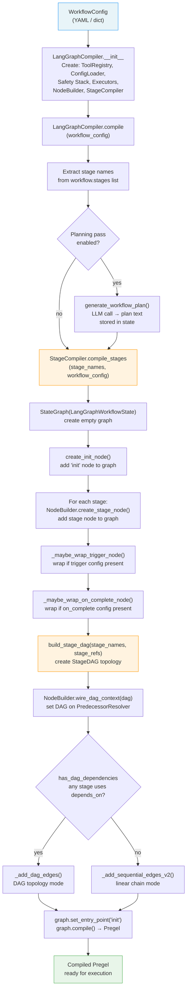
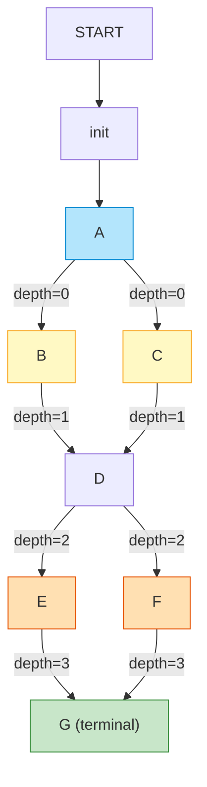
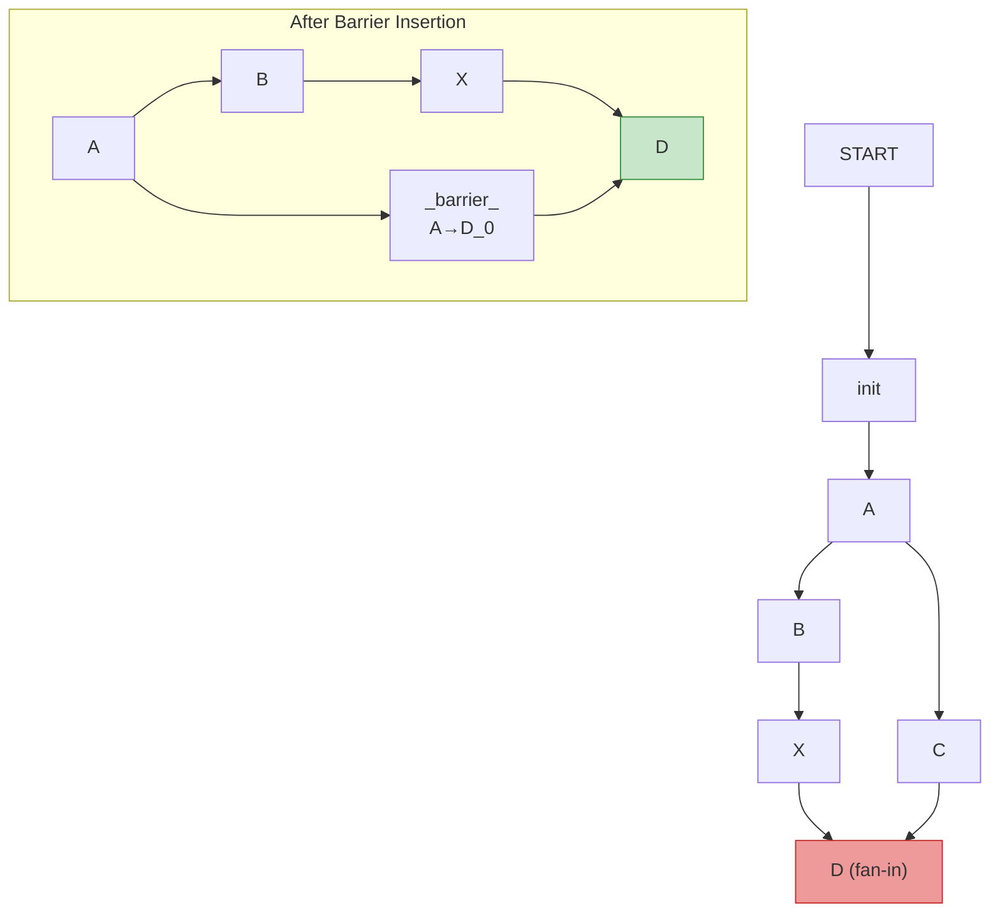
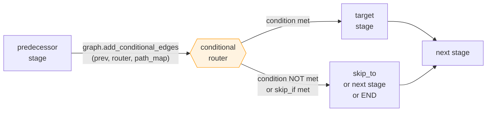
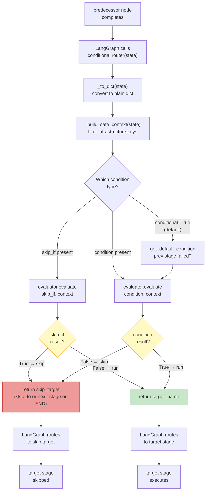
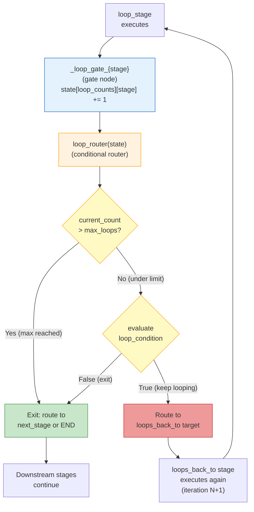
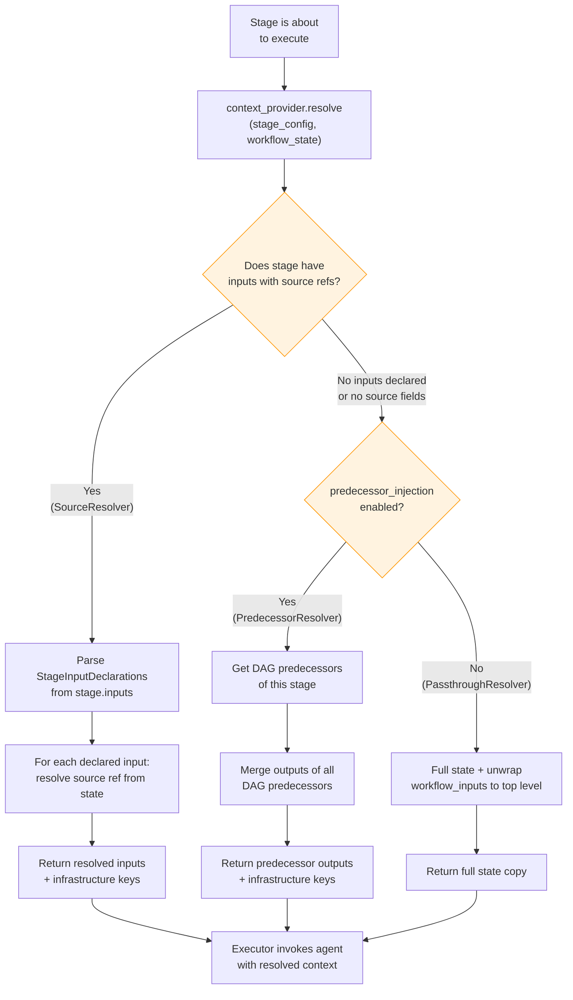
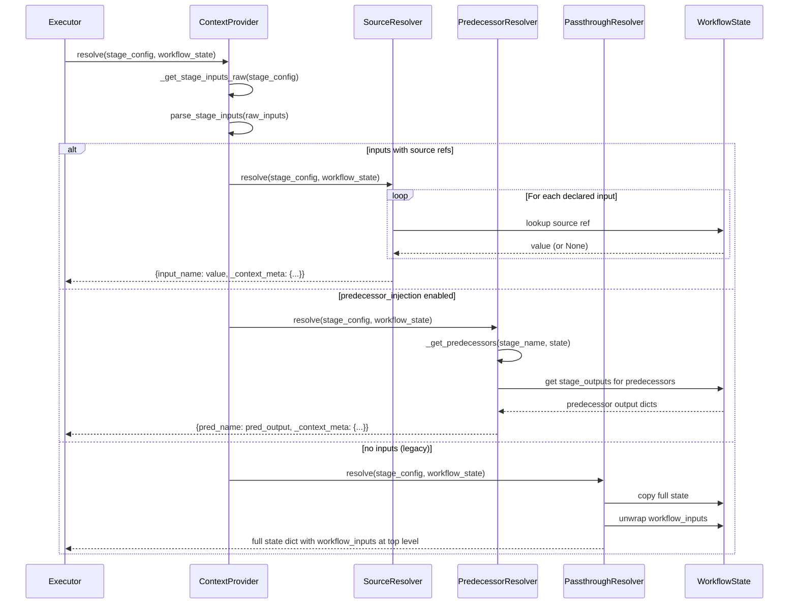
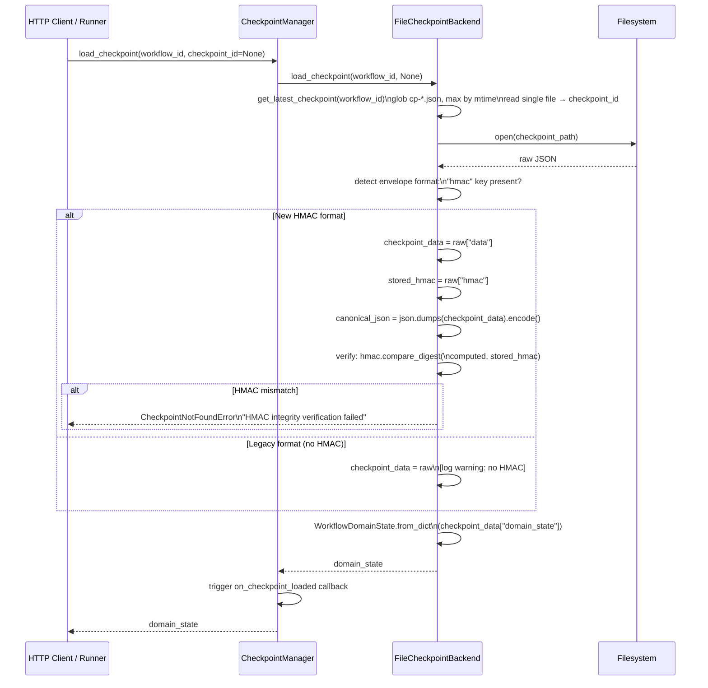
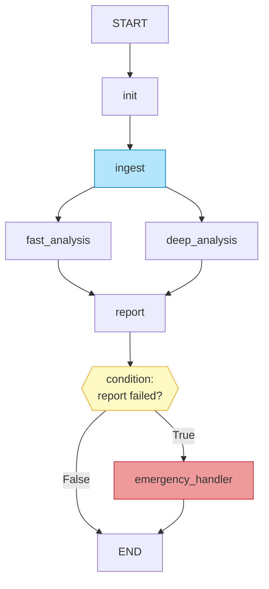

# Workflow Compilation & DAG Architecture

**Document:** 03-workflow-compilation.md
**System:** temper-ai Meta-Autonomous Framework
**Date:** 2026-02-22
**Scope:** Full pipeline from `WorkflowConfig` validation through LangGraph compilation to executable DAG

---

## 1. Executive Summary

- **System Name:** Workflow Compilation & DAG Subsystem
- **Purpose:** Transforms a validated `WorkflowConfig` (parsed YAML) into a compiled, executable LangGraph `Pregel` graph that orchestrates multi-agent stages with support for sequential, parallel fan-out/fan-in, conditional branching, loop-back, event triggers, and checkpoint-based resume.
- **Technology Stack:** Python 3.12, LangGraph (StateGraph / Pregel), Jinja2 (ImmutableSandboxedEnvironment), Pydantic v2, JSON (checkpoint serialization), HMAC-SHA256 (checkpoint integrity).
- **Scope of Analysis:** All files listed in the task brief were read in full; this document covers the complete compilation pipeline from schema to executable DAG, including all supporting subsystems.

---

## 2. Architecture Overview

### 2.1 System Architecture

```
┌─────────────────────────────────────────────────────────────────────────────┐
│                    WORKFLOW COMPILATION PIPELINE                            │
│                                                                             │
│   YAML / Dict                                                               │
│   WorkflowConfig                                                            │
│        │                                                                    │
│        ▼                                                                    │
│  ┌─────────────────┐                                                        │
│  │ LangGraphCompiler│  (orchestration entry point)                          │
│  │  engines/        │  — creates all sub-components                        │
│  │  langgraph_      │  — calls StageCompiler.compile_stages()              │
│  │  compiler.py     │                                                       │
│  └────────┬────────┘                                                        │
│           │ uses                                                            │
│     ┌─────▼──────────────────────────────────────────────┐                 │
│     │               StageCompiler                         │                 │
│     │          workflow/stage_compiler.py                 │                 │
│     │  • Creates StateGraph(LangGraphWorkflowState)       │                 │
│     │  • Adds "init" node (state initialization)         │                 │
│     │  • Calls NodeBuilder for each stage                │                 │
│     │  • Calls build_stage_dag() for DAG topology        │                 │
│     │  • Wires edges (sequential / DAG / conditional /   │                 │
│     │    loop) using ConditionEvaluator + routers        │                 │
│     │  • Inserts barrier nodes for fan-in equalization   │                 │
│     │  • Wraps nodes with event triggers / on_complete   │                 │
│     │  • Calls graph.compile() → Pregel                  │                 │
│     └─────┬──────────────────────────────────────────────┘                 │
│           │ delegates to                                                    │
│     ┌─────▼────────────┐    ┌────────────────────────────┐                 │
│     │   NodeBuilder     │    │       DAGBuilder            │                 │
│     │ workflow/         │    │  workflow/dag_builder.py    │                 │
│     │ node_builder.py   │    │  • build_stage_dag()       │                 │
│     │ • create_stage_   │    │  • _topological_sort()     │                 │
│     │   node() closure  │    │  • compute_depths()        │                 │
│     │ • load stage cfg  │    │  • _detect_cycle()         │                 │
│     │ • get agent_mode  │    │  → StageDAG dataclass      │                 │
│     │ • select executor │    └────────────────────────────┘                 │
│     │ • wire_dag_context│                                                   │
│     └─────┬────────────┘                                                    │
│           │                                                                 │
│     ┌─────▼──────────────────────────────────────────────┐                 │
│     │              Stage Executors                        │                 │
│     │  stage/executors/{sequential,parallel,adaptive}.py │                 │
│     │  • execute_stage(stage_name, stage_config, state,  │                 │
│     │                  config_loader, tool_registry)     │                 │
│     └────────────────────────────────────────────────────┘                 │
│                                                                             │
│  SUPPORTING SUBSYSTEMS:                                                     │
│  ┌───────────────────┐  ┌────────────────────┐  ┌────────────────────────┐ │
│  │  ConditionEvaluator│  │ RoutingFunctions   │  │   ContextProvider      │ │
│  │  condition_        │  │ routing_functions  │  │  context_provider.py   │ │
│  │  evaluator.py      │  │ .py                │  │  (Source / Predecessor │ │
│  │  Jinja2 sandbox    │  │ create_conditional │  │   / Passthrough)       │ │
│  │  template cache    │  │ _router()          │  └────────────────────────┘ │
│  └───────────────────┘  │ create_loop_router │                             │
│                          └────────────────────┘                             │
│  ┌───────────────────┐  ┌────────────────────┐  ┌────────────────────────┐ │
│  │  CheckpointManager│  │   StateManager     │  │   OutputExtractor      │ │
│  │  checkpoint_       │  │  state_manager.py  │  │  output_extractor.py   │ │
│  │  manager.py +      │  │  initialize_state()│  │  LLMOutputExtractor /  │ │
│  │  backends.py       │  │  create_init_node()│  │  NoopExtractor         │ │
│  │  HMAC integrity    │  └────────────────────┘  └────────────────────────┘ │
│  └───────────────────┘                                                      │
└─────────────────────────────────────────────────────────────────────────────┘
```

### 2.2 Component Breakdown

#### LangGraphCompiler
- **Location:** `temper_ai/workflow/engines/langgraph_compiler.py`
- **Purpose:** Top-level orchestration entry point. Creates and wires all sub-components, provides the `compile(workflow_config)` method.
- **Key Responsibilities:** Instantiate `ToolRegistry`, `ConfigLoader`, safety stack (`ToolExecutor`), all three executor strategies, `SourceResolver` context provider, `NodeBuilder`, `ConditionEvaluator`, `StageCompiler`.
- **Dependencies:** All subsystems listed below.
- **Used By:** `LangGraphEngine`, `NativeEngine`, workflow runners in `temper_ai/workflow/engines/`.

#### StageCompiler
- **Location:** `temper_ai/workflow/stage_compiler.py`
- **Purpose:** The graph-wiring brain. Translates a flat list of stage names + workflow config into a fully-wired LangGraph `StateGraph`.
- **Key Responsibilities:** Create `StateGraph(LangGraphWorkflowState)`, add init node, add stage nodes via NodeBuilder, build StageDAG, wire sequential or DAG-topology edges, insert barrier nodes, handle conditional/loop routing, wrap nodes with event triggers and on_complete emitters.
- **Dependencies:** `NodeBuilder`, `ConditionEvaluator`, `routing_functions`, `dag_builder`, `state_manager`, LangGraph (`StateGraph`, `START`, `END`).
- **Used By:** `LangGraphCompiler`.

#### NodeBuilder
- **Location:** `temper_ai/workflow/node_builder.py`
- **Purpose:** Factory for LangGraph node callables. Each node encapsulates stage config loading, executor selection, and checkpoint-resume logic.
- **Key Responsibilities:** `create_stage_node()` closure, checkpoint-skip detection, `_load_stage_config()`, `get_agent_mode()`, failure policy enforcement, `wire_dag_context()`.
- **Dependencies:** `ConfigLoader`, `ToolRegistry`, executor dict, `ContextProvider`.
- **Used By:** `StageCompiler`.

#### DAGBuilder
- **Location:** `temper_ai/workflow/dag_builder.py`
- **Purpose:** Pure graph construction — takes stage names and `depends_on` declarations to build a `StageDAG` with topological ordering.
- **Key Responsibilities:** `build_stage_dag()`, `_topological_sort()` (Kahn's BFS), `_detect_cycle()`, `compute_depths()`, `has_dag_dependencies()`.
- **Dependencies:** None (pure data transformation).
- **Used By:** `StageCompiler`, `NodeBuilder` (via `wire_dag_context`).

#### StageDAG
- **Location:** `temper_ai/workflow/dag_builder.py` (dataclass)
- **Purpose:** Immutable result of DAG construction. Carries `predecessors`, `successors`, `roots`, `terminals`, `topo_order`.
- **Used By:** `StageCompiler`, `NodeBuilder`, `DAGVisualizer`, `PredecessorResolver`.

#### ConditionEvaluator
- **Location:** `temper_ai/workflow/condition_evaluator.py`
- **Purpose:** Safe Jinja2 evaluation of condition/skip_if/loop_condition expressions against workflow state.
- **Key Responsibilities:** `evaluate()`, `_build_safe_context()` (filters infrastructure keys), LRU template cache (128 entries), `_SilentUndefined` for missing keys.
- **Dependencies:** Jinja2 `ImmutableSandboxedEnvironment`.
- **Used By:** `StageCompiler` (via routing functions).

#### RoutingFunctions
- **Location:** `temper_ai/workflow/routing_functions.py`
- **Purpose:** Factory functions that create LangGraph router callables for conditional edges and loop-back edges.
- **Key Responsibilities:** `create_conditional_router()`, `create_loop_router()`, `_get_loop_counts()`, `_to_dict()`.
- **Dependencies:** `ConditionEvaluator`, `StateKeys`, LangGraph `END`.
- **Used By:** `StageCompiler`.

#### ContextProvider (3 implementations)
- **Location:** `temper_ai/workflow/context_provider.py`
- **Purpose:** Resolves stage input data from workflow state before execution. Replaces pass-everything with selective injection.
- **Key Responsibilities:** `SourceResolver.resolve()` (source refs), `PredecessorResolver.resolve()` (DAG-based), `PassthroughResolver.resolve()` (legacy full-state).
- **Dependencies:** `StateKeys`, `context_schemas`, `config_helpers`.
- **Used By:** Stage executors (injected via `NodeBuilder`).

#### WorkflowExecutionContext / LangGraphWorkflowState
- **Location:** `temper_ai/workflow/execution_context.py`, `temper_ai/workflow/langgraph_state.py`
- **Purpose:** Define the schema of the runtime state dict that flows through LangGraph nodes.
- **Key Responsibilities:** `WorkflowExecutionContext` TypedDict (all optional keys), `LangGraphWorkflowState` dataclass with `Annotated` LangGraph reducers for parallel branch merging.
- **Used By:** Every node function, all executors.

#### StateManager
- **Location:** `temper_ai/workflow/state_manager.py`
- **Purpose:** State initialization utilities — creates the initial state dict and the `init` LangGraph node.
- **Key Responsibilities:** `initialize_state()`, `create_init_node()`, `RESERVED_STATE_KEYS` enforcement.
- **Used By:** `StageCompiler`, `LangGraphCompiler`.

#### CheckpointManager + FileCheckpointBackend
- **Location:** `temper_ai/workflow/checkpoint_manager.py`, `temper_ai/workflow/checkpoint_backends.py`
- **Purpose:** Persist and restore workflow state for long-running workflow resume.
- **Key Responsibilities:** `save_checkpoint()`, `load_checkpoint()`, HMAC-SHA256 envelope, atomic write via `tempfile` + `os.replace()`, path traversal protection, per-workflow directory structure.
- **Used By:** Workflow runners, checkpoint API endpoints.

#### WorkflowDomainState / InfrastructureContext
- **Location:** `temper_ai/workflow/domain_state.py`
- **Purpose:** The fundamental serialization boundary. Domain state is pure data (checkpointable); infrastructure is recreated on resume.
- **Key Responsibilities:** `to_dict()`, `from_dict()`, `set_stage_output()`, `validate()`, `copy()`.
- **Used By:** Checkpoint backends, all executors, state manager.

#### OutputExtractor
- **Location:** `temper_ai/workflow/output_extractor.py`
- **Purpose:** Post-execution structured field extraction from raw LLM output. Fills the `structured` compartment of stage outputs.
- **Key Responsibilities:** `LLMOutputExtractor.extract()`, `NoopExtractor`, `get_extractor()` factory.
- **Dependencies:** LLM infrastructure, `context_schemas`.
- **Used By:** Stage executors (sequential, parallel).

#### DAGVisualizer
- **Location:** `temper_ai/workflow/dag_visualizer.py`
- **Purpose:** Export a `StageDAG` to Mermaid flowchart, Graphviz DOT, or terminal ASCII.
- **Key Responsibilities:** `export_mermaid()`, `export_dot()`, `render_console_dag()`.
- **Used By:** `POST /api/visualize` endpoint.

#### Planning
- **Location:** `temper_ai/workflow/planning.py`
- **Purpose:** Optional pre-execution LLM planning pass (R0.8) that injects a strategic plan into agent prompts.
- **Key Responsibilities:** `generate_workflow_plan()`, `build_planning_prompt()`, `PlanningConfig`.
- **Used By:** Workflow runners if `planning.enabled: true` in config.

---

## 3. The Full Compilation Pipeline

### 3.1 Pipeline Overview



### 3.2 Step-by-Step Execution Flow

**Step 1 — LangGraphCompiler Initialization** (`engines/langgraph_compiler.py:89-178`)

When a caller creates a `LangGraphCompiler`, the constructor assembles the entire component graph:

```python
compiler = LangGraphCompiler(
    tool_registry=None,      # auto-created
    config_loader=None,      # auto-created
    tool_executor=None,      # auto-created via create_safety_stack()
    safety_config_path=None, # defaults to configs/safety/action_policies.yaml
    safety_environment=None, # defaults to SAFETY_ENV or "development"
)
```

The `_initialize_components()` method creates them in dependency order:
1. `SequentialStageExecutor(tool_executor=...)` — handles single-agent stages
2. `ParallelStageExecutor(tool_executor=...)` — handles multi-agent stages
3. `AdaptiveStageExecutor(tool_executor=...)` — auto-selects based on agent count
4. `SourceResolver()` — context provider injected into all executors
5. `NodeBuilder(config_loader, tool_registry, executors, tool_executor, context_provider)`
6. `ConditionEvaluator()`
7. `StageCompiler(node_builder, condition_evaluator)`

**Step 2 — compile() entry point** (`engines/langgraph_compiler.py:180+`)

```python
compiled_graph = compiler.compile(workflow_config)
```

This extracts the stage list from `workflow_config["workflow"]["stages"]`, builds the ordered `stage_names` list, and calls `StageCompiler.compile_stages(stage_names, workflow_config)`.

**Step 3 — StateGraph construction** (`stage_compiler.py:71-124`)

`compile_stages()` is the core function:

```python
graph: StateGraph[Any] = StateGraph(LangGraphWorkflowState)

# 1. Add init node (state initialization guard)
init_node = create_init_node()
graph.add_node("init", init_node)

# 2. Build ref lookup {stage_name: WorkflowStageReference}
stage_refs = self._get_stage_refs(workflow_config)
ref_lookup = self._build_ref_lookup(stage_refs)

# 3. Add execution node for each stage
for stage_name in stage_names:
    stage_node = self.node_builder.create_stage_node(stage_name, workflow_config)
    stage_node = _maybe_wrap_trigger_node(stage_name, stage_node, stage_ref)
    stage_node = _maybe_wrap_on_complete_node(stage_name, stage_node, stage_ref)
    graph.add_node(stage_name, stage_node)

# 4. Build DAG topology and wire context
dag = build_stage_dag(stage_names, stage_refs)
self.node_builder.wire_dag_context(dag)

# 5. Add edges (dispatches to sequential or DAG mode)
self._add_edges(graph, stage_names, stage_refs)

graph.set_entry_point("init")
return graph.compile()  # returns Pregel
```

**Step 4 — Node creation** (`node_builder.py:59-136`)

`NodeBuilder.create_stage_node()` returns a closure — a Python function that captures `stage_name` and `workflow_config` in its scope and is called by LangGraph at execution time:

```python
def stage_node(state: Any) -> dict[str, Any]:
    # Convert to dict (handles both dataclass and plain dict)
    state_dict = state.to_typed_dict() if not isinstance(state, dict) else dict(state)

    # Checkpoint resume: skip already-completed stages
    resumed = state_dict.get("resumed_stages")
    if resumed and stage_name in resumed:
        return {"stage_outputs": state_dict.get("stage_outputs", {}),
                "current_stage": stage_name}

    # Load stage config (file-based or embedded)
    stage_config = self._load_stage_config(stage_name, workflow_config)

    # Determine executor (sequential / parallel / adaptive)
    agent_mode = self.get_agent_mode(stage_config)
    executor = self.executors.get(agent_mode, self.executors["sequential"])

    # Execute and get state updates
    result_dict = executor.execute_stage(
        stage_name=stage_name,
        stage_config=stage_config,
        state=state_dict,
        config_loader=self.config_loader,
        tool_registry=self.tool_registry
    )

    # Enforce on_stage_failure policy
    self._check_stage_failure(stage_name, result_dict, workflow_config)

    return {
        "stage_outputs": result_dict.get("stage_outputs", {}),
        "current_stage": result_dict.get("current_stage", "")
    }
```

**Step 5 — graph.compile()** (LangGraph internal)

Calling `.compile()` on the `StateGraph` produces a `Pregel` object — LangGraph's parallel-ready execution engine based on the Pregel distributed computation model. This `Pregel` can then be `.invoke()`'d with an initial state dict.

---

## 4. DAG Construction: Topological Sort, Fan-In Barriers, Depth Groups

### 4.1 StageDAG Dataclass

**Location:** `temper_ai/workflow/dag_builder.py:22-38`

```python
@dataclass
class StageDAG:
    predecessors: dict[str, list[str]]   # stage -> stages it depends on
    successors:   dict[str, list[str]]   # stage -> stages that depend on it
    roots:        list[str]              # stages with no predecessors
    terminals:    list[str]              # stages with no successors
    topo_order:   list[str]              # topologically sorted stage names
```

### 4.2 build_stage_dag() Algorithm

**Location:** `temper_ai/workflow/dag_builder.py:59-97`

The algorithm:

1. Initialize empty `predecessors[name] = []` and `successors[name] = []` for all stages.
2. For each stage, read its `depends_on` list from `WorkflowStageReference`.
3. For each dependency, validate it exists in `name_set`, then populate `predecessors[stage].append(dep)` and `successors[dep].append(stage)`.
4. Run cycle detection via Kahn's BFS — if not all nodes are visited, a cycle exists; raise `ValueError` with the cycle members.
5. Run topological sort (Kahn's BFS preserving declaration order for deterministic tie-breaking).
6. Collect `roots` (stages where `predecessors == []`) and `terminals` (stages where `successors == []`).

### 4.3 Topological Sort Detail

**Location:** `temper_ai/workflow/dag_builder.py:170-207`

Uses Kahn's algorithm with a stable sort for tie-breaking:

```python
in_degree = {n: len(predecessors[n]) for n in stage_names}
order_index = {name: i for i, name in enumerate(stage_names)}

# Initialize queue with all zero-in-degree stages, sorted by declaration order
queue = deque(sorted(
    (n for n in stage_names if in_degree[n] == 0),
    key=lambda n: order_index[n],
))

result = []
while queue:
    node = queue.popleft()
    result.append(node)
    # Find children sorted by declaration order
    children = sorted(
        (c for c in stage_names if node in predecessors[c]),
        key=lambda c: order_index[c],
    )
    for child in children:
        in_degree[child] -= 1
        if in_degree[child] == 0:
            queue.append(child)
```

The declaration order tie-breaking ensures that when two stages become available at the same time (same in-degree reduction step), they appear in the order the user declared them in the YAML.

### 4.4 Depth Computation

**Location:** `temper_ai/workflow/dag_builder.py:229-248`

After the topological sort, depths are computed to detect asymmetric fan-in:

```python
depths: dict[str, int] = {}
for stage in dag.topo_order:
    preds = dag.predecessors.get(stage, [])
    depths[stage] = 0 if not preds else max(depths[p] for p in preds) + 1
```

A **root** has depth 0. A stage at depth `n` is at most `n` hops from any root. This is the **longest path from any root**, which matters for fan-in synchronization.

### 4.5 Fan-In Barrier Nodes

**Location:** `temper_ai/workflow/stage_compiler.py:628-692`

LangGraph's Pregel model has a critical characteristic: a node fires when **any** incoming edge delivers a token. This means a fan-in node (multiple predecessors) can execute before its slower predecessors complete if the predecessors are at different depths.

**The problem:** In an asymmetric diamond pattern `A → B → D` and `A → C → D`, if `B` has one more intermediate stage than `C`, then `D` receives a token from the `C` branch before `B` completes.

**The solution — Barrier Nodes:** For each fan-in stage, the compiler inspects the depths of all predecessors. If predecessors are at different depths (depth difference `> 0`), a chain of lightweight passthrough nodes is inserted on the shallower edge to equalize depths:

```
Before barriers (asymmetric):
  A(depth=0) → B(depth=1) → C(depth=2) → D(fan-in, depth=3)
               A(depth=0) ──────────────→ D(depth=3)
                                         ^^^
                                D triggers early from A!

After barriers (equalized):
  A(depth=0) → B(depth=1) → C(depth=2)     → D(depth=3)
  A(depth=0) → _barrier_A_to_D_0(depth=1) → _barrier_A_to_D_1(depth=2) → D(depth=3)
```

Each barrier node is a `_passthrough_node` — a function that returns `{}` (no state changes):

```python
def _passthrough_node(_state: Any) -> dict[str, Any]:
    return {}
```

Barrier nodes are named `_barrier_{pred}_to_{target}_{k}` where `k` is the position in the chain.

**Loop stage exception:** If a predecessor has `loops_back_to` set, it is excluded from barrier generation. The loop gate node controls routing to successors, so a direct barrier edge would bypass the gate and cause double-execution.

### 4.6 Example DAG: Fan-Out, Fan-In, Barriers, Depth Groups



*Depth group 0: A (root). Depth group 1: B, C. Depth group 2: D (symmetric fan-in — no barriers needed since both B and C are depth 1). Depth group 3: E, F. Depth group 4: G (terminal, symmetric fan-in from depth-3 nodes).*

**Asymmetric fan-in example requiring barriers:**



*Without barrier: D at depth=3 but C→D edge has depth_diff=2 (C is depth 1, X is depth 2). Two barrier nodes equalize the C branch to depth 3.*

---

## 5. Edge Wiring: Sequential vs DAG Mode

### 5.1 Mode Selection

**Location:** `temper_ai/workflow/stage_compiler.py:134-144`

```python
def _add_edges(self, graph, stage_names, stage_refs):
    if has_dag_dependencies(stage_refs):
        self._add_dag_edges(graph, stage_names, stage_refs)
    else:
        self._add_sequential_edges_v2(graph, stage_names, stage_refs)
```

`has_dag_dependencies()` returns `True` if any stage in `stage_refs` has a non-empty `depends_on` list. This is the backward-compatibility gate: workflows without `depends_on` use the legacy sequential strategy.

### 5.2 Sequential Mode (_add_sequential_edges_v2)

**Location:** `temper_ai/workflow/stage_compiler.py:146-176`

Produces a linear chain: `START → init → stage[0] → stage[1] → ... → stage[N] → END`.

At each step, the algorithm checks if the **next** stage is conditional or if the **current** stage has `loops_back_to`:

```
START → init
init → stage[0]         (may be conditional → uses conditional edge to init)
stage[0] → stage[1]     (may be loop → inserts gate node)
stage[1] → stage[2]     (may be conditional → conditional edge from stage[1])
...
stage[N] → END
```

Priority of edge types (checked in order):
1. **Loop edge** — if `current_ref.loops_back_to` is set, insert gate node and loop router
2. **Conditional edge** — if `next_ref.conditional / condition / skip_if` is set
3. **Simple sequential edge** — default

### 5.3 DAG Mode (_add_dag_edges)

**Location:** `temper_ai/workflow/stage_compiler.py:178-226`

The DAG mode:

1. Calls `build_stage_dag()` to get topology.
2. Calls `compute_depths()` for barrier analysis.
3. Calls `_insert_fan_in_barriers()` to add passthrough barrier nodes.
4. Adds `START → init`.
5. For each root, adds `init → root` (possibly conditional).
6. Traverses `dag.topo_order` and for each stage calls `_add_successor_edges()`.
7. Terminal stages (no successors) get `stage → END`.

```python
for stage in dag.topo_order:
    stage_ref = ref_lookup.get(stage)
    successors = dag.successors.get(stage, [])

    # Check for loop-back first
    if self._add_loop_edge_dag(graph, stage, stage_ref, successors, dag,
                                barrier_edges=barrier_edges):
        continue

    # Fan-out to successors (or END for terminals)
    self._add_successor_edges(graph, stage, successors, ref_lookup, dag,
                              stage_refs, barrier_edges=barrier_edges)
```

---

## 6. Conditional Stage Evaluation and Routing

### 6.1 Conditional Stage Configuration

**Location:** `temper_ai/workflow/_schemas.py:13-73`

A `WorkflowStageReference` supports three conditional modes:

| Field | Semantics |
|---|---|
| `conditional: true` | Stage uses default condition (previous stage failed/degraded) |
| `condition: "{{ expr }}"` | Stage executes if Jinja2 expr evaluates to truthy |
| `skip_if: "{{ expr }}"` | Stage is skipped if Jinja2 expr evaluates to truthy |
| `skip_to: "stage_name"` | When skipped, route to this stage (or `"end"` for END) |

`condition` and `skip_if` are mutually exclusive — validated at schema parsing time.

### 6.2 Conditional Router Creation

**Location:** `temper_ai/workflow/routing_functions.py:35-101`

```python
def create_conditional_router(stage_ref, next_stage, stage_index, all_stages, evaluator):
    target_name = _ref_attr(stage_ref, "name")
    skip_target = next_stage or END

    skip_if = _ref_attr(stage_ref, "skip_if")
    condition = _ref_attr(stage_ref, "condition")

    if skip_if:
        def _skip_if_router(state):
            if evaluator.evaluate(skip_if, _to_dict(state)):
                return skip_target   # condition met → skip
            return target_name       # condition not met → execute
        return _skip_if_router

    if condition:
        def _condition_router(state):
            if evaluator.evaluate(condition, _to_dict(state)):
                return target_name   # condition met → execute
            return skip_target       # condition not met → skip
        return _condition_router

    # Default: previous stage failed/degraded → execute this stage
    default_cond = get_default_condition(stage_index, all_stages)
    # ... returns router using default_cond
```

### 6.3 How a Conditional Edge Is Wired

The router is placed on the **incoming edge** to the conditional stage, not on the stage's outgoing edge. The predecessor stage connects to the router, and the router decides:

- **Execute path:** route to the conditional stage itself
- **Skip path:** route to `skip_to` (or the stage after the conditional stage)



### 6.4 Condition Evaluation Detail

**Location:** `temper_ai/workflow/condition_evaluator.py:51-72`

```python
def evaluate(self, condition: str, state: dict[str, Any]) -> bool:
    context = self._build_safe_context(state)  # filter infrastructure keys
    template = self._get_template(condition)   # cached compilation
    rendered = template.render(**context).strip().lower()
    return rendered in ("true", "1", "yes")
```

The `_SilentUndefined` class (`condition_evaluator.py:109-141`) prevents `TemplateUndefinedError` when conditions reference stage outputs that haven't run yet — missing keys return empty string / `False` instead of raising.

Infrastructure keys filtered from condition context:
```python
_INFRASTRUCTURE_KEYS = frozenset({
    "tracker", "tool_registry", "config_loader", "visualizer",
    "show_details", "detail_console", "stream_callback",
    "tool_executor", "_dict_cache", "_dict_cache_exclude_internal",
})
```

### 6.5 Conditional Stage Evaluation Flowchart



### 6.6 Default Condition

**Location:** `temper_ai/workflow/condition_evaluator.py:143-164`

When a stage is marked `conditional: true` with no explicit `condition` or `skip_if`, the framework generates a default condition:

```python
def get_default_condition(stage_index, stages):
    prev_name = stages[stage_index - 1].name
    return (
        "{{ stage_outputs.get('" + prev_name + "', {}).get('stage_status') "
        "in ['failed', 'degraded'] }}"
    )
```

This means: "execute this conditional (recovery) stage if the previous stage failed or was degraded."

---

## 7. Loop Execution: Loop Gate Nodes, max_loops, Exit Conditions

### 7.1 Loop Configuration in WorkflowStageReference

**Location:** `temper_ai/workflow/_schemas.py:28-30`

```python
loops_back_to: str | None = None       # name of the stage to loop back to
loop_condition: str | None = None      # Jinja2 expr: True = keep looping
max_loops: int = Field(default=2, gt=0) # maximum iterations (guards against infinite loops)
```

### 7.2 Why Loop Gate Nodes?

LangGraph routing functions are pure functions — they receive state and return a target node name but **cannot mutate state**. A loop counter must increment on each iteration, which requires a node (not a router) to return a state update.

The solution: a **loop gate node** is inserted between the looping stage and the routing decision.

### 7.3 Loop Gate Node

**Location:** `temper_ai/workflow/stage_compiler.py:505-530`

```python
def _create_loop_gate_node(stage_name: str) -> Any:
    key = StateKeys.STAGE_LOOP_COUNTS  # "stage_loop_counts"

    def _gate(state: Any) -> dict[str, Any]:
        if isinstance(state, dict):
            counts = dict(state.get(key, {}))
        else:
            counts = dict(getattr(state, key) or {})
        counts[stage_name] = counts.get(stage_name, 0) + 1
        return {key: counts}  # LangGraph merges this into state

    return _gate
```

The gate node **increments** `stage_loop_counts[stage_name]` by 1 each time the loop completes an iteration.

### 7.4 Loop Router

**Location:** `temper_ai/workflow/routing_functions.py:104-158`

```python
def create_loop_router(stage_ref, exit_targets, evaluator):
    source_name = _ref_attr(stage_ref, "name")
    loop_target = _ref_attr(stage_ref, "loops_back_to")
    max_loops = _ref_attr(stage_ref, "max_loops", 2)
    loop_condition = (explicit_loop_cond or condition
                      or get_default_loop_condition(source_name))

    def _loop_router(state):
        loop_counts = _get_loop_counts(state)
        current_count = loop_counts.get(source_name, 0)

        if current_count > max_loops:
            # Max iterations reached — exit loop
            return resolved_exits if len(resolved_exits) > 1 else resolved_exits[0]

        if evaluator.evaluate(loop_condition, _to_dict(state)):
            # Condition met — keep looping
            return loop_target
        else:
            # Condition not met — exit loop
            return resolved_exits if len(resolved_exits) > 1 else resolved_exits[0]

    return _loop_router
```

### 7.5 Default Loop Condition

**Location:** `temper_ai/workflow/condition_evaluator.py:167-184`

When no explicit `loop_condition` is set:

```python
def get_default_loop_condition(source_stage_name):
    return (
        "{{ stage_outputs.get('" + source_stage_name + "', {}).get('stage_status') "
        "in ['failed', 'degraded'] }}"
    )
```

This means: "keep looping while this stage keeps failing or being degraded."

### 7.6 Loop Execution in Sequential Mode

**Location:** `temper_ai/workflow/stage_compiler.py:372-404`

```python
def _add_loop_edge(self, graph, current_name, current_ref, next_name):
    loops_back_to = _ref_attr(current_ref, "loops_back_to")
    if not loops_back_to:
        return False

    gate_name = f"_loop_gate_{current_name}"
    gate_node = _create_loop_gate_node(current_name)
    graph.add_node(gate_name, gate_node)

    graph.add_edge(current_name, gate_name)  # stage → gate

    router = create_loop_router(current_ref, next_name, self.condition_evaluator)
    path_map = _build_loop_path_map(loops_back_to, next_name)
    graph.add_conditional_edges(gate_name, router, path_map)
    return True
```

### 7.7 Loop Execution Flowchart



### 7.8 Loop in DAG Mode

**Location:** `temper_ai/workflow/stage_compiler.py:291-329`

In DAG mode, when a loop stage exits, it fans out to **all** DAG successors (not just the next one in list order). The `_filter_reachable_targets()` function removes successors that are reachable via another exit target to prevent double-fire. The `_remap_barrier_targets()` function routes through barrier chains if equalization nodes exist.

### 7.9 State Key for Loop Counts

`stage_loop_counts` is a `dict[str, int]` in `LangGraphWorkflowState`. It uses the `_merge_dicts` reducer (see `langgraph_state.py:94`) so parallel branches that both update loop counts are merged rather than overwriting each other.

---

## 8. Context Resolution System

### 8.1 Overview

Context resolution determines **what data a stage receives** when it executes. The framework supports three resolution strategies that are selected based on the stage's `inputs` declaration.



### 8.2 SourceResolver

**Location:** `temper_ai/workflow/context_provider.py:107-236`

Activated when a stage's YAML has `inputs` with `source` fields:

```yaml
stage:
  inputs:
    suggestion_text:
      source: workflow.suggestion_text
      required: true
    triage_decision:
      source: vcs_triage.final_decision
      required: true
    quality_score:
      source: quality_gate.structured.score
      required: false
      default: 0
```

**Resolution rules:**

| Source Pattern | Resolution |
|---|---|
| `workflow.<field>` | `workflow_state["workflow_inputs"][field]` |
| `<stage>.<field>` | `stage_outputs[stage][field]` (structured → raw → top-level fallback) |
| `<stage>.structured.<field>` | `stage_outputs[stage]["structured"][field]` only |
| `<stage>.raw.<field>` | `stage_outputs[stage]["raw"][field]` only |
| `workflow.some.nested.field` | `get_nested_value(workflow_inputs, "some.nested.field")` |

**Fallback chain for stage sources (no compartment specified):**
1. Try `stage_outputs[stage]["structured"][field]`
2. Try `stage_outputs[stage]["raw"][field]`
3. Try `stage_outputs[stage][field]` (top-level compat key)

**Required vs optional:**
- If `required: true` (default) and the source cannot be resolved → raises `ContextResolutionError`
- If `required: false` and the source cannot be resolved → uses `default` value (None if unset)

**Metadata injection:** Adds `_context_meta` dict to the resolved context:
```python
resolved["_context_meta"] = {
    "mode": "source-resolved",
    "sources": {name: decl.source for name, decl in parsed.items()},
    "defaults_used": [...],
}
```

### 8.3 PredecessorResolver

**Location:** `temper_ai/workflow/context_provider.py:239-330`

Activated via explicit opt-in (predecessor_injection mode). The DAG must be set via `set_dag(dag)` before use (called from `NodeBuilder.wire_dag_context()`).

```python
def resolve(self, stage_config, workflow_state):
    stage_name = _get_stage_name(stage_config)
    predecessors = self._get_predecessors(stage_name, workflow_state)

    resolved = {}
    if not predecessors:
        # Root stage → use workflow_inputs
        resolved.update(workflow_state.get("workflow_inputs", {}))
    else:
        # Merge outputs from predecessors
        stage_outputs = workflow_state.get("stage_outputs", {})
        for pred in predecessors:
            pred_data = stage_outputs.get(pred)
            if isinstance(pred_data, dict):
                resolved[pred] = pred_data  # keyed by predecessor name

    _add_infrastructure_keys(resolved, workflow_state)
    return resolved
```

Predecessor lookup checks (in order):
1. `_convergence_predecessors[stage_name]` in state — set by fan-out convergence nodes
2. `dag.predecessors[stage_name]` — excluding skipped predecessors (those without output in `stage_outputs`)

### 8.4 PassthroughResolver

**Location:** `temper_ai/workflow/context_provider.py:333-365`

The legacy behavior — activated when a stage has no `inputs` declaration or when inputs use the old documentation-only format (no `source` keys).

```python
def resolve(self, stage_config, workflow_state):
    result = dict(workflow_state)

    # Unwrap workflow_inputs to top level (preserves existing behavior)
    wi = workflow_state.get("workflow_inputs", {})
    if isinstance(wi, dict):
        for k, v in wi.items():
            if k not in _reserved:  # don't overwrite framework keys
                result[k] = v

    result["_context_meta"] = {"mode": "passthrough"}
    return result
```

This effectively makes all workflow inputs directly accessible at the top level of the state dict — what agents previously relied on.

### 8.5 Context Resolution: Input Resolution Diagram



### 8.6 Infrastructure Keys Always Copied

Regardless of resolution strategy, these keys are always propagated into the resolved context:

```python
_INFRASTRUCTURE_KEYS: frozenset[str] = frozenset({
    StateKeys.TRACKER,        # "tracker"
    StateKeys.TOOL_REGISTRY,  # "tool_registry"
    StateKeys.CONFIG_LOADER,  # "config_loader"
    StateKeys.VISUALIZER,     # "visualizer"
    StateKeys.SHOW_DETAILS,   # "show_details"
    StateKeys.DETAIL_CONSOLE, # "detail_console"
    StateKeys.TOOL_EXECUTOR,  # "tool_executor"
    StateKeys.STREAM_CALLBACK,# "stream_callback"
    StateKeys.WORKFLOW_ID,    # "workflow_id"
    StateKeys.STAGE_OUTPUTS,  # "stage_outputs"
})
```

---

## 9. State Management

### 9.1 The Two State Objects

The framework maintains a strict separation between two types of state:

| Concept | Class | Location | Serializable? | Purpose |
|---|---|---|---|---|
| Domain State | `WorkflowDomainState` | `domain_state.py` | Yes | Business logic data, checkpoints |
| LangGraph State | `LangGraphWorkflowState` | `langgraph_state.py` | No (infra fields) | Runtime execution in LangGraph |

`LangGraphWorkflowState` **extends** `WorkflowDomainState` by adding infrastructure fields and LangGraph `Annotated` reducers.

### 9.2 WorkflowDomainState Fields

**Location:** `temper_ai/workflow/domain_state.py:48-118`

```python
@dataclass
class WorkflowDomainState:
    # Core execution state
    stage_outputs:        dict[str, Any]   # keyed by stage name
    current_stage:        str              # most recently completed stage
    workflow_id:          str              # "wf-<12 hex chars>"
    stage_loop_counts:    dict[str, int]   # loop iteration counters
    conversation_histories: dict[str, Any] # agent conversation history

    # Workflow inputs (optional, user-supplied)
    topic:        str | None
    depth:        str | None
    focus_areas:  list[str] | None
    query:        str | None
    input:        str | None
    context:      str | None
    data:         dict[str, Any] | None
    workflow_inputs: dict[str, Any]       # arbitrary user-supplied inputs

    # Metadata
    version:    str
    created_at: datetime
    metadata:   dict[str, Any]
```

### 9.3 LangGraphWorkflowState Fields and Reducers

**Location:** `temper_ai/workflow/langgraph_state.py:56-121`

`LangGraphWorkflowState` re-declares all parent fields with `Annotated` type hints containing reducer functions. This is required by LangGraph for parallel branch state merging.

**Dict fields — `_merge_dicts` reducer (union, right-wins on conflicts):**
```python
stage_outputs:         Annotated[dict[str, Any], _merge_dicts]
stage_loop_counts:     Annotated[dict[str, int],  _merge_dicts]
conversation_histories: Annotated[dict[str, Any], _merge_dicts]
workflow_inputs:       Annotated[dict[str, Any], _merge_dicts]
metadata:              Annotated[dict[str, Any], _merge_dicts]
```

**Scalar fields — `_keep_latest` reducer (last write wins):**
```python
current_stage: Annotated[str, _keep_latest]
workflow_id:   Annotated[str, _keep_latest]
topic:         Annotated[str | None, _keep_latest]
# ... all other scalars
tracker:       Annotated[Any | None, _keep_latest]
tool_registry: Annotated[Any | None, _keep_latest]
config_loader: Annotated[Any | None, _keep_latest]
visualizer:    Annotated[Any | None, _keep_latest]
```

**Dict-to-dict cache fields** for `to_dict()` performance:
```python
_dict_cache:                Annotated[dict | None, _keep_latest]
_dict_cache_exclude_internal: Annotated[dict | None, _keep_latest]
```

The `__setattr__` override invalidates the cache whenever any non-cache field is modified.

### 9.4 State Initialization

**Location:** `temper_ai/workflow/state_manager.py:39-81`

`initialize_state()` creates the initial state dict for a workflow execution:

```python
def initialize_state(input_data, workflow_id=None, tracker=None,
                     tool_registry=None, config_loader=None):

    # Guard: user input must not overwrite reserved keys
    conflicting_keys = set(input_data.keys()) & RESERVED_STATE_KEYS
    if conflicting_keys:
        raise ValueError(f"Reserved keys: {conflicting_keys}")

    state = {
        "stage_outputs": {},
        "current_stage": "",
        "workflow_inputs": input_data,  # all user data stored here
    }
    state["workflow_id"] = workflow_id or f"wf-{uuid.uuid4().hex[:8]}"
    if tracker:
        state["tracker"] = tracker
    # ... add tool_registry, config_loader
    return state
```

**Reserved keys that user input cannot overwrite:**
```python
RESERVED_STATE_KEYS = frozenset({
    "stage_outputs", "current_stage", "workflow_id", "workflow_inputs",
    "stage_loop_counts", "tracker", "tool_registry", "config_loader",
    "visualizer", "show_details", "detail_console", "stream_callback",
})
```

### 9.5 Init Node

**Location:** `temper_ai/workflow/state_manager.py:84-122`

The `init` node (added as the first node in every compiled graph) acts as a state guard. It runs at the start of every workflow execution and ensures required fields are present:

```python
def create_init_node():
    def init_node(state: LangGraphWorkflowState) -> dict[str, Any]:
        updates = {}
        if state.stage_outputs is None:
            updates["stage_outputs"] = {}
        if not state.workflow_id or state.workflow_id == "":
            updates["workflow_id"] = f"wf-{uuid.uuid4().hex[:8]}"
        return updates
    return init_node
```

### 9.6 Stage Output Structure

Each completed stage stores its output under `stage_outputs[stage_name]`. The structure written by executors is:

```python
stage_outputs["my_stage"] = {
    # From parallel executor (standard)
    "stage_status":  "completed" | "failed" | "degraded",
    "agent_statuses": {"agent_name": {"status": "completed", ...}},
    "agent_outputs":  {"agent_name": {"output": "...", "reasoning": "..."}},
    "agent_metrics":  {"agent_name": {"duration_seconds": 1.2, "tokens": 450}},
    "aggregate_metrics": {
        "total_tokens": 900,
        "total_cost_usd": 0.005,
        "total_duration_seconds": 2.4,
        "num_agents": 2,
        "num_successful": 2,
        "num_failed": 0,
    },
    # Optional two-compartment structured output (LLMOutputExtractor)
    "structured": {"field_name": "extracted_value", ...},
    "raw":        "... full raw LLM text output ...",
    # Compatibility key (copied from synthesis or main agent output)
    "output":     "... primary output text ...",
}
```

### 9.7 State Flow Between Stages

```
workflow starts
      │
      ▼
initial state dict:
  stage_outputs:   {}
  current_stage:   ""
  workflow_id:     "wf-abc12345"
  workflow_inputs: {topic: "AI safety", depth: "deep"}
  tracker:         <ExecutionTracker>
  tool_registry:   <ToolRegistry>
      │
      ▼
init node runs → ensures stage_outputs={}, workflow_id set
      │
      ▼
stage "research" node runs:
  - reads workflow_inputs.topic from state
  - calls executor
  - returns:
      stage_outputs: {"research": {output: "...", stage_status: "completed"}}
      current_stage: "research"
      │ LangGraph merges via _merge_dicts
      ▼
state after research:
  stage_outputs:   {"research": {...}}
  current_stage:   "research"
      │
      ▼
stage "analysis" node runs:
  - reads stage_outputs["research"] from state
  - calls executor
  - returns:
      stage_outputs: {"research": {...}, "analysis": {...}}
      current_stage: "analysis"
      │
      ▼
... (continues for each stage)
      │
      ▼
Final state after all stages:
  stage_outputs:   {"research": {...}, "analysis": {...}, "report": {...}}
  current_stage:   "report"
  workflow_inputs: {topic: "AI safety", depth: "deep"}
```

---

## 10. Checkpoint System

### 10.1 Architecture Overview

The checkpoint system has three layers:

```
┌─────────────────────────────────────────────────┐
│            CheckpointManager                     │
│  checkpoint_manager.py                           │
│  • save_checkpoint(domain_state, ...)            │
│  • load_checkpoint(workflow_id, checkpoint_id)   │
│  • should_checkpoint(stage_name, elapsed_time)   │
│  • _cleanup_old_checkpoints(workflow_id)         │
│  • Callback hooks: on_saved, on_loaded, on_failed│
└───────────────────┬─────────────────────────────┘
                    │ delegates to
┌───────────────────▼─────────────────────────────┐
│          CheckpointBackend (ABC)                 │
│  checkpoint_backends.py                          │
│  • Abstract interface: save / load / list /      │
│    delete / get_latest                           │
│                                                  │
│  FileCheckpointBackend (concrete)                │
│  • JSON files on disk                            │
│  • HMAC-SHA256 integrity envelope                │
│  • Atomic write (tempfile + os.replace)          │
│  • Path traversal protection                     │
│  • Per-workflow directory structure              │
└───────────────────┬─────────────────────────────┘
                    │ stores
┌───────────────────▼─────────────────────────────┐
│          WorkflowDomainState                     │
│  domain_state.py                                 │
│  • Pure serializable domain data                 │
│  • to_dict() / from_dict()                       │
│  • No infrastructure objects                     │
└─────────────────────────────────────────────────┘
```

### 10.2 CheckpointStrategy Enum

**Location:** `temper_ai/workflow/checkpoint_manager.py:52-64`

| Strategy | Behavior |
|---|---|
| `EVERY_STAGE` | Save after each stage completes (default) |
| `PERIODIC` | Save every `periodic_interval` seconds |
| `MANUAL` | Only save when explicitly called |
| `DISABLED` | No automatic checkpointing |

### 10.3 File Layout

Checkpoints are stored in a directory tree:

```
./checkpoints/
  wf-abc12345/
    cp-1706745600000-1-a3f2d9.json
    cp-1706745601000-2-b4e3f0.json
    ...
  wf-def67890/
    cp-1706745700000-1-c5f4a1.json
```

Each file name follows the pattern: `cp-{timestamp_ms}-{counter}-{random_hex}.json`

- `timestamp_ms`: Millisecond precision UNIX timestamp for ordering
- `counter`: Monotonically increasing counter for uniqueness within the same millisecond
- `random_hex`: 12 hex characters from `secrets.token_hex(6)` — 48 bits of entropy to prevent enumeration

### 10.4 HMAC Integrity Verification

**Location:** `temper_ai/workflow/checkpoint_backends.py:245-267`

Each checkpoint file is wrapped in an HMAC-SHA256 envelope:

```json
{
  "hmac": "hex_digest_of_sha256_of_data_json",
  "data": {
    "checkpoint_id": "cp-...",
    "workflow_id": "wf-...",
    "created_at": "2026-01-27T10:00:00+00:00",
    "stage": "research",
    "domain_state": { ... },
    "metadata": { ... }
  }
}
```

The HMAC is computed over `json.dumps(checkpoint_data, indent=2).encode()` — the canonical JSON serialization. On load, the HMAC is verified using `hmac.compare_digest()` (constant-time comparison to prevent timing attacks).

**HMAC key sourcing (in priority order):**
1. Explicitly provided `hmac_key` parameter
2. `CHECKPOINT_HMAC_KEY` environment variable
3. In production (`ENVIRONMENT=production`): raises `ValueError` — key is required
4. In development: generates ephemeral `secrets.token_bytes(32)` and logs a warning

### 10.5 Atomic Write

**Location:** `temper_ai/workflow/checkpoint_backends.py:385-407`

```python
# Write to temp file in same directory, then atomically replace
fd, tmp_path = tempfile.mkstemp(
    dir=checkpoint_path.parent,
    suffix=".tmp",
    prefix=".cp-"
)
try:
    with os.fdopen(fd, "w") as f:
        json.dump(envelope, f, indent=2)
        f.flush()
        os.fsync(f.fileno())  # ensure durable write to disk
    os.replace(tmp_path, checkpoint_path)  # POSIX atomic
except BaseException:
    os.unlink(tmp_path)  # cleanup on any failure
    raise
```

`os.replace()` is atomic on POSIX systems — the old file is replaced atomically, so readers always see either the old complete file or the new complete file, never a partially-written file.

`os.fsync()` ensures the data is flushed from OS buffers to the physical disk before the rename — protecting against data loss on process crash after the rename but before the OS flushes buffers.

### 10.6 Path Traversal Protection

**Location:** `temper_ai/workflow/checkpoint_backends.py:269-317`

All workflow IDs and checkpoint IDs are sanitized before being used in file paths:

```python
@staticmethod
def _sanitize_id(id_value: str, id_type: str = "identifier") -> str:
    if not id_value or not isinstance(id_value, str):
        raise ValueError(...)
    if "\x00" in id_value:
        raise ValueError(...)  # null byte injection
    if len(id_value) > MAX_SHORT_STRING_LENGTH:
        raise ValueError(...)  # length limit
    sanitized = re.sub(r"[^A-Za-z0-9_-]", "_", id_value)  # allowlist
    return sanitized
```

After sanitization, the resolved path is verified to be **within** the `checkpoint_dir` using `Path.relative_to()`:

```python
def _verify_path_containment(self, resolved_path: Path):
    resolved_parent = self.checkpoint_dir.resolve()
    try:
        resolved_path.relative_to(resolved_parent)
    except ValueError:
        raise ValueError(f"Path traversal detected: {resolved_path}")
```

### 10.7 Checkpoint Save/Load Sequence

```mermaid
sequenceDiagram
    participant WE as WorkflowExecutor
    participant CM as CheckpointManager
    participant FB as FileCheckpointBackend
    participant FS as Filesystem

    WE->>CM: save_checkpoint(domain_state)
    CM->>CM: should_checkpoint? (check strategy)
    alt strategy == DISABLED
        CM-->>WE: "" (skipped)
    else
        CM->>CM: generate checkpoint_metadata
        CM->>FB: save_checkpoint(workflow_id, domain_state, metadata)
        FB->>FB: _generate_checkpoint_id()\n"cp-{ts}-{counter}-{rand}"
        FB->>FB: build checkpoint_data dict
        FB->>FB: json.dumps(checkpoint_data)\n→ checkpoint_json bytes
        FB->>FB: hmac.new(key, data, sha256)\n→ checkpoint_hmac
        FB->>FB: wrap in envelope: {hmac, data}
        FB->>FB: _get_checkpoint_path()\nsanitize IDs, verify containment
        FB->>FS: tempfile.mkstemp() → fd, tmp_path
        FB->>FS: json.dump(envelope, fd)\nf.flush(); os.fsync()
        FB->>FS: os.replace(tmp_path, checkpoint_path)\n[atomic]
        FB-->>CM: checkpoint_id
        CM->>CM: trigger on_checkpoint_saved callback
        CM->>CM: _cleanup_old_checkpoints()
        CM-->>WE: checkpoint_id
    end
```



### 10.8 Checkpoint Resume in Node Execution

**Location:** `temper_ai/workflow/node_builder.py:99-106`

When a workflow is resumed from checkpoint, the runner populates `state["resumed_stages"]` with the set of already-completed stage names. The node closure checks this at the start of every execution:

```python
resumed = state_dict.get("resumed_stages")
if resumed and stage_name in resumed:
    logger.info("Skipping resumed stage '%s' (checkpoint replay)", stage_name)
    return {
        "stage_outputs": state_dict.get("stage_outputs", {}),
        "current_stage": stage_name,
    }
```

This re-injects the existing stage outputs (from the checkpointed state) without re-executing the stage.

### 10.9 Backward Compatibility Shim

**Location:** `temper_ai/workflow/checkpoint.py`

The `checkpoint.py` module is a backward-compatibility shim that wraps the new `checkpoint_manager.py` / `checkpoint_backends.py` APIs. New code should import directly from those modules. The shim preserves the old `CheckpointManager(storage_path=...)` constructor and the old `save_checkpoint(workflow_id, domain_state)` two-argument call convention.

---

## 11. WorkflowDomainState vs InfrastructureContext Separation

### 11.1 Why the Separation Exists

The fundamental design principle is that **checkpoints must be JSON-serializable**. Non-serializable objects — trackers, tool registries, database connections, console handles — cannot be included in checkpoint files. When resuming a workflow, these objects must be recreated from configuration, not loaded from a checkpoint.

```
┌─────────────────────────────────────────────────────────┐
│                  Checkpoint file                         │
│  (JSON on disk — fully serializable)                    │
│                                                         │
│  WorkflowDomainState:                                   │
│    stage_outputs:   {"research": {output: "..."}}       │
│    current_stage:   "research"                          │
│    workflow_id:     "wf-abc12345"                       │
│    topic:           "AI safety"                         │
│    workflow_inputs: {depth: "comprehensive"}            │
│    version:         "1.0"                               │
│    created_at:      "2026-01-27T10:00:00+00:00"        │
└─────────────────────────────────────────────────────────┘

┌─────────────────────────────────────────────────────────┐
│               InfrastructureContext                      │
│  (NOT checkpointed — recreated on resume)               │
│                                                         │
│    tracker:       ExecutionTracker()     # observability│
│    tool_registry: ToolRegistry()         # tools        │
│    config_loader: ConfigLoader()         # configs      │
│    visualizer:    DagVisualizer()        # optional     │
└─────────────────────────────────────────────────────────┘
```

### 11.2 DomainState Serialization

`WorkflowDomainState.to_dict()` iterates over dataclass fields and produces a pure JSON-serializable dict. The only special handling is `datetime` → ISO format string.

`WorkflowDomainState.from_dict()` filters to only known domain field names, puts extra fields into `workflow_inputs` (so they reach agents), and converts ISO strings back to `datetime`.

---

## 12. Output Extraction: Two-Compartment Storage

### 12.1 Why Two Compartments?

Stage executors collect raw LLM output text. For structured pipelines where downstream stages need specific fields (e.g., a `final_decision` from a gate stage), the raw text needs to be parsed into named fields. The `LLMOutputExtractor` does this with a secondary LLM call.

The result is stored in two compartments within each stage's output:

```python
stage_outputs["my_stage"] = {
    "structured": {          # extracted structured fields
        "final_decision":  "approve",
        "confidence":      0.92,
        "reasoning_summary": "The code meets all quality gates."
    },
    "raw":  "... full LLM response text ...",
    "output": "... primary text (compat key) ...",
    "stage_status": "completed",
    ...
}
```

`SourceResolver` checks compartments in the order: `structured` → `raw` → top-level compat key when a source ref like `my_stage.some_field` is given (without explicit compartment qualifier).

### 12.2 LLMOutputExtractor

**Location:** `temper_ai/workflow/output_extractor.py:65-185`

```python
class LLMOutputExtractor:
    def extract(self, raw_output, output_declarations, stage_name):
        if not output_declarations or not raw_output:
            return {}

        prompt = self._build_extraction_prompt(raw_output, output_declarations)
        response_text = self._call_llm(prompt)
        return self._parse_extraction_response(response_text)
```

The extraction prompt instructs the LLM to return only a JSON object with the declared fields. The response parser strips markdown code fences before JSON parsing.

**Configuration via workflow YAML:**
```yaml
workflow:
  context_management:
    extraction:
      enabled: true
      provider: ollama
      model: qwen3:8b
      timeout_seconds: 30
```

If `extraction.enabled` is `false` (or absent), `get_extractor()` returns `NoopExtractor` which returns `{}`.

---

## 13. Event Integration

### 13.1 Event Triggers

A stage can declare a `trigger` to wait for an external event before executing:

```yaml
stages:
  - name: dependent_stage
    stage_ref: configs/stages/dependent.yaml
    trigger:
      event_type: "workflow.completed"
      timeout_seconds: 300
      source_workflow: "upstream_workflow_id"
```

**Location:** `temper_ai/workflow/stage_compiler.py:740-762`

The `_maybe_wrap_trigger_node()` function wraps the stage node with an event-waiting wrapper. The wrapper calls `event_bus.wait_for_event()` with a configurable timeout. If the timeout expires, it sets `stage_status = "timeout"` in the state and returns without executing the inner node.

Trigger config and `depends_on` are mutually exclusive — event-triggered stages are always DAG roots.

### 13.2 On-Complete Events

A stage can emit an event when it completes:

```yaml
stages:
  - name: publishing_stage
    stage_ref: configs/stages/publish.yaml
    on_complete:
      event_type: "stage.publishing.completed"
      include_output: true
```

**Location:** `temper_ai/workflow/stage_compiler.py:765-816`

The `_maybe_wrap_on_complete_node()` wrapper calls `event_bus.emit()` after the inner node completes. If `include_output: true`, the stage's output is included in the event payload.

### 13.3 Event Bus Configuration

```yaml
workflow:
  config:
    event_bus:
      enabled: true
      persist_events: true  # store in DB for replay
```

The event bus is materialized from the workflow config via `_get_event_bus_from_workflow()` and injected into the state. Stages access it via `state["event_bus"]`.

---

## 14. Planning Pass

### 14.1 Purpose

The planning pass (R0.8) generates a high-level execution plan **before** the workflow begins. The plan is then available in the workflow state and can be injected into agent prompts.

**Configuration:**
```yaml
workflow:
  config:
    planning:
      enabled: true
      provider: openai
      model: gpt-4o-mini
      temperature: 0.3
      max_tokens: 2048
```

### 14.2 Implementation

**Location:** `temper_ai/workflow/planning.py`

```python
def generate_workflow_plan(workflow_config, inputs, planning_config):
    if not planning_config.enabled:
        return None

    prompt = build_planning_prompt(workflow_config, inputs)
    # Prompt includes: workflow name, description, stage names, user inputs

    llm = create_llm_provider(inference_cfg)
    response = llm.complete(prompt, temperature=0.3, max_tokens=2048)
    return str(response.content).strip()
```

The plan is a free-text string returned by the LLM. If planning fails for any reason (connection error, timeout, etc.), `generate_workflow_plan()` logs a warning and returns `None` — planning is always non-blocking.

---

## 15. DAG Visualization

### 15.1 Export Formats

**Location:** `temper_ai/workflow/dag_visualizer.py`

Three export formats are supported:

| Format | Function | Use Case |
|---|---|---|
| Mermaid | `export_mermaid(dag)` | Documentation, GitHub rendering |
| Graphviz DOT | `export_dot(dag)` | Graphviz toolchain |
| ASCII | `render_console_dag(dag)` | Terminal display |

### 15.2 Mermaid Export

```python
def export_mermaid(dag: StageDAG) -> str:
    lines = ["graph TD"]
    for stage in dag.topo_order:
        for pred in dag.predecessors[stage]:
            lines.append(f"    {pred} --> {stage}")
    for root in dag.roots:
        lines.append(f"    style {root} {MERMAID_ROOT_STYLE}")
    for terminal in dag.terminals:
        lines.append(f"    style {terminal} {MERMAID_TERMINAL_STYLE}")
    return "\n".join(lines)
```

Roots are styled differently from terminals which are styled differently from intermediate nodes.

### 15.3 ASCII Console Output

```python
def render_console_dag(dag: StageDAG) -> str:
    depths = compute_depths(dag)
    by_depth = defaultdict(list)
    for stage, depth in depths.items():
        by_depth[depth].append(stage)

    lines = ["Workflow DAG:"]
    for level in range(max_depth + 1):
        stages = by_depth.get(level, [])
        # shows: "Level 0: A (root)"
        # shows: "  → B"
```

---

## 16. StateKeys Reference

**Location:** `temper_ai/stage/executors/state_keys.py`

All state dictionary keys used across the system are constants on the `StateKeys` class:

| Constant | Value | Purpose |
|---|---|---|
| `STAGE_OUTPUTS` | `"stage_outputs"` | Accumulated stage outputs |
| `CURRENT_STAGE` | `"current_stage"` | Most recently completed stage |
| `WORKFLOW_ID` | `"workflow_id"` | Unique execution identifier |
| `WORKFLOW_INPUTS` | `"workflow_inputs"` | User-supplied workflow inputs |
| `TRACKER` | `"tracker"` | ExecutionTracker instance |
| `TOOL_REGISTRY` | `"tool_registry"` | ToolRegistry instance |
| `CONFIG_LOADER` | `"config_loader"` | ConfigLoader instance |
| `VISUALIZER` | `"visualizer"` | DAG visualizer (optional) |
| `SHOW_DETAILS` | `"show_details"` | UI verbosity flag |
| `DETAIL_CONSOLE` | `"detail_console"` | Rich Console or None |
| `TOOL_EXECUTOR` | `"tool_executor"` | Safety-wrapped ToolExecutor |
| `STREAM_CALLBACK` | `"stream_callback"` | Streaming callback |
| `STAGE_LOOP_COUNTS` | `"stage_loop_counts"` | Loop iteration counters |
| `CONVERSATION_HISTORIES` | `"conversation_histories"` | Per-agent conversation history |
| `STAGE_RETRY_COUNTS` | `"stage_retry_counts"` | Quality gate retry tracking |
| `RESUMED_STAGES` | `"resumed_stages"` | Checkpoint-resumed stage names |
| `WORKFLOW_RATE_LIMITER` | `"workflow_rate_limiter"` | R0.9 rate limiter |
| `EVALUATION_DISPATCHER` | `"evaluation_dispatcher"` | Optimization evaluation |

**Non-serializable keys** (excluded from checkpoints and JSON output):
```python
NON_SERIALIZABLE_KEYS = frozenset({
    "tracker", "tool_registry", "config_loader", "visualizer",
    "show_details", "detail_console", "tool_executor", "stream_callback",
    "total_stages", "evaluation_dispatcher", "event_bus",
    "workflow_rate_limiter",
})
```

---

## 17. Extension and Integration Guide

### 17.1 Adding a New Execution Mode

To add a new agent execution mode beyond `sequential`, `parallel`, and `adaptive`:

1. Create a new executor class in `temper_ai/stage/executors/` that implements `execute_stage(stage_name, stage_config, state, config_loader, tool_registry)`.
2. Register it in `LangGraphCompiler._initialize_components()`:
   ```python
   self.executors["my_mode"] = MyStageExecutor(tool_executor=self.tool_executor)
   ```
3. Set `agent_mode: my_mode` in stage YAML under `stage.execution.agent_mode`.

### 17.2 Adding a New Checkpoint Backend

1. Subclass `CheckpointBackend` from `temper_ai/workflow/checkpoint_backends.py`.
2. Implement all five abstract methods: `save_checkpoint`, `load_checkpoint`, `list_checkpoints`, `delete_checkpoint`, `get_latest_checkpoint`.
3. Extend `create_checkpoint_manager()` in `checkpoint_manager.py` with a new `backend_type`.

### 17.3 Adding a New Context Resolution Strategy

1. Create a class that satisfies the `ContextProvider` protocol (has `resolve(stage_config, workflow_state) -> dict`).
2. In `LangGraphCompiler._initialize_components()`, replace `SourceResolver()` with your implementation and pass it as `context_provider` to `NodeBuilder`.
3. `NodeBuilder.wire_dag_context()` will call `set_dag(dag)` on your resolver if it has that method.

### 17.4 Adding Conditional Logic to a Stage

In the workflow YAML:

```yaml
workflow:
  stages:
    - name: main_analysis
      stage_ref: configs/stages/analysis.yaml

    - name: fallback_analysis
      stage_ref: configs/stages/fallback_analysis.yaml
      # Execute only if main_analysis failed:
      conditional: true
      # Or equivalently (explicit):
      condition: "{{ stage_outputs.get('main_analysis', {}).get('stage_status') in ['failed', 'degraded'] }}"
      # Skip to end if not needed:
      skip_to: end

    - name: report
      stage_ref: configs/stages/report.yaml
```

### 17.5 Adding a Loop Stage

```yaml
workflow:
  stages:
    - name: code_generator
      stage_ref: configs/stages/code_generator.yaml

    - name: code_reviewer
      stage_ref: configs/stages/code_reviewer.yaml
      # Loop back to code_generator if review fails:
      loops_back_to: code_generator
      max_loops: 3
      # Loop condition (keep looping if reviewer says "needs revision"):
      loop_condition: "{{ stage_outputs.get('code_reviewer', {}).get('structured', {}).get('verdict') == 'needs_revision' }}"

    - name: deploy
      stage_ref: configs/stages/deploy.yaml
```

### 17.6 Using DAG Dependencies (Fan-Out/Fan-In)

```yaml
workflow:
  stages:
    - name: ingest
      stage_ref: configs/stages/ingest.yaml

    - name: analyze_code
      stage_ref: configs/stages/analyze_code.yaml
      depends_on: [ingest]

    - name: analyze_docs
      stage_ref: configs/stages/analyze_docs.yaml
      depends_on: [ingest]

    - name: analyze_tests
      stage_ref: configs/stages/analyze_tests.yaml
      depends_on: [ingest]

    - name: synthesize
      stage_ref: configs/stages/synthesize.yaml
      depends_on: [analyze_code, analyze_docs, analyze_tests]  # fan-in
```

This produces: `ingest → [analyze_code, analyze_docs, analyze_tests] → synthesize` with LangGraph running the three analysis stages in parallel.

### 17.7 Using Structured Context (Source Refs)

Stage YAML with declared inputs:

```yaml
stage:
  name: report_generator
  inputs:
    code_findings:
      source: analyze_code.structured.findings
      required: true
    doc_findings:
      source: analyze_docs.structured.findings
      required: true
    test_coverage:
      source: analyze_tests.structured.coverage_pct
      required: false
      default: 0
  outputs:
    report_url:
      type: string
      description: "URL of the generated report"
```

---

## 18. Design Patterns & Architectural Decisions

### 18.1 Patterns Identified

| Pattern | Location | Rationale |
|---|---|---|
| **Closure / Factory** | `NodeBuilder.create_stage_node()` | Each stage node captures its config; LangGraph calls it later |
| **Strategy** | 3 executor types (sequential/parallel/adaptive) | Swap execution strategy without changing node creation |
| **Protocol** | `ContextProvider`, `OutputExtractor`, `CheckpointBackend` | Allow substitution without inheritance |
| **Facade** | `LangGraphCompiler` | Single entry point hides component assembly complexity |
| **Template Method** | `CheckpointBackend` ABC | Subclasses implement storage specifics; manager handles lifecycle |
| **Decorator** | `_maybe_wrap_trigger_node`, `_maybe_wrap_on_complete_node` | Augment node behavior non-invasively |
| **Adapter** | `checkpoint.py` shim | Preserve old API while delegating to new implementation |
| **Null Object** | `NoopExtractor` | Simplify conditional logic in executors |
| **Immutable Value Object** | `StageDAG` dataclass | Safe to share across components without defensive copies |
| **Reducer / Fold** | `_merge_dicts`, `_keep_latest` in `LangGraphWorkflowState` | LangGraph parallel branch state merging |

### 18.2 Key Architectural Decisions

**Decision 1: Separate WorkflowDomainState from LangGraphWorkflowState**

Rationale: LangGraph requires a dataclass schema with `Annotated` reducers for parallel state merging. But checkpoints cannot include non-serializable infrastructure objects. The two-class solution keeps the clean domain model separate from LangGraph's operational requirements.

**Decision 2: Barrier nodes for fan-in synchronization**

Rationale: LangGraph's Pregel model fires a node when any predecessor delivers a token. Asymmetric fan-in would cause premature execution. Barrier nodes equalize depths at compile time rather than requiring runtime coordination. This is a compile-time structural solution that avoids runtime synchronization complexity.

**Decision 3: Loop gate nodes separate from routing functions**

Rationale: LangGraph routing functions cannot mutate state. The loop counter must increment as a state update. Inserting a gate node between the loop stage and the router elegantly solves this without special LangGraph API support.

**Decision 4: ImmutableSandboxedEnvironment for condition evaluation**

Rationale: Conditions are user-supplied Jinja2 templates. The sandboxed environment prevents Server-Side Template Injection (SSTI) where a malicious condition could access Python internals. This is consistent with how prompts are rendered throughout the system.

**Decision 5: HMAC-SHA256 checkpoint integrity with atomic writes**

Rationale: Checkpoints may be stored on shared filesystems or in cloud storage. HMAC prevents tampering with checkpoint files between save and load. Atomic writes prevent partial file corruption on crash. Together they provide both integrity and consistency guarantees.

**Decision 6: Source ref input declarations opt-in**

Rationale: Changing all stages to use source refs would be a breaking change. The passthrough resolver preserves backward compatibility. New stages can opt into explicit context resolution for cleaner pipelines.

**Decision 7: Declaration order as topo-sort tie-breaker**

Rationale: Given two stages that are ready to execute at the same time, which goes first? Using declaration order makes the execution order deterministic and predictable from the YAML alone.

### 18.3 Consistency and Conventions

- All stage names used as graph node names (LangGraph requirement: unique strings)
- Internal nodes prefixed: `_loop_gate_` for loop gates, `_barrier_` for fan-in barriers
- Infrastructure keys always propagated by all context resolvers via `_add_infrastructure_keys()`
- All `Annotated` reducers defined in `langgraph_state.py` — consistent across all fields
- `_ref_attr(ref, attr)` utility used throughout for duck-typing on dict-or-object stage refs
- `stage_loop_counts` is the single authoritative counter — read by routers, written by gate nodes

---

## 19. Observations & Recommendations

### 19.1 Strengths

**Clean compilation pipeline:** The pipeline is well-decomposed. `LangGraphCompiler` orchestrates without doing, `StageCompiler` wires without executing, `NodeBuilder` builds without running. Each component has a single clear responsibility.

**POSIX-safe atomic checkpoints:** The `tempfile` + `os.fsync()` + `os.replace()` pattern for checkpoint writing is production-grade. Combined with HMAC integrity, this is a robust implementation for long-running autonomous workflows.

**Backward compatibility throughout:** The `checkpoint.py` shim, `PassthroughResolver` fallback, `has_dag_dependencies` gate, and `compile_parallel_stages`/`compile_conditional_stages` delegating to `compile_stages` all demonstrate disciplined backward compatibility.

**Safe condition evaluation:** Using `ImmutableSandboxedEnvironment` with `_SilentUndefined` for condition templates is the right design — it prevents both SSTI attacks and `TemplateUndefinedError` for stages that haven't run yet.

**Barrier node correctness:** The barrier insertion logic correctly handles the loop stage exception. Loop stages are excluded from barrier generation because the loop gate node already controls routing, preventing double-execution of fan-in targets.

### 19.2 Areas of Concern

**`_dict_cache` in LangGraphWorkflowState:** The cache fields (`_dict_cache`, `_dict_cache_exclude_internal`) are dataclass fields with `init=True`. This means LangGraph passes them as kwargs during state construction via `_coerce_state`. The `__setattr__` override handles invalidation correctly but the cache design adds complexity to the state class. The performance benefit is real for hot paths but the implementation is subtle.

**`has_dag_dependencies` fallback:** The fallback to sequential mode when no stage declares `depends_on` means that a workflow author who forgets to add `depends_on` gets silent sequential behavior rather than an error. This could be confusing when adding a new stage to an existing pipeline.

**Ephemeral HMAC key warning:** When `CHECKPOINT_HMAC_KEY` is not set in non-production, an ephemeral key is generated per process. If the process restarts between save and load (e.g., a scheduled job runs `save`, then a new invocation runs `load`), HMAC verification fails. The warning log is present but users may miss it during development.

**Blocking event wait in node function:** `event_bus.wait_for_event()` in `create_event_triggered_node()` is a blocking call inside a LangGraph node. This blocks the LangGraph execution thread for up to `timeout_seconds`. For long-running event waits, this could hold the workflow execution thread and prevent other work.

**`_filter_reachable_targets` complexity:** The function that filters out successors reachable via another exit target (to prevent double-fire in DAG loop exit paths) is subtle. The comment in the code acknowledges this. A comprehensive test suite for this edge case would be valuable.

### 19.3 Best Practices Observed

- **Pure data transformation for DAG building:** `build_stage_dag()` takes only plain data (lists, dicts) and returns an immutable dataclass. No side effects, fully testable in isolation.
- **Lazy imports for cross-domain dependencies:** `_get_event_bus_from_workflow()` imports `TemperEventBus` inside the function body to avoid circular import fan-out.
- **Protocol-based injection:** `ContextProvider`, `OutputExtractor`, and `CheckpointBackend` are all protocols/ABCs, allowing test substitution without mocking internals.
- **Constant registry:** `StateKeys` collects all magic strings into named constants with a single canonical source of truth.
- **Closure-based node creation:** Creating stage nodes as closures (not class instances) keeps the LangGraph node interface simple — just `callable(state) -> dict`.

---

## 20. Appendix: Complete Compilation Flow Trace

This section traces a concrete example: a 4-stage workflow with one conditional stage and one parallel fan-out.

**Workflow YAML structure:**
```yaml
workflow:
  name: example_workflow
  stages:
    - name: ingest
      stage_ref: configs/stages/ingest.yaml
    - name: fast_analysis
      stage_ref: configs/stages/fast_analysis.yaml
      depends_on: [ingest]
    - name: deep_analysis
      stage_ref: configs/stages/deep_analysis.yaml
      depends_on: [ingest]
    - name: report
      stage_ref: configs/stages/report.yaml
      depends_on: [fast_analysis, deep_analysis]
    - name: emergency_handler
      stage_ref: configs/stages/emergency_handler.yaml
      depends_on: [report]
      condition: "{{ stage_outputs.get('report', {}).get('stage_status') == 'failed' }}"
```

**Compilation trace:**

```
1. LangGraphCompiler.compile(workflow_config)
   ├── Extract stage_names = ["ingest", "fast_analysis", "deep_analysis", "report", "emergency_handler"]
   └── StageCompiler.compile_stages(stage_names, workflow_config)

2. StateGraph(LangGraphWorkflowState) created

3. Init node added: graph.add_node("init", create_init_node())

4. Stage nodes added:
   ├── graph.add_node("ingest",             NodeBuilder.create_stage_node("ingest", ...))
   ├── graph.add_node("fast_analysis",      NodeBuilder.create_stage_node("fast_analysis", ...))
   ├── graph.add_node("deep_analysis",      NodeBuilder.create_stage_node("deep_analysis", ...))
   ├── graph.add_node("report",             NodeBuilder.create_stage_node("report", ...))
   └── graph.add_node("emergency_handler",  NodeBuilder.create_stage_node("emergency_handler", ...))
       └── _maybe_wrap_trigger_node: no trigger → unchanged
       └── _maybe_wrap_on_complete_node: no on_complete → unchanged

5. build_stage_dag(stage_names, stage_refs):
   predecessors = {
     "ingest":           [],
     "fast_analysis":    ["ingest"],
     "deep_analysis":    ["ingest"],
     "report":           ["fast_analysis", "deep_analysis"],
     "emergency_handler": ["report"],
   }
   successors = {
     "ingest":           ["fast_analysis", "deep_analysis"],
     "fast_analysis":    ["report"],
     "deep_analysis":    ["report"],
     "report":           ["emergency_handler"],
     "emergency_handler": [],
   }
   roots     = ["ingest"]
   terminals = ["emergency_handler"]
   topo_order = ["ingest", "fast_analysis", "deep_analysis", "report", "emergency_handler"]

6. compute_depths():
   ingest=0, fast_analysis=1, deep_analysis=1, report=2, emergency_handler=3

7. _insert_fan_in_barriers(graph, dag, depths):
   - Stage "report" has 2 predecessors: fast_analysis(depth=1), deep_analysis(depth=1)
   - max_pred_depth = 1, all preds at depth 1 → depth_diff = 0 → no barriers needed
   barrier_edges = {}

8. has_dag_dependencies = True → _add_dag_edges()

9. graph.add_edge(START, "init")

10. _add_init_to_roots: root = "ingest" → no condition → graph.add_edge("init", "ingest")

11. Traverse topo_order:

    "ingest" (successors: fast_analysis, deep_analysis):
    └── _add_successor_edges("ingest", ["fast_analysis", "deep_analysis"], ...):
        ├── fast_analysis: no condition → graph.add_edge("ingest", "fast_analysis")
        └── deep_analysis: no condition → graph.add_edge("ingest", "deep_analysis")

    "fast_analysis" (successors: report):
    └── _add_successor_edges("fast_analysis", ["report"], ...):
        └── report: no condition → graph.add_edge("fast_analysis", "report")

    "deep_analysis" (successors: report):
    └── _add_successor_edges("deep_analysis", ["report"], ...):
        └── report: no condition → graph.add_edge("deep_analysis", "report")

    "report" (successors: emergency_handler):
    └── _add_successor_edges("report", ["emergency_handler"], ...):
        └── emergency_handler: HAS condition!
            ├── _resolve_skip_target: skip_to=None → successors of emergency_handler=[] → None (END)
            ├── create_conditional_router(emergency_handler_ref, None, ..., evaluator)
            │   └── condition = "{{ stage_outputs.get('report', {}).get('stage_status') == 'failed' }}"
            │   └── returns _condition_router: True→"emergency_handler", False→END
            └── graph.add_conditional_edges("report", _condition_router,
                    {"emergency_handler": "emergency_handler", END: END})

    "emergency_handler" (successors: [] — terminal):
    └── graph.add_edge("emergency_handler", END)

12. graph.set_entry_point("init")
13. compiled = graph.compile()  # → Pregel

Final compiled graph edges:
  START → init
  init → ingest
  ingest → fast_analysis  (parallel fan-out)
  ingest → deep_analysis  (parallel fan-out)
  fast_analysis → report  (fan-in)
  deep_analysis → report  (fan-in)
  report → [conditional] → emergency_handler OR END
  emergency_handler → END
```

**Resulting DAG visualization:**



---

*End of Document — 03-workflow-compilation.md*
