# 04 — Execution Engines

**System:** temper-ai meta-autonomous-framework
**Subsystem:** Workflow Execution Engines
**Analyzed Files:** 14 source files across `temper_ai/workflow/engines/`, `temper_ai/workflow/`
**Document Version:** 2026-02-22
**Status:** Exhaustive architectural reference

---

## Table of Contents

1. [Executive Summary](#1-executive-summary)
2. [Architecture Overview](#2-architecture-overview)
3. [The ExecutionEngine Abstraction Layer](#3-the-executionengine-abstraction-layer)
   - 3.1 [CompiledWorkflow ABC](#31-compiledworkflow-abc)
   - 3.2 [ExecutionEngine ABC](#32-executionengine-abc)
   - 3.3 [ExecutionMode Enum](#33-executionmode-enum)
   - 3.4 [WorkflowCancelledError](#34-workflowcancelledderror)
4. [Engine Registry](#4-engine-registry)
   - 4.1 [Singleton Pattern and Thread Safety](#41-singleton-pattern-and-thread-safety)
   - 4.2 [Engine Selection from YAML Config](#42-engine-selection-from-yaml-config)
   - 4.3 [Registered Engines and Aliases](#43-registered-engines-and-aliases)
5. [DynamicExecutionEngine](#5-dynamicexecutionengine)
   - 5.1 [Compilation Phase](#51-compilation-phase)
   - 5.2 [DynamicCompiledWorkflow](#52-dynamiccompiledworkflow)
   - 5.3 [Execution Phase](#53-execution-phase)
   - 5.4 [Component Initialization Hierarchy](#54-component-initialization-hierarchy)
   - 5.5 [Predecessor Injection](#55-predecessor-injection)
   - 5.6 [Supported Features](#56-supported-features)
   - 5.7 [Cancellation in the Dynamic Engine](#57-cancellation-in-the-dynamic-engine)
6. [LangGraphExecutionEngine](#6-langgraphexecutionengine)
   - 6.1 [The Adapter Pattern](#61-the-adapter-pattern)
   - 6.2 [LangGraphCompiler](#62-langgraphcompiler)
   - 6.3 [LangGraphCompiledWorkflow](#63-langgraphcompiledworkflow)
   - 6.4 [Execution Phase](#64-execution-phase)
   - 6.5 [Supported Features](#65-supported-features)
   - 6.6 [Cancellation in the LangGraph Engine](#66-cancellation-in-the-langgraph-engine)
7. [LangGraph State Management](#7-langgraph-state-management)
   - 7.1 [WorkflowDomainState](#71-workflowdomainstate)
   - 7.2 [LangGraphWorkflowState](#72-langgraphworkflowstate)
   - 7.3 [State Reducers for Parallel Branches](#73-state-reducers-for-parallel-branches)
   - 7.4 [to_dict() Caching](#74-to_dict-caching)
   - 7.5 [InfrastructureContext Separation](#75-infrastructurecontext-separation)
8. [WorkflowExecutor — The DAG Walker](#8-workflowexecutor--the-dag-walker)
   - 8.1 [DAG Construction (dag_builder)](#81-dag-construction-dag_builder)
   - 8.2 [Depth-Group Computation](#82-depth-group-computation)
   - 8.3 [The Main Execution Loop](#83-the-main-execution-loop)
   - 8.4 [Single Stage Execution](#84-single-stage-execution)
   - 8.5 [Parallel Depth-Group Execution](#85-parallel-depth-group-execution)
   - 8.6 [Conditional Stage Evaluation](#86-conditional-stage-evaluation)
   - 8.7 [Loop-Back Execution](#87-loop-back-execution)
   - 8.8 [Stage-to-Stage Negotiation](#88-stage-to-stage-negotiation)
   - 8.9 [State Keys and SKIP_TO_END Mechanism](#89-state-keys-and-skip_to_end-mechanism)
9. [Dynamic Edge Routing](#9-dynamic-edge-routing)
   - 9.1 [The _next_stage Signal Protocol](#91-the-_next_stage-signal-protocol)
   - 9.2 [Signal Extraction (Three-Source Lookup)](#92-signal-extraction-three-source-lookup)
   - 9.3 [Signal Normalization](#93-signal-normalization)
   - 9.4 [Sequential Edge Chaining](#94-sequential-edge-chaining)
   - 9.5 [Parallel Fan-Out](#95-parallel-fan-out)
   - 9.6 [Convergence after Fan-Out](#96-convergence-after-fan-out)
   - 9.7 [Hop Limit and Safety Guards](#97-hop-limit-and-safety-guards)
10. [Parallel Execution — ThreadPoolParallelRunner](#10-parallel-execution--threadpoolparallelrunner)
    - 10.1 [Stage-Level vs. Agent-Level Parallelism](#101-stage-level-vs-agent-level-parallelism)
    - 10.2 [run_parallel() Protocol](#102-run_parallel-protocol)
    - 10.3 [_run_nodes_parallel — ThreadPoolExecutor Internals](#103-_run_nodes_parallel--threadpoolexecutor-internals)
    - 10.4 [_merge_dicts — The State Merging Algorithm](#104-_merge_dicts--the-state-merging-algorithm)
    - 10.5 [Error Handling in Parallel Stages](#105-error-handling-in-parallel-stages)
11. [CompiledGraphRunner — The LangGraph Executor](#11-compiledgraphrunner--the-langgraph-executor)
    - 11.1 [execute() and execute_async()](#111-execute-and-execute_async)
    - 11.2 [stream()](#112-stream)
    - 11.3 [execute_with_checkpoints()](#113-execute_with_checkpoints)
    - 11.4 [resume_from_checkpoint()](#114-resume_from_checkpoint)
    - 11.5 [execute_with_optimization()](#115-execute_with_optimization)
12. [Module Aliases and Backward Compatibility](#12-module-aliases-and-backward-compatibility)
13. [Design Patterns and Architectural Decisions](#13-design-patterns-and-architectural-decisions)
14. [Feature Comparison Matrix](#14-feature-comparison-matrix)
15. [Extension and Integration Guide](#15-extension-and-integration-guide)
16. [Observations and Technical Debt](#16-observations-and-technical-debt)

---

## 1. Executive Summary

**System Name:** Workflow Execution Engines subsystem
**Purpose:** Compiles YAML-declared workflow configurations into executable form and drives their execution as directed acyclic graphs (DAGs) of agent stages.
**Technology Stack:** Python 3.11+, LangGraph (StateGraph/Pregel), concurrent.futures, asyncio, Pydantic
**Scope of Analysis:** All 14 files constituting the execution engine layer, from the abstract ABC through both concrete engine implementations to the DAG walker, edge router, and parallel runner.

The execution engine subsystem is responsible for the **second and third phases of the three-phase execution pipeline**: (1) compilation — validating configs and building an executable representation, and (2) invocation — walking the stage graph, evaluating conditions, managing parallelism, and accumulating state. The first phase (config loading) is handled by `ConfigLoader` and `NodeBuilder` which are dependencies rather than residents of this subsystem.

There are exactly **two concrete execution engines**:

| Engine | Names | Execution Model |
|---|---|---|
| `DynamicExecutionEngine` | `dynamic`, `native` (alias) | Python loop over DAG depth-groups, ThreadPoolExecutor for parallelism |
| `LangGraphExecutionEngine` | `langgraph` (default) | LangGraph `StateGraph` compiled to Pregel; `ainvoke`/`invoke` |

A workflow YAML selects its engine via `workflow.engine: langgraph` (or `dynamic`). The `EngineRegistry` singleton dispatches to the correct class. Both engines implement the identical `ExecutionEngine` ABC and produce a `CompiledWorkflow` object through which callers invoke execution without knowing which engine is active.

---

## 2. Architecture Overview

### System Architecture

```
╔══════════════════════════════════════════════════════════════════════════╗
║                      CALLER (CLI / FastAPI / Tests)                      ║
╚══════════════════════════════════════════════════════════════════════════╝
                                    │
                                    │ workflow_config dict
                                    ▼
╔══════════════════════════════════════════════════════════════════════════╗
║                           EngineRegistry                                  ║
║  (thread-safe singleton)  get_engine_from_config(workflow_config)         ║
║  registered: "langgraph" → LangGraphExecutionEngine                       ║
║              "dynamic"   → DynamicExecutionEngine                         ║
║              "native"    → DynamicExecutionEngine  (alias)                ║
╚══════════════════════════════════════════════════════════════════════════╝
                         │                        │
         engine="langgraph"                  engine="dynamic"
                         │                        │
                         ▼                        ▼
╔═══════════════════════════╗       ╔════════════════════════════╗
║  LangGraphExecutionEngine  ║       ║   DynamicExecutionEngine   ║
║  (Adapter pattern)         ║       ║   (pure Python loop)       ║
║                            ║       ║                            ║
║  .compile()                ║       ║  .compile()                ║
║    └─► LangGraphCompiler   ║       ║    └─► WorkflowExecutor    ║
║         └─► StageCompiler  ║       ║         (no compiled graph)║
║              └─► StateGraph║       ║                            ║
║                            ║       ║  .execute()                ║
║  .execute()                ║       ║    └─► WorkflowExecutor    ║
║    └─► CompiledGraphRunner ║       ║         .run()             ║
║         └─► graph.invoke() ║       ║                            ║
╚═══════════════════════════╝       ╚════════════════════════════╝
                │                                │
     LangGraphCompiledWorkflow        DynamicCompiledWorkflow
     (wraps Pregel StateGraph)        (holds WorkflowExecutor ref)
                │                                │
     ┌──────────┴──────────┐       ┌─────────────┴────────────┐
     │                     │       │                           │
  .invoke()           .ainvoke()  .invoke()              .ainvoke()
  graph.invoke()   graph.ainvoke() executor.run()   asyncio.to_thread(run)
     │                     │       └──────────────────────────┘
     │                     │                    │
     └──────────┬──────────┘            WorkflowExecutor.run()
                │                              │
     LangGraphWorkflowState          ┌─────────┴──────────┐
     (dataclass with Annotated       │   DAG Builder        │
      reducers for parallel         │   build_stage_dag()   │
      branch state merging)         │   compute_depths()    │
                                    └─────────┬──────────┘
                                              │
                              ┌───────────────┼───────────────┐
                              │               │               │
                       Single stage    Parallel depth   Dynamic edges
                       + conditions    group           (_next_stage)
                       + loops         + parallelism    + fan-out
                       + negotiation   + merging        + convergence
```

### Component Breakdown

| Component | Location | Role |
|---|---|---|
| `ExecutionEngine` ABC | `temper_ai/workflow/execution_engine.py` | Contract: compile() + execute() + supports_feature() |
| `CompiledWorkflow` ABC | `temper_ai/workflow/execution_engine.py` | Contract: invoke() + ainvoke() + cancel() |
| `ExecutionMode` | `temper_ai/workflow/execution_engine.py` | Enum: SYNC / ASYNC / STREAM |
| `EngineRegistry` | `temper_ai/workflow/engine_registry.py` | Thread-safe factory singleton |
| `DynamicExecutionEngine` | `temper_ai/workflow/engines/dynamic_engine.py` | Pure-Python engine |
| `DynamicCompiledWorkflow` | `temper_ai/workflow/engines/dynamic_engine.py` | Holds WorkflowExecutor + config |
| `WorkflowExecutor` (DAG walker) | `temper_ai/workflow/engines/workflow_executor.py` | Core stage execution loop |
| `ThreadPoolParallelRunner` | `temper_ai/workflow/engines/dynamic_runner.py` | Parallel agent execution within stages |
| `LangGraphExecutionEngine` | `temper_ai/workflow/engines/langgraph_engine.py` | Adapter over LangGraphCompiler |
| `LangGraphCompiledWorkflow` | `temper_ai/workflow/engines/langgraph_engine.py` | Wraps compiled Pregel graph |
| `LangGraphCompiler` | `temper_ai/workflow/engines/langgraph_compiler.py` | Compiles config → LangGraph StateGraph |
| `CompiledGraphRunner` | `temper_ai/workflow/workflow_executor.py` | Runs compiled LangGraph with checkpoints |
| `LangGraphWorkflowState` | `temper_ai/workflow/langgraph_state.py` | Dataclass schema with Annotated reducers |
| `WorkflowDomainState` | `temper_ai/workflow/domain_state.py` | Pure serializable domain state for checkpoints |
| `StageDAG` / `build_stage_dag()` | `temper_ai/workflow/dag_builder.py` | DAG construction and topological sort |
| `_dynamic_edge_helpers` | `temper_ai/workflow/engines/_dynamic_edge_helpers.py` | Fan-out, convergence, edge routing helpers |
| `native_engine.py` | `temper_ai/workflow/engines/native_engine.py` | Re-export shim (backward compat) |
| `native_runner.py` | `temper_ai/workflow/engines/native_runner.py` | Re-export shim (backward compat) |
| `langgraph_engine.py` | `temper_ai/workflow/langgraph_engine.py` | Re-export shim (backward compat) |

---

## 3. The ExecutionEngine Abstraction Layer

**Location:** `/home/shinelay/meta-autonomous-framework/temper_ai/workflow/execution_engine.py`

This module provides the foundational interfaces that decouple the framework from any specific execution library. It follows the **Adapter pattern**: concrete engines wrap existing implementations (like `LangGraphCompiler`) without modifying them.

### 3.1 CompiledWorkflow ABC

The `CompiledWorkflow` abstract base class is the object returned by `ExecutionEngine.compile()`. It holds engine-specific internal representation and exposes a uniform execution interface.

```python
class CompiledWorkflow(ABC):
    @abstractmethod
    def invoke(self, state: dict[str, Any]) -> dict[str, Any]: ...

    @abstractmethod
    async def ainvoke(self, state: dict[str, Any]) -> dict[str, Any]: ...

    @abstractmethod
    def get_metadata(self) -> dict[str, Any]: ...

    @abstractmethod
    def visualize(self) -> str: ...

    @abstractmethod
    def cancel(self) -> None: ...

    @abstractmethod
    def is_cancelled(self) -> bool: ...
```

**Key design decisions:**

- `invoke()` is **synchronous**. For the LangGraph engine this calls `graph.invoke(state_dict)`. For the Dynamic engine this calls `workflow_executor.run(...)`.
- `ainvoke()` is **asynchronous**. For LangGraph, calls `await graph.ainvoke(state_dict)`. For Dynamic, offloads `run()` to a thread via `asyncio.to_thread()` since the DAG walker is synchronous Python code.
- `get_metadata()` returns `{"engine": ..., "version": ..., "config": ..., "stages": [...]}`.
- `visualize()` returns a Mermaid `flowchart TD` string. Both implementations generate a simple sequential flowchart; neither renders actual DAG topology.
- `cancel()` / `is_cancelled()` use a simple cooperative boolean flag (`self._cancelled`). Cancellation takes effect **before** the next `invoke()`/`ainvoke()` call, not mid-flight.

### 3.2 ExecutionEngine ABC

```python
class ExecutionEngine(ABC):
    @abstractmethod
    def compile(self, workflow_config: dict[str, Any]) -> CompiledWorkflow: ...

    @abstractmethod
    def execute(
        self,
        compiled_workflow: CompiledWorkflow,
        input_data: dict[str, Any],
        mode: ExecutionMode = ExecutionMode.SYNC
    ) -> dict[str, Any]: ...

    @abstractmethod
    async def async_execute(
        self,
        compiled_workflow: CompiledWorkflow,
        input_data: dict[str, Any],
        mode: ExecutionMode = ExecutionMode.ASYNC
    ) -> dict[str, Any]: ...

    @abstractmethod
    def supports_feature(self, feature: str) -> bool: ...
```

**Two-phase design rationale:**

The `compile()` → `execute()` split enables:

1. **Fail-fast validation** — All stage and agent configurations are validated with Pydantic schemas during `compile()`. A bad config raises immediately before any LLM calls.
2. **Reuse** — A `CompiledWorkflow` can be executed multiple times with different inputs without re-parsing configs.
3. **Optimization opportunities** — Engine-specific representations (Pregel graph, pre-built node callables) are created once during compile.

**`execute()` vs `async_execute()`:**

These are intentionally separate methods rather than a single `execute(mode=...)` for a critical reason: calling `execute(mode=ASYNC)` from within an already-running event loop would deadlock if it tried to call `asyncio.run()`. Both engines guard against this:

```python
# Both engines share this pattern in execute(mode=ASYNC):
try:
    loop = asyncio.get_running_loop()
except RuntimeError:
    loop = None
if loop and loop.is_running():
    raise RuntimeError(
        "Cannot use execute(mode=ASYNC) from an async context. "
        "Use 'await engine.async_execute(compiled, data)' instead."
    )
return asyncio.run(compiled_workflow.ainvoke(input_data))
```

### 3.3 ExecutionMode Enum

```python
class ExecutionMode(Enum):
    SYNC   = "sync"    # Blocking synchronous execution
    ASYNC  = "async"   # asyncio-based non-blocking execution
    STREAM = "stream"  # Streaming intermediate results (NOT YET IMPLEMENTED)
```

STREAM mode raises `NotImplementedError` in both engine implementations. The streaming capability exists at the `CompiledGraphRunner` level (via `graph.stream()`) but is not yet wired through the `ExecutionEngine` interface.

### 3.4 WorkflowCancelledError

```python
class WorkflowCancelledError(WorkflowError):
    def __init__(self, message: str = "Workflow was cancelled", **kwargs: Any) -> None:
        super().__init__(
            message=message,
            error_code=ErrorCode.WORKFLOW_EXECUTION_ERROR,
            **kwargs
        )
```

Inherits from `WorkflowError` (which inherits from the framework's base error hierarchy). Raised when `invoke()` or `ainvoke()` is called on a cancelled workflow.

---

## 4. Engine Registry

**Location:** `/home/shinelay/meta-autonomous-framework/temper_ai/workflow/engine_registry.py`

### 4.1 Singleton Pattern and Thread Safety

`EngineRegistry` uses double-checked locking for thread-safe singleton instantiation:

```python
class EngineRegistry:
    _lock: threading.Lock = threading.Lock()
    _instance: Optional["EngineRegistry"] = None
    _engines: dict[str, type[ExecutionEngine]]

    def __new__(cls) -> "EngineRegistry":
        if cls._instance is None:
            with cls._lock:           # Acquire lock
                if cls._instance is None:  # Second check inside lock
                    instance = super().__new__(cls)
                    instance._engines = {}
                    instance._initialize_default_engines()
                    cls._instance = instance
        return cls._instance
```

The `_lock` is a **class-level** attribute, shared across all instances and threads. The double-check pattern prevents both the race condition (first check) and repeated initialization (second check inside lock).

All public mutation operations (`register_engine`, `unregister_engine`) acquire `_lock`. Read operations (`get_engine`, `list_engines`) also acquire `_lock` for the dict access portion, then release before engine instantiation.

A `reset()` classmethod exists exclusively for test isolation — it nullifies `_instance` to force re-initialization in the next `__new__()` call.

### 4.2 Engine Selection from YAML Config

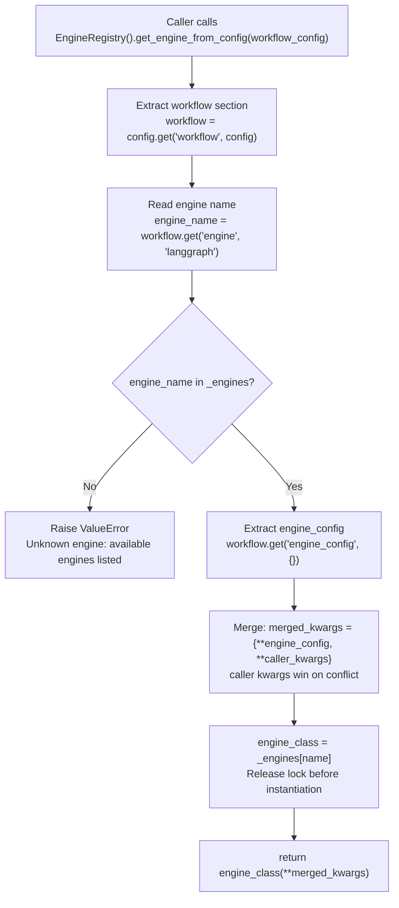
```mermaid
flowchart TD
    A["Caller calls\nEngineRegistry().get_engine_from_config(workflow_config)"] --> B["Extract workflow section\nworkflow = config.get('workflow', config)"]
    B --> C["Read engine name\nengine_name = workflow.get('engine', 'langgraph')"]
    C --> D{engine_name in _engines?}
    D -- No --> E["Raise ValueError\nUnknown engine: available engines listed"]
    D -- Yes --> F["Extract engine_config\nworkflow.get('engine_config', {})"]
    F --> G["Merge: merged_kwargs = {**engine_config, **caller_kwargs}\ncaller kwargs win on conflict"]
    G --> H["engine_class = _engines[name]\nRelease lock before instantiation"]
    H --> I["return engine_class(**merged_kwargs)"]
```

The YAML path that controls engine selection:

```yaml
workflow:
  name: my_workflow
  engine: dynamic          # Optional. Defaults to "langgraph"
  engine_config:           # Optional. Passed as kwargs to engine constructor
    safety_config_path: configs/safety/action_policies.yaml
  stages:
    - name: research
    - name: synthesis
```

### 4.3 Registered Engines and Aliases

On singleton initialization, `_initialize_default_engines()` registers:

| Registry Key | Class | Notes |
|---|---|---|
| `"langgraph"` | `LangGraphExecutionEngine` | Default; raises `RuntimeError` if `langgraph` not installed |
| `"dynamic"` | `DynamicExecutionEngine` | Pure-Python alternative |
| `"native"` | `DynamicExecutionEngine` | Backward-compat alias for `"dynamic"` |

The `"langgraph"` engine cannot be unregistered (`unregister_engine("langgraph")` raises `ValueError: Cannot unregister default 'langgraph' engine`). All other engines can be unregistered (useful in tests).

Third-party engines can be registered at runtime:

```python
registry = EngineRegistry()
registry.register_engine("temporal", TemporalWorkflowEngine)
# Raises TypeError if not subclass of ExecutionEngine
# Raises ValueError if name already registered or empty
```

---

## 5. DynamicExecutionEngine

**Location:** `/home/shinelay/meta-autonomous-framework/temper_ai/workflow/engines/dynamic_engine.py`

The `DynamicExecutionEngine` is a pure-Python execution engine that requires no compiled graph representation. Its execution model is a straightforward Python loop that walks DAG depth-groups. This gives it capabilities the LangGraph engine cannot match at the graph-compilation level, particularly runtime edge routing and stage-to-stage negotiation.

### 5.1 Compilation Phase

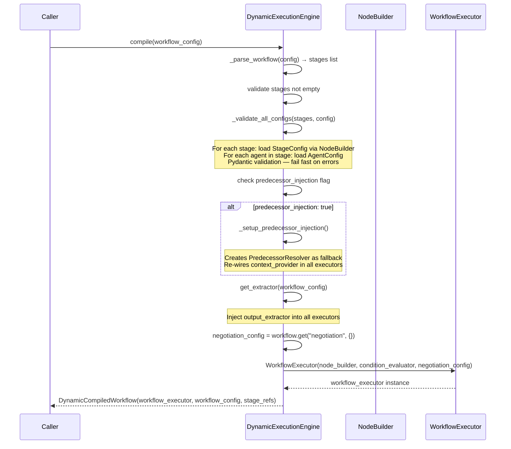
```mermaid
sequenceDiagram
    participant C as Caller
    participant E as DynamicExecutionEngine
    participant NB as NodeBuilder
    participant WE as WorkflowExecutor

    C->>E: compile(workflow_config)
    E->>E: _parse_workflow(config) → stages list
    E->>E: validate stages not empty
    E->>E: _validate_all_configs(stages, config)
    Note over E: For each stage: load StageConfig via NodeBuilder<br/>For each agent in stage: load AgentConfig<br/>Pydantic validation — fail fast on errors
    E->>E: check predecessor_injection flag
    alt predecessor_injection: true
        E->>E: _setup_predecessor_injection()
        Note over E: Creates PredecessorResolver as fallback<br/>Re-wires context_provider in all executors
    end
    E->>E: get_extractor(workflow_config)
    Note over E: Inject output_extractor into all executors
    E->>E: negotiation_config = workflow.get("negotiation", {})
    E->>WE: WorkflowExecutor(node_builder, condition_evaluator, negotiation_config)
    WE-->>E: workflow_executor instance
    E-->>C: DynamicCompiledWorkflow(workflow_executor, workflow_config, stage_refs)
```

**Config validation during compile:** The `_validate_all_configs()` method iterates every stage reference, loads its YAML config via `NodeBuilder._load_stage_config()`, validates it against the `StageConfig` Pydantic model (warnings only, not errors), then extracts agent references from the stage and validates each against `AgentConfig`. Hard errors (file not found, missing keys) are accumulated and raised as a single `ValueError` listing all failures after all stages are checked.

### 5.2 DynamicCompiledWorkflow

`DynamicCompiledWorkflow` stores three things:
- `self.workflow_executor` — the `WorkflowExecutor` instance that will walk the DAG
- `self.workflow_config` — the original config dict (for metadata/visualization)
- `self.stage_refs` — the list of stage references from the workflow config

It does **not** store a compiled graph representation. The "compilation" result is simply the assembled executor + config.

**`invoke()` implementation:**

```python
def invoke(self, state: dict[str, Any]) -> dict[str, Any]:
    if self._cancelled:
        raise WorkflowCancelledError("Workflow execution cancelled")
    state.setdefault("stage_outputs", {})
    state.setdefault("current_stage", "")
    return self.workflow_executor.run(self.stage_refs, self.workflow_config, state)
```

**`ainvoke()` implementation:**

```python
async def ainvoke(self, state: dict[str, Any]) -> dict[str, Any]:
    if self._cancelled:
        raise WorkflowCancelledError("Workflow execution cancelled")
    return await asyncio.to_thread(
        self.workflow_executor.run,
        self.stage_refs, self.workflow_config, state,
    )
```

The DAG walker (`WorkflowExecutor.run()`) is synchronous Python — it does not use `async/await`. `asyncio.to_thread()` runs it in a thread pool worker so that the calling coroutine does not block the event loop.

### 5.3 Execution Phase

`DynamicExecutionEngine.execute()` normalizes the execution path:

```python
def execute(self, compiled_workflow, input_data, mode=ExecutionMode.SYNC):
    if not isinstance(compiled_workflow, DynamicCompiledWorkflow):
        raise TypeError(...)
    if mode == ExecutionMode.STREAM:
        raise NotImplementedError("STREAM mode not yet supported")

    state = initialize_state(input_data)          # ← state_manager

    if mode == ExecutionMode.ASYNC:
        # Guard: raise if called from running event loop
        return asyncio.run(compiled_workflow.ainvoke(state))

    return compiled_workflow.invoke(state)        # ← SYNC path
```

`async_execute()` runs the async path naturally without needing `asyncio.run()`:

```python
async def async_execute(self, compiled_workflow, input_data, mode=ExecutionMode.ASYNC):
    state = initialize_state(input_data)
    if mode == ExecutionMode.SYNC:
        return await asyncio.to_thread(compiled_workflow.invoke, state)
    return await compiled_workflow.ainvoke(state)
```

### 5.4 Component Initialization Hierarchy

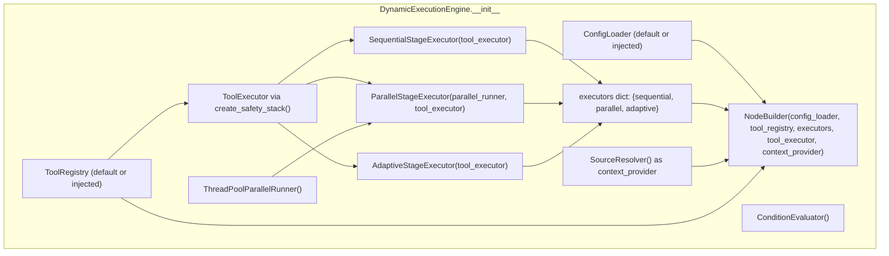
```mermaid
flowchart TD
    subgraph DynamicExecutionEngine.__init__
        A["ToolRegistry (default or injected)"]
        B["ConfigLoader (default or injected)"]
        C["ToolExecutor via create_safety_stack()"]
        D["ThreadPoolParallelRunner()"]
        E["SequentialStageExecutor(tool_executor)"]
        F["ParallelStageExecutor(parallel_runner, tool_executor)"]
        G["AdaptiveStageExecutor(tool_executor)"]
        H["executors dict: {sequential, parallel, adaptive}"]
        I["SourceResolver() as context_provider"]
        J["NodeBuilder(config_loader, tool_registry, executors, tool_executor, context_provider)"]
        K["ConditionEvaluator()"]
    end

    A --> C
    B --> J
    C --> E
    C --> F
    C --> G
    D --> F
    E --> H
    F --> H
    G --> H
    H --> J
    I --> J
    A --> J
```

**Key difference from LangGraph engine:** The Dynamic engine creates `ThreadPoolParallelRunner` explicitly and passes it to `ParallelStageExecutor`. The LangGraph engine creates `ParallelStageExecutor` without a parallel runner (it relies on LangGraph's Pregel model for parallel branches).

### 5.5 Predecessor Injection

When a workflow declares `predecessor_injection: true`, the engine wraps `SourceResolver` with a `PredecessorResolver` fallback:

```python
def _setup_predecessor_injection(self) -> None:
    from temper_ai.workflow.context_provider import PredecessorResolver, SourceResolver

    predecessor_resolver = PredecessorResolver()
    self.context_provider = SourceResolver(fallback=predecessor_resolver)
    self._predecessor_injection = True

    # Re-inject context_provider into all executors
    for executor in self.executors.values():
        executor.context_provider = self.context_provider
```

With predecessor injection enabled, stages that declare no explicit `inputs` field automatically receive the outputs of their DAG predecessors. Without it, they receive the full workflow state.

### 5.6 Supported Features

```python
supported = {
    "sequential_stages",    # Depth-group linear execution
    "parallel_stages",      # ThreadPoolExecutor parallel batches
    "conditional_routing",  # skip_if / condition evaluation
    "checkpointing",        # (via WorkflowExecutor integration)
    "state_persistence",    # State dict accumulated across stages
    "negotiation",          # Stage-to-stage re-run on ContextResolutionError
    "dynamic_routing",      # _next_stage signal-based edge routing
}
```

The Dynamic engine supports everything the LangGraph engine supports plus `negotiation` and `dynamic_routing` — two features that require runtime loop control not available in a compiled Pregel graph.

### 5.7 Cancellation in the Dynamic Engine

Cancellation in `DynamicCompiledWorkflow` is **cooperative and pre-flight only**:

```python
def cancel(self) -> None:
    self._cancelled = True

def is_cancelled(self) -> bool:
    return self._cancelled
```

When `cancel()` is called:
- The `_cancelled` flag is set to `True`.
- The **next** call to `invoke()` or `ainvoke()` will immediately raise `WorkflowCancelledError`.
- **Currently executing stages are NOT interrupted.** The DAG walker has no periodic cancellation check within `WorkflowExecutor.run()`.

This means cancellation latency equals the duration of the currently executing stage. For long-running LLM calls, this could be minutes. The flag is only checked at the boundary of the next `invoke()`/`ainvoke()` call.

A mid-flight cancellation mechanism would require the `WorkflowExecutor` to check `compiled_workflow.is_cancelled()` between depth groups — this is not currently implemented.

---

## 6. LangGraphExecutionEngine

**Location:** `/home/shinelay/meta-autonomous-framework/temper_ai/workflow/engines/langgraph_engine.py`

### 6.1 The Adapter Pattern

`LangGraphExecutionEngine` uses the **Adapter pattern** (composition, not inheritance):

```python
class LangGraphExecutionEngine(ExecutionEngine):
    def __init__(self, tool_registry=None, config_loader=None):
        self.compiler = LangGraphCompiler(
            tool_registry=tool_registry,
            config_loader=config_loader
        )
```

The engine does not extend `LangGraphCompiler`. It wraps it, translating between the `ExecutionEngine` interface and the `LangGraphCompiler`'s interface. This preserves all existing M2 functionality without modification.

### 6.2 LangGraphCompiler

**Location:** `/home/shinelay/meta-autonomous-framework/temper_ai/workflow/engines/langgraph_compiler.py`

`LangGraphCompiler` is the actual compilation workhorse. It is a **pure orchestration layer** — it does not directly handle graph construction, choosing instead to delegate to `StageCompiler`:

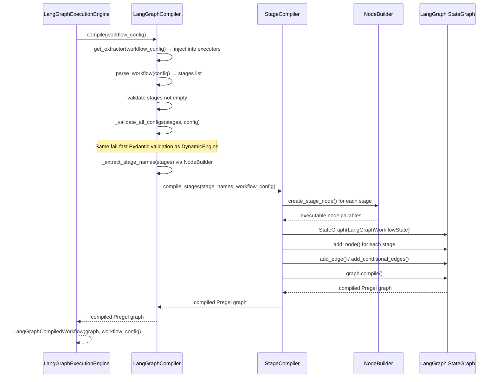
```mermaid
sequenceDiagram
    participant E as LangGraphExecutionEngine
    participant C as LangGraphCompiler
    participant SC as StageCompiler
    participant NB as NodeBuilder
    participant LG as LangGraph StateGraph

    E->>C: compile(workflow_config)
    C->>C: get_extractor(workflow_config) → inject into executors
    C->>C: _parse_workflow(config) → stages list
    C->>C: validate stages not empty
    C->>C: _validate_all_configs(stages, config)
    Note over C: Same fail-fast Pydantic validation as DynamicEngine
    C->>C: _extract_stage_names(stages) via NodeBuilder
    C->>SC: compile_stages(stage_names, workflow_config)
    SC->>NB: create_stage_node() for each stage
    NB-->>SC: executable node callables
    SC->>LG: StateGraph(LangGraphWorkflowState)
    SC->>LG: add_node() for each stage
    SC->>LG: add_edge() / add_conditional_edges()
    SC->>LG: graph.compile()
    LG-->>SC: compiled Pregel graph
    SC-->>C: compiled Pregel graph
    C-->>E: compiled Pregel graph
    E-->>E: LangGraphCompiledWorkflow(graph, workflow_config)
```

**Component hierarchy in `LangGraphCompiler`:**

```
LangGraphCompiler
├── ToolRegistry
├── ConfigLoader
├── ToolExecutor (via create_safety_stack)
├── executors:
│   ├── SequentialStageExecutor(tool_executor)
│   ├── ParallelStageExecutor(tool_executor)       ← no parallel_runner here
│   └── AdaptiveStageExecutor(tool_executor)
├── SourceResolver (context_provider)
├── NodeBuilder(config_loader, tool_registry, executors, tool_executor, context_provider)
├── ConditionEvaluator()
└── StageCompiler(node_builder, condition_evaluator)
```

**`_extract_agents_from_stage()` helper** (module-level, exported):

```python
def _extract_agents_from_stage(stage_config: Any) -> list:
    if hasattr(stage_config, "stage"):
        return stage_config.stage.agents
    agents_from_config = get_nested_value(stage_config, "stage.agents") or \
                         stage_config.get("agents", [])
    return agents_from_config
```

This function handles both Pydantic model objects (`stage_config.stage.agents`) and raw dict configs (`stage_config["stage"]["agents"]`). It is also imported by `DynamicExecutionEngine._validate_agent_configs_for_stage()`.

### 6.3 LangGraphCompiledWorkflow

```python
class LangGraphCompiledWorkflow(CompiledWorkflow):
    def __init__(self, graph, workflow_config, tracker=None):
        self.graph = graph              # Compiled Pregel StateGraph
        self.workflow_config = workflow_config
        self.tracker = tracker          # Optional ExecutionTracker
        self._cancelled = False
```

**`invoke()` implementation:**

```python
def invoke(self, state: dict[str, Any]) -> dict[str, Any]:
    if self._cancelled:
        raise WorkflowCancelledError("Workflow execution cancelled")
    state_dict = dict(state)
    if self.tracker:
        state_dict["tracker"] = self.tracker
    result = self.graph.invoke(state_dict)
    return cast(dict[str, Any], result)
```

Unlike the Dynamic engine, the tracker is injected into the state dict **at invocation time**, not during construction. This allows the same compiled graph to be reused with different trackers.

**`ainvoke()` implementation:**

```python
async def ainvoke(self, state: dict[str, Any]) -> dict[str, Any]:
    if self._cancelled:
        raise WorkflowCancelledError("Workflow execution cancelled")
    state_dict = dict(state)
    if self.tracker:
        state_dict["tracker"] = self.tracker
    result = await self.graph.ainvoke(state_dict)
    return cast(dict[str, Any], result)
```

LangGraph's `ainvoke()` is natively async — it runs the Pregel execution loop within the event loop directly, unlike the Dynamic engine which offloads to a thread.

### 6.4 Execution Phase

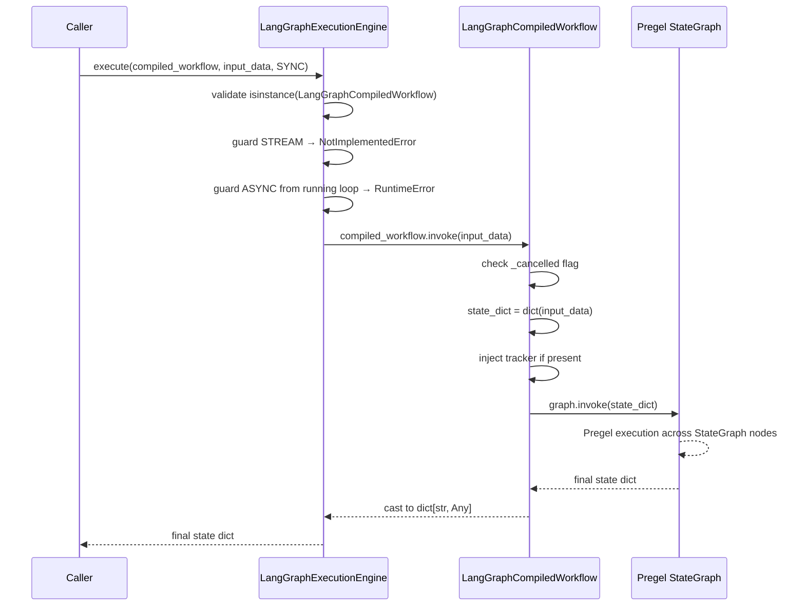
```mermaid
sequenceDiagram
    participant C as Caller
    participant E as LangGraphExecutionEngine
    participant CW as LangGraphCompiledWorkflow
    participant G as Pregel StateGraph

    C->>E: execute(compiled_workflow, input_data, SYNC)
    E->>E: validate isinstance(LangGraphCompiledWorkflow)
    E->>E: guard STREAM → NotImplementedError
    E->>E: guard ASYNC from running loop → RuntimeError
    E->>CW: compiled_workflow.invoke(input_data)
    CW->>CW: check _cancelled flag
    CW->>CW: state_dict = dict(input_data)
    CW->>CW: inject tracker if present
    CW->>G: graph.invoke(state_dict)
    G-->>G: Pregel execution across StateGraph nodes
    G-->>CW: final state dict
    CW-->>E: cast to dict[str, Any]
    E-->>C: final state dict
```

### 6.5 Supported Features

```python
supported = {
    "sequential_stages",     # Sequential graph edges
    "parallel_stages",       # LangGraph parallel branches (fan-out nodes)
    "conditional_routing",   # LangGraph conditional edges
    "checkpointing",         # LangGraph memory / CompiledGraphRunner checkpoints
    "state_persistence",     # State passed through dataclass between nodes
}
```

The LangGraph engine does **not** support `negotiation` or `dynamic_routing`. These require runtime loop control that cannot be expressed as static Pregel edges.

### 6.6 Cancellation in the LangGraph Engine

Identical semantics to the Dynamic engine — cooperative and pre-flight only:

```python
def cancel(self) -> None:
    self._cancelled = True  # Only prevents next invoke/ainvoke
```

There is no mid-execution interrupt. LangGraph's `ainvoke()` does not expose a cancellation token. The `_cancelled` flag is checked at the top of `invoke()` and `ainvoke()` before calling `graph.invoke()`. Once `graph.invoke()` starts, there is no abort path.

---

## 7. LangGraph State Management

### 7.1 WorkflowDomainState

**Location:** `/home/shinelay/meta-autonomous-framework/temper_ai/workflow/domain_state.py`

`WorkflowDomainState` is the pure, JSON-serializable domain state dataclass. It contains **only** data that represents the workflow's business logic progress — no infrastructure objects.

```python
@dataclass
class WorkflowDomainState:
    # Core workflow execution state
    stage_outputs: dict[str, Any]        # Outputs from completed stages
    current_stage: str                   # Currently/last-executed stage name
    workflow_id: str                     # Unique run ID (format: "wf-<12 hex>")
    stage_loop_counts: dict[str, int]    # Loop iteration counts per stage
    conversation_histories: dict[str, Any] # Conversation history per stage:agent

    # Workflow inputs (all optional)
    topic: str | None
    depth: str | None
    focus_areas: list[str] | None
    query: str | None
    input: str | None
    context: str | None
    data: dict[str, Any] | None
    workflow_inputs: dict[str, Any]      # Arbitrary user-supplied inputs

    # Metadata
    version: str                         # Schema version for migrations
    created_at: datetime                 # UTC timestamp
    metadata: dict[str, Any]
```

**Checkpoint serialization:** `to_dict()` iterates dataclass fields, serializes `datetime` to ISO string format, and returns a dict guaranteed to be JSON-serializable. `from_dict()` reconstructs the dataclass, filtering unknown keys into `workflow_inputs` for forward compatibility.

**Key methods:**

- `set_stage_output(stage_name, output)` — Sets output and updates `current_stage`
- `get_stage_output(stage_name, default=None)` — Safe access
- `has_stage_output(stage_name)` — Boolean check
- `validate()` — Returns `(bool, list[str])` — used for checkpoint integrity checks
- `copy()` — Deep copies all mutable fields

### 7.2 LangGraphWorkflowState

**Location:** `/home/shinelay/meta-autonomous-framework/temper_ai/workflow/langgraph_state.py`

`LangGraphWorkflowState` extends `WorkflowDomainState` with:
1. **Annotated reducers** on every field, required by LangGraph's `StateGraph` for parallel branch state merging
2. **Infrastructure fields**: `tracker`, `tool_registry`, `config_loader`, `visualizer`
3. **Cache fields**: `_dict_cache`, `_dict_cache_exclude_internal` for performance

```python
@dataclass
class LangGraphWorkflowState(WorkflowDomainState):
    # Override inherited fields with Annotated reducers
    stage_outputs: Annotated[dict[str, Any], _merge_dicts] = field(default_factory=dict)
    current_stage: Annotated[str, _keep_latest] = ""
    workflow_id: Annotated[str, _keep_latest] = ""
    stage_loop_counts: Annotated[dict[str, int], _merge_dicts] = field(default_factory=dict)
    conversation_histories: Annotated[dict[str, Any], _merge_dicts] = field(default_factory=dict)
    topic: Annotated[str | None, _keep_latest] = None
    depth: Annotated[str | None, _keep_latest] = None
    focus_areas: Annotated[list[str] | None, _keep_latest] = None
    query: Annotated[str | None, _keep_latest] = None
    input: Annotated[str | None, _keep_latest] = None
    context: Annotated[str | None, _keep_latest] = None
    data: Annotated[dict[str, Any] | None, _keep_latest] = None
    workflow_inputs: Annotated[dict[str, Any], _merge_dicts] = field(default_factory=dict)
    version: Annotated[str, _keep_latest] = "1.0"
    created_at: Annotated[datetime, _keep_latest] = field(...)
    metadata: Annotated[dict[str, Any], _merge_dicts] = field(default_factory=dict)

    # Infrastructure components
    tracker: Annotated[Any | None, _keep_latest] = None
    tool_registry: Annotated[Any | None, _keep_latest] = None
    config_loader: Annotated[Any | None, _keep_latest] = None
    visualizer: Annotated[Any | None, _keep_latest] = None

    # to_dict() cache (internal, repr=False)
    _dict_cache: Annotated[dict[str, Any] | None, _keep_latest] = field(default=None, repr=False)
    _dict_cache_exclude_internal: Annotated[dict[str, Any] | None, _keep_latest] = field(default=None, repr=False)
```

### 7.3 State Reducers for Parallel Branches

LangGraph's Pregel model requires reducers on state fields that may be updated by multiple parallel branches. Without reducers, parallel branches updating the same field cause `InvalidUpdateError`.

Two reducers are defined:

```python
def _merge_dicts(left: dict, right: dict) -> dict:
    """Used for dict fields — union, right wins on key conflicts."""
    merged = left.copy()
    merged.update(right)
    return merged

def _keep_latest(left: Any, right: Any) -> Any:
    """Used for scalar fields — last update wins."""
    return right
```

**Which fields use which reducer:**

| Reducer | Fields |
|---|---|
| `_merge_dicts` | `stage_outputs`, `stage_loop_counts`, `conversation_histories`, `workflow_inputs`, `metadata` |
| `_keep_latest` | `current_stage`, `workflow_id`, `topic`, `depth`, `focus_areas`, `query`, `input`, `context`, `data`, `version`, `created_at`, `tracker`, `tool_registry`, `config_loader`, `visualizer`, `_dict_cache*` |

The `_merge_dicts` reducer for `stage_outputs` is the critical one: when two parallel branches both complete and return `{"stage_outputs": {"branch_A": {...}}}` and `{"stage_outputs": {"branch_B": {...}}}` respectively, LangGraph calls `_merge_dicts({"branch_A": ...}, {"branch_B": ...})` to produce `{"branch_A": ..., "branch_B": ...}` — preserving both outputs.

**Note:** The `dynamic_runner.py` file contains its own `_merge_dicts` implementation that does **recursive** merging (nested dicts are merged, not replaced). The `langgraph_state.py` implementation does a **shallow** merge (simple `.update()`). This is an intentional difference: the LangGraph reducer only needs to merge top-level `stage_outputs` keys, while the Dynamic engine's merger needs to handle deeply nested agent result structures.

### 7.4 to_dict() Caching

`LangGraphWorkflowState.to_dict()` implements a two-slot cache:

```python
def to_dict(self, exclude_internal: bool = False) -> dict[str, Any]:
    if exclude_internal:
        if self._dict_cache_exclude_internal is not None:
            return dict(self._dict_cache_exclude_internal)  # shallow copy
    else:
        if self._dict_cache is not None:
            return dict(self._dict_cache)  # shallow copy
    # Cache miss: iterate dataclass fields, serialize datetime, filter if needed
    # Store result in appropriate cache slot
    # Return shallow copy to prevent mutation of cached data
```

Cache invalidation uses `__setattr__` override:

```python
def __setattr__(self, name: str, value: Any) -> None:
    if not name.startswith("_dict_cache") and hasattr(self, "_dict_cache"):
        if self._dict_cache is not None or self._dict_cache_exclude_internal is not None:
            object.__setattr__(self, "_dict_cache", None)
            object.__setattr__(self, "_dict_cache_exclude_internal", None)
    object.__setattr__(self, name, value)
```

Any field modification invalidates both cache slots. The first call after modification is O(n) field iteration; subsequent calls are O(1). Callers receive a shallow copy to prevent external mutation of the cached dict.

**`exclude_internal=True`** excludes `tracker`, `tool_registry`, `config_loader`, and `visualizer` — used by checkpointing to serialize only serializable domain data.

### 7.5 InfrastructureContext Separation

`InfrastructureContext` (in `domain_state.py`) is a separate dataclass for non-serializable infrastructure components:

```python
@dataclass
class InfrastructureContext:
    tracker: TrackerProtocol | None = None
    tool_registry: DomainToolRegistryProtocol | None = None
    config_loader: ConfigLoaderProtocol | None = None
    visualizer: VisualizerProtocol | None = None
```

This separation is the architectural invariant for checkpoint/resume:
- `WorkflowDomainState` → checkpointed to disk
- `InfrastructureContext` → recreated from config on resume

The `DomainExecutionContext` subclass is deprecated with a warning. The module-level `__getattr__` catches imports of the old `ExecutionContext` name and emits a `DeprecationWarning`.

---

## 8. WorkflowExecutor — The DAG Walker

**Location:** `/home/shinelay/meta-autonomous-framework/temper_ai/workflow/engines/workflow_executor.py`

`WorkflowExecutor` is the core of the Dynamic engine's execution model. It replaces LangGraph's Pregel graph evaluation with a straightforward Python loop that iterates over DAG depth-groups. This module is the most complex single component in the execution engine subsystem.

### 8.1 DAG Construction (dag_builder)

**Location:** `/home/shinelay/meta-autonomous-framework/temper_ai/workflow/dag_builder.py`

Before executing any stage, the executor constructs a full DAG from the `depends_on` declarations in stage references:

```python
@dataclass
class StageDAG:
    predecessors: dict[str, list[str]]  # stage → list of stages it depends on
    successors:   dict[str, list[str]]  # stage → list of stages that depend on it
    roots:        list[str]             # stages with no predecessors (entry points)
    terminals:    list[str]             # stages with no successors (exit points)
    topo_order:   list[str]             # Kahn's BFS topological order
```

**`build_stage_dag()` algorithm:**

1. Build `predecessors` and `successors` dicts from `depends_on` declarations.
2. Validate: every `depends_on` target must be a known stage name. Unknown references raise `ValueError` immediately.
3. Run Kahn's algorithm for **cycle detection**: if `visited_count < len(stage_names)`, some nodes remained with `in_degree > 0` → cycle exists.
4. Run Kahn's algorithm again for **topological sort**, preserving declaration order for tie-breaking.

**Backward compatibility gate:** `has_dag_dependencies()` checks if any stage declares `depends_on`. If false (all legacy workflows), the `StageCompiler` falls back to creating sequential edges in declaration order without building a DAG.

### 8.2 Depth-Group Computation

```python
def compute_depths(dag: StageDAG) -> dict[str, int]:
    depths: dict[str, int] = {}
    for stage in dag.topo_order:
        preds = dag.predecessors.get(stage, [])
        if not preds:
            depths[stage] = 0                               # Root → depth 0
        else:
            depths[stage] = max(depths[p] for p in preds) + 1  # max predecessor depth + 1
    return depths
```

Depth is the **longest path from any root** to the stage. Stages at the same depth with no mutual dependency can execute in parallel.

**Example DAG depth assignment:**

```
Stage A (depth 0, no deps)
Stage B (depth 0, no deps)
Stage C (depends_on: [A])   → depth 1
Stage D (depends_on: [A,B]) → depth 1 (max(0,0)+1)
Stage E (depends_on: [C,D]) → depth 2 (max(1,1)+1)
```

Depth groups: `{0: [A,B], 1: [C,D], 2: [E]}`
- A and B run in parallel (same depth)
- C and D run in parallel after A,B complete (same depth)
- E runs alone after C,D complete

### 8.3 The Main Execution Loop

```mermaid
flowchart TD
    A["WorkflowExecutor.run(stage_refs, workflow_config, state)"] --> B["Extract stage names via NodeBuilder"]
    B --> C["build_stage_dag(stage_names, stage_refs) → StageDAG"]
    C --> D["compute_depths(dag) → dict[stage → depth]"]
    D --> E["_group_by_depth(dag, depths) → dict[depth → list[stage]]"]
    E --> F["wire_dag_context(dag) into NodeBuilder (PredecessorResolver)"]
    F --> G["Pre-build all stage_nodes: name → callable\nNodeBuilder.create_stage_node(name, config)"]
    G --> H["Iterate depth groups in sorted order"]

    H --> I{state has SKIP_TO_END?}
    I -- Yes --> J["Log halted message\nBreak out of loop"]
    I -- No --> K{len(stages_at_depth) == 1?}
    K -- Yes --> L["_execute_single_stage(stage_name, ...)"]
    K -- No --> M["_execute_parallel_stages(stage_names, ...)"]
    L --> N{WorkflowStageError raised?}
    M --> N
    N -- Yes --> O["state[SKIP_TO_END] = exc.stage_name\nBreak"]
    N -- No --> H

    J --> P["return final state"]
    O --> P
    H -- loop done --> P
```

**Pre-building node callables:** All stage nodes are built before execution begins via:
```python
stage_nodes: dict[str, Callable] = {}
for name in stage_names:
    stage_nodes[name] = self.node_builder.create_stage_node(name, workflow_config)
```

This is important: node callables are closures that capture configuration and executor references. Building them all upfront ensures that dynamic edge routing can invoke any stage by name without a second compilation step.

### 8.4 Single Stage Execution

`_execute_single_stage()` implements a decision tree:

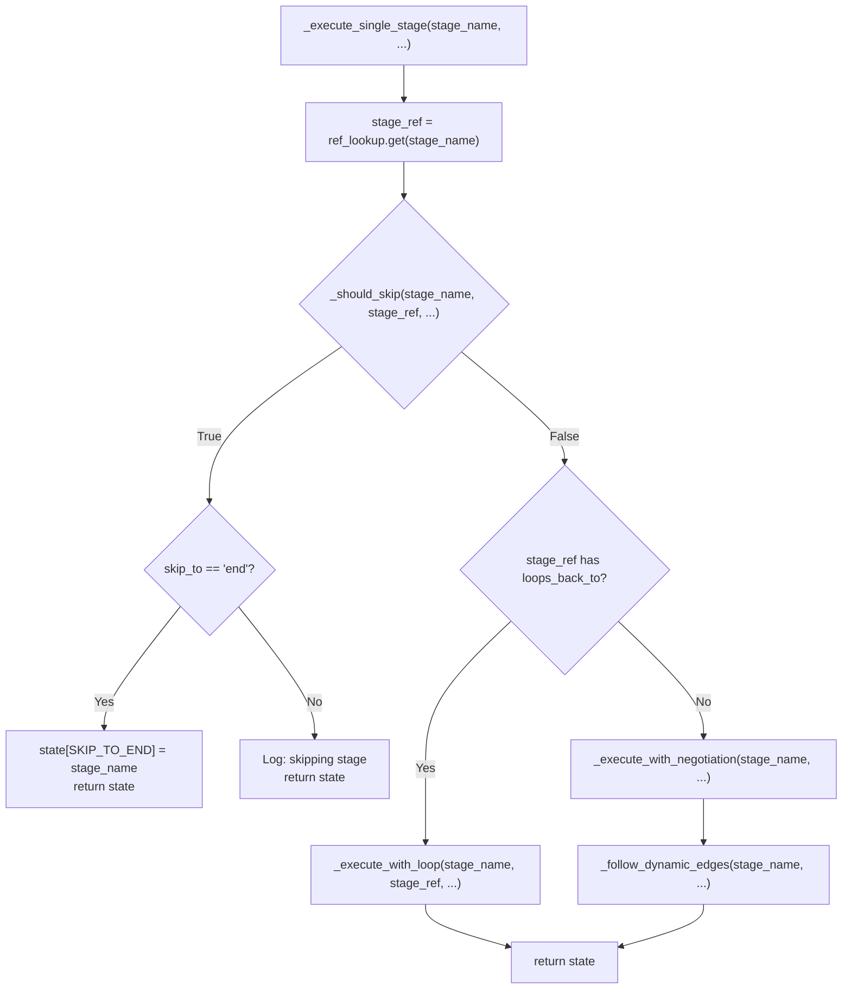
```mermaid
flowchart TD
    A["_execute_single_stage(stage_name, ...)"] --> B["stage_ref = ref_lookup.get(stage_name)"]
    B --> C{"_should_skip(stage_name, stage_ref, ...)"}
    C -- True --> D{"skip_to == 'end'?"}
    D -- Yes --> E["state[SKIP_TO_END] = stage_name\nreturn state"]
    D -- No --> F["Log: skipping stage\nreturn state"]
    C -- False --> G{"stage_ref has loops_back_to?"}
    G -- Yes --> H["_execute_with_loop(stage_name, stage_ref, ...)"]
    H --> I["return state"]
    G -- No --> J["_execute_with_negotiation(stage_name, ...)"]
    J --> K["_follow_dynamic_edges(stage_name, ...)"]
    K --> I
```

### 8.5 Parallel Depth-Group Execution

```mermaid
flowchart TD
    A["_execute_parallel_stages(stage_names, ...)"] --> B["Filter: check _should_skip for each stage"]
    B --> C{Any skip_to=end?}
    C -- Yes --> D["state[SKIP_TO_END] = name\nreturn state"]
    C -- No --> E["runnable = non-skipped stages"]
    E --> F{len(runnable) == 1?}
    F -- Yes --> G["_execute_with_negotiation(runnable[0], ...)"]
    F -- No --> H["_run_parallel_stage_batch(runnable, stage_nodes, state)"]
    H --> I["ThreadPoolExecutor: submit each runnable stage\nEach gets a copy of state"]
    I --> J["Collect results via as_completed()"]
    J --> K["For each name in runnable: _merge_stage_result(state, results[name])"]
    K --> L["For each name in runnable: _follow_dynamic_edges(name, ...)"]
    G --> M["return state"]
    L --> M
```

**State isolation in parallel stages:** Each stage callable receives `dict(state)` — a shallow copy of the current state. Stages cannot see each other's in-progress writes. After all complete, results are merged sequentially via `_merge_stage_result()`:

```python
def _merge_stage_result(state, result):
    result_outputs = result.get("stage_outputs", {})
    state_outputs = state.get("stage_outputs", {})
    state_outputs.update(result_outputs)       # Merge stage outputs
    state["stage_outputs"] = state_outputs
    current_stage = result.get("current_stage")
    if current_stage:
        state["current_stage"] = current_stage
    return state
```

This is a **last-writer-wins** merge for `current_stage` and a **union** merge for `stage_outputs`. Stages in the same parallel group cannot update the same `stage_outputs` key without losing one result.

### 8.6 Conditional Stage Evaluation

`_should_skip()` evaluates whether a stage should be skipped:

```python
def _should_skip(self, stage_name, stage_ref, stage_refs, state):
    if not stage_ref or not _is_conditional(stage_ref):
        return False           # No condition → never skip

    skip_if = _ref_attr(stage_ref, "skip_if")
    condition = _ref_attr(stage_ref, "condition")

    if skip_if:
        return self.condition_evaluator.evaluate(skip_if, state)   # Truthy → skip

    if condition:
        return not self.condition_evaluator.evaluate(condition, state)  # Falsy → skip

    # Default condition: check previous stage status
    default_cond = get_default_condition(stage_index, stage_refs)
    if default_cond:
        return not self.condition_evaluator.evaluate(default_cond, state)

    return False
```

**Three condition modes:**
1. `skip_if: "expression"` — Skip when expression evaluates to truthy
2. `condition: "expression"` — Skip when expression evaluates to falsy
3. Default condition — derived from stage index (checks previous stage failure/degraded status)

**`skip_to: end` vs plain skip:**
When a condition causes a skip with `skip_to: end`, the `SKIP_TO_END` sentinel is set, halting all subsequent depth groups. Without `skip_to`, execution continues to the next depth group with this stage omitted.

### 8.7 Loop-Back Execution

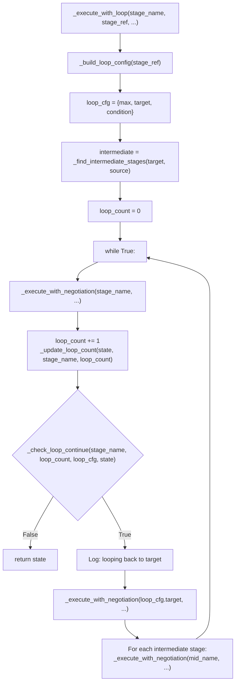
```mermaid
flowchart TD
    A["_execute_with_loop(stage_name, stage_ref, ...)"] --> B["_build_loop_config(stage_ref)"]
    B --> C["loop_cfg = {max, target, condition}"]
    C --> D["intermediate = _find_intermediate_stages(target, source)"]
    D --> E["loop_count = 0"]
    E --> F["while True:"]
    F --> G["_execute_with_negotiation(stage_name, ...)"]
    G --> H["loop_count += 1\n_update_loop_count(state, stage_name, loop_count)"]
    H --> I{"_check_loop_continue(stage_name, loop_count, loop_cfg, state)"}
    I -- False --> J["return state"]
    I -- True --> K["Log: looping back to target"]
    K --> L["_execute_with_negotiation(loop_cfg.target, ...)"]
    L --> M["For each intermediate stage:\n_execute_with_negotiation(mid_name, ...)"]
    M --> F
```

**Loop configuration fields:**

| Field | Config Key | Default |
|---|---|---|
| `max` | `max_loops` | `DEFAULT_MAX_LOOPS = 2` |
| `target` | `loops_back_to` | (required) |
| `condition` | `loop_condition` or `condition` | `get_default_loop_condition(stage_name)` |

**Loop count tracking:** Each loop iteration increments a counter stored in `state["stage_loop_counts"][stage_name]`. The condition evaluator can access this to implement iteration-aware conditions.

**Intermediate stages:** `_find_intermediate_stages()` identifies stages that sit between the loop target and the looping stage in declaration order. These are re-executed during each loop iteration, ensuring that the data pipeline between the target and the evaluator is kept fresh.

### 8.8 Stage-to-Stage Negotiation

Negotiation is a mechanism for a consumer stage to trigger a re-run of a producer stage when a required input is missing. It is triggered by `ContextResolutionError` being raised during stage execution.

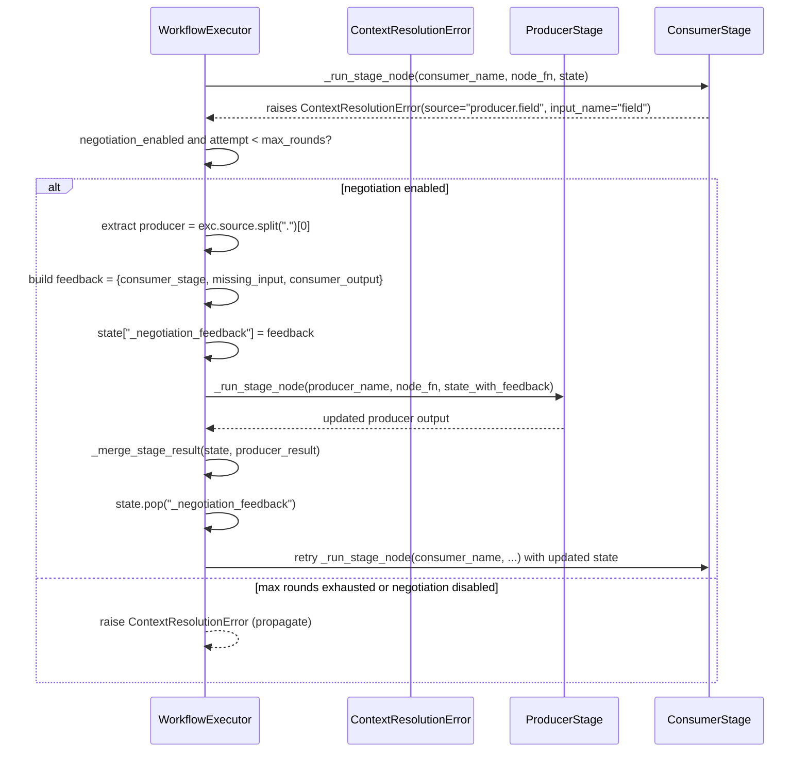
```mermaid
sequenceDiagram
    participant WE as WorkflowExecutor
    participant CE as ContextResolutionError
    participant P as ProducerStage
    participant C as ConsumerStage

    WE->>C: _run_stage_node(consumer_name, node_fn, state)
    C-->>WE: raises ContextResolutionError(source="producer.field", input_name="field")
    WE->>WE: negotiation_enabled and attempt < max_rounds?
    alt negotiation enabled
        WE->>WE: extract producer = exc.source.split(".")[0]
        WE->>WE: build feedback = {consumer_stage, missing_input, consumer_output}
        WE->>WE: state["_negotiation_feedback"] = feedback
        WE->>P: _run_stage_node(producer_name, node_fn, state_with_feedback)
        P-->>WE: updated producer output
        WE->>WE: _merge_stage_result(state, producer_result)
        WE->>WE: state.pop("_negotiation_feedback")
        WE->>C: retry _run_stage_node(consumer_name, ...) with updated state
    else max rounds exhausted or negotiation disabled
        WE-->>WE: raise ContextResolutionError (propagate)
    end
```

**Configuration:**

```yaml
workflow:
  negotiation:
    enabled: true
    max_stage_rounds: 2    # Default: DEFAULT_MAX_NEGOTIATION_ROUNDS = 2
```

**`_negotiate_with_producer()` implementation:**

```python
def _negotiate_with_producer(self, exc, stage_name, stage_nodes, state):
    producer = exc.source.split(".")[0]  # "producer_stage.field_name" → "producer_stage"
    feedback = {
        "consumer_stage": stage_name,
        "missing_input": exc.input_name,
        "consumer_output": state["stage_outputs"].get(stage_name),
    }
    state["_negotiation_feedback"] = feedback
    producer_result = _run_stage_node(producer, stage_nodes[producer], state)
    state = _merge_stage_result(state, producer_result)
    state.pop("_negotiation_feedback", None)
    return state
```

The feedback dict is injected into state so the producer node can inspect what the consumer needed and adjust its output accordingly. The producer's agent will typically see this via its system prompt or context resolution mechanism.

### 8.9 State Keys and SKIP_TO_END Mechanism

**Location:** `/home/shinelay/meta-autonomous-framework/temper_ai/stage/executors/state_keys.py`

`StateKeys` is a class of string constants replacing magic strings across all executor implementations:

```python
class StateKeys:
    STAGE_OUTPUTS   = "stage_outputs"
    CURRENT_STAGE   = "current_stage"
    SKIP_TO_END     = "_skip_to_end"     # Halts remaining stages
    DYNAMIC_INPUTS  = "_dynamic_inputs"  # Per-target inputs for fan-out
    STAGE_LOOP_COUNTS = "stage_loop_counts"
    # ... 40+ more constants
```

**`SKIP_TO_END` protocol:**
Setting `state[StateKeys.SKIP_TO_END] = stage_name` in any stage causes the main loop to break after the current depth group completes. It is set by:
- A stage whose condition evaluates to false with `skip_to: end`
- An unhandled `WorkflowStageError` from a stage
- A parallel stage group where any member has `skip_to: end`

**`NON_SERIALIZABLE_KEYS` frozenset:**
```python
NON_SERIALIZABLE_KEYS = frozenset({
    "tracker", "tool_registry", "config_loader", "visualizer",
    "show_details", "detail_console", "tool_executor", "stream_callback",
    "total_stages", "evaluation_dispatcher", "event_bus",
    "workflow_rate_limiter",
})
```
Used by the CLI, `WorkflowRunner`, and `execution_service` to strip non-serializable infrastructure objects from the final state before returning it to callers or saving to disk.

---

## 9. Dynamic Edge Routing

**Location:** `/home/shinelay/meta-autonomous-framework/temper_ai/workflow/engines/_dynamic_edge_helpers.py`
**and:** `/home/shinelay/meta-autonomous-framework/temper_ai/workflow/engines/workflow_executor.py` (signal extraction functions)

Dynamic edge routing allows a stage to declare its successor(s) at runtime via a `_next_stage` signal embedded in its output. This enables workflows whose topology is determined by agent decisions rather than static YAML configuration.

### 9.1 The _next_stage Signal Protocol

A stage returns a `_next_stage` value in its output under one of these locations (checked in priority order):

1. **Top-level in stage output dict:** `{"_next_stage": {...}}`
2. **In `structured` compartment:** `{"structured": {"_next_stage": {...}}}`
3. **Parsed from `output` text:** the raw text output is parsed as JSON looking for `_next_stage`

**Signal formats (all normalized to the same internal representation):**

```python
# Old single-target format (backward compatible)
{"_next_stage": {"name": "stage_B", "inputs": {"key": "value"}}}

# Sequential chain (list)
{"_next_stage": [{"name": "stage_B"}, {"name": "stage_C"}]}

# Parallel fan-out
{"_next_stage": {"mode": "parallel", "targets": [{"name": "B"}, {"name": "C"}]}}

# Parallel fan-out with convergence
{"_next_stage": {
    "mode": "parallel",
    "targets": [{"name": "B"}, {"name": "C"}],
    "converge": {"name": "D"}
}}
```

### 9.2 Signal Extraction (Three-Source Lookup)

```python
def _extract_next_stage_signal(stage_name, state):
    stage_data = state["stage_outputs"].get(stage_name, {})
    if not isinstance(stage_data, dict):
        return None

    # Priority 1: top-level _next_stage key
    signal = stage_data.get("_next_stage")
    if signal is not None:
        normalized = _normalize_next_stage_signal(signal)
        if normalized: return normalized

    # Priority 2: structured compartment
    structured = stage_data.get("structured", {})
    if isinstance(structured, dict):
        signal = structured.get("_next_stage")
        if signal is not None:
            normalized = _normalize_next_stage_signal(signal)
            if normalized: return normalized

    # Priority 3: parse raw output text as JSON
    raw_output = stage_data.get("output")
    if isinstance(raw_output, str):
        return _parse_next_stage_from_text(raw_output)

    return None
```

**Text parsing fallback:** `_parse_next_stage_from_text()` attempts two strategies:
1. Parse the entire stripped output as a JSON object and look for `_next_stage`
2. Find the first `{` and last `}` in the text, extract the substring, parse as JSON and look for `_next_stage`

This allows LLM agents to embed routing decisions in free-form text responses without requiring structured output format.

### 9.3 Signal Normalization

All signal formats are normalized to:
```python
{
    "targets": [{"name": "stage_name", "inputs": {...}}, ...],
    "mode": "sequential" | "parallel",
    # For parallel only:
    "converge": {"name": "convergence_stage_name"}  # optional
}
```

The normalization functions:
- `_normalize_next_stage_signal(raw_signal)` — dispatches to list or dict handler
- `_normalize_list_signal(items)` — converts list to sequential targets
- `_normalize_dict_signal(signal)` — handles old single-target format and parallel format
- `_extract_target_list(items)` — caps at `DEFAULT_MAX_DYNAMIC_TARGETS = 10`, logs truncation warning

### 9.4 Sequential Edge Chaining

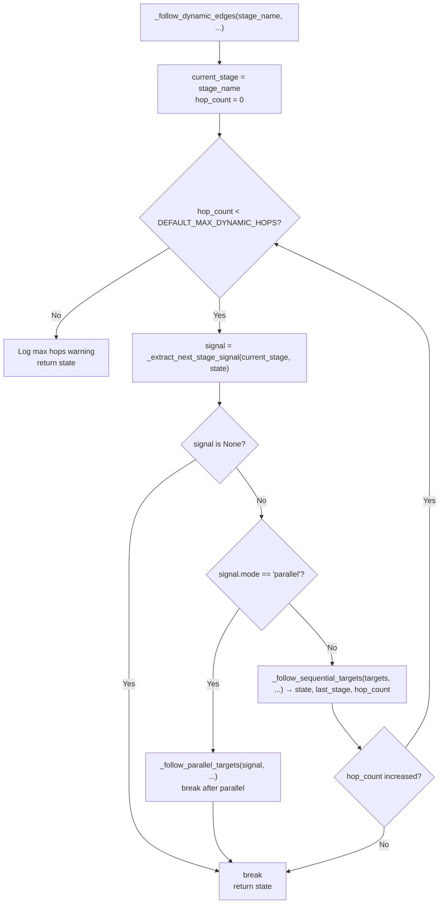
```mermaid
flowchart TD
    A["_follow_dynamic_edges(stage_name, ...)"] --> B["current_stage = stage_name\nhop_count = 0"]
    B --> C{hop_count < DEFAULT_MAX_DYNAMIC_HOPS?}
    C -- No --> D["Log max hops warning\nreturn state"]
    C -- Yes --> E["signal = _extract_next_stage_signal(current_stage, state)"]
    E --> F{signal is None?}
    F -- Yes --> G["break\nreturn state"]
    F -- No --> H{signal.mode == 'parallel'?}
    H -- Yes --> I["_follow_parallel_targets(signal, ...)\nbreak after parallel"]
    H -- No --> J["_follow_sequential_targets(targets, ...) → state, last_stage, hop_count"]
    J --> K{hop_count increased?}
    K -- No --> G
    K -- Yes --> C

    I --> G
```

**`_follow_sequential_targets()` inner loop:**

```python
for target_info in targets:
    if hop_count >= DEFAULT_MAX_DYNAMIC_HOPS:
        break
    target = target_info["name"]
    if target not in stage_nodes:
        logger.warning("Stage '%s' declared _next_stage '%s' but target not found; skipping", ...)
        continue

    hop_count += 1
    if target_info["inputs"]:
        state[StateKeys.DYNAMIC_INPUTS] = target_info["inputs"]

    state = negotiate_fn(target, stage_nodes, state, workflow_config)
    state.pop(StateKeys.DYNAMIC_INPUTS, None)
    current_stage = target
```

Per-target `inputs` are injected into `state[DYNAMIC_INPUTS]` before the stage executes and cleaned up immediately after. The stage executor reads `DYNAMIC_INPUTS` to inject per-invocation data that overrides default context resolution.

### 9.5 Parallel Fan-Out

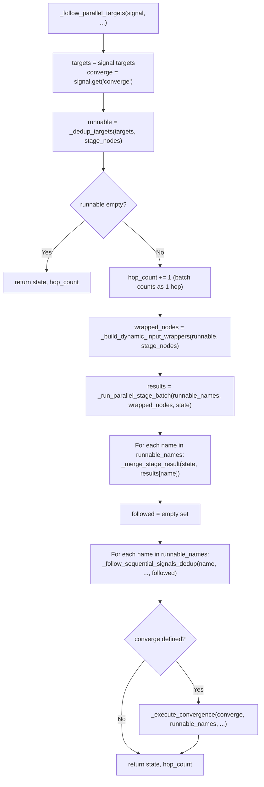
```mermaid
flowchart TD
    A["_follow_parallel_targets(signal, ...)"] --> B["targets = signal.targets\nconverge = signal.get('converge')"]
    B --> C["runnable = _dedup_targets(targets, stage_nodes)"]
    C --> D{runnable empty?}
    D -- Yes --> E["return state, hop_count"]
    D -- No --> F["hop_count += 1 (batch counts as 1 hop)"]
    F --> G["wrapped_nodes = _build_dynamic_input_wrappers(runnable, stage_nodes)"]
    G --> H["results = _run_parallel_stage_batch(runnable_names, wrapped_nodes, state)"]
    H --> I["For each name in runnable_names:\n_merge_stage_result(state, results[name])"]
    I --> J["followed = empty set"]
    J --> K["For each name in runnable_names:\n_follow_sequential_signals_dedup(name, ..., followed)"]
    K --> L{converge defined?}
    L -- Yes --> M["_execute_convergence(converge, runnable_names, ...)"]
    L -- No --> N["return state, hop_count"]
    M --> N
```

**Deduplication:** `_dedup_targets()` removes duplicate stage names from the target list. A stage can appear in the target list once — the first occurrence wins.

**Input wrapping:** `_build_dynamic_input_wrappers()` creates closure wrappers for each target that inject `DYNAMIC_INPUTS` before calling the real stage node and clean up afterward. Targets without per-target inputs use the original node callable directly.

**Post-fan-out sequential signals:** After all parallel branches complete, `_follow_sequential_signals_dedup()` follows any `_next_stage` signals emitted by individual branches. The `followed` set prevents the same convergence target from being executed multiple times (a naive fan-out could cause each branch to independently signal the same convergence stage, executing it N times).

### 9.6 Convergence after Fan-Out

```python
def _execute_convergence(converge, branch_names, stage_nodes, state, ...):
    conv_name = converge["name"]
    if conv_name not in stage_nodes:
        logger.warning("Convergence stage '%s' not found; skipping", conv_name)
        return state, hop_count

    # Record which branches fed into this convergence point
    conv_preds = dict(state.get("_convergence_predecessors", {}))
    conv_preds[conv_name] = list(branch_names)
    state["_convergence_predecessors"] = conv_preds

    state = negotiate_fn(conv_name, stage_nodes, state, workflow_config)
    return state, hop_count
```

`_convergence_predecessors` in state allows `PredecessorResolver` to determine which stages' outputs are relevant for the convergence stage's context resolution — instead of having access to all outputs, the convergence stage sees only the outputs from its direct branches.

### 9.7 Hop Limit and Safety Guards

| Constant | Value | Purpose |
|---|---|---|
| `DEFAULT_MAX_DYNAMIC_HOPS` | 5 | Maximum sequential/parallel hop chain length |
| `DEFAULT_MAX_DYNAMIC_TARGETS` | 10 | Maximum targets in a single `_next_stage` signal |
| `DEFAULT_MAX_NEGOTIATION_ROUNDS` | 2 | Maximum negotiation re-runs before propagating error |
| `DEFAULT_MAX_LOOPS` | 2 | Maximum loop-back iterations |
| `DEFAULT_MAX_STAGE_PARALLEL_WORKERS` | 4 | ThreadPoolExecutor workers for stage-level parallelism |

Reaching `DEFAULT_MAX_DYNAMIC_HOPS` logs a warning but does not raise an error — execution continues from the state at the point where the hop limit was reached.

---

## 10. Parallel Execution — ThreadPoolParallelRunner

**Location:** `/home/shinelay/meta-autonomous-framework/temper_ai/workflow/engines/dynamic_runner.py`

### 10.1 Stage-Level vs. Agent-Level Parallelism

The framework has **two distinct levels of parallelism**:

| Level | Implemented by | Scope | Workers |
|---|---|---|---|
| Stage-level | `WorkflowExecutor._execute_parallel_stages()` + `_run_parallel_stage_batch()` | Multiple stages at same DAG depth | `DEFAULT_MAX_STAGE_PARALLEL_WORKERS = 4` |
| Agent-level | `ThreadPoolParallelRunner.run_parallel()` | Multiple agents within a single parallel stage | `DEFAULT_MAX_WORKERS = 8` |

`ThreadPoolParallelRunner` handles **agent-level** parallelism — running multiple agent nodes concurrently within a single stage that uses `execution.agent_mode: parallel`. The stage-level ThreadPool in `workflow_executor.py` is a separate, inline implementation.

### 10.2 run_parallel() Protocol

```python
def run_parallel(
    self,
    nodes: dict[str, Callable[[dict], dict]],
    initial_state: dict[str, Any],
    *,
    init_node: Callable[[dict], dict] | None = None,
    collect_node: Callable[[dict], dict] | None = None,
) -> dict[str, Any]:
```

**Execution sequence:**

1. **Init phase:** If `init_node` provided, run it synchronously against the state. Merge its updates.
2. **Fan-out phase:** Submit all `nodes` concurrently to `ThreadPoolExecutor`. Each node receives a copy of the current state.
3. **Collection phase:** If `collect_node` provided, run it synchronously against the merged state.

`init_node` and `collect_node` correspond to setup/teardown logic that must run before/after the parallel agent fan-out. These hooks are optional; most stages do not use them.

### 10.3 _run_nodes_parallel — ThreadPoolExecutor Internals

```python
def _run_nodes_parallel(self, nodes, state):
    effective_workers = min(self.max_workers, len(nodes))
    merged = dict(state)

    with ThreadPoolExecutor(max_workers=effective_workers) as executor:
        future_to_name = {
            executor.submit(fn, dict(state)): name    # Each gets a copy
            for name, fn in nodes.items()
        }

        for future in as_completed(future_to_name):   # Process in completion order
            name = future_to_name[future]
            try:
                result = future.result()
                if result:
                    merged = _merge_dicts(merged, result)
            except Exception:
                logger.exception("Parallel node '%s' failed", name)
                merged.setdefault("_failed_nodes", []).append(name)

    return merged
```

**Key behaviors:**
- `effective_workers = min(max_workers, len(nodes))` — never creates more threads than needed
- Each node callable receives `dict(state)` — a **shallow copy** of the state at fan-out time
- Results are processed in **completion order** (via `as_completed()`), not submission order. The merge order is non-deterministic and depends on which nodes finish first.
- Failed nodes do not abort the execution — their names are appended to `_failed_nodes` in the merged state, and execution continues.

### 10.4 _merge_dicts — The State Merging Algorithm

Two versions of `_merge_dicts` exist in the codebase with different semantics:

**`dynamic_runner._merge_dicts` (recursive, for agent-level merging):**

```python
def _merge_dicts(left: dict, right: dict) -> dict:
    """Recursively merge — nested dicts are merged, not replaced."""
    merged = left.copy()
    for key, value in right.items():
        if key in merged and isinstance(merged[key], dict) and isinstance(value, dict):
            merged[key] = _merge_dicts(merged[key], value)  # Recurse
        else:
            merged[key] = value  # Right wins
    return merged
```

**`langgraph_state._merge_dicts` (shallow, for LangGraph reducer):**

```python
def _merge_dicts(left: dict, right: dict) -> dict:
    """Shallow merge — right wins on any key conflict."""
    merged = left.copy()
    merged.update(right)  # No recursion
    return merged
```

**Why the difference matters:**

When multiple parallel agents both write to `stage_outputs["my_stage"]["agent_outputs"]`, the recursive version preserves all agent results by merging the nested dict. The shallow version would replace the entire `agent_outputs` dict with the last agent's result.

The recursive version is appropriate for `ThreadPoolParallelRunner` because agents in the same parallel stage all write to the same nested structure. The shallow version is appropriate for LangGraph's reducer because different parallel *stages* write to different top-level keys in `stage_outputs` (each stage has its own key).

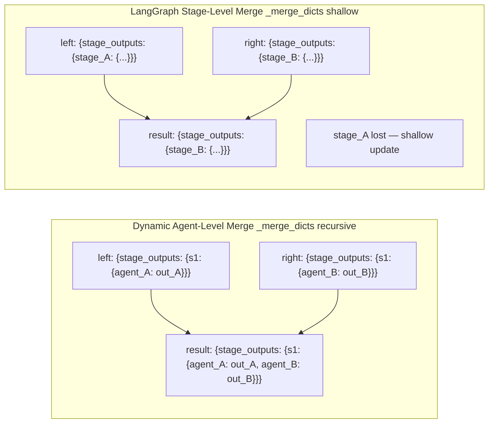
```mermaid
flowchart LR
    subgraph Dynamic Agent-Level Merge _merge_dicts recursive
        A["left: {stage_outputs: {s1: {agent_A: out_A}}}"]
        B["right: {stage_outputs: {s1: {agent_B: out_B}}}"]
        C["result: {stage_outputs: {s1: {agent_A: out_A, agent_B: out_B}}}"]
        A --> C
        B --> C
    end

    subgraph LangGraph Stage-Level Merge _merge_dicts shallow
        D["left: {stage_outputs: {stage_A: {...}}}"]
        E["right: {stage_outputs: {stage_B: {...}}}"]
        F["result: {stage_outputs: {stage_B: {...}}}"]
        D --> F
        E --> F
        Note1["stage_A lost — shallow update"]
    end
```

Wait — the LangGraph reducer is called **per field**, not on the whole dict. LangGraph calls `_merge_dicts(left_stage_outputs, right_stage_outputs)` where each side contains a single stage's contribution. So the shallow merge is correct at that level.

Corrected diagram:

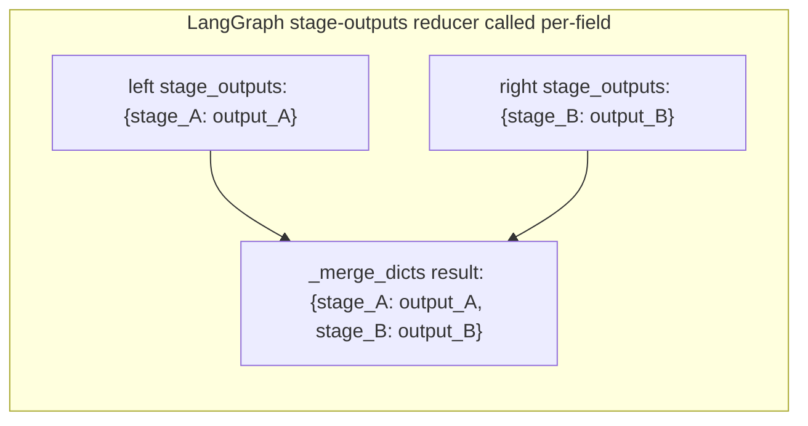
```mermaid
flowchart LR
    subgraph LangGraph stage-outputs reducer called per-field
        D["left stage_outputs: {stage_A: output_A}"]
        E["right stage_outputs: {stage_B: output_B}"]
        F["_merge_dicts result: {stage_A: output_A, stage_B: output_B}"]
        D --> F
        E --> F
    end
```

### 10.5 Error Handling in Parallel Stages

**Agent-level (ThreadPoolParallelRunner):**
- Exceptions are caught with `logger.exception()` and the failed node name is added to `merged["_failed_nodes"]`.
- Execution continues — other nodes' results are still merged.
- No re-raise; the parallel execution as a whole succeeds with partial results.

**Stage-level (_run_parallel_stage_batch in workflow_executor.py):**
```python
except Exception:
    logger.exception("Stage '%s' failed in parallel execution", name)
    results[name] = {
        "stage_outputs": {name: {"stage_status": "failed", "error": "execution_error"}},
        "current_stage": name,
    }
```
Failed stages get a synthetic result dict with `stage_status: failed`. The workflow continues; the failed stage's output is marked as failed but subsequent stages can inspect this and react (e.g., via conditions).

---

## 11. CompiledGraphRunner — The LangGraph Executor

**Location:** `/home/shinelay/meta-autonomous-framework/temper_ai/workflow/workflow_executor.py`

`CompiledGraphRunner` wraps a compiled LangGraph `StateGraph` (Pregel graph) and provides the execution interface with observability, checkpointing, and optimization integration. It is the lower-level executor used by `LangGraphCompiledWorkflow`.

Note: This file also exports `WorkflowExecutor = CompiledGraphRunner` as a backward-compat alias. This name collides with the `WorkflowExecutor` in `engines/workflow_executor.py` — a different class entirely. The collision is documented with a comment in the source.

### 11.1 execute() and execute_async()

```python
def execute(self, input_data, workflow_id=None):
    state = initialize_state(
        input_data=input_data,
        workflow_id=workflow_id,
        tracker=self.tracker
    )
    result = self.graph.invoke(state)
    return cast(dict[str, Any], result)

async def execute_async(self, input_data, workflow_id=None):
    state = initialize_state(
        input_data=input_data,
        workflow_id=workflow_id,
        tracker=self.tracker
    )
    result = await self.graph.ainvoke(state)
    return cast(dict[str, Any], result)
```

`initialize_state()` (from `state_manager`) creates the initial `LangGraphWorkflowState` dataclass instance from the input dict, generating a unique `workflow_id` if not provided, and injecting the tracker.

### 11.2 stream()

```python
def stream(self, input_data, workflow_id=None):
    state = initialize_state(input_data=input_data, workflow_id=workflow_id, tracker=self.tracker)
    for chunk in self.graph.stream(state):
        yield chunk
```

LangGraph's `stream()` yields intermediate states as the Pregel graph executes node by node. Each `chunk` is a dict with the format `{stage_name: updated_state}` — the state dict after that stage's node function completes. This enables real-time monitoring of workflow progress.

### 11.3 execute_with_checkpoints()

```python
def execute_with_checkpoints(self, input_data, workflow_id=None, checkpoint_interval=1):
    if self.checkpoint_manager is None:
        raise RuntimeError("Checkpoint manager not configured")

    state = initialize_state(...)
    final_state = None
    stage_count = 0

    try:
        for chunk in self.graph.stream(state):
            if chunk:
                stage_name = list(chunk.keys())[0]
                final_state = chunk[stage_name]
                stage_count += 1

                if stage_count % checkpoint_interval == 0:
                    _save_checkpoint_on_interval(
                        checkpoint_manager, final_state, tracker,
                        stage_count, stage_name, workflow_id
                    )

        # Save final checkpoint
        domain_state = self._extract_domain_state(final_state)
        checkpoint_manager.save_checkpoint(domain_state)
        return final_state

    except Exception as e:
        if final_state is not None:
            _save_checkpoint_on_error(
                checkpoint_manager, final_state, tracker,
                workflow_id, e, stage_count
            )
        raise
```

Checkpoints are saved every `checkpoint_interval` stages and on any error. `_extract_domain_state()` filters the full state dict down to only `WorkflowDomainState` fields before serializing — infrastructure components (`tracker`, `tool_registry`, etc.) are excluded from the checkpoint.

### 11.4 resume_from_checkpoint()

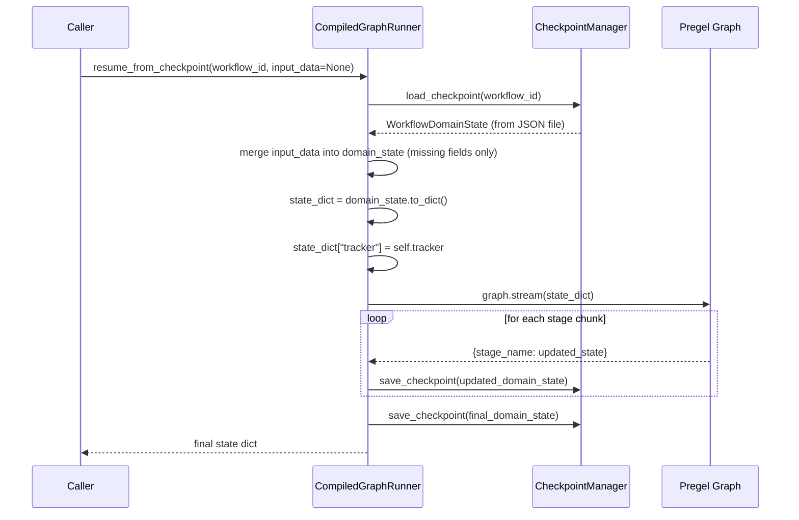
```mermaid
sequenceDiagram
    participant C as Caller
    participant R as CompiledGraphRunner
    participant CM as CheckpointManager
    participant G as Pregel Graph

    C->>R: resume_from_checkpoint(workflow_id, input_data=None)
    R->>CM: load_checkpoint(workflow_id)
    CM-->>R: WorkflowDomainState (from JSON file)
    R->>R: merge input_data into domain_state (missing fields only)
    R->>R: state_dict = domain_state.to_dict()
    R->>R: state_dict["tracker"] = self.tracker
    R->>G: graph.stream(state_dict)
    loop for each stage chunk
        G-->>R: {stage_name: updated_state}
        R->>CM: save_checkpoint(updated_domain_state)
    end
    R->>CM: save_checkpoint(final_domain_state)
    R-->>C: final state dict
```

**How checkpoint/resume works with LangGraph:** The `WorkflowDomainState` loaded from disk is converted back to a dict and passed to `graph.stream()`. LangGraph's nodes see all previously completed stage outputs in `stage_outputs`. Individual nodes that check `state["resumed_stages"]` (set by `CompiledGraphRunner` before streaming) can skip re-execution of already-completed work.

### 11.5 execute_with_optimization()

```python
def execute_with_optimization(self, input_data, optimization_config, workflow_id=None, llm=None, experiment_service=None):
    from temper_ai.optimization.engine import OptimizationEngine

    if not isinstance(optimization_config, OptimizationConfig):
        return self.execute(input_data, workflow_id)

    if not optimization_config.enabled or not optimization_config.pipeline:
        return self.execute(input_data, workflow_id)

    engine = OptimizationEngine(config=optimization_config, llm=llm, experiment_service=experiment_service)
    result = engine.run(runner=self, input_data=input_data)
    return result.output
```

When optimization is configured, `OptimizationEngine.run()` receives the `CompiledGraphRunner` itself as the `runner` parameter. The optimization engine can call `runner.execute()` multiple times with different prompt variants, comparing results to select the best output. Falls through to plain `execute()` if optimization is disabled or has no pipeline steps.

---

## 12. Module Aliases and Backward Compatibility

The codebase maintains backward compatibility through three re-export shim modules:

### engines/native_engine.py

```python
"""Re-export shim — canonical module is dynamic_engine.
'Native' was renamed to 'Dynamic' to capture runtime routing capabilities."""
from temper_ai.workflow.engines.dynamic_engine import (
    DynamicCompiledWorkflow as NativeCompiledWorkflow,
    DynamicExecutionEngine as NativeExecutionEngine,
    DynamicCompiledWorkflow,
    DynamicExecutionEngine,
)
```

### engines/native_runner.py

```python
"""Re-export shim — canonical module is dynamic_runner."""
from temper_ai.workflow.engines.dynamic_runner import (
    DEFAULT_MAX_WORKERS,
    ThreadPoolParallelRunner,
    _merge_dicts,
)
```

### workflow/langgraph_engine.py (top-level shim)

```python
"""Re-export shim — canonical module is engines/langgraph_engine."""
from temper_ai.workflow.engines.langgraph_compiler import LangGraphCompiler
from temper_ai.workflow.engines.langgraph_engine import (
    LangGraphCompiledWorkflow,
    LangGraphExecutionEngine,
)
```

### workflow/workflow_executor.py alias

```python
# Bottom of file:
WorkflowExecutor = CompiledGraphRunner
```

This creates the collision with `engines/workflow_executor.py:WorkflowExecutor`. Callers who `from temper_ai.workflow.workflow_executor import WorkflowExecutor` get `CompiledGraphRunner`, while callers who `from temper_ai.workflow.engines.workflow_executor import WorkflowExecutor` get the DAG walker.

### engines/__init__.py legacy aliases

```python
NativeCompiledWorkflow = DynamicCompiledWorkflow  # noqa: F401
NativeExecutionEngine = DynamicExecutionEngine     # noqa: F401
```

### EngineRegistry built-in alias

```python
self._engines["native"] = DynamicExecutionEngine  # "native" → same as "dynamic"
```

**Summary of name evolution:**

| Old Name | New Name | Reason |
|---|---|---|
| `NativeExecutionEngine` | `DynamicExecutionEngine` | "Dynamic" better captures runtime routing |
| `NativeCompiledWorkflow` | `DynamicCompiledWorkflow` | Consistent rename |
| `NativeRunner` / `native_runner.py` | `ThreadPoolParallelRunner` / `dynamic_runner.py` | Clarifies implementation |
| `WorkflowExecutor` (in `workflow_executor.py`) | `CompiledGraphRunner` | Avoids collision with DAG walker |
| `langgraph_engine.py` (top-level) | → `engines/langgraph_engine.py` | Package restructuring |

---

## 13. Design Patterns and Architectural Decisions

### Pattern 1: Abstract Factory + Adapter

The `EngineRegistry` implements an **Abstract Factory** for `ExecutionEngine` implementations. Each engine internally uses the **Adapter pattern** to wrap its implementation (`LangGraphExecutionEngine` wraps `LangGraphCompiler`; `DynamicExecutionEngine` wraps `WorkflowExecutor`).

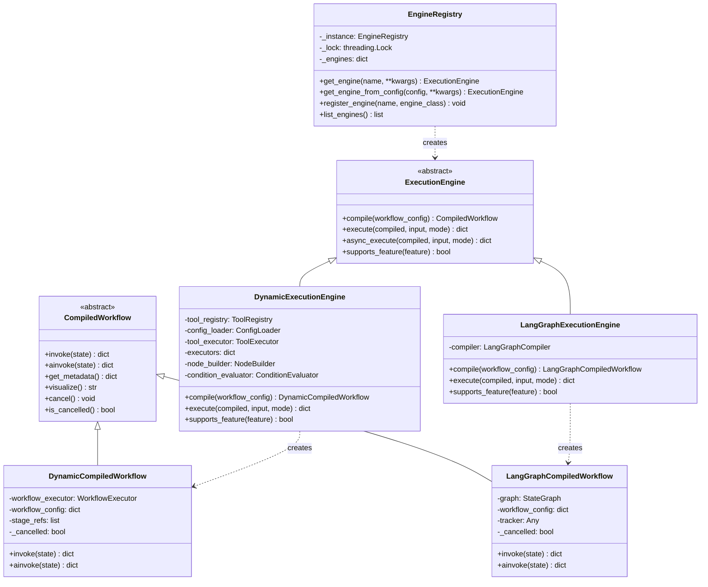
```mermaid
classDiagram
    class ExecutionEngine {
        <<abstract>>
        +compile(workflow_config) CompiledWorkflow
        +execute(compiled, input, mode) dict
        +async_execute(compiled, input, mode) dict
        +supports_feature(feature) bool
    }

    class CompiledWorkflow {
        <<abstract>>
        +invoke(state) dict
        +ainvoke(state) dict
        +get_metadata() dict
        +visualize() str
        +cancel() void
        +is_cancelled() bool
    }

    class DynamicExecutionEngine {
        -tool_registry: ToolRegistry
        -config_loader: ConfigLoader
        -tool_executor: ToolExecutor
        -executors: dict
        -node_builder: NodeBuilder
        -condition_evaluator: ConditionEvaluator
        +compile(workflow_config) DynamicCompiledWorkflow
        +execute(compiled, input, mode) dict
        +supports_feature(feature) bool
    }

    class DynamicCompiledWorkflow {
        -workflow_executor: WorkflowExecutor
        -workflow_config: dict
        -stage_refs: list
        -_cancelled: bool
        +invoke(state) dict
        +ainvoke(state) dict
    }

    class LangGraphExecutionEngine {
        -compiler: LangGraphCompiler
        +compile(workflow_config) LangGraphCompiledWorkflow
        +execute(compiled, input, mode) dict
        +supports_feature(feature) bool
    }

    class LangGraphCompiledWorkflow {
        -graph: StateGraph
        -workflow_config: dict
        -tracker: Any
        -_cancelled: bool
        +invoke(state) dict
        +ainvoke(state) dict
    }

    class EngineRegistry {
        -_instance: EngineRegistry
        -_lock: threading.Lock
        -_engines: dict
        +get_engine(name, **kwargs) ExecutionEngine
        +get_engine_from_config(config, **kwargs) ExecutionEngine
        +register_engine(name, engine_class) void
        +list_engines() list
    }

    ExecutionEngine <|-- DynamicExecutionEngine
    ExecutionEngine <|-- LangGraphExecutionEngine
    CompiledWorkflow <|-- DynamicCompiledWorkflow
    CompiledWorkflow <|-- LangGraphCompiledWorkflow
    DynamicExecutionEngine ..> DynamicCompiledWorkflow : creates
    LangGraphExecutionEngine ..> LangGraphCompiledWorkflow : creates
    EngineRegistry ..> ExecutionEngine : creates
```

### Pattern 2: Two-Phase Execution (Compile → Execute)

Separating `compile()` from `execute()` is a classic interpreter pattern. Benefits:
- Fail-fast validation: all YAML configs validated before any LLM call is made
- Compiled form reusable: same `CompiledWorkflow` instance can be invoked with different inputs
- Engine-specific optimization: LangGraph Pregel compilation optimizes the graph topology once

### Pattern 3: Template Method in WorkflowExecutor

`WorkflowExecutor.run()` is a template method that delegates to specialized methods:
- `_execute_single_stage()` — handles conditions + loops + negotiation + dynamic edges
- `_execute_parallel_stages()` — handles skipping + parallel batch + per-stage edge following
- `_execute_with_negotiation()` — handles retry loop with producer re-run
- `_execute_with_loop()` — handles the loop-back iteration pattern

Each specialized method can be tested independently, and the template method orchestrates them without knowing their internals.

### Pattern 4: Strategy Pattern for Executors

The `executors` dict (`{"sequential": ..., "parallel": ..., "adaptive": ...}`) is a Strategy pattern. `NodeBuilder.create_stage_node()` selects the appropriate executor based on the stage configuration, injecting it as a callable. The `WorkflowExecutor` is unaware of which executor strategy is active for any given stage.

### Pattern 5: Cooperative Cancellation (Flag Pattern)

Both `DynamicCompiledWorkflow` and `LangGraphCompiledWorkflow` use a simple boolean flag for cancellation. This is the cooperative cancellation model (as opposed to thread interruption or task cancellation tokens). It is safe but high-latency: cancellation does not interrupt running I/O.

### Pattern 6: Domain/Infrastructure Separation for Checkpointing

`WorkflowDomainState` (serializable) vs `InfrastructureContext` (non-serializable) is a deliberate architectural boundary. This boundary makes checkpoint/resume possible without persisting live objects (trackers, thread pools, database connections). On resume, domain state is deserialized from JSON; infrastructure is recreated from config.

### Pattern 7: Signal-Based Routing (_next_stage Protocol)

The `_next_stage` protocol is an actor-model-inspired routing mechanism: stages emit a routing signal embedded in their output, and the executor inspects this signal after stage completion. This avoids the need to pre-declare all edges at compile time. The three-source lookup (top-level key → structured compartment → text parsing) provides graceful degradation from explicit structured output to parsing free-form LLM text.

---

## 14. Feature Comparison Matrix


```mermaid
flowchart LR
    subgraph Engine Feature Matrix
        direction TB
        F1["Sequential stages"]
        F2["Parallel stages (depth-group)"]
        F3["Conditional routing (skip_if/condition)"]
        F4["Loop-back stages (loops_back_to)"]
        F5["Checkpointing / resume"]
        F6["Streaming intermediate results"]
        F7["Stage-to-stage negotiation"]
        F8["Dynamic edge routing (_next_stage)"]
        F9["Async/await (ainvoke)"]
        F10["Optimization pipeline integration"]
        F11["Mid-flight cancellation"]
    end
```

| Feature | Dynamic Engine | LangGraph Engine | Notes |
|---|:---:|:---:|---|
| Sequential stages | YES | YES | Both walk DAG in topo order |
| Parallel stages (depth-group) | YES | YES | Dynamic: ThreadPool; LG: Pregel branches |
| Conditional routing | YES | YES | Dynamic: Python eval; LG: conditional edges |
| Loop-back stages | YES | Limited | Dynamic: explicit loop; LG: requires graph cycle |
| Checkpointing / resume | Partial | YES | LG: full via CompiledGraphRunner |
| Streaming intermediate results | NO | YES | LG: graph.stream() in CompiledGraphRunner |
| Stage-to-stage negotiation | YES | NO | ContextResolutionError re-run producer |
| Dynamic edge routing | YES | NO | _next_stage signal protocol |
| Async/await (ainvoke) | YES (thread) | YES (native) | Dynamic offloads to thread; LG is native async |
| Optimization pipeline | NO* | YES | execute_with_optimization() in CompiledGraphRunner |
| Mid-flight cancellation | NO | NO | Both: pre-flight only via boolean flag |

\* The Dynamic engine's `DynamicCompiledWorkflow.invoke()` does not route through `CompiledGraphRunner`, so `execute_with_optimization()` is only available via the LangGraph path.

---

## 15. Extension and Integration Guide

### Adding a New Execution Engine

1. Create a class implementing `ExecutionEngine` ABC:

```python
from temper_ai.workflow.execution_engine import ExecutionEngine, CompiledWorkflow, ExecutionMode

class MyCustomEngine(ExecutionEngine):
    def compile(self, workflow_config: dict) -> CompiledWorkflow:
        # Validate config, build your compiled form
        return MyCompiledWorkflow(...)

    def execute(self, compiled_workflow, input_data, mode=ExecutionMode.SYNC):
        if not isinstance(compiled_workflow, MyCompiledWorkflow):
            raise TypeError(...)
        state = initialize_state(input_data)
        return compiled_workflow.invoke(state)

    async def async_execute(self, compiled_workflow, input_data, mode=ExecutionMode.ASYNC):
        state = initialize_state(input_data)
        return await compiled_workflow.ainvoke(state)

    def supports_feature(self, feature: str) -> bool:
        return feature in {"sequential_stages", "parallel_stages"}
```

2. Create a `CompiledWorkflow` implementation:

```python
class MyCompiledWorkflow(CompiledWorkflow):
    def invoke(self, state): ...
    async def ainvoke(self, state): ...
    def get_metadata(self): return {"engine": "my_engine", "version": "1.0", ...}
    def visualize(self): return "flowchart TD\n    A --> B"
    def cancel(self): self._cancelled = True
    def is_cancelled(self): return self._cancelled
```

3. Register with the `EngineRegistry`:

```python
from temper_ai.workflow.engine_registry import EngineRegistry
registry = EngineRegistry()
registry.register_engine("my_engine", MyCustomEngine)
```

4. Use in workflow YAML:

```yaml
workflow:
  name: my_workflow
  engine: my_engine
  engine_config:
    custom_param: value
```

### Implementing a New Stage Executor

Stage executors plug into both engines via the `executors` dict in `DynamicExecutionEngine._initialize_components()` and `LangGraphCompiler._initialize_components()`. A new executor must implement the `StageExecutorProtocol` (duck-typed) with `execute_stage()`.

### Adding Dynamic Edge Routing to an Agent

An agent returns a `_next_stage` signal by including it in its output dict:

```python
# In agent output (from structured output or tool result):
{
    "_next_stage": {
        "mode": "parallel",
        "targets": [
            {"name": "analysis_a", "inputs": {"focus": "cost"}},
            {"name": "analysis_b", "inputs": {"focus": "risk"}},
        ],
        "converge": {"name": "synthesis"}
    }
}
```

For unstructured LLM text output, the agent can embed JSON:
```
Based on the research, I recommend parallel analysis.
{"_next_stage": {"mode": "parallel", "targets": [{"name": "analysis_a"}, {"name": "analysis_b"}]}}
```

The three-source lookup will find and parse this signal from the raw text.

### Enabling Negotiation

```yaml
workflow:
  name: my_workflow
  engine: dynamic    # Negotiation only works with dynamic engine
  negotiation:
    enabled: true
    max_stage_rounds: 3
  stages:
    - name: producer
    - name: consumer
      inputs:
        - source: producer.required_field
```

When `consumer` raises `ContextResolutionError` for `producer.required_field`, the executor re-runs `producer` with feedback context injected into state, then retries `consumer`.

### Accessing the EngineRegistry

```python
from temper_ai.workflow.engine_registry import EngineRegistry

# Get default engine (langgraph)
registry = EngineRegistry()
engine = registry.get_engine("langgraph", tool_registry=my_registry)

# Get engine from workflow config (reads workflow.engine field)
engine = registry.get_engine_from_config(workflow_config, config_loader=my_loader)

# List available engines
print(registry.list_engines())  # ['langgraph', 'dynamic', 'native']
```

---

## 16. Observations and Recommendations

### Strengths

**1. Clean ABC separation.** The `ExecutionEngine` / `CompiledWorkflow` ABCs provide a genuinely useful vendor-independence layer. Switching from LangGraph to a hypothetical alternative requires only a new engine class, no changes to callers.

**2. Fail-fast config validation.** Both engines validate all stage and agent YAML configs against Pydantic schemas during `compile()`, before any LLM call. This dramatically reduces time-to-error feedback for misconfigured workflows.

**3. Dynamic engine capabilities.** The `_next_stage` protocol and stage-to-stage negotiation are powerful features that would be difficult to implement cleanly in a compiled Pregel graph. The signal-based routing with three-source lookup (including text parsing fallback) is pragmatic for LLM output variability.

**4. Domain/Infrastructure state separation.** The `WorkflowDomainState` / `InfrastructureContext` split is architecturally sound and makes checkpoint/resume safe without persisting live objects.

**5. Depth-group parallelism.** The DAG depth-group model for parallel execution is simpler and more predictable than LangGraph's Pregel fan-in/fan-out model. Stages at the same depth execute truly concurrently without needing explicit barrier nodes.

**6. Consistent re-export shim pattern.** The backward-compat shims (`native_engine.py`, `native_runner.py`, `langgraph_engine.py`) follow a consistent pattern across the codebase — thin re-exports that preserve old import paths without duplicating logic.

### Areas of Concern

**1. Mid-flight cancellation is not implemented.** Both engines only support pre-flight cancellation (checking the flag before `invoke()`). If an LLM call is running and `cancel()` is called, it will complete before the workflow stops. For production use with long-running agents (10+ minutes), this is a significant gap. Mitigation would require the DAG walker to periodically check a shared cancellation event between depth groups and the LangGraph engine to use `asyncio.Task.cancel()`.

**2. `WorkflowExecutor` name collision.** `temper_ai/workflow/workflow_executor.py` defines `CompiledGraphRunner` and exports `WorkflowExecutor = CompiledGraphRunner`. `temper_ai/workflow/engines/workflow_executor.py` defines `WorkflowExecutor` as the DAG walker. Both paths resolve to different classes. This is documented in comments but is a maintenance hazard.

**3. STREAM mode not implemented.** `ExecutionMode.STREAM` is defined in the enum and raises `NotImplementedError` in both engines. The streaming capability exists at the `CompiledGraphRunner` level but is not wired through the `ExecutionEngine` interface. The enum entry creates a false expectation for users.

**4. Two `_merge_dicts` implementations with different semantics.** The recursive version in `dynamic_runner.py` and the shallow version in `langgraph_state.py` have the same name but different behavior. Code search for `_merge_dicts` returns both without context. The difference is critical for correctness — using the wrong version in the wrong context would silently drop agent outputs.

**5. LangGraph engine does not support `execute_with_optimization()` through the `ExecutionEngine` interface.** This method exists on `CompiledGraphRunner` (the LangGraph executor) but is not part of the `ExecutionEngine` ABC or `LangGraphCompiledWorkflow`. Callers who use the engine via the ABC interface cannot access this capability without downcasting.

**6. Parallel stage state isolation is shallow copy only.** `dict(state)` creates a shallow copy — modifications to nested mutable objects (like `stage_outputs` dict values) by one parallel stage would be visible to others. In practice this is safe because stages write to their own keys in `stage_outputs`, but it is a subtle hazard if a stage modifies an existing output in place.

**7. Cooperative loop with no period check in SKIP_TO_END.** When `WorkflowStageError` is raised and `SKIP_TO_END` is set, it halts the loop at the top of the next depth group iteration. If stages within the current depth group are running in parallel (ThreadPool), they complete before `SKIP_TO_END` is checked. This is generally acceptable but means you cannot stop a parallel batch mid-execution.

### Best Practices Observed

- Using `asyncio.get_running_loop()` (not deprecated `get_event_loop()`) before calling `asyncio.run()`
- Using `from __future__ import annotations` pattern avoided — modern Python 3.10+ union type syntax used throughout
- `DEFAULT_MAX_*` constants extracted to module-level rather than hardcoded — makes limits configurable and testable
- All logging uses `%s` format strings, not f-strings — avoids string formatting overhead when log level is not active
- `logger.exception()` in exception handlers — preserves full traceback in log output without re-raising
- `frozenset` for `NON_SERIALIZABLE_KEYS` — immutable and O(1) membership test
- Thread-safe singleton with double-checked locking — correct pattern for CPython (GIL notwithstanding)
- Cache invalidation via `__setattr__` override rather than explicit invalidation calls — reduces risk of stale cache bugs

---

## Appendix: Key Constants Reference

| Constant | Location | Value | Purpose |
|---|---|---|---|
| `DEFAULT_MAX_LOOPS` | `workflow_executor.py` | `2` | Max loop-back iterations per stage |
| `DEFAULT_MAX_NEGOTIATION_ROUNDS` | `workflow_executor.py` | `2` | Max negotiation re-runs |
| `DEFAULT_MAX_STAGE_PARALLEL_WORKERS` | `workflow_executor.py` | `4` | ThreadPool workers for stage-level parallelism |
| `DEFAULT_MAX_DYNAMIC_HOPS` | `workflow_executor.py` | `5` | Max `_next_stage` chain length |
| `DEFAULT_MAX_DYNAMIC_TARGETS` | `workflow_executor.py` | `10` | Max targets in a single `_next_stage` signal |
| `DEFAULT_MAX_WORKERS` | `dynamic_runner.py` | `8` | ThreadPool workers for agent-level parallelism |
| `WORKFLOW_ID_PREFIX` | `shared/constants/execution.py` | `"wf-"` | Workflow ID prefix |
| `WORKFLOW_ID_HEX_LENGTH` | `domain_state.py` | `12` | Hex chars in auto-generated workflow ID |

## Appendix: Execution Flow Sequence — Dynamic Engine End-to-End

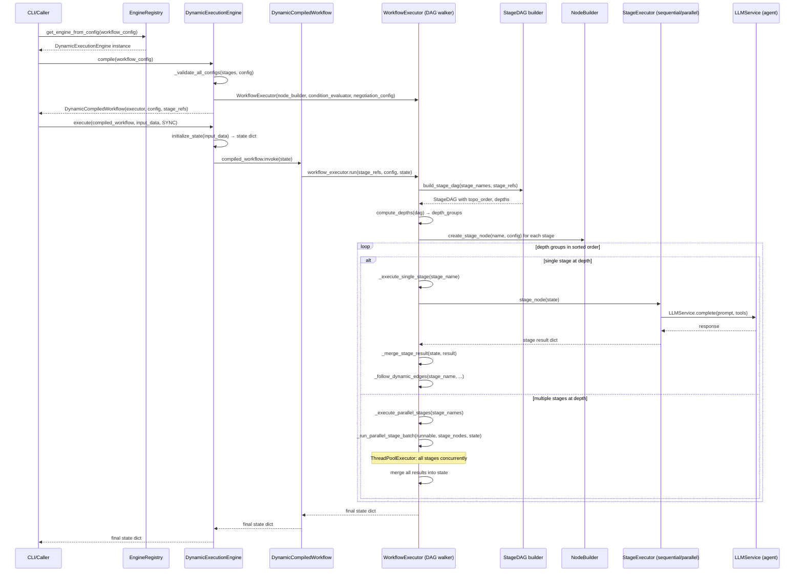
```mermaid
sequenceDiagram
    participant CLI as CLI/Caller
    participant ER as EngineRegistry
    participant DE as DynamicExecutionEngine
    participant DCW as DynamicCompiledWorkflow
    participant WE as WorkflowExecutor (DAG walker)
    participant DAG as StageDAG builder
    participant NB as NodeBuilder
    participant SE as StageExecutor (sequential/parallel)
    participant LLM as LLMService (agent)

    CLI->>ER: get_engine_from_config(workflow_config)
    ER-->>CLI: DynamicExecutionEngine instance

    CLI->>DE: compile(workflow_config)
    DE->>DE: _validate_all_configs(stages, config)
    DE->>WE: WorkflowExecutor(node_builder, condition_evaluator, negotiation_config)
    DE-->>CLI: DynamicCompiledWorkflow(executor, config, stage_refs)

    CLI->>DE: execute(compiled_workflow, input_data, SYNC)
    DE->>DE: initialize_state(input_data) → state dict
    DE->>DCW: compiled_workflow.invoke(state)
    DCW->>WE: workflow_executor.run(stage_refs, config, state)

    WE->>DAG: build_stage_dag(stage_names, stage_refs)
    DAG-->>WE: StageDAG with topo_order, depths
    WE->>WE: compute_depths(dag) → depth_groups
    WE->>NB: create_stage_node(name, config) for each stage

    loop depth groups in sorted order
        alt single stage at depth
            WE->>WE: _execute_single_stage(stage_name)
            WE->>SE: stage_node(state)
            SE->>LLM: LLMService.complete(prompt, tools)
            LLM-->>SE: response
            SE-->>WE: stage result dict
            WE->>WE: _merge_stage_result(state, result)
            WE->>WE: _follow_dynamic_edges(stage_name, ...)
        else multiple stages at depth
            WE->>WE: _execute_parallel_stages(stage_names)
            WE->>WE: _run_parallel_stage_batch(runnable, stage_nodes, state)
            Note over WE: ThreadPoolExecutor: all stages concurrently
            WE->>WE: merge all results into state
        end
    end

    WE-->>DCW: final state dict
    DCW-->>DE: final state dict
    DE-->>CLI: final state dict
```

## Appendix: Execution Flow Sequence — LangGraph Engine End-to-End

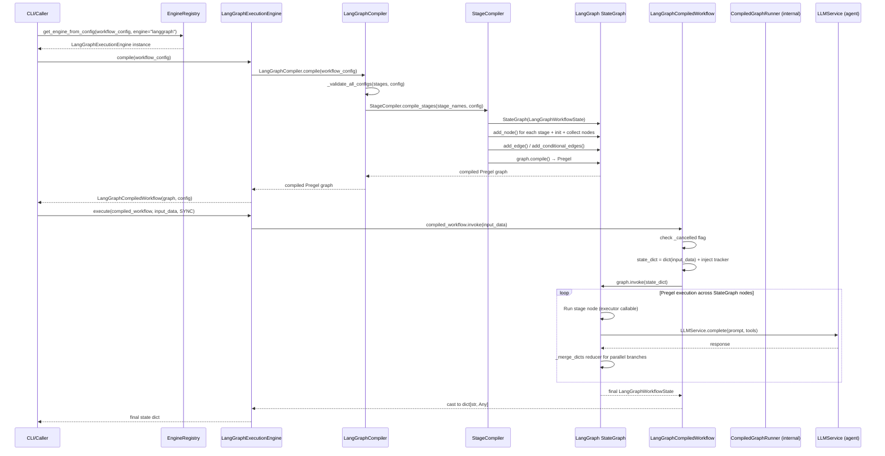
```mermaid
sequenceDiagram
    participant CLI as CLI/Caller
    participant ER as EngineRegistry
    participant LGE as LangGraphExecutionEngine
    participant LC as LangGraphCompiler
    participant SC as StageCompiler
    participant SG as LangGraph StateGraph
    participant LGC as LangGraphCompiledWorkflow
    participant CGR as CompiledGraphRunner (internal)
    participant LLM as LLMService (agent)

    CLI->>ER: get_engine_from_config(workflow_config, engine="langgraph")
    ER-->>CLI: LangGraphExecutionEngine instance

    CLI->>LGE: compile(workflow_config)
    LGE->>LC: LangGraphCompiler.compile(workflow_config)
    LC->>LC: _validate_all_configs(stages, config)
    LC->>SC: StageCompiler.compile_stages(stage_names, config)
    SC->>SG: StateGraph(LangGraphWorkflowState)
    SC->>SG: add_node() for each stage + init + collect nodes
    SC->>SG: add_edge() / add_conditional_edges()
    SC->>SG: graph.compile() → Pregel
    SG-->>LC: compiled Pregel graph
    LC-->>LGE: compiled Pregel graph
    LGE-->>CLI: LangGraphCompiledWorkflow(graph, config)

    CLI->>LGE: execute(compiled_workflow, input_data, SYNC)
    LGE->>LGC: compiled_workflow.invoke(input_data)
    LGC->>LGC: check _cancelled flag
    LGC->>LGC: state_dict = dict(input_data) + inject tracker
    LGC->>SG: graph.invoke(state_dict)

    loop Pregel execution across StateGraph nodes
        SG->>SG: Run stage node (executor callable)
        SG->>LLM: LLMService.complete(prompt, tools)
        LLM-->>SG: response
        SG->>SG: _merge_dicts reducer for parallel branches
    end

    SG-->>LGC: final LangGraphWorkflowState
    LGC-->>LGE: cast to dict[str, Any]
    LGE-->>CLI: final state dict
```

## Appendix: Dynamic Edge Routing Flow

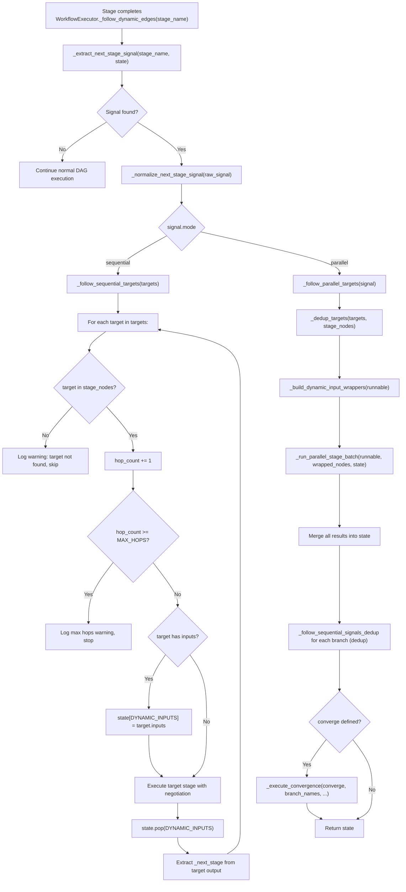
```mermaid
flowchart TD
    A["Stage completes\nWorkflowExecutor._follow_dynamic_edges(stage_name)"] --> B["_extract_next_stage_signal(stage_name, state)"]
    B --> C{Signal found?}
    C -- No --> Z["Continue normal DAG execution"]
    C -- Yes --> D["_normalize_next_stage_signal(raw_signal)"]
    D --> E{signal.mode}

    E -- sequential --> F["_follow_sequential_targets(targets)"]
    F --> G["For each target in targets:"]
    G --> H{target in stage_nodes?}
    H -- No --> I["Log warning: target not found, skip"]
    H -- Yes --> J["hop_count += 1"]
    J --> K{hop_count >= MAX_HOPS?}
    K -- Yes --> L["Log max hops warning, stop"]
    K -- No --> M{target has inputs?}
    M -- Yes --> N["state[DYNAMIC_INPUTS] = target.inputs"]
    M -- No --> O["Execute target stage with negotiation"]
    N --> O
    O --> P["state.pop(DYNAMIC_INPUTS)"]
    P --> Q["Extract _next_stage from target output"]
    Q --> G

    E -- parallel --> R["_follow_parallel_targets(signal)"]
    R --> S["_dedup_targets(targets, stage_nodes)"]
    S --> T["_build_dynamic_input_wrappers(runnable)"]
    T --> U["_run_parallel_stage_batch(runnable, wrapped_nodes, state)"]
    U --> V["Merge all results into state"]
    V --> W["_follow_sequential_signals_dedup for each branch (dedup)"]
    W --> X{converge defined?}
    X -- Yes --> Y["_execute_convergence(converge, branch_names, ...)"]
    X -- No --> Z2["Return state"]
    Y --> Z2
```
