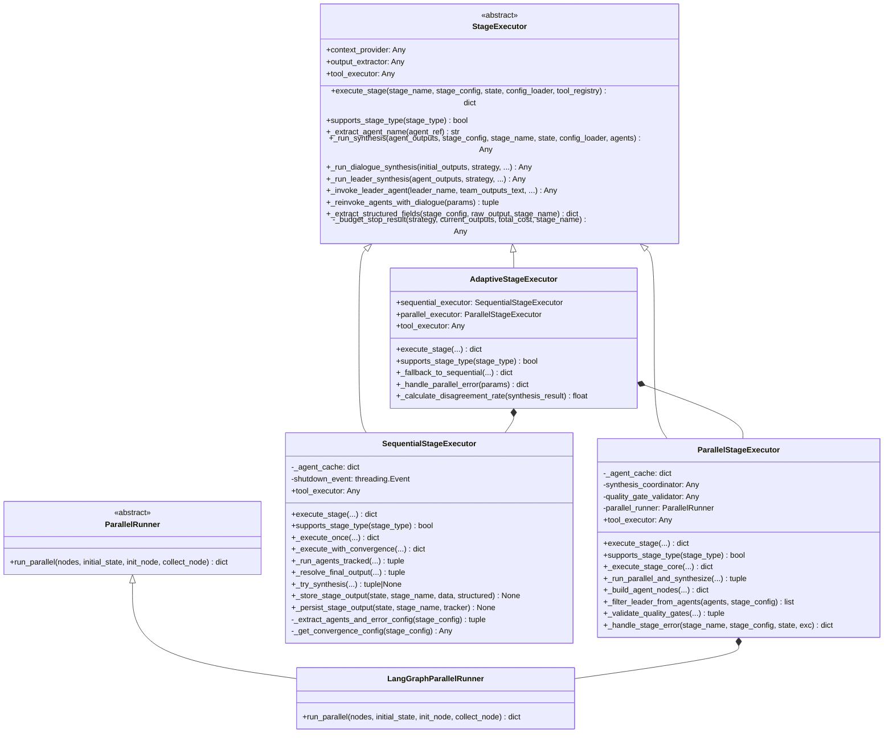
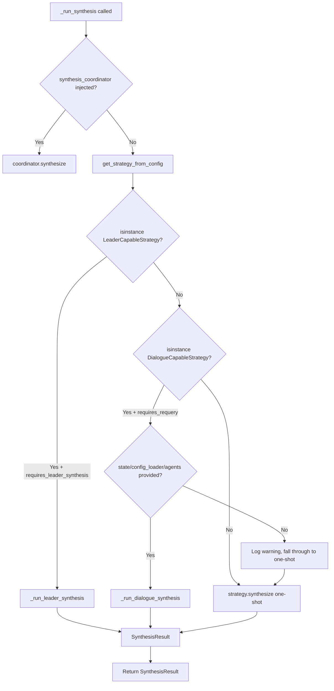
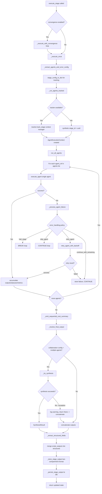
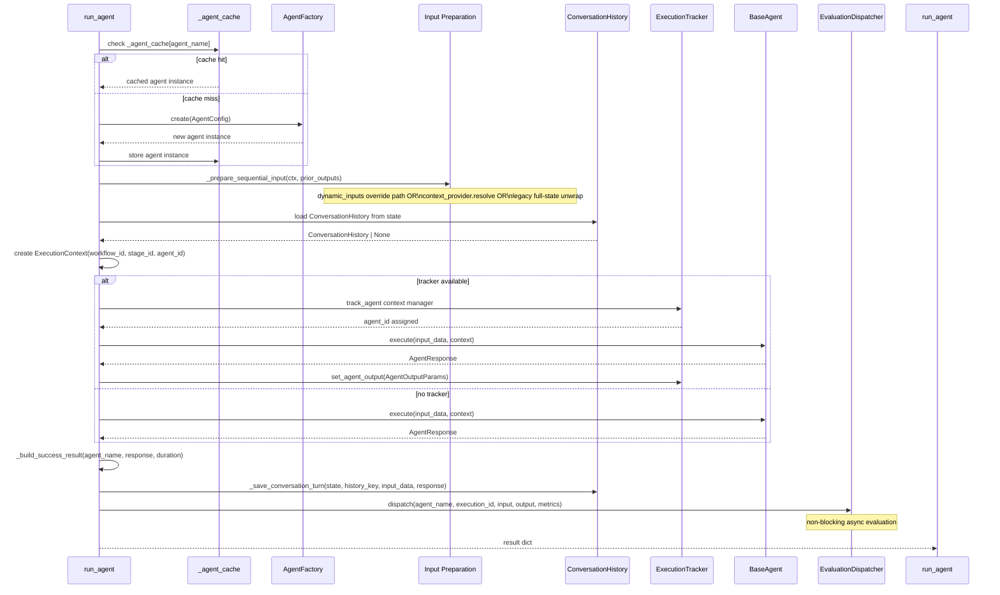
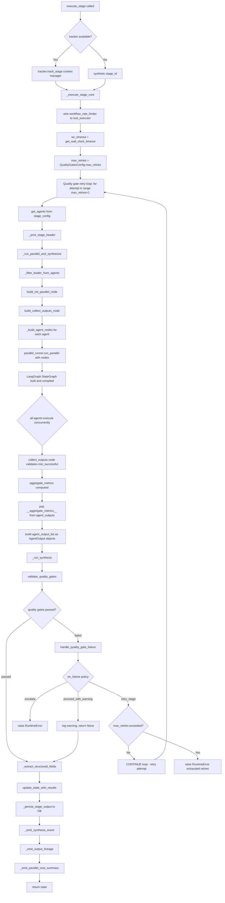
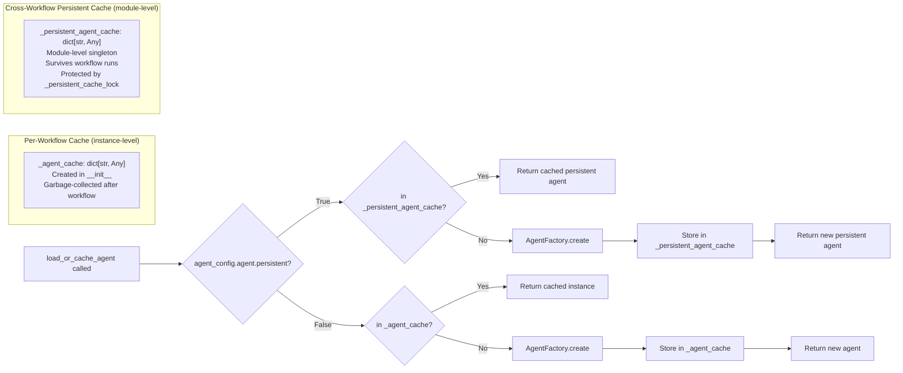
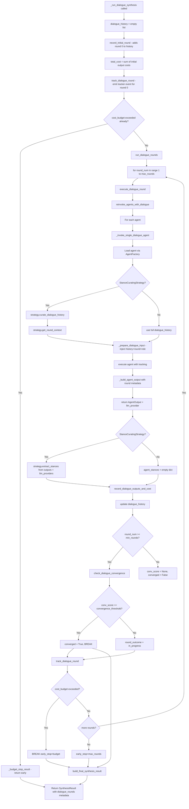
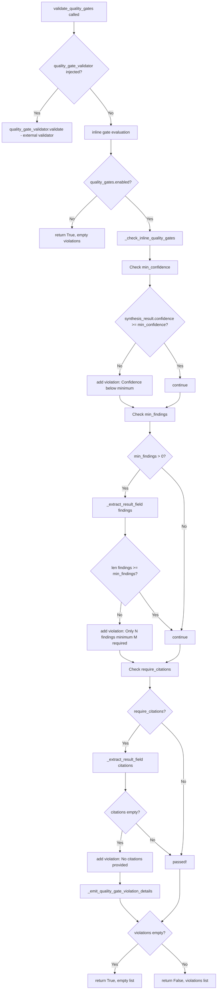

# Stage Executors — Exhaustive Architecture Reference

**Document version:** 1.0
**Last updated:** 2026-02-22
**System:** temper-ai meta-autonomous framework
**Scope:** Complete stage executor subsystem — sequential, parallel, adaptive, dialogue, quality gates, agent creation, synthesis

---

## Table of Contents

1. [Executive Summary](#1-executive-summary)
2. [Module Map and File Inventory](#2-module-map-and-file-inventory)
3. [Class Hierarchy and Protocols](#3-class-hierarchy-and-protocols)
4. [Stage Configuration Schemas](#4-stage-configuration-schemas)
5. [State Dictionary Contracts](#5-state-dictionary-contracts)
6. [BaseStageExecutor (StageExecutor)](#6-basestageexecutor-stageexecutor)
7. [ParallelRunner Abstraction](#7-parallelrunner-abstraction)
8. [Sequential Executor — Deep Dive](#8-sequential-executor--deep-dive)
9. [Parallel Executor — Deep Dive](#9-parallel-executor--deep-dive)
10. [Adaptive Executor — Deep Dive](#10-adaptive-executor--deep-dive)
11. [Agent Creation and Caching](#11-agent-creation-and-caching)
12. [Collaboration Strategies](#12-collaboration-strategies)
13. [Dialogue / Multi-Round Execution](#13-dialogue--multi-round-execution)
14. [Quality Gate Evaluation](#14-quality-gate-evaluation)
15. [Stage Result Structure](#15-stage-result-structure)
16. [Observability and Tracking](#16-observability-and-tracking)
17. [Error Classification and Retry Logic](#17-error-classification-and-retry-logic)
18. [Config Accessors and Dual-Path Resolution](#18-config-accessors-and-dual-path-resolution)
19. [LangGraph Parallel Runner](#19-langgraph-parallel-runner)
20. [Executor Protocols (Structural Typing)](#20-executor-protocols-structural-typing)
21. [Extension Points](#21-extension-points)
22. [Design Patterns and Observations](#22-design-patterns-and-observations)
23. [Appendix: Full StateKeys Reference](#23-appendix-full-statekeys-reference)

---

## 1. Executive Summary

- **System Name:** Stage Executors subsystem (`temper_ai/stage/executors/`)
- **Purpose:** Provides the execution layer that takes a parsed stage configuration and runs one or more LLM-backed agents against it, collecting, synthesizing, and returning their outputs as structured workflow state.
- **Technology Stack:** Python 3.11+, Pydantic v2, LangGraph (for parallel subgraphs), asyncio-compatible synchronous agents, Rich (console output)
- **Scope of Analysis:** Every file in `temper_ai/stage/executors/` and the supporting schemas in `temper_ai/stage/_schemas.py` and `temper_ai/stage/_config_accessors.py`

The executor subsystem sits between the workflow engine (which decides which stages to run and in what order) and the agent layer (which makes LLM calls). It is responsible for:

1. **Fan-out:** Spawning one or more agents for a stage
2. **Fan-in:** Collecting and synthesizing agent outputs
3. **Error handling:** Retrying transient failures, skipping, or halting
4. **Quality enforcement:** Validating synthesized output against configurable gates
5. **Observability:** Emitting tracking events, cost summaries, and lineage data

Three concrete modes exist:

| Mode | Class | When Used |
|---|---|---|
| `sequential` | `SequentialStageExecutor` | Agents run one-after-another; each can see prior outputs |
| `parallel` | `ParallelStageExecutor` | All agents run concurrently in a LangGraph subgraph |
| `adaptive` | `AdaptiveStageExecutor` | Starts parallel; falls back to sequential if disagreement too high |

---

## 2. Module Map and File Inventory

```
temper_ai/stage/
├── _schemas.py                    — Pydantic schemas: StageConfig, QualityGatesConfig, etc.
├── _config_accessors.py           — Dual-path config accessors (Pydantic + dict)
└── executors/
    ├── __init__.py                — Public exports; AgentCreator type alias
    ├── base.py                    — StageExecutor ABC + ParallelRunner ABC
    ├── _base_helpers.py           — AgentExecutionParams, tracking helpers (re-exports dialogue)
    ├── sequential.py              — SequentialStageExecutor
    ├── _sequential_helpers.py     — execute_agent(), run_all_agents(), AgentExecutionContext
    ├── _sequential_retry.py       — retry_agent_with_backoff(), error classification
    ├── parallel.py                — ParallelStageExecutor
    ├── _parallel_helpers.py       — create_agent_node(), collect/init nodes, quality gate re-exports
    ├── _parallel_observability.py — synthesis event, lineage, cost summary emission
    ├── _parallel_quality_gates.py — validate_quality_gates(), handle_quality_gate_failure()
    ├── adaptive.py                — AdaptiveStageExecutor + disagreement rate math
    ├── _agent_execution.py        — load_or_cache_agent(), config_to_tracking_dict()
    ├── _dialogue_helpers.py       — Multi-round dialogue orchestration
    ├── _protocols.py              — Runtime-checkable protocols (typing)
    ├── langgraph_runner.py        — LangGraphParallelRunner (LangGraph StateGraph)
    └── state_keys.py              — StateKeys constants class
```

**Dependency flow (simplified):**

```
parallel.py  ──imports──► _parallel_helpers.py
                          _parallel_quality_gates.py
                          _parallel_observability.py
                          langgraph_runner.py

sequential.py ──imports──► _sequential_helpers.py
                            _sequential_retry.py

adaptive.py ──imports──► parallel.py
                         sequential.py

All executors inherit from base.py (StageExecutor)
All helpers use _agent_execution.py and _base_helpers.py
_base_helpers.py re-exports _dialogue_helpers.py
```

---

## 3. Class Hierarchy and Protocols



**Protocol hierarchy** (for strategy-side type checking):

```mermaid
classDiagram
    class SynthesisCoordinatorProtocol {
        <<Protocol, runtime_checkable>>
        +synthesize(agent_outputs, stage_config, stage_name) Any
    }
    class QualityGateValidatorProtocol {
        <<Protocol, runtime_checkable>>
        +validate(synthesis_result, stage_config, stage_name) tuple
    }
    class LeaderCapableStrategy {
        <<Protocol, runtime_checkable>>
        +requires_leader_synthesis: bool
        +get_leader_agent_name(config) str|None
        +format_team_outputs(outputs) str
    }
    class DialogueCapableStrategy {
        <<Protocol, runtime_checkable>>
        +requires_requery: bool
        +max_rounds: int
        +min_rounds: int
        +convergence_threshold: float
        +cost_budget_usd: float|None
        +mode: str
        +synthesize(agent_outputs, config) Any
        +calculate_convergence(current, previous) float
    }
    class StanceCuratingStrategy {
        <<Protocol, runtime_checkable>>
        +curate_dialogue_history(dialogue_history, current_round, agent_name) list
        +get_round_context(round_num, agent_name) dict
        +extract_stances(outputs, llm_providers) dict
    }
```



All protocols are defined in `temper_ai/stage/executors/_protocols.py` and are `@runtime_checkable`, enabling `isinstance()` checks at runtime without requiring inheritance.

---

## 4. Stage Configuration Schemas

All schemas are Pydantic v2 models defined in `/home/shinelay/meta-autonomous-framework/temper_ai/stage/_schemas.py`.

### 4.1 Top-Level Schema

```python
class StageConfig(BaseModel):
    stage: StageConfigInner
    schema_version: str = "1.0"
```

### 4.2 StageConfigInner — The Core Schema

```python
class StageConfigInner(BaseModel):
    name: str                              # Stage name (used as state key)
    description: str                       # Human-readable purpose
    version: str                           # Schema version
    agents: list[str]                      # Agent config file paths (≥1 required)
    inputs: dict[str, Any] | None          # Input declarations with source refs
    outputs: dict[str, Any]                # Output extraction declarations
    execution: StageExecutionConfig        # agent_mode, timeout_seconds, adaptive_config
    collaboration: CollaborationConfig | None
    conflict_resolution: ConflictResolutionConfig | None
    safety: StageSafetyConfig              # execute / dry_run / require_approval
    error_handling: StageErrorHandlingConfig
    quality_gates: QualityGatesConfig
    convergence: ConvergenceConfig | None
    metadata: MetadataConfig
```

### 4.3 Execution Mode Configuration

```python
class StageExecutionConfig(BaseModel):
    agent_mode: Literal["parallel", "sequential", "adaptive"] = "parallel"
    timeout_seconds: int = 1800   # 30 minutes default
    adaptive_config: dict[str, Any] = {}
```

`adaptive_config` used by `AdaptiveStageExecutor`:
```yaml
adaptive_config:
  disagreement_threshold: 0.5   # 0.0–1.0; default PROB_MEDIUM (0.5)
  max_parallel_rounds: 2        # (informational, not yet enforced)
```

### 4.4 Collaboration Configuration

```python
class CollaborationConfig(BaseModel):
    strategy: str                         # Module reference (non-empty)
    max_rounds: int = 3                   # Dialogue rounds if dialogue_mode
    convergence_threshold: float = 0.95   # PROB_VERY_HIGH
    config: dict[str, Any] = {}           # Strategy-specific params
    # Dialogue-specific fields:
    max_dialogue_rounds: int | None = 3
    round_budget_usd: float | None = None
    dialogue_mode: bool = False
    roles: dict[str, str] | None = None
    context_window_rounds: int | None = 2
```

The `strategy` field is a module path string pointing to a class in `temper_ai.agent.strategies.*`. Examples:
- `"temper_ai.agent.strategies.consensus.ConsensusStrategy"`
- `"temper_ai.agent.strategies.debate.DebateStrategy"`
- `"temper_ai.agent.strategies.leader.LeaderStrategy"`
- `"temper_ai.agent.strategies.merit_weighted.MeritWeightedStrategy"`

### 4.5 Error Handling Configuration

```python
class StageErrorHandlingConfig(BaseModel):
    on_agent_failure: Literal[
        "halt_stage",             # Stop all agents immediately
        "retry_agent",            # Retry with exponential backoff
        "skip_agent",             # Log and move on
        "continue_with_remaining" # Default: store failure, proceed
    ] = "continue_with_remaining"
    min_successful_agents: int = 1   # Minimum agents needed to succeed
    fallback_strategy: str | None = None
    retry_failed_agents: bool = True
    max_agent_retries: int = 2       # MAX_RETRY_ATTEMPTS for retry_agent policy
```

### 4.6 Quality Gates Configuration

```python
class QualityGatesConfig(BaseModel):
    enabled: bool = False        # Off by default
    min_confidence: float = 0.8  # PROB_HIGH
    min_findings: int = 1        # SMALL_ITEM_LIMIT
    require_citations: bool = True
    on_failure: Literal[
        "retry_stage",            # Default: re-run agents
        "escalate",               # Raise RuntimeError
        "proceed_with_warning"    # Log warning, continue
    ] = "retry_stage"
    max_retries: int = 2
```

### 4.7 Convergence Configuration

```python
class ConvergenceConfig(BaseModel):
    enabled: bool = False
    max_iterations: int = 3        # DEFAULT_CONVERGENCE_MAX_ITERATIONS
    similarity_threshold: float = 0.99  # PROB_NEAR_CERTAIN
    method: Literal["exact_hash", "semantic"] = "exact_hash"
```

When `enabled=True`, the sequential executor re-runs the stage until outputs converge or `max_iterations` is reached.

### 4.8 Conflict Resolution Configuration

```python
class ConflictResolutionConfig(BaseModel):
    strategy: str                          # e.g., "merit_weighted"
    metrics: list[str] = ["confidence"]
    metric_weights: dict[str, float] = {}
    auto_resolve_threshold: float = 0.99   # PROB_CRITICAL
    escalation_threshold: float = 0.5     # PROB_MEDIUM
    config: dict[str, Any] = {}
```

Validators ensure `escalation_threshold <= auto_resolve_threshold` and all `metric_weights` are non-negative.

### 4.9 Runtime State Models

```python
class AgentMetrics(BaseModel):
    tokens: int; cost_usd: float; duration_seconds: float
    tool_calls: int; retries: int

class AggregateMetrics(BaseModel):
    total_tokens: int; total_cost_usd: float; total_duration_seconds: float
    avg_confidence: float; num_agents: int; num_successful: int; num_failed: int

class MultiAgentStageState(BaseModel):
    agent_outputs: dict[str, dict[str, Any]]
    agent_statuses: dict[str, Literal["success", "failed"]]
    agent_metrics: dict[str, AgentMetrics]
    aggregate_metrics: AggregateMetrics
    errors: dict[str, str]
    min_successful_agents: int = 1
```

---

## 5. State Dictionary Contracts

The entire executor subsystem communicates through a shared `state: dict[str, Any]` dictionary that is passed through every call. All keys are defined as constants on the `StateKeys` class in `/home/shinelay/meta-autonomous-framework/temper_ai/stage/executors/state_keys.py`.

### 5.1 Input State Keys (read by executors)

| Key | Type | Source | Purpose |
|---|---|---|---|
| `"stage_outputs"` | `dict[str, Any]` | Workflow engine | Prior stage results |
| `"workflow_id"` | `str` | Workflow engine | Correlation ID |
| `"workflow_inputs"` | `dict[str, Any]` | CLI / API | Raw user-supplied inputs |
| `"tracker"` | `ExecutionTracker` | Workflow engine | Observability tracker |
| `"tool_registry"` | `DomainToolRegistry` | Workflow engine | Available tools |
| `"config_loader"` | `ConfigLoader` | Workflow engine | Agent config loading |
| `"show_details"` | `bool` | CLI flag | Enable rich progress printing |
| `"detail_console"` | `Console` | CLI | Rich Console instance |
| `"stream_callback"` | `StreamCallback` | API | SSE streaming handler |
| `"total_stages"` | `int` | Workflow engine | Total stage count (progress display) |
| `"workflow_rate_limiter"` | `WorkflowRateLimiter` | Workflow engine | Per-workflow rate limiting |
| `"_dynamic_inputs"` | `dict[str, Any]` | Dynamic engine | Overrides normal context resolution |
| `"evaluation_dispatcher"` | `EvaluationDispatcher` | Optimization | Async agent output evaluation |
| `"conversation_histories"` | `dict[str, Any]` | Executor | Cross-invocation conversation state |

### 5.2 Output State Keys (written by executors)

| Key | Type | Written By | Purpose |
|---|---|---|---|
| `"stage_outputs[stage_name]"` | `dict` | All executors | Stage execution results |
| `"current_stage"` | `str` | All executors | Name of last completed stage |
| `"current_stage_id"` | `str` | All executors | Tracker-assigned stage ID |
| `"stage_retry_counts"` | `dict[str, int]` | Parallel executor | Quality gate retry tracking |
| `"conversation_histories"` | `dict` | All executors | Updated conversation state |
| `"_context_meta"` | `dict` | Context provider | Context resolution metadata |

### 5.3 Non-Serializable Keys

The following keys are **never** serialized or included in tracking payloads (defined as `StateKeys.NON_SERIALIZABLE_KEYS`):

```python
frozenset({
    "tracker", "tool_registry", "config_loader", "visualizer",
    "show_details", "detail_console", "tool_executor", "stream_callback",
    "total_stages", "evaluation_dispatcher", "event_bus",
    "workflow_rate_limiter",
})
```

### 5.4 Stage Output Structure (Two-Compartment Format)

Every executor stores its result in `state["stage_outputs"][stage_name]` using the following two-compartment format:

```python
state["stage_outputs"]["my_stage"] = {
    # Top-level compartment 1: structured extracted fields
    "structured": {
        "field_a": "extracted value",
        "field_b": 42,
    },

    # Top-level compartment 2: full raw execution data
    "raw": {
        "output": "final string output",
        "agent_outputs": { "agent_a": {...}, "agent_b": {...} },
        "agent_statuses": { "agent_a": "success", "agent_b": "failed" },
        "agent_metrics": { "agent_a": { "tokens": 512, ... }, ... },
        "synthesis_result": {           # sequential only, when collaboration used
            "method": "consensus",
            "confidence": 0.87,
            "votes": {},
            "metadata": {},
        },
        "stage_status": "completed",    # completed | degraded | failed
    },

    # Top-level compat aliases (duplicated from raw for condition expressions)
    "output": "final string output",
    "agent_outputs": {...},
    "agent_statuses": {...},
    "stage_status": "completed",

    # Optional: context resolution metadata
    "_context_meta": {...},
}
```

For **parallel** stages, additional synthesis keys appear at the top level:

```python
{
    "decision": "...",
    "synthesis": {
        "method": "consensus",
        "confidence": 0.92,
        "votes": {"A": 3, "B": 1},
        "conflicts": 0,
    },
    "aggregate_metrics": {
        "total_tokens": 1500,
        "total_cost_usd": 0.045,
        "total_duration_seconds": 8.3,
        "avg_confidence": 0.88,
        "num_agents": 4,
        "num_successful": 4,
        "num_failed": 0,
    },
}
```

---

## 6. BaseStageExecutor (StageExecutor)

**File:** `/home/shinelay/meta-autonomous-framework/temper_ai/stage/executors/base.py`

### 6.1 Abstract Interface

`StageExecutor` defines two abstract methods that all concrete executors must implement:

```python
@abstractmethod
def execute_stage(
    self,
    stage_name: str,
    stage_config: Any,
    state: dict[str, Any],
    config_loader: ConfigLoaderProtocol,
    tool_registry: DomainToolRegistryProtocol | None = None
) -> dict[str, Any]:
    """Execute stage and return updated state."""

@abstractmethod
def supports_stage_type(self, stage_type: str) -> bool:
    """Check if executor supports this stage type."""
```

### 6.2 Shared Infrastructure Attributes

Three optional attributes can be injected into any executor subclass:

| Attribute | Type | Purpose |
|---|---|---|
| `context_provider` | `ContextProvider` | Resolves focused context instead of full state |
| `output_extractor` | `OutputExtractor` | Extracts structured fields from raw string output |
| `tool_executor` | `ToolExecutor` | Safety-wrapped tool execution |

These are `None` by default and set by the workflow engine during executor construction.

### 6.3 Shared Synthesis Logic

The base class contains the main synthesis dispatch logic in `_run_synthesis()`. This method is called by both sequential (for multi-agent collaboration) and parallel (for result merging) executors.

**Synthesis dispatch flow:**



**Fallback path:** If `ImportError` occurs (strategy module not found), `fallback_consensus_synthesis()` is invoked which performs simple majority vote.

### 6.4 Leader Synthesis

`_run_leader_synthesis()` implements a two-phase pattern:

1. Parallel/sequential agents produce perspective outputs
2. A designated "leader" agent receives all team outputs and produces the final synthesis

```python
def _run_leader_synthesis(self, agent_outputs, strategy, stage_config, ...):
    collaboration_config = get_collaboration_inner_config(stage_config)
    leader_name = strategy.get_leader_agent_name(collaboration_config)
    team_outputs_text = strategy.format_team_outputs(agent_outputs)
    leader_output = self._invoke_leader_agent(
        leader_name, team_outputs_text, stage_name, state, config_loader
    )
    all_outputs = list(agent_outputs) + [leader_output]
    return strategy.synthesize(all_outputs, collaboration_config)
```

If the leader agent fails, the method falls back to `strategy.synthesize(agent_outputs, ...)` without the leader output.

### 6.5 Structured Field Extraction

After raw output is collected, the executor calls `_extract_structured_fields()` to parse named fields declared in the stage's `outputs:` section:

```python
def _extract_structured_fields(self, stage_config, raw_output, stage_name):
    if not self.output_extractor or not raw_output:
        return {}
    outputs_raw = get_nested_value(stage_config, "stage.outputs") or {}
    output_decls = parse_stage_outputs(outputs_raw)
    if not output_decls:
        return {}
    return self.output_extractor.extract(str(raw_output), output_decls, stage_name)
```

This populates the `"structured"` compartment of the stage output.

---

## 7. ParallelRunner Abstraction

**File:** `/home/shinelay/meta-autonomous-framework/temper_ai/stage/executors/base.py` (lines 38–55)

```python
class ParallelRunner(ABC):
    @abstractmethod
    def run_parallel(
        self,
        nodes: dict[str, Callable[[dict[str, Any]], dict[str, Any]]],
        initial_state: dict[str, Any],
        *,
        init_node: Callable | None = None,
        collect_node: Callable | None = None,
    ) -> dict[str, Any]:
        """Execute nodes in parallel and return collected results."""
```

The `ParallelRunner` abstraction decouples the parallel execution mechanism from the executor. The only concrete implementation is `LangGraphParallelRunner` in `langgraph_runner.py`, but custom implementations can be injected via the `ParallelStageExecutor` constructor.

**Parameters:**
- `nodes`: A dict mapping agent name → callable node function
- `initial_state`: Starting state for the parallel subgraph
- `init_node`: Optional initialization node (runs before all parallel nodes)
- `collect_node`: Optional collection/aggregation node (runs after all parallel nodes)

---

## 8. Sequential Executor — Deep Dive

**File:** `/home/shinelay/meta-autonomous-framework/temper_ai/stage/executors/sequential.py`
**Helpers:** `/home/shinelay/meta-autonomous-framework/temper_ai/stage/executors/_sequential_helpers.py`
**Retry:** `/home/shinelay/meta-autonomous-framework/temper_ai/stage/executors/_sequential_retry.py`

### 8.1 Purpose and Overview

`SequentialStageExecutor` is the "M2 mode" executor. Agents run one at a time, in the order declared in `stage.agents`. Each agent receives the full workflow state **plus** all prior agent outputs within the same stage via the `current_stage_agents` key.

This means agent B can reference agent A's output directly, creating a producer-consumer chain within a single stage.

### 8.2 Constructor

```python
class SequentialStageExecutor(StageExecutor):
    def __init__(self, tool_executor: Any | None = None):
        self._agent_cache: dict[str, Any] = {}  # per-workflow agent cache
        self.shutdown_event = threading.Event() # interruptible retry wait
        self.tool_executor = tool_executor
```

The `shutdown_event` is a `threading.Event` that allows the retry backoff sleep to be interrupted on graceful shutdown (H-13 fix for hang-on-exit).

### 8.3 execute_stage Entry Point

```python
def execute_stage(self, stage_name, stage_config, state, config_loader, tool_registry=None):
    convergence_cfg = self._get_convergence_config(stage_config)
    if convergence_cfg and convergence_cfg.enabled:
        return self._execute_with_convergence(
            stage_name, stage_config, state, config_loader, convergence_cfg,
        )
    return self._execute_once(stage_name, stage_config, state, config_loader)
```

If convergence is enabled, the stage loops up to `max_iterations` times, checking semantic or hash similarity between successive outputs.

### 8.4 Full Sequential Execution Flow



### 8.5 AgentExecutionContext

`AgentExecutionContext` is a dataclass that bundles all execution parameters to avoid passing 8+ arguments through every function call:

```python
@dataclass
class AgentExecutionContext:
    executor: Any               # SequentialStageExecutor instance
    stage_id: str               # Tracker-assigned or synthetic stage ID
    stage_name: str             # Stage name
    workflow_id: str            # Workflow correlation ID
    state: dict[str, Any]       # Current workflow state
    tracker: Any | None         # ExecutionTracker (can be None)
    config_loader: Any          # ConfigLoader
    agent_factory_cls: Any      # AgentFactory class
    context_provider: Any|None  # Optional ContextProvider
    stage_config: Any | None    # Stage config for context resolution
```

### 8.6 Single Agent Execution (run_agent)

Located in `_sequential_helpers.py`, `run_agent()` handles the full lifecycle for one agent:



### 8.7 Input Preparation (Three Paths)

The `_prepare_sequential_input()` function selects one of three input preparation strategies:

**Path 1: Dynamic inputs** (highest priority)
When `state["_dynamic_inputs"]` is set (by the dynamic engine), use it directly, preserving only infrastructure keys from the full state.

**Path 2: Context provider** (focused context)
When `context_provider` and `stage_config` are provided and the stage declares `inputs:` with source references, call `context_provider.resolve(stage_config, state)` to get a focused subset of state. This enables named Jinja2 variables in agent prompts.

**Path 3: Legacy full-state** (fallback)
Build a flat dict from the full state with `workflow_inputs` unwrapped (top-level keys minus reserved keys), plus `current_stage_agents` for prior agent outputs in the same stage.

### 8.8 Stage Output Storage (_store_stage_output)

The static method `_store_stage_output()` builds the two-compartment format and determines `stage_status`:

```python
# Determine stage status from agent statuses
if failed_count == total_count and total_count > 0:
    stage_status = "failed"
elif failed_count > 0:
    stage_status = "degraded"
else:
    stage_status = "completed"
```

Stage status values:
- `"completed"`: All agents succeeded
- `"degraded"`: Some agents failed but stage continued
- `"failed"`: All agents failed

### 8.9 Convergence Loop

When `convergence.enabled = True`:

```python
def _execute_with_convergence(self, stage_name, stage_config, state, config_loader, convergence_cfg):
    detector = StageConvergenceDetector(convergence_cfg)
    previous_output = None
    for iteration in range(convergence_cfg.max_iterations):
        state = self._execute_once(...)
        current_output = state["stage_outputs"][stage_name]["output"]
        if previous_output is not None and detector.has_converged(previous_output, current_output):
            logger.info("Stage %s converged after %d iterations", ...)
            break
        previous_output = current_output
    return state
```

The `StageConvergenceDetector` is imported from `temper_ai.stage.convergence` and uses either hash comparison (`exact_hash`) or semantic similarity (`semantic`) based on `convergence.method`.

---

## 9. Parallel Executor — Deep Dive

**File:** `/home/shinelay/meta-autonomous-framework/temper_ai/stage/executors/parallel.py`
**Helpers:** `/home/shinelay/meta-autonomous-framework/temper_ai/stage/executors/_parallel_helpers.py`
**Quality gates:** `/home/shinelay/meta-autonomous-framework/temper_ai/stage/executors/_parallel_quality_gates.py`
**Observability:** `/home/shinelay/meta-autonomous-framework/temper_ai/stage/executors/_parallel_observability.py`

### 9.1 Purpose and Overview

`ParallelStageExecutor` runs all agents concurrently using a LangGraph `StateGraph` subgraph. Because LangGraph merges state updates via annotated reducers, each agent writes its output to a shared dict without race conditions.

Unlike sequential execution, agents in parallel mode all receive the **same** initial state (they cannot see each other's outputs during execution). The synthesis step then merges all outputs after all agents complete.

### 9.2 Constructor

```python
class ParallelStageExecutor(StageExecutor):
    def __init__(
        self,
        synthesis_coordinator: Any | None = None,
        quality_gate_validator: Any | None = None,
        parallel_runner: ParallelRunner | None = None,
        tool_executor: Any | None = None,
    ):
        self.synthesis_coordinator = synthesis_coordinator
        self.quality_gate_validator = quality_gate_validator
        if parallel_runner is None:
            parallel_runner = LangGraphParallelRunner()  # default
        self.parallel_runner = parallel_runner
        self.tool_executor = tool_executor
        self._agent_cache: dict[str, Any] = {}
```

All four constructor parameters are optional and allow dependency injection for testing and customization.

### 9.3 Full Parallel Execution Flow



### 9.4 Agent Node Creation

Each parallel agent is wrapped into a closure function by `create_agent_node()` in `_parallel_helpers.py`:

```python
def create_agent_node(params: AgentNodeParams) -> Callable:
    def agent_node(s: dict[str, Any]) -> dict[str, Any]:
        # 1. Load or retrieve cached agent
        agent, agent_config, agent_config_dict = load_or_cache_agent(
            params.agent_name, params.config_loader,
            params.agent_cache, agent_factory
        )
        # 2. Prepare input from stage_input (shared via init_node)
        input_data = _prepare_agent_input(s)

        # 3. Wire tool_executor if available
        if params.tool_executor is not None:
            input_data["tool_executor"] = params.tool_executor

        # 4. Load conversation history
        history_data = params.state.get("conversation_histories", {}).get(history_key)
        if history_data:
            input_data["_conversation_history"] = ConversationHistory.from_dict(history_data)

        # 5. Create ExecutionContext
        context = _create_agent_context(params.state, params.stage_name, ...)

        # 6. Execute with or without tracking
        response = _run_agent(run_params)

        # 7. Save conversation turn
        _save_conversation_turn(params.state, history_key, input_data, response)

        # 8. Dispatch async evaluation
        if dispatcher:
            dispatcher.dispatch(...)

        # 9. Return structured result dict
        return _build_agent_success_result(params.agent_name, response, duration)

    return agent_node
```

The closure captures all parameters, making each node function self-contained and stateless from LangGraph's perspective.

### 9.5 Init Node and State Initialization

`build_init_parallel_node()` creates a function that initializes the parallel subgraph state. Three cases:

**Case 1: Dynamic inputs** — Pre-resolved dynamic context is embedded directly.

**Case 2: Context provider** — `context_provider.resolve(stage_config, state)` is called once before the subgraph starts; the result is stored in `STAGE_INPUT` and shared with all agent nodes.

**Case 3: Full state** — The entire workflow state is placed in `STAGE_INPUT`.

The `_context_resolved` flag prevents double-unwrapping of `workflow_inputs` when the context was already resolved.

### 9.6 Collect Outputs Node

`build_collect_outputs_node()` runs after all parallel agents complete:

```python
def collect_outputs(s: dict[str, Any]) -> dict[str, Any]:
    # 1. Enforce min_successful_agents
    successful = [name for name, status in agent_statuses.items() if status == "success"]
    if len(successful) < min_successful:
        raise RuntimeError(f"Only {len(successful)}/{len(agents)} succeeded")

    # 2. Compute aggregate metrics
    for agent_name, metrics in agent_metrics.items():
        if agent_statuses.get(agent_name) == "success":
            total_tokens += metrics["tokens"]
            total_cost += metrics["cost_usd"]
            max_duration = max(max_duration, metrics["duration_seconds"])
            total_confidence += agent_outputs[agent_name]["confidence"]
            num_successful += 1

    # 3. Return aggregate metrics under special key
    return {
        "agent_outputs": {
            "__aggregate_metrics__": {
                "total_tokens": total_tokens,
                "total_cost_usd": total_cost,
                "total_duration_seconds": max_duration,
                "avg_confidence": avg_confidence,
                "num_agents": len(agents),
                "num_successful": num_successful,
                "num_failed": len(agents) - num_successful,
            }
        }
    }
```

Note: `total_duration_seconds` is `max(durations)` not sum, because parallel agents run concurrently — the wall-clock time is the longest individual duration.

### 9.7 Leader Agent Filtering

When using `LeaderStrategy`, the leader agent is excluded from the parallel batch and only invoked during the synthesis phase:

```python
def _filter_leader_from_agents(self, agents, stage_config):
    strategy = get_strategy_from_config(stage_config)
    if not (isinstance(strategy, LeaderCapableStrategy) and strategy.requires_leader_synthesis):
        return agents

    leader_name = strategy.get_leader_agent_name(collab_config)
    filtered = [a for a in agents if self._extract_agent_name(a) != leader_name]
    logger.info("Leader strategy: excluded '%s' from parallel batch (%d agents remain)", ...)
    return filtered
```

This ensures the leader receives all peer outputs before making its decision.

### 9.8 State Merging in LangGraph

The `_ParallelState` TypedDict uses `Annotated` with `_merge_dicts` as the reducer for `agent_outputs`, `agent_statuses`, `agent_metrics`, and `errors`:

```python
class _ParallelState(TypedDict, total=False):
    agent_outputs: Annotated[dict[str, Any], _merge_dicts]
    agent_statuses: Annotated[dict[str, str], _merge_dicts]
    agent_metrics: Annotated[dict[str, Any], _merge_dicts]
    errors: Annotated[dict[str, str], _merge_dicts]
    stage_input: dict[str, Any]
```

`_merge_dicts(left, right)` performs a simple `left | right` (right wins on conflict), allowing each agent node to write its own entry without clobbering others.

---

## 10. Adaptive Executor — Deep Dive

**File:** `/home/shinelay/meta-autonomous-framework/temper_ai/stage/executors/adaptive.py`

### 10.1 Purpose and Concept

`AdaptiveStageExecutor` is the "M3-10" feature executor. It implements an intelligence-based mode switching strategy:

1. Try parallel first (fast, low-cost)
2. Inspect the disagreement rate among agent votes
3. If disagreement exceeds `disagreement_threshold`, discard the parallel result and re-run sequentially (slower, more deliberate)

The rationale: parallel agents form independent opinions quickly. If they strongly agree, the parallel result is trusted. If they widely disagree, sequential mode allows agents to see and react to each other's outputs, promoting convergence.

### 10.2 Disagreement Rate Calculation

```python
def _calculate_disagreement_rate(synthesis_result: Any) -> float:
    votes = synthesis_result.votes or {}
    if not votes:
        return 0.0

    total_votes = sum(votes.values())
    if total_votes == 0:
        return 0.0

    max_votes = max(votes.values())           # Winning decision's vote count
    return 1.0 - (max_votes / total_votes)   # 0.0 = unanimous, 1.0 = maximum split
```

**Example:**
- Votes `{"A": 4, "B": 0}` → disagreement = `1 - 4/4 = 0.0` (unanimous)
- Votes `{"A": 3, "B": 1, "C": 1}` → disagreement = `1 - 3/5 = 0.4` (40%)
- Votes `{"A": 2, "B": 2}` → disagreement = `1 - 2/4 = 0.5` (50% split)

### 10.3 Adaptive Mode Switching Logic

```mermaid
flowchart TD
    A[execute_stage] --> B[Read adaptive_config from stage_config]
    B --> C[disagreement_threshold = config.get or PROB_MEDIUM=0.5]
    C --> D[_execute_parallel_with_switch_check]

    D --> E[parallel_executor.execute_stage]
    E --> F[stage_output = parallel_state\[stage_name\]]
    F --> G[synthesis_info = stage_output\[synthesis\]]
    G --> H[synthesis_result = SimpleNamespace votes=synthesis_info\[votes\]]
    H --> I[disagreement_rate = _calculate_disagreement_rate]
    I --> J[should_switch = disagreement_rate > threshold]

    J -->|should_switch = True| K[emit_fallback_event via tracker]
    K --> L[_fallback_to_sequential]

    J -->|should_switch = False| M[attach mode_metadata to parallel output]
    M --> N[return parallel_state]

    L --> O[state\[stage_outputs\].pop stage_name]
    O --> P[sequential_executor.execute_stage]
    P --> Q[attach mode_metadata with switched_to=sequential]
    Q --> R[return sequential_state]
```

### 10.4 Error Handling

If the parallel execution itself raises an exception (e.g., `RuntimeError`, `KeyError`, `ValueError`):

```python
except (KeyError, TypeError, AttributeError, ValueError, RuntimeError) as e:
    error_params = ParallelErrorHandlerParams(e=e, ...)
    return self._handle_parallel_error(error_params)
```

`_handle_parallel_error()`:
1. Builds error mode metadata (includes the error message)
2. Emits a `FallbackEventData` event to the tracker (`reason="parallel_execution_failed"`)
3. Calls `_fallback_to_sequential()`

### 10.5 Mode Metadata

The adaptive executor attaches metadata to the stage output so downstream stages and the dashboard can understand what happened:

```python
mode_metadata = {
    "started_with": "parallel",
    "switched_to": None,            # or "sequential" if switched
    "disagreement_rate": 0.42,
    "disagreement_threshold": 0.5,
}
# Stored as: stage_output["mode_switch"] = mode_metadata
```

### 10.6 Adaptive Configuration in YAML

```yaml
stage:
  execution:
    agent_mode: adaptive
    adaptive_config:
      disagreement_threshold: 0.4    # Lower = more aggressive switching
      max_parallel_rounds: 2         # Informational only
  agents:
    - configs/agents/analyst_a.yaml
    - configs/agents/analyst_b.yaml
    - configs/agents/analyst_c.yaml
```

---

## 11. Agent Creation and Caching

**File:** `/home/shinelay/meta-autonomous-framework/temper_ai/stage/executors/_agent_execution.py`

### 11.1 load_or_cache_agent

The central agent instantiation function used by both sequential and parallel helpers:

```python
def load_or_cache_agent(
    agent_name: str,
    config_loader: Any,
    agent_cache: dict[str, Any],
    agent_factory: Any,
) -> tuple:  # (agent, agent_config, agent_config_dict)
    agent_config_dict = config_loader.load_agent(agent_name)
    agent_config = AgentConfig(**agent_config_dict)
    is_persistent = getattr(agent_config.agent, "persistent", False)

    if is_persistent:
        with _persistent_cache_lock:
            if agent_name in _persistent_agent_cache:
                return _persistent_agent_cache[agent_name], agent_config, agent_config_dict
            agent = agent_factory.create(agent_config)
            _persistent_agent_cache[agent_name] = agent
        return agent, agent_config, agent_config_dict

    # Non-persistent: per-workflow cache
    if agent_name in agent_cache:
        return agent_cache[agent_name], agent_config, agent_config_dict
    agent = agent_factory.create(agent_config)
    agent_cache[agent_name] = agent
    return agent, agent_config, agent_config_dict
```

### 11.2 Two-Level Caching Architecture



**Persistent agents** (M9 feature, `persistent: true` in agent config):
- Cached at module level in `_persistent_agent_cache`
- Thread-safe via `_persistent_cache_lock`
- Identified with namespace `persistent__<name>`
- Memory (conversation history, context) persists across workflow runs

**Non-persistent agents:**
- Cached per-executor-instance in `_agent_cache`
- Recreated when a new workflow starts (executor is reconstructed)
- No cross-run state retention

### 11.3 AgentFactory.create

Called when an agent is not in either cache:

```python
from temper_ai.agent.utils.agent_factory import AgentFactory
agent = AgentFactory.create(agent_config)
```

`AgentFactory.create()` reads the `agent_config.agent.type` field to select the right agent class:
- `"standard"` → `StandardAgent` (default, LLM-backed)
- `"script"` → `ScriptAgent` (bash/Python execution)
- `"static_checker"` → `StaticCheckerAgent`

### 11.4 resolve_agent_factory

```python
def resolve_agent_factory(agent_factory_cls: Any) -> Any:
    if agent_factory_cls is not None:
        return agent_factory_cls
    from temper_ai.agent.utils.agent_factory import AgentFactory as _AgentFactory
    return _AgentFactory
```

This lazy-import pattern prevents circular imports and allows test injection of mock factories.

### 11.5 config_to_tracking_dict

Converts the agent config to a tracking-safe dict:

```python
def config_to_tracking_dict(agent_config, agent_config_dict):
    if hasattr(agent_config, "model_dump"):
        return agent_config.model_dump()
    if hasattr(agent_config, "dict"):
        return agent_config.dict()
    return dict(agent_config_dict)
```

Handles Pydantic v2 (`model_dump`), Pydantic v1 (`dict()`), and raw dict fallback.

---

## 12. Collaboration Strategies

### 12.1 Strategy Selection

Strategies are selected by the `get_strategy_from_config()` function in `temper_ai.agent.strategies.registry`. This reads the `collaboration.strategy` string from the stage config and dynamically imports the strategy class.

### 12.2 Available Strategies

| Strategy | Module | Protocol | Description |
|---|---|---|---|
| `ConsensusStrategy` | `consensus` | `DialogueCapableStrategy` | Majority vote with optional dialogue |
| `DebateStrategy` | `debate` | `DialogueCapableStrategy` + `StanceCuratingStrategy` | Structured adversarial debate |
| `LeaderStrategy` | `leader` | `LeaderCapableStrategy` | One agent synthesizes all others |
| `MeritWeightedStrategy` | `merit_weighted` | - | Weight votes by historical merit scores |
| `MultiRoundStrategy` | `multi_round` | `DialogueCapableStrategy` | Multi-round iterative refinement |
| `ConflictResolutionStrategy` | `conflict_resolution` | - | Resolves explicit conflicts |
| `DialogueStrategy` | `dialogue` | `DialogueCapableStrategy` + `StanceCuratingStrategy` | Open dialogue with stance tracking |
| `ConcatenateStrategy` | `concatenate` | - | Concatenates all outputs |

### 12.3 Strategy Dispatch in _run_synthesis

The dispatch logic checks three protocol interfaces in priority order:

**Priority 1: Injected coordinator** (set on `ParallelStageExecutor` directly)
```python
coordinator = getattr(self, "synthesis_coordinator", None)
if coordinator:
    return coordinator.synthesize(agent_outputs, stage_config, stage_name)
```

**Priority 2: LeaderCapableStrategy check**
```python
if isinstance(strategy, LeaderCapableStrategy) and strategy.requires_leader_synthesis:
    return self._run_leader_synthesis(...)
```

**Priority 3: DialogueCapableStrategy check**
```python
if isinstance(strategy, DialogueCapableStrategy) and strategy.requires_requery:
    if state and config_loader and agents:
        return self._run_dialogue_synthesis(...)
    else:
        logger.warning("Dialogue mode requires state, config_loader, and agents. Falling back.")
```

**Priority 4: One-shot synthesis**
```python
return strategy.synthesize(agent_outputs, get_collaboration_inner_config(stage_config))
```

**Fallback (ImportError)**:
```python
return fallback_consensus_synthesis(agent_outputs)
```

### 12.4 SynthesisResult Shape

All strategies return a `SynthesisResult` object from `temper_ai.agent.strategies.base`:

```python
class SynthesisResult:
    decision: str | dict            # The winning output
    confidence: float               # Confidence in the synthesis (0–1)
    method: str                     # Strategy name used
    votes: dict[str, int]           # Vote distribution
    conflicts: list                 # Unresolved conflicts
    reasoning: str                  # Explanation
    metadata: dict[str, Any]        # Strategy-specific metadata
```

---

## 13. Dialogue / Multi-Round Execution

**File:** `/home/shinelay/meta-autonomous-framework/temper_ai/stage/executors/_dialogue_helpers.py`

### 13.1 What is Dialogue Mode?

Dialogue mode is activated when the collaboration strategy implements `DialogueCapableStrategy` (has `requires_requery = True`). Instead of agents running once and synthesizing, agents run multiple rounds, seeing the accumulated dialogue history of all previous rounds.

The goal is convergence: agents progressively update their positions based on each other's reasoning until they agree (or hit max rounds/budget).

### 13.2 Dialogue Execution Architecture



### 13.3 Stance Curating Strategy

Strategies that implement `StanceCuratingStrategy` get additional capabilities:

1. **`curate_dialogue_history()`** — Returns a filtered/sorted view of history specific to the current agent and round (e.g., DebateStrategy might show only the opposing side's recent arguments)

2. **`get_round_context()`** — Returns round-specific context (e.g., round 1 = "make your case", round 2 = "challenge others")

3. **`extract_stances()`** — After all agents respond, uses their LLM providers to parse each agent's stance (e.g., "agree", "disagree", "neutral")

### 13.4 Convergence Detection

After each round (when `round_num >= strategy.min_rounds`):

```python
conv_score = strategy.calculate_convergence(current_outputs, previous_outputs)
if conv_score >= strategy.convergence_threshold:
    converged = True
    convergence_round = round_num
    break
```

`calculate_convergence()` is strategy-defined. Common implementations:
- Compare decision text similarity across rounds
- Measure agreement rate on key claims
- Check stance distribution stability

### 13.5 Cost Budget Enforcement

```python
if params.strategy.cost_budget_usd and total_cost >= params.strategy.cost_budget_usd:
    logger.warning("Dialogue stopped at round %d for stage '%s': budget $%.2f reached")
    break
```

Cost is tracked as the sum of all `estimated_cost_usd` values from all agent outputs across all rounds.

### 13.6 Final Synthesis Result Metadata

`build_final_synthesis_result()` enriches the `SynthesisResult` with dialogue-specific metadata:

```python
result.metadata["dialogue_rounds"] = final_round + 1
result.metadata["total_cost_usd"] = total_cost
result.metadata["dialogue_history"] = dialogue_history   # Full conversation log
result.metadata["converged"] = converged
result.metadata["convergence_round"] = convergence_round  # if converged
result.metadata["early_stop_reason"] = "convergence" | "budget" | "max_rounds"
```

### 13.7 Dialogue Input Preparation

Each agent in a dialogue round receives enriched input:

```python
input_data = {
    **state,                        # Full workflow state
    "dialogue_history": curated_history,  # Agent-specific curated history
    "round_number": round_number,
    "max_rounds": max_rounds,
    "agent_role": agent_role,       # From agent config metadata/tags
    **mode_context,                 # Strategy-specific round context
}
```

The `agent_role` is extracted from `agent_config.agent.metadata.tags[0]` or `agent_config.agent.metadata.role`, enabling agents to adopt personas like "proposer", "critic", "synthesizer".

---

## 14. Quality Gate Evaluation

**File:** `/home/shinelay/meta-autonomous-framework/temper_ai/stage/executors/_parallel_quality_gates.py`

### 14.1 Quality Gate Pipeline



### 14.2 Inline Quality Gate Checks

Three checks are performed in sequence:

**Check 1: Minimum Confidence**
```python
min_confidence = quality_gates_config.get("min_confidence", PROB_HIGH)  # 0.8
actual_confidence = getattr(synthesis_result, "confidence", 0.0)
if actual_confidence < min_confidence:
    violations.append(f"Confidence {actual_confidence:.2f} below minimum {min_confidence:.2f}")
```

**Check 2: Minimum Findings**
```python
min_findings = quality_gates_config.get("min_findings", SMALL_ITEM_LIMIT)  # 1
findings = _extract_result_field(synthesis_result, "findings")
if min_findings > 0 and len(findings) < min_findings:
    violations.append(f"Only {len(findings)} findings, minimum {min_findings} required")
```

**Check 3: Citations Required**
```python
if quality_gates_config.get("require_citations", True):
    citations = _extract_result_field(synthesis_result, "citations")
    if not citations:
        violations.append("No citations provided")
```

`_extract_result_field()` checks `synthesis_result.metadata` first, then falls back to `synthesis_result.decision` if it's a dict.

### 14.3 Failure Handling Policies

```mermaid
flowchart TD
    A[handle_quality_gate_failure] --> B[_reset_retry_counter_on_pass]
    B --> C{params.passed?}
    C -->|Yes| D[return None - no action needed]
    C -->|No| E[Extract quality_gates_config.on_failure]

    E --> F[_track_quality_gate_event - emit tracker event]

    F --> G{on_failure value}
    G -->|escalate| H[_handle_quality_gate_escalate]
    H --> I[raise RuntimeError with violations]

    G -->|proceed_with_warning| J[_handle_quality_gate_warn]
    J --> K[logger.warning with violations]
    K --> L[synthesis_result.metadata\[quality_gate_warning\] = violations]
    L --> M[return None - proceed]

    G -->|retry_stage| N[_handle_quality_gate_retry]
    N --> O[max_retries from config]
    O --> P[retry_count from state\[stage_retry_counts\]]

    P --> Q{retry_count >= max_retries?}
    Q -->|Yes| R[raise RuntimeError: exhausted retries]
    Q -->|No| S[increment retry_count in state]

    S --> T[_track_quality_gate_event retry]
    T --> U[_check_retry_timeout: elapsed >= wall_clock_timeout?]
    U -->|timeout exceeded| V[raise RuntimeError: wall-clock timeout]
    U -->|OK| W[log retry warning with elapsed/total times]
    W --> X[return continue - trigger retry loop in execute_stage_core]
```

### 14.4 Wall-Clock Timeout Enforcement

During quality gate retries, wall-clock elapsed time is tracked:

```python
def _check_retry_timeout(stage_name, wall_clock_start, wall_clock_timeout, retry_count, violations):
    elapsed = time.monotonic() - wall_clock_start
    if elapsed >= wall_clock_timeout:
        raise RuntimeError(
            f"Quality gate retry for stage '{stage_name}' aborted: "
            f"wall-clock timeout ({wall_clock_timeout:.0f}s) exceeded "
            f"after {elapsed:.1f}s and {retry_count + 1} retries."
        )
```

The timeout comes from `stage.execution.timeout_seconds` (default 1800 seconds = 30 minutes).

### 14.5 Retry State Tracking

Retry counts are stored in `state["stage_retry_counts"]`:

```python
state["stage_retry_counts"] = {
    "my_stage": 2,    # 2 retries have been attempted
}
```

When quality gates pass after retries, the counter is reset:

```python
def _reset_retry_counter_on_pass(passed, state, stage_name):
    if passed and "stage_retry_counts" in state and stage_name in state["stage_retry_counts"]:
        retry_count = state["stage_retry_counts"][stage_name]
        del state["stage_retry_counts"][stage_name]
        logger.info("Stage '%s' passed quality gates after %d retries", stage_name, retry_count)
```

---

## 15. Stage Result Structure

### 15.1 Sequential Stage Output

```python
state["stage_outputs"]["analyze_requirements"] = {
    # Compartment 1: structured extracted fields
    "structured": {
        "requirements_count": 12,
        "priority": "high",
        "deadline": "2026-03-01",
    },

    # Compartment 2: raw execution data
    "raw": {
        "output": "Agent A found 5 requirements...\n\nAgent B added...",
        "agent_outputs": {
            "requirements_analyst": {
                "output": "Requirements: ...",
                "reasoning": "I analyzed the spec...",
                "confidence": 0.88,
                "tokens": 512,
                "cost_usd": 0.015,
                "tool_calls": [{"name": "web_search", ...}],
            },
            "domain_expert": {
                "output": "Additional context: ...",
                "reasoning": "From domain knowledge...",
                "confidence": 0.91,
                ...
            }
        },
        "agent_statuses": {
            "requirements_analyst": "success",
            "domain_expert": "success",
        },
        "agent_metrics": {
            "requirements_analyst": {
                "tokens": 512, "cost_usd": 0.015,
                "duration_seconds": 3.2, "tool_calls": 2, "retries": 0,
            },
            ...
        },
        "synthesis_result": {
            "method": "consensus",
            "confidence": 0.89,
            "votes": {},
            "metadata": {"dialogue_rounds": 1, ...},
        },
        "stage_status": "completed",
    },

    # Top-level compat aliases
    "output": "Agent A found 5 requirements...",
    "agent_outputs": {...},
    "agent_statuses": {...},
    "stage_status": "completed",
}
```

### 15.2 Parallel Stage Output

```python
state["stage_outputs"]["security_review"] = {
    "structured": {"risk_level": "high", "findings": [...]},

    "raw": {
        "decision": "REJECT - multiple critical vulnerabilities found",
        "output": "REJECT - multiple critical vulnerabilities found",
        "agent_outputs": {
            "security_agent_1": {"output": "...", "confidence": 0.95, ...},
            "security_agent_2": {"output": "...", "confidence": 0.88, ...},
            "security_agent_3": {"output": "...", "confidence": 0.91, ...},
        },
        "agent_statuses": {"security_agent_1": "success", ...},
        "agent_metrics": {...},
        "aggregate_metrics": {
            "total_tokens": 1536,
            "total_cost_usd": 0.042,
            "total_duration_seconds": 6.8,   # max, not sum
            "avg_confidence": 0.91,
            "num_agents": 3,
            "num_successful": 3,
            "num_failed": 0,
        },
        "stage_status": "completed",
        "synthesis": {
            "method": "consensus",
            "confidence": 0.91,
            "votes": {"REJECT": 3},
            "conflicts": 0,
        },
    },

    # Top-level aliases
    "decision": "REJECT - ...",
    "output": "REJECT - ...",
    "synthesis": {...},
    "aggregate_metrics": {...},
    "stage_status": "completed",
}
```

### 15.3 Adaptive Stage Output (with mode switch)

```python
state["stage_outputs"]["debate_stage"] = {
    # Same structure as sequential (if switched) or parallel (if not switched)
    ...,

    # Additional adaptive metadata
    "mode_switch": {
        "started_with": "parallel",
        "switched_to": "sequential",    # or None if no switch
        "disagreement_rate": 0.67,
        "disagreement_threshold": 0.5,
    },
}
```

---

## 16. Observability and Tracking

### 16.1 Tracker Context Managers

Both executors use tracker context managers to record execution timing:

```python
# Stage-level tracking
with tracker.track_stage(
    stage_name=stage_name,
    stage_config=stage_config_dict,
    workflow_id=workflow_id,
    input_data=tracking_input,    # sanitized, truncated
) as stage_id:
    # Agent-level tracking (nested inside stage)
    with tracker.track_agent(
        agent_name=agent_name,
        agent_config=agent_config_for_tracking,
        stage_id=stage_id,
        input_data=tracking_input_data,
    ) as agent_id:
        response = agent.execute(input_data, context)
        tracker.set_agent_output(AgentOutputParams(...))
```

### 16.2 Tracking Input Truncation

To prevent DB overflow, tracking input data is truncated if it exceeds 900KB:

```python
MAX_TRACKING_INPUT_BYTES = 900 * 1024  # 900KB, safely under 1MB DB limit

def _truncate_tracking_data(data: dict[str, Any]) -> dict[str, Any]:
    serialized = json.dumps(data, ...)
    if len(serialized.encode("utf-8")) <= MAX_TRACKING_INPUT_BYTES:
        return data

    # Truncate stage_outputs values (largest contributor)
    for stage_name, output in stage_outputs.items():
        if len(output_str) > 1024:
            truncated_outputs[stage_name] = f"[truncated: {len(output_str)} bytes]"
```

### 16.3 Synthesis Event Emission

After parallel synthesis, a collaboration event is emitted:

```python
tracker.track_collaboration_event(CollaborationEventData(
    event_type="synthesis",
    stage_name=stage_name,
    agents=list(agent_outputs_dict.keys()),
    decision=synthesis_result.decision,
    confidence=synthesis_result.confidence,
    metadata={
        "method": synthesis_result.method,
        "confidence": synthesis_result.confidence,
        "votes": synthesis_result.votes,
        "num_conflicts": len(synthesis_result.conflicts),
        "reasoning": synthesis_result.reasoning,
        "agent_statuses": parallel_result["agent_statuses"],
        "aggregate_metrics": aggregate_metrics,
    }
))
```

### 16.4 Output Lineage Tracking

After parallel execution, output lineage is computed and stored:

```python
lineage = compute_output_lineage(
    stage_name, agent_outputs_dict, agent_statuses, synthesis_method,
)
lineage_dict = lineage_to_dict(lineage)
tracker.set_stage_output(stage_id=stage_id, output_data={}, output_lineage=lineage_dict)
```

Lineage records which agents contributed to the final decision and with what weight.

### 16.5 Quality Gate Tracking

Quality gate events are tracked as collaboration events:

```python
tracker.track_collaboration_event(CollaborationEventData(
    event_type="quality_gate_failure",   # or "quality_gate_retry"
    stage_name=stage_name,
    agents=[],
    decision=None,
    confidence=synthesis_result.confidence,
    metadata={
        "violations": violations,
        "synthesis_method": synthesis_result.method,
        "retry_count": retry_count,
        "max_retries": quality_gates_config.get("max_retries", 2),
        "on_failure_action": quality_gates_config.get("on_failure", "retry_stage"),
    }
))
```

### 16.6 Cost Rollup Emission

Both sequential and parallel executors emit cost summaries via `emit_cost_summary()`:

```python
summary = compute_stage_cost_summary(stage_name, agent_metrics, agent_statuses)
emit_cost_summary(tracker, stage_id, summary)
```

This feeds into the dashboard's cost breakdown view.

### 16.7 Dialogue Round Tracking

Each dialogue round emits a collaboration event with round-level metrics:

```python
tracker.track_collaboration_event(CollaborationEventData(
    event_type=f"{strategy.mode}_round",    # e.g., "debate_round"
    stage_id=state["current_stage_id"],
    agents_involved=agent_names,
    round_number=round_num,
    outcome=round_outcome,                  # "initial" | "in_progress" | "converged"
    confidence_score=conv_score,
    event_data={
        "agent_count": len(agent_names),
        "avg_confidence": avg,
        "stance_distribution": {"agree": 2, "disagree": 1},
        "agent_stances": {"agent_a": "agree", ...},
        "confidence_trajectory": [...],
        "convergence_speed": 0.15,
        "stance_changes": 1,
    }
))
```

### 16.8 Evaluation Dispatcher

After each agent execution, an async evaluation dispatch is triggered (non-blocking):

```python
dispatcher = ctx.state.get(StateKeys.EVALUATION_DISPATCHER)
if dispatcher is not None:
    dispatcher.dispatch(
        agent_name=agent_name,
        agent_execution_id=context.agent_id,
        input_data=input_data,
        output_data=response.output,
        metrics={
            "tokens": response.tokens,
            "cost_usd": response.estimated_cost_usd,
            "duration_seconds": duration,
        },
        agent_context={
            "prompt": response.metadata.get("_rendered_prompt", ""),
            "reasoning": response.reasoning,
            "tool_calls": response.tool_calls,
            "confidence": response.confidence,
            "model": agent_config_dict["agent"]["inference"]["model"],
            "stage_name": stage_name,
        },
    )
```

This feeds the DSPy optimization pipeline (R7) with ground-truth execution data.

---

## 17. Error Classification and Retry Logic

**File:** `/home/shinelay/meta-autonomous-framework/temper_ai/stage/executors/_sequential_retry.py`

### 17.1 Transient vs Permanent Errors

```python
_TRANSIENT_ERROR_TYPES: frozenset[str] = frozenset({
    ErrorCode.LLM_CONNECTION_ERROR.value,   # Network issues
    ErrorCode.LLM_TIMEOUT.value,            # LLM response timeout
    ErrorCode.LLM_RATE_LIMIT.value,         # Rate limit hit
    ErrorCode.SYSTEM_TIMEOUT.value,         # System-level timeout
    ErrorCode.SYSTEM_RESOURCE_ERROR.value,  # Resource exhaustion
    ErrorCode.TOOL_TIMEOUT.value,           # Tool execution timeout
    ErrorCode.AGENT_TIMEOUT.value,          # Agent-level timeout
    ErrorCode.WORKFLOW_TIMEOUT.value,       # Workflow-level timeout
})
```

Transient errors are retried; permanent errors are not. Examples of permanent errors:
- `ConfigNotFoundError` — agent config file doesn't exist
- `ConfigValidationError` — invalid agent configuration
- `LLMError` (authentication) — bad API key

### 17.2 Error Classification (_classify_error)

```python
def _classify_error(agent_name, e) -> tuple[str, str, str]:
    error_message = sanitize_error_message(str(e))
    error_traceback = sanitize_error_message(traceback.format_exc())

    if isinstance(e, CircuitBreakerError):
        logger.error("Agent %s: Circuit breaker OPEN ...", agent_name, error_message)
        return ErrorCode.LLM_CONNECTION_ERROR.value, error_message, error_traceback

    if isinstance(e, BaseError):
        logger.warning("Agent %s failed: %s", agent_name, error_message)
        return e.error_code.value, error_message, error_traceback

    # stdlib exceptions
    error_type = _STDLIB_ERROR_TYPE_MAP.get(type(e).__name__, ErrorCode.UNKNOWN_ERROR.value)
    return error_type, error_message, error_traceback
```

`CircuitBreakerError` receives special logging: it signals that the LLM provider is unhealthy and all subsequent agents using that provider will fast-fail.

### 17.3 Retry with Exponential Backoff

```python
def retry_agent_with_backoff(ctx, agent_ref, prior_agent_outputs, max_retries, agent_name):
    base_delay = MIN_BACKOFF_SECONDS           # e.g., 1 second
    for attempt in range(1, max_retries + 1):
        delay = min(
            base_delay * (DEFAULT_BACKOFF_MULTIPLIER ** (attempt - 1)),
            SECONDS_PER_MINUTE / MAX_RETRY_BACKOFF_DIVISOR   # max 30 seconds
        )
        logger.info("Retrying %s (attempt %d/%d, backoff %.1fs)", ...)

        # Interruptible sleep (H-13 fix)
        if ctx.executor.shutdown_event.wait(timeout=delay):
            raise KeyboardInterrupt("Executor shutdown requested")

        last_result, should_stop = _execute_retry_attempt(ctx, agent_ref, ...)
        if should_stop:
            _emit_retry_outcome(ctx, last_result, ...)
            return last_result

    # All retries exhausted
    _emit_retry_exhausted(ctx, last_result, ...)
    return last_result
```

**Backoff formula:** `min(base_delay × multiplier^(attempt-1), SECONDS_PER_MINUTE / 2)`

Default values: `base_delay=1s`, `multiplier=2`, `max_delay=30s`
- Attempt 1: 1s delay
- Attempt 2: 2s delay
- Attempt 3: 4s delay
- Attempt 4+: capped at 30s

### 17.4 Retry Observability

Each retry attempt emits a `RetryEventData` event:

```python
emit_retry_event(
    tracker=ctx.tracker,
    stage_id=ctx.stage_id,
    event_data=RetryEventData(
        attempt_number=attempt,
        max_retries=max_retries,
        agent_name=agent_name,
        stage_name=ctx.stage_name,
        outcome=RETRY_OUTCOME_SUCCESS | RETRY_OUTCOME_FAILED | RETRY_OUTCOME_EXHAUSTED,
        error_type=error_type,
        is_transient=is_transient_error(error_type),
        backoff_delay_seconds=delay,
    ),
)
```

### 17.5 Error Handling Policy Dispatch (_handle_agent_failure)

```python
def _handle_agent_failure(agent_name, agent_result, error_handling, ctx, agent_ref, accum):
    policy = error_handling.on_agent_failure

    if policy == "halt_stage":
        logger.warning("Agent %s failed (halt_stage): ...", ...)
        return "break", agent_result

    if policy == "skip_agent":
        logger.warning("Agent %s failed (skip_agent): ...", ...)
        return "continue", agent_result

    if policy == "retry_agent":
        return _handle_retry_policy(agent_name, agent_result, error_handling, ctx, agent_ref, accum)

    # continue_with_remaining (default)
    logger.warning("Agent %s failed (continue_with_remaining): ...", ...)
    return "store", agent_result
```

Return values:
- `"break"` → Stop the agent loop, no more agents run
- `"continue"` → Skip this agent, move to next
- `"store"` → Record the failure, move to next

### 17.6 Error Fingerprinting

Failed agents get an error fingerprint computed for deduplication and trending:

```python
from temper_ai.observability.error_fingerprinting import compute_fingerprint
fingerprint = compute_fingerprint(type(e).__name__, error_type, str(e))
output_data["error_fingerprint"] = fingerprint
```

This is best-effort and never raises exceptions (wrapped in `try/except`).

---

## 18. Config Accessors and Dual-Path Resolution

**File:** `/home/shinelay/meta-autonomous-framework/temper_ai/stage/_config_accessors.py`

All executor code uses config accessors instead of direct attribute access. Each accessor handles three formats:

1. **Pydantic `StageConfig`** — `hasattr(stage_config, 'stage')` is True
2. **Nested dict** — `{"stage": {"agents": [...]}}`
3. **Flat dict** — `{"agents": [...]}`

### 18.1 Complete Accessor Reference

| Accessor | Returns | Used By |
|---|---|---|
| `get_stage_agents(stage_config)` | `list` | Sequential, parallel, adaptive |
| `get_error_handling(stage_config)` | `StageErrorHandlingConfig` | Sequential |
| `get_execution_config(stage_config)` | `dict` | Internal |
| `get_collaboration(stage_config)` | `CollaborationConfig \| dict \| None` | Sequential |
| `get_collaboration_inner_config(stage_config)` | `dict` | Base, parallel |
| `get_convergence(stage_config)` | `ConvergenceConfig \| None` | Sequential |
| `get_quality_gates(stage_config)` | `dict` | Parallel quality gate helpers |
| `get_wall_clock_timeout(stage_config)` | `float` | Parallel |
| `stage_config_to_dict(stage_config)` | `dict` | Sequential, parallel (tracking) |

### 18.2 Example: get_stage_agents

```python
def get_stage_agents(stage_config):
    if hasattr(stage_config, "stage"):                  # Pydantic StageConfig
        return list(stage_config.stage.agents)
    if isinstance(stage_config, dict):
        agents = get_nested_value(stage_config, "stage.agents")  # nested dict
        if agents is not None:
            return list(agents)
        return list(stage_config.get("agents", []))    # flat dict
    return []
```

This pattern is replicated consistently across all accessors, making them safe to call regardless of how the stage config was loaded.

---

## 19. LangGraph Parallel Runner

**File:** `/home/shinelay/meta-autonomous-framework/temper_ai/stage/executors/langgraph_runner.py`

### 19.1 Graph Structure

The `LangGraphParallelRunner` builds a `StateGraph` with the following topology:

```
START → init → agent_1 → collect → END
             → agent_2 ↗
             → agent_3 ↗
             → agent_N ↗
```

When all agents connect to `collect`, LangGraph naturally waits for all branches to complete before running `collect`. This is a **fan-out / fan-in** pattern.

### 19.2 State Merging

The `_ParallelState` TypedDict declares merge reducers via `Annotated`:

```python
class _ParallelState(TypedDict, total=False):
    agent_outputs: Annotated[dict[str, Any], _merge_dicts]
    agent_statuses: Annotated[dict[str, str], _merge_dicts]
    agent_metrics: Annotated[dict[str, Any], _merge_dicts]
    errors: Annotated[dict[str, str], _merge_dicts]
    stage_input: dict[str, Any]    # Not annotated: init writes, agents read (no merge needed)
```

When multiple agent nodes write to `agent_outputs` simultaneously, LangGraph calls `_merge_dicts(left, right)` to combine the partial dicts:

```python
def _merge_dicts(left, right):
    merged = left.copy()
    merged.update(right)
    return merged
```

This is safe because each agent writes under a unique key (its own agent name).

### 19.3 Compilation and Invocation

```python
def run_parallel(self, nodes, initial_state, *, init_node=None, collect_node=None):
    graph = StateGraph(_ParallelState)

    # Add init node
    graph.add_node("init", init_node or (lambda s: {}))
    graph.add_edge(START, "init")

    # Add parallel agent nodes
    for name, fn in nodes.items():
        graph.add_node(name, fn)
        graph.add_edge("init", name)
        if collect_node is not None:
            graph.add_edge(name, "collect")
        else:
            graph.add_edge(name, END)

    # Add collect node
    if collect_node is not None:
        graph.add_node("collect", collect_node)
        graph.add_edge("collect", END)

    graph.set_entry_point("init")
    compiled = graph.compile()
    return compiled.invoke(initial_state)
```

A new `StateGraph` is built and compiled for every stage execution. This is intentional — the graph structure is dynamic (different agents per stage) and LangGraph compilation is fast.

### 19.4 LangGraph Isolation

The `langgraph_runner.py` is **the only file** in the entire executors package that imports from `langgraph`. All other files go through `ParallelRunner` (the abstract base class). This means:

- The parallel runner can be replaced with a `ThreadPoolExecutor`-based implementation for testing
- The system can be ported to a different graph engine without touching executor logic
- Tests can inject a `MockParallelRunner` that runs nodes sequentially

---

## 20. Executor Protocols (Structural Typing)

**File:** `/home/shinelay/meta-autonomous-framework/temper_ai/stage/executors/_protocols.py`

All four protocols are `@runtime_checkable`, meaning `isinstance(obj, Protocol)` works at runtime:

### 20.1 SynthesisCoordinatorProtocol

```python
@runtime_checkable
class SynthesisCoordinatorProtocol(Protocol):
    def synthesize(self, agent_outputs, stage_config, stage_name) -> Any: ...
```

Used when `synthesis_coordinator` is injected into `ParallelStageExecutor`. The injected coordinator bypasses the strategy registry entirely.

### 20.2 QualityGateValidatorProtocol

```python
@runtime_checkable
class QualityGateValidatorProtocol(Protocol):
    def validate(self, synthesis_result, stage_config, stage_name) -> tuple: ...
```

When `quality_gate_validator` is injected into `ParallelStageExecutor`, it replaces the inline gate checks entirely.

### 20.3 LeaderCapableStrategy

```python
@runtime_checkable
class LeaderCapableStrategy(Protocol):
    requires_leader_synthesis: bool
    def get_leader_agent_name(self, config) -> str | None: ...
    def format_team_outputs(self, outputs) -> str: ...
```

Checked by `isinstance()` in `_run_synthesis()` and `_filter_leader_from_agents()`.

### 20.4 DialogueCapableStrategy

```python
@runtime_checkable
class DialogueCapableStrategy(Protocol):
    requires_requery: bool
    max_rounds: int
    min_rounds: int
    convergence_threshold: float
    cost_budget_usd: float | None
    mode: str
    def synthesize(self, agent_outputs, config) -> Any: ...
    def calculate_convergence(self, current, previous) -> float: ...
```

Checked by `isinstance()` in `_run_synthesis()`.

### 20.5 StanceCuratingStrategy

```python
@runtime_checkable
class StanceCuratingStrategy(Protocol):
    def curate_dialogue_history(self, dialogue_history, current_round, agent_name) -> list: ...
    def get_round_context(self, round_num, agent_name) -> dict: ...
    def extract_stances(self, outputs, llm_providers) -> dict: ...
```

Checked by `isinstance()` in dialogue round execution to conditionally enable stance tracking.

---

## 21. Extension Points

### 21.1 Adding a New Execution Mode

To add a new execution mode (e.g., `"tournament"`):

1. Create `temper_ai/stage/executors/tournament.py` extending `StageExecutor`
2. Implement `execute_stage()` and `supports_stage_type()` (return `True` for `"tournament"`)
3. Export from `__init__.py`
4. Register in the stage compiler / engine registry
5. Add `"tournament"` to the `agent_mode` `Literal` in `StageExecutionConfig`

The new executor inherits all synthesis, dialogue, and output extraction methods from `StageExecutor`.

### 21.2 Injecting a Custom Parallel Runner

For testing or alternative execution backends:

```python
class MockParallelRunner(ParallelRunner):
    def run_parallel(self, nodes, initial_state, *, init_node=None, collect_node=None):
        state = dict(initial_state)
        if init_node:
            state.update(init_node(state))
        for name, fn in nodes.items():
            state.update(fn(state))
        if collect_node:
            state.update(collect_node(state))
        return state

executor = ParallelStageExecutor(parallel_runner=MockParallelRunner())
```

### 21.3 Injecting a Custom Synthesis Coordinator

```python
class CustomSynthesisCoordinator:
    def synthesize(self, agent_outputs, stage_config, stage_name):
        # Custom synthesis logic
        return SynthesisResult(decision=..., confidence=..., method="custom", ...)

executor = ParallelStageExecutor(synthesis_coordinator=CustomSynthesisCoordinator())
```

### 21.4 Injecting a Custom Quality Gate Validator

```python
class LLMQualityGateValidator:
    def validate(self, synthesis_result, stage_config, stage_name):
        # Use an LLM to evaluate quality
        passed = llm_evaluate(synthesis_result.decision)
        violations = [] if passed else ["LLM judge rejected output"]
        return passed, violations

executor = ParallelStageExecutor(quality_gate_validator=LLMQualityGateValidator())
```

### 21.5 Adding a New Collaboration Strategy

Create a new class implementing the appropriate protocols:

```python
class TournamentStrategy:
    requires_requery = False
    requires_leader_synthesis = False

    def synthesize(self, agent_outputs, config):
        # Tournament bracket elimination
        ...
        return SynthesisResult(method="tournament", ...)
```

Register in `temper_ai.agent.strategies.registry` and reference in stage config:
```yaml
collaboration:
  strategy: "temper_ai.agent.strategies.tournament.TournamentStrategy"
```

### 21.6 Adding Context Provider Support

The `context_provider` attribute on `StageExecutor` is set by the workflow engine:

```python
executor = SequentialStageExecutor()
executor.context_provider = ContextProvider(workflow_config)
```

A context provider must implement:
```python
def resolve(self, stage_config, state) -> dict[str, Any]:
    """Resolve focused context for this stage."""
```

### 21.7 Adding Output Extractor Support

Similarly, `output_extractor` is injected:

```python
executor.output_extractor = OutputExtractor()
```

An output extractor must implement:
```python
def extract(self, raw_output, output_decls, stage_name) -> dict[str, Any]:
    """Extract named fields from raw string output."""
```

---

## 22. Design Patterns and Observations

### 22.1 Patterns Identified

**Template Method Pattern** (`StageExecutor`)
The base class provides shared algorithms (`_run_synthesis`, `_run_dialogue_synthesis`, `_run_leader_synthesis`) while subclasses implement the variation point (`execute_stage`). The strategy for synthesis is selected inside the template methods.

**Strategy Pattern** (Collaboration Strategies)
The synthesis algorithm is extracted into interchangeable `*Strategy` classes. The executor selects the strategy via `get_strategy_from_config()` at runtime.

**Abstract Factory Pattern** (`AgentFactory`)
Agent creation is centralized in `AgentFactory.create(agent_config)`. The factory reads the agent type from config and returns the appropriate concrete class.

**Dataclass Parameter Objects** (throughout)
Long parameter lists are replaced with dataclasses: `AgentExecutionContext`, `AgentNodeParams`, `AgentRunParams`, `QualityGateFailureParams`, `DialogueRoundsParams`, etc. This is a consistent pattern for functions that would otherwise exceed 7 parameters.

**Facade Pattern** (`_config_accessors.py`)
The dual-path config resolution is encapsulated behind clean accessor functions. Callers never need to know whether the config is a Pydantic model or dict.

**Lazy Import Pattern** (throughout)
Heavyweight imports (`AgentFactory`, `get_strategy_from_config`, `ConversationHistory`) are deferred inside methods to avoid circular imports and reduce module-level fan-out. This is intentional per the coding standards (`Module fan-out <8`).

**Null Object Pattern** (trackers)
All tracking calls are conditional (`if tracker:`). When no tracker is available, a synthetic UUID is used as the stage ID and all tracking operations are skipped silently.

**Adapter Pattern** (`LangGraphParallelRunner`)
LangGraph's execution model is adapted to the `ParallelRunner` abstract interface, isolating the LangGraph dependency to a single file.

**Two-Compartment Output** (stage result format)
Stage outputs store both `structured` (parsed) and `raw` (full execution) data, plus top-level aliases. This serves three consumers: the OutputExtractor (structured), downstream stages (aliases), and the dashboard (raw).

### 22.2 Architectural Decisions

**Decision: LangGraph for parallel execution**
LangGraph's `StateGraph` with annotated merge reducers handles the fan-out/fan-in pattern without explicit locking. The dict merge semantics are safe because each agent writes under its own unique key.

**Decision: Module-level persistent agent cache**
Persistent agents (`persistent: true`) are cached at module level and protected by a threading.Lock. This enables cross-workflow memory retention for M9 persistent agents without a database roundtrip.

**Decision: Per-executor-instance non-persistent cache**
Non-persistent agents use a per-instance `_agent_cache`. The executor is constructed once per workflow run, so agents are reused within a workflow but recreated between runs. This balances performance with isolation.

**Decision: Shutdown event in SequentialStageExecutor**
The `threading.Event` is used as an interruptible sleep in the retry backoff. `event.wait(timeout=delay)` returns immediately if the event is set, enabling clean shutdown without hanging on retry delays.

**Decision: Three-path input preparation**
Dynamic inputs → context provider → legacy full-state. The priority ordering ensures that the dynamic engine can inject arbitrary inputs, the context provider can focus state, and backward compatibility is preserved as a fallback.

**Decision: Inline quality gates by default, pluggable via injection**
The inline quality gate logic handles the common case without requiring external dependencies. The `quality_gate_validator` injection point allows sophisticated LLM-based quality checks for advanced use cases.

### 22.3 Strengths

1. **Clean separation of concerns**: Each file has a single, well-defined responsibility. Retry logic, quality gates, observability, and agent execution are all in separate modules.

2. **Testability**: The `ParallelRunner`, `SynthesisCoordinator`, and `QualityGateValidator` injection points make the executor fully testable without LangGraph or real LLMs.

3. **Graceful degradation**: At every synthesis, leader, and dialogue invocation, there are explicit fallback paths. The system never crashes silently — it logs warnings and continues.

4. **Protocol-based typing**: Using `@runtime_checkable` protocols instead of inheritance for strategy dispatch allows any object implementing the right interface to be used without requiring it to be a subclass.

5. **Consistent state format**: The two-compartment format with top-level aliases provides backward compatibility while adding structure.

### 22.4 Areas of Concern / Tech Debt

1. **Sequential executor has no wall-clock timeout**: The parallel executor enforces `timeout_seconds` via `_check_retry_timeout`, but the sequential executor has no equivalent wall-clock guard. A long-running sequential stage can block indefinitely.

2. **Parallel executor quality gate retry loop is counter-intuitive**: The outer `for _attempt in range(max_retries + 1)` loop in `_execute_stage_core` handles both normal execution AND quality gate retries. The `handle_quality_gate_failure()` returning `"continue"` triggers the next loop iteration. This is implicit and could be made more explicit with a dedicated retry state machine.

3. **Adaptive executor re-discards parallel state**: When switching to sequential, `state["stage_outputs"].pop(stage_name)` discards all parallel computation. If the disagreement is caused by one outlier agent rather than genuine disagreement, this is wasteful.

4. **Module-level persistent agent cache is global state**: `_persistent_agent_cache` in `_agent_execution.py` is a module-level singleton. In multi-threaded environments, this could cause subtle issues if two workflows load the same persistent agent simultaneously (though the lock protects creation, the agents themselves are shared).

5. **`_prepare_agent_input` in parallel helpers duplicates logic from `_prepare_sequential_input`**: Both functions handle the `_context_resolved` flag and `workflow_inputs` unwrapping with similar but not identical code. This duplication could lead to drift.

6. **No structured type for stage_config**: The `Any` annotation on `stage_config` throughout requires the dual-path accessor pattern. A union type (`StageConfig | dict`) would make this more explicit.

---

## 23. Appendix: Full StateKeys Reference

**File:** `/home/shinelay/meta-autonomous-framework/temper_ai/stage/executors/state_keys.py`

### Top-Level State Keys

| Constant | Value | Description |
|---|---|---|
| `STAGE_OUTPUTS` | `"stage_outputs"` | All stage results |
| `CURRENT_STAGE` | `"current_stage"` | Last completed stage name |
| `WORKFLOW_ID` | `"workflow_id"` | Workflow correlation ID |
| `WORKFLOW_INPUTS` | `"workflow_inputs"` | Raw user inputs |
| `TRACKER` | `"tracker"` | ExecutionTracker instance |
| `TOOL_REGISTRY` | `"tool_registry"` | Tool registry |
| `CONFIG_LOADER` | `"config_loader"` | Agent config loader |
| `SHOW_DETAILS` | `"show_details"` | CLI detail flag |
| `DETAIL_CONSOLE` | `"detail_console"` | Rich Console |
| `STREAM_CALLBACK` | `"stream_callback"` | SSE stream handler |
| `TOTAL_STAGES` | `"total_stages"` | Total stage count |
| `WORKFLOW_RATE_LIMITER` | `"workflow_rate_limiter"` | Per-workflow rate limiter |
| `EVALUATION_DISPATCHER` | `"evaluation_dispatcher"` | Async evaluation dispatcher |
| `DYNAMIC_INPUTS` | `"_dynamic_inputs"` | Dynamic engine input override |
| `CONVERSATION_HISTORIES` | `"conversation_histories"` | Agent conversation history |
| `RESUMED_STAGES` | `"resumed_stages"` | Checkpoint-resumed stages (R0.6) |

### Agent Result Keys

| Constant | Value | Description |
|---|---|---|
| `AGENT_NAME` | `"agent_name"` | Agent identifier |
| `OUTPUT_DATA` | `"output_data"` | Agent output dict |
| `STATUS` | `"status"` | `"success"` or `"failed"` |
| `METRICS` | `"metrics"` | Performance metrics dict |

### Parallel Execution State Keys

| Constant | Value | Description |
|---|---|---|
| `AGENT_OUTPUTS` | `"agent_outputs"` | Map of agent name → output dict |
| `AGENT_STATUSES` | `"agent_statuses"` | Map of agent name → status |
| `AGENT_METRICS` | `"agent_metrics"` | Map of agent name → metrics |
| `ERRORS` | `"errors"` | Map of agent name → error string |
| `STAGE_INPUT` | `"stage_input"` | Shared input for all parallel agents |

### Output Data Sub-Keys

| Constant | Value | Description |
|---|---|---|
| `OUTPUT` | `"output"` | Primary string output |
| `ERROR` | `"error"` | Error message |
| `ERROR_TYPE` | `"error_type"` | Error code string |
| `TRACEBACK` | `"traceback"` | Sanitized stack trace |
| `REASONING` | `"reasoning"` | Agent reasoning text |
| `CONFIDENCE` | `"confidence"` | Confidence score (0–1) |
| `TOKENS` | `"tokens"` | Token count |
| `COST_USD` | `"cost_usd"` | Estimated cost |
| `TOOL_CALLS` | `"tool_calls"` | List of tool calls made |

### Metrics Sub-Keys

| Constant | Value | Description |
|---|---|---|
| `DURATION_SECONDS` | `"duration_seconds"` | Execution duration |
| `RETRIES` | `"retries"` | Retry count |

### Stage Output Sub-Keys

| Constant | Value | Description |
|---|---|---|
| `DECISION` | `"decision"` | Synthesis decision (parallel) |
| `STAGE_STATUS` | `"stage_status"` | `completed` / `degraded` / `failed` |
| `SYNTHESIS` | `"synthesis"` | Synthesis result summary |
| `AGGREGATE_METRICS` | `"aggregate_metrics"` | Cross-agent metrics |
| `AGGREGATE_METRICS_KEY` | `"__aggregate_metrics__"` | Internal marker key |

### Synthesis Sub-Keys

| Constant | Value | Description |
|---|---|---|
| `METHOD` | `"method"` | Strategy name |
| `VOTES` | `"votes"` | Vote distribution |
| `CONFLICTS` | `"conflicts"` | Conflict list |

### Quality Gate Sub-Keys

| Constant | Value | Description |
|---|---|---|
| `QUALITY_GATE_WARNING` | `"quality_gate_warning"` | Violation list (proceed_with_warning) |
| `VIOLATIONS` | `"violations"` | Gate violations |
| `STAGE_RETRY_COUNTS` | `"stage_retry_counts"` | QG retry tracking |

### Aggregate Metrics Sub-Keys

| Constant | Value | Description |
|---|---|---|
| `TOTAL_TOKENS` | `"total_tokens"` | Sum of all agent tokens |
| `TOTAL_COST_USD` | `"total_cost_usd"` | Sum of all agent costs |
| `TOTAL_DURATION_SECONDS` | `"total_duration_seconds"` | Max parallel duration |
| `AVG_CONFIDENCE` | `"avg_confidence"` | Average agent confidence |
| `NUM_AGENTS` | `"num_agents"` | Total agent count |
| `NUM_SUCCESSFUL` | `"num_successful"` | Successful agent count |
| `NUM_FAILED` | `"num_failed"` | Failed agent count |

### Special Markers

| Constant | Value | Description |
|---|---|---|
| `SKIP_TO_END` | `"_skip_to_end"` | Conditional stage skip flag |
| `CURRENT_STAGE_ID` | `"current_stage_id"` | Tracker-assigned stage ID |
| `CURRENT_STAGE_AGENTS` | `"current_stage_agents"` | Prior agent outputs in same stage |
| `MODE_SWITCH` | `"mode_switch"` | Adaptive mode switch metadata |

### Filter Sets

| Constant | Description |
|---|---|
| `NON_SERIALIZABLE_KEYS` | Keys excluded from DB serialization |
| `RESERVED_UNWRAP_KEYS` | Keys excluded from `workflow_inputs` unwrapping |

---

*End of document. Generated by System Archaeologist on 2026-02-22.*
