# 06 - Agent System Architecture

**Document Version:** 1.0.0
**Last Updated:** 2026-02-22
**Scope:** Complete architectural documentation of the temper-ai agent subsystem — from BaseAgent ABC through StandardAgent execution pipeline, ScriptAgent, StaticCheckerAgent, the AgentFactory, collaboration strategies, guardrails, reasoning, pre-commands, M9 persistent context injection, and the AgentObserver observability layer.

---

## Table of Contents

1. [Executive Summary](#1-executive-summary)
2. [Architecture Overview](#2-architecture-overview)
3. [BaseAgent Abstract Base Class](#3-baseagent-abstract-base-class)
4. [StandardAgent — The Core Implementation](#4-standardagent--the-core-implementation)
5. [ScriptAgent — Zero-LLM Execution](#5-scriptagent--zero-llm-execution)
6. [StaticCheckerAgent — Pre-Command Synthesis](#6-staticcheckeragent--pre-command-synthesis)
7. [AgentFactory — Configuration-Driven Creation](#7-agentfactory--configuration-driven-creation)
8. [AgentObserver — Observability Layer](#8-agentobserver--observability-layer)
9. [Pre-Command Execution System](#9-pre-command-execution-system)
10. [Reasoning Engine](#10-reasoning-engine)
11. [Output Guardrails](#11-output-guardrails)
12. [M9 Persistent Agent Context Injection](#12-m9-persistent-agent-context-injection)
13. [Collaboration Strategies](#13-collaboration-strategies)
14. [Conflict Resolution Strategies](#14-conflict-resolution-strategies)
15. [Strategy Registry](#15-strategy-registry)
16. [Data Models and Response Structures](#16-data-models-and-response-structures)
17. [Constants and Configuration Reference](#17-constants-and-configuration-reference)
18. [Design Patterns and Architectural Decisions](#18-design-patterns-and-architectural-decisions)
19. [Extension Guide](#19-extension-guide)
20. [Observations and Technical Debt](#20-observations-and-technical-debt)

---

## 1. Executive Summary

**System Name:** Agent System (temper-ai)
**Purpose:** Provides the complete lifecycle for AI agent execution — from configuration-driven instantiation through LLM inference, tool calling, multi-agent collaboration, and output validation — serving as the fundamental compute unit of every workflow stage.
**Technology Stack:** Python 3.11+, Pydantic schemas, LLMService (Anthropic/OpenAI/Ollama/vLLM), LangGraph-compatible, optional SentenceTransformers for semantic convergence
**Scope of Analysis:** All files under `temper_ai/agent/` including base class, three concrete implementations, factory, observer, strategies package (9 strategy classes), guardrails, reasoning, pre-command helpers, and M9 context helpers.

---

## 2. Architecture Overview

### System Architecture

```
temper_ai/agent/
├── base_agent.py           -- BaseAgent ABC (Template Method Pattern)
├── standard_agent.py       -- StandardAgent (LLM + Tool Loop)
├── script_agent.py         -- ScriptAgent (Bash, zero LLM)
├── static_checker_agent.py -- StaticCheckerAgent (pre_commands + LLM synthesis)
├── reasoning.py            -- ReasoningEngine (planning pass)
├── guardrails.py           -- Output guardrail checks + feedback injection
├── _r0_pipeline_helpers.py -- Reasoning / guardrails / schema validation helpers
├── _m9_context_helpers.py  -- M9 persistent agent context injection
├── models/
│   └── response.py         -- AgentResponse, ToolCallRecord
└── utils/
    ├── agent_factory.py    -- AgentFactory (type-to-class dispatch)
    ├── agent_observer.py   -- AgentObserver (safe tracker wrapping)
    ├── constants.py        -- Agent-scoped constants (re-exports + local)
    └── _pre_command_helpers.py -- Pre-command subprocess execution

temper_ai/agent/strategies/
├── __init__.py             -- Public API surface
├── base.py                 -- CollaborationStrategy ABC + data structures
├── registry.py             -- StrategyRegistry (singleton, thread-safe)
├── constants.py            -- Strategy constants
├── consensus.py            -- ConsensusStrategy
├── concatenate.py          -- ConcatenateStrategy
├── multi_round.py          -- MultiRoundStrategy (debate + dialogue unified)
├── debate.py               -- DebateAndSynthesize (shim → MultiRoundStrategy)
├── dialogue.py             -- DialogueOrchestrator (shim → MultiRoundStrategy)
├── leader.py               -- LeaderCollaborationStrategy
├── conflict_resolution.py  -- ConflictResolutionStrategy + 3 resolvers
├── merit_weighted.py       -- MeritWeightedResolver + HumanEscalationResolver
└── _dialogue_helpers.py    -- Convergence, merit helpers
```

### High-Level Component Relationships

```
WorkflowEngine / StageExecutor
         │
         │ creates via
         ▼
    AgentFactory.create(config)
         │
         │ returns one of
         ├──► StandardAgent ──► LLMService ──► LLM Provider
         │         │                │
         │         │                └──► ToolExecutor ──► BaseTool[]
         │         │
         │         └──► MemoryService, Guardrails, Reasoning, M9Context
         │
         ├──► ScriptAgent ──► subprocess.run
         │
         └──► StaticCheckerAgent ──► PreCommands ──► LLMService

    All Agents
         │
         ├──► AgentObserver ──► ObservabilityTracker
         └──► AgentResponse ──► StageExecutor ──► CollaborationStrategy
                                                        │
                                              StrategyRegistry.get_strategy()
                                                        │
                                        ┌───────────────┼───────────────┐
                                        ▼               ▼               ▼
                               ConsensusStrategy  MultiRoundStrategy  LeaderStrategy
                               ConcatenateStrategy  ...
```

---

## 3. BaseAgent Abstract Base Class

**Location:** `/home/shinelay/meta-autonomous-framework/temper_ai/agent/base_agent.py`

### Purpose

`BaseAgent` is the root abstract class for all agent implementations. It establishes the **Template Method Pattern** for execution — defining the skeleton algorithm in `execute()` / `aexecute()` while delegating the core logic to `_run()` / `_arun()` in subclasses. It also provides shared infrastructure for prompt rendering, tool registry management, stream callbacks, and error response building.

### Class Diagram

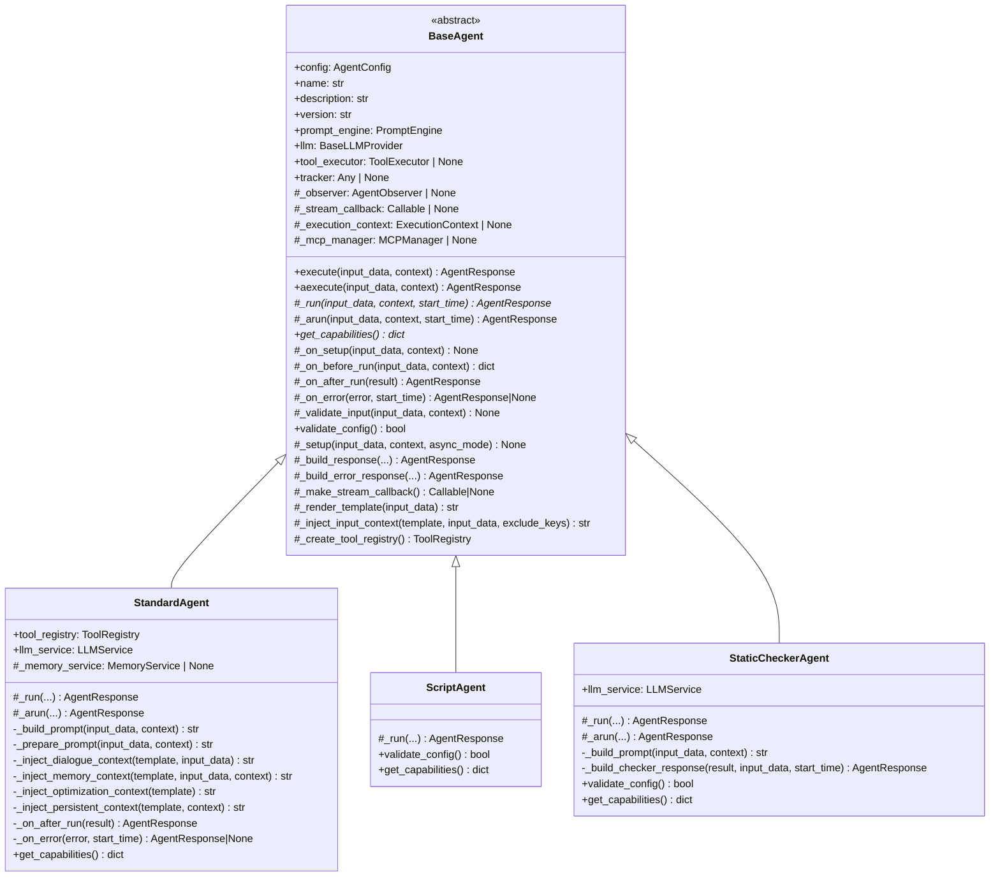

### Interface Contract

Every class that inherits from `BaseAgent` must implement two abstract methods:

| Method | Signature | Contract |
|---|---|---|
| `_run()` | `(input_data, context, start_time) -> AgentResponse` | Core synchronous execution logic. Must return a fully populated AgentResponse. |
| `get_capabilities()` | `() -> dict[str, Any]` | Returns a capabilities dictionary describing agent type, tools, LLM details, streaming support. |

Subclasses may also override these hook methods:

| Hook | Default Behavior | Purpose |
|---|---|---|
| `_on_setup()` | No-op | Called after `_setup()`, before `_run()`. Subclasses add custom setup. |
| `_on_before_run()` | Return input_data unchanged | Can modify input_data before `_run()`. Must return input_data. |
| `_on_after_run()` | Return result unchanged | Can modify result after `_run()`. Must return result. |
| `_on_error()` | Return None | Return an AgentResponse to override default error handling. |
| `_arun()` | Wraps `_run()` in `asyncio.to_thread` | Override for native async implementations. |

### Template Method Pattern — execute() Flow

The `execute()` method implements the invariant algorithm:

```python
def execute(self, input_data, context):
    self._validate_input(input_data, context)   # Guard: type checking
    self._setup(input_data, context)             # Infrastructure wiring
    self._on_setup(input_data, context)          # Subclass hook
    start_time = time.time()
    try:
        input_data = self._on_before_run(input_data, context)  # Pre-run hook
        result = self._run(input_data, context, start_time)    # ABSTRACT
        return self._on_after_run(result)                       # Post-run hook
    except Exception as e:
        custom = self._on_error(e, start_time)  # Error hook
        if custom is not None:
            return custom
        return self._build_error_response(e, start_time)
```

The async mirror `aexecute()` follows identical structure, calling `_arun()` instead.

### _setup() Infrastructure Wiring

`_setup()` is called at the start of every execution and is responsible for connecting all infrastructure components. It extracts several values from `input_data` by convention:

| Key in input_data | Type | Effect |
|---|---|---|
| `tool_executor` | `ToolExecutor` | Set on `self.tool_executor`. If present must be a `ToolExecutor` instance. |
| `tracker` | ObservabilityTracker | Set on `self.tracker`. Used by AgentObserver. |
| `stream_callback` | Callable or StreamCallbackFactory | If has `make_callback()`, calls it with agent name. Otherwise assigns directly. |

After wiring, `_setup()` calls `resolve_tool_config_templates()` on the agent's tool registry to resolve any Jinja2 template variables in tool configs. It also syncs resolved tool configs to the `tool_executor`'s own tool registry via `_sync_tool_configs_to_executor()`.

### Tool Registry Creation

`_create_tool_registry()` is a helper subclasses call in `__init__` if they need tools. It respects three modes based on `config.agent.tools`:

| Config Value | Behavior |
|---|---|
| `None` (absent) | Calls `registry.auto_discover()` — discovers all tools in `temper_ai/tools/` |
| `[]` (empty list) | No tools loaded |
| `[tool_name, ...]` | Only named tools loaded via `load_tools_from_config()` |

MCP servers configured in `config.agent.mcp_servers` are registered after tool loading via `_register_mcp_tools()`.

### Stream Callback Architecture

`_make_stream_callback()` creates a combined callback that fans out to both the user-facing display callback and the observability layer. It is careful to never raise exceptions from either callback path — all errors are silently swallowed to prevent disrupting actual agent execution.

---

## 4. StandardAgent — The Core Implementation

**Location:** `/home/shinelay/meta-autonomous-framework/temper_ai/agent/standard_agent.py`

### Purpose

`StandardAgent` is the primary agent implementation used in the vast majority of workflows. It runs a multi-turn LLM loop (via `LLMService`) with tool calling, integrates memory retrieval, applies reasoning passes, validates output schema, runs guardrails, and stores execution results back to memory.

### StandardAgent Execution Pipeline (Full Sequence Diagram)

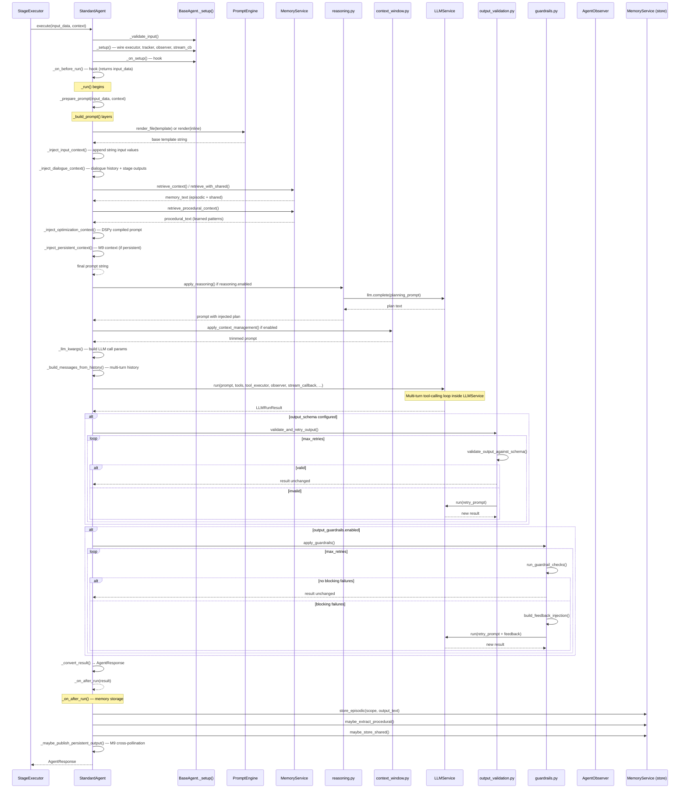

### Prompt Building Layers

`_build_prompt()` assembles the final prompt through six sequential injection layers, each appending to the template string:

| Layer | Method | Trigger | What it adds |
|---|---|---|---|
| 1. Base template | `_render_template()` | Always | Jinja2 template file or inline prompt, variables resolved |
| 2. Input context | `_inject_input_context()` | Always | String values from `input_data` as labeled sections |
| 3. Dialogue context | `_inject_dialogue_context()` | `dialogue_aware=True` (default) | `dialogue_history` list and `current_stage_agents` dict |
| 4. Memory context | `_inject_memory_context()` | `memory.enabled=True` | Episodic memories + shared namespace + procedural patterns |
| 5. Optimization context | `_inject_optimization_context()` | `prompt_optimization.enabled=True` | DSPy compiled demonstrations via `DSPyPromptAdapter` |
| 6. Persistent context | `_inject_persistent_context()` | `persistent=True` (M9) | Execution mode, active goals, cross-pollination insights |

### LLM Call Parameters (_llm_kwargs)

Every `LLMService.run()` / `LLMService.arun()` call receives these parameters:

```python
kwargs = {
    "prompt": prompt,
    "tools": list(self.tool_registry.get_all_tools().values()) or None,
    "tool_executor": self.tool_executor,
    "observer": self._observer,
    "stream_callback": self._make_stream_callback(),
    "safety_config": self.config.agent.safety,
    "agent_name": self.name,
    "max_iterations": self.config.agent.safety.max_tool_calls_per_execution,
    "max_execution_time": self.config.agent.safety.max_execution_time_seconds,
    "start_time": start_time,
}
```

### Multi-Turn Conversation History

`_build_messages_from_history()` detects if `_conversation_history` is present in `input_data`. If present, it converts the history to a message list (from the `ConversationHistory` object) and appends the current prompt as the final user message, enabling multi-turn mode. If absent, `LLMService` operates in single-turn mode.

### Memory Integration

StandardAgent integrates with `MemoryService` across three phases of execution:

**Retrieval (before LLM call — `_inject_memory_context()`):**
- Builds a `MemoryScope` from config: `tenant_id`, `workflow_name`, `agent_name`, `namespace`
- For persistent agents (M9): overrides namespace to `persistent__<agent_name>`
- Extracts a query string from all string values in `input_data` (truncated to 500 chars)
- Retrieves episodic memories (semantic search with `retrieval_k`, `relevance_threshold`, `decay_factor`)
- If `shared_namespace` configured, also retrieves from shared namespace
- Retrieves procedural memories (learned best practices)

**Storage (after execution — `_on_after_run()`):**
- Stores output as episodic memory
- If `auto_extract_procedural=True`: calls LLM to extract procedural patterns from output
- If `shared_namespace` configured: also stores in shared namespace

**Error handling:** All memory operations are wrapped in `try/except` to never fail agent execution.

### Error Handling in _on_error()

`StandardAgent._on_error()` intercepts specific exception types and builds appropriate responses:

| Exception Type | Handling |
|---|---|
| `MaxIterationsError` | Preserves accumulated output, reasoning, tool calls, tokens, cost in response. Sets `metadata["iterations"]`. |
| `LLMError`, `ToolExecutionError`, `PromptRenderError`, `ConfigValidationError`, `RuntimeError`, `ValueError`, `TimeoutError` | Calls `_build_error_response()` with sanitized message. |
| All others | Returns `None` — delegates to `BaseAgent`'s default error handler. |

### Capabilities Report

`get_capabilities()` returns:

```python
{
    "name": self.name,
    "description": self.description,
    "version": self.version,
    "type": "standard",
    "llm_provider": "anthropic" | "openai" | ...,
    "llm_model": "claude-sonnet-4-6" | ...,
    "tools": ["bash", "file_writer", ...],
    "max_tool_calls": 10,
    "supports_streaming": True,
    "supports_multimodal": False,
}
```

---

## 5. ScriptAgent — Zero-LLM Execution

**Location:** `/home/shinelay/meta-autonomous-framework/temper_ai/agent/script_agent.py`

### Purpose

`ScriptAgent` executes a Jinja2-rendered bash script directly via `subprocess.run()` — completely bypassing LLM inference. It is used for deterministic operations like git setup, environment validation, or any task whose logic is fully expressible as a shell script.

### Class Hierarchy Note

ScriptAgent deliberately skips `BaseAgent.__init__()` entirely (it does not call `super().__init__()`). This is because `BaseAgent.__init__()` requires inference config and creates an LLM instance — neither of which ScriptAgent needs. Instead it manually sets the same infrastructure attributes (`name`, `config`, `tool_executor`, `tracker`, `_observer`, `_stream_callback`, `_execution_context`).

### Execution Flow

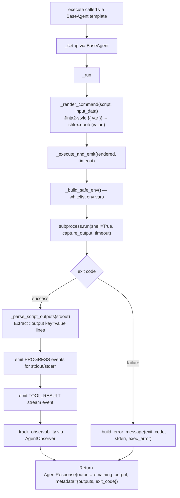

### Structured Output Protocol

Scripts can emit structured key-value pairs alongside their stdout using the `::output` directive:

```bash
echo "Processing completed"
::output files_changed=42
::output status=success
::output branch_name=feature/my-feature
```

These are parsed by `_parse_script_outputs()` using the regex `^::output\s+(\w+)=(.*)$`. Lines matching this pattern are extracted into `metadata["outputs"]` dict; remaining lines form the `output` field.

### Security Model

ScriptAgent uses `shell=True` (required for multi-line bash scripts with pipelines, conditionals, etc.) with three mitigations:

1. **Restricted environment (`_build_safe_env()`):** Only whitelisted env vars are passed to the subprocess: `PATH`, `HOME`, `USER`, `LANG`, `LC_ALL`, `LC_CTYPE`, `VIRTUAL_ENV`, `PYTHONPATH`, `PYTHONDONTWRITEBYTECODE`, `TERM`, `SHELL`, `TMPDIR`, `TMP`, `TEMP`.
2. **Timeout enforcement:** Configurable via `config.agent.timeout_seconds`, defaults to 120 seconds.
3. **Variable shell-escaping:** Template variable substitution uses `shlex.quote()` to prevent command injection.

The script body itself comes from trusted YAML config, not user input.

### Stream Events

ScriptAgent emits three stream event types during execution:

| Event | When |
|---|---|
| `TOOL_START` | Before script execution begins |
| `PROGRESS` | After execution — stdout content, then stderr content (if any) |
| `TOOL_RESULT` | After execution — includes `success`, `duration_s`, `error` |

### Error Handling

OSError and TimeoutError from `subprocess.run()` are caught inside `_execute_script()` and converted to result dicts (exit_code=-1). They do not propagate to `_on_error()`. The `_on_error()` hook only catches errors raised in `_run()` itself (e.g., ValueError from missing script config).

---

## 6. StaticCheckerAgent — Pre-Command Synthesis

**Location:** `/home/shinelay/meta-autonomous-framework/temper_ai/agent/static_checker_agent.py`

### Purpose

`StaticCheckerAgent` runs deterministic shell commands (`pre_commands`) defined in YAML config, then passes their results to a single LLM call to synthesize a structured verdict. Unlike StandardAgent, there is no multi-turn tool-calling loop — the LLM has exactly one opportunity to interpret the pre-command output.

The primary use case is quality gate agents: run linters, type checkers, test suites, security scanners via `pre_commands`, then ask the LLM to analyze and produce a pass/fail verdict.

### Execution Flow

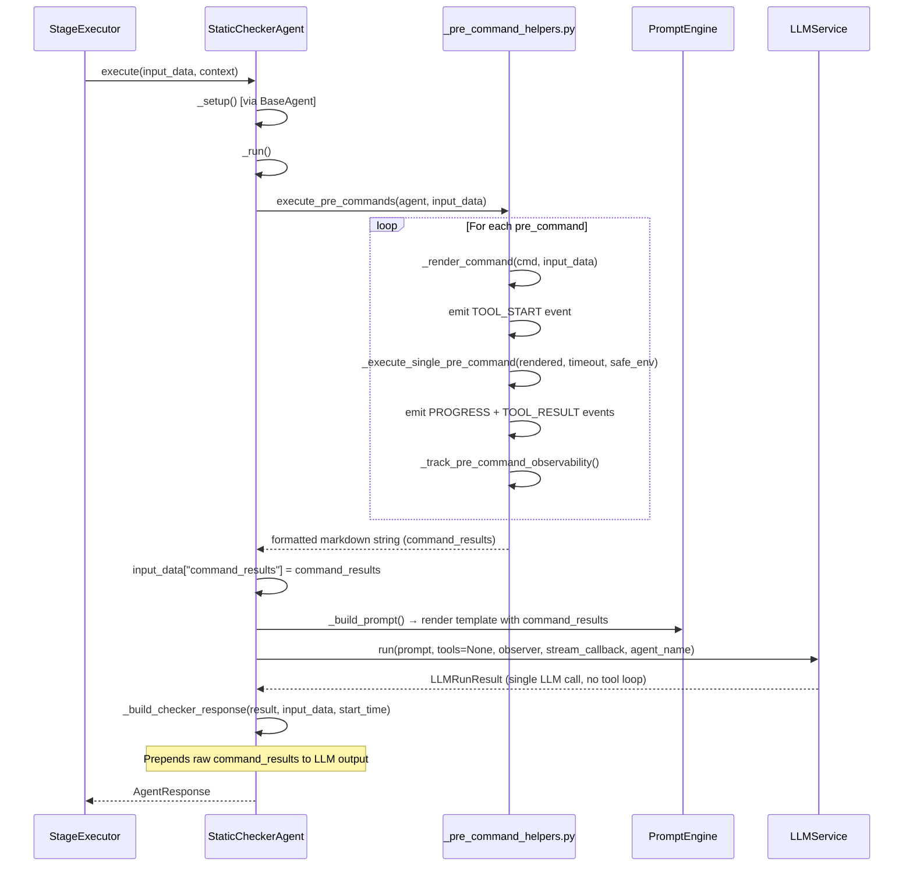

### Configuration Requirements

StaticCheckerAgent requires `pre_commands` to be configured (raises `ValueError` otherwise). It validates this in `validate_config()` after calling `super().validate_config()`.

YAML config example:
```yaml
agent:
  type: static_checker
  pre_commands:
    - name: run_tests
      command: "python -m pytest tests/ -x --tb=short"
      timeout_seconds: 300
    - name: type_check
      command: "mypy src/ --ignore-missing-imports"
      timeout_seconds: 60
  prompt:
    inline: |
      Analyze these test results and type check output.
      Provide a PASS or FAIL verdict with detailed reasoning.
      {{ command_results }}
```

### Prompt Building (Simplified)

`StaticCheckerAgent._build_prompt()` is deliberately simpler than `StandardAgent._build_prompt()`. It only performs:
1. `_render_template()` — renders the Jinja2 template (with `command_results` available as variable)
2. `_inject_input_context()` — appends other string inputs (excluding `command_results` which is already in the template)

No dialogue injection, no memory injection, no optimization context, no persistent context.

### Response Construction

`_build_checker_response()` prepends the raw command results text to the LLM's analytical output, separated by `---`. This ensures downstream agents always have access to both the raw tool output and the LLM's interpretation in a single response.

### Async Support

`_arun()` runs `execute_pre_commands()` in a thread via `asyncio.to_thread()` (since subprocess calls are synchronous), then makes an async LLM call via `LLMService.arun()`.

---

## 7. AgentFactory — Configuration-Driven Creation

**Location:** `/home/shinelay/meta-autonomous-framework/temper_ai/agent/utils/agent_factory.py`

### Purpose

`AgentFactory` maps agent type strings (from YAML config) to concrete implementation classes. It is the sole entry point for agent instantiation and provides thread-safe registration for custom and plugin agent types.

### Class Diagram

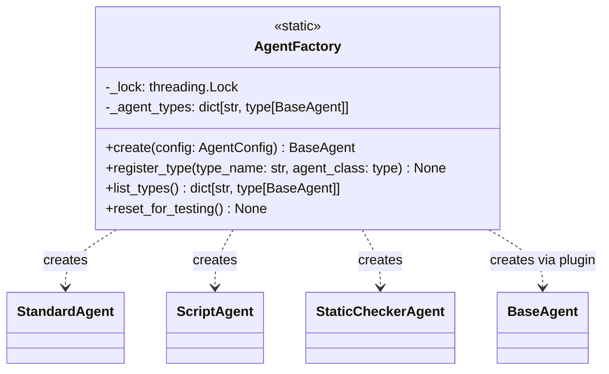

### AgentFactory.create() Flowchart

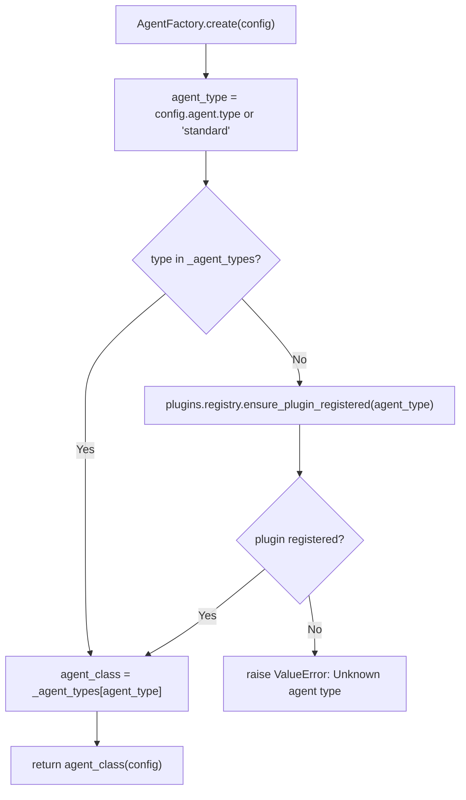

### Built-in Type Registry

| Type String | Class | Description |
|---|---|---|
| `"standard"` (default) | `StandardAgent` | LLM + tool calling loop |
| `"script"` | `ScriptAgent` | Zero-LLM bash script |
| `"static_checker"` | `StaticCheckerAgent` | Pre-commands + LLM synthesis |
| `"crewai"` | Plugin adapter | CrewAI agent ingestion (R6) |
| `"langgraph"` | Plugin adapter | LangGraph agent ingestion (R6) |
| `"openai_agents"` | Plugin adapter | OpenAI Agents SDK ingestion (R6) |
| `"autogen"` | Plugin adapter | AutoGen agent ingestion (R6) |

Plugin types are registered dynamically via `AgentFactory.register_type()` when the plugin system loads external agent frameworks.

### Thread Safety

A class-level `threading.Lock` (`_lock`) protects all reads and writes to `_agent_types`. The lock is held during both `create()` type lookup and `register_type()` insertion. Instantiation itself (`agent_class(config)`) happens outside the lock to avoid holding it during potentially slow `__init__` operations.

### Custom Type Registration

```python
class MyCustomAgent(BaseAgent):
    def _run(self, input_data, context, start_time):
        # custom logic
        return self._build_response(...)
    def get_capabilities(self):
        return {"type": "custom", ...}

AgentFactory.register_type("my_custom", MyCustomAgent)
# Now YAML can use: agent.type: my_custom
```

`register_type()` validates that the class is a proper `BaseAgent` subclass before registering.

---

## 8. AgentObserver — Observability Layer

**Location:** `/home/shinelay/meta-autonomous-framework/temper_ai/agent/utils/agent_observer.py`

### Purpose

`AgentObserver` wraps the raw observability tracker to eliminate repetitive guard code scattered across agent implementations. Every tracking call (LLM calls, tool calls, stream chunks) is safe to invoke regardless of whether a tracker or execution context is available.

### Design Pattern

Without `AgentObserver`, every tracking site would require:
```python
if self.tracker is not None and hasattr(self, '_execution_context'):
    if self._execution_context.agent_id:
        try:
            self.tracker.track_llm_call(...)
        except Exception:
            logger.warning(...)
```

With `AgentObserver`, this collapses to:
```python
self._observer.track_llm_call(...)
```

### Class Definition

```python
class AgentObserver:
    def __init__(self, tracker: Any, execution_context: Any)

    @property
    def active(self) -> bool:
        # True when tracker and agent_id both present

    def track_llm_call(self, **kwargs) -> None:
        # Creates LLMCallTrackingData, calls tracker.track_llm_call(data)
        # No-op if not active

    def track_tool_call(self, **kwargs) -> None:
        # Creates ToolCallTrackingData, calls tracker.track_tool_call(data)
        # No-op if not active

    def emit_stream_chunk(self, content, chunk_type, done, model, ...) -> None:
        # Emits to tracker's event bus
        # Best-effort: never raises
```

### Tracked Data

**LLM Call Tracking (`track_llm_call`):**
- Delegates to `LLMCallTrackingData` dataclass which includes: `agent_id`, provider, model, prompt tokens, completion tokens, cost, latency, error

**Tool Call Tracking (`track_tool_call`):**
- Delegates to `ToolCallTrackingData` which includes: `agent_id`, tool name, input params, output data, duration seconds, status, error message

**Stream Chunk Events (`emit_stream_chunk`):**
- Creates `StreamChunkData` with: `agent_id`, `workflow_id`, `stage_id`, content, chunk type, done flag, model, token counts
- Emitted to the tracker's `_event_bus` for real-time streaming in the dashboard

### Active Check

`observer.active` returns `True` only when both conditions hold:
1. A tracker instance is present (`self._tracker is not None`)
2. An agent_id is available from the execution context (`self._agent_id is not None`)

This design means `AgentObserver` gracefully degrades: if a workflow runs without observability configured, all tracking calls silently no-op.

---

## 9. Pre-Command Execution System

**Location:** `/home/shinelay/meta-autonomous-framework/temper_ai/agent/utils/_pre_command_helpers.py`

### Purpose

Pre-commands are deterministic shell commands that run before any LLM call. They are used by `StaticCheckerAgent` (required) and can optionally be used in any agent type to gather environmental data. Results are injected into the prompt as structured markdown.

### Execution Pipeline

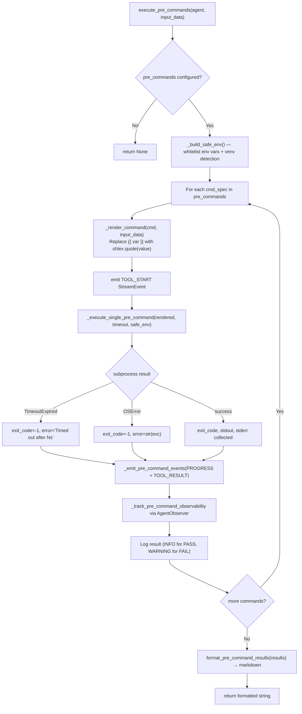

### Template Variable Substitution

The `_render_command()` function processes `{{ var }}` placeholders in commands:
- Only known variables from `input_data` are substituted
- All values are shell-escaped with `shlex.quote()` to prevent injection
- Unknown placeholders remain as-is (will cause a shell error, which is the intended fail-loud behavior)

```python
# Command in YAML: "git diff {{ base_branch }}..HEAD"
# With input_data["base_branch"] = "main; rm -rf /"
# Result: "git diff 'main; rm -rf /'..HEAD"  ← safely quoted
```

### Virtual Environment Detection

`_detect_project_venv()` checks three sources in order:
1. `VIRTUAL_ENV` environment variable
2. `sys.prefix != sys.base_prefix` (running inside a venv)
3. `<project_root>/venv/` directory with `bin/python3`

When a venv is found, its `bin/` directory is prepended to `PATH` in the subprocess environment. This ensures `python3`, `pytest`, `mypy`, etc. resolve to the correct venv binaries even when the entry-point binary uses a system Python shebang.

### Formatted Output

`format_pre_command_results()` renders results as structured markdown:

```markdown
# Pre-Command Results

## run_tests — PASS (exit 0)
```
............................
5 passed in 1.23s
```

## type_check — FAIL (exit 1)
```
src/foo.py:42: error: Argument 1...
```
**stderr:**
```
Found 1 error in 1 file
```
```

This markdown is injected into the LLM prompt so the model can analyze the complete command output.

### Output Truncation

Pre-command stdout/stderr is truncated to `PRE_COMMAND_MAX_OUTPUT_CHARS` (2000 characters) with a `... [truncated at N chars]` notice. This prevents very long test output from blowing out the LLM context.

---

## 10. Reasoning Engine

**Location:** `/home/shinelay/meta-autonomous-framework/temper_ai/agent/reasoning.py`

### Purpose

The reasoning module implements a "planning pass" (R0.7) — an additional LLM call made before the main agent execution to generate a step-by-step plan that is then injected into the main prompt. This is a lightweight form of chain-of-thought prompting.

### How It Works

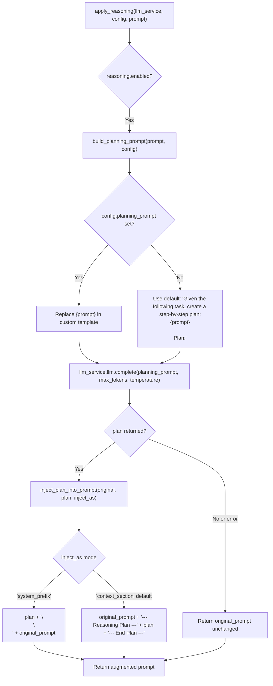

### Configuration

The reasoning pass is configured per-agent in `config.agent.reasoning`:

| Field | Type | Default | Description |
|---|---|---|---|
| `enabled` | bool | False | Whether to run the planning pass |
| `planning_prompt` | str | None | Custom planning prompt template (use `{prompt}`) |
| `max_planning_tokens` | int | None | Max tokens for the planning LLM call |
| `temperature` | float | 0.7 | Temperature for planning pass |
| `inject_as` | str | `"context_section"` | Where to inject the plan: `"context_section"` or `"system_prefix"` |

### Implementation Notes

- The planning pass uses the same LLM instance as the main agent (`llm_service.llm.complete()`)
- Errors in the planning pass are caught and logged as warnings — the main execution continues with the original unaugmented prompt
- The planning pass does not use tools or multi-turn conversation — it is a single synchronous complete() call

### Relationship to Chain-of-Thought

This is a "pre-turn" reasoning implementation: the plan is injected into the prompt as text, and the main LLM call then responds with the plan visible. This is distinct from scratchpad reasoning (where the LLM reasons within its own response) — here the reasoning is made explicit and visible before the main inference.

---

## 11. Output Guardrails

**Location:** `/home/shinelay/meta-autonomous-framework/temper_ai/agent/guardrails.py`
**Pipeline:** `/home/shinelay/meta-autonomous-framework/temper_ai/agent/_r0_pipeline_helpers.py`

### Purpose

Output guardrails (R0.2) validate agent output against configurable checks and retry with feedback if validation fails. They provide a post-inference correction loop without requiring prompt changes from the user.

### Guardrail Validation Pipeline

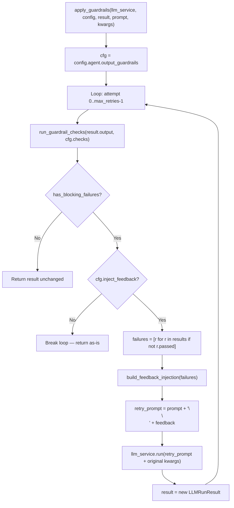

### Check Types

**Regex Check (`type: "regex"`):**
- Runs `re.search(check.pattern, output_text)`
- Passes if the pattern IS found in the output
- Use case: verify output contains required elements like JSON structure, specific keywords, or format markers

**Function Check (`type: "function"`):**
- Imports and calls a function at `check.check_ref` (e.g., `mypackage.validators.check_safety`)
- Function receives `output_text: str`
- Returns either `bool` (passed) or `tuple[bool, str]` (passed, message)
- Allows arbitrary custom validation logic

### GuardrailResult Structure

```python
@dataclass
class GuardrailResult:
    passed: bool        # Did this check pass?
    check_name: str     # Name of the check
    severity: str       # "block" triggers retry; other values are informational
    message: str        # Failure explanation
```

### Severity Model

Only checks with `severity: "block"` trigger the retry loop. Informational severity checks (any other string) are collected and available in the result but do not cause retries. This allows soft warnings alongside hard requirements.

### Feedback Injection Format

When retrying, the following feedback section is appended to the prompt:

```
Your previous output failed the following guardrail checks:
- [BLOCK] json_format: Pattern '^\{.*\}$' not found
- [BLOCK] max_length: Output exceeds 1000 characters

Please revise your response to address the above issues.
```

### YAML Configuration Example

```yaml
agent:
  output_guardrails:
    enabled: true
    max_retries: 3
    inject_feedback: true
    checks:
      - name: json_format
        type: regex
        pattern: '^\{.*\}$'
        severity: block
      - name: safety_check
        type: function
        check_ref: myapp.validators.check_safe_content
        severity: block
      - name: has_reasoning
        type: regex
        pattern: 'reasoning|rationale|because'
        severity: warn
```

### Schema Validation Pipeline

Separate from guardrails, the output schema validation pipeline (R0.1) validates the LLM output against a JSON Schema:

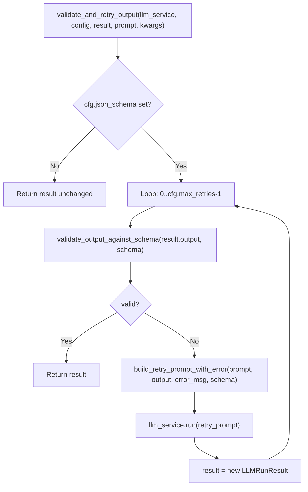

---

## 12. M9 Persistent Agent Context Injection

**Location:** `/home/shinelay/meta-autonomous-framework/temper_ai/agent/_m9_context_helpers.py`

### Purpose

The M9 milestone introduced "persistent agents" — agents with a fixed identity, persistent memory, and awareness of project-level goals and cross-agent knowledge. `_m9_context_helpers.py` provides the free functions that inject this context into the prompt.

### Persistent Agent Detection

An agent is considered persistent when `config.agent.persistent = True` in its YAML. Persistent agents get:
- A fixed memory namespace: `persistent__<agent_name>` (prefix from `PERSISTENT_NAMESPACE_PREFIX` constant)
- Execution mode context (desk vs. project)
- Active goal injection
- Cross-pollination context from subscribed agents

### Context Injection Flow

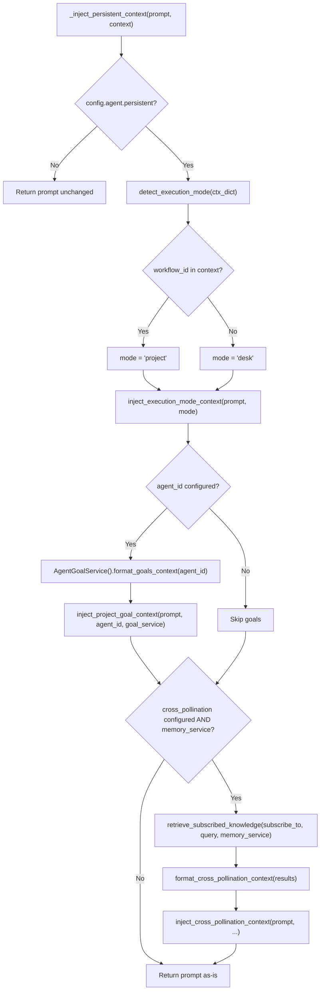

### Execution Mode Sections

**Desk mode** (no workflow_id — direct chat session via `POST /api/chat/sessions` + `POST /api/chat/sessions/{id}/message`):
```
## Execution Mode
You are in direct conversation mode. Draw on your persistent memory and past experiences.
```

**Project mode** (running inside a workflow):
```
## Execution Mode
You are executing as part of a workflow pipeline. Focus on your assigned stage objectives.
```

### Active Goals Injection

When an `agent_id` is configured, `AgentGoalService.format_goals_context()` retrieves active goals for this specific agent from the goals system and formats them. The section is injected only if there are goals (max 1000 characters):

```
## Active Goals
1. Ensure all Python files maintain <100ms test execution per file
2. Track and reduce false positive rate in security scanner
```

### Cross-Pollination Context Injection

Cross-pollination allows persistent agents to subscribe to knowledge produced by other agents. Configuration:

```yaml
agent:
  persistent: true
  cross_pollination:
    enabled: true
    subscribe_to:
      - researcher_agent
      - analyst_agent
    publish_output: true
    retrieval_k: 5
    relevance_threshold: 0.7
```

When enabled, `retrieve_subscribed_knowledge()` queries the memory service for knowledge published by subscribed agents. Results are formatted and injected (max 2000 characters):

```
## Insights from Other Agents
[researcher_agent] Based on the research conducted:
The main bottleneck appears to be database query latency...

[analyst_agent] Statistical analysis of performance data:
P99 latency exceeds 500ms in 12% of test runs...
```

### Post-Execution Publishing

After each execution, if `publish_output=True`, `_maybe_publish_persistent_output()` publishes the agent's output to the cross-pollination namespace via `publish_knowledge()`, making it available to other agents subscribed to this agent.

### Workflow Learning Sync

The separate `sync_workflow_learnings_to_agent()` function is called by the autonomy orchestrator after workflow completion, publishing a "workflow completed" entry to the persistent agent's namespace.

---

## 13. Collaboration Strategies

**Location:** `/home/shinelay/meta-autonomous-framework/temper_ai/agent/strategies/`

### Overview

When a stage contains multiple agents running in parallel, their outputs are synthesized into a single result by a collaboration strategy. The strategy is selected from YAML config and instantiated via the `StrategyRegistry`.

### Strategy Class Hierarchy

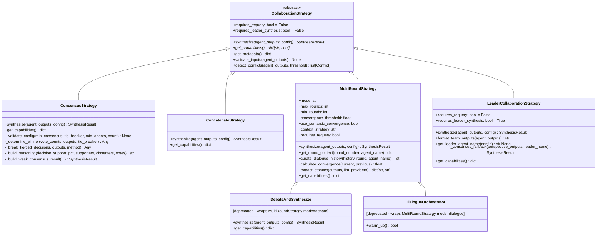

### Strategy Selection Flowchart

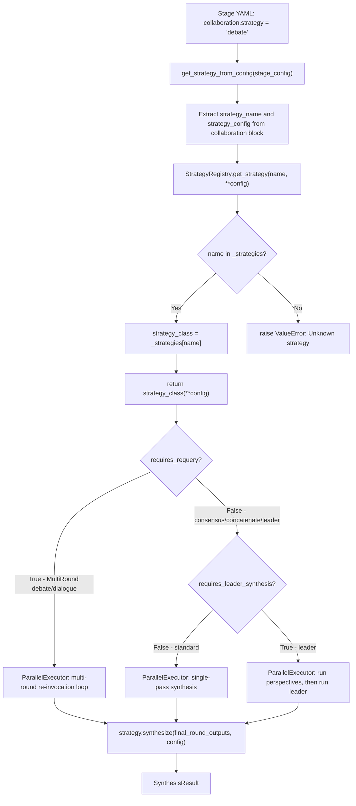

---

### 13.1 ConsensusStrategy

**File:** `temper_ai/agent/strategies/consensus.py`
**Registry Names:** `"consensus"`

Simple majority voting — the most fundamental collaboration pattern.

**Algorithm:**
1. Count votes using `calculate_vote_distribution()` (preserves original decision types)
2. Determine winner via `_determine_winner()`:
   - Finds decision with most votes
   - If tie: applies tie-breaker (`"confidence"` = highest avg confidence, `"first"` = first in vote order)
3. Calculate `decision_support = votes[winner] / total_votes`
4. If `decision_support < min_consensus` (default 0.51): return "weak consensus" result with 30% confidence penalty
5. Calculate final confidence: `consensus_strength * avg_supporter_confidence`
6. Detect conflicts, build reasoning string

**Configuration:**
```yaml
collaboration:
  strategy: consensus
  config:
    min_agents: 2        # Minimum agents required
    min_consensus: 0.67  # Two-thirds majority required
    tie_breaker: confidence  # or "first"
```

**Capabilities:** `deterministic=True`, `supports_debate=False`, `requires_conflict_resolver=True` (for weak consensus cases)

**Confidence Calculation:**
```
confidence = (supporters / total_agents) * avg(supporter.confidence)

Example: 2/3 agents vote "yes" with confidences [0.9, 0.8]
confidence = (2/3) * ((0.9 + 0.8) / 2) = 0.667 * 0.85 = 0.567
```

---

### 13.2 ConcatenateStrategy

**File:** `temper_ai/agent/strategies/concatenate.py`
**Registry Names:** `"concatenate"`

Joins all agent outputs into one combined string. Designed for parallel stages where agents do completely independent, non-overlapping work (e.g., three coders each writing different files).

**Algorithm:**
1. For each agent output: extract useful text (`decision` > `reasoning` > empty notice)
2. Format as `[agent_name]\n{text}`
3. Join with `\n\n---\n\n` separator
4. Confidence = average of all agent confidences
5. No conflict detection — conflicts are irrelevant for independent workers
6. `votes` field repurposed to store `{agent_name: text_length}` (contribution tracking)

**When to use:** When agents partition work by file, domain, or responsibility and results should all be preserved (not voted on).

**Capabilities:** `supports_debate=False`, `supports_convergence=False`, `supports_partial_participation=True`

---

### 13.3 MultiRoundStrategy

**File:** `temper_ai/agent/strategies/multi_round.py`
**Registry Names:** `"multi_round"`, also powers `"debate"` and `"dialogue"` shims

The central multi-round strategy that unifies debate and dialogue into one configurable class. When `requires_requery=True`, the stage executor re-invokes all agents multiple times, passing accumulated context from prior rounds.

**Modes:**

| Mode | Interaction Style | Default convergence_threshold | Default max_rounds |
|---|---|---|---|
| `"dialogue"` | Collaborative, build on insights | 0.85 | 3 |
| `"debate"` | Adversarial, challenge positions | 0.80 | 3 |
| `"consensus"` | Single-round vote (no re-invocation) | 1.0 | 1 |

**Requires Requery:** True for `"dialogue"` and `"debate"` modes; False for `"consensus"`.

**Round Context Injection:**

`get_round_context(round_number, agent_name)` returns a dict injected into each agent's `input_data` before each round. Keys:
- `interaction_mode` — the mode string
- `round_number` — 0-based round index
- `mode_instruction` — mode-specific framing text
- `debate_framing` — round-specific instructions (initial position vs rebuttal)

Example for debate round 0:
```python
{
    "interaction_mode": "debate",
    "round_number": 0,
    "mode_instruction": "You are in a structured DEBATE. Challenge other agents' positions...",
    "debate_framing": "State your initial position clearly with supporting arguments.",
}
```

**Convergence Detection:**

After each round (starting from `min_rounds`), convergence is calculated between current and previous round outputs. If `convergence_score >= convergence_threshold`, the multi-round loop stops early.

Two convergence methods:
1. **Semantic similarity** (default, requires `sentence-transformers`): Encodes decisions as embeddings and calculates cosine similarity. Passes if similarity >= `PROB_VERY_HIGH_PLUS`.
2. **Exact match** (fallback): Simple string equality check between rounds.

**Stance Extraction (Debate Mode):**

`extract_stances()` determines each agent's position: `AGREE`, `DISAGREE`, or `PARTIAL`. Two-pass approach:
1. Regex fast-path: looks for `[STANCE: AGREE]` or `STANCE: DISAGREE` patterns
2. LLM fallback: makes a short LLM classification call comparing this agent's output to others' outputs (max 10 tokens, temperature 0.0)

**Dialogue History Curation:**

Three strategies for passing prior round context to agents:
- `"full"` (default): pass complete history
- `"recent"`: sliding window of last N rounds
- `"relevant"`: entries where this agent participated or was mentioned, plus most recent round

**Final Synthesis:**

After all rounds, `synthesize()` is called with the final round's outputs:
- If `use_merit_weighting=True`: uses `merit_weighted_synthesis()` (queries `AgentMeritScore` from DB)
- Otherwise: delegates to `ConsensusStrategy` on the final-round outputs

**Configuration:**
```yaml
collaboration:
  strategy: multi_round
  config:
    mode: debate           # "dialogue" | "debate" | "consensus"
    max_rounds: 5
    min_rounds: 2
    convergence_threshold: 0.80
    use_semantic_convergence: true
    context_strategy: full # "full" | "recent" | "relevant"
    context_window_size: 2
    use_merit_weighting: false
    require_unanimous: false
    cost_budget_usd: 1.00  # Optional cost cap
```

---

### 13.4 DebateAndSynthesize (Deprecated)

**File:** `temper_ai/agent/strategies/debate.py`
**Registry Names:** `"debate"`, `"debate_and_synthesize"`, `"llm_debate_and_synthesize"`

A thin deprecated wrapper around `MultiRoundStrategy(mode="debate")`. Emits `DeprecationWarning` on instantiation. Overrides `synthesize()` only to rename the result method to `"debate_and_synthesize"` for backward compatibility. Adds legacy capability keys (`deterministic=False`, `requires_conflict_resolver=True`).

**Migration path:** Replace `strategy: debate` with `strategy: multi_round` and add `config.mode: debate` in YAML.

---

### 13.5 DialogueOrchestrator (Deprecated)

**File:** `temper_ai/agent/strategies/dialogue.py`
**Registry Names:** `"dialogue"`

A thin deprecated wrapper around `MultiRoundStrategy(mode="dialogue")`. Accepts the original `DialogueOrchestrator` constructor parameters and translates them to `MultiRoundConfig`. Emits `DeprecationWarning` on instantiation.

Also exposes the class-level `warm_up()` method that preloads the `paraphrase-MiniLM-L6-v2` SentenceTransformer model into memory before use, avoiding the first-call latency.

**Re-exported aliases:** `DialogueRound = CommunicationRound`, `DialogueHistory = CommunicationHistory`

---

### 13.6 LeaderCollaborationStrategy

**File:** `temper_ai/agent/strategies/leader.py`
**Registry Names:** `"leader"`

Implements "perspectives + decision-maker" in a single stage. Non-leader agents run in parallel as "perspectives"; the leader agent then runs with all perspective outputs injected, making the final decision.

**Properties:**
- `requires_requery = False` — no re-invocation; runs in two internal passes
- `requires_leader_synthesis = True` — the stage executor handles leader separately

**Algorithm:**
1. Separate agent outputs into `leader_output` (if agent_name matches `leader_agent` config) and `perspective_outputs`
2. If leader output found: return `SynthesisResult` with leader's decision and `method="hierarchical"`
3. If leader not found and `fallback_to_consensus=True`: run consensus on perspective outputs

**Team Output Formatting:**

`format_team_outputs()` creates structured text injected into the leader's prompt via `{{ team_outputs }}`:

```
## researcher_agent (confidence: 85%)
Based on analysis of the codebase, I recommend...

Reasoning: The existing patterns show...
----------------------------------------
## analyst_agent (confidence: 72%)
My assessment focuses on performance implications...

Reasoning: Benchmarks indicate...
```

**Configuration:**
```yaml
collaboration:
  strategy: leader
  config:
    leader_agent: vcs_triage_decider   # Required
    fallback_to_consensus: true        # Default: true
```

---

### Multi-Round Debate Sequence Diagram

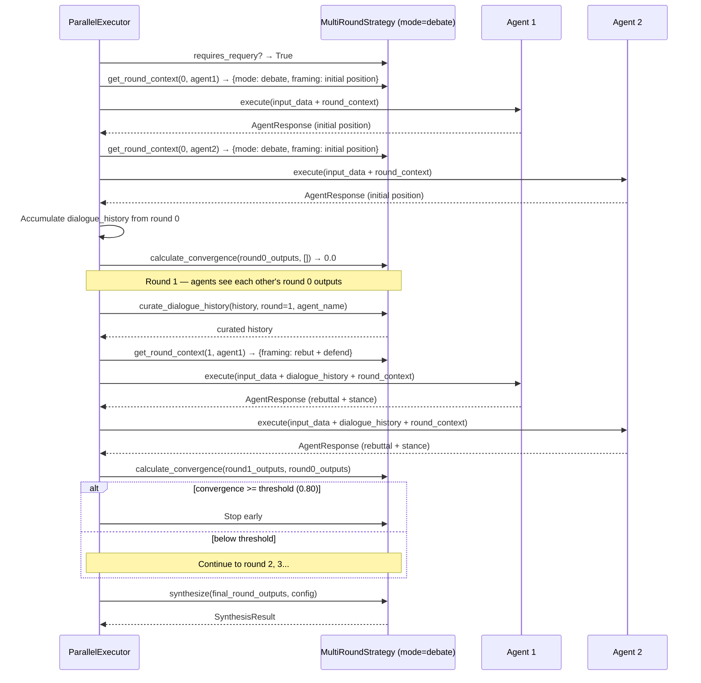

---

## 14. Conflict Resolution Strategies

**Location:** `/home/shinelay/meta-autonomous-framework/temper_ai/agent/strategies/conflict_resolution.py`
**Location:** `/home/shinelay/meta-autonomous-framework/temper_ai/agent/strategies/merit_weighted.py`

### Purpose

Conflict resolution strategies are invoked when collaboration strategies detect disagreement between agents. They are separate from collaboration strategies — `CollaborationStrategy` detects and reports conflicts via `detect_conflicts()`, while `ConflictResolutionStrategy` resolves them.

### ConflictResolutionStrategy ABC

```python
class ConflictResolutionStrategy(ABC):
    @abstractmethod
    def resolve(conflict, agent_outputs, config) -> ResolutionResult: ...
    @abstractmethod
    def get_capabilities() -> dict[str, bool]: ...
    def validate_inputs(conflict, agent_outputs) -> None: ...  # validates conflict agents exist in outputs
    def get_metadata() -> dict: ...
```

### Resolution Methods Enum

```python
class ResolutionMethod(Enum):
    HIGHEST_CONFIDENCE = "highest_confidence"
    MERIT_WEIGHTED = "merit_weighted"
    RANDOM_TIEBREAKER = "random_tiebreaker"
    ESCALATION = "escalation"
    NEGOTIATION = "negotiation"
    FALLBACK = "fallback"
    MAJORITY_PLUS_CONFIDENCE = "majority_plus_confidence"
```

### Built-in Resolvers

| Class | Registry Name | Algorithm | Deterministic |
|---|---|---|---|
| `HighestConfidenceResolver` | `"highest_confidence"` | Pick agent with max confidence | Yes |
| `RandomTiebreakerResolver` | `"random_tiebreaker"` | Random selection (optional seed) | If seed set |
| `MeritWeightedResolver` (in conflict_resolution.py) | `"merit_weighted"` (simple) | Uses `metadata["merit"]` or confidence proxy | Yes |
| `MeritWeightedResolver` (in merit_weighted.py) | `"merit_weighted"` (full) | 3-component merit: domain(40%) + overall(30%) + recent(30%) | Yes |
| `HumanEscalationResolver` | `"human_escalation"` | Always raises RuntimeError | N/A |

### HighestConfidenceResolver

The simplest resolver: filter to agents involved in the conflict, return the decision from the agent with the highest confidence score.

```python
winner = max(conflicting_outputs, key=lambda o: o.confidence)
return ResolutionResult(decision=winner.decision, confidence=winner.confidence, ...)
```

### RandomTiebreakerResolver

Uses `random.Random(seed)` for reproducible randomness when a seed is provided. Returns average confidence of all conflicting agents as the resolution confidence.

### MeritWeightedResolver (Full — merit_weighted.py)

Three-component merit weighting:

```
merit_weight = (domain_merit * 0.4) + (overall_merit * 0.3) + (recent_performance * 0.3)
vote_weight = merit_weight * agent.confidence
```

Decisions accumulate weighted votes. The winner is the decision with the highest total weighted vote.

Auto-resolution thresholds:
- `confidence >= 0.85`: `"merit_weighted_auto"` — auto-resolved, no review needed
- `0.50 <= confidence < 0.85`: `"merit_weighted_flagged"` — resolved but flagged for review
- `confidence < 0.50`: `"merit_weighted_escalation"` — low confidence, needs human review

### AgentMerit Data Structure

```python
@dataclass
class AgentMerit:
    agent_name: str
    domain_merit: float      # Success rate in current domain (0-1)
    overall_merit: float     # Global success rate (0-1)
    recent_performance: float # Time-decayed recent success (0-1)
    expertise_level: str     # "novice" | "intermediate" | "expert" | ...

    def calculate_weight(self, weights: dict) -> float:
        return (domain_merit * w["domain_merit"] +
                overall_merit * w["overall_merit"] +
                recent_performance * w["recent_performance"])
```

### HumanEscalationResolver

Always raises `RuntimeError` with a formatted escalation message. Used when no algorithmic resolution is acceptable and human intervention is required. Intended to halt workflow execution so an operator can review and manually resolve.

### create_resolver() Factory

```python
def create_resolver(method: ResolutionMethod, config=None) -> ConflictResolutionStrategy:
    # Maps enum → implementation class
    HIGHEST_CONFIDENCE → HighestConfidenceResolver()
    RANDOM_TIEBREAKER  → RandomTiebreakerResolver(seed=config.get("seed"))
    MERIT_WEIGHTED     → MeritWeightedResolver()
```

---

## 15. Strategy Registry

**Location:** `/home/shinelay/meta-autonomous-framework/temper_ai/agent/strategies/registry.py`

### Purpose

`StrategyRegistry` is a thread-safe singleton that provides centralized registration and retrieval of both collaboration strategies and conflict resolvers. It enables runtime extensibility — plugins and user code can register custom strategies without modifying core code.

### Singleton Architecture

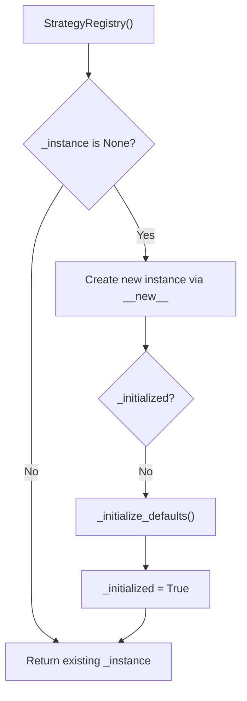

The singleton is implemented with double-check locking using `threading.RLock`. The `RLock` (re-entrant lock) is necessary because `_initialize_defaults()` internally calls `_register_strategy()` and `_register_resolvers()` which also acquire the lock.

### Default Registrations

**Strategies:**

| Names | Module | Class |
|---|---|---|
| `consensus` | `strategies.consensus` | `ConsensusStrategy` |
| `concatenate` | `strategies.concatenate` | `ConcatenateStrategy` |
| `debate`, `debate_and_synthesize`, `llm_debate_and_synthesize` | `strategies.debate` | `DebateAndSynthesize` |
| `dialogue` | `strategies.dialogue` | `DialogueOrchestrator` |
| `multi_round` | `strategies.multi_round` | `MultiRoundStrategy` |
| `leader` | `strategies.leader` | `LeaderCollaborationStrategy` |

**Resolvers:**

| Name | Module | Class |
|---|---|---|
| `merit_weighted` | `strategies.merit_weighted` | `MeritWeightedResolver` |
| `highest_confidence` | `strategies.conflict_resolution` | `HighestConfidenceResolver` |
| `random_tiebreaker` | `strategies.conflict_resolution` | `RandomTiebreakerResolver` |
| `human_escalation` | `strategies.merit_weighted` | `HumanEscalationResolver` |

### Registration Lifecycle

```
StrategyRegistry.register_strategy(name, class)  # Add custom strategy
StrategyRegistry.reset()                         # Remove custom, keep defaults
StrategyRegistry.clear()                         # Remove all
StrategyRegistry.reset_for_testing()             # Destroy singleton + clear all
```

The `_default_strategies` and `_default_resolvers` sets track which registrations are built-in vs. custom. `unregister_strategy()` prevents removing defaults — only `reset()` or `clear()` can do that.

### Config-Based Strategy Resolution

Two convenience functions handle YAML config parsing:

```python
# Flat config: {"collaboration": {"strategy": "debate", "config": {...}}}
# Nested config: {"stage": {"collaboration": {"strategy": "debate", "config": {...}}}}

strategy = get_strategy_from_config(stage_config)
resolver = get_resolver_from_config(stage_config)
```

Default fallbacks: strategy defaults to `"consensus"`, resolver defaults to `"merit_weighted"`.

---

## 16. Data Models and Response Structures

### AgentResponse

**Location:** `/home/shinelay/meta-autonomous-framework/temper_ai/agent/models/response.py`

The primary output of any agent execution:

```python
@dataclass
class AgentResponse:
    output: str                          # Final text output from the agent
    reasoning: str | None                # Extracted reasoning/thought process
    tool_calls: list[ToolCallRecord]     # All tool calls made
    metadata: dict[str, Any]            # Additional execution metadata
    tokens: int                          # Total tokens (prompt + completion)
    estimated_cost_usd: float           # Estimated cost in USD
    latency_seconds: float              # Wall-clock execution time
    error: str | None                   # Error message if failed
    confidence: float | None            # 0.0-1.0, auto-calculated if None
```

**Auto-Calculated Confidence:**

`_calculate_confidence()` runs in `__post_init__` if `confidence` is not provided:

```python
confidence = BASE_CONFIDENCE (1.0)

if error:
    return CONFIDENCE_LOW (0.1)

if len(output.strip()) < MIN_OUTPUT_LENGTH (10 chars):
    confidence -= CONFIDENCE_LOW (0.1)

if reasoning and len(reasoning.strip()) > MIN_REASONING_LENGTH (20 chars):
    confidence = min(BASE_CONFIDENCE, confidence + REASONING_BONUS (0.1))

# Tool failure penalty
successful_tools = sum(1 for tc in tool_calls if tc.get("success"))
rate = successful_tools / total
if rate < PROB_MEDIUM (0.5):
    confidence -= TOOL_FAILURE_MAJOR_PENALTY (0.2)
elif rate < BASE_CONFIDENCE (1.0):
    confidence -= TOOL_FAILURE_MINOR_PENALTY (0.1)

return max(0.0, min(BASE_CONFIDENCE, confidence))
```

**Key Metadata Keys Set by StandardAgent:**

| Key | Value |
|---|---|
| `_rendered_prompt` | The full prompt that was sent to the LLM |
| `_user_message` | The user role message from LLMRunResult |
| `_assistant_message` | The assistant role message from LLMRunResult |
| `iterations` | Set by MaxIterationsError — number of tool-call iterations executed |

### ToolCallRecord

TypedDict defining a single tool invocation:

```python
class ToolCallRecord(TypedDict):
    tool_name: str          # Name of the tool called
    arguments: dict         # Arguments passed to the tool
    result: str             # String result returned
    success: bool           # Whether the call succeeded
    duration_seconds: float # Time taken for the call
```

### AgentOutput (Collaboration Layer)

```python
@dataclass
class AgentOutput:
    agent_name: str     # Unique identifier
    decision: Any       # Agent's primary output (any type)
    reasoning: str      # Explanation
    confidence: float   # 0.0 to 1.0 (validated in __post_init__)
    metadata: dict      # tokens, cost, duration, etc.
```

Validates `confidence` in `[0.0, 1.0]` and `agent_name` is non-empty.

### SynthesisResult

```python
@dataclass
class SynthesisResult:
    decision: Any            # Final synthesized decision
    confidence: float        # Confidence in the synthesis (0.0 to 1.0)
    method: str              # Synthesis method name
    votes: dict[str, int]    # Vote counts per decision option
    conflicts: list[Conflict] # Conflicts detected during synthesis
    reasoning: str           # How the decision was reached
    metadata: dict           # Additional info (rounds, convergence, etc.)
```

### Conflict

```python
@dataclass
class Conflict:
    agents: list[str]       # Agent names involved
    decisions: list[Any]    # Conflicting decisions
    disagreement_score: float  # 0.0 (minor) to 1.0 (severe)
    context: dict           # Additional context
```

Disagreement score formula: `1.0 - (largest_group_size / total_agents)`

For example, if 3 agents vote "yes" and 1 votes "no" (4 total): `1.0 - (3/4) = 0.25`

---

## 17. Constants and Configuration Reference

### Agent Constants (`utils/constants.py`)

| Constant | Value | Purpose |
|---|---|---|
| `BASE_CONFIDENCE` | 1.0 | Starting confidence score before penalties |
| `REASONING_BONUS` | 0.1 | Confidence bonus for having reasoning |
| `TOOL_FAILURE_MAJOR_PENALTY` | 0.2 | Penalty when <50% tools succeeded |
| `TOOL_FAILURE_MINOR_PENALTY` | 0.1 | Penalty when 50-99% tools succeeded |
| `MIN_OUTPUT_LENGTH` | 10 | Minimum chars for full confidence |
| `MIN_REASONING_LENGTH` | 20 | Minimum reasoning chars for bonus |
| `PROMPT_PREVIEW_LENGTH` | 200 | Chars of prompt to log at INFO |
| `OUTPUT_PREVIEW_LENGTH` | 150 | Chars of output to log at INFO |
| `PRE_COMMAND_MAX_OUTPUT_CHARS` | 2000 | Truncation limit for pre-command output |
| `AGENT_TYPE_STANDARD` | `"standard"` | Factory type string |
| `AGENT_TYPE_SCRIPT` | `"script"` | Factory type string |
| `AGENT_TYPE_STATIC_CHECKER` | `"static_checker"` | Factory type string |

Shared constants (re-exported from `temper_ai.shared.constants`):

| Constant | Source Location | Purpose |
|---|---|---|
| `DEFAULT_MAX_DIALOGUE_CONTEXT_CHARS` | `shared.constants.agent_defaults` | Max chars for dialogue context injection |
| `MAX_EXECUTION_TIME_SECONDS` | `shared.constants.agent_defaults` | Default max execution time |
| `MAX_PROMPT_LENGTH` | `shared.constants.agent_defaults` | Maximum prompt characters |
| `MAX_TOOL_CALLS_PER_EXECUTION` | `shared.constants.agent_defaults` | Tool call loop limit |
| `PRE_COMMAND_DEFAULT_TIMEOUT` | `shared.constants.agent_defaults` | Default subprocess timeout |
| `PRE_COMMAND_MAX_TIMEOUT` | `shared.constants.agent_defaults` | Maximum subprocess timeout |

### Strategy Constants (`strategies/constants.py`)

| Category | Constant | Value |
|---|---|---|
| Merit | `DEFAULT_MERIT_WEIGHT` | 1.0 |
| Merit | `MERIT_DECAY_FACTOR` | 0.95 |
| Merit | `DEFAULT_MERIT_LOOKBACK_DAYS` | 30 |
| Dialogue | `DEFAULT_MAX_ROUNDS` | 3 |
| Dialogue | `DEFAULT_MIN_ROUNDS` | 1 |
| Dialogue | `DEFAULT_CONVERGENCE_THRESHOLD` | 0.85 |
| Dialogue | `DEFAULT_CONTEXT_WINDOW_SIZE` | 2 |
| Dialogue | `MAX_DIALOGUE_ROUNDS` | 10 |
| Conflict | `DEFAULT_ESCALATION_THRESHOLD` | 3 |
| Conflict | `CONFLICT_SEVERITY_LOW/MEDIUM/HIGH` | 0.3 / 0.5 / 0.8 |
| Conflict | `MAX_RESOLUTION_ATTEMPTS` | 5 |
| Strategies | `STRATEGY_NAME_*` | "consensus", "concatenate", "dialogue", "debate", "merit_weighted" |

### Reasoning Constants (`reasoning.py`)

| Constant | Value |
|---|---|
| `_DEFAULT_PLANNING_TEMPERATURE` | 0.7 |
| `_PLAN_SECTION_START` | `"\n\n--- Reasoning Plan ---\n"` |
| `_PLAN_SECTION_END` | `"\n--- End Plan ---\n"` |

### M9 Context Constants (`_m9_context_helpers.py`)

| Constant | Value |
|---|---|
| `DESK_MODE` | `"desk"` |
| `PROJECT_MODE` | `"project"` |
| `MAX_GOAL_CONTEXT_CHARS` | 1000 |
| `MAX_CROSS_POLLINATION_CHARS` | 2000 |

---

## 18. Design Patterns and Architectural Decisions

### Template Method Pattern (BaseAgent)

**Location:** `base_agent.py:176-198`
**Pattern:** `execute()` defines the invariant algorithm skeleton; `_run()` is the abstract variable step.

**Rationale:** Enforces consistent behavior (validation, setup, hooks, error handling) across all agent types while keeping the core logic pluggable. New agent types only need to implement `_run()` — all infrastructure comes for free.

**Trade-off:** The broad `except Exception` in `execute()` is intentional and documented (`# noqa: BLE001`) — it routes all exceptions to `_on_error()`. This is appropriate at the template method level as a catch-all router.

### Strategy Pattern (Collaboration)

**Location:** `strategies/base.py:187-338`
**Pattern:** `CollaborationStrategy` ABC with interchangeable implementations.

**Rationale:** Collaboration patterns vary significantly by use case. New strategies can be added without changing any calling code (StageExecutors call `strategy.synthesize()` uniformly).

**Properties as Behavioral Flags:** `requires_requery` and `requires_leader_synthesis` on the base class allow the stage executor to dispatch to different execution paths without isinstance checks. This is a clean use of the Open/Closed Principle.

### Factory Pattern (AgentFactory)

**Location:** `utils/agent_factory.py:28-131`
**Pattern:** Class-level factory with registration.

**Rationale:** Decouples agent creation from agent type specifics. YAML config drives agent type selection. Plugin system extends the factory at runtime via `register_type()`.

**Thread Safety:** Class-level `threading.Lock` protects the type registry. Create() acquires the lock only for the type lookup, not the instantiation, to avoid holding the lock during slow `__init__` operations.

### Singleton Pattern (StrategyRegistry)

**Location:** `strategies/registry.py:82-110`
**Pattern:** Thread-safe singleton with `RLock`.

**Rationale:** Single source of truth for strategy/resolver mappings. Prevents duplicate registrations and enables runtime extension without dependency injection.

**Lifecycle Management:** The `reset()`, `clear()`, and `reset_for_testing()` class methods address the common singleton anti-pattern of being impossible to clean up. This prevents memory leaks in long-running processes and enables clean test isolation.

### Dependency Injection via input_data Convention

**Location:** `base_agent.py:323-360`
**Pattern:** Infrastructure components (tracker, tool_executor, stream_callback) are passed via `input_data` dict rather than constructor parameters.

**Rationale:** Agents are instantiated from YAML config at startup but execution-time dependencies (observability, stream output) vary per invocation. Passing through `input_data` keeps the constructor clean and allows per-invocation context.

**Trade-off:** This is non-obvious — the `input_data` dict serves dual purpose as both domain input and infrastructure injection. Keys like `"tracker"`, `"tool_executor"`, `"stream_callback"`, `"_conversation_history"` are internal conventions that must be documented.

### Free Function Modules for Pipeline Helpers

**Location:** `_r0_pipeline_helpers.py`, `_m9_context_helpers.py`

**Pattern:** Extracted free functions to prevent `StandardAgent` from exceeding method count limits.

**Rationale:** StandardAgent's execution pipeline involves many distinct concerns (reasoning, context management, output validation, guardrails, M9 injection). Extracting these as module-level functions keeps StandardAgent within the 20-method limit while maintaining clear organization. Each helper module is cohesive (groups R0 features, groups M9 features).

### Multi-Layered Prompt Assembly

**Location:** `standard_agent.py:238-255`
**Pattern:** Sequential injection layers — each appends to the previous template string.

**Rationale:** Each concern (input data, dialogue history, memory, optimization, persistence) can be independently enabled/disabled and is self-contained. The layered approach is simple and debuggable — the `_rendered_prompt` in metadata shows the exact final prompt.

**Trade-off:** If multiple layers append context and the model's context window is limited, the prompt may need trimming. This is handled by the `apply_context_management()` step which runs after all injection layers but before the LLM call.

### Graceful Degradation Pattern

**Location:** Throughout — memory injection, M9 context, DSPy optimization, stream callbacks

**Pattern:** All optional features wrapped in `try/except` with `logger.warning()` and fallback to no-op or original value.

**Rationale:** Agent execution must proceed even when auxiliary systems (memory DB, observability, optimization) are unavailable. Degrading gracefully prevents one subsystem failure from cascading to agent failure.

---

## 19. Extension Guide

### Adding a New Agent Type

1. Create a new class inheriting from `BaseAgent`:

```python
# temper_ai/agent/my_custom_agent.py
from temper_ai.agent.base_agent import BaseAgent, ExecutionContext
from temper_ai.agent.models.response import AgentResponse

class MyCustomAgent(BaseAgent):
    def __init__(self, config):
        super().__init__(config)
        # Custom initialization (LLM is already initialized by super())

    def _run(
        self,
        input_data: dict,
        context: ExecutionContext | None,
        start_time: float,
    ) -> AgentResponse:
        # Core logic here
        output = "custom result"
        return self._build_response(
            output=output,
            reasoning="how I got here",
            tool_calls=[],
            tokens=0,
            cost=0.0,
            start_time=start_time,
        )

    def get_capabilities(self) -> dict:
        return {
            "name": self.name,
            "type": "my_custom",
            "supports_streaming": False,
        }
```

2. Register with the factory:

```python
from temper_ai.agent.utils.agent_factory import AgentFactory
AgentFactory.register_type("my_custom", MyCustomAgent)
```

3. Use in YAML:

```yaml
agent:
  type: my_custom
  name: my_agent
  inference:
    provider: anthropic
    model: claude-sonnet-4-6
```

### Adding a New Collaboration Strategy

1. Implement `CollaborationStrategy`:

```python
from temper_ai.agent.strategies.base import (
    CollaborationStrategy, AgentOutput, SynthesisResult
)

class WeightedMajorityStrategy(CollaborationStrategy):
    def synthesize(self, agent_outputs, config):
        # Custom weighting logic
        ...
        return SynthesisResult(
            decision=winner,
            confidence=confidence,
            method="weighted_majority",
            votes=vote_counts,
            conflicts=self.detect_conflicts(agent_outputs),
            reasoning="...",
            metadata={},
        )

    def get_capabilities(self):
        return {
            "supports_debate": False,
            "supports_merit_weighting": True,
            "deterministic": True,
        }
```

2. Register with the registry:

```python
from temper_ai.agent.strategies.registry import StrategyRegistry
registry = StrategyRegistry()
registry.register_strategy("weighted_majority", WeightedMajorityStrategy)
```

3. Use in YAML:

```yaml
stage:
  collaboration:
    strategy: weighted_majority
    config:
      weight_key: tokens_spent
```

### Adding a New Guardrail Check Function

Create a Python function with signature `(output_text: str) -> bool | tuple[bool, str]`:

```python
# myapp/validators.py
def check_has_json_code_block(output_text: str) -> tuple[bool, str]:
    import json, re
    matches = re.findall(r'```json\s*(.*?)\s*```', output_text, re.DOTALL)
    if not matches:
        return False, "No JSON code block found"
    try:
        json.loads(matches[0])
        return True, ""
    except json.JSONDecodeError as e:
        return False, f"Invalid JSON: {e}"
```

Reference in YAML:

```yaml
agent:
  output_guardrails:
    enabled: true
    max_retries: 2
    inject_feedback: true
    checks:
      - name: valid_json_block
        type: function
        check_ref: myapp.validators.check_has_json_code_block
        severity: block
```

### Adding Pre-Commands to Any Agent

While `StaticCheckerAgent` requires pre-commands, other agents can use them optionally (the `execute_pre_commands()` function returns `None` when none are configured):

```yaml
agent:
  type: standard
  pre_commands:
    - name: get_git_diff
      command: "git diff {{ base_branch }}..HEAD --stat"
      timeout_seconds: 30
    - name: run_linter
      command: "ruff check src/"
      timeout_seconds: 60
  prompt:
    inline: |
      Review the following changes and provide feedback.
      {{ command_results }}
```

Note: For StandardAgent, pre-command results would need to be manually invoked and injected via `_on_before_run()` override. StaticCheckerAgent handles this automatically.

### Extending the M9 Persistent Context

To add new context sections to persistent agents, add a new injection function to `_m9_context_helpers.py` and call it in `StandardAgent._inject_persistent_context()`:

```python
# In _m9_context_helpers.py
MY_SECTION = "\n\n## Custom Context\n"

def inject_custom_context(template: str, config: Any) -> str:
    content = fetch_custom_data(config)
    if content:
        return template + MY_SECTION + content
    return template
```

```python
# In standard_agent.py _inject_persistent_context()
from temper_ai.agent._m9_context_helpers import inject_custom_context
prompt = inject_custom_context(prompt, self.config.agent)
```

---

## 20. Observations and Technical Debt

### Strengths

**Template Method Pattern is well-implemented:** The `BaseAgent.execute()` template is clean, consistent, and provides exactly the right number of override points. The hook names (`_on_setup`, `_on_before_run`, `_on_after_run`, `_on_error`) are clearly named and their contracts are documented.

**Graceful degradation is thorough:** Memory injection, M9 context, DSPy optimization, and stream callbacks all silently degrade on error. This is critical for production reliability — no auxiliary failure can bring down agent execution.

**The ScriptAgent `::output` protocol is elegant:** Structured key-value output from bash scripts without requiring any parsing framework. The `metadata["outputs"]` dict provides clean access to script-emitted values.

**MultiRoundStrategy unification:** Replacing separate `DebateAndSynthesize` and `DialogueOrchestrator` classes with a single configurable `MultiRoundStrategy` reduces code surface and provides a clear migration path (the shims emit deprecation warnings).

**Thread-safe factory and registry:** Both `AgentFactory` and `StrategyRegistry` use proper locking patterns. `StrategyRegistry` uses `RLock` for re-entrant safety and exposes `reset()`, `clear()`, `reset_for_testing()` for lifecycle management.

**Confidence scoring is automatic and meaningful:** `AgentResponse._calculate_confidence()` computes a useful proxy metric (output length, reasoning presence, tool success rate) without requiring explicit agent effort. This enables downstream consumers to make decisions based on output quality.

### Areas of Concern

**input_data dual-purpose convention:** Using `input_data` to inject both domain inputs and infrastructure components (`tracker`, `tool_executor`, `stream_callback`) is non-obvious. New developers must read `_setup()` to understand this. Consider a formal `ExecutionParameters` dataclass in a future refactor.

**ScriptAgent skips `BaseAgent.__init__()`:** The comment explains the rationale (no LLM or PromptEngine needed), but manually duplicating the infrastructure attribute initialization creates a maintenance risk. If `BaseAgent.__init__()` adds a new attribute, `ScriptAgent` must be updated separately. A potential solution is a lightweight `BaseAgent.__init__(minimal=True)` flag or a separate `MinimalBaseAgent`.

**`CollaborationStrategy.detect_conflicts()` threshold:** The default threshold is `PROB_LOW_MEDIUM` (0.35) which means conflicts with disagreement scores below 0.35 are silently ignored. If 2 of 6 agents disagree (disagreement=0.33), no conflict is reported. This may be surprising behavior.

**Semantic convergence requires `sentence-transformers`:** `MultiRoundStrategy.calculate_convergence()` requires an optional dependency (`sentence-transformers`) for semantic convergence. The fallback to exact match is correct but produces much noisier convergence scores. Teams should be aware that without this package, the debate/dialogue loop may run more rounds than necessary.

**`_m9_context_helpers.py` MAX_GOAL_CONTEXT_CHARS (1000) and MAX_CROSS_POLLINATION_CHARS (2000):** These are hardcoded. For agents with very limited context windows (e.g., smaller models), this could consume a disproportionate amount of the context budget. These should ideally be configurable per-agent.

**`DebateAndSynthesize` and `DialogueOrchestrator` shims:** Both emit `DeprecationWarning` at instantiation. These should be removed in a future major version. The registry entries `"debate"` and `"dialogue"` continue to point to these shims, so users relying on the registry name will see the warning even without using the class directly.

**Strategy registry default fallback for resolver:** `get_resolver_from_config()` defaults to `"merit_weighted"` when no resolver is configured. However, `MeritWeightedResolver` requires `agent_merits` to be populated in `ResolutionContext`. If merit data is not available (the common case), it falls back to confidence-as-merit-proxy. This silent degradation may be confusing.

**Pre-command `shell=True` scope:** While mitigated by safe env and shlex.quote, `shell=True` with compound commands from YAML config presents a residual risk if config files are compromised. A future hardening could parse simple commands and execute them without shell, falling back to `shell=True` only for commands containing shell operators.

### Best Practices Observed

**Separation of concerns in pipeline helpers:** `_r0_pipeline_helpers.py` and `_m9_context_helpers.py` extract entire concern groups from `StandardAgent`, keeping the main class within method limits while remaining readable.

**Stream events never block execution:** Every stream callback invocation is wrapped in `try/except` that silently swallows errors. This is the correct pattern for non-critical display functionality.

**Conflict detection reused across strategies:** `CollaborationStrategy.detect_conflicts()` is a base class method reused by `ConsensusStrategy`, `LeaderCollaborationStrategy`, and `_dialogue_helpers.py`. This avoids duplicating the disagreement calculation logic.

**The `active` property on AgentObserver:** A simple `bool` property that encapsulates the "is tracking possible?" check. This eliminates scattered double-null-checks in agent code.

**Factory fallback to plugin registry:** `AgentFactory.create()` tries the plugin registry before raising `ValueError` for unknown types. This makes plugin agent types work transparently with the same factory interface.

---

## Appendix: File Reference Index

| File | Location | Lines | Purpose |
|---|---|---|---|
| `base_agent.py` | `temper_ai/agent/` | 540 | BaseAgent ABC, tool registry helpers, MCP registration |
| `standard_agent.py` | `temper_ai/agent/` | 502 | StandardAgent with full LLM + tool loop |
| `script_agent.py` | `temper_ai/agent/` | 301 | ScriptAgent with subprocess execution |
| `static_checker_agent.py` | `temper_ai/agent/` | 164 | StaticCheckerAgent with pre-commands + LLM |
| `reasoning.py` | `temper_ai/agent/` | 71 | Planning pass implementation |
| `guardrails.py` | `temper_ai/agent/` | 141 | Guardrail check execution and feedback |
| `_r0_pipeline_helpers.py` | `temper_ai/agent/` | 138 | R0 feature functions (async + sync) |
| `_m9_context_helpers.py` | `temper_ai/agent/` | 122 | M9 persistent context injection functions |
| `models/response.py` | `temper_ai/agent/` | 104 | AgentResponse, ToolCallRecord |
| `utils/agent_factory.py` | `temper_ai/agent/` | 132 | AgentFactory class |
| `utils/agent_observer.py` | `temper_ai/agent/` | 108 | AgentObserver wrapper |
| `utils/constants.py` | `temper_ai/agent/` | 75 | Agent module constants |
| `utils/_pre_command_helpers.py` | `temper_ai/agent/` | 325 | Pre-command subprocess execution |
| `strategies/__init__.py` | `temper_ai/agent/strategies/` | 73 | Public API exports |
| `strategies/base.py` | `temper_ai/agent/strategies/` | 556 | CollaborationStrategy ABC + data structures |
| `strategies/registry.py` | `temper_ai/agent/strategies/` | 641 | StrategyRegistry singleton |
| `strategies/constants.py` | `temper_ai/agent/strategies/` | 107 | Strategy constants |
| `strategies/consensus.py` | `temper_ai/agent/strategies/` | 411 | ConsensusStrategy |
| `strategies/concatenate.py` | `temper_ai/agent/strategies/` | 138 | ConcatenateStrategy |
| `strategies/multi_round.py` | `temper_ai/agent/strategies/` | 544 | MultiRoundStrategy (debate + dialogue unified) |
| `strategies/debate.py` | `temper_ai/agent/strategies/` | 70 | DebateAndSynthesize shim |
| `strategies/dialogue.py` | `temper_ai/agent/strategies/` | 95 | DialogueOrchestrator shim |
| `strategies/leader.py` | `temper_ai/agent/strategies/` | 272 | LeaderCollaborationStrategy |
| `strategies/conflict_resolution.py` | `temper_ai/agent/strategies/` | 709 | ConflictResolutionStrategy ABC + 3 resolvers + data structures |
| `strategies/merit_weighted.py` | `temper_ai/agent/strategies/` | 399 | MeritWeightedResolver + HumanEscalationResolver |
| `strategies/_dialogue_helpers.py` | `temper_ai/agent/strategies/` | 430 | Convergence, merit, curation helpers |
