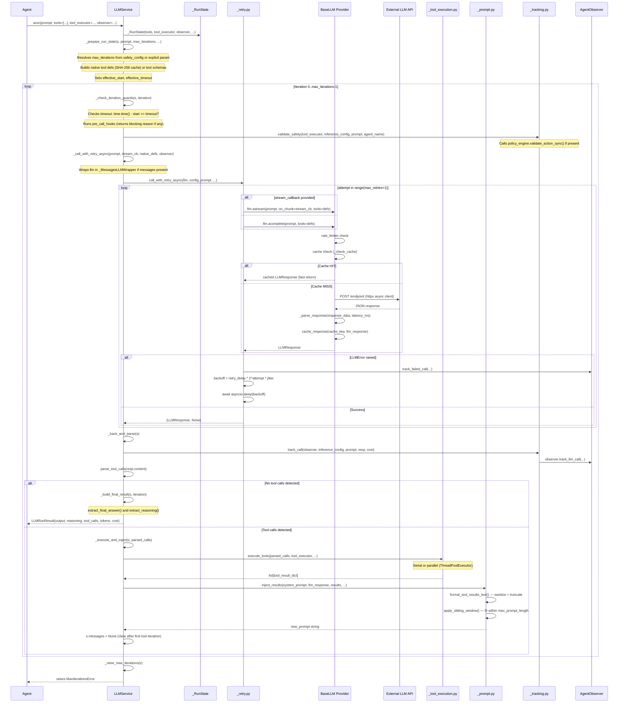
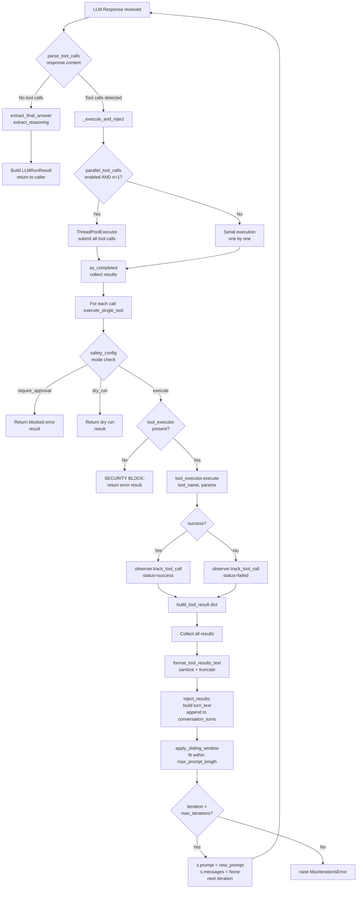
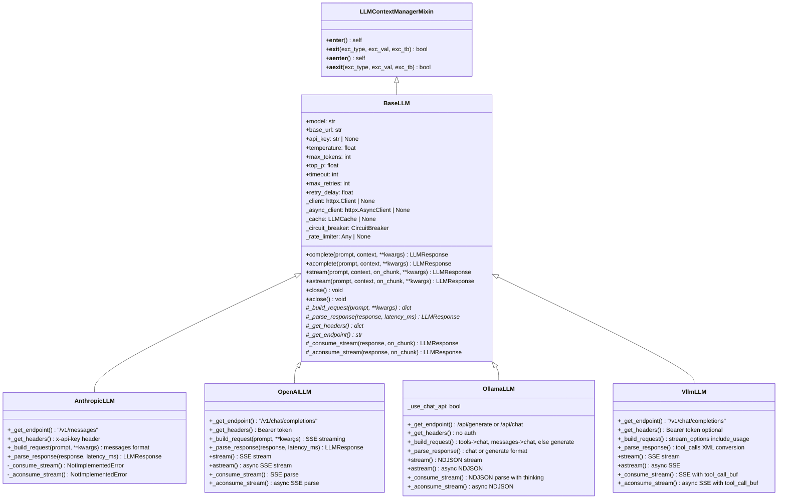
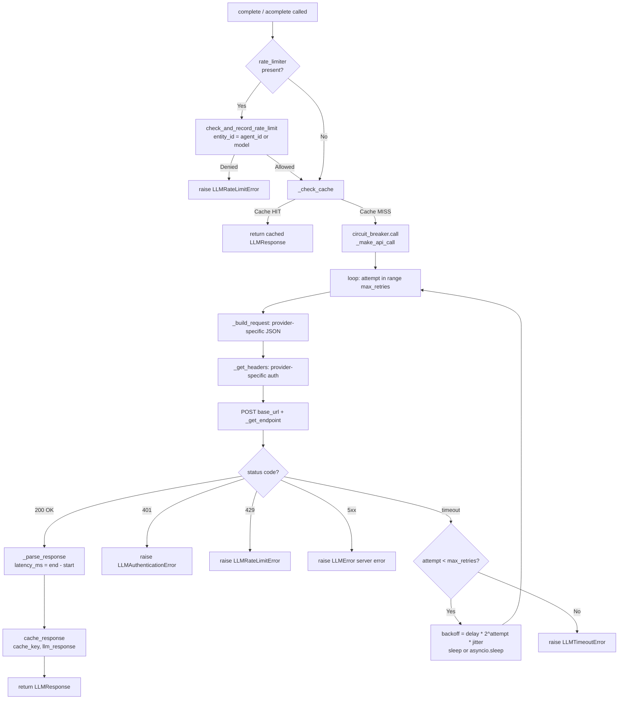
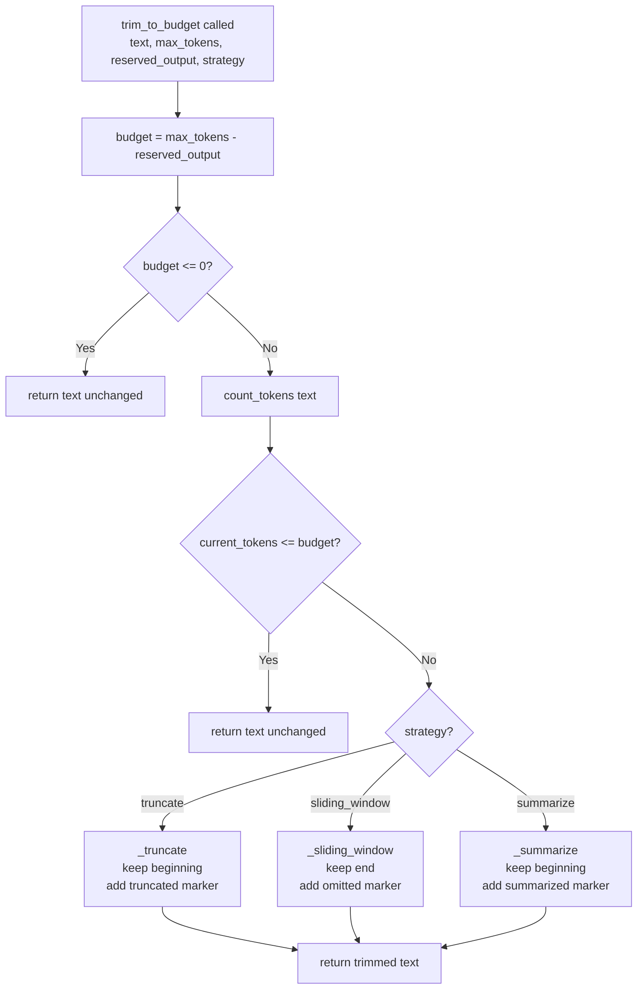
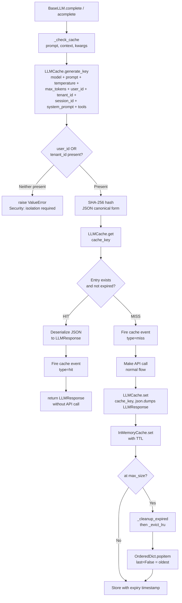
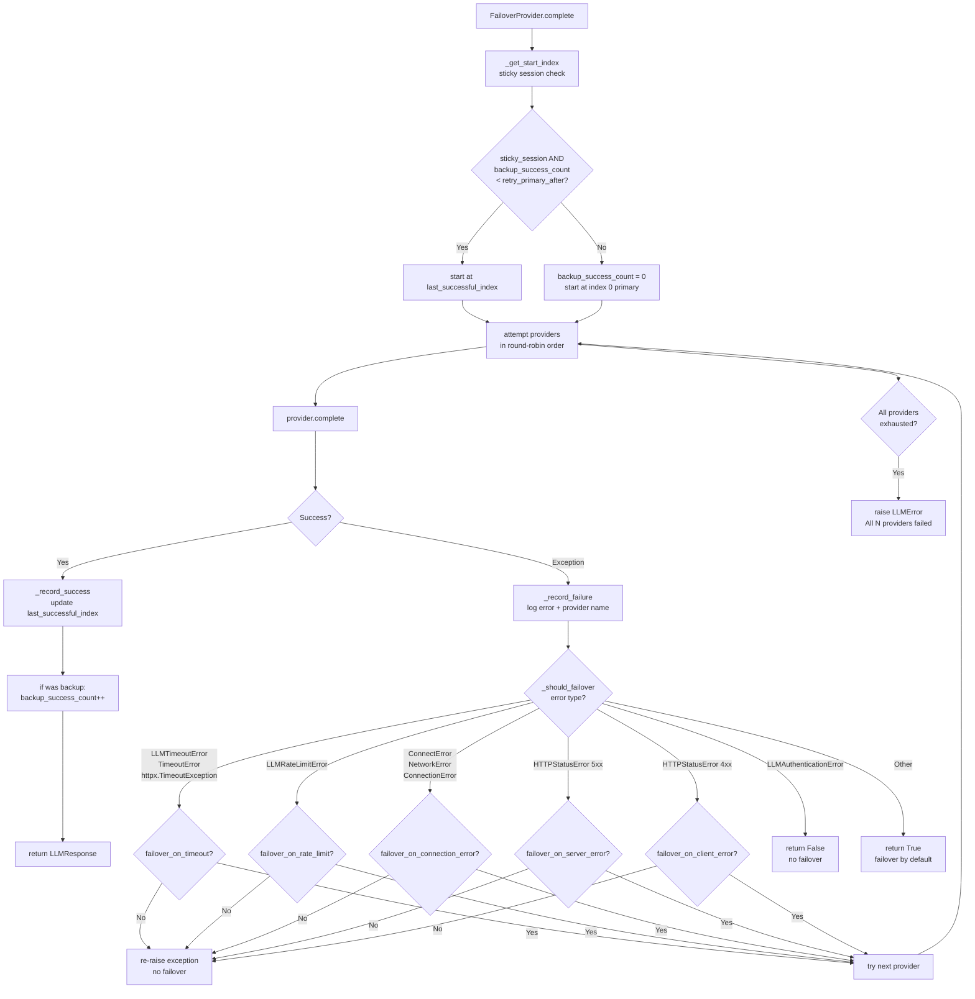
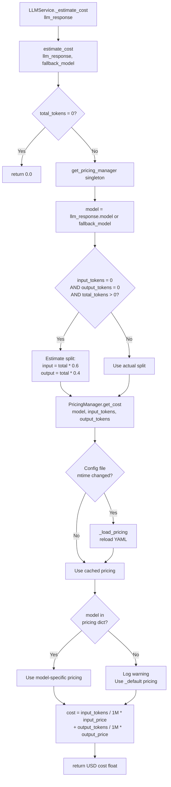
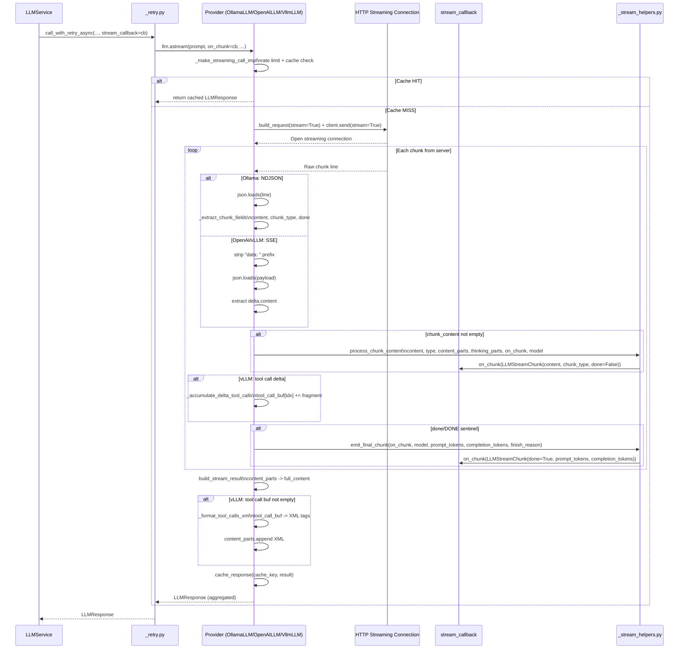
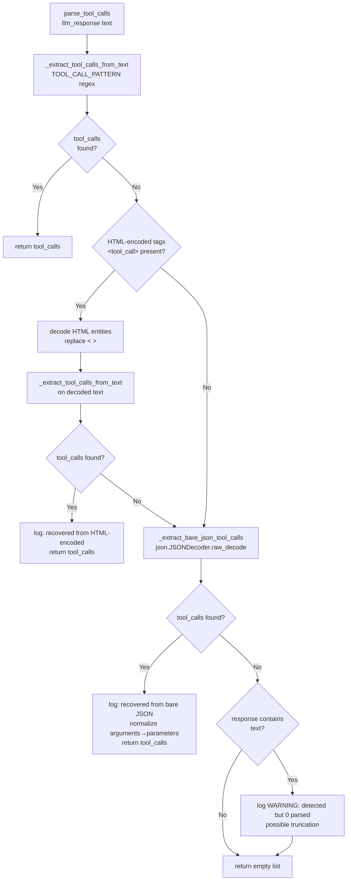

# LLM Pipeline Architecture

**Document Version:** 1.0
**Last Updated:** 2026-02-22
**Scope:** Complete LLM call pipeline from agent invocation to parsed response
**Primary Modules:** `temper_ai/llm/`

---

## Table of Contents

1. [Executive Summary](#1-executive-summary)
2. [Architecture Overview](#2-architecture-overview)
3. [LLMService — The Main Orchestrator](#3-llmservice--the-main-orchestrator)
4. [Tool Execution Loop](#4-tool-execution-loop)
5. [Provider Layer](#5-provider-layer)
6. [Context Window Management](#6-context-window-management)
7. [Caching System](#7-caching-system)
8. [Provider Failover](#8-provider-failover)
9. [Cost Estimation and Pricing](#9-cost-estimation-and-pricing)
10. [Prompt Engineering](#10-prompt-engineering)
11. [Streaming Architecture](#11-streaming-architecture)
12. [Structured Output Validation](#12-structured-output-validation)
13. [Response Parsing](#13-response-parsing)
14. [Observability and Tracking](#14-observability-and-tracking)
15. [Retry Logic](#15-retry-logic)
16. [Conversation History Management](#16-conversation-history-management)
17. [Safety Integration](#17-safety-integration)
18. [Data Models Reference](#18-data-models-reference)
19. [Configuration Reference](#19-configuration-reference)
20. [Design Patterns and Decisions](#20-design-patterns-and-decisions)
21. [Extension Points](#21-extension-points)
22. [Observations and Recommendations](#22-observations-and-recommendations)

---

## 1. Executive Summary

**System Name:** LLM Pipeline (`temper_ai/llm/`)

**Purpose:** A self-contained, provider-agnostic LLM interaction layer that manages the complete lifecycle of an LLM call — from prompt construction through tool execution loops to final response delivery — with built-in caching, failover, cost tracking, safety validation, and streaming support.

**Technology Stack:**
- Python 3.9+ with full type annotations
- httpx (async/sync HTTP with connection pooling, HTTP/2 support)
- Jinja2 (ImmutableSandboxedEnvironment for SSTI-safe prompt templating)
- Pydantic (pricing configuration validation)
- jsonschema (structured output validation)
- tiktoken (optional accurate token counting)
- SHA-256 hashing (cache keys, template versioning)

**Scope of Analysis:** All 28 files under `temper_ai/llm/` were read in full, including all four provider implementations, the cache subsystem, the prompt engine, and all internal helper modules.

**Key Characteristics:**
- Single-class public API (`LLMService`) hiding significant internal complexity
- Four LLM providers: Anthropic (Claude), OpenAI (GPT), Ollama (local), vLLM (self-hosted)
- Tool-calling loop with parallel execution via thread pool
- Content-addressed response cache with tenant/user isolation enforcement
- Automatic provider failover with sticky-session semantics
- Per-model pricing from YAML config with hardcoded emergency fallback
- Full streaming support (Ollama NDJSON, OpenAI/vLLM SSE) with thinking-token separation

---

## 2. Architecture Overview

### System Architecture

```
┌─────────────────────────────────────────────────────────────────────────────┐
│                          AGENT LAYER                                         │
│  StandardAgent / ScriptAgent / StaticCheckerAgent                            │
│  Constructs prompt, passes tools list, calls LLMService.run() / .arun()     │
└───────────────────────────────┬─────────────────────────────────────────────┘
                                │ run(prompt, tools=[], tool_executor=...,
                                │     observer=..., stream_callback=...,
                                │     safety_config=..., messages=...)
                                ▼
┌─────────────────────────────────────────────────────────────────────────────┐
│                         LLMService (service.py)                              │
│                                                                              │
│  ┌──────────────┐   ┌──────────────┐   ┌──────────────┐   ┌─────────────┐ │
│  │ _RunState    │   │ pre-call     │   │ safety       │   │ timeout     │ │
│  │ (loop state) │   │ hooks        │   │ validation   │   │ guard       │ │
│  └──────────────┘   └──────────────┘   └──────────────┘   └─────────────┘ │
│                                                                              │
│  ┌────────────────────────────────────────────────────────────────────────┐ │
│  │                    TOOL-CALLING ITERATION LOOP                          │ │
│  │                                                                          │ │
│  │   ┌──────────────┐     ┌──────────────┐     ┌────────────────────────┐ │ │
│  │   │ _retry.py    │     │ response_    │     │ _tool_execution.py     │ │ │
│  │   │ call_with_   │────▶│ parser.py    │────▶│ execute_tools()        │ │ │
│  │   │ retry_sync/  │     │ parse_tool_  │     │ (serial/parallel)      │ │ │
│  │   │ async        │     │ calls()      │     └────────────────────────┘ │ │
│  │   └──────────────┘     └──────────────┘                 │              │ │
│  │          │                      │                        │              │ │
│  │          │                      │ no tool calls          ▼              │ │
│  │          │                      │                  _prompt.py           │ │
│  │          ▼                      │                  inject_results()     │ │
│  │   ┌──────────────┐              │                  apply_sliding_       │ │
│  │   │ _tracking.py │              │                  window()             │ │
│  │   │ track_call() │              │                                       │ │
│  │   └──────────────┘              │                                       │ │
│  │                                 ▼                                       │ │
│  │                         LLMRunResult (final)                            │ │
│  └────────────────────────────────────────────────────────────────────────┘ │
└───────────────────────────────┬─────────────────────────────────────────────┘
                                │ complete() / acomplete() / stream() / astream()
                                ▼
┌─────────────────────────────────────────────────────────────────────────────┐
│                     PROVIDER LAYER (providers/)                              │
│                                                                              │
│  ┌───────────────┐  ┌───────────────┐  ┌───────────────┐  ┌──────────────┐ │
│  │ AnthropicLLM  │  │ OpenAILLM     │  │ OllamaLLM     │  │ VllmLLM      │ │
│  │ /v1/messages  │  │ /v1/chat/     │  │ /api/generate │  │ /v1/chat/    │ │
│  │               │  │ completions   │  │ /api/chat     │  │ completions  │ │
│  └───────┬───────┘  └──────┬────────┘  └──────┬────────┘  └──────┬───────┘ │
│          │                 │                   │                   │         │
│          └─────────────────┴───────────────────┴───────────────────┘         │
│                                     │                                        │
│                               BaseLLM (base.py)                              │
│                         ┌──────────────────────────┐                        │
│                         │ Circuit breaker           │                        │
│                         │ Rate limiter check        │                        │
│                         │ Cache check / write       │                        │
│                         │ HTTP client (httpx pool)  │                        │
│                         │ Response parse + validate │                        │
│                         └──────────────────────────┘                        │
└─────────────────────────────────────────────────────────────────────────────┘
                                │
                                ▼
                ┌──────────────────────────────┐
                │   EXTERNAL LLM APIS          │
                │  api.anthropic.com           │
                │  api.openai.com/v1           │
                │  localhost:11434 (Ollama)    │
                │  self-hosted vLLM endpoint   │
                └──────────────────────────────┘
```

### Module Dependency Map

```
service.py
├── _prompt.py          (inject_results, apply_sliding_window)
├── _retry.py           (call_with_retry_sync/async)
├── _schemas.py         (build_text_schemas, build_native_tool_defs)
├── _tool_execution.py  (execute_tools, execute_single_tool)
├── _tracking.py        (track_call, track_failed_call, validate_safety)
├── constants.py        (FALLBACK_UNKNOWN_VALUE, etc.)
├── cost_estimator.py   → pricing.py (PricingManager singleton)
├── llm_loop_events.py  (LLMIterationEventData, emit_llm_iteration_event)
├── response_parser.py  (parse_tool_calls, extract_final_answer, extract_reasoning)
├── tool_keys.py        (ToolKeys: NAME, PARAMETERS, SUCCESS, RESULT, ERROR)
└── providers/
    ├── base.py         (BaseLLM, LLMResponse, LLMStreamChunk, LLMConfig)
    ├── _base_helpers.py (HTTP clients, circuit breakers, cache helpers)
    ├── _stream_helpers.py (process_chunk_content, emit_final_chunk, build_stream_result)
    ├── factory.py      (create_llm_from_config, create_llm_client)
    ├── anthropic_provider.py
    ├── openai_provider.py
    ├── ollama.py
    └── vllm_provider.py

cache/
├── __init__.py
├── constants.py        (DEFAULT_CACHE_SIZE, DEFAULT_TTL_SECONDS)
└── llm_cache.py        (LLMCache, InMemoryCache, CacheStats, CacheKeyParams)

prompts/
├── engine.py           (PromptEngine — Jinja2 ImmutableSandboxedEnvironment)
├── cache.py            (TemplateCacheManager — compiled template LRU)
└── validation.py       (TemplateVariableValidator, PromptRenderError)

failover.py             (FailoverProvider — multi-provider fallback)
context_window.py       (count_tokens, trim_to_budget)
conversation.py         (ConversationHistory, ConversationMessage)
output_validation.py    (validate_output_against_schema, build_retry_prompt_with_error)
```

---

## 3. LLMService — The Main Orchestrator

### Location

`temper_ai/llm/service.py`

### Purpose

`LLMService` is the single entry point for all LLM interactions within the framework. It encapsulates the entire iteration loop: tool schema building, pre-call safety checks, retry-with-backoff calls to the provider, tool execution, prompt injection, cost tracking, and iteration event emission. It is instantiated once per agent and reused across multiple `run()` / `arun()` calls.

### Public API

```python
class LLMService:
    def __init__(
        self,
        llm: BaseLLM,                          # Provider instance
        inference_config: InferenceConfig,     # Provider/model/retry settings
        pre_call_hooks: list[Callable] | None, # Optional blocking hooks
    ) -> None: ...

    def run(
        self,
        prompt: str,
        *,
        tools: list[BaseTool] | None = None,
        tool_executor: ToolExecutor | None = None,
        observer: AgentObserver | None = None,
        stream_callback: Callable | None = None,
        safety_config: SafetyConfig | None = None,
        agent_name: str = "unknown",
        max_iterations: int | None = None,
        max_execution_time: float | None = None,
        start_time: float | None = None,
        messages: list[dict[str, str]] | None = None,
    ) -> LLMRunResult: ...

    async def arun(...) -> LLMRunResult: ...   # Async counterpart, identical interface
```

### Complete Call Flow

The following sequence diagram traces a full `arun()` call with tools enabled:



### Internal State: `_RunState`

`_RunState` is a mutable dataclass that holds all per-invocation state across the iteration loop:

| Field | Type | Description |
|---|---|---|
| `tools` | `list[BaseTool] \| None` | Available tool instances |
| `tool_executor` | `ToolExecutor \| None` | Safety-integrated execution context |
| `observer` | `AgentObserver \| None` | Observability hook |
| `safety_config` | `SafetyConfig \| None` | Per-agent safety constraints |
| `agent_name` | `str` | Agent identifier for logging/tracking |
| `stream_callback` | `Callable \| None` | Chunk consumer for streaming |
| `resolved_max_iterations` | `int` | Final iteration limit (default: 10) |
| `max_tool_result_size` | `int` | Max chars per tool result (default: 10,000) |
| `max_prompt_length` | `int` | Max prompt chars before sliding window (default: 32,000) |
| `effective_start` | `float` | `time.time()` at call start |
| `effective_timeout` | `float` | Max execution seconds (default: `inf`) |
| `native_tool_defs` | `list[dict] \| None` | Pre-built tool schemas for native function calling |
| `iteration_number` | `int` | Mutable iteration counter |
| `tool_calls_made` | `list[dict]` | Accumulated history of all tool executions |
| `total_tokens` | `int` | Running token accumulator |
| `total_cost` | `float` | Running USD cost accumulator |
| `conversation_turns` | `list[str]` | Accumulated prompt turns for sliding window |
| `system_prompt` | `str` | Original system prompt (never mutated) |
| `prompt` | `str` | Current iteration prompt (updated after each tool inject) |
| `messages` | `list[dict] \| None` | Multi-turn chat history (cleared after first tool call) |
| `user_prompt_text` | `str \| None` | Original user prompt (for `LLMRunResult.user_message`) |
| `response_format` | `dict \| None` | Structured output JSON schema pass-through |

### LLMRunResult

The return type from `run()` and `arun()`:

```python
@dataclass
class LLMRunResult:
    output: str                    # Final answer text (stripped of tags)
    reasoning: str | None          # Extracted <reasoning>/<thinking> content
    tool_calls: list[dict]         # All tool executions made
    tokens: int                    # Total tokens across all iterations
    cost: float                    # Total estimated USD cost
    iterations: int                # Number of LLM calls made
    error: str | None              # Error message if failed
    raw_response: Any | None       # Last raw LLMResponse object
    user_message: str | None       # Original user prompt
    assistant_message: str | None  # Final assistant output
```

### Limit Resolution

Three safety-config-aware helpers resolve iteration and size limits:

```python
def resolve_max_iterations(explicit: int | None, safety_config: Any) -> int:
    # Priority: explicit param > safety_config.max_tool_calls_per_execution > 10

def resolve_max_tool_result_size(safety_config: Any) -> int:
    # safety_config.max_tool_result_size or 10,000

def resolve_max_prompt_length(safety_config: Any) -> int:
    # safety_config.max_prompt_length or 32,000
```

### `_MessagesLLMWrapper`

When multi-turn conversation history (`messages`) is present, `LLMService` wraps the provider in a thin proxy that injects `messages` into every call:

```python
class _MessagesLLMWrapper:
    def complete(self, prompt, **kwargs):
        kwargs.setdefault("messages", self._messages)
        return self._llm.complete(prompt, **kwargs)

    async def acomplete(self, prompt, **kwargs):
        kwargs.setdefault("messages", self._messages)
        return await self._llm.acomplete(prompt, **kwargs)
    # stream() and astream() analogous
```

After the first tool call iteration, `s.messages = None` is set explicitly so subsequent iterations revert to the text-based `inject_results()` prompt format. This is a deliberate design decision: tool execution creates a new prompt that already includes prior context, so the multi-turn API history is no longer needed.

### Pre-Call Hooks

Pre-call hooks are callables registered at `LLMService.__init__()` that are invoked before every LLM call. If any hook returns a non-`None` value, the call is blocked and the returned string is used as the error message. Hooks receive the current prompt string as their only argument.

```python
# Registration
service = LLMService(llm, config, pre_call_hooks=[my_content_filter])

# Hook contract
def my_content_filter(prompt: str) -> str | None:
    if "forbidden_term" in prompt:
        return "Prompt contains forbidden content"
    return None  # Allow call
```

Exceptions from hooks (`ValueError`, `RuntimeError`, `TypeError`) are caught and surfaced as blocking reasons rather than propagating.

---

## 4. Tool Execution Loop

### Overview

The tool-calling loop is the core of the agent execution model. When the LLM returns a response containing tool call requests, `LLMService` detects them, executes them (possibly in parallel), sanitizes the results, injects them back into the prompt, and calls the LLM again. This continues until the LLM returns a response with no tool calls, the iteration limit is hit, or a timeout occurs.



### Tool Schema Building (`_schemas.py`)

Two modes of tool schema building exist depending on provider capability:

**Native Tool Definitions** (Anthropic, OpenAI, Ollama):
```python
native_tool = {
    "type": "function",
    "function": {
        "name": tool.name,
        "description": tool.description,  # augmented with result_schema if present
        "parameters": tool.get_parameters_schema(),  # JSON schema dict
    }
}
```
Cached by SHA-256 hash of sorted tool names. Cache invalidated only when tool set changes.

**Text-Based Schemas** (vLLM or providers without native function calling):
```python
# Appended to system prompt as:
"""
## Available Tools
You can call tools by writing a tool_call block. To call a tool, use EXACTLY this format:
<tool_call>
{"name": "<tool_name>", "parameters": {<parameters>}}
</tool_call>

You may call multiple tools. Wait for tool results before continuing.

[JSON array of tool schemas]
"""
```
Cached by tool count (version integer). Recomputed when count changes.

**Provider Routing for Native Tools:**
```python
def build_native_tool_defs(llm, tools, ...):
    if not isinstance(llm, (OllamaLLM, OpenAILLM, AnthropicLLM)):
        return None, None  # Fall back to text schemas for vLLM and others
```

### Tool Execution Infrastructure (`_tool_execution.py`)

The module maintains a **module-level shared `ThreadPoolExecutor`** for parallel tool execution:

```python
_DEFAULT_POOL_SIZE = min(
    _POOL_SIZE_LIMIT,
    (os.cpu_count() or 4) * 2 + 4
)
_TOOL_POOL_SIZE = int(os.environ.get("AGENT_TOOL_WORKERS", str(_DEFAULT_POOL_SIZE)))
```

The pool is lazily initialized on first use with double-checked locking, and registered with `atexit` for graceful shutdown (`cancel_futures=True` on Python 3.9+).

**Serial vs Parallel Execution Decision:**
```python
parallel_enabled = getattr(safety_config, "parallel_tool_calls", True) if safety_config else True
use_parallel = len(tool_calls) > 1 and parallel_enabled
```

### Safety Mode Checks

Before executing any tool, `check_safety_mode()` evaluates three modes:

| Mode | Behavior |
|---|---|
| `"execute"` (default) | Tool is executed normally |
| `"require_approval"` | All tools blocked with "requires approval" error |
| `"dry_run"` | Tools return a `[DRY RUN]` message without executing |

Per-tool approval is also supported via `safety_config.require_approval_for_tools: list[str]`.

### Tool Result Sanitization

Tool results are sanitized before injection to prevent prompt injection attacks (security concern AG-02). The sanitizer escapes XML tags that could be misinterpreted as tool calls or role delimiters:

```python
# Pattern matches:
# <tool_call>, </tool_call>, <answer>, <reasoning>, <thinking>, <think>, <thought>
# Lines starting with: "Assistant:", "User:", "System:", "Human:"
_TOOL_RESULT_SANITIZE_PATTERN = re.compile(
    r"<\s*/?\s*(?:tool_call|answer|reasoning|thinking|think|thought)[^>]*>"
    r"|(?:^|\n)\s*(?:Assistant|User|System|Human)\s*:",
    re.IGNORECASE | re.MULTILINE,
)
```

**Critical note:** The `apply_sliding_window()` function explicitly does NOT re-sanitize assembled turns because the individual results are already sanitized and re-sanitizing would escape the LLM's own `<tool_call>` tags.

### Prompt Injection After Tool Execution (`_prompt.py`)

```python
def inject_results(system_prompt, llm_response_content, tool_results,
                   conversation_turns, max_tool_result_size, max_prompt_length,
                   remaining_tool_calls) -> str:
    results_text = format_tool_results_text(tool_results, max_tool_result_size, remaining_tool_calls)
    turn_text = "\n\nAssistant: " + llm_response_content + results_text
    conversation_turns.append(turn_text)
    return apply_sliding_window(system_prompt, conversation_turns, max_prompt_length)
```

The formatted turn text follows this structure:
```
Assistant: [LLM response including tool call tags]

Tool Results:

Tool: calculator
Parameters: {"expression": "2+2"}
Result: 4

[System Info: You have 8 tool call(s) remaining in your budget.]
```

---

## 5. Provider Layer

### Class Hierarchy



### BaseLLM Complete Call Path

Every provider call follows this shared sequence in `BaseLLM.complete()` / `BaseLLM.acomplete()`:



### Provider Comparison Table

| Aspect | AnthropicLLM | OpenAILLM | OllamaLLM | VllmLLM |
|---|---|---|---|---|
| Endpoint | `/v1/messages` | `/v1/chat/completions` | `/api/generate` or `/api/chat` | `/v1/chat/completions` |
| Auth | `x-api-key` header | Bearer token | None required | Bearer token (optional) |
| Default base URL | `https://api.anthropic.com/v1` | `https://api.openai.com/v1` | `http://localhost:11434` | Configured |
| Streaming format | Not yet implemented | SSE (`data:` prefix) | NDJSON (one JSON per line) | SSE with `stream_options` |
| Native tools | Yes (function calling) | Yes (function calling) | Yes (via `/api/chat`) | Yes (via function calling) |
| Tool serialization | JSON in messages | JSON in messages | JSON in messages | XML `<tool_call>` conversion |
| Thinking tokens | No | No | Yes (`message.thinking`) | Yes (`delta.reasoning_content`) |
| Token fields | `input_tokens`, `output_tokens` | `prompt_tokens`, `completion_tokens` | `prompt_eval_count`, `eval_count` | `prompt_tokens`, `completion_tokens` |
| System message | Top-level `system` field | Role `"system"` in messages | In messages array | In messages array |

### Anthropic Provider Details

**File:** `temper_ai/llm/providers/anthropic_provider.py`

The Anthropic provider has special handling for system messages: they must be passed as a top-level `system` field in the API payload, not as a message with role `"system"`. The provider filters them out of the messages array and promotes the first one to the top level:

```python
def _build_request(self, prompt, **kwargs):
    messages = kwargs.get("messages") or [{"role": "user", "content": prompt}]
    non_system = [m for m in messages if m.get("role") != "system"]
    system_msgs = [m for m in messages if m.get("role") == "system"]
    if system_msgs:
        request["system"] = system_msgs[0]["content"]
        request["messages"] = non_system
```

Streaming for Anthropic is marked `NotImplementedError` — it falls back to `complete()` via the `BaseLLM.stream()` default implementation.

API version header: `"anthropic-version": "2023-06-01"`.

### OpenAI Provider Details

**File:** `temper_ai/llm/providers/openai_provider.py`

OpenAI uses Server-Sent Events (SSE) streaming. Each line is prefixed with `data: `, and the stream ends with `data: [DONE]`. The provider:

1. Builds the request with `"stream": True`
2. Opens the HTTP connection in streaming mode via `client.send(request, stream=True)`
3. Iterates lines via `response.iter_lines()` or `response.aiter_lines()`
4. Parses each SSE payload as JSON
5. Extracts content delta from `choices[0].delta.content`
6. Extracts token usage from the final chunk's `usage` field
7. Calls `on_chunk(LLMStreamChunk(...))` for each content piece

### Ollama Provider Details

**File:** `temper_ai/llm/providers/ollama.py`

Ollama uses NDJSON streaming (newline-delimited JSON). The endpoint choice depends on whether tools or multi-turn messages are provided:

```python
def _get_endpoint(self):
    if self._use_chat_api:
        return "/api/chat"
    return "/api/generate"

def _build_request(self, prompt, **kwargs):
    if tools:                  # → /api/chat with tools
        self._use_chat_api = True
    elif messages is not None: # → /api/chat without tools
        self._use_chat_api = True
    else:                      # → /api/generate (simple completion)
        self._use_chat_api = False
```

**Native tool call conversion:** When using `/api/chat` with tools, Ollama returns tool calls in `message.tool_calls` as structured JSON. The provider converts them to the framework's `<tool_call>` XML format for uniform downstream parsing:

```python
for tc in tool_calls:
    func = tc.get("function", {})
    content += f"<tool_call>\n{json.dumps({'name': func['name'], 'arguments': func['arguments']})}\n</tool_call>"
```

**Thinking token support:** Ollama with compatible models returns `message.thinking` (in `/api/chat`) or `thinking` (in `/api/generate`) for reasoning models. These are emitted as `LLMStreamChunk(chunk_type="thinking")`.

### vLLM Provider Details

**File:** `temper_ai/llm/providers/vllm_provider.py`

vLLM uses OpenAI-compatible SSE with additional reasoning support. Key differentiator: to include usage statistics in streaming responses, vLLM requires `stream_options: {"include_usage": True}` in the request payload.

**Streaming tool call accumulation:** Native tool calls arrive across multiple SSE chunks as partial JSON fragments. The provider accumulates them in an index-keyed buffer:

```python
tool_call_buf: dict[int, dict[str, str]] = {}
# Each delta chunk adds fragments:
# tool_call_buf[0] = {"name": "calc", "arguments": '{"expr": "2+2"}'}
```

After the stream ends, accumulated buffers are converted to `<tool_call>` XML tags matching the framework's standard format.

**Reasoning token support:** vLLM with `--reasoning-parser qwen3` (or similar) places thinking content in `delta.reasoning_content` rather than `delta.content`.

### HTTP Client Infrastructure (`_base_helpers.py`)

The framework uses a shared pool of `httpx.Client` and `httpx.AsyncClient` instances, keyed by `(provider_name, base_url)`:

```python
# Connection pool settings
limits = httpx.Limits(
    max_connections=100,          # DEFAULT_MAX_HTTP_CONNECTIONS
    max_keepalive_connections=20, # DEFAULT_MAX_KEEPALIVE_CONNECTIONS
    keepalive_expiry=30.0,        # DEFAULT_KEEPALIVE_EXPIRY_SECONDS
)
timeout_config = httpx.Timeout(timeout=600, connect=30)  # 10min total, 30s connect
```

HTTP/2 is enabled automatically if the `h2` package is installed.

**SSRF Protection:** Base URLs are validated against cloud metadata endpoints and private IP ranges:

```python
metadata_hosts = {"169.254.169.254", "metadata.google.internal"}  # AWS/GCP metadata blocked
# Private IPv4/IPv6 ranges also blocked
```

Localhost (`127.0.0.1`, `localhost`, `::1`) is explicitly allowed for local development with Ollama.

**LRU Eviction:** Both the HTTP client pool (`max 50`) and circuit breaker registry (`max 100`) use `OrderedDict`-based LRU eviction when at capacity.

### Provider Factory (`factory.py`)

The factory resolves provider strings to classes and creates properly configured instances:

```python
_PROVIDER_CLASSES = {
    LLMProvider.OLLAMA: OllamaLLM,
    LLMProvider.OPENAI: OpenAILLM,
    LLMProvider.ANTHROPIC: AnthropicLLM,
    LLMProvider.VLLM: VllmLLM,
}
_DEFAULT_BASE_URLS = {
    LLMProvider.OLLAMA: "http://localhost:11434",
    LLMProvider.OPENAI: "https://api.openai.com/v1",
    LLMProvider.ANTHROPIC: "https://api.anthropic.com/v1",
}
```

API key resolution priority: `api_key_ref` (environment variable reference) > `api_key` (direct value). If `api_key_ref` is set, the factory resolves it via `os.getenv()`.

---

## 6. Context Window Management

**File:** `temper_ai/llm/context_window.py`

### Token Counting

```python
_CHARS_PER_TOKEN = 4  # Approximate characters-per-token estimate

def count_tokens(text: str, method: str = "approximate") -> int:
    if method == "tiktoken":
        import tiktoken
        enc = tiktoken.get_encoding("cl100k_base")  # GPT-4 compatible
        return len(enc.encode(text))
    return len(text) // _CHARS_PER_TOKEN  # Fast approximation
```

The approximate method (`len(text) // 4`) is used by default for performance. Accurate counting requires the optional `tiktoken` dependency.

Default model context window: `128,000 tokens`.

### Trim Strategies



| Strategy | Behavior | Marker Added |
|---|---|---|
| `truncate` | Keeps beginning, discards end | `\n\n[Content truncated to fit context window]` |
| `sliding_window` | Keeps end (most recent), discards beginning | `[Earlier content omitted]\n\n` |
| `summarize` | Truncates with descriptive marker (full LLM summarization is a planned future feature) | `\n\n[Content summarized to fit context window]` |

### Sliding Window in the Tool Loop

The `_prompt.py` module implements a separate, more sophisticated sliding window specifically for the tool-calling loop. Unlike `context_window.py` which works on raw text, this window operates on *conversation turns*:

```python
def apply_sliding_window(system_prompt, conversation_turns, max_prompt_length):
    suffix = "\n\nPlease continue:"
    budget = max_prompt_length - len(system_prompt) - len(suffix)

    # Walk turns in reverse order (most recent first)
    # Include turns until budget is exhausted
    included_turns = []
    for turn in reversed(conversation_turns):
        if total_turn_chars + len(turn) > budget:
            break
        included_turns.append(turn)

    # Indicate how many turns were dropped
    if dropped_count > 0:
        truncation_marker = f"\n\n[...{dropped_count} earlier iteration(s) omitted for brevity...]\n"

    # Prune the conversation_turns list in-place to free memory
    if dropped_count > 0:
        conversation_turns[:] = included_turns
```

This in-place pruning of `conversation_turns` prevents unbounded memory growth across long tool-calling sessions.

---

## 7. Caching System

### Architecture

The caching system operates at two levels:

1. **LLM Response Cache** (`llm_cache.py`): Content-addressed cache of full LLM responses keyed by SHA-256 hash of request parameters
2. **Prompt Template Cache** (`prompts/cache.py`): FIFO cache of compiled Jinja2 templates by template string



### Cache Key Generation

The cache key is a SHA-256 hash of a canonical JSON object combining the request parameters and security context:

```python
request = {
    "model": params.model,
    "prompt": params.prompt,
    "temperature": params.temperature,
    "max_tokens": params.max_tokens,
    "system_prompt": params.system_prompt or "",
    "tools": sorted_normalized_tools,  # sorted by name, keys sorted alphabetically
    **extra_params
}
security_context = {
    "tenant_id": tenant_id,  # if present
    "user_id": user_id,      # if present
    "session_id": session_id,# if present
}
cache_key = sha256(json.dumps({"request": request, "security_context": security_context},
                               sort_keys=True, separators=(",", ":")))
```

**Security properties:**
- Requires `user_id` OR `tenant_id` to prevent cross-tenant cache pollution (HIPAA 164.312(a)(1), GDPR Article 32, SOC 2 CC6.6)
- Reserved parameter names cannot be overridden via `**kwargs` to prevent cache poisoning
- Type validation prevents type-confusion attacks

### InMemoryCache Implementation

The `InMemoryCache` uses two data structures:
- `_cache: dict[str, tuple[str, float | None]]` — maps key to `(value, expiry_timestamp)`
- `_access_order: OrderedDict` — tracks LRU order with O(1) operations

**LRU eviction sequence:**
1. `_cleanup_expired()` removes all TTL-expired entries (preventing eviction of valid data to make room)
2. `OrderedDict.popitem(last=False)` removes the least-recently-used entry in O(1)

**Eviction callback:** When an entry is evicted, an optional `on_eviction` callback fires a `CacheEventData(event_type="eviction")` event.

### Cache Configuration

```python
# Enable via BaseLLM init:
llm = OllamaLLM(model="...", base_url="...", enable_cache=True, cache_ttl=3600)

# Default settings:
DEFAULT_CACHE_SIZE = DEFAULT_QUEUE_SIZE  # from shared.constants
DEFAULT_TTL_SECONDS = TTL_LONG          # 1 hour
```

### Cache Statistics

```python
@dataclass
class CacheStats:
    hits: int = 0
    misses: int = 0
    writes: int = 0
    errors: int = 0
    evictions: int = 0

    @property
    def hit_rate(self) -> float:
        total = self.hits + self.misses
        return self.hits / total if total > 0 else 0.0
```

The `GOOD_HIT_RATIO = 0.7` (70%) and `POOR_HIT_RATIO = 0.3` (30%) constants define thresholds for alerting/monitoring.

---

## 8. Provider Failover

**File:** `temper_ai/llm/failover.py`

### Overview

`FailoverProvider` wraps a list of `BaseLLM` instances and provides automatic failover when the primary provider fails. It implements the same `complete()` / `acomplete()` interface as `BaseLLM`, making it transparent to callers.

### Failover Configuration

```python
@dataclass
class FailoverConfig:
    sticky_session: bool = True              # Remember last successful provider
    retry_primary_after: int = 3             # Try primary again after N backup successes
    failover_on_timeout: bool = True
    failover_on_rate_limit: bool = True
    failover_on_connection_error: bool = True
    failover_on_server_error: bool = True    # 5xx errors
    failover_on_client_error: bool = False   # 4xx errors (usually user error, not transient)
```

### Failover Decision Logic



### Sticky Session Semantics

The sticky session mechanism remembers the last successful provider index. On the next call, it starts with that provider rather than always starting from index 0:

```python
def _record_success(self, index, provider, failover_sequence):
    with self._state_lock:
        self.last_successful_index = index
        self.backup_success_count = self.backup_success_count + 1 if index != 0 else 0
```

After `retry_primary_after` consecutive backup successes, the next call resets `backup_success_count = 0` and starts from the primary (index 0) again, giving the primary provider another chance to recover.

**Thread safety:** Sync calls use `threading.Lock`; async calls use `asyncio.Lock`. Both are initialized eagerly to avoid race conditions during lazy initialization.

### Failover Sequence Tracking

Every call records a `_last_failover_sequence` list in the format `"provider:model:outcome"`:

```python
# Example:
["anthropic:claude-3-opus:LLMTimeoutError",
 "openai:gpt-4:success"]
```

This sequence is reported in observability tracking as `failover_sequence` metadata on the LLM call record.

---

## 9. Cost Estimation and Pricing

### Architecture



### PricingManager

`PricingManager` is a thread-safe singleton that loads pricing from `configs/model_pricing.yaml`:

```python
class PricingManager:
    _instance: Optional["PricingManager"] = None
    _lock = threading.RLock()
    MAX_CONFIG_SIZE = SIZE_1MB  # Security: prevent DoS via huge config

    def get_cost(self, model, input_tokens, output_tokens) -> float:
        # Auto-reloads if config file mtime has changed
        input_cost = (input_tokens / 1_000_000) * pricing.input_price
        output_cost = (output_tokens / 1_000_000) * pricing.output_price
        return input_cost + output_cost
```

### Pricing Configuration Schema (`configs/model_pricing.yaml`)

```yaml
schema_version: "1.0"
last_updated: 2026-01-01
models:
  claude-3-opus:
    input_price: 15.0    # USD per 1M tokens
    output_price: 75.0
    effective_date: 2024-01-01
    source_url: https://www.anthropic.com/pricing
  gpt-4:
    input_price: 30.0
    output_price: 60.0
    effective_date: 2024-01-01
default:
  input_price: 3.0       # Fallback for unknown models
  output_price: 15.0
  effective_date: 2026-01-01
```

Validated by Pydantic `PricingConfig` model with `field_validator` enforcing max price of `$1000/1M tokens`.

**Security:** Path traversal prevention — config path must be within the project root. File size limited to 1MB to prevent DoS.

**Emergency fallback:** If the YAML file is missing or invalid, hardcoded defaults are used (`$3.00` input, `$15.00` output per 1M tokens).

**Cost accumulation in LLMService:**
```python
# Per iteration:
cost = self._estimate_cost(resp)
s.total_cost += cost

# Final result:
LLMRunResult(cost=s.total_cost, ...)  # Total across all iterations
```

### Token Estimation Fallback

When the provider response does not include a prompt/completion token split (only `total_tokens`), the cost estimator applies a 60/40 heuristic:

```python
DEFAULT_INPUT_TOKEN_RATIO = 0.6   # 60% of total assumed to be input
DEFAULT_OUTPUT_TOKEN_RATIO = 0.4  # 40% assumed to be output
```

This is noted as a "rough estimate" appropriate for agent interactions where input tends to dominate.

---

## 10. Prompt Engineering

### Prompt Template Engine (`prompts/engine.py`)

`PromptEngine` provides Jinja2-based template rendering with security hardening:

```python
class PromptEngine:
    def __init__(self, templates_dir=None, cache_size=DEFAULT_CACHE_SIZE):
        self._sandbox_env = ImmutableSandboxedEnvironment(
            autoescape=False,   # Prompts are not HTML
            trim_blocks=True,   # Remove first newline after block tags
            lstrip_blocks=True, # Strip leading whitespace before block tags
        )
        self.cache = TemplateCacheManager(cache_size)  # LRU template compilation cache
        self.validator = TemplateVariableValidator()    # Type + size validation
```

**SSTI Prevention:** `ImmutableSandboxedEnvironment` prevents attribute modification on objects passed into templates, blocking `{{ ''.__class__.__mro__[1].__subclasses__() }}`-style injection attacks.

### Template Variable Validation

Before rendering, all variables are validated:

| Constraint | Value |
|---|---|
| Allowed types | `str`, `int`, `float`, `bool`, `list`, `dict`, `tuple`, `None` |
| Max string size | 100KB per variable |
| Max nesting depth | 20 levels |

Functions, classes, modules, and other objects are rejected. This is an allowlist approach: only serializable primitive types pass.

### Template Compilation Cache (`prompts/cache.py`)

The `TemplateCacheManager` caches compiled Jinja2 `Template` objects by template string. Cache eviction is FIFO (Python 3.7+ dict insertion order). Stats tracked: hits, misses, total requests, hit rate.

```python
def get_or_compile(self, template_str, sandbox_env) -> Template:
    jinja_template = self._template_cache.get(template_str)
    if jinja_template is None:
        self._cache_misses += 1
        jinja_template = sandbox_env.from_string(template_str)
        if len(self._template_cache) >= self._cache_size:
            oldest_key = next(iter(self._template_cache))
            del self._template_cache[oldest_key]  # FIFO eviction
        self._template_cache[template_str] = jinja_template
    else:
        self._cache_hits += 1
    return jinja_template
```

### Template Versioning

`render_with_metadata()` returns a SHA-256 hash (first 16 hex chars) computed on the **raw template before variable substitution**, providing a stable version identifier:

```python
def render_with_metadata(self, template, variables) -> tuple[str, str, str]:
    rendered = self.render(template, variables)
    template_hash = hashlib.sha256(template.encode("utf-8")).hexdigest()[:16]
    return rendered, template_hash, "inline"  # (rendered, hash, source)
```

This template hash is passed to `track_call()` via `prompt_template_hash` and stored in observability records, enabling analysis of how prompt template changes affect model behavior.

### Tool Schema Text Format

For providers without native function calling, tool schemas are appended to the system prompt in a structured format. The LLM is explicitly instructed to use EXACTLY the `<tool_call>` XML block format:

```
## Available Tools
You can call tools by writing a tool_call block. To call a tool, use EXACTLY this format:
<tool_call>
{"name": "<tool_name>", "parameters": {<parameters>}}
</tool_call>

You may call multiple tools. Wait for tool results before continuing.

[
  {
    "name": "calculator",
    "description": "Evaluates math expressions",
    "parameters": {
      "type": "object",
      "properties": {"expression": {"type": "string"}},
      "required": ["expression"]
    }
  }
]
```

---

## 11. Streaming Architecture

### Overview

Streaming enables real-time token visibility as the LLM generates its response. Three of the four providers support streaming; Anthropic streaming is marked as `NotImplementedError` and falls back to non-streaming.



### LLMStreamChunk

```python
@dataclass
class LLMStreamChunk:
    content: str
    chunk_type: str = "content"          # "thinking" | "content"
    finish_reason: str | None = None
    done: bool = False
    model: str | None = None
    prompt_tokens: int | None = None     # Only on final chunk (done=True)
    completion_tokens: int | None = None # Only on final chunk (done=True)
```

The final chunk always has `done=True`, `content=""`, and the token counts from the server. Intermediate chunks have `done=False`.

### Thinking Token Separation

Ollama and vLLM separate "thinking" tokens (chain-of-thought reasoning) from content tokens. These are emitted as distinct chunk types:

| Provider | Thinking Source | `chunk_type` |
|---|---|---|
| Ollama `/api/chat` | `message.thinking` | `"thinking"` |
| Ollama `/api/generate` | `data.thinking` | `"thinking"` |
| vLLM with reasoning parser | `delta.reasoning_content` | `"thinking"` |

The `_stream_helpers.py` `process_chunk_content()` function routes thinking content to `thinking_parts` and regular content to `content_parts`. The final `LLMResponse.content` contains only the non-thinking content (thinking is discarded in `build_stream_result()`, though it is still emitted via the callback for streaming consumers).

### Shared Streaming Helpers (`_stream_helpers.py`)

Three functions are shared across Ollama, OpenAI, and vLLM to reduce duplication:

```python
def process_chunk_content(chunk_content, chunk_type, content_parts, thinking_parts, on_chunk, model):
    """Route to content_parts or thinking_parts and emit via callback."""

def emit_final_chunk(on_chunk, model, prompt_tokens, completion_tokens, finish_reason):
    """Emit done=True sentinel chunk with token counts."""

def build_stream_result(content_parts, model, provider, prompt_tokens, completion_tokens, finish_reason) -> LLMResponse:
    """Aggregate content_parts into full_content and build LLMResponse."""
```

---

## 12. Structured Output Validation

**File:** `temper_ai/llm/output_validation.py`

### Overview

Structured output validation enforces that LLM responses conform to a JSON schema. This is the R0.1 feature ("structured output").

### Validation Flow

```python
# Check validity:
def validate_output_against_schema(output_text, json_schema) -> tuple[bool, str | None]:
    parsed = json.loads(output_text)  # Fails → "Invalid JSON: ..."
    jsonschema.validate(instance=parsed, schema=json_schema)  # Fails → "Schema validation failed: ..."
    return True, None  # Success

# Build initial prompt:
def build_schema_enforcement_prompt(original_prompt, json_schema) -> str:
    return original_prompt + "\n\nYou MUST respond with valid JSON matching this schema:\n" + json.dumps(json_schema, indent=2)

# Build retry prompt on failure:
def build_retry_prompt_with_error(original_prompt, output, error_msg, json_schema) -> str:
    return (
        "Your previous output was invalid JSON.\n"
        f"Error: {error_msg}\n\n"
        "Please fix and respond with valid JSON matching the schema:\n"
        + json.dumps(json_schema, indent=2)
        + "\n\nOriginal task:\n" + original_prompt
    )
```

`jsonschema` is an optional dependency. If not installed, schema validation is skipped with a warning (the response is considered valid).

### Integration Point

The structured output system is invoked by agents that set `response_format` in their configuration (the `_RunState.response_format` field carries this through the loop). The agent layer is responsible for calling `build_schema_enforcement_prompt()` before passing the prompt to `LLMService.run()`, and calling `validate_output_against_schema()` on the returned output, then potentially re-invoking with `build_retry_prompt_with_error()` if validation fails.

---

## 13. Response Parsing

**File:** `temper_ai/llm/response_parser.py`

### Tool Call Parsing Strategy

The parser uses a three-tier fallback strategy to maximize recovery of tool calls from LLM outputs:



**Tier 1 — XML tags:** Regex pattern `<tool_call>(.*?)</tool_call>` with `re.DOTALL`. JSON parsed from match group.

**Tier 2 — HTML-encoded:** Some models HTML-encode XML tags in multi-turn conversations. The parser detects `&lt;tool_call&gt;` and decodes to `<tool_call>` before re-running tier 1.

**Tier 3 — Bare JSON:** `json.JSONDecoder().raw_decode()` scans the text for JSON objects containing a `"name"` key. The `raw_decode()` approach handles nested JSON correctly (e.g., a `FileWriter` tool with JSON content as a parameter).

**"arguments" → "parameters" normalization:** Some providers (vLLM, OpenAI native format) use `"arguments"` instead of `"parameters"`. The parser normalizes this:
```python
if "arguments" in obj and "parameters" not in obj:
    obj["parameters"] = obj.pop("arguments")
```

### Final Answer Extraction

```python
ANSWER_PATTERN = re.compile(r"<answer>(.*?)</answer>", re.DOTALL)

def extract_final_answer(llm_response: str) -> str:
    answer_match = ANSWER_PATTERN.search(llm_response)
    if answer_match:
        return answer_match.group(1).strip()
    return llm_response.strip()  # Full response if no <answer> tag
```

Agents are instructed (via their system prompt) to wrap final answers in `<answer>` tags. If absent, the entire response is returned.

### Reasoning Extraction

```python
REASONING_TAGS = ["reasoning", "thinking", "think", "thought"]

def extract_reasoning(llm_response: str) -> str | None:
    for tag in REASONING_TAGS:
        match = REASONING_PATTERNS[tag].search(llm_response)
        if match:
            return match.group(1).strip()
    return None
```

Supports four tag variants to accommodate different model conventions.

---

## 14. Observability and Tracking

**File:** `temper_ai/llm/_tracking.py`, `temper_ai/llm/llm_loop_events.py`

### LLM Call Tracking

Every successful LLM call is tracked via the observer:

```python
def track_call(observer, inference_config, prompt, llm_response, cost,
               failover_sequence=None, failover_from_provider=None,
               prompt_template_hash=None, prompt_template_source=None):
    if observer is None:
        return
    observer.track_llm_call(
        provider=inference_config.provider,
        model=inference_config.model,
        prompt=prompt,
        response=llm_response.content,
        prompt_tokens=llm_response.prompt_tokens or 0,
        completion_tokens=llm_response.completion_tokens or 0,
        latency_ms=int(llm_response.latency_ms) if llm_response.latency_ms else 0,
        estimated_cost_usd=cost,
        temperature=inference_config.temperature,
        max_tokens=inference_config.max_tokens,
        status="success",
        failover_sequence=failover_sequence,
        failover_from_provider=failover_from_provider,
        prompt_template_hash=prompt_template_hash,
        prompt_template_source=prompt_template_source,
    )
```

### Failed Call Tracking

```python
def track_failed_call(observer, inference_config, prompt, error, attempt, max_attempts):
    observer.track_llm_call(
        ...
        status="failed",
        error_message=f"[attempt {attempt}/{max_attempts}] {sanitize_error_message(str(error))}",
    )
```

Error messages are sanitized via `sanitize_error_message()` before logging to prevent secret/PII leakage.

### LLM Iteration Events

After each iteration (successful or not), an `LLMIterationEventData` is emitted:

```python
@dataclass
class LLMIterationEventData:
    iteration_number: int
    agent_name: str = "unknown"
    conversation_turns_count: int = 0
    tool_calls_this_iteration: int = 0
    total_tokens_this_iteration: int = 0
    total_cost_this_iteration: float = 0.0
    cache_hit: bool | None = None
```

Emission is best-effort (never raises):
```python
def emit_llm_iteration_event(observer, event_data):
    logger.info("LLM iteration %d for agent=%s: tools=%d tokens=%d cost=%.6f", ...)
    if observer is not None:
        _try_emit_to_observer(observer, event_data)  # catches AttributeError/TypeError/RuntimeError
```

### Cache Events

Cache hit/miss/write/eviction events are emitted via an optional callback:

```python
@dataclass
class CacheEventData:
    event_type: str   # "hit" | "miss" | "write" | "eviction"
    key_prefix: str   # First 16 chars of cache key
    model: str | None
    cache_size: int | None
```

The `emit_cache_event()` function in `llm_loop_events.py` is the canonical emission point (moved here from `observability/llm_loop_events.py` to fix a layer violation — infrastructure should not import from cross-cutting concerns).

### Tool Execution Tracking

Each tool call is tracked via the observer in `execute_via_executor()`:

```python
observer.track_tool_call(
    tool_name=tool_name,
    input_params=tool_params,
    output_data={"result": result.result} if result.success else {},
    duration_seconds=duration_seconds,
    status="success" | "failed",
    error_message=result.error if not result.success else None,
)
```

---

## 15. Retry Logic

**File:** `temper_ai/llm/_retry.py`

### Overview

The retry module handles transient LLM failures with exponential backoff and jitter. It is called by `LLMService._call_with_retry_sync()` and `._call_with_retry_async()`.

### Retry Algorithm

```python
for attempt in range(max_retries + 1):
    try:
        if stream_callback:
            return llm.stream(prompt, on_chunk=stream_callback, tools=native_defs), None
        else:
            return llm.complete(prompt, tools=native_defs), None
    except LLMError as e:
        track_failed_call(...)
        if attempt < max_retries:
            backoff_delay = retry_delay * (DEFAULT_BACKOFF_MULTIPLIER ** attempt) * (RETRY_JITTER_MIN + random.random())
            # Sync: threading.Event.wait(timeout=backoff_delay)
            # Async: await asyncio.sleep(backoff_delay)
        else:
            logger.error("LLM call failed after %d attempts", ...)

return None, last_error
```

**Backoff formula:**
```
delay = retry_delay_seconds * backoff_multiplier^attempt * (jitter_min + random[0,1])
```

Where:
- `retry_delay_seconds` — from `InferenceConfig` (default: `2.0`)
- `DEFAULT_BACKOFF_MULTIPLIER` — from `shared.constants.retries` (typically `2.0`)
- `RETRY_JITTER_MIN` — from `shared.constants.retries` (typically `0.5`)
- `random.random()` — uniform `[0,1)`, used for decorrelated jitter (non-cryptographic, documented with `# noqa: S311`)

**Sync vs Async backoff:**
- Sync path uses `threading.Event().wait(timeout=backoff_delay)` — allows the wait to be interrupted by `KeyboardInterrupt` via `event.set()`
- Async path uses `await asyncio.sleep(backoff_delay)` — non-blocking

**Only `LLMError` is retried.** `LLMAuthenticationError` and `httpx.HTTPStatusError` propagate immediately (these indicate configuration errors, not transient failures).

### Two-Level Retry

Retry exists at two levels:

1. **`BaseLLM.complete()`** — Retries on `TimeoutError` and `LLMRateLimitError` with backoff. Only catches these specific errors; authentication and HTTP errors propagate immediately.

2. **`_retry.py` — `call_with_retry_sync/async()`** — Called by `LLMService`, catches `LLMError` (the base exception class). This is the outer retry that handles failures from the provider's internal retry loop.

---

## 16. Conversation History Management

**File:** `temper_ai/llm/conversation.py`

### ConversationHistory

```python
@dataclass
class ConversationHistory:
    messages: list[ConversationMessage] = field(default_factory=list)
    MAX_CONVERSATION_TURNS = 20  # Maximum user/assistant turn pairs

    def append_turn(self, user_content: str, assistant_content: str) -> None:
        """Append user/assistant pair and trim if over limit."""
        self.messages.append(ConversationMessage(role="user", content=user_content))
        self.messages.append(ConversationMessage(role="assistant", content=assistant_content))
        self._apply_turn_limit()

    def to_message_list(self) -> list[dict[str, str]]:
        """Convert to LLM provider messages parameter format."""
        return [{"role": m.role, "content": m.content} for m in self.messages]
```

The 20-turn limit means at most 40 messages (20 user + 20 assistant). When exceeded, the oldest messages are discarded from the front of the list.

### Key Pair: `stage_name:agent_name`

Each `stage:agent` combination gets its own conversation history namespace:

```python
def make_history_key(stage_name: str, agent_name: str) -> str:
    return f"{stage_name}:{agent_name}"
```

This ensures that an agent re-invoked in a loop sees its prior conversation naturally (as multi-turn chat history), while agents in different stages do not share history.

### Integration with LLMService

Conversation history is passed as `messages` to `LLMService.run()` / `.arun()`. The service wraps the provider in `_MessagesLLMWrapper` to inject messages on the first call. After the first tool execution, `s.messages = None` clears the injection — subsequent iterations use the text-based `inject_results()` prompt format.

**After completion**, the calling agent appends the turn:
```python
history.append_turn(
    user_content=result.user_message,
    assistant_content=result.assistant_message,
)
```

---

## 17. Safety Integration

### Policy Engine Validation (`_tracking.py`)

Before every LLM call, `validate_safety()` checks the prompt against the action policy engine:

```python
def validate_safety(tool_executor, inference_config, prompt, agent_id) -> str | None:
    if tool_executor is None or tool_executor.policy_engine is None:
        return None  # No safety engine configured

    policy_context = PolicyExecutionContext(
        agent_id=agent_id,
        action_type="llm_call",
        action_data={"model": inference_config.model},
    )
    validation_result = tool_executor.policy_engine.validate_action_sync(
        action={"type": "llm_call", "model": ..., "prompt_length": len(prompt)},
        context=policy_context,
    )
    if not validation_result.allowed:
        return "; ".join(v.message for v in validation_result.violations)
```

**Fail-closed:** If the safety validation itself raises an exception, the LLM call is blocked (returns an error) rather than allowing the call through.

### Tool Safety Modes

Three modes for tool execution safety (set via `safety_config.mode`):

| Mode | Description |
|---|---|
| `"execute"` | Normal execution (default) |
| `"require_approval"` | All tool calls blocked |
| `"dry_run"` | Tools return simulated results without executing |

Per-tool approval list (`require_approval_for_tools: list[str]`) blocks specific tools regardless of global mode.

### No-Executor Security Block

If a tool call is requested but `tool_executor` is `None`, execution is hard-blocked:

```python
# SECURITY: No silent fallback
logger.critical(
    "SECURITY: No tool_executor provided. "
    "%s%s' execution blocked to prevent safety bypass.",
    ERROR_MSG_TOOL_PREFIX, tool_name,
)
return build_tool_result(tool_name, tool_params, False, None,
    "Tool execution blocked: no tool_executor configured. "
    "The safety stack is required for tool execution.")
```

This prevents bypassing the safety stack by not providing a `tool_executor`. The error is logged at `CRITICAL` level for visibility.

---

## 18. Data Models Reference

### LLMResponse

```python
@dataclass
class LLMResponse:
    content: str                   # Response text
    model: str                     # Model identifier as reported by provider
    provider: str                  # Provider enum value ("anthropic", "openai", etc.)
    prompt_tokens: int | None      # Input tokens used
    completion_tokens: int | None  # Output tokens generated
    total_tokens: int | None       # Sum (may differ from prompt+completion on some providers)
    latency_ms: int | None         # Round-trip time in milliseconds
    finish_reason: str | None      # "stop", "length", "tool_use", etc.
    raw_response: dict | None      # Full provider response for debugging
```

### LLMStreamChunk

```python
@dataclass
class LLMStreamChunk:
    content: str
    chunk_type: str = "content"    # "thinking" | "content"
    finish_reason: str | None = None
    done: bool = False
    model: str | None = None
    prompt_tokens: int | None = None      # Populated only on final chunk
    completion_tokens: int | None = None  # Populated only on final chunk
```

### LLMConfig

```python
@dataclass
class LLMConfig:
    model: str
    base_url: str
    api_key: str | None = None
    temperature: float = 0.7
    max_tokens: int = 2048
    top_p: float = 0.9
    timeout: int = 600            # 10 minutes
    max_retries: int = 3
    retry_delay: float = 2.0
    enable_cache: bool = False
    cache_ttl: int | None = 3600  # 1 hour
    rate_limiter: Any | None = None
```

### Tool Result Dict

All tool execution results follow the `ToolKeys` schema:

```python
{
    ToolKeys.NAME: "calculator",              # Tool name
    ToolKeys.PARAMETERS: {"expression": "2+2"}, # Input parameters
    ToolKeys.SUCCESS: True,                   # Execution success flag
    ToolKeys.RESULT: 4,                       # Result (if success=True)
    ToolKeys.ERROR: None,                     # Error message (if success=False)
}
```

### ModelPricing

```python
class ModelPricing(BaseModel):
    input_price: float   # USD per 1M input tokens, ge=0
    output_price: float  # USD per 1M output tokens, ge=0
    effective_date: date
    source_url: str | None = None
    notes: str | None = None
```

### ConversationMessage

```python
@dataclass(frozen=True)
class ConversationMessage:
    role: str     # "user" | "assistant"
    content: str
```

### CacheKeyParams

```python
@dataclass
class CacheKeyParams:
    model: str
    prompt: str
    temperature: float = 0.7
    max_tokens: int = 2048
    user_id: str | None = None
    tenant_id: str | None = None     # REQUIRED: Either this or user_id
    session_id: str | None = None
    system_prompt: str | None = None
    tools: list[dict] | None = None
    extra_params: dict = field(default_factory=dict)
```

---

## 19. Configuration Reference

### InferenceConfig Fields (from `storage/schemas/agent_config.py`)

The `InferenceConfig` schema drives LLM provider creation and LLMService configuration:

| Field | Type | Default | Description |
|---|---|---|---|
| `provider` | `str` | required | `"ollama"`, `"openai"`, `"anthropic"`, `"vllm"` |
| `model` | `str` | required | Model identifier |
| `base_url` | `str \| None` | Provider default | API base URL |
| `temperature` | `float` | `0.7` | Sampling temperature |
| `max_tokens` | `int` | `2048` | Max completion tokens |
| `top_p` | `float` | `0.9` | Nucleus sampling threshold |
| `timeout_seconds` | `int` | `600` | HTTP request timeout (10 min) |
| `max_retries` | `int` | `3` | Retry attempts on failure |
| `retry_delay_seconds` | `float` | `2.0` | Base backoff delay |
| `api_key` | `str \| None` | `None` | Direct API key (deprecated) |
| `api_key_ref` | `str \| None` | `None` | Environment variable name for API key |

### SafetyConfig Fields (relevant to LLM pipeline)

| Field | Type | Default | Description |
|---|---|---|---|
| `max_tool_calls_per_execution` | `int` | `10` | Max LLM iterations |
| `max_tool_result_size` | `int` | `10000` | Max chars per tool result |
| `max_prompt_length` | `int` | `32000` | Max prompt chars |
| `mode` | `str` | `"execute"` | `"execute"`, `"dry_run"`, `"require_approval"` |
| `parallel_tool_calls` | `bool` | `True` | Enable parallel tool execution |
| `require_approval_for_tools` | `list[str]` | `[]` | Per-tool approval list |

### Environment Variables

| Variable | Default | Description |
|---|---|---|
| `AGENT_TOOL_WORKERS` | `cpu_count * 2 + 4` | Thread pool size for parallel tool execution |
| `ANTHROPIC_API_KEY` | — | Anthropic API key (reference via `api_key_ref`) |
| `OPENAI_API_KEY` | — | OpenAI API key (reference via `api_key_ref`) |

### Constants Summary

| Constant | Value | Location |
|---|---|---|
| `DEFAULT_TIMEOUT_SECONDS` | `600` (10 min) | `constants.py`, `base.py` |
| `DEFAULT_MAX_ITERATIONS` | `10` | `service.py` |
| `_CHARS_PER_TOKEN` | `4` | `context_window.py` |
| `DEFAULT_MODEL_CONTEXT` | `128,000` | `context_window.py` |
| `MAX_CONVERSATION_TURNS` | `20` | `conversation.py` |
| `DEFAULT_CACHE_SIZE` | `DEFAULT_QUEUE_SIZE` | `cache/constants.py` |
| `DEFAULT_TTL_SECONDS` | `TTL_LONG` (1 hour) | `cache/constants.py` |
| `GOOD_HIT_RATIO` | `0.7` (70%) | `cache/constants.py` |
| `POOR_HIT_RATIO` | `0.3` (30%) | `cache/constants.py` |
| `DEFAULT_MAX_HTTP_CONNECTIONS` | `100` | `constants.py` |
| `DEFAULT_MAX_HTTP_CLIENTS` | `50` | `constants.py` |
| `DEFAULT_MAX_CIRCUIT_BREAKERS` | `100` | `constants.py` |
| `TOKENS_PER_MILLION` | `1,000,000` | `constants.py` |
| `DEFAULT_FALLBACK_INPUT_PRICE` | `$3.00/1M` | `pricing.py` |
| `DEFAULT_FALLBACK_OUTPUT_PRICE` | `$15.00/1M` | `pricing.py` |
| `CONNECT_TIMEOUT_SECONDS` | `30.0` | `_base_helpers.py` |

---

## 20. Design Patterns and Decisions

### Pattern 1: Template Method Pattern (BaseLLM)

**Where:** `BaseLLM.complete()` and `BaseLLM.acomplete()`

The `complete()` method defines the skeleton of the LLM call algorithm (rate limiting, cache check, circuit breaker, retry, response parsing, cache write) while deferring provider-specific steps to abstract methods `_build_request()`, `_parse_response()`, `_get_headers()`, and `_get_endpoint()`. Subclasses implement only the provider-specific parts.

**Why:** Eliminates duplication of the common LLM call lifecycle across four providers.

### Pattern 2: Strategy Pattern (Tool Execution)

**Where:** `execute_tools()` in `_tool_execution.py`

Tool execution strategy is determined at runtime: serial if one tool or parallel disabled, parallel via `ThreadPoolExecutor` otherwise. The `execute_single` callable is injected, making the execution unit testable independently.

### Pattern 3: Decorator/Proxy Pattern (`_MessagesLLMWrapper`)

**Where:** `service.py`

The wrapper is a thin proxy that injects `messages` into every LLM call without changing the `BaseLLM` interface. It uses `__getattr__` delegation to remain transparent for all other attribute accesses. This avoids modifying the `BaseLLM` interface to accept messages everywhere.

### Pattern 4: Singleton Pattern (PricingManager, InMemoryCache per instance)

**Where:** `pricing.py`

`PricingManager` uses thread-safe singleton instantiation with `__new__` + `_lock` to ensure a single source of pricing truth across the application. The `_initialized` guard prevents `__init__` from running multiple times on the singleton.

### Pattern 5: LRU Cache via OrderedDict

**Where:** `llm_cache.py` (InMemoryCache), `_base_helpers.py` (HTTP clients, circuit breakers)

`OrderedDict.move_to_end()` and `popitem(last=False)` provide O(1) LRU operations versus the O(n) `min()` scan over timestamps. An explicit `_cleanup_expired()` pass before eviction prevents displacing valid entries when expired ones are present.

### Pattern 6: Callable Attribute Binding (`bind_callable_attributes`)

**Where:** `_base_helpers.py`

Rather than adding more methods to the already-large `BaseLLM` class (which would violate the ≤20 methods quality constraint), helper functions are bound as callable instance attributes during `__init__`:

```python
instance._check_cache = lambda prompt, context, **kw: check_cache(instance, prompt, context, **kw)
instance._execute_and_parse = lambda response, start_time, cache_key: execute_and_parse(...)
```

This keeps the class method count compliant while retaining instance-aware behavior.

### Pattern 7: Fail-Closed Safety

**Where:** `_tracking.py validate_safety()`, `_tool_execution.py execute_single_tool()`

Any safety validation error (exception in the policy engine, missing tool executor) blocks the operation rather than allowing it through. This is explicitly documented as "fail-closed" behavior and logged at `CRITICAL` or `ERROR` level.

### Pattern 8: Layered Retry

Two retry loops exist at different layers:
1. **Provider level** (`BaseLLM.complete()`): Handles `TimeoutError` and `LLMRateLimitError` with backoff
2. **Service level** (`_retry.py`): Handles any `LLMError` from the provider

This separation allows providers to implement provider-specific retry behavior while the service layer adds a uniform outer retry.

### Key Architectural Decisions

**Decision 1: Unified text format for tool results across providers**
All providers normalize tool calls to `<tool_call>` XML format in the response content, even when the underlying API uses a different format (Ollama JSON, vLLM native function calls). This allows a single `parse_tool_calls()` implementation to work across all providers.

**Decision 2: Thread pool at module level (not instance level)**
The `ThreadPoolExecutor` in `_tool_execution.py` is a module-level singleton. This prevents thread proliferation when multiple agents run concurrently, bounding the total thread count system-wide.

**Decision 3: Prompt injection as text concatenation (not native multi-turn)**
After the first tool call, the conversation is maintained as a text string (via `inject_results()`) rather than a multi-turn message list. The `s.messages = None` assignment after first tool execution is a deliberate design choice: it simplifies the sliding window logic and avoids growing the message array unboundedly across many tool iterations.

**Decision 4: Cache isolation required by design**
The cache key generation `raises ValueError` if neither `user_id` nor `tenant_id` is provided. This is a hard security constraint, not a configurable option. It prevents cross-tenant LLM response sharing by making isolation mandatory.

---

## 21. Extension Points

### Adding a New LLM Provider

1. Create a new class inheriting from `BaseLLM` in `temper_ai/llm/providers/`:

```python
class MyProviderLLM(BaseLLM):
    def _get_endpoint(self) -> str:
        return "/v1/your/endpoint"

    def _get_headers(self) -> dict[str, str]:
        return {"Authorization": f"Bearer {self.api_key}"}

    def _build_request(self, prompt: str, **kwargs: Any) -> dict[str, Any]:
        return {
            "model": self.model,
            "prompt": prompt,
            "max_tokens": kwargs.get("max_tokens", self.max_tokens),
        }

    def _parse_response(self, response: dict[str, Any], latency_ms: int) -> LLMResponse:
        return LLMResponse(
            content=response["text"],
            model=self.model,
            provider="myprovider",
            prompt_tokens=response.get("usage", {}).get("prompt"),
            completion_tokens=response.get("usage", {}).get("completion"),
            total_tokens=response.get("usage", {}).get("total"),
            latency_ms=latency_ms,
        )
```

2. Add a new enum value to `LLMProvider` in `base.py`
3. Register in `_PROVIDER_CLASSES` and `_DEFAULT_BASE_URLS` in `factory.py`
4. If the provider supports native function calling, add it to the `isinstance()` check in `_schemas.py build_native_tool_defs()`

### Adding a Pre-Call Hook

```python
def my_cost_guard(prompt: str) -> str | None:
    estimated_tokens = len(prompt) // 4
    if estimated_tokens > 50000:
        return f"Prompt too large: estimated {estimated_tokens} tokens (limit: 50000)"
    return None  # Allow

service = LLMService(llm, config, pre_call_hooks=[my_cost_guard])
```

### Adding a New Streaming Provider

Implement `_consume_stream()` and `_aconsume_stream()`:

```python
def _consume_stream(self, response: httpx.Response, on_chunk: StreamCallback) -> LLMResponse:
    content_parts: list[str] = []
    for line in response.iter_lines():
        data = json.loads(line)
        chunk = data.get("text", "")
        if chunk:
            process_chunk_content(chunk, "content", content_parts, [], on_chunk, self.model)
    emit_final_chunk(on_chunk, self.model, None, None, "stop")
    return build_stream_result(content_parts, self.model, "myprovider", None, None, "stop")
```

Override `stream()` and `astream()` following the existing pattern in `OpenAILLM`.

### Adding a Cache Backend

Implement the `CacheBackend` abstract class:

```python
class RedisCacheBackend(CacheBackend):
    def get(self, key: str) -> str | None: ...
    def set(self, key: str, value: str, ttl: int | None = None) -> bool: ...
    def delete(self, key: str) -> bool: ...
    def clear(self, **kwargs) -> None: ...
    def exists(self, key: str) -> bool: ...
```

Register in `_create_cache_backend()` in `llm_cache.py`:
```python
if backend == "redis":
    return RedisCacheBackend(...)
```

### Custom Pricing Configuration

To add new model pricing, extend `configs/model_pricing.yaml`:

```yaml
models:
  my-custom-model:
    input_price: 1.5     # USD per 1M tokens
    output_price: 6.0
    effective_date: 2026-01-01
    source_url: https://myprovider.com/pricing
    notes: "Custom deployed model"
```

Changes take effect on the next call to `get_cost()` (auto-reloads if file mtime changes).

---

## 22. Observations and Recommendations

### Strengths

**Well-Designed Aspects:**

1. **Single-responsibility decomposition:** `LLMService` delegates to 8+ focused helper modules rather than monolithically handling everything. Each module (`_prompt.py`, `_retry.py`, `_schemas.py`, etc.) has a clear, testable scope.

2. **Uniform tool call format:** Normalizing all providers to `<tool_call>` XML format means the entire downstream parsing (`response_parser.py`) is provider-agnostic. Adding a fifth provider requires only provider-specific serialization.

3. **Security-first design:** SSRF protection in URL validation, mandatory cache key isolation, sanitized error messages, SSTI-safe template rendering, and fail-closed safety validation are all implemented proactively rather than as afterthoughts.

4. **Observable by default:** Every LLM call, tool call, and iteration emits structured events to the observer. The observer is always optional (graceful None handling), so the pipeline works without observability infrastructure.

5. **Retry with jitter:** The exponential backoff formula using `random.random()` for decorrelated jitter is correctly implemented with a `# noqa: S311` annotation explaining it is not cryptographic.

6. **Lazy HTTP client initialization with shared pool:** The `get_shared_http_client()` pattern avoids per-request client creation while bounding the total connection pool via LRU eviction of the shared client registry.

**Good Patterns to Emulate:**

- The `TemplateCacheManager` pattern (cache compiled objects, not source) applies to any expensive compilation step
- The `_RunState` dataclass as mutable loop state is cleaner than threading many parameters through recursive calls
- The `bind_callable_attributes()` pattern for keeping class method counts compliant while retaining instance-bound behavior

### Areas of Concern

1. **Anthropic streaming not implemented:** `AnthropicLLM._consume_stream()` raises `NotImplementedError`. Streaming falls back to `complete()` silently (via `BaseLLM.stream()` default). This means Anthropic users get no streaming UI benefits. The fix requires implementing Anthropic's SSE streaming format (similar to OpenAI's, documented at `https://docs.anthropic.com/en/api/messages-streaming`).

2. **Cache key isolation is all-or-nothing:** The cache requires `user_id` OR `tenant_id`, but when running in autonomous/local mode without user context, this hard blocks caching. Agents that do not operate in a multi-tenant context cannot benefit from caching. Consider allowing explicit `isolation_bypass=True` for single-user deployments.

3. **Text-based sliding window vs native multi-turn:** After the first tool call, the pipeline switches from native multi-turn messages to a text injection format (`inject_results()`). This loses the structural semantics of multi-turn conversation that providers like Anthropic and OpenAI use for instruction following. Long tool chains may confuse models trained on structured multi-turn formats.

4. **Pricing YAML requires manual maintenance:** The `configs/model_pricing.yaml` is not auto-populated from provider APIs. As providers update pricing, costs become inaccurate. The `$3.00/$15.00` fallback is from early 2024 pricing and is already stale for many models.

5. **Thread pool for tool execution is global:** The `ThreadPoolExecutor` in `_tool_execution.py` is module-level. In test scenarios running multiple test workers, the pool is shared across all tests. This can cause unexpected interference. The `AGENT_TOOL_WORKERS=0` environment variable should be documented as a way to force serial execution for testing.

6. **`_summarize()` is a placeholder:** `context_window.py _summarize()` is documented as "placeholder: truncates with a summary marker." Real summarization (another LLM call) would add latency and cost but would better preserve semantic content for large context windows.

7. **Two-level retry interaction:** The outer retry in `_retry.py` catches `LLMError`, but the inner retry in `BaseLLM.complete()` catches `TimeoutError` and `LLMRateLimitError`. If the inner retry exhausts its attempts and raises `LLMTimeoutError` (which is a subclass of `LLMError`), the outer retry fires again. This can result in more total attempts than expected. Documenting the effective attempt count would improve transparency.

### Best Practices Observed

- **`sanitize_error_message()`** called before logging any exception text from external APIs — prevents API key or PII leakage in logs
- **SHA-256 hashing for cache keys** rather than simpler hashes — collision resistance is important for correctness
- **`scan: skip-magic`** annotations on intentional magic numbers with explanatory comments — makes numeric constants auditable
- **`@dataclass(frozen=True)` for ConversationMessage** — immutable messages prevent accidental history mutation
- **`atexit.register(_shutdown_tool_executor)`** — ensures clean thread pool shutdown even on unexpected process exit
- **`ResourceWarning` in `BaseLLM.__del__()`** — warns about resource leaks without attempting cleanup in the finalizer (which is unsafe)
- **Type annotations throughout** — every public function and dataclass is fully annotated, enabling mypy checking

---

*This document was generated by static analysis of the `temper_ai/llm/` module source code. All file references use absolute paths relative to the repository root.*

*Key files analyzed:*
- `/home/shinelay/meta-autonomous-framework/temper_ai/llm/service.py`
- `/home/shinelay/meta-autonomous-framework/temper_ai/llm/_prompt.py`
- `/home/shinelay/meta-autonomous-framework/temper_ai/llm/_retry.py`
- `/home/shinelay/meta-autonomous-framework/temper_ai/llm/_schemas.py`
- `/home/shinelay/meta-autonomous-framework/temper_ai/llm/_tool_execution.py`
- `/home/shinelay/meta-autonomous-framework/temper_ai/llm/_tracking.py`
- `/home/shinelay/meta-autonomous-framework/temper_ai/llm/constants.py`
- `/home/shinelay/meta-autonomous-framework/temper_ai/llm/context_window.py`
- `/home/shinelay/meta-autonomous-framework/temper_ai/llm/conversation.py`
- `/home/shinelay/meta-autonomous-framework/temper_ai/llm/cost_estimator.py`
- `/home/shinelay/meta-autonomous-framework/temper_ai/llm/failover.py`
- `/home/shinelay/meta-autonomous-framework/temper_ai/llm/llm_loop_events.py`
- `/home/shinelay/meta-autonomous-framework/temper_ai/llm/output_validation.py`
- `/home/shinelay/meta-autonomous-framework/temper_ai/llm/pricing.py`
- `/home/shinelay/meta-autonomous-framework/temper_ai/llm/response_parser.py`
- `/home/shinelay/meta-autonomous-framework/temper_ai/llm/tool_keys.py`
- `/home/shinelay/meta-autonomous-framework/temper_ai/llm/providers/base.py`
- `/home/shinelay/meta-autonomous-framework/temper_ai/llm/providers/_base_helpers.py`
- `/home/shinelay/meta-autonomous-framework/temper_ai/llm/providers/_stream_helpers.py`
- `/home/shinelay/meta-autonomous-framework/temper_ai/llm/providers/factory.py`
- `/home/shinelay/meta-autonomous-framework/temper_ai/llm/providers/anthropic_provider.py`
- `/home/shinelay/meta-autonomous-framework/temper_ai/llm/providers/openai_provider.py`
- `/home/shinelay/meta-autonomous-framework/temper_ai/llm/providers/ollama.py`
- `/home/shinelay/meta-autonomous-framework/temper_ai/llm/providers/vllm_provider.py`
- `/home/shinelay/meta-autonomous-framework/temper_ai/llm/cache/__init__.py`
- `/home/shinelay/meta-autonomous-framework/temper_ai/llm/cache/constants.py`
- `/home/shinelay/meta-autonomous-framework/temper_ai/llm/cache/llm_cache.py`
- `/home/shinelay/meta-autonomous-framework/temper_ai/llm/prompts/engine.py`
- `/home/shinelay/meta-autonomous-framework/temper_ai/llm/prompts/cache.py`
- `/home/shinelay/meta-autonomous-framework/temper_ai/llm/prompts/validation.py`
