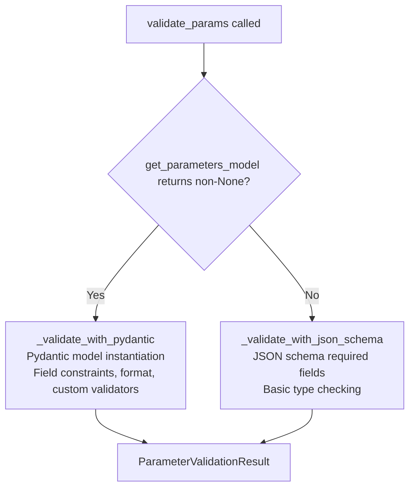
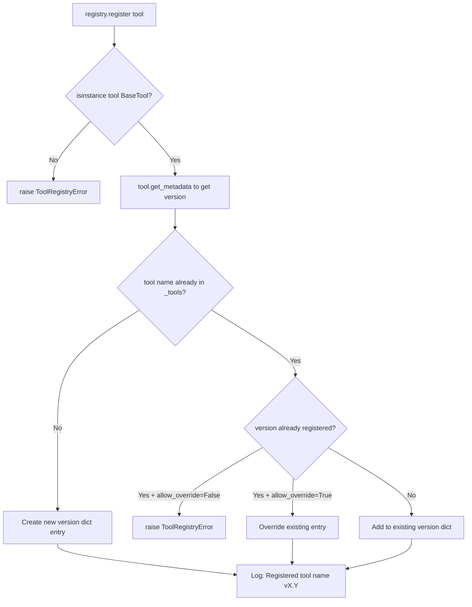
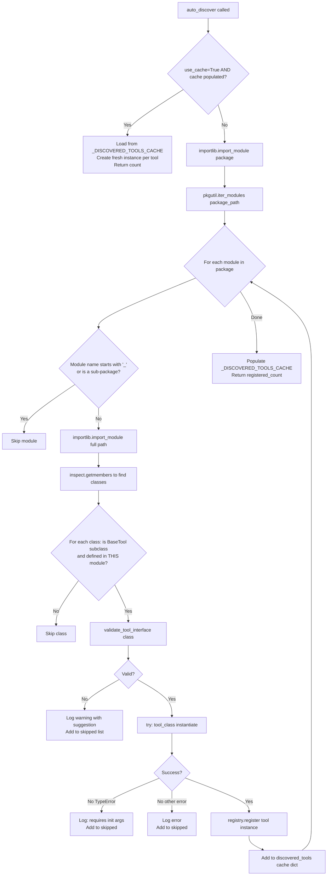
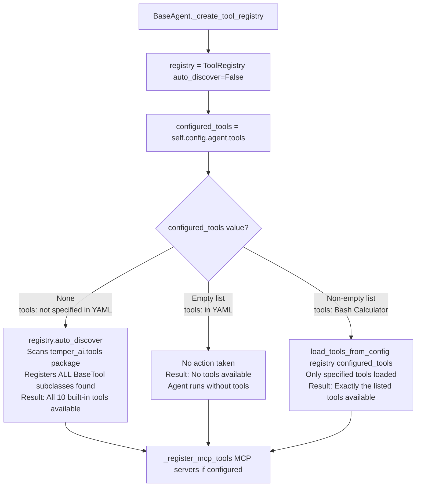
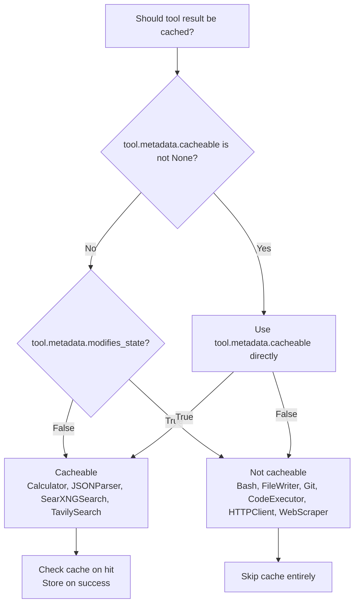
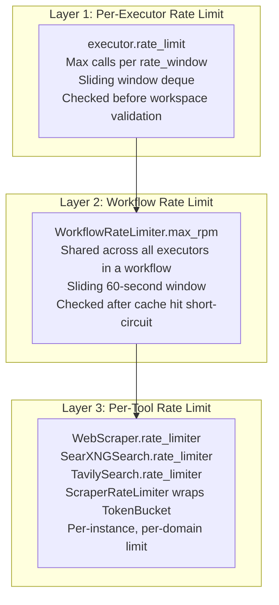
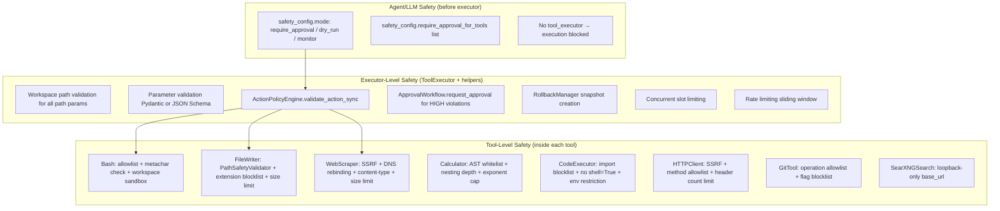
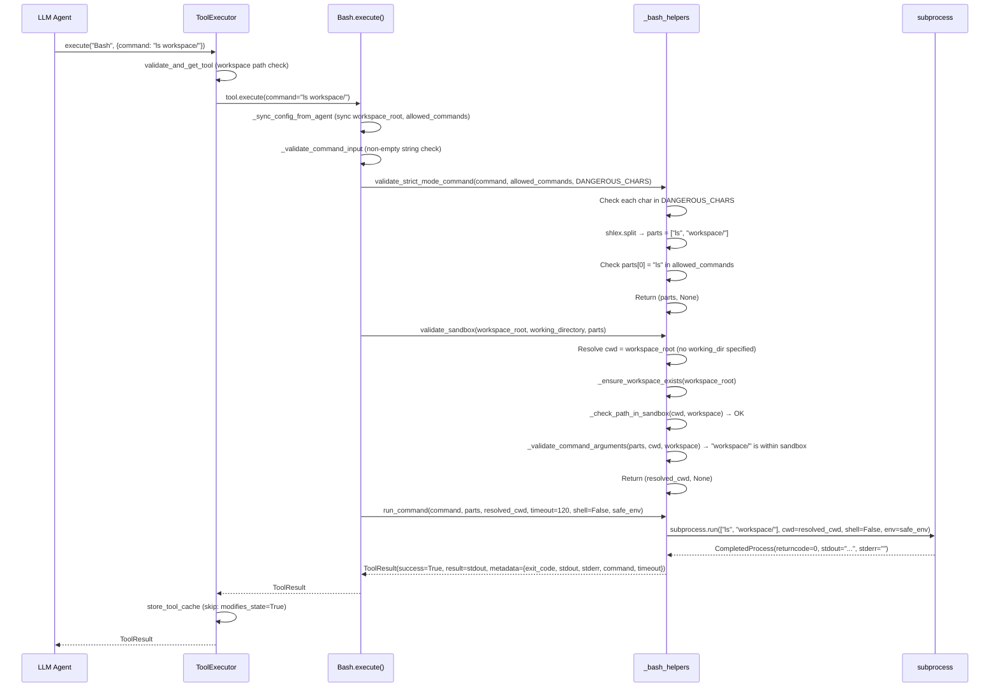
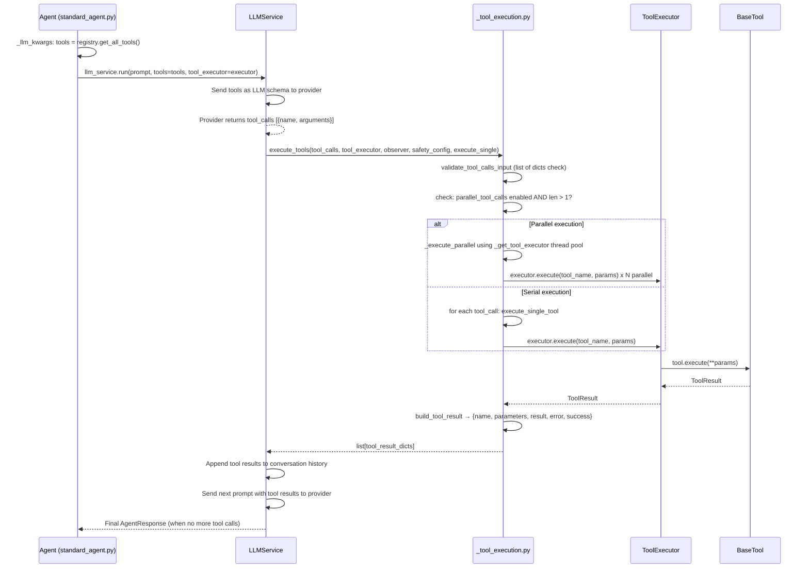

# Tool System Architecture

**Document:** 08-Tool-System
**System:** temper-ai (Meta-Autonomous Framework)
**Scope:** Complete tool subsystem — registry, discovery, execution pipeline, built-in tools, safety integration, rate limiting, and caching
**Files Analyzed:** `temper_ai/tools/` (24 source files)
**Date:** 2026-02-22

---

## Table of Contents

1. [Executive Summary](#1-executive-summary)
2. [System Architecture Overview](#2-system-architecture-overview)
3. [BaseTool Abstract Base Class](#3-basetool-abstract-base-class)
4. [ParameterSanitizer Utility](#4-parametersanitizer-utility)
5. [ToolRegistry — Registration and Discovery](#5-toolregistry--registration-and-discovery)
6. [Tool Auto-Discovery Logic](#6-tool-auto-discovery-logic)
7. [ToolExecutor — The Execution Pipeline](#7-toolexecutor--the-execution-pipeline)
8. [Tool Result Caching](#8-tool-result-caching)
9. [Rate Limiting Architecture](#9-rate-limiting-architecture)
10. [Safety Integration](#10-safety-integration)
11. [Tool Configuration Schema](#11-tool-configuration-schema)
12. [Tool Loader — YAML to Instances](#12-tool-loader--yaml-to-instances)
13. [Built-in Tool Reference](#13-built-in-tool-reference)
    - [Bash](#131-bash-tool)
    - [Calculator](#132-calculator-tool)
    - [CodeExecutor](#133-codeexecutortool)
    - [FileWriter](#134-filewriter-tool)
    - [Git](#135-gittool)
    - [HTTPClient](#136-httpclienttool)
    - [JSONParser](#137-jsonparsertool)
    - [WebScraper](#138-webscraper-tool)
    - [SearXNGSearch](#139-searxngsearch-tool)
    - [TavilySearch](#1310-tavilysearch-tool)
14. [LLM Tool-Call Integration](#14-llm-tool-call-integration)
15. [Design Patterns and Decisions](#15-design-patterns-and-decisions)
16. [Extension Guide](#16-extension-guide)
17. [Observations and Recommendations](#17-observations-and-recommendations)

---

## 1. Executive Summary

**System Name:** Tool System (`temper_ai/tools/`)
**Purpose:** Provides a safe, composable, and observable interface for AI agents to interact with external systems — files, shells, the web, APIs, and code execution — through a unified registry-executor model with layered security.
**Technology Stack:** Python 3.12, Pydantic v2, httpx, BeautifulSoup4, subprocess, threading, concurrent.futures
**Scope of Analysis:** All 24 files in `temper_ai/tools/`, plus agent-side integration in `temper_ai/agent/base_agent.py` and `temper_ai/llm/_tool_execution.py`

The tool system is organized into three main concerns:

1. **Discovery and Registry** — Tools are discovered automatically from the `temper_ai.tools` package via introspection, or loaded from YAML config. The `ToolRegistry` stores versioned instances in a thread-safe dict.

2. **Execution Pipeline** — `ToolExecutor` orchestrates every tool call through a fixed pipeline: workspace validation → parameter validation → safety policy check → concurrent slot acquisition → workflow rate limit check → cache lookup → subprocess/network execution → result caching → rollback on failure.

3. **Safety Enforcement** — Multiple overlapping safety layers: command allowlists, workspace sandboxing, SSRF blocking, blocked import scanning, AST-based expression evaluation, file extension blocklists, DNS rebinding protection, and integration with the `ActionPolicyEngine`.

---

## 2. System Architecture Overview

### 2.1 High-Level Component Map

```
┌─────────────────────────────────────────────────────────────────────────┐
│                         LLM Service / Agent                             │
│   llm/_tool_execution.py                                                │
│   execute_tools() → execute_single_tool() → execute_via_executor()      │
└───────────────────────────────┬─────────────────────────────────────────┘
                                │ tool_executor.execute(tool_name, params)
                                ▼
┌─────────────────────────────────────────────────────────────────────────┐
│                         ToolExecutor                                    │
│   tools/executor.py + _executor_helpers.py + _executor_config.py       │
│                                                                          │
│  ┌──────────────────────────────────────────────────────────────────┐  │
│  │  Execution Pipeline                                               │  │
│  │  1. Workspace path validation (_executor_helpers.py)             │  │
│  │  2. Parameter validation  (BaseTool.validate_params)             │  │
│  │  3. Policy check          (ActionPolicyEngine.validate_sync)     │  │
│  │  4. Snapshot creation     (RollbackManager.create_snapshot)      │  │
│  │  5. Cache lookup          (ToolResultCache.get)                  │  │
│  │  6. Workflow rate limit   (WorkflowRateLimiter.acquire)          │  │
│  │  7. Concurrent slot       (acquire_concurrent_slot)              │  │
│  │  8. Tool.execute()        (ThreadPoolExecutor submit)            │  │
│  │  9. Cache store           (ToolResultCache.put)                  │  │
│  │ 10. Auto-rollback on fail (RollbackManager.execute_rollback)     │  │
│  └──────────────────────────────────────────────────────────────────┘  │
└───────┬────────────────────────────────────────────────────────────┬────┘
        │ registry.get(name)                                         │
        ▼                                                            ▼
┌────────────────────┐                                   ┌──────────────────────┐
│   ToolRegistry     │                                   │  ToolResultCache     │
│   tools/registry.py│                                   │  tools/tool_cache.py │
│                    │                                   │  LRU + TTL           │
│  _tools: dict[     │                                   │  SHA-256 keys        │
│   name → {         │                                   └──────────────────────┘
│    version → tool  │
│   }]               │
└───────┬────────────┘
        │ auto_discover() / register()
        ▼
┌────────────────────────────────────────────────────────────────────────┐
│                       BaseTool Implementations                         │
├─────────────┬───────────┬──────────────┬────────────┬─────────────────┤
│  Bash       │Calculator │CodeExecutor  │FileWriter  │  Git            │
│  HTTPClient │JSONParser │WebScraper    │SearXNG     │  Tavily         │
└─────────────┴───────────┴──────────────┴────────────┴─────────────────┘
        │
        │ Safety Integration
        ▼
┌───────────────────────────────────────────────────────────────────────┐
│  temper_ai/safety/                                                    │
│  ActionPolicyEngine → validate_action_sync()                          │
│  RollbackManager → create_snapshot() / execute_rollback()             │
│  ApprovalWorkflow → request_approval()                                │
│  token_bucket.TokenBucket (used by WebScraper rate limiter)           │
└───────────────────────────────────────────────────────────────────────┘
```

### 2.2 Class Hierarchy Diagram

```mermaid
classDiagram
    class BaseTool {
        <<abstract>>
        +config: dict
        +name: str
        +description: str
        +version: str
        +get_metadata()* ToolMetadata
        +get_parameters_schema()* dict
        +get_parameters_model() BaseModel|None
        +get_result_schema() dict|None
        +execute(**kwargs)* ToolResult
        +safe_execute(**kwargs) ToolResult
        +validate_params(params) ParameterValidationResult
        +to_llm_schema() dict
        -_validate_with_pydantic(params, model) ParameterValidationResult
        -_validate_with_json_schema(params) ParameterValidationResult
    }

    class Bash {
        +shell_mode: bool
        +allowed_commands: set[str]
        +workspace_root: Path
        +default_timeout: int
        +SAFE_ENV_VARS: set[str]
        +execute(**kwargs) ToolResult
        -_sync_config_from_agent()
        -_validate_command_input(cmd) tuple
        -_validate_command_mode(cmd) tuple
    }

    class Calculator {
        +SAFE_OPERATORS: dict
        +SAFE_FUNCTIONS: dict
        +execute(**kwargs) ToolResult
        -_safe_eval(node, depth) Any
        -_eval_binop(node, depth) Any
        -_eval_call(node, depth) Any
    }

    class CodeExecutorTool {
        +execute(**kwargs) ToolResult
    }

    class FileWriter {
        +MAX_FILE_SIZE: int
        +path_validator: PathSafetyValidator
        +execute(**kwargs) ToolResult
        -_validate_inputs(file_path, content) ToolResult|None
        -_validate_path(file_path, overwrite, create_dirs) tuple
        -_normalize_params(params) dict
    }

    class GitTool {
        +execute(**kwargs) ToolResult
    }

    class HTTPClientTool {
        +execute(**kwargs) ToolResult
    }

    class JSONParserTool {
        +execute(**kwargs) ToolResult
        -_op_parse(data, kwargs) ToolResult
        -_op_extract(data, kwargs) ToolResult
        -_op_validate(data, kwargs) ToolResult
        -_op_format(data, kwargs) ToolResult
    }

    class WebScraper {
        +rate_limiter: ScraperRateLimiter
        +MAX_CONTENT_SIZE: int
        +execute(**kwargs) ToolResult
        -_validate_url_input(url) ToolResult|None
        -_fetch_with_redirect_validation(url, headers, timeout) tuple
        -_extract_text(html) str
    }

    class SearXNGSearch {
        +base_url: str
        +rate_limiter: ScraperRateLimiter
        +execute(**kwargs) ToolResult
    }

    class TavilySearch {
        +rate_limiter: ScraperRateLimiter
        +execute(**kwargs) ToolResult
        -_get_api_key() str
    }

    BaseTool <|-- Bash
    BaseTool <|-- Calculator
    BaseTool <|-- CodeExecutorTool
    BaseTool <|-- FileWriter
    BaseTool <|-- GitTool
    BaseTool <|-- HTTPClientTool
    BaseTool <|-- JSONParserTool
    BaseTool <|-- WebScraper
    BaseTool <|-- SearXNGSearch
    BaseTool <|-- TavilySearch
```



### 2.3 Module Dependency Graph

```
temper_ai/tools/__init__.py
  └── .base          (BaseTool, ToolMetadata, ToolParameter, ToolResult)
  └── .bash          (Bash)
  └── .executor      (ToolExecutor)
  └── .registry      (ToolRegistry, ToolRegistryError)

temper_ai/tools/registry.py
  └── ._registry_helpers    (auto_discover, load_from_config, validation)
  └── .base                 (BaseTool)
  └── temper_ai.shared.utils.exceptions (ToolRegistryError)

temper_ai/tools/executor.py
  └── ._executor_config     (ToolExecutorConfig)
  └── ._executor_helpers    (validate_and_get_tool, check_rate_limit, execute_with_timeout, ...)
  └── .tool_cache           (ToolResultCache) [lazy import]
  └── .registry             (ToolRegistry)
  └── temper_ai.safety.*    [lazy imports: ActionPolicyEngine, RollbackManager, ApprovalWorkflow]

temper_ai/tools/bash.py
  └── ._bash_helpers        (validate_sandbox, validate_strict_mode_command, run_command, get_safe_env)
  └── .constants            (DEFAULT_BASH_TIMEOUT, MAX_BASH_TIMEOUT)

temper_ai/tools/web_scraper.py
  └── temper_ai.safety.token_bucket (TokenBucket) [lazy]
  └── httpx, BeautifulSoup

temper_ai/tools/searxng_search.py + tavily_search.py
  └── ._search_helpers      (SearchResponse, SearchResultItem)
  └── .web_scraper          (ScraperRateLimiter)
```

---

## 3. BaseTool Abstract Base Class

**Location:** `temper_ai/tools/base.py`

`BaseTool` is the contract every tool must satisfy. It is an ABC with two pure-abstract methods and a rich set of concrete helpers.

### 3.1 Core Data Models

```python
class ToolParameter(BaseModel):
    name: str
    type: str          # "string", "number", "boolean", "object", "array"
    description: str
    required: bool = True
    default: Any | None = None
    enum: list[Any] | None = None

class ToolMetadata(BaseModel):
    name: str
    description: str
    version: str = "1.0"
    category: str | None = None
    requires_network: bool = False
    requires_credentials: bool = False
    modifies_state: bool = True    # Controls snapshot eligibility + cache eligibility
    cacheable: bool | None = None  # None = auto from modifies_state

class ToolResult(BaseModel):
    success: bool
    result: Any | None = None
    error: str | None = None
    metadata: dict[str, Any] = Field(default_factory=dict)
```

The `modifies_state` flag in `ToolMetadata` is the single most important metadata field. It drives two independent subsystems:

- **Rollback snapshots:** If `modifies_state=True`, `ToolExecutor` requests a snapshot from `RollbackManager` before execution.
- **Cache eligibility:** If `modifies_state=False` (and `cacheable` is `None`), results are cached by `ToolResultCache`.

### 3.2 Abstract Interface Contract

Every tool must implement exactly two abstract methods:

```python
@abstractmethod
def get_metadata(self) -> ToolMetadata:
    """Return immutable tool identity and capability flags."""

@abstractmethod
def get_parameters_schema(self) -> dict[str, Any]:
    """Return JSON Schema (OpenAI function-calling format) for parameters."""
```

And one non-abstract but expected method for tools with complex validation:

```python
def get_parameters_model(self) -> type[BaseModel] | None:
    """Return optional Pydantic model for comprehensive parameter validation."""
    return None  # Default: falls back to JSON Schema validation
```

### 3.3 Parameter Validation — Two-Tier System

`BaseTool` implements a two-tier parameter validation strategy via `validate_params()`:

**Tier 1: Pydantic Model Validation (preferred)**
- Tools override `get_parameters_model()` to return a Pydantic `BaseModel` class.
- Provides: type coercion, constraints (`gt=0`, `le=300`), format validators (`HttpUrl`), custom `@field_validator` methods, nested object validation.
- Used by: `WebScraper`, `SearXNGSearch`, `TavilySearch`.

**Tier 2: JSON Schema Validation (fallback)**
- When `get_parameters_model()` returns `None`, the base class falls back to `_validate_with_json_schema()`.
- Checks: required fields, basic type matching against the JSON schema `properties`.
- Used by: `Bash`, `Calculator`, `FileWriter`, `GitTool`, `HTTPClientTool`, `JSONParserTool`, `CodeExecutorTool`.



### 3.4 `safe_execute()` — No-Exception Contract

`safe_execute()` wraps `execute()` to guarantee it never raises. This is enforced via M-33:

1. Calls `validate_params()` first. If invalid, returns `ToolResult(success=False, error=...)` immediately.
2. Calls `execute()`. Catches `RuntimeError`, `TypeError`, `ValueError`, `OSError`, `KeyError`, `AttributeError` and wraps them in a failed `ToolResult`.
3. Callers never need `try/except` around tool invocations.

Note: `ToolExecutor.execute()` calls `tool.execute()` directly (not `safe_execute()`), because `ToolExecutor` has its own exception wrapper at the `execute_tool_internal()` level in `_executor_helpers.py`. The no-exception contract is thus maintained at both levels.

### 3.5 LLM Schema Conversion

`to_llm_schema()` converts a tool to the OpenAI function-calling format, which is what gets passed to LLM providers:

```python
def to_llm_schema(self) -> dict[str, Any]:
    return {
        "type": "function",
        "function": {
            "name": self.name,
            "description": self.description,
            "parameters": self.get_parameters_schema()  # JSON Schema object
        }
    }
```

This schema is used by `ToolRegistry.get_all_tool_schemas()` and ultimately sent to the LLM in every request that has tools enabled.

---

## 4. ParameterSanitizer Utility

**Location:** `temper_ai/tools/base.py` (lines 405–742)

`ParameterSanitizer` is a static utility class providing defense-in-depth input sanitization. It is used by tools that accept user-controlled strings.

### 4.1 Path Sanitization

```python
ParameterSanitizer.sanitize_path(path, allowed_base=None)
```

Pipeline:
1. Rejects null bytes (`\x00`) — directory traversal trick.
2. Normalizes backslashes to forward slashes (cross-platform consistency).
3. Checks `Path.parts` for `..` segments before resolving — catches pre-resolution traversal.
4. Resolves symlinks via `Path.resolve()`.
5. If `allowed_base` provided, calls `normalized.relative_to(allowed)` — raises `SecurityError` on escape.

### 4.2 Command Sanitization

```python
ParameterSanitizer.sanitize_command(command, allowed_commands=None, max_length=None)
```

Pipeline:
1. Rejects null bytes.
2. Enforces `MAX_COMMAND_LENGTH` (from `shared.constants.limits`).
3. Applies Unicode NFKC normalization — prevents homoglyph bypass (e.g., using Unicode lookalikes to hide `;`).
4. Checks for dangerous shell metacharacters: `;`, `|`, `&`, `$`, `` ` ``, `\n`, `\r`, `>`, `<`.
5. Checks for dangerous regex patterns: `$()`, `${}`, brace expansion, brace range, hex escapes.
6. If `allowed_commands` provided, splits and validates command name against whitelist.

**Security note:** The docstring explicitly states this does NOT make `shell=True` safe. Always use `subprocess.run(..., shell=False)` with argument lists.

### 4.3 SQL Input Sanitization

```python
ParameterSanitizer.sanitize_sql_input(value, param_name)
```

A defense-in-depth check (not a primary defense — parameterized queries are). Detects: `UNION SELECT`, `DROP`, `CREATE`, `EXEC`, `--` comments, `';` terminators, `' OR '1'='1'` boolean injection. Note: This is case-insensitive and checks `value.upper()`.

### 4.4 Length Validators

```python
ParameterSanitizer.validate_string_length(value, max_length, param_name)
ParameterSanitizer.validate_integer_range(value, minimum, maximum, param_name)
```

Used to prevent DoS via oversized input. The string validator raises `TypeError` for non-strings and `ValueError` for excessive length. The integer validator explicitly excludes `bool` (since `isinstance(True, int)` is `True` in Python).

---

## 5. ToolRegistry — Registration and Discovery

**Location:** `temper_ai/tools/registry.py`, `temper_ai/tools/_registry_helpers.py`

### 5.1 Internal Storage Structure

```python
_tools: dict[str, dict[str, BaseTool]]
#             name    version  instance
```

The registry stores multiple versions of each tool, selected by semantic version comparison. `get()` without a version argument always returns the latest version via `get_latest_version()`, which parses dotted version strings into tuples of integers for comparison.

### 5.2 Thread Safety

- The registry maintains a `threading.Lock()` for all mutating operations (`register`, `unregister`, `clear`).
- A separate module-level `threading.RLock()` (`_GLOBAL_LOCK`) protects the global singleton and the discovery cache.
- Read operations (`get`, `list_tools`, `get_all_tools`) do not hold the lock — they read from the dict which is safe given Python's GIL for simple reads.

### 5.3 Registration Flow



### 5.4 ToolRegistry Method Reference

| Method | Purpose | Notes |
|---|---|---|
| `register(tool, allow_override)` | Register a `BaseTool` instance | Validates `isinstance(BaseTool)` |
| `register_multiple(tools)` | Batch register | Iterates `register()` |
| `unregister(tool_name, version)` | Remove tool or specific version | Raises if not found |
| `get(name, version)` | Retrieve tool by name/version | Returns `None` if not found |
| `has(name, version)` | Existence check | Thread-safe read |
| `list_tools()` | Return all tool names | Returns list of strings |
| `get_all_tools()` | Return latest-version dict | Used for LLM schema building |
| `get_tool_schema(name)` | Get single tool's LLM schema | Raises if not found |
| `get_all_tool_schemas()` | All tools in OpenAI format | Used for every LLM call |
| `auto_discover(package, use_cache)` | Scan package for tools | Default: `temper_ai.tools` |
| `load_from_config(config_name)` | Load tool from YAML | Via `ConfigLoader` |
| `load_all_from_configs()` | Load all YAML tools | Iterates `ConfigLoader.list_configs("tool")` |
| `clear()` | Remove all tools | Testing utility |
| `list_available_tools()` | Detailed metadata dict | For CLI/API display |
| `get_registration_report()` | Debug string report | Shows all versions |

### 5.5 Global Singleton

```python
_GLOBAL_REGISTRY: Optional[ToolRegistry] = None
_GLOBAL_LOCK = threading.RLock()

def get_global_registry() -> ToolRegistry:
    """Get or create global singleton registry with auto-discovered tools."""
    with _GLOBAL_LOCK:
        if _GLOBAL_REGISTRY is None:
            _GLOBAL_REGISTRY = ToolRegistry(auto_discover=False)
            _GLOBAL_REGISTRY.auto_discover(use_cache=True)
    return _GLOBAL_REGISTRY
```

The global registry is used for process-wide access. Individual agents create their own `ToolRegistry` instances (via `BaseAgent._create_tool_registry()`) to avoid cross-agent tool config contamination.

### 5.6 Method-Attachment Pattern

`ToolRegistry` uses an unusual pattern to comply with a god-class method count limit: helper functions are defined as module-level functions, then attached to the class:

```python
def _list_all(self: ToolRegistry) -> list[str]:
    return self.list_tools()

ToolRegistry.list_all = _list_all  # type: ignore[attr-defined]
```

This preserves backward compatibility (callers can still do `registry.list_all()`) while keeping the in-class method count below the architectural threshold of 20.

---

## 6. Tool Auto-Discovery Logic

**Location:** `temper_ai/tools/_registry_helpers.py` (lines 218–283)

Auto-discovery is the mechanism that populates the registry by scanning the `temper_ai.tools` Python package without requiring explicit registration.

### 6.1 Discovery Algorithm



Key constraints enforced during discovery:
- Skips modules whose names start with `_` (private/helper modules like `_bash_helpers.py`, `_schemas.py`)
- Skips sub-packages
- Only registers classes defined in that specific module (`obj.__module__ == module.__name__`)
- Skips `BaseTool` itself
- Validates interface before attempting instantiation

### 6.2 Discovery Cache

The `_DISCOVERED_TOOLS_CACHE: dict[str, BaseTool] | None` module-level variable is populated on first discovery and reused for subsequent registries. This avoids re-scanning the filesystem on every agent initialization.

**Critical:** The cache stores tool instances, but when loading from cache, the registry creates a **fresh instance** via `type(tool_instance)()`:

```python
try:
    fresh = type(tool_instance)()
except TypeError:
    fresh = tool_instance  # Fallback: share if constructor needs args
```

This prevents cross-agent configuration contamination — for example, if Agent A sets `Bash.allowed_commands = {"rm"}`, Agent B should not inherit that mutation.

### 6.3 Auto-Discovery vs. Explicit Configuration — The Three Modes

This is the core behavioral difference controlled by `agent.tools` in YAML config:



**Concrete examples:**

```yaml
# Mode 1: tools key absent → auto-discover all tools
agent:
  name: researcher
  # tools: not present → None in Python → triggers auto_discover()

# Mode 2: explicit empty list → zero tools
agent:
  name: reader
  tools: []   # → empty list → no tools, no discovery

# Mode 3: explicit list → only named tools
agent:
  name: calculator_agent
  tools:
    - name: Calculator
    - name: Bash
      config:
        allowed_commands: [ls, cat]
```

---

## 7. ToolExecutor — The Execution Pipeline

**Location:** `temper_ai/tools/executor.py`, `temper_ai/tools/_executor_helpers.py`, `temper_ai/tools/_executor_config.py`

`ToolExecutor` is the central orchestrator. It manages thread pools, applies all safety layers, and coordinates every tool call from the LLM.

### 7.1 Configuration (`ToolExecutorConfig`)

```python
@dataclass
class ToolExecutorConfig:
    default_timeout: int = DEFAULT_TIMEOUT_SECONDS    # 600s
    max_workers: int = MIN_WORKERS                    # Thread pool size
    max_concurrent: int | None = None                 # Global concurrency cap
    rate_limit: int | None = None                     # Calls per rate_window
    rate_window: float = RATE_LIMIT_WINDOW_SECOND     # 1.0 seconds
    rollback_manager: RollbackManager | None = None
    policy_engine: ActionPolicyEngine | None = None
    approval_workflow: ApprovalWorkflow | None = None
    enable_auto_rollback: bool = True
    workspace_root: str | None = None
    enable_tool_cache: bool = False
    tool_cache_max_size: int | None = None
    tool_cache_ttl: int | None = None
```

All safety components (`rollback_manager`, `policy_engine`, `approval_workflow`) are optional. When absent, the corresponding pipeline stage is a no-op.

### 7.2 Thread Pool Architecture

`ToolExecutor` maintains two `ThreadPoolExecutor` instances:

1. `_executor` (prefix: `tool-exec`) — Runs tool `execute()` calls. Size = `max_workers` (default: `MIN_WORKERS`).
2. `_approval_executor` (prefix: `tool-approval`) — Runs approval polling. Size = `MIN_WORKERS`. This separation prevents approval blocking from starving tool execution threads.

Cleanup is guaranteed via `weakref.finalize()`:

```python
self._finalizer = weakref.finalize(
    self,
    self._cleanup_executor,
    self._executor,
    self._approval_executor,
)
```

This ensures thread pools are shut down even if `shutdown()` is never called explicitly. The static `_cleanup_executor` method calls `pool.shutdown(wait=True, cancel_futures=True)` on both pools.

### 7.3 Complete Execution Pipeline

```mermaid
flowchart TD
    A[executor.execute tool_name params timeout context] --> B[_resolve_defaults\nparams = {} if None\ntimeout = default_timeout if None\ncontext = {} if None]
    B --> C[check_rate_limit\nSliding window deque check]
    C -- RateLimitError --> D[Return ToolResult success=False\nrate limit exceeded]
    C -- OK --> E[validate_and_get_tool\ntool_name, params]
    E --> F{Workspace root configured?}
    F -- Yes --> G[Validate path params\npath, file_path, directory, filename, output_path\nagainst workspace_root]
    G -- Outside workspace --> H[Return ToolResult success=False\nAccess denied]
    G -- OK --> I[registry.get tool_name]
    F -- No --> I
    I -- None --> J[Return ToolResult success=False\nTool not found]
    I -- BaseTool --> K[tool.validate_params params\nPydantic or JSON Schema]
    K -- Invalid --> L[Return ToolResult success=False\nInvalid parameters]
    K -- Valid --> M[validate_policy\npolicy_engine.validate_action_sync]
    M -- Blocked --> N[Return ToolResult success=False\nBlocked by policy]
    M -- Needs approval --> O[approval_workflow.request_approval\nwait_for_approval polls on approval_executor]
    O -- Rejected --> P[Return ToolResult success=False\nNot approved]
    O -- Approved --> Q[create_snapshot\nrollback_manager.create_snapshot if modifies_state]
    M -- Allowed --> Q
    Q --> R[execute_with_timeout]
    R --> S[check_tool_cache\nToolResultCache.get tool_name params]
    S -- Cache hit --> T[Return cached ToolResult\nSkips rate limit consume and concurrent slot]
    S -- Cache miss --> U[check_workflow_rate_limit\nWorkflowRateLimiter.acquire]
    U -- RateLimitError --> V[Return ToolResult success=False]
    U -- OK --> W[acquire_concurrent_slot\nAtomic check+increment]
    W -- At limit --> X[Return ToolResult success=False\nConcurrent limit reached]
    W -- OK --> Y[executor._executor.submit\nexecute_tool_internal tool params\nSubmit to ThreadPoolExecutor]
    Y --> Z[future.result timeout=timeout]
    Z -- TimeoutError --> AA[Cancel future\nhandle_timeout_rollback if snapshot\nReturn ToolResult timed out]
    Z -- OK --> AB[result.metadata execution_time_seconds]
    AB --> AC{result.success = False AND snapshot AND enable_auto_rollback?}
    AC -- Yes --> AD[handle_auto_rollback\nrollback_manager.execute_rollback snapshot.id]
    AC -- No --> AE[store_tool_cache\nToolResultCache.put if cacheable and success]
    AD --> AE
    AE --> AF[release_concurrent_slot\nDecrement counter]
    AF --> AG[Return ToolResult]
```

### 7.4 Workspace Path Validation

**Location:** `_executor_helpers.py:validate_workspace_path()`

Before any tool is dispatched, the executor checks specific parameter keys for path values and validates them against the `workspace_root`:

```python
_WORKSPACE_PATH_KEYS = ("path", "file_path", "directory", "filename", "output_path")
```

For each such key in `params`:
1. Rejects null bytes.
2. Calls `Path(file_path).resolve()` to normalize symlinks.
3. Calls `resolved.relative_to(workspace_resolved)` — raises `ValueError` if path escapes sandbox.

This check runs independently of any individual tool's own path validation, providing a redundant outer layer.

### 7.5 Concurrent Execution

**Concurrency tracking** uses an atomic counter protected by `threading.Lock()`:

```python
def acquire_concurrent_slot(executor) -> bool:
    with executor._concurrent_lock:
        if executor.max_concurrent is not None and executor._concurrent_count >= executor.max_concurrent:
            raise RateLimitError(...)
        executor._concurrent_count += 1
    return True
```

The `release_concurrent_slot()` decrements in the `finally` block of `execute_with_timeout()`, ensuring it always runs even on exceptions or timeouts.

### 7.6 Per-Executor Rate Limiting

Uses a sliding window implemented with a `collections.deque[float]` of timestamps:

```python
def check_rate_limit(executor) -> None:
    if executor.rate_limit is None:
        return
    with executor._rate_limit_lock:
        now = time.time()
        cutoff = now - executor.rate_window
        # Expire old timestamps
        while executor._execution_times and executor._execution_times[0] < cutoff:
            executor._execution_times.popleft()
        if len(executor._execution_times) >= executor.rate_limit:
            raise RateLimitError(...)
        executor._execution_times.append(now)
```

This runs before workspace validation, short-circuiting expensive operations when the caller is over the limit.

### 7.7 Batch Execution

`execute_batch(executions, timeout, overall_timeout)` submits all tool calls to `_executor` simultaneously:

```python
for idx, (tool_name, params) in enumerate(executions):
    future = executor._executor.submit(executor.execute, tool_name, params, timeout)
    futures[future] = idx

for future in concurrent.futures.as_completed(futures, timeout=overall_timeout):
    results[idx] = future.result()
```

On `overall_timeout` expiry, remaining futures are cancelled and replaced with timeout `ToolResult` objects. This enables parallel tool execution within a single LLM step.

### 7.8 Context Manager Support

```python
with ToolExecutor(registry=registry) as executor:
    result = executor.execute("Calculator", {"expression": "2+2"})
# Automatically calls executor.shutdown(wait=True) on exit
```

`__del__` logs a warning and calls `shutdown(wait=False, cancel_futures=True)` if the executor is garbage-collected without explicit shutdown.

---

## 8. Tool Result Caching

**Location:** `temper_ai/tools/tool_cache.py`

`ToolResultCache` is an LRU (Least Recently Used) cache with TTL expiry for read-only tool results. It was introduced in roadmap item R0.3.

### 8.1 Eligibility Rules



Results are only stored if `result.success == True`. Failed results are never cached.

### 8.2 Cache Key Generation

```python
def _build_key(self, tool_name: str, params: dict[str, Any]) -> str:
    raw = tool_name + CACHE_KEY_SEPARATOR + json.dumps(
        params, sort_keys=True, default=str,
    )
    return hashlib.sha256(raw.encode()).hexdigest()
```

- `sort_keys=True` ensures parameter order does not affect cache identity.
- `default=str` handles non-JSON-serializable parameter types.
- SHA-256 produces a 64-character hex key, avoiding unbounded key growth.

### 8.3 LRU Eviction

The internal storage is `collections.OrderedDict`. On every cache hit, the entry is moved to the end (`move_to_end(key)`). On insertion, if `len > max_size`, `popitem(last=False)` removes the oldest (front) entry.

### 8.4 TTL Expiry

On every `get()` call, if the entry exists, `_is_expired()` checks `(time.time() - entry.timestamp) > ttl_seconds`. Expired entries are deleted on access — there is no background cleanup thread.

### 8.5 Cache Statistics

```python
cache.stats() → {
    "hits": int,
    "misses": int,
    "size": int,
    "max_size": int,
    "evictions": int,
    "ttl_seconds": int
}
```

### 8.6 Invalidation API

```python
cache.invalidate(tool_name=None)  # None → clear all
cache.invalidate("Calculator")     # Remove only Calculator's entries
cache.clear()                      # Remove all entries (no stats tracking)
```

### 8.7 Default Configuration

```python
DEFAULT_CACHE_MAX_SIZE = ...   # From tool_cache_constants.py
DEFAULT_CACHE_TTL_SECONDS = ... # From tool_cache_constants.py
```

Enabled via `ToolExecutorConfig(enable_tool_cache=True)`. Disabled by default.

---

## 9. Rate Limiting Architecture

The system has three independent rate limiting mechanisms that stack on top of each other.

### 9.1 Overview Diagram



### 9.2 Per-Executor Rate Limit (`ToolExecutor`)

- **Mechanism:** Sliding window using a timestamp `deque`.
- **Scope:** Per `ToolExecutor` instance (per agent, per stage).
- **Config:** `ToolExecutorConfig.rate_limit` (calls), `rate_window` (seconds).
- **Behavior:** Raises `RateLimitError` immediately if limit exceeded.
- **Position in pipeline:** Very first check, before parameter validation.

### 9.3 Workflow-Level Rate Limiter (`WorkflowRateLimiter`)

**Location:** `temper_ai/tools/workflow_rate_limiter.py`

A sliding-window limiter shared across all tool executors within a single workflow run. Introduced in R0.9.

```python
class WorkflowRateLimiter:
    def __init__(self, max_rpm=DEFAULT_MAX_RPM, block_on_limit=True, max_wait_seconds=DEFAULT_MAX_WAIT_SECONDS):
        self._timestamps: deque[float] = deque()
        self._lock = threading.Lock()

    def acquire(self) -> bool:
        deadline = time.monotonic() + self._max_wait_seconds
        while True:
            with self._lock:
                self._cleanup_window()  # Remove entries older than 60s
                if len(self._timestamps) < self._max_rpm:
                    self._timestamps.append(time.time())
                    return True
            # Over limit
            if not self._block_on_limit:
                raise RateLimitError(...)
            # Calculate sleep until oldest entry expires
            sleep_for = (oldest + 60) - time.time()
            time.sleep(sleep_for)  # intentional: rate-limit wait
```

Key design points:
- **Blocking mode** (`block_on_limit=True`): The caller sleeps until a slot becomes available or `max_wait_seconds` is exceeded.
- **Non-blocking mode**: Raises `RateLimitError` immediately.
- **Cache hit bypass:** Cache hits in `execute_with_timeout()` return before calling `check_workflow_rate_limit()`, so cached results do not consume rate limit quota.
- The limiter is attached to `ToolExecutor` as `executor.workflow_rate_limiter` and injected externally by the workflow runtime.

### 9.4 Per-Tool Rate Limit (`ScraperRateLimiter`)

**Location:** `temper_ai/tools/web_scraper.py` (lines 321–358)

Used by `WebScraper`, `SearXNGSearch`, and `TavilySearch`. Wraps `temper_ai.safety.token_bucket.TokenBucket`:

```python
class ScraperRateLimiter:
    def __init__(self, max_requests, time_window):
        self._bucket = TokenBucket(RateLimit(
            max_tokens=max_requests,
            refill_rate=max_requests / time_window,
            refill_period=1.0,
        ))

    def can_proceed(self) -> bool:
        return self._bucket.peek(1)

    def record_request(self) -> None:
        self._bucket.consume(1)

    def wait_time(self) -> float:
        return self._bucket.get_wait_time(1)
```

The token bucket refills continuously at `max_requests / time_window` tokens per second. Default rates:
- `WebScraper`: 10 requests/60 seconds
- `SearXNGSearch`: 10 requests/60 seconds
- `TavilySearch`: 5 requests/60 seconds

---

## 10. Safety Integration

### 10.1 ActionPolicyEngine Integration

**Location:** `_executor_helpers.py:validate_policy()`

When `executor.policy_engine` is set, every tool call is validated synchronously before execution:

```python
def validate_policy(executor, tool_name, params, context) -> ToolResult | None:
    action = {"tool": tool_name, "params": params}
    ctx = PolicyExecutionContext(
        agent_id=context.get("agent_id", "unknown"),
        workflow_id=context.get("workflow_id", "unknown"),
        stage_id=context.get("stage_id", "unknown"),
        action_type="tool_execution",
        action_data={"tool_name": tool_name, "params": params},
        metadata={...}  # autonomy_config, autonomy_level from context
    )
    enforcement = executor.policy_engine.validate_action_sync(action=action, context=ctx)

    if not enforcement.allowed:
        return ToolResult(success=False, error=f"Blocked by policy: {enforcement.violations[0].message}")

    if enforcement.has_blocking_violations() and executor.approval_workflow:
        # Request human approval
        approval_request = executor.approval_workflow.request_approval(...)
        if not wait_for_approval(executor, approval_request.id):
            return ToolResult(success=False, error="Not approved")
```

**Fail-closed behavior:** If `policy_engine.validate_action_sync()` raises any exception, the error is caught and the tool call returns `ToolResult(success=False, error="Policy validation failed: ...")`. The tool never runs when policy validation errors occur.

### 10.2 Rollback Integration

**Location:** `_executor_helpers.py:create_snapshot()`, `handle_auto_rollback()`, `handle_timeout_rollback()`

The rollback flow:

1. **Before execution:** If `tool.metadata.modifies_state == True`, `create_snapshot()` calls `rollback_manager.create_snapshot(action=..., context=..., strategy_name="file")`. The snapshot ID is stored for later.

2. **On failure:** If `result.success == False` and `enable_auto_rollback == True`, `handle_auto_rollback()` calls `rollback_manager.execute_rollback(snapshot.id)` and records rollback metadata in `result.metadata`.

3. **On timeout:** `handle_timeout_rollback()` is called if the future times out and a snapshot was taken.

4. **On exception:** `handle_exception_rollback()` is called from `_handle_execution_error()` when `RuntimeError`, `OSError`, or `MemoryError` escape from `execute_with_timeout()`.

5. **On approval rejection:** The `ApprovalWorkflow.on_rejected()` callback triggers `handle_approval_rejection()`, which looks up the snapshot ID from request metadata and rolls back.

All rollback events are logged via `observability.rollback_logger.log_rollback_event()`.

### 10.3 Safety Architecture — Layered View



---

## 11. Tool Configuration Schema

**Location:** `temper_ai/tools/_schemas.py`

The YAML-based tool configuration schema (for tools defined in `configs/tools/*.yaml`):

```python
class ToolConfig(BaseModel):
    tool: ToolConfigInner

class ToolConfigInner(BaseModel):
    name: str
    description: str
    version: str = DEFAULT_VERSION
    category: str | None = None
    implementation: str              # Python class path: "temper_ai.tools.bash.Bash"
    default_config: dict[str, Any] = {}
    safety_checks: list[str | SafetyCheck] = []
    rate_limits: RateLimits = RateLimits()
    error_handling: ToolErrorHandlingConfig = ToolErrorHandlingConfig()
    observability: ToolObservabilityConfig = ToolObservabilityConfig()
    requirements: ToolRequirements = ToolRequirements()
    metadata: MetadataConfig = MetadataConfig()

class RateLimits(BaseModel):
    max_calls_per_minute: int = SMALL_QUEUE_SIZE
    max_calls_per_hour: int = DEFAULT_QUEUE_SIZE
    max_concurrent_requests: int = MEDIUM_ITEM_LIMIT
    cooldown_on_failure_seconds: int = SECONDS_PER_MINUTE
```

Example YAML for the Calculator tool (`configs/tools/calculator.yaml`):

```yaml
tool:
  name: Calculator
  description: "Safe math expression evaluator"
  version: "1.0"
  category: utility
  implementation: temper_ai.tools.calculator.Calculator
  requirements:
    requires_network: false
    requires_credentials: false
    requires_sandbox: false
  rate_limits:
    max_calls_per_minute: 100
    max_calls_per_hour: 5000
    max_concurrent_requests: 20
```

---

## 12. Tool Loader — YAML to Instances

**Location:** `temper_ai/tools/loader.py`

`loader.py` is used by `BaseAgent` to load tools from YAML config entries and apply per-tool configuration values.

### 12.1 Tool Loading from Config

```python
def resolve_tool_spec(tool_spec: Any) -> tuple[str, dict[str, Any]]:
    """Resolve a tool spec into (name, config) tuple."""
    if isinstance(tool_spec, str):
        return tool_spec, {}
    tool_config = tool_spec.config if hasattr(tool_spec, "config") else {}
    return tool_spec.name, tool_config
```

For each entry in `agent.tools`, the registry is queried by name, and per-tool config is applied:

```python
def apply_tool_config(tool_instance, tool_name, tool_config):
    """Apply config dict to a tool instance.
    Creates a NEW dict instead of mutating in-place to prevent
    cross-agent contamination when tool instances are shared.
    """
    if hasattr(tool_instance, "config") and isinstance(tool_instance.config, dict):
        tool_instance.config = {**tool_instance.config, **tool_config}
    else:
        tool_instance.config = dict(tool_config)
```

### 12.2 Jinja2 Template Resolution in Tool Config

Tools can have Jinja2 template variables in their configuration values that are resolved at runtime from `input_data`:

```python
def _resolve_single_tool_templates(tool, input_data, agent_name):
    """Render {{ var }} patterns in tool config values."""
    saved = tool.config.get("_templates")
    if isinstance(saved, dict):
        for key, orig in saved.items():
            tool.config[key] = orig  # Restore originals before re-resolving

    for key, value in list(tool.config.items()):
        if key.startswith("_"):
            continue
        if isinstance(value, str) and "{{" in value:
            rendered = _render_template_value(value, input_data)
            if rendered != value:
                new_templates[key] = value   # Save original
                tool.config[key] = rendered
```

This allows patterns like:

```yaml
tools:
  - name: Bash
    config:
      workspace_root: "{{ project_workspace }}"
      allowed_commands: [ls, cat, npm]
```

The `_templates` dict preserves the original template strings, enabling re-resolution on subsequent loop iterations when `input_data` changes.

### 12.3 Auto-Ensure Discovery

```python
def ensure_tools_discovered(registry: ToolRegistry) -> None:
    """Auto-discover tools if registry is empty."""
    if len(registry.list_tools()) == 0:
        discovered_count = registry.auto_discover()
        if discovered_count == 0:
            logger.warning("No tools discovered...")
```

This is called as a guard to avoid silent empty-registry conditions.

---

## 13. Built-in Tool Reference

### 13.1 Bash Tool

**Location:** `temper_ai/tools/bash.py`, `temper_ai/tools/_bash_helpers.py`
**Class:** `Bash`
**Category:** `system`
**`modifies_state`:** `True` (snapshots taken before execution)
**Cacheable:** `False`

#### Purpose

Executes shell commands in a sandboxed workspace directory. This is the primary tool for agents performing filesystem operations, running Node.js toolchains, or interacting with system utilities.

#### Two Operating Modes

**Strict Mode (default):**
- No shell metacharacters allowed: `;`, `|`, `&`, `$`, `` ` ``, `\n`, `\r`, `>`, `<`, `(`, `)`.
- Command split with `shlex.split()` into argument list, run with `shell=False`.
- Allowlist enforced on `parts[0]` (first token).
- Path arguments validated against workspace.
- All command chains must be separate calls.

**Shell Mode (`shell_mode=True`):**
- Allows redirections (`>`), pipes (`|`), semicolons (`;`), `&&`, `||`.
- Uses `shell=True` in subprocess.
- Still blocks: command substitution (`` ` `` and `$()`), heredoc (`<<`), brace expansion (`{}`), glob patterns (`*`, `?`, `[`), process substitution (`<()`, `>()`), stderr redirection (`2>`, `&>`).
- Splits the command on unquoted shell operators using a quote-aware character-by-character parser (not a regex, per H-13 fix).
- Each sub-command validated against allowlist.
- Path arguments of each sub-command validated against workspace.

#### Default Allowed Commands

```python
DEFAULT_ALLOWED_COMMANDS = {
    "npm", "npx", "node", "hardhat",
    "ls", "cat", "find", "mkdir", "pwd"
}
```

This set reflects the VCS coding agent use case (Node.js/Hardhat blockchain development).

#### Parameters

| Parameter | Type | Required | Default | Description |
|---|---|---|---|---|
| `command` | string | Yes | — | Shell command string |
| `working_directory` | string | No | `workspace_root` | Must be within workspace |
| `timeout` | integer | No | 120 | Max seconds, capped at 600 |

#### Execution Flow (Strict Mode)



#### Safe Environment Variables

Bash passes only a curated set of environment variables to subprocesses, preventing secrets leakage:

```python
SAFE_ENV_VARS = {
    "PATH", "HOME", "USER", "LANG", "LC_ALL", "LC_CTYPE",
    "TERM", "SHELL", "TMPDIR", "TMP", "TEMP",
    # Node.js
    "NODE_PATH", "NODE_ENV", "NVM_DIR", "NVM_BIN",
    "NPM_CONFIG_PREFIX", "NPM_CONFIG_CACHE",
}
```

All other environment variables (including API keys, database passwords, etc.) are stripped from subprocess environment.

#### Output Truncation

Stdout and stderr are each truncated to `MAX_BASH_OUTPUT_LENGTH` (50,000 characters) with a `\n... [output truncated]` suffix.

---

### 13.2 Calculator Tool

**Location:** `temper_ai/tools/calculator.py`
**Class:** `Calculator`
**Category:** `utility`
**`modifies_state`:** `False` (default)
**Cacheable:** `True` (auto from `modifies_state=False`)

#### Purpose

Evaluates mathematical expressions safely. No use of `eval()` or `exec()`. Uses a whitelist-based AST evaluator.

#### Safety — AST Whitelist Evaluation

```python
SAFE_OPERATORS = {
    ast.Add: operator.add,
    ast.Sub: operator.sub,
    ast.Mult: operator.mul,
    ast.Div: operator.truediv,
    ast.FloorDiv: operator.floordiv,
    ast.Mod: operator.mod,
    ast.Pow: operator.pow,
    ast.USub: operator.neg,
    ast.UAdd: operator.pos,
}

SAFE_FUNCTIONS = {
    "abs", "round", "min", "max", "sum",
    "sqrt", "ceil", "floor", "sin", "cos", "tan",
    "log", "log10", "exp", "pi", "e"
}
```

The `_safe_eval()` method recursively visits AST nodes. Any node type not in the whitelist raises `ValueError`. DoS protections:

- `MAX_NESTING_DEPTH = 10` — Prevents deep recursive AST structures.
- `MAX_EXPONENT = 1000` — Bounds `**` operator to prevent exponential memory use.
- `MAX_COLLECTION_SIZE = 1000` — Bounds list/tuple literals.

#### Parameters

| Parameter | Type | Required | Description |
|---|---|---|---|
| `expression` | string | Yes | Math expression: `"2 + sqrt(16)"`, `"sin(pi/2)"` |

---

### 13.3 CodeExecutorTool

**Location:** `temper_ai/tools/code_executor.py`
**Class:** `CodeExecutorTool`
**Category:** `execution`
**`modifies_state`:** `True`
**Cacheable:** `False`

#### Purpose

Executes Python code snippets in an isolated subprocess. Useful for agents that need to perform computation that cannot be expressed as a Calculator expression.

#### Security Features

1. **Import blocklist scanning:** Regex scans for `import X` or `from X import` where `X` is in `CODE_EXEC_BLOCKED_MODULES` (includes `os`, `sys`, `subprocess`, `socket`, `shutil`, `ctypes`, `pickle`, `importlib`, etc.). Done before execution.

2. **No `shell=True`:** Uses `subprocess.run([sys.executable, "-c", code], shell=False)`.

3. **Restricted environment:** Only `{"PYTHONDONTWRITEBYTECODE": "1"}` is passed — no access to secrets.

4. **Output truncation:** stdout and stderr each truncated to `CODE_EXEC_MAX_OUTPUT` (64 KB).

5. **Timeout:** `CODE_EXEC_DEFAULT_TIMEOUT` seconds (configurable via parameter).

#### Limitation

Only Python is supported. The `language` parameter exists but raises an error for anything other than `"python"`.

#### Parameters

| Parameter | Type | Required | Default | Description |
|---|---|---|---|---|
| `code` | string | Yes | — | Python source code |
| `timeout` | integer | No | `CODE_EXEC_DEFAULT_TIMEOUT` | Execution timeout |
| `language` | string | No | `"python"` | Must be `"python"` |

---

### 13.4 FileWriter Tool

**Location:** `temper_ai/tools/file_writer.py`
**Class:** `FileWriter`
**Category:** `file_system`
**`modifies_state`:** `False` (note: relies on ToolExecutor workspace check and PathSafetyValidator instead)
**Cacheable:** `True` (auto — but results should not be cached; consider this a metadata quirk)

#### Purpose

Writes content to files with comprehensive path safety validation. The primary way for agents to persist data to disk.

#### LLM Parameter Alias Normalization

LLMs frequently use non-canonical parameter names for file path and content. `FileWriter` handles this via `_PARAM_ALIASES`:

```python
_PARAM_ALIASES = {
    "path": "file_path",
    "filepath": "file_path",
    "filename": "file_path",
    "file": "file_path",
    "contents": "content",
    "text": "content",
    "data": "content",
}
```

Both `validate_params()` and `execute()` normalize parameters through this mapping before processing.

#### Path Safety — `PathSafetyValidator`

Delegates to `temper_ai.shared.utils.path_safety.PathSafetyValidator`:
- Resolves symlinks, checks for `..` traversal.
- If `allowed_root` configured, enforces containment.
- Checks against forbidden system paths (`/etc`, `/sys`, `/proc`, etc.).

Additional FileWriter-level checks:
- Rejects directory targets.
- Blocks forbidden extensions: `.exe`, `.dll`, `.so`, `.dylib`, `.sh`, `.bash`, `.zsh`, `.bat`, `.cmd`, `.ps1`.

#### Parameters

| Parameter | Type | Required | Default | Description |
|---|---|---|---|---|
| `file_path` | string | Yes | — | Target file path (aliases: `path`, `filepath`, `file`) |
| `content` | string | Yes | — | File content (aliases: `contents`, `text`, `data`) |
| `overwrite` | boolean | No | `False` | Allow overwriting existing file |
| `create_dirs` | boolean | No | `True` | Create parent directories |

#### Size Limit

`MAX_FILE_SIZE = 10 * 1024 * 1024` (10 MB). Content is encoded as UTF-8 before size check.

---

### 13.5 GitTool

**Location:** `temper_ai/tools/git_tool.py`
**Class:** `GitTool`
**Category:** `vcs`
**`modifies_state`:** `True`
**Cacheable:** `False`

#### Purpose

Runs Git operations against a local repository. Designed for VCS workflow agents that need to commit, review diffs, or inspect history.

#### Security Model

**Operation allowlist** (`GIT_ALLOWED_OPERATIONS`): Only permitted Git subcommands can be invoked. Common examples: `status`, `diff`, `log`, `add`, `commit`, `branch`, `checkout`, `show`, `stash`. Destructive operations like `reset --hard` or `push --force` are controlled by the flag blocklist.

**Flag blocklist** (`GIT_BLOCKED_FLAGS`): Arguments matching entries in this set are rejected:
- `--force`, `-f` (push force)
- `--hard` (reset hard)
- `--delete`, `-D` (branch delete)
- `--no-verify` (bypass hooks)
- `--allow-unrelated-histories`

**No `shell=True`:** Command is constructed as `["git", "-C", repo_path, operation] + args`.

**Output truncation:** For `diff`, `show`, and `log` operations, output is truncated to `GIT_MAX_DIFF_SIZE` characters.

#### Parameters

| Parameter | Type | Required | Default | Description |
|---|---|---|---|---|
| `operation` | string | Yes | — | Git subcommand (e.g., `status`, `commit`) |
| `repo_path` | string | No | `"."` | Path to git repository |
| `args` | array | No | `[]` | Additional arguments |

---

### 13.6 HTTPClientTool

**Location:** `temper_ai/tools/http_client.py`
**Class:** `HTTPClientTool`
**Category:** `network`
**`modifies_state`:** `True` (POST/PUT/DELETE can modify server state)
**Cacheable:** `False`

#### Purpose

Makes outbound HTTP requests to external URLs. Supports GET, POST, PUT, DELETE, PATCH, HEAD.

#### Security — SSRF Protection

```python
HTTP_BLOCKED_HOSTS = ["localhost", "127.0.0.1", "::1", "169.254.169.254", ...]
```

The `_validate_url()` function checks `parsed.hostname` against this blocklist (case-insensitive). This is a simpler protection than `WebScraper`'s DNS rebinding defense — it checks only the URL hostname, not resolved IPs.

#### Parameters

| Parameter | Type | Required | Default | Description |
|---|---|---|---|---|
| `url` | string | Yes | — | Target URL (http:// or https://) |
| `method` | string | No | `"GET"` | HTTP method |
| `headers` | object | No | `{}` | Request headers (max `HTTP_MAX_HEADER_COUNT`) |
| `body` | object | No | `None` | JSON request body |
| `timeout` | integer | No | `HTTP_DEFAULT_TIMEOUT` | Request timeout |

Response is truncated to `HTTP_MAX_RESPONSE_SIZE` characters.

---

### 13.7 JSONParserTool

**Location:** `temper_ai/tools/json_parser.py`
**Class:** `JSONParserTool`
**Category:** `utility`
**`modifies_state`:** `False`
**Cacheable:** `True`

#### Purpose

Parse, extract, validate, and format JSON data. Uses only stdlib `json`.

#### Operations

| Operation | Description | Required Extra Params |
|---|---|---|
| `parse` | Parse JSON string → Python object | — |
| `extract` | Navigate nested object using dot-notation path | `path` |
| `validate` | Check if JSON is valid, optionally check required keys | `schema` (optional) |
| `format` | Pretty-print with 2-space indent | — |

**Dot-notation path extraction:** `"users.0.name"` navigates `dict["users"][0]["name"]`. Array indices are distinguished from dict keys by integer parsability.

#### Parameters

| Parameter | Type | Required | Description |
|---|---|---|---|
| `data` | string | Yes | JSON string to operate on |
| `operation` | string | Yes | `parse`, `extract`, `validate`, `format` |
| `path` | string | No | Required for `extract` only |
| `schema` | object | No | Optional: `{"required": ["key1", "key2"]}` |

---

### 13.8 WebScraper Tool

**Location:** `temper_ai/tools/web_scraper.py`
**Class:** `WebScraper`
**Category:** `web`
**`modifies_state`:** `False` (default)
**Cacheable:** `True`

#### Purpose

Fetches web pages and extracts readable text. Used by research agents for gathering information from the public internet.

#### Security — Multi-Layer SSRF Protection

`WebScraper` has the most comprehensive SSRF defense in the codebase:

**1. Hostname blocklist:** Checks `BLOCKED_HOSTS` (localhost, 127.0.0.1, 0.0.0.0, cloud metadata endpoints, IPv6 loopback).

**2. IP network blocklist:** Validates against `BLOCKED_NETWORKS` (10.0.0.0/8, 172.16.0.0/12, 192.168.0.0/16, 127.0.0.0/8, 169.254.0.0/16, IPv6 link-local, IPv4-mapped IPv6).

**3. DNS rebinding protection via DNSCache:**
- Resolves hostname with a thread-based timeout (`DNS_RESOLUTION_TIMEOUT_SECONDS = 2.0s`).
- Validates ALL resolved IPs (handles round-robin DNS).
- Caches validated resolutions for `DNS_CACHE_TTL_SECONDS = 300s` (5 minutes).
- Cache prevents an attacker from changing DNS after validation.
- Max cache size `DNS_CACHE_MAX_SIZE = 1000` entries (FIFO eviction).

**4. Redirect validation:** Each HTTP redirect target is independently validated through `validate_url_safety()` before following. Maximum `MAX_REDIRECTS = 5`.

**5. Content-type filtering:** Only accepts `text/html`, `text/plain`, `text/xml`, `application/xhtml+xml`, `application/xml`.

**6. Content size limit:** `MAX_CONTENT_SIZE = 5 * 1024 * 1024` (5 MB).

#### Rate Limiting

Uses `ScraperRateLimiter` with `DEFAULT_RATE_LIMIT = 10` requests/60 seconds per instance. This is a per-instance limit (each `WebScraper` instance has its own token bucket).

#### Pydantic Parameter Model

```python
class WebScraperParams(BaseModel):
    url: str = Field(..., min_length=10, max_length=2000)
    extract_text: bool = Field(default=True)
    timeout: int = Field(default=30, gt=0, le=300)
    user_agent: str | None = Field(default=None, max_length=500)

    @field_validator("url")
    def validate_url_protocol(cls, v):
        if not v.startswith(("http://", "https://")):
            raise ValueError("URL must start with http:// or https://")
        return v
```

#### HTML Text Extraction

`_extract_text()` uses BeautifulSoup with `html.parser`. It removes `<script>`, `<style>`, `<head>`, `<meta>`, `<link>` elements before extracting text with `separator="\n"`.

#### Parameters

| Parameter | Type | Required | Default | Description |
|---|---|---|---|---|
| `url` | string | Yes | — | URL to fetch |
| `extract_text` | boolean | No | `True` | Extract text from HTML |
| `timeout` | integer | No | 30 | Request timeout (max 300) |
| `user_agent` | string | No | Bot UA | Custom User-Agent |

---

### 13.9 SearXNGSearch Tool

**Location:** `temper_ai/tools/searxng_search.py`
**Class:** `SearXNGSearch`
**Category:** `web`
**`modifies_state`:** `False`
**Cacheable:** `True`

#### Purpose

Queries a self-hosted SearXNG instance via its JSON API. SearXNG is a privacy-respecting, self-hosted metasearch engine that aggregates results from multiple search engines without API keys.

#### SSRF Protection — Loopback-Only Base URL

```python
_ALLOWED_HOSTS = frozenset({"localhost", "127.0.0.1", "::1"})

@classmethod
def _validate_base_url(cls, url: str) -> None:
    parsed = urllib.parse.urlparse(url)
    hostname = (parsed.hostname or "").lower()
    if hostname in cls._ALLOWED_HOSTS:
        return
    try:
        ip = ipaddress.ip_address(hostname)
        if ip.is_loopback:
            return
    except ValueError:
        pass
    raise ValueError("SearXNG base_url must use a loopback address...")
```

This prevents SSRF via config injection: even if an attacker controls the `base_url` config value, it cannot point to an internal network address.

Default base URL: `http://localhost:8888` (the SearXNG Docker compose default in `docker/searxng/`).

#### Result Model

```python
class SearchResultItem(BaseModel):
    title: str
    url: str
    snippet: str
    score: float | None = None

class SearchResponse(BaseModel):
    query: str
    results: list[SearchResultItem]
    total_results: int | None = None
    search_time_ms: float | None = None
```

Both `SearXNGSearch` and `TavilySearch` share this model from `_search_helpers.py`.

#### Parameters

| Parameter | Type | Required | Default | Description |
|---|---|---|---|---|
| `query` | string | Yes | — | Search query |
| `max_results` | integer | No | 5 | Max results (1–20) |
| `categories` | array | No | None | SearXNG categories |
| `language` | string | No | `"en"` | Language code |

---

### 13.10 TavilySearch Tool

**Location:** `temper_ai/tools/tavily_search.py`
**Class:** `TavilySearch`
**Category:** `search`
**`modifies_state`:** `False`
**Cacheable:** `True`
**`requires_credentials`:** `True`

#### Purpose

Web search via the Tavily REST API (cloud-hosted). Provides higher-quality, AI-optimized search results compared to SearXNG. Requires a `TAVILY_API_KEY` environment variable.

#### API Key Handling

```python
def _get_api_key(self) -> str:
    api_key = os.environ.get("TAVILY_API_KEY", "").strip()
    if not api_key:
        raise ValueError(
            "TAVILY_API_KEY environment variable is not set. "
            "Get your API key at https://tavily.com ..."
        )
    return api_key
```

The key is read from environment at execution time (not at construction time), allowing it to be set after tool instantiation.

#### Search Depth

Supports `"basic"` (fast) and `"advanced"` (deeper, slower) search depths.

#### Domain Filtering

Unique among search tools — supports `include_domains` and `exclude_domains` lists for targeting or excluding specific websites.

#### Rate Limiting

`TAVILY_RATE_LIMIT = 5` requests/60 seconds. Lower than SearXNG due to API cost considerations.

#### Parameters

| Parameter | Type | Required | Default | Description |
|---|---|---|---|---|
| `query` | string | Yes | — | Search query (max 400 chars) |
| `max_results` | integer | No | 5 | Max results (1–20) |
| `search_depth` | string | No | `"basic"` | `"basic"` or `"advanced"` |
| `include_domains` | array | No | None | Only include these domains |
| `exclude_domains` | array | No | None | Exclude these domains |

---

## 14. LLM Tool-Call Integration

### 14.1 The Full LLM-Tool Loop



### 14.2 Schema Flow: Tool → LLM

Each registered tool's schema is included in every LLM API call that has tools configured:

```
tool.to_llm_schema() →
{
  "type": "function",
  "function": {
    "name": "Bash",
    "description": "Executes shell commands...",
    "parameters": {  # From get_parameters_schema()
      "type": "object",
      "properties": {
        "command": {"type": "string", "description": "..."},
        "working_directory": {"type": "string", "description": "..."},
        "timeout": {"type": "integer", "description": "...", "default": 120}
      },
      "required": ["command"]
    }
  }
}
```

This is then passed to the provider (Anthropic, OpenAI, Ollama) via their respective tool-calling APIs.

### 14.3 Safety Mode Pre-Checks (Before Executor)

Before `execute_via_executor()` is called, `check_safety_mode()` applies agent-level safety config:

```python
def check_safety_mode(safety_config, tool_name, tool_params):
    mode = getattr(safety_config, "mode", "monitor")
    require_approval_for_tools = getattr(safety_config, "require_approval_for_tools", [])

    if mode == "require_approval":
        return {error: f"Tool '{tool_name}' blocked: safety mode is 'require_approval'"}

    if tool_name in require_approval_for_tools:
        return {error: f"Tool '{tool_name}' requires approval before execution"}

    if mode == "dry_run":
        return {result: f"[DRY RUN] Tool '{tool_name}' would execute...", success: True}

    return None  # Proceed to executor
```

Modes:
- `monitor` (default): All tools execute normally, results are tracked.
- `require_approval`: All tool calls blocked at agent level (before executor).
- `dry_run`: Tools return simulated results without executing.
- Specific tools can require approval via `require_approval_for_tools` list while others run freely.

### 14.4 No `tool_executor` — Security Fail-Closed

If `tool_executor` is `None` (which should never happen in production), execution is hard-blocked:

```python
if tool_executor is not None:
    return execute_via_executor(tool_name, tool_params, tool_executor, observer)

# SECURITY: No silent fallback
logger.critical(
    "SECURITY: No tool_executor provided. '%s' execution blocked to prevent safety bypass.",
    tool_name,
)
return build_tool_result(
    tool_name, tool_params, False, None,
    f"Tool '{tool_name}' execution blocked: no tool_executor configured."
)
```

This prevents a misconfigured agent from inadvertently bypassing the safety stack by falling back to direct tool execution.

### 14.5 Observability Integration

Every tool execution is tracked via the observer:

```python
observer.track_tool_call(
    tool_name=tool_name,
    input_params=tool_params,
    output_data={"result": result.result} if result.success else {},
    duration_seconds=duration_seconds,
    status="success" if result.success else "failed",
    error_message=result.error if not result.success else None,
)
```

The observer writes to the `ObservabilityTracker`, which records tool calls in the SQLite/PostgreSQL observability backend. This data feeds the dashboard, cost analysis, and learning miners.

---

## 15. Design Patterns and Decisions

### 15.1 Abstract Base Class + Registry + Executor Separation

The system cleanly separates three concerns:
- **BaseTool (what):** Defines the contract — metadata, schema, execution.
- **ToolRegistry (where):** Manages discovery and versioned storage.
- **ToolExecutor (how):** Orchestrates safety, rate limiting, caching, and concurrency.

This separation allows each to evolve independently. A new safety system can be plugged into `ToolExecutor` without touching tool implementations.

### 15.2 Method-Attachment Anti-Pattern (Architectural Compliance Pattern)

Both `ToolRegistry` and `ToolExecutor` use the same unusual pattern: methods are defined as module-level functions and attached to the class:

```python
ToolRegistry.list = _list
ToolRegistry.load_from_config = _load_from_config_method
ToolExecutor._acquire_concurrent_slot = _acquire_concurrent_slot_method
```

This is a deliberate response to the architectural constraint of `max 20 methods per class`. The resulting code is correct but unusual — callers use `registry.list()` as a method, but it is not a class method in the traditional sense.

### 15.3 Fail-Closed Security Pattern

Multiple points in the codebase implement "fail-closed" (deny on error) rather than "fail-open" (allow on error):

1. **Policy validation:** Exception in `validate_action_sync()` → tool blocked (not allowed).
2. **No tool_executor:** Tool call blocked entirely.
3. **Workspace path validation:** Any path that cannot be validated → rejected.
4. **SearXNG base_url:** Non-loopback hostname in config → `ValueError` at construction time.
5. **CodeExecutor import scan:** Any match against blocked module list → rejected before subprocess launch.

### 15.4 Fresh Instance Per Registry (Cache Isolation)

The auto-discovery cache stores tool instances, but each registry call creates a fresh instance:

```python
fresh = type(tool_instance)()
```

This prevents the following bug: Agent A configures `Bash.allowed_commands = {"rm", "dd"}` via `apply_tool_config()`. Without fresh instances, Agent B (sharing the cached instance) would inherit those dangerous permissions.

### 15.5 Modular `_helpers.py` Extraction

Both `ToolRegistry` and `ToolExecutor` have been split into a main class file and a `_helpers.py` module. This keeps classes within the ≤50 line function / ≤20 method constraints while preserving logical cohesion. The helpers are not part of the public API and are prefixed with `_`.

### 15.6 Shared SearchResponse Model

`SearXNGSearch` and `TavilySearch` both return the same `SearchResponse` model from `_search_helpers.py`. This allows consumers (agents, the LLM prompt) to parse results from either search engine identically. The `format_results_for_llm()` utility formats any `SearchResponse` into a readable text block for injection into LLM context.

### 15.7 Two Subprocess Strategies

- **`shell=False`** (default for all tools): Command is a list of strings. No shell interpretation. Injection is structurally impossible.
- **`shell=True`** (Bash `shell_mode` only): Shell is invoked for features like redirection. Compensated by a comprehensive metacharacter blocklist applied before execution.

The design acknowledges that `shell=True` can be legitimately needed and provides a controlled opt-in path rather than prohibiting it entirely.

---

## 16. Extension Guide

### 16.1 How to Create a New Tool

Every custom tool requires exactly this structure:

```python
# my_package/tools/my_tool.py
from temper_ai.tools.base import BaseTool, ToolMetadata, ToolResult
from typing import Any

class MyTool(BaseTool):
    """Description of what the tool does."""

    def get_metadata(self) -> ToolMetadata:
        return ToolMetadata(
            name="MyTool",           # Must be unique in registry
            description="What it does",
            version="1.0",
            category="my_category",
            requires_network=False,
            requires_credentials=False,
            modifies_state=True,     # True → snapshot before execution, not cached
        )

    def get_parameters_schema(self) -> dict[str, Any]:
        return {
            "type": "object",
            "properties": {
                "param1": {
                    "type": "string",
                    "description": "First parameter"
                },
                "param2": {
                    "type": "integer",
                    "description": "Second parameter",
                    "default": 10
                }
            },
            "required": ["param1"]
        }

    def execute(self, **kwargs: Any) -> ToolResult:
        param1 = kwargs.get("param1", "")
        param2 = kwargs.get("param2", 10)

        if not param1:
            return ToolResult(success=False, error="param1 is required")

        try:
            result = do_something(param1, param2)
            return ToolResult(
                success=True,
                result=result,
                metadata={"param1": param1, "param2": param2}
            )
        except (ValueError, OSError) as e:
            return ToolResult(success=False, error=str(e))
```

### 16.2 Adding Pydantic Validation (Optional but Recommended)

```python
from pydantic import BaseModel, Field, field_validator

class MyToolParams(BaseModel):
    param1: str = Field(..., min_length=1, max_length=500)
    param2: int = Field(default=10, gt=0, le=1000)

    @field_validator("param1")
    @classmethod
    def validate_param1(cls, v: str) -> str:
        if v.startswith("forbidden_"):
            raise ValueError("param1 cannot start with 'forbidden_'")
        return v

class MyTool(BaseTool):
    def get_parameters_model(self) -> type[BaseModel]:
        return MyToolParams
    # ... rest of implementation
```

### 16.3 Registering a New Tool

**Option 1: Auto-discovery** — Place the tool in `temper_ai/tools/` with a non-`_` prefixed filename. Auto-discovery will find it automatically.

**Option 2: Manual registration** — Register explicitly:

```python
from temper_ai.tools.registry import ToolRegistry
from my_package.tools.my_tool import MyTool

registry = ToolRegistry()
registry.register(MyTool())
```

**Option 3: YAML config** — Define a config file in `configs/tools/my_tool.yaml`:

```yaml
tool:
  name: MyTool
  description: "What it does"
  version: "1.0"
  implementation: my_package.tools.my_tool.MyTool
```

Then load via `registry.load_from_config("my_tool")`.

### 16.4 Adding Tool-Level Rate Limiting

For tools that call external APIs, wrap a `ScraperRateLimiter` or `TokenBucket`:

```python
from temper_ai.tools.web_scraper import ScraperRateLimiter

class MyAPITool(BaseTool):
    def __init__(self, config=None):
        super().__init__(config)
        self.rate_limiter = ScraperRateLimiter(
            max_requests=10,   # 10 requests
            time_window=60,    # per 60 seconds
        )

    def execute(self, **kwargs):
        if not self.rate_limiter.can_proceed():
            wait = self.rate_limiter.wait_time()
            return ToolResult(
                success=False,
                error=f"Rate limit exceeded. Wait {wait:.1f}s."
            )
        self.rate_limiter.record_request()
        # ... proceed with API call
```

### 16.5 Adding a Result Schema

For tools returning structured data, override `get_result_schema()` to help the LLM understand the output:

```python
def get_result_schema(self) -> dict[str, Any]:
    return {
        "type": "object",
        "properties": {
            "items": {
                "type": "array",
                "items": {"type": "string"},
                "description": "List of results"
            },
            "count": {"type": "integer", "description": "Total count"},
        },
        "required": ["items", "count"]
    }
```

### 16.6 Configuring ToolExecutor for Production

```python
from temper_ai.tools.executor import ToolExecutor
from temper_ai.tools._executor_config import ToolExecutorConfig
from temper_ai.tools.registry import ToolRegistry

registry = ToolRegistry(auto_discover=True)

config = ToolExecutorConfig(
    default_timeout=300,           # 5-minute default
    max_workers=8,                 # 8 parallel tools
    max_concurrent=4,              # At most 4 concurrent at a time
    rate_limit=20,                 # 20 calls
    rate_window=60.0,              # per 60 seconds
    enable_auto_rollback=True,
    workspace_root="/tmp/agent-workspace",
    enable_tool_cache=True,
    tool_cache_max_size=500,
    tool_cache_ttl=300,            # 5-minute TTL
    policy_engine=my_policy_engine,
    rollback_manager=my_rollback_manager,
)

executor = ToolExecutor(registry=registry, config=config)
```

---

## 17. Observations and Recommendations

### 17.1 Strengths

**Layered, defense-in-depth security:** No single point of security failure. Every potential attack vector (path traversal, command injection, SSRF, DNS rebinding, code injection, prompt injection via oversized input) has at least two independent mitigations at different layers.

**Fail-closed design:** Exceptions in policy validation, missing executor, or workspace validation all result in blocked execution rather than permitted execution. This is the correct default for an agentic system.

**Clean separation of concerns:** The three-component model (BaseTool / ToolRegistry / ToolExecutor) makes each piece independently testable and replaceable.

**Fresh instances prevent cross-agent contamination:** The auto-discovery cache creates fresh instances per registry, a subtle but important correctness guarantee for multi-agent workflows.

**Comprehensive SSRF protection in WebScraper:** The DNS rebinding protection (timeout + cache + all-IP validation) is particularly thorough and exceeds what most frameworks implement.

**Thread-safe throughout:** All shared state uses explicit locks. The distinction between the per-instance `threading.Lock()` and the module-level `threading.RLock()` for the global singleton is correct.

**No `eval()` anywhere:** The Calculator uses AST-based whitelist evaluation with depth limiting. CodeExecutor uses a subprocess with explicit import blocking. These are correct approaches to safe expression evaluation.

### 17.2 Areas of Concern

**`FileWriter.modifies_state = False` mismatch:** `FileWriter` writes to disk — this clearly modifies state. Setting `modifies_state=False` means no snapshot is taken before FileWriter executes, so auto-rollback does not protect against bad file writes. The ToolExecutor's workspace path check is the only rollback-adjacent protection. This should be reviewed and `modifies_state=True` set to enable snapshot coverage.

**`WebScraper.modifies_state = False` → `cacheable = True`:** Web pages change over time. A cached scrape result could be stale seconds later. The TTL mechanism helps, but `cacheable` should probably be explicitly set to `False` for `WebScraper` since the cost of a stale result (acting on old data) likely exceeds the cost of an extra HTTP request.

**`HTTPClientTool` SSRF vs. `WebScraper` SSRF discrepancy:** `HTTPClientTool` uses only a hostname string blocklist without DNS resolution validation, while `WebScraper` has the full DNS rebinding protection stack. A sophisticated attacker could use `HTTPClientTool` with a DNS-based SSRF attack that `WebScraper` would block. The two tools should share the same `validate_url_safety()` function.

**`SearXNGSearch` requires init arguments:** Because `SearXNGSearch.__init__` has a `base_url` parameter, auto-discovery may fail to instantiate it and fall back to sharing the cached instance. This means agents cannot independently configure SearXNG instances via YAML config.

**Method-attachment pattern readability:** While functionally correct and architecturally compliant with method count limits, the pattern of attaching module-level functions to classes post-definition (e.g., `ToolRegistry.load_from_config = _load_from_config_method`) is unusual and makes IDE navigation harder. Consider using a mixin pattern instead.

**No async execution path for tools:** `ToolExecutor.execute()` is synchronous. In async agent contexts (`arun()`), this blocks the event loop. The current implementation offloads to `asyncio.to_thread()` at the agent level, but a native `async def aexecute()` in `ToolExecutor` would be cleaner.

**`_get_tool_executor()` in `_tool_execution.py`:** Parallel tool execution creates a module-level thread pool (not visible in the files read here). This pool is separate from `ToolExecutor`'s pool, adding a third thread pool. The interaction between the two pools' timeouts should be documented clearly.

### 17.3 Best Practices Observed

- **Constants in a dedicated `constants.py`:** All magic numbers (timeouts, sizes, rate limits) are centralized in `temper_ai/tools/constants.py` with clear categorized sections. This is the correct pattern.

- **Specialized constants files per tool:** `code_executor_constants.py`, `git_tool_constants.py`, `http_client_constants.py`, etc. keep constants close to their consuming tool.

- **`_normalize_params()` in FileWriter:** Handling LLM alias names (path/filepath/file → file_path) at the tool level is the right place for this concern.

- **`_sync_config_from_agent()`:** Both `Bash` and `FileWriter` implement config sync methods that detect runtime config changes from the agent and update internal state. This correctly handles the case where `apply_tool_config()` updates `tool.config` after initialization.

- **`weakref.finalize()` for thread pool cleanup:** Using `weakref.finalize()` instead of `__del__` guarantees cleanup even if the executor is garbage collected without explicit shutdown. This is the recommended pattern for resource cleanup in Python.

- **Pydantic v2 parameter models in search tools:** `WebScraperParams`, `SearXNGSearchParams`, `TavilySearchParams` use Pydantic v2 features (`@field_validator`, `Field(gt=0, le=300)`) to catch bad LLM outputs before they reach the network layer.

---

## Appendix A: Tool Capability Matrix

| Tool | Network | Credentials | modifies_state | Cacheable | Rate Limit | Sandbox |
|---|---|---|---|---|---|---|
| Bash | Yes (npm) | No | Yes | No | None | workspace/ |
| Calculator | No | No | No (default) | Yes | None | N/A |
| CodeExecutor | No | No | Yes | No | None | env-only |
| FileWriter | No | No | No (*) | Yes (*) | None | PathSafetyValidator |
| GitTool | Yes (clone) | No | Yes | No | None | repo_path |
| HTTPClient | Yes | No | Yes | No | None | SSRF blocklist |
| JSONParser | No | No | No | Yes | None | N/A |
| WebScraper | Yes | No | No | Yes | 10 RPM | SSRF + DNS |
| SearXNGSearch | Yes (loopback) | No | No | Yes | 10 RPM | loopback-only |
| TavilySearch | Yes | Yes (TAVILY_API_KEY) | No | Yes | 5 RPM | SSRF blocklist |

(*) `FileWriter.modifies_state=False` is a likely metadata error — see Section 17.2.

---

## Appendix B: Key File Reference

| File | Lines | Purpose |
|---|---|---|
| `temper_ai/tools/__init__.py` | 37 | Public API exports |
| `temper_ai/tools/base.py` | 742 | `BaseTool` ABC, `ToolMetadata`, `ToolResult`, `ParameterSanitizer` |
| `temper_ai/tools/registry.py` | 268 | `ToolRegistry`, global singleton, auto-discover entry |
| `temper_ai/tools/_registry_helpers.py` | 545 | Discovery algorithm, config loading, version helpers |
| `temper_ai/tools/executor.py` | 331 | `ToolExecutor`, thread pools, `execute()` orchestration |
| `temper_ai/tools/_executor_helpers.py` | 592 | Pipeline steps, rollback helpers, batch execution |
| `temper_ai/tools/_executor_config.py` | 45 | `ToolExecutorConfig` dataclass |
| `temper_ai/tools/_schemas.py` | 74 | `ToolConfig`, `ToolConfigInner`, `RateLimits` |
| `temper_ai/tools/loader.py` | 121 | `apply_tool_config`, template resolution, ensure_discovered |
| `temper_ai/tools/tool_cache.py` | 165 | `ToolResultCache` LRU + TTL |
| `temper_ai/tools/workflow_rate_limiter.py` | 118 | `WorkflowRateLimiter` sliding window |
| `temper_ai/tools/bash.py` | 421 | `Bash`, modes, allowlist, shell splitting |
| `temper_ai/tools/_bash_helpers.py` | 485 | All Bash validation and execution helpers |
| `temper_ai/tools/calculator.py` | 300 | `Calculator`, AST whitelist evaluator |
| `temper_ai/tools/code_executor.py` | 166 | `CodeExecutorTool`, import scanner |
| `temper_ai/tools/file_writer.py` | 302 | `FileWriter`, path safety, alias normalization |
| `temper_ai/tools/git_tool.py` | 165 | `GitTool`, operation/flag allowlists |
| `temper_ai/tools/http_client.py` | 183 | `HTTPClientTool`, SSRF, method allowlist |
| `temper_ai/tools/json_parser.py` | 189 | `JSONParserTool`, four operations, dot-path extraction |
| `temper_ai/tools/web_scraper.py` | 743 | `WebScraper`, DNS rebinding defense, SSRF, rate limit |
| `temper_ai/tools/searxng_search.py` | 358 | `SearXNGSearch`, loopback SSRF, `SearchResponse` |
| `temper_ai/tools/tavily_search.py` | 354 | `TavilySearch`, API key, domain filtering |
| `temper_ai/tools/_search_helpers.py` | 58 | Shared `SearchResponse`, `SearchResultItem`, formatter |
| `temper_ai/tools/constants.py` | 111 | All tool constants |

---

## Appendix C: Constants Reference

| Constant | Value | Used By |
|---|---|---|
| `DEFAULT_BASH_TIMEOUT` | 120 | Bash |
| `MAX_BASH_TIMEOUT` | 600 | Bash |
| `MAX_BASH_OUTPUT_LENGTH` | 50,000 | Bash |
| `DEFAULT_WEB_TIMEOUT` | 30 | WebScraper |
| `MAX_WEB_TIMEOUT` | 300 | WebScraper |
| `MAX_CONTENT_SIZE` | 5 MB | WebScraper |
| `DEFAULT_RATE_LIMIT` | 10 RPM | WebScraper |
| `DNS_RESOLUTION_TIMEOUT_SECONDS` | 2.0 | WebScraper |
| `DNS_CACHE_TTL_SECONDS` | 300 | WebScraper |
| `DNS_CACHE_MAX_SIZE` | 1,000 | WebScraper |
| `MAX_REDIRECTS` | 5 | WebScraper |
| `URL_MAX_LENGTH` | 2,000 | WebScraper |
| `MAX_NESTING_DEPTH` | 10 | Calculator |
| `MAX_EXPONENT` | 1,000 | Calculator |
| `MAX_COLLECTION_SIZE` | 1,000 | Calculator |
| `MAX_FILE_SIZE` | 10 MB | FileWriter |
| `DEFAULT_SEARCH_TIMEOUT` | 30 | SearXNG, Tavily |
| `MAX_SEARCH_RESULTS` | 20 | SearXNG, Tavily |
| `DEFAULT_SEARCH_MAX_RESULTS` | 5 | SearXNG, Tavily |
| `TAVILY_RATE_LIMIT` | 5 RPM | TavilySearch |
| `SEARXNG_RATE_LIMIT` | 10 RPM | SearXNGSearch |
| `TAVILY_MAX_QUERY_LENGTH` | 400 | TavilySearch |
| `MAX_SEARCH_QUERY_LENGTH` | 2,000 | SearXNGSearch |
| `GIT_DEFAULT_TIMEOUT` | (from constants) | GitTool |
| `GIT_MAX_DIFF_SIZE` | (from constants) | GitTool |
| `HTTP_DEFAULT_TIMEOUT` | (from constants) | HTTPClientTool |
| `HTTP_MAX_RESPONSE_SIZE` | (from constants) | HTTPClientTool |
| `HTTP_MAX_HEADER_COUNT` | (from constants) | HTTPClientTool |
| `CODE_EXEC_DEFAULT_TIMEOUT` | (from constants) | CodeExecutorTool |
| `CODE_EXEC_MAX_OUTPUT` | 64 KB | CodeExecutorTool |
