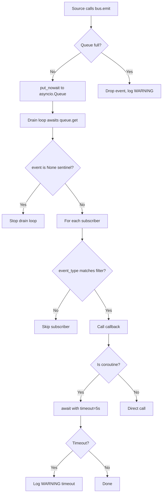
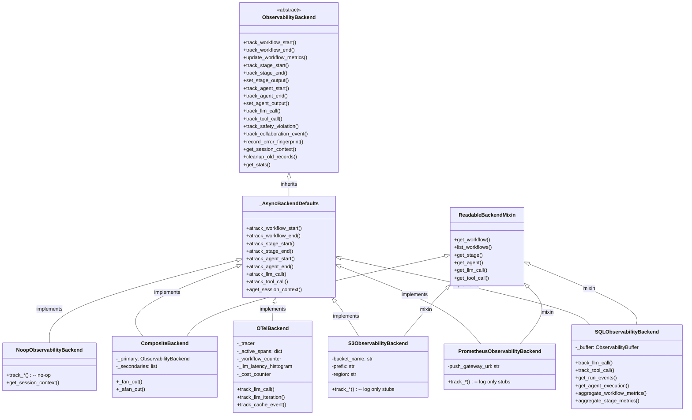
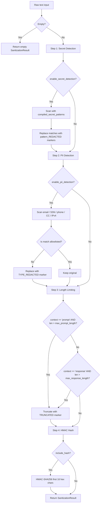
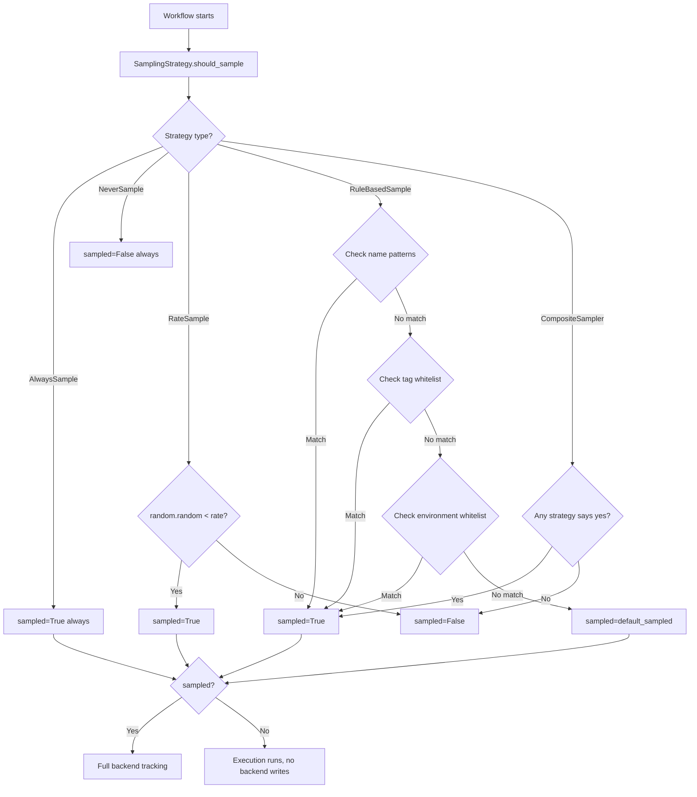
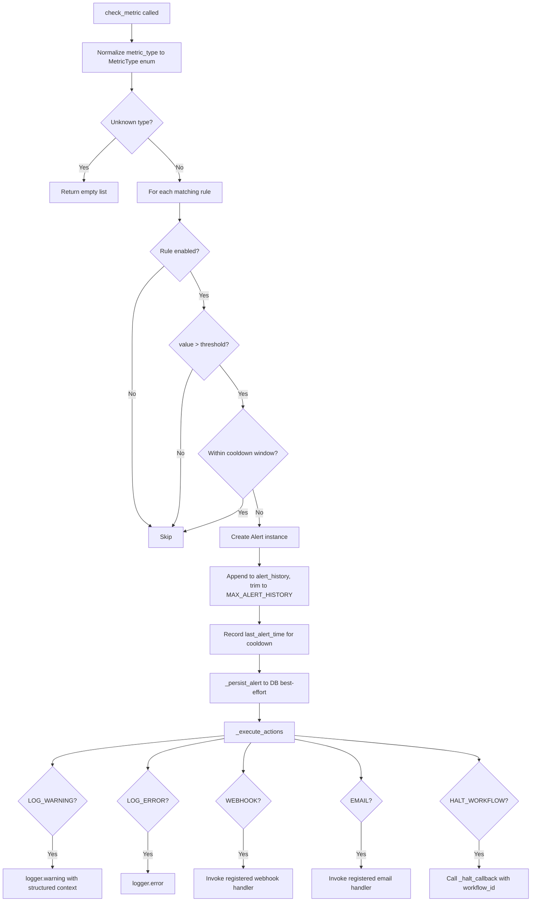
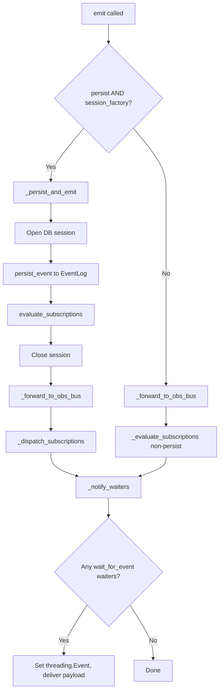
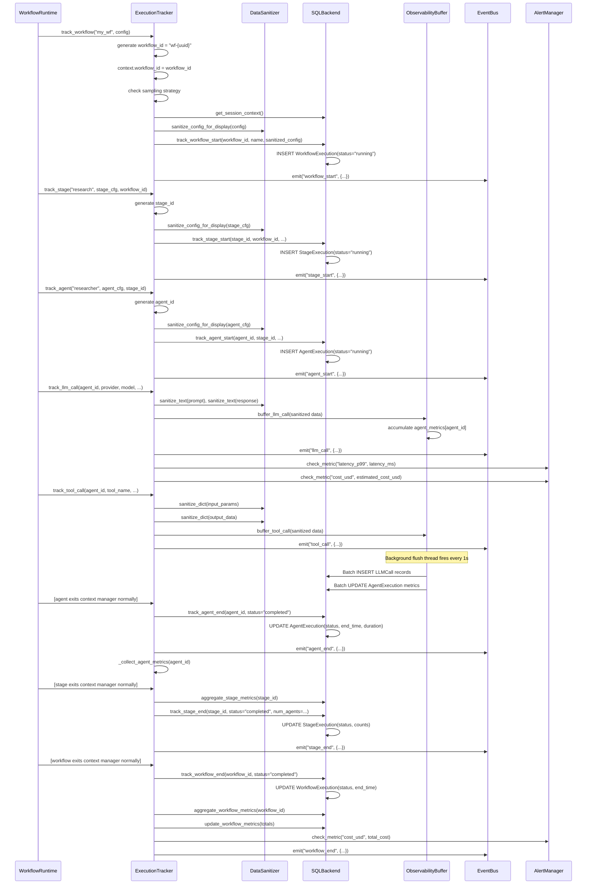
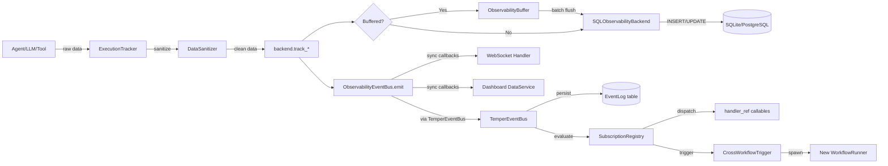

# Observability & Events Subsystem — Exhaustive Architecture Reference

**Version:** 1.0 (2026-02-22)
**Scope:** `temper_ai/observability/` and `temper_ai/events/`
**Status:** Production-ready (SQL, OTel backends); Prometheus/S3 are stubs pending M6

---

## Table of Contents

1. [Executive Summary](#1-executive-summary)
2. [Architecture Overview](#2-architecture-overview)
3. [ExecutionTracker — The Central Tracking Hub](#3-executiontracker--the-central-tracking-hub)
4. [ObservabilityEventBus — Internal Real-Time Events](#4-observabilityeventbus--internal-real-time-events)
5. [Backend Protocol and Hierarchy](#5-backend-protocol-and-hierarchy)
6. [SQL Backend — Primary Persistence](#6-sql-backend--primary-persistence)
7. [OpenTelemetry Backend](#7-opentelemetry-backend)
8. [Prometheus Backend (Stub)](#8-prometheus-backend-stub)
9. [S3 Backend (Stub)](#9-s3-backend-stub)
10. [CompositeBackend — Multi-Backend Fan-Out](#10-compositebackend--multi-backend-fan-out)
11. [NoopBackend](#11-noopbackend)
12. [ObservabilityBuffer — Write Batching](#12-observabilitybuffer--write-batching)
13. [DataSanitizer — PII and Secret Redaction](#13-datasanitizer--pii-and-secret-redaction)
14. [Sampling Strategies](#14-sampling-strategies)
15. [AlertManager — Real-Time Alerting](#15-alertmanager--real-time-alerting)
16. [ObservabilityHealthMonitor](#16-observabilityhealthmonitor)
17. [Specialized Metric Trackers](#17-specialized-metric-trackers)
    - [CollaborationEventTracker](#171-collaborationeventtracker)
    - [DecisionTracker](#172-decisiontracker)
    - [PerformanceTracker](#173-performancetracker)
    - [MetricAggregator](#174-metricaggregator)
    - [AggregationOrchestrator](#175-aggregationorchestrator)
    - [CostRollup](#176-costrollup)
    - [ErrorFingerprinting](#177-errorfingerprinting)
    - [DataLineage](#178-datalineage)
    - [MeritScoreService](#179-meritscoreservice)
18. [Observability Hooks and Decorators](#18-observability-hooks-and-decorators)
19. [OpenTelemetry Setup](#19-opentelemetry-setup)
20. [M9 TemperEventBus — Cross-Workflow Events](#20-m9-tempereventbus--cross-workflow-events)
21. [SubscriptionRegistry](#21-subscriptionregistry)
22. [CrossWorkflowTrigger](#22-crossworkflowtrigger)
23. [EventLog and EventSubscription DB Models](#23-eventlog-and-eventsubscription-db-models)
24. [Data Flow and Execution Traces](#24-data-flow-and-execution-traces)
25. [Design Patterns and Architectural Decisions](#25-design-patterns-and-architectural-decisions)
26. [Configuration and Environment](#26-configuration-and-environment)
27. [Extension Guide](#27-extension-guide)
28. [Observations and Recommendations](#28-observations-and-recommendations)

---

## 1. Executive Summary

**System Name:** Observability & Events Subsystem

**Purpose:** Provides end-to-end execution tracking, metric aggregation, real-time event streaming, and cross-workflow event coordination for the temper-ai multi-agent framework. The subsystem records every significant operation—from workflow start to individual LLM token consumption—and routes that data to pluggable storage backends while applying PII/secret sanitization before persistence.

**Technology Stack:**
- Python 3.11+ (dataclasses, contextvars, threading, asyncio)
- SQLModel / SQLAlchemy (primary persistence)
- OpenTelemetry SDK (optional tracing + metrics)
- Threading primitives (lock-based synchronization, ContextVar for per-task state)
- Regex-based sanitization (compiled patterns, HMAC hashing)

**Scope of Analysis:** All 45+ files under `temper_ai/observability/` and all 7 files under `temper_ai/events/` were read and analyzed in full.

---

## 2. Architecture Overview

### System Architecture

```
┌─────────────────────────────────────────────────────────────────────────────┐
│                          Execution Sources                                   │
│  WorkflowRuntime │ StageExecutors │ StandardAgent │ LLMService │ ToolExecutor│
└──────────────────────────┬──────────────────────────────────────────────────┘
                           │  context managers / direct calls
                           ▼
┌─────────────────────────────────────────────────────────────────────────────┐
│                        ExecutionTracker                                      │
│  track_workflow() │ track_stage() │ track_agent() │ track_llm_call()        │
│  track_tool_call() │ track_decision_outcome() │ track_safety_violation()    │
│                                                                              │
│  ┌─────────────────┐  ┌────────────────────┐  ┌──────────────────────────┐ │
│  │ DataSanitizer   │  │ AlertManager       │  │ PerformanceTracker       │ │
│  │ (PII/secrets)   │  │ (thresholds/rules) │  │ (p50/p95/p99 latency)    │ │
│  └─────────────────┘  └────────────────────┘  └──────────────────────────┘ │
│                                                                              │
│  ┌─────────────────┐  ┌────────────────────┐  ┌──────────────────────────┐ │
│  │ DecisionTracker │  │ CollaborationTracker│  │ MetricAggregator         │ │
│  │ + MeritService  │  │ (multi-agent events)│  │ (agent/stage metrics)    │ │
│  └─────────────────┘  └────────────────────┘  └──────────────────────────┘ │
│                                                                              │
│  ┌──────────────────────────────────────────────────────────────────────┐   │
│  │                  ObservabilityEventBus                                │   │
│  │  sync: thread-safe pub/sub   │  async: queue-backed drain loop        │   │
│  │  Subscribers: WebSocket, Dashboard, TemperEventBus                   │   │
│  └──────────────────────────────────────────────────────────────────────┘   │
│                                                                              │
│  SamplingStrategy ──► should this execution be tracked at all?              │
└───────────────────────────────────┬─────────────────────────────────────────┘
                                    │
                    ┌───────────────▼───────────────────┐
                    │       ObservabilityBackend         │
                    │           (protocol)               │
                    └──┬──────────┬────────────┬────────┘
                       │          │            │
              ┌────────▼──┐  ┌───▼────┐  ┌───▼───────────────┐
              │  SQL       │  │ OTel   │  │ CompositeBackend   │
              │ (primary)  │  │(spans) │  │ (primary + N sec.) │
              └─────┬──────┘  └───┬────┘  └────┬──────────────┘
                    │             │             │
              ┌─────▼──────┐      │        ┌───▼────────┐
              │Observability│      │        │ Prometheus  │
              │   Buffer    │      │        │ S3 (stubs) │
              │(LLM/tool    │      │        └────────────┘
              │ batching)   │      │
              └─────────────┘      │
                                   ▼
                          OTLP Collector / Jaeger
```

### M9 TemperEventBus (Cross-Workflow Layer)

```
┌──────────────────────────────────────────────────────────────────────┐
│                         TemperEventBus (M9)                           │
│                                                                       │
│  emit(event_type, payload) ──► persist to EventLog (DB)              │
│                           ──► evaluate EventSubscription records      │
│                           ──► dispatch to handler_ref callables       │
│                           ──► trigger CrossWorkflowTrigger            │
│                           ──► forward to ObservabilityEventBus        │
│                           ──► notify wait_for_event() waiters         │
│                                                                       │
│  subscribe_persistent(agent_id, event_type) → stores in DB           │
│  wait_for_event(event_type, timeout)        → blocks thread           │
│  replay_events(since, event_type)           → queries EventLog        │
└──────────────────────────────────────────────────────────────────────┘
```

### Component Breakdown

| Component | Location | Purpose |
|---|---|---|
| `ExecutionTracker` | `tracker.py` | Central tracking context manager. Tracks workflow→stage→agent→LLM→tool hierarchy. |
| `_tracker_helpers.py` | `_tracker_helpers.py` | All helper dataclasses and functions extracted from ExecutionTracker for size compliance. |
| `ObservabilityEventBus` | `event_bus.py` | In-process synchronous pub/sub for real-time streaming. |
| `AsyncObservabilityEventBus` | `event_bus.py` | Async variant with bounded queue and drain loop. |
| `ObservabilityBackend` | `backend.py` | Abstract protocol (ABC) defining the full tracking interface. |
| `SQLObservabilityBackend` | `backends/sql_backend.py` | SQLite/PostgreSQL implementation via SQLModel. |
| `OTelBackend` | `backends/otel_backend.py` | OpenTelemetry spans + metrics implementation. |
| `PrometheusObservabilityBackend` | `backends/prometheus_backend.py` | Stub (M6 pending). |
| `S3ObservabilityBackend` | `backends/s3_backend.py` | Stub (M6 pending). |
| `CompositeBackend` | `backends/composite_backend.py` | Fan-out to primary + N secondary backends. |
| `ObservabilityBuffer` | `buffer.py` | Write batching for LLM/tool calls. Thread-safe, with retry queue + DLQ. |
| `DataSanitizer` | `sanitization.py` | PII and secret redaction pipeline. |
| `AlertManager` | `alerting.py` | Rule-based metric alerting with cooldowns and persistence. |
| `ObservabilityHealthMonitor` | `health_monitor.py` | Self-monitoring of the observability pipeline. |
| `CollaborationEventTracker` | `collaboration_tracker.py` | Multi-agent collaboration event tracking. |
| `DecisionTracker` | `decision_tracker.py` | Decision outcome tracking for learning loop. |
| `PerformanceTracker` | `performance.py` | Latency p50/p95/p99 tracking, slow operation detection. |
| `MetricAggregator` | `metric_aggregator.py` | Agent output and stage output metric persistence. |
| `AggregationOrchestrator` | `aggregation/aggregator.py` | Periodic rollup of workflow/agent/LLM metrics into `SystemMetric` records. |
| `ErrorFingerprinting` | `error_fingerprinting.py` | Deduplicating error classification and SHA-256 fingerprinting. |
| `DataLineage` | `lineage.py` | Attribution of stage outputs to contributing agents. |
| `SamplingStrategy` | `sampling.py` | Pluggable workflow sampling (Always, Never, Rate, RuleBased, Composite). |
| `TemperEventBus` | `events/event_bus.py` | M9 persistent cross-workflow event bus. |
| `SubscriptionRegistry` | `events/subscription_registry.py` | DB-backed persistent subscription management. |
| `CrossWorkflowTrigger` | `events/_cross_workflow.py` | Workflow execution in response to events. |
| `EventLog` / `EventSubscription` | `events/models.py` | SQLModel DB tables for M9 events. |

---

## 3. ExecutionTracker — The Central Tracking Hub

**Location:** `temper_ai/observability/tracker.py`

### Class Hierarchy

```
ExecutionTracker
  ├── _TrackerAsyncMixin    (provides atrack_workflow, atrack_stage, atrack_agent, etc.)
  └── TrackerCollaborationMixin  (provides track_safety_violation, track_collaboration_event,
                                  update_agent_merit_score)
```

### Initialization

```python
ExecutionTracker(
    backend: ObservabilityBackend | None = None,        # defaults to SQLObservabilityBackend
    sanitization_config: SanitizationConfig | None = None,
    metric_registry: Any | None = None,
    alert_manager: AlertManager | None = None,          # defaults to AlertManager()
    event_bus: ObservabilityEventBus | None = None,
    sampling_strategy: SamplingStrategy | None = None,  # defaults to AlwaysSample
)
```

The constructor initializes:
- `self.backend` — the storage backend
- `self.sanitizer` — `DataSanitizer` for all text redaction
- `self.alert_manager` — `AlertManager` for threshold-based alerting
- `self._event_bus` — the `ObservabilityEventBus` for real-time subscribers
- `self._performance_tracker` — global `PerformanceTracker` singleton
- `self._decision_tracker` — `DecisionTracker` for decision outcome learning
- `self._metric_aggregator` — `MetricAggregator` for output metric persistence
- `self._collaboration_tracker` — `CollaborationEventTracker`
- `self._context_var` — `ContextVar[ExecutionContext]` for per-task isolation
- `self._session_stack_var` — `ContextVar[list]` for session stack management

### Execution Context (ContextVar-based)

```python
@property
def context(self) -> ExecutionContext:
    ctx = self._context_var.get(None)
    if ctx is None:
        ctx = ExecutionContext()
        self._context_var.set(ctx)
    return ctx
```

`ExecutionContext` holds the current `workflow_id`, `stage_id`, `agent_id` for the running async task or thread. This enables any nested code to correlate its operations to the correct execution span without threading globals.

### Tracking Hierarchy Context Managers

Each level yields an ID and automatically handles start/success/error recording:

```python
with tracker.track_workflow("my_workflow", config) as workflow_id:
    with tracker.track_stage("research", stage_cfg, workflow_id) as stage_id:
        with tracker.track_agent("analyst", agent_cfg, stage_id) as agent_id:
            llm_id = tracker.track_llm_call(...)
            tool_id = tracker.track_tool_call(...)
```

All context managers are also available as async variants (`atrack_workflow`, `atrack_stage`, `atrack_agent`, `atrack_llm_call`, `atrack_tool_call`).

### Session Stack Pattern

To avoid double-opening sessions when track methods nest (e.g., `track_stage` inside `track_workflow`), the tracker uses a **session stack**:

```python
@contextmanager
def _ensure_session(self):
    if self._session_stack:   # parent already opened session
        yield
    else:
        with self.backend.get_session_context() as session:
            self._session_stack.append(session)
            try:
                yield
            finally:
                self._session_stack.pop()
```

The `_session_stack` itself is a `ContextVar`-backed list, ensuring per-task isolation.

### Workflow Tracking Flow

```
track_workflow(params)
  1. _resolve_workflow_params()      — normalize WorkflowTrackingParams
  2. Generate workflow_id = "wf-{uuid4}"
  3. Set context.workflow_id
  4. _should_skip_sampling()         — check SamplingStrategy
  5. backend.get_session_context()   — open DB session
  6. _start_workflow_tracking()
     ├── sanitize_config_for_display()  — redact secrets from config
     ├── _build_extra_metadata()        — experiment/variant tracking
     ├── backend.track_workflow_start() — write WorkflowExecution row
     └── _emit_event("workflow_start")  — notify event bus subscribers
  7. yield workflow_id
  8. On success:
     ├── backend.track_workflow_end(status="completed")
     ├── emit "workflow_end" event
     └── aggregate_workflow_metrics_on_success()
         ├── backend.aggregate_workflow_metrics(workflow_id)
         └── backend.update_workflow_metrics(...)
  9. On error:
     ├── backend.track_workflow_end(status="failed", error_message, stack_trace)
     ├── _record_fingerprint_safe()      — compute error fingerprint
     └── emit "workflow_end" event (with error)
 10. Finally:
     ├── _session_stack.pop()
     ├── context.workflow_id = None
     └── _record_perf_best_effort("workflow_execution")
```

### LLM Call Tracking

```python
def track_llm_call(self, data_or_agent_id, **kwargs) -> str:
    data = _resolve_llm_data(data_or_agent_id, **kwargs)  # normalize to LLMCallTrackingData
    return _track_llm_call(
        sanitizer=self.sanitizer,
        backend=self.backend,
        alert_manager=self.alert_manager,
        data=data,
        event_bus=self._event_bus,
    )
```

The `_track_llm_call` helper (in `_tracker_helpers.py`):
1. Validates that `prompt_tokens`, `completion_tokens`, `latency_ms`, `estimated_cost_usd` are non-negative.
2. Sanitizes `prompt`, `response`, and `error_message` through `DataSanitizer`.
3. Logs if sanitization made redactions (`was_sanitized`, `num_redactions`).
4. Calls `backend.track_llm_call()` with the `LLMCallData` bundle.
5. Emits `"llm_call"` event to the event bus.
6. Calls `alert_manager.check_metric("latency_p99", ...)` and `check_metric("cost_usd", ...)`.
7. Records latency to the global `PerformanceTracker`.

### Tool Call Tracking

```python
def track_tool_call(self, data_or_agent_id, **kwargs) -> str:
    data = _resolve_tool_data(data_or_agent_id, **kwargs)
    return _track_tool_call(
        sanitize_dict_fn=self._sanitize_dict,
        backend=self.backend,
        alert_manager=self.alert_manager,
        data=data,
        event_bus=self._event_bus,
    )
```

The `_track_tool_call` helper:
1. Sanitizes `input_params` and `output_data` dicts (recursive, depth-limited to `THRESHOLD_MEDIUM_COUNT=10`).
2. Calls `backend.track_tool_call()` with `ToolCallData`.
3. Emits `"tool_call"` event.
4. Checks `alert_manager.check_metric("duration", ...)`.
5. Records duration to `PerformanceTracker`.

### Key Event Types Emitted

| Event Type | Trigger | Key Payload Fields |
|---|---|---|
| `workflow_start` | `track_workflow.__enter__` | `workflow_id`, `workflow_name`, `start_time`, `status="running"`, `workflow_config` |
| `workflow_end` | `track_workflow.__exit__` | `workflow_id`, `status`, `end_time`, optional `error_message` |
| `stage_start` | `track_stage.__enter__` | `stage_id`, `workflow_id`, `stage_name`, `status="running"`, `stage_config_snapshot` |
| `stage_end` | `track_stage.__exit__` | `stage_id`, `status`, `end_time`, optional `error_message` |
| `agent_start` | `track_agent.__enter__` | `agent_id`, `stage_id`, `agent_name`, `status="running"`, `start_time` |
| `agent_end` | `track_agent.__exit__` | `agent_id`, `status`, `end_time`, optional `error_message` |
| `agent_output` | `set_agent_output()` | `agent_id`, `confidence_score`, `total_tokens`, `estimated_cost_usd`, `num_llm_calls`, `num_tool_calls` |
| `stage_output` | `set_stage_output()` | `stage_id` |
| `llm_call` | `track_llm_call()` | `llm_call_id`, `agent_id`, `provider`, `model`, `prompt`, `response`, all token/cost/latency fields |
| `tool_call` | `track_tool_call()` | `tool_execution_id`, `agent_id`, `tool_name`, `input_params`, `output_data`, `duration_seconds`, `status` |
| `llm_stream_chunk` | `emit_llm_stream_chunk()` | `agent_id`, `content`, `chunk_type`, `done`, `model`, `prompt_tokens`, `completion_tokens` |
| `safety_violation` | `track_safety_violation()` | `violation_severity`, `violation_message`, `policy_name`, `service_name` |
| `collaboration_event` | `track_collaboration_event()` | `event_type`, `stage_id`, `agents_involved`, `outcome`, `confidence_score` |

---

## 4. ObservabilityEventBus — Internal Real-Time Events

**Location:** `temper_ai/observability/event_bus.py`

### ObservabilityEvent Dataclass

```python
@dataclass
class ObservabilityEvent:
    event_type: str        # e.g., "workflow_start", "llm_call", "stage_end"
    timestamp: datetime
    data: dict[str, Any]   # full payload (no DB queries needed by consumers)
    workflow_id: str | None = None
    stage_id: str | None = None
    agent_id: str | None = None
```

Events carry **full data payloads** so WebSocket consumers never need to query the database for event details.

### Synchronous ObservabilityEventBus

```python
class ObservabilityEventBus:
    _subscribers: dict[str, tuple]  # id -> (callback, event_types_filter)
    _lock: threading.Lock
```

**Thread safety:** The subscriber dict is protected by `threading.Lock`. On `emit()`, a snapshot of subscribers is taken under lock, then callbacks are invoked outside the lock to prevent deadlocks.

**Subscribe:**
```python
sub_id = bus.subscribe(callback, event_types={"llm_call", "agent_output"})
# event_types=None means all events
```

**Emit:**
```python
bus.emit(event)  # synchronous, calls all matching callbacks in emitting thread
```

**Error isolation:** Each subscriber callback is wrapped in try/except. Exceptions are logged as warnings but do not prevent other subscribers from receiving the event.

### Asynchronous AsyncObservabilityEventBus

```python
class AsyncObservabilityEventBus:
    _queue: asyncio.Queue[ObservabilityEvent | None]  # bounded, default 1000
    _subscriber_timeout: float  # default 5 seconds per async callback
    _drain_task: asyncio.Task | None
```

**Queue semantics:** `emit()` is non-blocking (`put_nowait`). If the queue is full, the event is dropped with a WARNING log. The drain loop runs as a background `asyncio.Task`.

**Stopping:** `await bus.stop(drain=True)` first waits for `queue.join()` (all items processed), then sends a `None` sentinel to terminate the drain loop.



---

## 5. Backend Protocol and Hierarchy

**Location:** `temper_ai/observability/backend.py`

### Class Diagram



### Parameter Bundle Dataclasses

All backend methods accept structured parameter bundles rather than long positional argument lists:

| Dataclass | Used By | Fields |
|---|---|---|
| `WorkflowStartData` | `track_workflow_start` | `trigger_type`, `trigger_data`, `optimization_target`, `product_type`, `environment`, `tags`, `extra_metadata`, `cost_attribution_tags` |
| `LLMCallData` | `track_llm_call` | `prompt`, `response`, `prompt_tokens`, `completion_tokens`, `latency_ms`, `estimated_cost_usd`, `temperature`, `max_tokens`, `status`, `error_message`, `failover_sequence`, `failover_from_provider`, `prompt_template_hash`, `prompt_template_source` |
| `ToolCallData` | `track_tool_call` | `input_params`, `output_data`, `duration_seconds`, `status`, `error_message`, `safety_checks`, `approval_required` |
| `AgentOutputData` | `set_agent_output` | `reasoning`, `confidence_score`, `total_tokens`, `prompt_tokens`, `completion_tokens`, `estimated_cost_usd`, `num_llm_calls`, `num_tool_calls` |
| `SafetyViolationData` | `track_safety_violation` | `workflow_id`, `stage_id`, `agent_id`, `service_name`, `context`, `timestamp` |
| `CollaborationEventData` | `track_collaboration_event` | `event_data`, `round_number`, `resolution_strategy`, `outcome`, `confidence_score`, `extra_metadata`, `timestamp` |
| `ErrorFingerprintData` | `record_error_fingerprint` | `fingerprint`, `error_type`, `error_code`, `classification`, `normalized_message`, `sample_message`, `workflow_id`, `agent_name` |

### Async Delegation Pattern

`_AsyncBackendDefaults` provides default async implementations that delegate to sync counterparts via `asyncio.to_thread()`. Backends that are inherently non-blocking (OTel — in-memory operations) override these to call sync directly without thread overhead.

---

## 6. SQL Backend — Primary Persistence

**Location:** `temper_ai/observability/backends/sql_backend.py`
**Location (helpers):** `temper_ai/observability/backends/_sql_backend_helpers.py`

### Class Structure

```python
class SQLObservabilityBackend(SQLDelegatedMethodsMixin, ObservabilityBackend, ReadableBackendMixin):
    _buffer: ObservabilityBuffer | None
```

`SQLDelegatedMethodsMixin` provides: `track_safety_violation`, `track_collaboration_event`, `cleanup_old_records`, `get_stats`, `aggregate_workflow_metrics`, `aggregate_stage_metrics`.

### Session Pattern

Each write operation opens its own session via `get_session()`:

```python
def track_workflow_start(self, ...):
    workflow_exec = WorkflowExecution(id=workflow_id, ...)
    with get_session() as session:
        session.add(workflow_exec)
        session.commit()
```

This is a **per-operation session** model. There are no long-lived sessions. The session stack in `ExecutionTracker` is used only to prevent re-opening sessions when one is already open by a parent context manager.

### DB Models Used

| Model | Table | Key Fields |
|---|---|---|
| `WorkflowExecution` | `workflow_execution` | `id` (PK), `workflow_name`, `workflow_version`, `workflow_config_snapshot` (JSON), `status`, `start_time`, `end_time`, `duration_seconds`, `total_llm_calls`, `total_tool_calls`, `total_tokens`, `total_cost_usd`, `trigger_type`, `environment`, `tags`, `extra_metadata`, `cost_attribution_tags`, `error_message`, `error_stack_trace` |
| `StageExecution` | `stage_execution` | `id` (PK), `workflow_execution_id` (FK), `stage_name`, `stage_version`, `stage_config_snapshot` (JSON), `status`, `start_time`, `end_time`, `duration_seconds`, `input_data` (JSON), `output_data` (JSON), `output_lineage` (JSON), `num_agents_executed`, `num_agents_succeeded`, `num_agents_failed` |
| `AgentExecution` | `agent_execution` | `id` (PK), `stage_execution_id` (FK), `agent_name`, `agent_version`, `agent_config_snapshot` (JSON), `status`, `start_time`, `end_time`, `duration_seconds`, `input_data` (JSON), `output_data` (JSON), `output_quality_score`, `reasoning`, `confidence_score`, `retry_count`, `num_llm_calls`, `num_tool_calls`, `total_tokens`, `prompt_tokens`, `completion_tokens`, `estimated_cost_usd` |
| `LLMCall` | `llm_call` | `id` (PK), `agent_execution_id` (FK), `provider`, `model`, `prompt`, `response`, `prompt_tokens`, `completion_tokens`, `total_tokens`, `latency_ms`, `estimated_cost_usd`, `temperature`, `max_tokens`, `status`, `error_message`, `start_time`, `retry_count`, `failover_sequence` (JSON), `failover_from_provider`, `prompt_template_hash`, `prompt_template_source` |
| `ToolExecution` | `tool_execution` | `id` (PK), `agent_execution_id` (FK), `tool_name`, `input_params` (JSON), `output_data` (JSON), `start_time`, `end_time`, `duration_seconds`, `status`, `error_message`, `safety_checks_applied` (JSON), `approval_required`, `retry_count` |

### Buffered vs. Direct Writes

**LLM calls and tool calls** go through `ObservabilityBuffer` when it is present (the default):

```python
def track_llm_call(self, ...):
    if self._buffer:
        self._buffer.buffer_llm_call(...)  # buffered
        return
    # Direct write path (when buffer=False)
    llm_call = LLMCall(...)
    with get_session() as session:
        session.add(llm_call)
        agent = session.exec(select(AgentExecution).where(...)).first()
        if agent:
            agent.num_llm_calls += 1
            agent.total_tokens += llm_call.total_tokens
            ...
        session.commit()
```

**Workflow, stage, and agent lifecycle events** always write directly (never buffered) to ensure timing accuracy for the execution log.

### Agent Metric Auto-Update on Stage End

When `track_stage_end()` is called without explicit agent counts, the SQL backend queries the database:

```python
metrics_statement = select(
    func.count(AgentExecution.id).label("total"),
    func.sum(case((AgentExecution.status == "completed", 1), else_=0)).label("succeeded"),
    func.sum(case((AgentExecution.status == "failed", 1), else_=0)).label("failed")
).where(AgentExecution.stage_execution_id == stage_id)
```

### Output Quality Scoring

When `set_agent_output()` is called, the SQL backend computes an output quality score:

```python
agent.output_quality_score = compute_quality_score(
    status=agent.status or "",
    output_data=output_data,
)
```

This is imported lazily from `temper_ai.observability._quality_scorer` to avoid fan-out.

---

## 7. OpenTelemetry Backend

**Location:** `temper_ai/observability/backends/otel_backend.py`

### Span Hierarchy

```
workflow:{name}           (ROOT span — created on track_workflow_start)
  ├── stage:{name}        (child of workflow span)
  │   ├── agent:{name}    (child of stage span)
  │   │   ├── llm:{provider}/{model}   (leaf span, immediately ended)
  │   │   └── tool:{name}              (leaf span, immediately ended)
```

### Active Span Registry

The backend maintains an in-memory `dict[str, tuple[Span, Context, monotonic_time]]` mapping entity IDs to their active OTEL spans:

```python
self._active_spans: dict[str, tuple[Any, Any, float]] = {}
# entity_id -> (span, otel_context, created_at_monotonic)
```

This registry allows `track_*_start` and `track_*_end` calls (which happen in different stack frames) to be correlated to the same span.

### Span Lifecycle Functions

```python
_start_span(backend, entity_id, span_name, attributes, parent_id=None)
# - Looks up parent context by parent_id in _active_spans
# - Creates child span under parent context
# - Registers in _active_spans

_end_span(backend, entity_id, status, error_message=None)
# - Pops from _active_spans
# - Sets StatusCode.OK / StatusCode.ERROR
# - Calls span.end()
```

### Stale Span Cleanup

Amortized cleanup runs when `len(_active_spans) > CLEANUP_THRESHOLD (100)`:

1. **Phase 1 — TTL eviction:** Remove spans older than `SPAN_TTL_SECONDS (3600)` and end them with `StatusCode.ERROR / "Span TTL exceeded"`.
2. **Phase 2 — Capacity eviction:** If still over `MAX_ACTIVE_SPANS (10000)`, remove oldest spans first.

### OTEL Metric Instruments

| Metric Name | Type | Description |
|---|---|---|
| `temper_ai.workflow.count` | Counter | Workflow executions |
| `temper_ai.llm.call.count` | Counter | LLM API calls |
| `temper_ai.llm.latency` | Histogram (ms) | LLM call latency |
| `temper_ai.tool.call.count` | Counter | Tool executions |
| `temper_ai.cost.total` | Counter (USD) | Accumulated cost |
| `temper_ai.tokens.total` | Counter | Accumulated tokens |
| `temper_ai.llm.iteration` | Counter | LLM loop iterations |
| `temper_ai.cache.hit` | Counter | Cache hits |
| `temper_ai.cache.miss` | Counter | Cache misses |
| `temper_ai.retry.count` | Counter | Agent retry attempts |
| `temper_ai.circuit_breaker.state_change` | Counter | Circuit breaker transitions |
| `temper_ai.dialogue.convergence_speed` | Histogram | Dialogue convergence per round |
| `temper_ai.stage.cost_usd` | Counter (USD) | Per-stage accumulated cost |
| `temper_ai.failover.count` | Counter | LLM provider failover events |

### OTEL Attribute Key Constants

```
temper_ai.workflow.id, temper_ai.workflow.name
temper_ai.stage.id, temper_ai.stage.name
temper_ai.agent.id, temper_ai.agent.name
temper_ai.llm.provider, temper_ai.llm.model
temper_ai.tool.name
temper_ai.status
temper_ai.error.message
temper_ai.llm.tokens.prompt, temper_ai.llm.tokens.completion
temper_ai.llm.latency_ms
temper_ai.cost_usd
temper_ai.duration_seconds
temper_ai.llm.failover_from, temper_ai.llm.failover_count
temper_ai.llm.prompt.template_hash, temper_ai.llm.prompt.template_source
```

### Special Event Tracking

The OTEL backend handles several event types emitted through `track_collaboration_event()`:

| Event Type | Metric Recorded |
|---|---|
| `resilience_retry` | `temper_ai.retry.count` +1 (labeled by agent_name) |
| `resilience_circuit_breaker` | `temper_ai.circuit_breaker.state_change` +1 |
| `dialogue_round_metrics` | `temper_ai.dialogue.convergence_speed` histogram |
| `resilience_failover_provider` | `temper_ai.failover.count` +1 (from/to provider) |
| `cost_summary` | `temper_ai.stage.cost_usd` +total_cost_usd |

### OTel Async Optimization

Unlike `_AsyncBackendDefaults` (which uses `asyncio.to_thread()`), the OTel backend overrides all async methods to call sync directly — since OTEL operations are in-memory and have no I/O overhead:

```python
async def atrack_workflow_start(self, ...):
    self.track_workflow_start(...)  # no thread needed
```

---

## 8. Prometheus Backend (Stub)

**Location:** `temper_ai/observability/backends/prometheus_backend.py`

**Status:** Stub implementation. All tracking methods log at DEBUG level only. Push gateway URL is stored but not used.

**Planned M6 Features:**
- Push gateway integration (`prometheus_client` library)
- Counters: `workflow_executions_total{workflow_name, status}`, `agent_tool_calls_total{tool_name}`, `agent_llm_tokens_total{agent_name}`
- Histograms: `workflow_duration_seconds{workflow_name}`, `stage_duration_seconds{stage_name}`
- Labels for filtering by workflow, stage, agent, status

**Session context:** No-op (stateless push model).

**Retention:** Managed by Prometheus's own retention policy, not by `cleanup_old_records()`.

---

## 9. S3 Backend (Stub)

**Location:** `temper_ai/observability/backends/s3_backend.py`

**Status:** Stub implementation. All tracking methods log at DEBUG level only.

**Planned M6 Features:**
- JSON/Parquet event storage to S3
- Date-based partitioning: `s3://bucket/observability/2024/03/01/workflows/`
- Batch uploads with gzip compression
- S3 Lifecycle policies for retention
- Athena/Presto querying support

**Planned S3 Key Structure:**
```
s3://bucket/observability/
    YYYY/MM/DD/
        workflows/{workflow_id}.json.gz
        stages/{stage_id}.json.gz
        agents/{agent_id}.json.gz
        llm_calls/{llm_call_id}.json.gz
        tool_calls/{tool_execution_id}.json.gz
```

---

## 10. CompositeBackend — Multi-Backend Fan-Out

**Location:** `temper_ai/observability/backends/composite_backend.py`

### Design

```
CompositeBackend
  ├── _primary: ObservabilityBackend    (SQL typically)
  └── _secondaries: list[ObservabilityBackend]  (OTel, Prometheus, S3)
```

**Primary backend**: Handles reads, sessions, error propagation, and maintenance. All errors propagate up.

**Secondary backends**: Fire-and-forget. All errors are caught and logged at WARNING level. Failures in secondaries never disrupt the primary tracking path.

### Fan-Out Pattern (Sync)

```python
def _fan_out(self, method_name, *args, **kwargs):
    for backend in self._secondaries:
        try:
            getattr(backend, method_name)(*args, **kwargs)
        except Exception:
            logger.warning("Secondary backend %s.%s failed", ...)
```

### Fan-Out Pattern (Async)

```python
async def _afan_out(self, method_name, *args, **kwargs):
    tasks = [getattr(b, method_name)(*args, **kwargs) for b in self._secondaries]
    results = await asyncio.gather(*tasks, return_exceptions=True)
    for i, result in enumerate(results):
        if isinstance(result, Exception):
            logger.warning("Secondary backend %s failed", ...)
```

Async fan-out runs all secondaries concurrently with `asyncio.gather`, preserving ordering of warnings.

### Read Delegation

All read operations (`get_workflow`, `list_workflows`, `get_top_errors`) delegate to the primary only:

```python
def get_workflow(self, workflow_id):
    if isinstance(self._primary, ReadableBackendMixin):
        return self._primary.get_workflow(workflow_id)
    return None
```

Unknown attributes (e.g., `aggregate_workflow_metrics`) are forwarded to the primary via `__getattr__`:

```python
def __getattr__(self, name):
    return getattr(self._primary, name)
```

### Usage Example

```python
from temper_ai.observability.backends.composite_backend import CompositeBackend
from temper_ai.observability.backends.sql_backend import SQLObservabilityBackend
from temper_ai.observability.backends.otel_backend import OTelBackend

backend = CompositeBackend(
    primary=SQLObservabilityBackend(),
    secondaries=[OTelBackend(service_name="temper-ai")],
)
tracker = ExecutionTracker(backend=backend)
```

---

## 11. NoopBackend

**Location:** `temper_ai/observability/backends/noop_backend.py`

All tracking methods are empty no-ops. Used in testing and when observability is deliberately disabled. `get_session_context()` returns a null context manager (`yield None`).

---

## 12. ObservabilityBuffer — Write Batching

**Location:** `temper_ai/observability/buffer.py`
**Location (helpers):** `temper_ai/observability/_buffer_helpers.py`

### Purpose

Eliminates the N+1 query problem for high-frequency operations:

| Without buffering | With buffering |
|---|---|
| 100 LLM calls = 200 queries (1 INSERT + 1 UPDATE per call) | 100 LLM calls = ~2–4 queries (1 batch INSERT + 1 batch UPDATE) |

### Internal State

```python
class ObservabilityBuffer:
    llm_calls: list[BufferedLLMCall]         # buffered LLM records
    tool_calls: list[BufferedToolCall]        # buffered tool records
    agent_metrics: dict[str, AgentMetricUpdate]  # per-agent running totals
    retry_queue: list[RetryableItem]         # failed items awaiting retry
    _pending_ids: dict[str, float]           # item_id -> timestamp (stale detection)
    dead_letter_queue: list[DeadLetterItem]  # permanently failed items
    lifecycle_events: list[BufferedLifecycleEvent]  # end-of-lifecycle events
    lock: threading.Lock                     # thread safety
    _flush_thread: threading.Thread          # background flush (daemon=True)
    _stop_flush_thread: threading.Event
```

### Flush Triggers

```python
def _should_flush(self) -> bool:
    total_items = len(llm_calls) + len(tool_calls) + len(retry_queue) + len(lifecycle_events)
    if total_items >= flush_size:     # size-based (default: 100)
        return True
    if time.time() - last_flush_time >= flush_interval:  # time-based (default: 1.0s)
        return True
    return False
```

Flushes are **deferred outside the lock** to minimize lock contention:

```python
def buffer_llm_call(self, ...):
    deferred_flush = None
    with self.lock:
        self.llm_calls.append(...)
        if self._should_flush():
            deferred_flush = self._swap_and_prepare()  # swap buffers under lock
    if deferred_flush is not None:
        execute_flush(...)  # flush outside lock
```

### Retry and Dead-Letter Queue

Failed flush operations enter the retry queue with backoff:

```python
@dataclass
class RetryableItem:
    item: BufferedLLMCall | BufferedToolCall | AgentMetricUpdate
    item_type: str    # "llm_call", "tool_call", "agent_metric"
    item_id: str      # for deduplication
    retry_count: int
    first_failed_at: datetime | None
    last_error: str | None
```

After `max_retries` (default: 3) failures, items move to the dead-letter queue:

```python
@dataclass
class DeadLetterItem:
    item: ...
    retry_count: int
    first_failed_at: datetime
    final_error: str
    failed_at: datetime
```

DLQ has a configurable max size (`DEFAULT_DLQ_MAX_SIZE`). When exceeded, oldest entries are dropped. A `dlq_callback` can be registered for custom DLQ handling (alerting, persistence).

### Stale Pending ID Cleanup

The `_pending_ids` dict tracks items currently being flushed. Stale entries (stuck for `PENDING_ID_TIMEOUT_SECONDS=300`) are periodically purged to prevent memory leaks.

### Background Flush Thread

```python
def _flush_loop(buffer):
    while not buffer._stop_flush_thread.wait(timeout=buffer.flush_interval):
        buffer.flush()
```

The flush thread is a `daemon=True` thread — it will not prevent process exit. Explicit `buffer.stop()` signals it to stop and waits for join before doing a final flush.

### Buffer Statistics

```python
buffer.get_stats() -> {
    "llm_calls_buffered": int,
    "tool_calls_buffered": int,
    "agent_metrics_buffered": int,
    "lifecycle_events_buffered": int,
    "total_buffered": int,
    "retry_queue_size": int,
    "dlq_size": int,
    "pending_ids": int,
    "flush_size": int,
    "flush_interval": float,
    "auto_flush": bool,
    "max_retries": int,
    "max_dlq_size": int,
    "last_flush_time": float,
}
```

---

## 13. DataSanitizer — PII and Secret Redaction

**Location:** `temper_ai/observability/sanitization.py`

### Sanitization Pipeline



### SanitizationConfig Defaults (Production-Secure)

```python
@dataclass
class SanitizationConfig:
    enable_secret_detection: bool = True
    redact_high_confidence_secrets: bool = True
    redact_medium_confidence_secrets: bool = True   # security hardened
    enable_pii_detection: bool = True
    redact_emails: bool = True
    redact_ssn: bool = True
    redact_phone_numbers: bool = True
    redact_credit_cards: bool = True
    redact_ip_addresses: bool = True                # network topology protection
    max_prompt_length: int = 5000                   # reduced for aggressive truncation
    max_response_length: int = 20000
    include_hash: bool = True
    allowlist_patterns: list[str] = []
```

### Pattern Sources

Secret patterns are imported from `temper_ai.shared.utils.secret_patterns`:
- `SECRET_PATTERNS` — provider-specific key formats (OpenAI `sk-`, Anthropic `sk-ant-`, GitHub tokens, AWS access keys, etc.)
- `GENERIC_SECRET_PATTERNS` — generic `api_key`, `password`, `token`, `secret` patterns
- `PII_PATTERNS` — `email`, `ssn`, `phone_us`, `credit_card`, `ipv4` regex patterns

All patterns are pre-compiled in `__init__()` for performance.

### HMAC Security

Content hashing uses HMAC with a per-instance random 256-bit key (loaded from `OBSERVABILITY_HMAC_KEY` env var or generated fresh). This prevents rainbow table attacks while still enabling correlation of identical content across sanitized logs.

```python
h = hmac.new(self._hmac_key, text.encode("utf-8"), hashlib.sha256)
content_hash = h.hexdigest()[:16]
```

### Allowlist Anti-ReDoS Protection

Allowlist patterns are validated and pre-compiled in `__init__()`. During matching, `RecursionError` and `re.error` are caught and the pattern is skipped:

```python
for compiled in self._compiled_allowlist:
    try:
        if compiled.search(text):
            return True
    except (RecursionError, re.error):
        continue  # Skip pathological pattern, don't crash
```

### Recursive Dict Sanitization

`sanitize_dict()` in `_tracker_helpers.py` sanitizes nested dicts for tool parameters and outputs. It is depth-limited to `THRESHOLD_MEDIUM_COUNT (10)` to prevent `RecursionError`:

```python
if _depth > THRESHOLD_MEDIUM_COUNT:
    return {"__truncated__": "max depth exceeded"}
```

The implementation handles `dict`, `list`, `str`, `bool`, `int`, `float`, and `None` types. Non-serializable types become `"[SANITIZED:TypeName]"`.

### Redaction Marker Format

```
Secret: [OPENAI_KEY_REDACTED], [ANTHROPIC_KEY_REDACTED], [GENERIC_API_KEY_REDACTED]
PII:    [EMAIL_REDACTED], [SSN_REDACTED], [PHONE_US_REDACTED], [CREDIT_CARD_REDACTED], [IPV4_REDACTED]
Trunc:  ...[TRUNCATED:N_chars]
Stack:  sanitized via sanitize_text(context="stack_trace")
```

---

## 14. Sampling Strategies

**Location:** `temper_ai/observability/sampling.py`

Sampling determines whether a workflow should be fully tracked against the backend. If not sampled, the execution still runs but backend writes are skipped entirely (the `_should_skip_sampling()` check in `track_workflow`).

### Strategy Protocol

```python
@runtime_checkable
class SamplingStrategy(Protocol):
    @property
    def name(self) -> str: ...
    def should_sample(self, context: SamplingContext) -> SamplingDecision: ...
```

### SamplingContext

```python
@dataclass
class SamplingContext:
    workflow_id: str
    workflow_name: str
    environment: str
    tags: list[str]
    metadata: dict[str, Any]
```

### Available Strategies



### Strategy Reference

| Class | Logic | Configuration |
|---|---|---|
| `AlwaysSample` | Always returns `sampled=True` | None |
| `NeverSample` | Always returns `sampled=False` | None |
| `RateSample(rate)` | `random.random() < rate` | `rate: float` (0.0–1.0) |
| `RuleBasedSample` | Name regex → Tag whitelist → Environment whitelist → default | `name_patterns`, `tag_whitelist`, `environment_whitelist`, `default_sampled` |
| `CompositeSampler` | OR logic — sample if any strategy says yes | `strategies: list[SamplingStrategy]` |

### Usage

```python
from temper_ai.observability.sampling import RateBasedSample, RuleBasedSample, CompositeSampler

# 10% sampling in production, all in development
strategy = CompositeSampler([
    RuleBasedSample(environment_whitelist=["development", "staging"], default_sampled=False),
    RateSample(rate=0.1),
])
tracker = ExecutionTracker(sampling_strategy=strategy)
```

---

## 15. AlertManager — Real-Time Alerting

**Location:** `temper_ai/observability/alerting.py`

### AlertRule Configuration

```python
@dataclass
class AlertRule:
    name: str
    metric_type: MetricType   # COST_USD, ERROR_RATE, LATENCY_P99, DURATION, etc.
    threshold: float
    window_seconds: float = 0     # 0 = single-event threshold
    severity: AlertSeverity       # INFO, WARNING, ERROR, CRITICAL
    actions: list[AlertAction]    # LOG_WARNING, LOG_ERROR, WEBHOOK, EMAIL, HALT_WORKFLOW
    enabled: bool = True
    metadata: dict[str, Any]      # webhook_url, email_to, description
```

### Default Rules

| Rule Name | Metric | Threshold | Severity | Actions |
|---|---|---|---|---|
| `high_cost_per_workflow` | `cost_usd` | $5.00 | WARNING | LOG_WARNING |
| `critical_cost_budget` | `cost_usd` | $50.00 | CRITICAL | LOG_ERROR + HALT_WORKFLOW (disabled by default) |
| `extreme_latency_p99` | `latency_p99` | 600,000 ms (10 min) | WARNING | LOG_WARNING |
| `high_error_rate` | `error_rate` | 10% in 5 minutes | ERROR | LOG_ERROR |
| `new_error_type_detected` | `new_error_type` | 0 (any occurrence) | INFO | LOG_WARNING |
| `error_spike` | `error_spike` | 10 in 5 minutes | WARNING | LOG_WARNING |

### Alert Evaluation Flow



### Cooldown

Alerts respect a cooldown period (`DEFAULT_ALERT_COOLDOWN_SECONDS`) to prevent alert storms. The `_last_alert_times` dict tracks when each rule last fired.

### HALT_WORKFLOW Action

The most drastic action. Requires registering a halt callback:

```python
def register_halt_callback(self, callback: Callable[[str], None]) -> None:
    self._halt_callback = callback
```

When triggered, the callback receives the `workflow_id` from the alert context.

### Alert Persistence

Alerts are persisted to the `AlertRecord` DB table (best-effort — never raises). Persisted alerts can be queried:

```python
persisted = AlertManager.get_persisted_alerts(limit=50)
```

### Extending AlertManager

```python
manager = AlertManager()

# Add custom rule
manager.add_rule(AlertRule(
    name="custom_token_limit",
    metric_type=MetricType.TOKEN_COUNT,
    threshold=100000,
    severity=AlertSeverity.WARNING,
    actions=[AlertAction.WEBHOOK],
    metadata={"webhook_url": "https://hooks.slack.com/..."},
))

# Register webhook handler
def my_webhook_handler(alert, rule):
    requests.post(rule.metadata["webhook_url"], json={
        "text": f"Alert: {alert.message}"
    })

manager.register_webhook_handler("custom_token_limit", my_webhook_handler)
```

---

## 16. ObservabilityHealthMonitor

**Location:** `temper_ai/observability/health_monitor.py`

Self-monitors the observability pipeline itself. Runs a periodic background thread to check health and fire alerts when the pipeline is degraded.

### Health Check Components

1. **Database connectivity**: `SELECT 1` via `db_session_factory`.
2. **Backend responsiveness**: Calls `backend.get_stats()` to verify no exception.
3. **Buffer threshold checks**: Evaluates `ObservabilityBuffer.get_stats()` against limits.

### Buffer Health Thresholds

| Metric | WARNING | CRITICAL |
|---|---|---|
| DLQ size | > `THRESHOLD_MEDIUM_COUNT (10)` | > `THRESHOLD_LARGE_COUNT (100)` |
| Retry queue | > `THRESHOLD_MEDIUM_COUNT (10)` | — |
| Pending IDs | — | > `THRESHOLD_LARGE_COUNT (100)` |

### HealthStatus

```python
@dataclass
class HealthStatus:
    healthy: bool
    issues: list[str]
    stats: dict[str, Any]
```

### Usage

```python
monitor = ObservabilityHealthMonitor(
    buffer=backend._buffer,
    alert_manager=tracker.alert_manager,
    check_interval=60,
    backend=tracker.backend,
    db_session_factory=get_session,
)
monitor.start_periodic_check()  # starts background daemon thread
# ...
monitor.stop()  # graceful shutdown
```

---

## 17. Specialized Metric Trackers

### 17.1 CollaborationEventTracker

**Location:** `temper_ai/observability/collaboration_tracker.py`

Tracks multi-agent collaboration events: votes, conflicts, resolutions, consensus, debate rounds, synthesis, quality gate failures, and adaptive mode switches.

**Collaboration event types** (non-exhaustive):
- `vote` — an agent cast a vote
- `conflict_resolution` — a conflict was resolved
- `consensus` — agents reached consensus
- `debate_round` — a debate round completed
- `synthesis` — outputs were synthesized
- `quality_gate_failure` — a quality gate was not satisfied
- `adaptive_mode_switch` — execution mode changed dynamically

**Validation logic:**
1. `stage_id` required (falls back to `context.stage_id`; rejects if both missing)
2. `event_type` required
3. `confidence_score` clamped to `[0.0, 1.0]`
4. `agents_involved` defaults to `[]` if `None`

**Safety integration:** `track_safety_violation()` sanitizes the context dict before calling `backend.track_safety_violation()` with full `SafetyViolationData`.

### 17.2 DecisionTracker

**Location:** `temper_ai/observability/decision_tracker.py`

Tracks decision outcomes for the autonomous self-improvement learning loop. Each tracked decision records:
- `decision_type`, `decision_data` — what decision was made
- `outcome` — what happened as a result
- `impact_metrics` — measured impact
- `lessons_learned` — natural language description
- `should_repeat` — boolean recommendation
- `tags` — categorization tags
- Correlation IDs: `agent_execution_id`, `stage_execution_id`, `workflow_execution_id`
- Validation fields: `validation_method`, `validation_timestamp`, `validation_duration_seconds`

Also owns a `MeritScoreService` instance to update agent merit scores based on decision outcomes.

### 17.3 PerformanceTracker

**Location:** `temper_ai/observability/performance.py`

Global singleton (`get_performance_tracker()`) using double-check locking. Tracks in-memory latency samples per operation type.

**Per-operation metrics tracked:**
- `p50`, `p95`, `p99` latencies
- `count`, `min`, `max`, `mean`
- `slow_count` (samples exceeding slow threshold)

**Default slow thresholds:**
- `stage_execution`: 10,000 ms (10s)
- `llm_call`: 5,000 ms (5s)
- `tool_execution`: 3,000 ms (3s)

**Slow operation detection:** When a sample exceeds the slow threshold, a `SlowOperation` record is appended and a WARNING is logged. The `slow_operations` list is capped at `MAX_SLOW_OPERATIONS`.

**Automatic cleanup:** Every `DEFAULT_CLEANUP_INTERVAL` records, metrics older than 24 hours are purged to prevent unbounded growth.

**Context manager interface:**
```python
with tracker.measure("llm_call", context={"model": "gpt-4o", "agent": "researcher"}):
    response = llm.complete(prompt)

metrics = tracker.get_metrics("llm_call")
# {"p50": 1200.0, "p95": 3800.0, "p99": 5200.0, "count": 150, "min": 800.0, "max": 6100.0, "mean": 1450.0}
```

### 17.4 MetricAggregator

**Location:** `temper_ai/observability/metric_aggregator.py`

Coordinates post-execution metric storage for agents and stages.

**`collect_agent_metrics(agent_id)`:** Called after successful agent completion. If a `MetricRegistry` is present, it fetches the `AgentExecution` record and passes it to all registered metric collectors.

**`set_agent_output(params)`:** Delegates to `backend.set_agent_output()` with `AgentOutputData` bundle containing reasoning, confidence score, token counts, cost, and call counts.

**`set_stage_output(stage_id, output_data, output_lineage)`:** Delegates to `backend.set_stage_output()` to persist stage results and attribution data.

### 17.5 AggregationOrchestrator

**Location:** `temper_ai/observability/aggregation/aggregator.py`

Computes periodic rollups from raw execution records into `SystemMetric` records.

**Aggregation periods:** `HOUR`, `DAY`, `WEEK`, `MONTH` (via `AggregationPeriod` enum).

**`aggregate_workflow_metrics(period, start_time, end_time)`:**
- Groups by `workflow_name` over the time window
- Computes: total count, success rate, average duration, total cost, P95 duration
- Creates `SystemMetric` records via `MetricRecordCreator`

**`aggregate_agent_metrics(period, start_time, end_time)`:**
- Groups by `agent_name`
- Computes: total executions, success rate, average duration, total cost, average tokens

**`aggregate_llm_metrics(period, start_time, end_time)`:**
- Groups by `(provider, model)` pairs
- Computes: total calls, success rate, average latency, P95/P99 latency, total cost

**`aggregate_all_metrics(period)`:** Convenience method running all three pipelines and returning a combined result dict.

### 17.6 CostRollup

**Location:** `temper_ai/observability/cost_rollup.py`

Stateless functions for per-stage cost aggregation.

**`compute_stage_cost_summary(stage_name, agent_metrics, agent_statuses)`:**
- Iterates agent metrics dict
- For each agent: extracts `cost_usd`, `tokens`, `duration_seconds`
- Returns `StageCostSummary` with per-agent `AgentCostEntry` list and totals

**`emit_cost_summary(tracker, stage_id, summary)`:**
- Emits structured log at INFO level
- Routes `cost_summary` event via `tracker.track_collaboration_event()`
- Best-effort — catches and suppresses all exceptions

### 17.7 ErrorFingerprinting

**Location:** `temper_ai/observability/error_fingerprinting.py`

Provides deterministic error deduplication for alerting on new error types.

**Fingerprint Algorithm:**

```
1. error_type = type(exc).__name__                # e.g., "LLMConnectionError"
2. error_code = extract_error_code(exc)           # .error_code attr or CamelCase→UPPER_SNAKE
3. error_message = str(exc)                       # raw message
4. normalize_message(error_message):
   - Replace memory addresses (0x...) → <ADDR>
   - Replace UUIDs → <UUID>
   - Replace ISO timestamps → <TIMESTAMP>
   - Replace Unix paths → <PATH>
   - Replace hex IDs (8+ chars) → <HEX>
   - Replace 3+ digit numbers → <N>
   - Collapse whitespace
   - Truncate to 256 chars
5. fingerprint = SHA-256("error_type:error_code:normalized")[:16_hex_chars]
```

**Error Classification:**

| Code Pattern | Classification |
|---|---|
| `LLM_CONNECTION_ERROR`, `LLM_TIMEOUT`, `LLM_RATE_LIMIT`, `SYSTEM_TIMEOUT`, `TOOL_TIMEOUT`, ... | `TRANSIENT` |
| `SAFETY_VIOLATION`, `SAFETY_POLICY_ERROR`, `SAFETY_ACTION_BLOCKED` | `SAFETY` |
| Any other known code | `PERMANENT` |
| `UNKNOWN` or empty | `UNKNOWN` |

**Integration with tracking:** When a workflow, stage, or agent errors, `_record_fingerprint_safe()` is called (best-effort, never raises). If the fingerprint is new (first occurrence), `alert_manager.check_metric("new_error_type", 1, ...)` fires.

### 17.8 DataLineage

**Location:** `temper_ai/observability/lineage.py`

Tracks which agent produced which output during multi-agent stage synthesis.

**Contribution Types:**
- `primary` — only one agent succeeded
- `synthesized` — multiple agents, non-voting synthesis
- `vote` — majority voting synthesis
- `failed` — agent failed

**Output Hash:** First 16 hex characters of `SHA-256(str(output))` for compact identity tracking.

**Usage in stage executors:**
```python
from temper_ai.observability.lineage import compute_output_lineage, lineage_to_dict

lineage = compute_output_lineage(
    stage_name="research",
    agent_outputs={"analyst": {...}, "summarizer": {...}},
    agent_statuses={"analyst": "success", "summarizer": "success"},
    synthesis_method="vote",
)
tracker.set_stage_output(stage_id, output_data, output_lineage=lineage_to_dict(lineage))
```

### 17.9 MeritScoreService

**Location:** `temper_ai/observability/merit_score_service.py`

Persists per-agent merit scores based on decision outcomes, used by the multi-agent collaboration `merit_weighted` strategy. Scores influence which agents receive higher weight in voting and synthesis.

**Update:** `update(session, agent_name, domain, decision_outcome, confidence)` — increments or decrements the agent's merit score in the specified domain based on outcome.

---

## 18. Observability Hooks and Decorators

**Location:** `temper_ai/observability/hooks.py`

### Global Tracker Singleton

```python
_global_tracker: ExecutionTracker | None = None
_tracker_lock = threading.Lock()

def get_tracker() -> ExecutionTracker:
    global _global_tracker
    if _global_tracker is None:
        with _tracker_lock:                    # OB-06: double-check locking
            if _global_tracker is None:
                _global_tracker = ExecutionTracker()
    return _global_tracker
```

`set_tracker(tracker)` and `reset_tracker()` are provided for test injection.

### Decorator API

```python
@track_workflow("my_pipeline")
def run_pipeline(config):
    # workflow_id injected if function has "workflow_id" parameter
    pass

@track_stage("research_stage", workflow_id_param="wf_id")
def run_stage(config, wf_id):
    pass

@track_agent("researcher", stage_id_param="sid")
def run_agent(config, sid):
    pass
```

Async variants: `@atrack_workflow`, `@atrack_stage`, `@atrack_agent`.

### ExecutionHook — Manual Control

For integrations that need explicit start/end calls (without context managers):

```python
hook = ExecutionHook()
wf_id = hook.start_workflow("test", {})
stage_id = hook.start_stage("stage", {}, wf_id)
agent_id = hook.start_agent("agent", {}, stage_id)
llm_id = hook.log_llm_call(LLMCallParams(...))
tool_id = hook.log_tool_call(agent_id, "bash", {}, {}, 1.5)
hook.end_agent(agent_id)
hook.end_stage(stage_id)
hook.end_workflow(wf_id)
```

Async variants: `astart_workflow`, `aend_workflow`, `astart_stage`, etc.

---

## 19. OpenTelemetry Setup

**Location:** `temper_ai/observability/otel_setup.py`

### Activation

OTEL activates when either:
- `OTEL_EXPORTER_OTLP_ENDPOINT` is set (any non-empty value), OR
- `TEMPER_OTEL_ENABLED=true` (or `1`, `yes`, `on`)

### init_otel() Function

```python
def init_otel() -> None:
    if not is_otel_configured():
        return
    service_name = os.environ.get("OTEL_SERVICE_NAME", "temper-ai")
    _init_tracing(service_name)    # TracerProvider + OTLPSpanExporter + BatchSpanProcessor
    _init_metrics(service_name)    # MeterProvider + OTLPMetricExporter + PeriodicExportingMetricReader
    _init_auto_instrumentation()   # Optional: httpx, SQLAlchemy
```

**Auto-instrumentation:**
- `httpx`: Enabled by default (`TEMPER_OTEL_INSTRUMENT_HTTPX=true`)
- `SQLAlchemy`: Disabled by default (`TEMPER_OTEL_INSTRUMENT_SQLALCHEMY=false`)

### create_otel_backend()

Returns `OTelBackend(service_name)` if OTEL is configured, `None` otherwise. Used by the server startup to conditionally add OTEL to the CompositeBackend.

### Environment Variables

| Variable | Effect |
|---|---|
| `OTEL_EXPORTER_OTLP_ENDPOINT` | OTLP endpoint URL (activates OTEL) |
| `OTEL_SERVICE_NAME` | Service name in spans (default: `temper-ai`) |
| `TEMPER_OTEL_ENABLED` | Force-enable OTEL without an endpoint |
| `TEMPER_OTEL_INSTRUMENT_HTTPX` | Enable httpx auto-instrumentation (default: `true`) |
| `TEMPER_OTEL_INSTRUMENT_SQLALCHEMY` | Enable SQLAlchemy auto-instrumentation (default: `false`) |

---

## 20. M9 TemperEventBus — Cross-Workflow Events

**Location:** `temper_ai/events/event_bus.py`

### Design Principle

The `TemperEventBus` is a **persistent, durable** event bus for cross-workflow coordination. It wraps `ObservabilityEventBus` via composition to add:
1. Database persistence (`EventLog` table)
2. Persistent subscriptions (`EventSubscription` table)
3. Cross-workflow triggering (`CrossWorkflowTrigger`)
4. Blocking `wait_for_event()` support

### Initialization

```python
TemperEventBus(
    observability_bus: ObservabilityEventBus | None = None,  # created if None
    session_factory: Callable | None = None,  # returns context manager yielding DB session
    persist: bool = True,                     # whether to write EventLog records
)
```

Two-phase initialization breaks circular dependency between the event bus and the execution service:

```python
bus = TemperEventBus(session_factory=get_session)
# Later, after execution_service is created:
bus.set_execution_service(execution_service)
```

### emit() Flow



**Subscription dispatch:** For each matching `EventSubscription`:
- If `handler_ref` is set: resolve callable via `_HANDLER_REGISTRY` and invoke `handler(event_type, payload)`
- If `workflow_to_trigger` is set: call `CrossWorkflowTrigger.trigger(workflow_path, inputs=payload)`

Up to `MAX_SUBSCRIPTION_HANDLERS` subscriptions are dispatched per event to prevent runaway fan-out.

### subscribe_persistent()

```python
sub_id = bus.subscribe_persistent(
    agent_id="researcher",
    event_type="workflow.completed",
    handler_ref="mymodule.handlers.on_workflow_complete",
    workflow_to_trigger="configs/workflows/post_process.yaml",
    source_workflow_filter="wf-abc123",  # only from this workflow
    payload_filter={"status": "completed"},  # payload must match these k/v
)
```

Creates an `EventSubscription` record in the database. Persists across restarts.

### wait_for_event()

Synchronous blocking wait:

```python
payload = bus.wait_for_event(
    event_type="workflow.completed",
    timeout_seconds=300,
    source_workflow_filter="wf-abc123",
)
```

Uses `threading.Event` keyed by `"{event_type}::{source_workflow_filter}"`. When a matching event is emitted, `_notify_waiters()` sets the event flag and stores the payload. The waiting thread wakes up and receives the payload.

### replay_events()

```python
events = bus.replay_events(
    event_type="workflow.completed",
    since=datetime.now(UTC) - timedelta(hours=1),
    limit=100,
)
```

Queries `EventLog` table ordered by `timestamp DESC`.

---

## 21. SubscriptionRegistry

**Location:** `temper_ai/events/subscription_registry.py`

Database-backed subscription management. All operations use the injected `session_factory`.

### Key Operations

| Method | SQL Operation | Returns |
|---|---|---|
| `register(agent_id, event_type, ...)` | `INSERT EventSubscription` | `subscription_id: str` |
| `unregister(subscription_id)` | `UPDATE SET active=False` | `bool` (found/not found) |
| `get_for_event(event_type, source_workflow_id)` | `SELECT WHERE event_type=? AND active=True` | `list[EventSubscription]` |
| `load_active()` | `SELECT WHERE active=True` | `list[EventSubscription]` |
| `get_by_id(subscription_id)` | `session.get(EventSubscription, id)` | `EventSubscription | None` |

**Handler validation on register:** If a `handler_ref` is provided, the registry checks whether it exists in the `_HANDLER_REGISTRY`. If not, it logs a warning but still creates the subscription (the handler may be registered later).

**Soft delete:** Subscriptions are deactivated (`active=False`) rather than deleted, preserving audit history.

---

## 22. CrossWorkflowTrigger

**Location:** `temper_ai/events/_cross_workflow.py`

### Two Execution Paths

**Path 1: ExecutionService (preferred, production)**
```python
if self._execution_service is not None:
    execution_id = self._execution_service.submit_workflow(
        workflow_path,
        input_data=inputs or {},
        run_id=trigger_id,
    )
```
Provides: bounded concurrency, run tracking, and cancellation.

**Path 2: Daemon thread (fallback, standalone)**
```python
thread = threading.Thread(
    target=self._run_workflow,
    args=(workflow_path, inputs, trigger_id),
    daemon=True,
)
thread.start()
```
The `_run_workflow` method creates a `WorkflowRunner` and calls `runner.run()` directly.

### Error Handling

`_run_workflow` catches:
- `FileNotFoundError` — logs error with workflow path
- All other exceptions (broad catch) — logs error with traceback

The fallback thread never propagates exceptions to the caller (daemon fire-and-forget).

---

## 23. EventLog and EventSubscription DB Models

**Location:** `temper_ai/events/models.py`

### EventLog Table

```python
class EventLog(SQLModel, table=True):
    __tablename__ = "event_log"
    id: str                    # UUID PK
    event_type: str            # indexed
    timestamp: datetime        # indexed, UTC
    source_workflow_id: str    # indexed, nullable
    source_stage_name: str     # nullable
    agent_id: str              # nullable
    payload: dict | None       # JSON column
    consumed: bool             # for at-least-once delivery tracking
    consumed_at: datetime      # nullable
    consumed_by: str           # nullable
```

### EventSubscription Table

```python
class EventSubscription(SQLModel, table=True):
    __tablename__ = "event_subscriptions"
    id: str                        # UUID PK
    agent_id: str                  # indexed, nullable (which agent subscribed)
    event_type: str                # indexed
    source_workflow_filter: str    # nullable (filter by source)
    payload_filter: dict | None    # JSON column (key/value filter)
    handler_ref: str               # nullable (dotted path to callable)
    workflow_to_trigger: str       # nullable (workflow to trigger)
    active: bool                   # indexed (soft delete)
    last_event_id: str             # nullable (last delivered event)
    last_triggered_at: datetime    # nullable (last trigger time)
```

### EventBusConfig Schema

```python
class EventBusConfig(BaseModel):
    enabled: bool = False
    persist_events: bool = True
    max_event_age_days: int = DEFAULT_EVENT_RETENTION_DAYS

class StageEventEmitConfig(BaseModel):
    event_type: str
    include_output: bool = False   # whether to include stage output in payload

class StageTriggerConfig(BaseModel):
    event_type: str
    source_workflow: str | None = None
    payload_filter: dict | None = None
    timeout_seconds: int = DEFAULT_TRIGGER_TIMEOUT_SECONDS
```

---

## 24. Data Flow and Execution Traces

### Workflow Tracking Sequence



### Event Flow: Source to Backend



### Sanitization Pipeline (Detailed)

```mermaid
flowchart TD
    A[Raw prompt/response text] --> B[_redact_secrets]
    B --> C{For each secret pattern}
    C --> D{Pattern match?}
    D -- Yes --> E[Replace with PATTERN_REDACTED]
    D -- No --> F[Keep]
    E --> G[_redact_pii]
    F --> G
    G --> H{For each PII type}
    H --> I{Pattern match?}
    I -- Yes --> J{Is allowlisted?}
    J -- No --> K[Replace with TYPE_REDACTED]
    J -- Yes --> L[Keep]
    I -- No --> L
    K --> M[_truncate_text if needed]
    L --> M
    M --> N{context=='prompt'?}
    N -- Yes --> O{len > 5000?}
    O -- Yes --> P[Truncate: text[:4980] + TRUNCATED marker]
    O -- No --> Q[HMAC hash]
    N -- No --> R{context=='response'?}
    R -- Yes --> S{len > 20000?}
    S -- Yes --> T[Truncate: text[:19980] + TRUNCATED marker]
    S -- No --> Q
    R -- No --> Q
    P --> Q
    T --> Q
    Q --> U[Return SanitizationResult]
```

---

## 25. Design Patterns and Architectural Decisions

### Pattern 1: Strategy Pattern (Sampling)

The `SamplingStrategy` protocol allows plugging in arbitrary sampling logic without modifying the tracker. Strategies compose via `CompositeSampler` (OR logic). The default strategy is `AlwaysSample` (implicit when no strategy is provided).

**Why:** High-throughput production environments need to reduce backend write volume without disabling observability entirely.

### Pattern 2: Template Method via Mixin Composition

`ExecutionTracker` achieves separation of concerns by mixing in:
- `_TrackerAsyncMixin` — all async context managers
- `TrackerCollaborationMixin` — collaboration, safety, and merit methods

This keeps the core class under the 500-line/20-method limit while keeping related behavior co-located.

### Pattern 3: ContextVar for Per-Task Isolation

Using `ContextVar` for both `ExecutionContext` and `_session_stack` ensures that nested async tasks and threads do not share state:

```python
self._context_var: ContextVar[ExecutionContext] = current_execution_context
self._session_stack_var: ContextVar[list] = ContextVar("session_stack", default=None)
```

This is critical for concurrent workflow execution where multiple workflows run simultaneously in the same process.

### Pattern 4: Deferred Flush (Lock Minimization)

The buffer swaps its internal lists under lock and then flushes outside the lock:

```python
with self.lock:
    deferred = self._swap_and_prepare()   # fast: just pointer swaps
if deferred:
    execute_flush(...)                     # slow: DB writes, no lock held
```

This minimizes the time the lock is held, allowing other threads to buffer operations concurrently.

### Pattern 5: Fire-and-Forget Secondaries (CompositeBackend)

Secondary backends (OTEL, Prometheus) are invoked with all exceptions swallowed. This means secondary backend failures are transparent to users and cannot crash the primary tracking path.

**Trade-off:** OTEL data may be silently dropped if the OTEL collector is unavailable. The WARNING log is the only signal.

### Pattern 6: Parameter Bundle Dataclasses

Every tracking method that previously had 7+ parameters now accepts a typed dataclass:

```python
# Before
backend.track_llm_call(llm_call_id, agent_id, provider, model, start_time,
    prompt, response, prompt_tokens, completion_tokens, latency_ms, ...)

# After
backend.track_llm_call(llm_call_id, agent_id, provider, model, start_time,
    data=LLMCallData(prompt=..., response=..., ...))
```

This enforces type safety, enables forward compatibility, and reduces the cognitive load of calling sites.

### Pattern 7: Two-Bus Architecture

Internal observability events use `ObservabilityEventBus` (in-process, synchronous). External cross-workflow events use `TemperEventBus` (persistent, durable). The latter wraps the former via composition — every M9 event is also forwarded as an `ObservabilityEvent` for real-time dashboard streaming.

### Pattern 8: Best-Effort Observability

All secondary operations (OTEL metrics, performance recording, alert checks, error fingerprinting, cost aggregation) follow a strict "never raise" contract:

```python
def _record_perf_best_effort(perf_tracker, operation, start_time, context):
    try:
        latency_ms = (utcnow() - start_time).total_seconds() * MS_PER_SECOND
        perf_tracker.record(operation, latency_ms, context)
    except Exception:  # noqa: BLE001 — perf recording must never break tracking
        logger.debug("Performance recording failed for %s", operation)
```

The principle: observability must never degrade the thing it is observing.

### Pattern 9: Lazy Import for Cross-Domain Dependencies

To keep module fan-out below 8, cross-domain imports (e.g., importing from `storage`, `shared`, `llm`) are deferred to method bodies:

```python
def _should_skip_sampling(sampling_strategy, workflow_id, params):
    if sampling_strategy is None:
        return False
    from temper_ai.observability.sampling import SamplingContext  # lazy
    ctx = SamplingContext(...)
```

### Architectural Decisions

| Decision | Rationale |
|---|---|
| Per-operation sessions in SQL backend | Avoids long-lived session bugs (C-02); simple and safe |
| Buffer only for LLM/tool calls, not lifecycle events | Lifecycle events need accurate timing; LLM/tool calls are high-frequency |
| HMAC (not raw SHA-256) for content hashing | Prevents rainbow table attacks on sanitized prompt content |
| ContextVar for session stack | Thread-safe per-task isolation in async/concurrent workflows |
| Double-check locking for global singletons | OB-06 pattern for thread-safe lazy initialization |
| Regex patterns pre-compiled in `__init__` | Performance: compilation happens once, not per call |
| Allowlist patterns pre-compiled with error handling | OB-02: guards against ReDoS from user-supplied patterns |

---

## 26. Configuration and Environment

### Environment Variables

| Variable | Default | Effect |
|---|---|---|
| `OBSERVABILITY_HMAC_KEY` | (random, per-instance) | HMAC key for content hashing (32 bytes hex) |
| `OTEL_EXPORTER_OTLP_ENDPOINT` | — | Activates OTEL; sets OTLP gRPC endpoint |
| `OTEL_SERVICE_NAME` | `temper-ai` | Service name in OTEL spans |
| `TEMPER_OTEL_ENABLED` | `false` | Force-enable OTEL without endpoint |
| `TEMPER_OTEL_INSTRUMENT_HTTPX` | `true` | Auto-instrument httpx with OTEL |
| `TEMPER_OTEL_INSTRUMENT_SQLALCHEMY` | `false` | Auto-instrument SQLAlchemy with OTEL |

### Constants (from `observability/constants.py`)

| Constant | Value | Purpose |
|---|---|---|
| `DEFAULT_BUFFER_SIZE` | 100 | LLM/tool call buffer flush threshold |
| `DEFAULT_BUFFER_TIMEOUT_SECONDS` | 1.0 | Background flush interval |
| `DEFAULT_DLQ_MAX_SIZE` | 10,000 | Dead-letter queue capacity |
| `MAX_RETRY_ATTEMPTS` | 3 | Buffer flush retry limit |
| `DEFAULT_ALERT_COOLDOWN_SECONDS` | 300 | Alert cooldown (5 minutes) |
| `MAX_ALERT_HISTORY` | 1,000 | In-memory alert history limit |
| `DEFAULT_ERROR_RATE_ALERT_THRESHOLD` | 0.10 | 10% error rate |
| `DEFAULT_ERROR_SPIKE_THRESHOLD` | 10 | Same error 10+ times in 5 min |
| `DEFAULT_PERSISTED_ALERTS_LIMIT` | 50 | DB alert query limit |
| `MAX_LATENCY_SAMPLES` | variable | Per-operation latency ring buffer size |
| `DEFAULT_SLOW_THRESHOLD_MS` | variable | Fallback slow operation threshold |

### SanitizationConfig Defaults

```python
SanitizationConfig(
    enable_secret_detection=True,
    redact_high_confidence_secrets=True,
    redact_medium_confidence_secrets=True,
    enable_pii_detection=True,
    redact_emails=True,
    redact_ssn=True,
    redact_phone_numbers=True,
    redact_credit_cards=True,
    redact_ip_addresses=True,
    max_prompt_length=5000,
    max_response_length=20000,
    include_hash=True,
    allowlist_patterns=[],
)
```

### M9 EventBusConfig

```yaml
# In workflow YAML
workflow:
  options:
    event_bus:
      enabled: true
      persist_events: true
      max_event_age_days: 30

stages:
  - name: research
    on_complete:
      event_type: "research.completed"
      include_output: true
    trigger:
      event_type: "data.ready"
      source_workflow: "data_pipeline"
      timeout_seconds: 300
```

---

## 27. Extension Guide

### Adding a New Observability Backend

1. Create a class implementing `ObservabilityBackend`:

```python
from temper_ai.observability.backend import ObservabilityBackend, ReadableBackendMixin

class MyBackend(ObservabilityBackend, ReadableBackendMixin):
    def track_workflow_start(self, workflow_id, workflow_name, ...): ...
    def track_workflow_end(self, workflow_id, end_time, status, ...): ...
    def update_workflow_metrics(self, workflow_id, ...): ...
    def track_stage_start(self, stage_id, workflow_id, ...): ...
    def track_stage_end(self, stage_id, end_time, status, ...): ...
    def set_stage_output(self, stage_id, output_data, ...): ...
    def track_agent_start(self, agent_id, stage_id, ...): ...
    def track_agent_end(self, agent_id, end_time, status, ...): ...
    def set_agent_output(self, agent_id, ...): ...
    def track_llm_call(self, llm_call_id, agent_id, ...): ...
    def track_tool_call(self, tool_execution_id, agent_id, ...): ...
    def track_safety_violation(self, ...): ...
    def track_collaboration_event(self, ...): ...
    def get_session_context(self): ...
    def cleanup_old_records(self, retention_days, dry_run=False): ...
    def get_stats(self): ...
```

2. Add it as a secondary to a `CompositeBackend`:

```python
backend = CompositeBackend(
    primary=SQLObservabilityBackend(),
    secondaries=[MyBackend()],
)
```

### Adding a New Alert Rule

```python
from temper_ai.observability.alerting import AlertRule, AlertAction, AlertSeverity, MetricType

tracker.alert_manager.add_rule(AlertRule(
    name="token_budget_exceeded",
    metric_type=MetricType.TOKEN_COUNT,
    threshold=1_000_000,
    severity=AlertSeverity.WARNING,
    actions=[AlertAction.LOG_WARNING, AlertAction.WEBHOOK],
    metadata={"webhook_url": "https://hooks.example.com/alerts"},
))
```

### Adding a New Sampling Strategy

```python
from temper_ai.observability.sampling import SamplingContext, SamplingDecision

class TenantSampler:
    @property
    def name(self) -> str:
        return "tenant_based"

    def should_sample(self, context: SamplingContext) -> SamplingDecision:
        tenant = context.metadata.get("tenant_id", "")
        sampled = tenant in ("enterprise-a", "enterprise-b")
        return SamplingDecision(
            sampled=sampled,
            reason=f"tenant {tenant} {'in' if sampled else 'not in'} premium list",
            strategy_name=self.name,
        )
```

### Subscribing to M9 Events

```python
from temper_ai.events.event_bus import TemperEventBus, register_handler

# Register a handler (must be in a module accessible by dotted path)
@register_handler("myapp.handlers.on_workflow_complete")
def on_workflow_complete(event_type: str, payload: dict) -> None:
    print(f"Workflow completed: {payload.get('workflow_id')}")

# Subscribe
bus.subscribe_persistent(
    agent_id="monitor_agent",
    event_type="workflow.completed",
    handler_ref="myapp.handlers.on_workflow_complete",
)
```

### Adding a Custom Sanitation Allowlist

```python
from temper_ai.observability.sanitization import SanitizationConfig, DataSanitizer

config = SanitizationConfig(
    allowlist_patterns=[
        r"test@example\.com",        # test emails
        r"sk-test-[a-z0-9]{20}",    # test API keys
    ]
)
sanitizer = DataSanitizer(config)
```

---

## 28. Observations and Recommendations

### Strengths

1. **Defense-in-depth sanitization**: PII and secret redaction happens at the tracker level, before data reaches any backend. The pattern centralizes security rather than relying on each backend to sanitize independently.

2. **Best-effort everywhere**: The `# noqa: BLE001 — perf recording must never break tracking` comments throughout the codebase encode a consistent design principle: observability must never degrade execution.

3. **ContextVar isolation**: Per-task `ExecutionContext` ensures concurrent workflow executions do not cross-contaminate their tracking IDs, even in the same Python process with many async tasks.

4. **Deferred flush pattern**: The buffer's lock-minimize pattern (swap under lock, flush outside) is a well-implemented performance optimization that prevents buffer operations from blocking each other.

5. **Type-safe parameter bundles**: The `LLMCallData`, `ToolCallData`, `WorkflowStartData` dataclasses document the contract at each backend method cleanly.

6. **Two-bus separation**: Keeping the in-process `ObservabilityEventBus` separate from the persistent `TemperEventBus` prevents tight coupling between real-time streaming and durable cross-workflow coordination.

7. **Error fingerprinting with classification**: The `TRANSIENT` / `PERMANENT` / `SAFETY` / `UNKNOWN` classification of error codes is actionable — transient errors should not fire the same alerts as permanent ones.

### Areas of Concern

1. **Prometheus and S3 are stubs**: Any deployment that expects OTEL-only observability today will lose Prometheus and S3 functionality silently. The stub implementations log at DEBUG, which may not be visible in production log configurations.

2. **OTel active span registry is unbounded in theory**: Although TTL and capacity eviction exists, spans that are created but never ended (due to bugs) will linger until cleanup. The `CLEANUP_THRESHOLD=100` triggers amortized cleanup, but there is no hard cap on individual eviction granularity.

3. **Synchronous callbacks in ObservabilityEventBus**: The sync event bus calls all subscriber callbacks in the emitting thread. A slow WebSocket subscriber can delay the observability recording of the next event. Consider migrating to `AsyncObservabilityEventBus` for all production use.

4. **Session stack as ContextVar list**: The `_session_stack_var` default is `None`, and the getter initializes to a new list on first access. This is correct but subtle — if a ContextVar token is not properly reset between requests in a server setting, stale state could accumulate.

5. **DLQ growth**: The DLQ is in-memory with a max size. If the DB is unavailable for a sustained period and all LLM calls go to DLQ, items are silently dropped after `max_dlq_size`. A DLQ flush-to-disk mechanism would improve durability.

6. **Allowlist pattern validation is silent on invalid regex**: The `logger.warning` in `__init__` for invalid allowlist patterns may be missed in production. Consider rejecting invalid patterns at configuration validation time.

### Best Practices Observed

- Use `dataclasses.dataclass` with typed fields for all parameter bundles — enforces structure at definition time.
- Pre-compile all regex patterns at class instantiation, not at each call site.
- Use `# noqa: BLE001` comments on intentional broad exception catches with clear justification comments.
- Keep all observability side-effects (OTEL, performance, alerts) as best-effort — never raise.
- Use `ThreadingEvent` for blocking waits — avoids busy polling.
- Always sanitize before persisting, never after.
- Use `asyncio.gather(..., return_exceptions=True)` for fan-out to preserve partial success.

---

## File Index

| File | Key Export | Purpose |
|---|---|---|
| `temper_ai/observability/tracker.py` | `ExecutionTracker`, `WorkflowTrackingParams` | Central tracking hub |
| `temper_ai/observability/_tracker_helpers.py` | `LLMCallTrackingData`, `ToolCallTrackingData`, `DecisionTrackingData`, `TrackerCollaborationMixin` | Helpers extracted from tracker |
| `temper_ai/observability/event_bus.py` | `ObservabilityEvent`, `ObservabilityEventBus`, `AsyncObservabilityEventBus` | Real-time event pub/sub |
| `temper_ai/observability/hooks.py` | `get_tracker`, `track_workflow`, `track_stage`, `track_agent`, `ExecutionHook` | Decorators and manual hooks |
| `temper_ai/observability/backend.py` | `ObservabilityBackend`, `ReadableBackendMixin`, all data bundles | Abstract backend protocol |
| `temper_ai/observability/backends/sql_backend.py` | `SQLObservabilityBackend` | Primary SQL persistence |
| `temper_ai/observability/backends/_sql_backend_helpers.py` | `SQLDelegatedMethodsMixin`, `flush_buffer` | SQL backend helpers |
| `temper_ai/observability/backends/otel_backend.py` | `OTelBackend` | OTEL spans + metrics |
| `temper_ai/observability/backends/prometheus_backend.py` | `PrometheusObservabilityBackend` | Prometheus stub |
| `temper_ai/observability/backends/s3_backend.py` | `S3ObservabilityBackend` | S3 stub |
| `temper_ai/observability/backends/composite_backend.py` | `CompositeBackend` | Multi-backend fan-out |
| `temper_ai/observability/backends/noop_backend.py` | `NoopObservabilityBackend` | Test/disabled backend |
| `temper_ai/observability/buffer.py` | `ObservabilityBuffer`, `BufferedLLMCall`, `BufferedToolCall` | Write batching |
| `temper_ai/observability/_buffer_helpers.py` | `execute_flush`, `prepare_flush_batch`, `merge_agent_metrics` | Buffer flush helpers |
| `temper_ai/observability/sanitization.py` | `DataSanitizer`, `SanitizationConfig`, `SanitizationResult` | PII/secret redaction |
| `temper_ai/observability/sampling.py` | `AlwaysSample`, `NeverSample`, `RateSample`, `RuleBasedSample`, `CompositeSampler` | Sampling strategies |
| `temper_ai/observability/alerting.py` | `AlertManager`, `AlertRule`, `Alert`, `AlertSeverity`, `AlertAction` | Real-time alerting |
| `temper_ai/observability/health_monitor.py` | `ObservabilityHealthMonitor`, `HealthStatus` | Pipeline self-monitoring |
| `temper_ai/observability/collaboration_tracker.py` | `CollaborationEventTracker`, `CollaborationEventParams` | Multi-agent events |
| `temper_ai/observability/decision_tracker.py` | `DecisionTracker`, `DecisionTrackingParams` | Decision outcome learning |
| `temper_ai/observability/performance.py` | `PerformanceTracker`, `get_performance_tracker`, `LatencyMetrics` | Latency tracking |
| `temper_ai/observability/metric_aggregator.py` | `MetricAggregator`, `AgentOutputParams` | Agent/stage metric storage |
| `temper_ai/observability/aggregation/aggregator.py` | `AggregationOrchestrator` | Periodic metric rollups |
| `temper_ai/observability/aggregation/metric_creator.py` | `MetricRecordCreator` | SystemMetric record creation |
| `temper_ai/observability/aggregation/query_builder.py` | `AggregationQueryBuilder` | SQL aggregation queries |
| `temper_ai/observability/aggregation/time_window.py` | `TimeWindowCalculator` | Time window computation |
| `temper_ai/observability/cost_rollup.py` | `compute_stage_cost_summary`, `emit_cost_summary` | Stage cost aggregation |
| `temper_ai/observability/error_fingerprinting.py` | `compute_error_fingerprint`, `ErrorFingerprintResult` | Error deduplication |
| `temper_ai/observability/lineage.py` | `compute_output_lineage`, `StageOutputLineage` | Output attribution |
| `temper_ai/observability/merit_score_service.py` | `MeritScoreService` | Agent merit persistence |
| `temper_ai/observability/otel_setup.py` | `init_otel`, `create_otel_backend`, `is_otel_configured` | OTEL initialization |
| `temper_ai/observability/console.py` | Console output formatting | Rich console display |
| `temper_ai/observability/formatters.py` | Output formatters | Data formatting utilities |
| `temper_ai/observability/visualize_trace.py` | Trace visualization | ASCII/Rich trace display |
| `temper_ai/observability/database.py` | Database operations | DB utility functions |
| `temper_ai/observability/rollback_logger.py` | `RollbackLogger` | Rollback event logging |
| `temper_ai/observability/rollback_types.py` | Rollback type definitions | Rollback data structures |
| `temper_ai/observability/types.py` | Type aliases | Dict-based parameter types |
| `temper_ai/events/event_bus.py` | `TemperEventBus` | M9 persistent event bus |
| `temper_ai/events/subscription_registry.py` | `SubscriptionRegistry` | DB subscription management |
| `temper_ai/events/models.py` | `EventLog`, `EventSubscription` | M9 DB models |
| `temper_ai/events/_cross_workflow.py` | `CrossWorkflowTrigger` | Event-triggered workflows |
| `temper_ai/events/_schemas.py` | `EventBusConfig`, `StageEventEmitConfig`, `StageTriggerConfig` | M9 config schemas |
| `temper_ai/events/_bus_helpers.py` | `persist_event`, `evaluate_subscriptions`, `convert_to_observability_event` | M9 bus helpers |
| `temper_ai/events/_subscription_helpers.py` | `matches_filter`, `register_handler`, `resolve_handler`, `_HANDLER_REGISTRY` | M9 subscription helpers |
