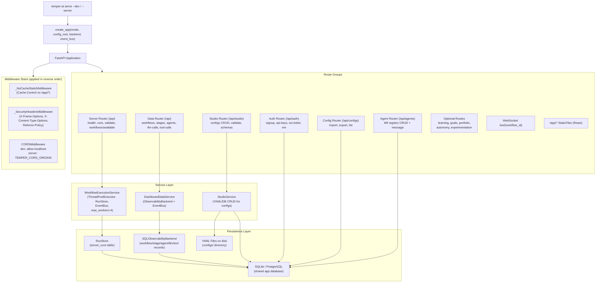
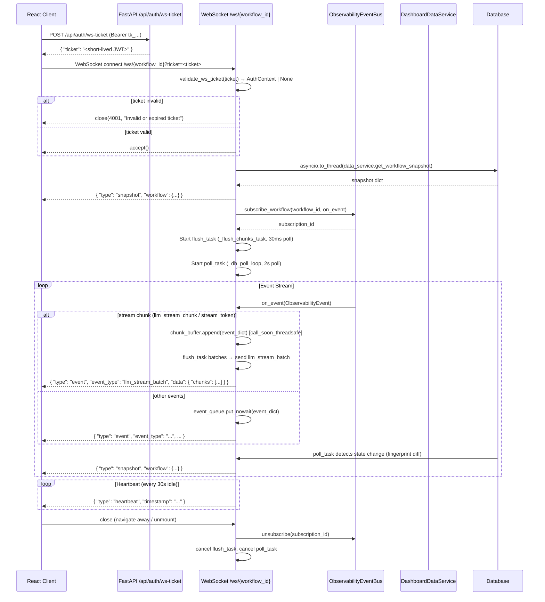
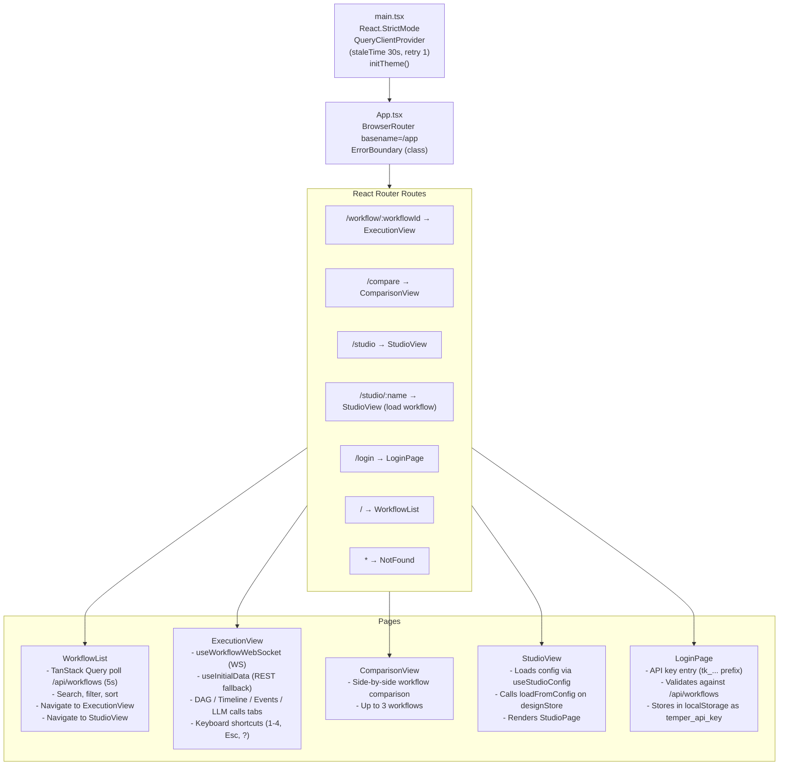
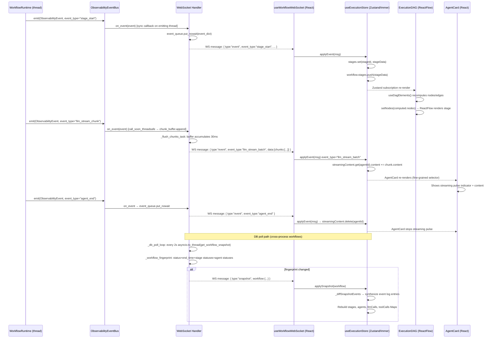
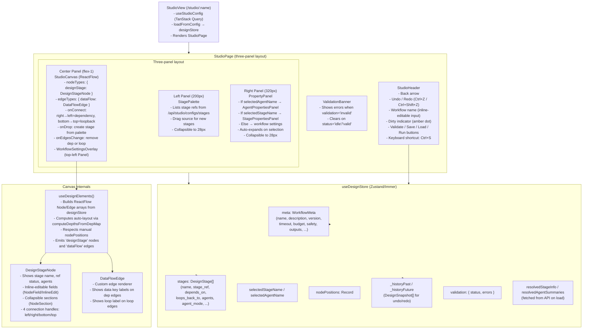
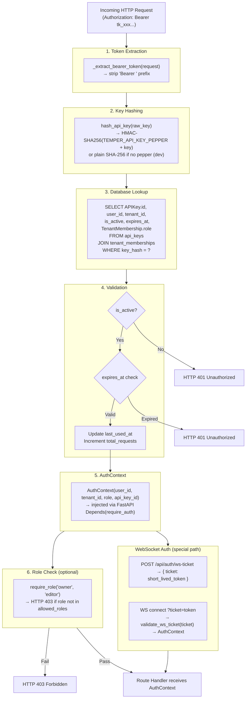

# 12 — Server & Frontend Architecture

## Executive Summary

- **System Name:** Temper AI Server & Frontend
- **Purpose:** A unified HTTP/WebSocket API server and React-based single-page application that exposes workflow execution, real-time monitoring, configuration management, multi-tenant authentication, and a visual workflow editor ("Workflow Studio") to human users and programmatic clients.
- **Technology Stack:** Python 3.12 / FastAPI / SQLModel / Uvicorn (server); React 18 / TypeScript / ReactFlow / Zustand / TanStack Query / Tailwind CSS (frontend); WebSockets (real-time bridge); SQLite or PostgreSQL (persistence).
- **Scope of Analysis:** All files under `temper_ai/interfaces/server/`, `temper_ai/interfaces/dashboard/`, and `frontend/src/` were read in full.

---

## 1. Architecture Overview

### 1.1 High-Level System Architecture

```
┌──────────────────────────────────────────────────────────────────────┐
│                        HTTP Clients                                  │
│             (Browser, curl, SDK clients, MCP clients)                │
└─────────────────────────────┬────────────────────────────────────────┘
                              │ HTTP/WS
                              ▼
┌──────────────────────────────────────────────────────────────────────┐
│                     FastAPI Application                              │
│                  (temper_ai/interfaces/dashboard/app.py)             │
│                                                                      │
│  Middleware stack (outermost → innermost):                           │
│    _NoCacheStaticMiddleware  (Cache-Control: no-cache on /app/)      │
│    _SecurityHeadersMiddleware (X-Frame-Options, X-Content-Type, ...) │
│    CORSMiddleware             (dev: localhost; server: TEMPER_CORS)   │
│                                                                      │
│  ┌─────────────────────────────────────────────────────────────┐    │
│  │ Route Groups (all prefixed /api unless noted)               │    │
│  │                                                              │    │
│  │  /api/health           health.py (liveness + readiness)     │    │
│  │  /api/runs             routes.py (workflow CRUD + events)   │    │
│  │  /api/validate         routes.py (config validation)        │    │
│  │  /api/workflows/...    routes.py (list available YAML files)│    │
│  │  /api/workflows        routes.py (dashboard data queries)   │    │
│  │  /api/stages           routes.py (stage detail queries)     │    │
│  │  /api/agents           routes.py (agent detail queries)     │    │
│  │  /api/llm-calls        routes.py (LLM call queries)         │    │
│  │  /api/tool-calls       routes.py (tool call queries)        │    │
│  │  /api/studio/*         studio_routes.py (CRUD on configs)   │    │
│  │  /api/auth/*           auth_routes.py (signup, api-keys)    │    │
│  │  /api/configs/*        config_routes.py (import/export)     │    │
│  │  /api/agents (M9)      agent_routes.py (registry CRUD)      │    │
│  │  /api/learning/*       learning dashboard routes (optional)  │    │
│  │  /api/goals/*          goals dashboard routes (optional)     │    │
│  │  /api/portfolio/*      portfolio routes (optional)           │    │
│  │  /api/autonomy/*       autonomy routes (optional)            │    │
│  │  /api/experiments/*    experimentation routes (optional)     │    │
│  │  /ws/{workflow_id}     websocket.py (real-time events)       │    │
│  │  /app/*                Static SPA (React dist, with fallback)│    │
│  │  /                     → redirect to /app                    │    │
│  └─────────────────────────────────────────────────────────────┘    │
│                                                                      │
│  App State:                                                          │
│    app.state.execution_service → WorkflowExecutionService           │
│    app.state.shutdown_manager  → GracefulShutdownManager            │
└──────────────────────────────────────────────────────────────────────┘
          │                            │                       │
          ▼                            ▼                       ▼
┌──────────────────┐   ┌─────────────────────┐   ┌────────────────────┐
│WorkflowExecution │   │  DashboardDataService│   │  StudioService     │
│Service           │   │  (read-only queries) │   │  (config CRUD)     │
│(execution_service│   │                      │   │                    │
│.py)              │   │  → ObservabilityBack-│   │  → YAML files on   │
│                  │   │    end (SQL queries) │   │    disk (dev mode) │
│ ThreadPoolExec-  │   │  → EventBus (WS)     │   │  → DB (server mode)│
│ utor (4 workers) │   └─────────────────────┘   └────────────────────┘
│ RunStore (DB)    │              │
│ EventBus (live)  │              ▼
└──────────────────┘   ┌─────────────────────┐
          │             │  SQLObservability-  │
          ▼             │  Backend (SQL DB)   │
┌──────────────────┐   └─────────────────────┘
│WorkflowRuntime   │
│(workflow/runtime.│
│py) — executes    │
│actual workflow   │
└──────────────────┘
```

### 1.2 Operating Modes

The server operates in two distinct modes, selected at startup:

| Mode | `auth_enabled` | CORS | Auth | Studio backend | Use case |
|------|---------------|------|------|----------------|----------|
| `dev` (default) | `False` | localhost only | None | YAML files | Local development |
| `server` | `True` | `TEMPER_CORS_ORIGINS` env | API key (Bearer) | Database | Production deployment |

The mode is set by the `mode` parameter to `create_app()` and flows through the entire application as `auth_enabled = (mode == "server")`.

---

## 2. Mermaid Diagrams

### 2.1 Server Architecture — FastAPI App to Database



### 2.2 WebSocket Connection Lifecycle



### 2.3 React App Routing and Page Structure



### 2.4 Real-Time Execution Monitoring Data Flow



### 2.5 Workflow Studio Architecture



### 2.6 API Authentication Flow



---

## 3. Server Layer — Exhaustive Detail

### 3.1 Application Factory (`temper_ai/interfaces/dashboard/app.py`)

The `create_app()` function is the single entry point for building the FastAPI application. It is called by `temper-ai serve` with appropriate mode arguments.

**Signature:**
```python
def create_app(
    backend: Any = None,       # ObservabilityBackend for DB reads
    event_bus: Any = None,     # ObservabilityEventBus for live events
    mode: str = "dev",         # "dev" | "server"
    config_root: str = "configs",
    max_workers: int = 4,
) -> FastAPI
```

**Startup sequence (lifespan context manager):**
1. `GracefulShutdownManager.register_signals()` — installs SIGTERM/SIGINT handlers that flip `readiness_gate = False`.
2. `BackgroundMiningJob.start()` — optional; starts the learning data mining background coroutine.
3. `BackgroundAnalysisJob.start()` — optional; starts goal analysis background coroutine.
4. `yield` — app runs normally.
5. `BackgroundAnalysisJob.stop()` then `BackgroundMiningJob.stop()` — graceful shutdown of background tasks.
6. `GracefulShutdownManager.drain(execution_service, timeout=30)` — polls every 1 second for up to 30 seconds until no pending/running executions remain.
7. `execution_service.shutdown()` — shuts down the ThreadPoolExecutor.

**Two-phase initialization:** After creating `WorkflowExecutionService`, the factory calls `event_bus.set_execution_service(execution_service)` if the event bus supports it. This enables `_CrossWorkflowTrigger` to start new workflows when events fire without a circular import at module load time.

### 3.2 Middleware Stack

Three ASGI middlewares are applied in this registration order (FastAPI applies them as a wrapping stack, so the last registered runs outermost):

**`_SecurityHeadersMiddleware`** (location: `app.py:89-108`):
- Injects `X-Content-Type-Options: nosniff`
- Injects `X-Frame-Options: DENY`
- Injects `Referrer-Policy: strict-origin-when-cross-origin`
- Applied unconditionally to all HTTP responses.

**`CORSMiddleware`** (location: `app.py:60-86`):
- Dev mode: `allow_origin_regex = r"^https?://(localhost|127\.0\.0\.1)(:\d+)?$"`, `allow_methods=["*"]`, `allow_headers=["*"]`
- Server mode: reads `TEMPER_CORS_ORIGINS` comma-separated list; `allow_methods=["GET", "POST"]`, `allow_headers=["Content-Type", "Authorization"]`; no middleware added if `TEMPER_CORS_ORIGINS` is unset (browser's same-origin policy becomes the gate).

**`_NoCacheStaticMiddleware`** (location: `app.py:26-57`):
- Only intercepts requests where `path.startswith("/app/")`.
- Appends `Cache-Control: no-cache, must-revalidate` to all responses, ensuring browsers always revalidate static assets without stale serving.

### 3.3 Route Registration Order

Route registration in `_register_routes()`:

1. `_register_core_routes()` — server router (runs/health/validate) + WebSocket endpoint.
2. `_register_data_api_routes()` — dashboard data queries (workflows/stages/agents/llm-calls/tool-calls).
3. `_register_studio_routes()` — Studio CRUD under `/api/studio/`.
4. `_register_dashboard_extras()` — optional domain routes (learning, goals, portfolio, autonomy, experimentation, agent registry) loaded via `importlib` to keep fan-out below 8.
5. `_mount_react_app()` — mounts `_SPAStaticFiles` at `/app`, adds `_NoCacheStaticMiddleware`.
6. If `auth_enabled`: `_register_auth_routes()` — auth and config management routes.

The `_SPAStaticFiles` class extends `StaticFiles` with a SPA fallback: any path that does not match an existing static file returns `index.html`, enabling React Router's client-side routing to handle deep links.

### 3.4 Route Reference — All API Endpoints

#### Health Endpoints (no auth)

| Method | Path | Handler | Description |
|--------|------|---------|-------------|
| `GET` | `/api/health` | `check_health()` | Liveness probe. Always 200 if process is up. Returns `{status, version, timestamp}`. |
| `GET` | `/api/health/ready` | `check_readiness()` | Readiness probe. Returns 503 if `readiness_gate=False` (draining) or DB unreachable. Returns `{status, database_ok, active_runs}`. |

#### Run Management Endpoints

Auth: in `server` mode, POST/cancel require `owner` or `editor` role; GET requires any authenticated user.

| Method | Path | Request Body | Response | Description |
|--------|------|-------------|----------|-------------|
| `POST` | `/api/runs` | `RunRequest{workflow, inputs, workspace, run_id, config}` | `RunResponse{execution_id, status, message}` | Start async workflow execution. Path traversal protection: workflow path must be inside `config_root`. Spawns in ThreadPoolExecutor. |
| `GET` | `/api/runs` | Query: `status?, limit(1-1000), offset` | `{runs: [...], total: int}` | List executions with optional status filter. |
| `GET` | `/api/runs/{run_id}` | — | Execution metadata dict | Get execution status by ID. 404 if not found. |
| `POST` | `/api/runs/{run_id}/cancel` | — | `{status: "cancelled", execution_id}` | Cancel a running execution. 404 if not found or already complete. |
| `GET` | `/api/runs/{run_id}/events` | Query: `limit, offset` | `{events: [...], total: int}` | Retrieve observability events for a run via `SQLObservabilityBackend.get_run_events()`. |

#### Workflow Config Endpoints

| Method | Path | Description |
|--------|------|-------------|
| `POST` | `/api/validate` | Validate a workflow config file without executing. Loads via `WorkflowRuntime.load_config()`. Returns `{valid, errors, warnings}`. |
| `GET` | `/api/workflows/available` | List all `.yaml` files in `{config_root}/workflows/`. Reads each file and extracts name/description/version/tags/inputs. |

#### Dashboard Data Endpoints

Auth: all endpoints require `require_auth` in server mode.

| Method | Path | Description |
|--------|------|-------------|
| `GET` | `/api/workflows` | List workflow executions. Params: `limit`, `offset`, `status`. Backed by `DashboardDataService.list_workflows()`. |
| `GET` | `/api/workflows/{workflow_id}` | Full workflow snapshot. 404 if not found. |
| `GET` | `/api/workflows/{workflow_id}/trace` | Hierarchical trace tree. Falls back to snapshot if `export_waterfall` not available. |
| `GET` | `/api/workflows/{workflow_id}/data-flow` | Data flow graph: nodes (stages + agents) + edges (sequential, DAG, loop-back, collaboration). |
| `GET` | `/api/stages/{stage_id}` | Stage execution detail. |
| `GET` | `/api/agents/{agent_id}` | Agent execution detail. |
| `GET` | `/api/llm-calls/{llm_call_id}` | LLM call detail. |
| `GET` | `/api/tool-calls/{tool_call_id}` | Tool call detail. |

#### Studio Endpoints (`/api/studio/`)

Auth: GET endpoints require `require_auth`; POST/PUT require `owner`|`editor`; DELETE requires `owner`. Schema endpoint is always public.

| Method | Path | Description |
|--------|------|-------------|
| `GET` | `/api/studio/configs/{config_type}` | List all configs of given type (`workflows`, `stages`, `agents`, `tools`). |
| `GET` | `/api/studio/configs/{config_type}/{name}` | Get a config as parsed JSON. |
| `GET` | `/api/studio/configs/{config_type}/{name}/raw` | Get raw YAML text. |
| `POST` | `/api/studio/configs/{config_type}/{name}` | Create a new config file (HTTP 201). Validates with Pydantic before writing. |
| `PUT` | `/api/studio/configs/{config_type}/{name}` | Update an existing config. Validates before writing. Increments DB version counter. |
| `DELETE` | `/api/studio/configs/{config_type}/{name}` | Delete a config. Owner-only. |
| `POST` | `/api/studio/validate/{config_type}` | Validate config data without saving. Returns `{valid, errors}`. |
| `GET` | `/api/studio/schemas/{config_type}` | Get JSON Schema for a config type (from Pydantic model). Always public. |

Valid config types: `workflows`, `stages`, `agents`, `tools`. Name validation: `^[a-zA-Z0-9_-]+$`. Max size: 1 MB (serialized JSON).

#### Auth Endpoints (`/api/auth/`)

| Method | Path | Auth | Description |
|--------|------|------|-------------|
| `POST` | `/api/auth/signup` | Public (rate limited: 5/60s per IP) | Create user + default tenant + first API key. Derives tenant slug from email domain. Returns `{user_id, tenant_id, api_key}`. |
| `POST` | `/api/auth/api-keys` | `require_auth` (rate limited: 10/60s) | Create additional API key for authenticated user. Returns `{api_key_id, api_key, key_prefix, label}`. The `api_key` is shown only once. |
| `GET` | `/api/auth/api-keys` | `require_auth` | List API keys for the authenticated user (prefix + metadata only, never full key). |
| `DELETE` | `/api/auth/api-keys/{key_id}` | `require_auth` | Soft-revoke API key (`is_active=False`). |
| `POST` | `/api/auth/ws-ticket` | `require_auth` | Exchange API key for a short-lived WebSocket ticket. Prevents API key leakage into WS query strings. |
| `GET` | `/api/auth/me` | `require_auth` | Return current user + tenant + role info. |

#### Config Import/Export Endpoints (`/api/configs/`)

| Method | Path | Auth | Description |
|--------|------|------|-------------|
| `POST` | `/api/configs/import` | `editor`+`owner` | Upload YAML content, parse it, store in DB. Returns `{name, config_type, version}`. |
| `GET` | `/api/configs/{config_type}/{name}/export` | any auth | Read config from DB and return as `text/yaml`. |
| `GET` | `/api/configs/{config_type}` | any auth | List all configs of type for the authenticated tenant. |

Valid config types: driven by `VALID_CONFIG_TYPES` from `models_tenancy.py`.

#### Agent Registry Endpoints (`/api/agents/`)

M9 persistent agent management. No auth guard in current implementation (registered under optional routes).

| Method | Path | Description |
|--------|------|-------------|
| `GET` | `/api/agents` | List all registered persistent agents. Query: `status?` |
| `GET` | `/api/agents/{name}` | Get agent details. 404 if not found. |
| `POST` | `/api/agents/register` | Register a new persistent agent from config path. |
| `DELETE` | `/api/agents/{name}` | Unregister a persistent agent. |
| `POST` | `/api/agents/{name}/message` | Send a synchronous message to a registered agent. Returns agent response. |

### 3.5 WebSocket Protocol (`temper_ai/interfaces/dashboard/websocket.py`)

The WebSocket endpoint is registered at `/ws/{workflow_id}`.

**Message types sent from server to client:**

| `type` | Fields | When sent |
|--------|--------|-----------|
| `snapshot` | `type, workflow: WorkflowSnapshot` | On connection (initial state) and whenever DB poll detects a state fingerprint change. |
| `event` | `type, event_type, timestamp, data, workflow_id, stage_id, agent_id` | For any non-chunk observability event (stage_start, stage_end, agent_start, agent_end, llm_call, tool_call, etc.). |
| `event` with `event_type: "llm_stream_batch"` | `type, event_type, data: { chunks: [...] }, timestamp` | Batched LLM stream chunks flushed every 30ms (or when buffer reaches 10 chunks). Reduces WebSocket frame overhead for high-throughput streaming. |
| `heartbeat` | `type, timestamp` | Every 30 seconds of inactivity (no events) to keep connection alive. |

**Fingerprinting for DB poll:** `_workflow_fingerprint()` creates a `|`-separated string of `workflow.status`, `workflow.end_time`, all `stage.status`, and all `agent.status`. DB polling compares the current fingerprint to the last-seen fingerprint, only pushing a snapshot when the string differs. This prevents redundant snapshot pushes.

**Adaptive chunk batching:**
- Non-chunk events go to an `asyncio.Queue(maxsize=1024)`.
- Chunk events (type `llm_stream_chunk` or `stream_token`) go to a list `chunk_buffer` via `loop.call_soon_threadsafe`.
- `_flush_chunks_task` polls every 30ms; if buffer size < 10, waits one additional 30ms interval to allow more chunks to accumulate; then sends one `llm_stream_batch` message with all buffered chunks.
- Net effect: first token latency ~30-60ms; burst throughput unchanged.

**Authentication path (server mode):**
1. Client calls `POST /api/auth/ws-ticket` with API key → receives `ticket`.
2. Client connects `WebSocket /ws/{workflow_id}?ticket=<ticket>`.
3. Handler calls `validate_ws_ticket(ticket)` → `AuthContext | None`.
4. On failure: `websocket.close(code=4001, reason="Invalid or expired ticket")`.
5. Deprecated: `?token=<api_key>` path also supported with a log warning.

**Cleanup on disconnect:** The `finally` block cancels `flush_task` and `poll_task`, then calls `data_service.unsubscribe(subscription_id)` to remove the event bus subscriber.

### 3.6 WorkflowExecutionService (`temper_ai/workflow/execution_service.py`)

The canonical location of the execution service. The file at `temper_ai/interfaces/dashboard/execution_service.py` is a re-export shim for backward compatibility.

**Key responsibilities:**
- Bounded concurrency via `ThreadPoolExecutor(max_workers=4)`.
- In-memory tracking via `_executions: dict[str, WorkflowExecutionMetadata]` with `threading.Lock`.
- Persistence via `RunStore` (saves `ServerRun` records to `server_runs` table).
- Event bus integration: each execution subscribes the event bus to capture observability events.
- Status lifecycle: `pending → running → completed | failed | cancelled`.

**`execute_workflow_async()`:** Called from `POST /api/runs`. Returns `execution_id` immediately. Submits `_run_workflow_sync()` to the thread pool, which calls `WorkflowRunner._run_core()` → `WorkflowRuntime.run_pipeline()`.

**`cancel_execution()`:** Sets status to `cancelled` in memory and in `RunStore`. Does not forcefully terminate the running thread (cooperative cancellation only).

**`get_execution_status()`:** Returns in-memory metadata dict if the execution is still tracked, otherwise queries `RunStore`.

**`list_executions()`:** Lists from in-memory map, optionally filtered by status.

**`shutdown()`:** Calls `_executor.shutdown(wait=False)` — does not wait for running workflows.

### 3.7 RunStore (`temper_ai/interfaces/server/run_store.py`)

A thin SQLModel/SQLAlchemy store around the `server_runs` table.

```python
class ServerRun(SQLModel, table=True):
    __tablename__ = "server_runs"
    execution_id: str  # PK
    workflow_id: str | None
    workflow_path: str
    workflow_name: str
    status: str  # pending|running|completed|failed|cancelled
    created_at: datetime
    started_at: datetime | None
    completed_at: datetime | None
    input_data: dict | None  # JSON column
    workspace: str | None
    result_summary: dict | None  # JSON column
    error_message: str | None
    tenant_id: str | None
```

Methods: `save_run()`, `get_run()`, `list_runs()`, `update_status()`. Uses `session.merge()` for upserts.

### 3.8 GracefulShutdownManager (`temper_ai/interfaces/server/lifecycle.py`)

Manages server lifecycle on receipt of SIGTERM or SIGINT.

- `register_signals()`: Registers async signal handlers on the event loop (falls back to `signal.signal()` on Windows).
- `_handle_signal()`: Flips `self.readiness_gate = False`, which causes `GET /api/health/ready` to return 503.
- `drain(execution_service, timeout=30)`: Polls every 1 second until no active executions remain or timeout is reached. Used in the FastAPI lifespan shutdown phase.

### 3.9 DashboardDataService (`temper_ai/interfaces/dashboard/data_service.py`)

Wraps the `ObservabilityBackend` (for reads) and the `ObservabilityEventBus` (for subscriptions).

**Read methods:**
- `get_workflow_snapshot(workflow_id)`: Calls `backend.get_workflow()`. In server mode, filters by `tenant_id`.
- `list_workflows(limit, offset, status, tenant_id)`: Delegates to `backend.list_workflows()`.
- `get_workflow_trace(workflow_id)`: Tries `export_waterfall_trace()`; falls back to `get_workflow_snapshot()`.
- `get_data_flow(workflow_id)`: Constructs a graph of stage nodes + agent nodes + edges. Edge types: `data_flow` (from `depends_on` or sequential fallback) and `collaboration` (from `collaboration_events`). Supports loop-back edges via `loops_back_to` in the workflow config snapshot.
- `get_stage()`, `get_agent()`, `get_llm_call()`, `get_tool_call()`: Thin delegations to backend with tenant_id filtering.

**Event methods:**
- `subscribe_workflow(workflow_id, callback)`: Subscribes to the event bus with a filter that forwards only events where `event.workflow_id == workflow_id`.
- `unsubscribe(subscription_id)`: Removes subscription.

**Data flow graph algorithm:**
1. Extracts `dep_map` and `loops_back_to` from `workflow_config_snapshot.workflow.stages[*].depends_on`.
2. If any stage has `depends_on`, uses DAG mode: iterates stages in execution order, adds dependency edges with `data_keys` from `output_data`, adds loop-back edges.
3. If no `depends_on` found, uses sequential fallback: adds edges between consecutive stage executions.

### 3.10 StudioService (`temper_ai/interfaces/dashboard/studio_service.py`)

Dual-backend CRUD service for workflow/stage/agent/tool configuration files.

**File system mode (dev):**
- Reads/writes YAML files under `{config_root}/{type}/`.
- Uses `yaml.safe_load()` for reads and `yaml.safe_dump()` for writes.
- Clears `ConfigLoader` cache after each write.

**Database mode (server, `use_db=True`):**
- Uses `WorkflowConfigDB`, `StageConfigDB`, `AgentConfigDB` SQLModel tables.
- Row-level tenant isolation via `WHERE tenant_id = ?`.
- Versioning: `version` counter incremented on each update.
- `tools` config type has no DB model; raises `ValueError` if `use_db=True` is requested for tools.

**Validation:** All write operations call `validate_config()` first, which runs `model_class.model_validate(data)` using the Pydantic model for the config type:
- `workflows` → `WorkflowConfig`
- `stages` → `StageConfig`
- `agents` → `AgentConfig`
- `tools` → `ToolConfig`

**Name validation:** `^[a-zA-Z0-9_-]+$`. Max data size: 1 MB (checked via `sys.getsizeof(json.dumps(data))`).

### 3.11 API Key Authentication (`temper_ai/auth/api_key_auth.py`)

**`AuthContext`** (frozen dataclass): `user_id: str`, `tenant_id: str`, `role: str`, `api_key_id: str`.

**Key generation:** `generate_api_key()` returns `(full_key, key_prefix, key_hash)`. The `full_key` is `tk_` + 32-char URL-safe random string. Only `key_prefix` (first 8 chars after `tk_`) and `key_hash` are stored in the DB.

**Key hashing:** `HMAC-SHA256(TEMPER_API_KEY_PEPPER, raw_key)`. If `TEMPER_API_KEY_PEPPER` is not set, falls back to plain `SHA-256` with a warning. The pepper should be a high-entropy secret in production.

**`require_auth` dependency:** FastAPI `Depends` callable that:
1. Extracts `Bearer <token>` from `Authorization` header.
2. Hashes the token.
3. Queries DB: `SELECT ... FROM api_keys JOIN tenant_memberships WHERE key_hash = ?`.
4. Validates `is_active` and `expires_at`.
5. Updates `last_used_at` and `total_requests` on success.
6. Returns `AuthContext` or raises `HTTP 401`.

**`require_role(*roles)` dependency:** Wraps `require_auth`; raises `HTTP 403` if `ctx.role not in roles`.

**`authenticate_ws_token(token)`:** Async variant for deprecated `?token=` WebSocket auth path.

---

## 4. Dashboard Data Service Details

### 4.1 WorkflowRunner (`temper_ai/interfaces/server/workflow_runner.py`)

A programmatic API wrapping `WorkflowRuntime.run_pipeline()` for synchronous execution in a worker thread.

```python
runner = WorkflowRunner()
result = runner.run("workflows/research.yaml", {"topic": "AI"})
# result: WorkflowRunResult(workflow_id, workflow_name, status, result, error_message,
#                           started_at, completed_at, duration_seconds)
```

**Event callback support:** If `on_event` is provided and an `event_bus` is configured, the callback is subscribed for the duration of the run and automatically unsubscribed in the `finally` block.

**`_sanitize_result()`:** Strips non-serializable state keys (like `ExecutionTracker`, `ConfigLoader`, `ToolRegistry`, `Rich Console`) from the workflow result using `_sanitize_workflow_result()` from `execution_service.py`. This prevents JSON serialization failures when returning results via the REST API.

---

## 5. Frontend Architecture

### 5.1 Technology Stack

| Technology | Version/Notes | Purpose |
|-----------|--------------|---------|
| React 18 | with `StrictMode` | UI rendering framework |
| TypeScript | strict mode | Type safety |
| Vite | bundler | Dev server + production build |
| React Router v6 | `BrowserRouter` at `/app` | Client-side routing |
| Zustand + Immer | `zustand/middleware/immer` + `enableMapSet()` | State management |
| TanStack Query v5 | `QueryClient(staleTime: 30s, retry: 1)` | Server state caching |
| ReactFlow (`@xyflow/react`) | custom node/edge types | DAG visualization |
| Tailwind CSS | custom `temper-*` design tokens | Styling |
| Sonner | toast library | Notifications |

### 5.2 Entry Point (`frontend/src/main.tsx`)

```typescript
initTheme();  // Apply stored/system dark/light theme before first render

createRoot(document.getElementById('root')!).render(
  <StrictMode>
    <QueryClientProvider client={queryClient}>
      <App />
    </QueryClientProvider>
  </StrictMode>
);
```

`initTheme()` reads from `localStorage` or `prefers-color-scheme` and applies the theme class before the first paint to eliminate the "flash of wrong theme".

### 5.3 Application Component (`frontend/src/App.tsx`)

`App.tsx` defines:
- `BrowserRouter` with `basename="/app"` (the prefix where the SPA is mounted).
- A class-based `ErrorBoundary` that catches unhandled render errors and shows a "Try again" button.
- React Router `Routes`:

```
/workflow/:workflowId  → ExecutionView
/compare               → ComparisonView
/studio                → StudioView
/studio/:name          → StudioView (loads named workflow)
/login                 → LoginPage
/                      → WorkflowList
*                      → NotFound
```

- A `<Toaster />` component (Sonner) mounted at the root for system-wide toast notifications.

### 5.4 State Management Architecture

Two Zustand stores manage all application state.

#### 5.4.1 ExecutionStore (`frontend/src/store/executionStore.ts`)

Manages live execution monitoring state.

**State shape:**

```typescript
interface ExecutionState {
  workflow: WorkflowExecution | null;          // Full workflow snapshot
  stages: Map<string, StageExecution>;         // O(1) lookup by stage ID
  agents: Map<string, AgentExecution>;         // O(1) lookup by agent ID
  llmCalls: Map<string, LLMCall>;              // O(1) lookup by LLM call ID
  toolCalls: Map<string, ToolCall>;            // O(1) lookup by tool call ID
  streamingContent: Map<string, StreamEntry>; // Active LLM stream per agent ID
  selection: Selection | null;                 // Currently selected entity
  wsStatus: WSStatus;                          // WS connection state
  eventLog: EventLogEntry[];                   // Chronological event log (max 500)
  expandedStages: Set<string>;                 // Stage names with expanded view
  stageDetailId: string | null;                // Stage open in detail overlay
}
```

**Key actions:**

`applySnapshot(workflow: WorkflowExecution)`:
- If first load (`state.workflow === null`): calls `_buildSnapshotEvents()` to reconstruct a full chronological event log from the snapshot data. This populates the event log for workflows that were already running when the user navigated to the page.
- If subsequent snapshot (DB poll update): calls `_diffSnapshotEvents()` to generate synthetic event log entries by diffing old vs new state (new stages, changed statuses, new LLM/tool calls).
- Rebuilds all Maps from the snapshot for O(1) lookups.
- Clears `selection` to prevent stale selection state when workflow changes.

`applyEvent(msg: WSEvent)`:
- Pushes event to `eventLog` (evicts oldest entries when length > 500).
- Updates state based on `event_type`:
  - `workflow_start`/`workflow_end`: updates workflow-level fields.
  - `stage_start`/`stage_end`: upserts stage in `stages` Map; pushes to `workflow.stages` if new.
  - `agent_start`/`agent_end`/`agent_output`: upserts agent in `agents` Map; links to parent stage.
  - `llm_call`: upserts into `llmCalls` Map.
  - `tool_call`: upserts into `toolCalls` Map.
  - `llm_stream_batch`: iterates chunks; accumulates `content` and `thinking` in `streamingContent` Map per `agent_id`. Clears entry on `chunk.done = true`.

#### 5.4.2 DesignStore (`frontend/src/store/designStore.ts`)

Manages the Workflow Studio editor state.

**State shape:**

```typescript
interface DesignState {
  configName: string | null;                   // Null = new (unsaved) workflow
  isDirty: boolean;                            // Unsaved changes indicator
  meta: WorkflowMeta;                          // 50+ workflow-level settings
  stages: DesignStage[];                       // Ordered list of stages
  selectedStageName: string | null;
  selectedAgentName: string | null;
  nodePositions: Record<string, {x,y}>;       // Manual drag positions
  validation: ValidationState;                 // idle|validating|valid|invalid
  resolvedStageInfo: Record<string, ResolvedStageInfo>;      // From stage config files
  resolvedAgentSummaries: Record<string, ResolvedAgentSummary>; // From agent config files
  _historyPast: DesignSnapshot[];              // Undo stack
  _historyFuture: DesignSnapshot[];           // Redo stack
  canUndo: boolean;
  canRedo: boolean;
}
```

**WorkflowMeta contains 50+ fields** covering: name, description, version, timeout, budget limits, error handling policy, safety mode, rate limiting, planning pass settings, observability settings, autonomous loop settings, lifecycle settings, input/output declarations, tags, and owner.

**DesignStage contains 40+ fields** covering: name, stage_ref, depends_on, loops_back_to, max_loops, condition, inputs, agents, agent_mode, collaboration settings, conflict resolution settings, safety settings, error handling, quality gates, convergence settings, outputs, description, version.

**Undo/redo implementation:** Every mutating action calls `captureSnapshot()` → `pushSnapshot()` before applying the change. `pushSnapshot` prepends the snapshot to `_historyPast` and clears `_historyFuture`. `undo()` calls `popUndo()` which moves the current state to `_historyFuture` and restores the top of `_historyPast`. `redo()` does the inverse. Snapshots capture `meta`, `stages`, and `nodePositions`.

**Key actions:**
- `setMeta(partial)`: Merge partial update into `meta`, push undo snapshot, set `isDirty = true`.
- `addStage(stage)`: Append stage (if name not already in use), push undo snapshot.
- `updateStage(name, partial)`: Merge partial into the named stage, push undo snapshot.
- `renameStage(oldName, newName)`: Updates stage name, all `depends_on` references, `loops_back_to` references, and node position keys.
- `removeStage(name)`: Removes stage, cleans up all references in other stages, deletes node position.
- `addDependency(source, target)`: Adds `source` to `target.depends_on`.
- `removeDependency(source, target)`: Removes `source` from `target.depends_on`.
- `setLoopBack(source, target, maxLoops)`: Sets `stage.loops_back_to` and optionally `stage.max_loops`.
- `loadFromConfig(name, config)`: Deserializes a workflow config JSON back into `meta` and `stages` via `parseWorkflowMeta()` and `parseWorkflowStages()`. Clears undo history.
- `toWorkflowConfig()`: Serializes `meta` and `stages` back to a workflow config JSON via `serializeWorkflowConfig()`.

### 5.5 Custom React Hooks

#### `useWorkflowWebSocket` (`frontend/src/hooks/useWorkflowWebSocket.ts`)

Manages the WebSocket connection lifecycle for a given `workflowId`.

**Key behaviors:**
- Constructs the WS URL using the current protocol (`ws:` or `wss:` depending on `location.protocol`).
- Fetches a short-lived ticket from `POST /api/auth/ws-ticket` before connecting. If no API key is in localStorage, connects without auth (dev mode).
- Reconnects with exponential backoff: initial delay 1s, multiplier 1.5, max delay 30s.
- On `ws.onclose`: schedules reconnect, increments `reconnectAttempt`.
- On unmount: sets `unmountedRef.current = true`, cancels pending reconnect timer, nulls out `ws.onclose` before closing to prevent zombie reconnects.
- Message dispatch:
  - `type: "snapshot"` → `applySnapshot(msg.workflow)`
  - `type: "event"` → `applyEvent(msg)`
  - `type: "heartbeat"` → `setWSStatus({ lastHeartbeat: msg.timestamp })`

#### `useInitialData` (`frontend/src/hooks/useInitialData.ts`)

REST API fallback for initial data load.

- Resets the execution store when `workflowId` changes.
- Uses TanStack Query to fetch `GET /api/workflows/{workflowId}`.
- `enabled` flag: only runs if `workflowId` is set and the store has no data yet.
- On data arrival: applies snapshot only if store is still empty (prevents race condition when WS snapshot arrives first).

**Race condition handling:** The `enabled: !!workflowId && !hasData` flag means the REST query is disabled once the WebSocket snapshot has populated the store. If the WS snapshot arrives before the REST response (common case), the REST query's data is never applied.

#### `useDagElements` (`frontend/src/hooks/useDagElements.ts`)

Transforms `ExecutionStore` state into `ReactFlow` `Node[]` and `Edge[]` arrays.

**Algorithm:**
1. Groups stage executions by `stage_name` (handles loop-back iterations).
2. Calls `selectDagInfo()` to extract `dep_map`, `loops_back_to`, `hasDeps`, `maxLoops` from the workflow config snapshot.
3. Calls `computeStagePositions()` to auto-layout nodes. If actual `measured` dimensions are available from ReactFlow, passes them for precise non-overlapping layout.
4. For each stage group, builds a `StageNodeData` object with `stage`, `iterations`, `iterationCount`, `stageColor`, `strategy`, and aggregated token/cost/duration totals.
5. Builds edges:
   - If `hasDeps`: dependency edges (`dep-{source}-{target}`, `smoothstep`, color `EDGE_COLORS.dataFlow`), loop-back edges (`loop-{source}-{target}`, type `loopBack`, dashed, color `EDGE_COLORS.loopBack`).
   - If `!hasDeps`: sequential edges between consecutive stage groups.
   - Edges are animated when the source stage is in `running` status.

#### `useDesignElements` (`frontend/src/hooks/useDesignElements.ts`)

Studio-side equivalent of `useDagElements`. Derives ReactFlow nodes and edges from `DesignStore` state.

**Key differences from `useDagElements`:**
- Reads from `designStore`, not `executionStore`.
- Uses `depthGroups` for auto-layout based on `depends_on` depth computation.
- Respects `nodePositions` for manual drag positions (overrides auto-layout).
- Node type is `designStage` (not `stage`).
- Edge type is `dataFlow` (custom `DataFlowEdge`).
- Edge data includes `dataKeys` (input names wired from the dep stage) and `isLoop` flag.
- Builds `DesignNodeData` with extensive enriched fields from `resolvedStageInfo` and `resolvedAgentSummaries`.

#### `useStudioAPI` (`frontend/src/hooks/useStudioAPI.ts`)

TanStack Query hooks for the Studio CRUD API.

- `useStudioConfigs(configType)`: `GET /api/studio/configs/{configType}`. Returns `{configs, total}`.
- `useStudioConfig(configType, name)`: `GET /api/studio/configs/{configType}/{name}`. Enabled only when `name` is non-null.
- `useSaveWorkflow()`: Mutation; `POST` (new) or `PUT` (existing) to `/api/studio/configs/workflows/{name}`. Invalidates `['studio', 'configs', 'workflows']` on success.
- `useValidateWorkflow()`: Mutation; `POST /api/studio/validate/workflows`. Returns `{valid, errors}`.
- `useSaveAgent()`: Mutation; same pattern as `useSaveWorkflow` but for agents.
- `useValidateAgent()`: Mutation; `POST /api/studio/validate/agents`.
- `useRunWorkflow()`: Mutation; `POST /api/runs`. Returns `{execution_id, status, message}` for navigation.

All hooks use `authFetch()` which automatically injects `Authorization: Bearer {key}` from `localStorage.getItem('temper_api_key')`.

---

## 6. Frontend Pages — Detailed Analysis

### 6.1 WorkflowList (`frontend/src/pages/WorkflowList.tsx`)

The home page at `/`.

**Data fetching:** `useQuery(['workflows'], GET /api/workflows)` with `refetchInterval: 5000` for auto-refresh.

**Features:**
- Text search (debounced, `SEARCH_DEBOUNCE_MS` constant) with `useDebounce` hook.
- Status filter buttons: `all`, `running`, `completed`, `failed`.
- Sort options: `time` (newest first), `name` (alphabetical), `status` (running first).
- Multi-select checkboxes (max 3) for comparison. Shows "Compare (N)" button when 2-3 selected.
- Search/filter/sort preferences persisted to `localStorage` with keys `temper-wf-search`, `temper-wf-filter`, `temper-wf-sort`.
- "Studio" link on each row to open that workflow in the visual editor.
- "Refresh" button with last-updated timestamp.
- `EmptyState` component shown for loading, error, no workflows, and no matches states.

### 6.2 ExecutionView (`frontend/src/pages/ExecutionView.tsx`)

The main workflow monitoring page at `/workflow/:workflowId`.

**Hooks invoked:**
1. `useWorkflowWebSocket(workflowId)` — WebSocket connection.
2. `useInitialData(workflowId)` — REST fallback.
3. `useKeyboardShortcuts` — keyboard navigation.

**Layout (vertical flex column):**
1. `WorkflowHeader` — workflow name, status badge, back button.
2. `WorkflowSummaryBar` — total tokens, cost, duration, stage count.
3. `ViewTabs` — four tabs:
   - **DAG** (default): `ExecutionDAG` + `LiveStreamBar` (floating LLM stream indicator).
   - **Timeline**: `TimelineChart` (Gantt-style execution timeline).
   - **Events** (N): `EventLogPanel` (chronological event list with filtering).
   - **LLM Calls** (N): `LLMCallsTable` (table of all LLM calls with tokens/cost/model).
4. `DetailSheet` — slide-in side panel showing selected stage or agent detail.
5. `StageDetailOverlay` — full-screen overlay for expanded stage detail view.
6. Keyboard shortcuts help modal (toggled with `?` key).

**Toast notifications:** Shows `toast.success("Workflow completed successfully")` or `toast.error("Workflow failed")` when `workflow.status` transitions from `running` to `completed` or `failed`.

**Active tab persistence:** `localStorage.setItem('temper-active-tab', activeTab)` — tab preference survives page refreshes.

**ReactFlowProvider:** Wraps the entire page to provide ReactFlow context to `ExecutionDAG`.

### 6.3 StudioView (`frontend/src/pages/StudioView.tsx`)

Route handler for `/studio` and `/studio/:name`.

**Loading behavior:**
- If `name` param is present: calls `useStudioConfig('workflows', name)` to fetch the config.
- When data arrives: calls `loadFromConfig(name, data)` on the design store.
- If no `name` (new workflow): calls `reset()` if the store has a loaded config (prevents stale state when navigating from `/studio/myWorkflow` to `/studio`).
- Shows loading and error states before rendering `StudioPage`.

### 6.4 LoginPage (`frontend/src/pages/LoginPage.tsx`)

At `/login`. Simple API key form.

- Input type `password` to hide key value.
- On submit: validates against `GET /api/workflows` with `Authorization: Bearer {key}`.
- On 401/403: shows error message.
- On success: stores key in `localStorage.setItem('temper_api_key', key)`, navigates to `/`.
- The `authFetch` utility (used throughout the app) reads this stored key and injects the `Authorization` header automatically.

---

## 7. Execution DAG Visualization

### 7.1 ExecutionDAG (`frontend/src/components/dag/ExecutionDAG.tsx`)

The main ReactFlow canvas for viewing a running or completed workflow.

**Configuration:**
- `nodeTypes = { stage: StageNode }` — custom stage card nodes.
- `edgeTypes = { loopBack: LoopBackEdge }` — custom curved loop-back edges.
- `nodesDraggable = true` but `nodesConnectable = false` (read-only, no edge creation).
- `minZoom = 0.1, maxZoom = 2`.
- Dot background grid at 24px gap.
- Controls (zoom in/out/reset) at `bottom-left`.
- MiniMap at `bottom-right`.

**Two-pass layout strategy:**
1. Initial render uses positions estimated from `useDagElements()`.
2. After ReactFlow measures actual DOM node dimensions (received as `onNodesChange` with `type === "dimensions"`), `relayoutFromMeasurements()` reads `node.measured.width` and `node.measured.height`, re-calls `computeStagePositions()` with real sizes, and updates node positions.
3. Positions are debounced with 150ms to coalesce multiple simultaneous dimension change events.
4. `fitView({ padding: DAG_FIT_PADDING, duration: 300 })` is called after re-layout.

**Keyboard accessibility:**
- `Tab`/`Shift+Tab` cycles focus through stage nodes.
- `Enter` selects the focused stage.
- `Escape` clears selection.
- The container element has `aria-label` describing keyboard controls.

**Auto-fit triggers:**
- On initial render (after 50ms).
- When `computed.nodes.length` changes (new stage arrived).
- When `expandedStages` changes (stage expanded or collapsed).

### 7.2 StageNode (`frontend/src/components/dag/StageNode.tsx`)

Custom React Flow node for a single stage (type `"stage"`).

**Layout within node:**
1. Status border + background (color from `STATUS_COLORS`, `STATUS_BG_COLORS`).
2. Header row: status dot, stage name (colored by `stageColor`), strategy badge, cost badge, detail button (opens `StageDetailOverlay`), agent collapse/expand toggle.
3. Iteration picker (if `iterationCount > 1`): dots with prev/next navigation showing per-iteration status colors.
4. Metrics row: agents completed/total, total tokens, cost, duration, collaboration indicator, failed count.
5. Mini agent status dots (always visible): one colored dot per agent, clickable to select.
6. Expanded: vertical stack of `AgentCard` components.
7. Collapsed: summary line with agent count, tokens, cost.
8. Output preview (last 2 lines of completed/failed stage output).
9. Error message (for failed stages).

**React Flow handles:**
- `target/left` — forward flow input.
- `source/right` — forward flow output.
- `source/bottom` — loop-back source.
- `target/top` — loop-back target (from above).
- `target/bottom-target` — loop-back target (from below).

**Iteration navigation:** The `iterIndex` local state allows browsing between loop iterations. The `StageNodeData.iterations` array contains per-iteration agent data and aggregated metrics.

### 7.3 AgentCard (`frontend/src/components/dag/AgentCard.tsx`)

Individual agent card rendered inside a `StageNode`. Uses fine-grained Zustand selectors to minimize re-renders.

**Content:**
1. Name + model badge + role badge + confidence score badge (color-coded: green ≥ 90%, yellow ≥ 70%, red < 70%).
2. Approval required warning badge (!) if any tool call has `approval_required = true`.
3. Streaming pulse indicator (animated dot) while LLM is streaming.
4. Token bar: horizontal bar showing prompt tokens (blue) vs completion tokens (purple) proportionally.
5. Metrics: duration, total tokens, cost (green), LLM call count, tool call count.
6. Error message for failed agents.
7. Output preview: `agent.output` text; click to expand/collapse.

**Streaming behavior:** The `streaming` selector reads `state.streamingContent.get(agentId)`. While `streaming && !streaming.done`, shows the pulse indicator. On agent_end, the entry is deleted from `streamingContent`.

---

## 8. Workflow Studio — Visual Editor

### 8.1 StudioPage (`frontend/src/components/studio/StudioPage.tsx`)

Three-panel layout shell:

```
┌───────────────┬────────────────────────────┬─────────────────┐
│ Left Panel    │ Center Canvas              │ Right Panel     │
│ (200px)       │ (flex-1)                   │ (320px)         │
│               │                            │                 │
│ StagePalette  │ StudioCanvas (ReactFlow)   │ PropertyPanel   │
│ - Stage refs  │ + WorkflowSettingsOverlay  │ - Stage props   │
│ - Drag source │                            │ - Agent props   │
│               │ EmptyCanvasOverlay         │ - WF settings   │
│ Collapsible   │ (when no stages)           │ Collapsible     │
│ to 28px       │                            │ to 28px         │
└───────────────┴────────────────────────────┴─────────────────┘
```

**Auto-expand right panel:** When `selectedStageName` or `selectedAgentName` changes (becomes non-null), the right panel auto-expands. This ensures the properties panel is always visible when the user clicks a stage or agent.

**Dirty guard:** `beforeunload` event listener warns about unsaved changes when `isDirty = true`.

**`useResolveStageAgents()`:** Background hook that, when `stage_ref` stages are present in the design, fetches their configs from the Studio API to populate `resolvedStageInfo` and `resolvedAgentSummaries` in the design store. This provides accurate agent counts, names, and settings for stage cards and the properties panel.

### 8.2 StudioCanvas (`frontend/src/components/studio/StudioCanvas.tsx`)

ReactFlow canvas for the editor.

**Configuration:**
- `nodeTypes = { designStage: DesignStageNode }` — design-time stage cards.
- `edgeTypes = { dataFlow: DataFlowEdge }` — labeled data flow + loop edges.
- `nodesDraggable = true`, `nodesConnectable = true` — allows creating edges.
- `deleteKeyCode = "Delete"` — Delete key removes selected edges.
- `onConnect`: distinguishes dependency edges (source right handle → target left handle) from loop-back edges (source bottom → target top) and dispatches to the appropriate design store action.
- `onEdgesChange`: handles edge removal; parses `dep|{source}|{target}` and `loop|{source}|` IDs to call `removeDependency` or `setLoopBack(source, null, null)`.
- `onNodesChange`: on `type === "position"` with `dragging === false`, calls `setNodePosition(id, x, y)` to persist drag results.
- `onDrop`: reads `dataTransfer` data (`application/studio-stage-ref` and `application/studio-stage-name`), converts screen position to flow position via `screenToFlowPosition`, generates a unique stage name (avoiding collisions), creates a `DesignStage` with `defaultDesignStage()`, calls `addStage` + `setNodePosition` + `selectStage`.
- `onPaneClick`: calls `selectStage(null)` to deselect on canvas background click.

**`WorkflowSettingsOverlay`:** Floating panel at top-left of the canvas showing high-level workflow settings (timeout, budget, safety mode, etc.) without requiring the user to open the right panel.

### 8.3 StudioHeader (`frontend/src/components/studio/StudioHeader.tsx`)

The top bar with the editor's action buttons.

**Actions:**
- **Load:** Opens `StudioLoadDialog` to browse and load existing workflow configs.
- **Validate:** Calls `toWorkflowConfig()` → `POST /api/studio/validate/workflows`. Shows toast and updates `ValidationBanner`.
- **Save:** Gets `name = configName ?? meta.name`, calls `useSaveWorkflow` (POST if new, PUT if existing). Calls `markSaved(name)` on success.
- **Run:** If dirty or new, saves first. Then calls `useRunWorkflow` with `workflow: "configs/workflows/{name}.yaml"`. On success, navigates to `/workflow/{execution_id}`.

**Keyboard shortcuts:**
- `Ctrl+S` / `Cmd+S`: Save.
- `Ctrl+Z` / `Cmd+Z`: Undo.
- `Ctrl+Shift+Z` / `Cmd+Shift+Z`: Redo.

**Inline name editing:** The workflow name is an editable `<input>` that calls `setMeta({ name: value })` on every keystroke.

**Dirty indicator:** An amber dot appears when `isDirty = true`.

### 8.4 DesignStageNode (`frontend/src/components/studio/DesignStageNode.tsx`)

The complex design-time node card. Significantly more information-dense than `StageNode`.

**Sections:**
1. Header: stage name (inline-editable), ref badge (`REF` if `isRef`), color bar.
2. Agent section: agent names with per-agent summaries (model, temperature, tool count).
3. Execution section: agent mode (sequential/parallel/adaptive), collaboration strategy.
4. Quality gates section (collapsible): min confidence, min findings, citations required.
5. Safety section (collapsible): safety mode, dry run, approval required.
6. Convergence section (collapsible): enabled, max iterations, threshold, method.
7. Conflict resolution section (collapsible): strategy, metrics, thresholds.
8. Inputs section: shows wired input keys and their sources.
9. Outputs section: shows output names.

**Inline editing pattern:** `NodeField` wrapper stops event propagation so that editing does not select the node or trigger canvas events. `InlineEdit` provides a small `<input>` that calls `updateStage()` on blur/enter. `InlineSelect` provides a `<select>` for enum fields.

**ReactFlow handles:** Left (target), right (source for dependency), bottom-0 (source for loop-back), top-N indexed (targets for multiple incoming loop-back edges).

### 8.5 PropertyPanel

The right panel shows different content based on design store selection state:

- `selectedAgentName !== null` → `AgentPropertiesPanel` (reads/writes individual agent YAML via `useAgentEditor`).
- `selectedStageName !== null` → `StagePropertiesPanel` (reads/writes stage config fields in the design store; can also link to stage ref files).
- Neither → Global workflow settings panel (renders `WorkflowMeta` fields in full detail with collapsed sections).

**AgentPropertiesPanel** contains 6 tabs:
- **Prompt**: system prompt, user prompt, Jinja2 template fields.
- **Inference**: model, provider, temperature, max_tokens, top_p, timeout.
- **Tools**: tool list, auto-discovery flag, tool parameters.
- **Safety**: safety mode, risk level, max tool calls, forbidden operations.
- **Advanced**: reasoning, memory, output schema, pre-commands, retry strategy.
- **Meta**: name, description, version, agent type.

**StagePropertiesPanel** shows two modes:
- **Referenced stage** (`stage_ref` set): reads resolved info; most fields are read-only from the config file; shows agent names/summaries from `resolvedStageInfo`.
- **Inline stage** (no `stage_ref`): all fields fully editable via `updateStage()`.

---

## 9. Data Models

### 9.1 Server Run Model (`temper_ai/interfaces/server/models.py`)

```python
class ServerRun(SQLModel, table=True):
    __tablename__ = "server_runs"
    execution_id: str           # UUID-12 primary key
    workflow_id: str | None     # Observability workflow ID (set after completion)
    workflow_path: str          # Relative path to workflow YAML
    workflow_name: str          # Human-readable name
    status: str                 # pending|running|completed|failed|cancelled
    created_at: datetime        # UTC, indexed
    started_at: datetime | None
    completed_at: datetime | None
    input_data: dict | None     # JSON column
    workspace: str | None
    result_summary: dict | None # JSON column, sanitized result
    error_message: str | None
    tenant_id: str | None       # For multi-tenant isolation
```

### 9.2 API Request/Response Models

```python
class RunRequest(BaseModel):
    workflow: str               # Relative path within config_root
    inputs: dict[str, Any] = {}
    workspace: str | None = None
    run_id: str | None = None   # External run ID override
    config: dict[str, Any] = {}

class RunResponse(BaseModel):
    execution_id: str
    status: str = "pending"
    message: str = "Workflow execution started"

class ValidateRequest(BaseModel):
    workflow: str

class HealthResponse(BaseModel):
    status: str = "healthy"
    version: str = "0.1.0"
    timestamp: str

class ReadinessResponse(BaseModel):
    status: str    # "ready" | "draining"
    database_ok: bool
    active_runs: int
```

### 9.3 Auth Request Models

```python
class SignupRequest(BaseModel):
    email: EmailStr
    name: str | None = None

class CreateApiKeyRequest(BaseModel):
    label: str | None = "default"

class ImportConfigRequest(BaseModel):
    config_type: str   # "workflows" | "stages" | "agents" | "tools"
    name: str
    yaml_content: str
```

### 9.4 Frontend TypeScript Types (ExecutionStore)

```typescript
interface WorkflowExecution {
  id: string;
  workflow_name: string;
  status: string;                // pending|running|completed|failed
  start_time: string | null;
  end_time: string | null;
  duration_seconds: number | null;
  stages: StageExecution[];
  // ... observability fields
}

interface StageExecution {
  id: string;
  stage_name: string;
  status: string;
  start_time: string | null;
  end_time: string | null;
  duration_seconds: number | null;
  agents: AgentExecution[];
  output_data: Record<string, unknown> | null;
  error_message: string | null;
  collaboration_events: CollaborationEvent[];
  stage_config_snapshot: Record<string, unknown> | null;
  // ... more fields
}

interface AgentExecution {
  id: string;
  agent_name: string;
  status: string;
  start_time: string | null;
  end_time: string | null;
  duration_seconds: number | null;
  total_tokens: number;
  prompt_tokens: number;
  completion_tokens: number;
  estimated_cost_usd: number;
  total_llm_calls: number;
  total_tool_calls: number;
  output: string | null;
  error_message: string | null;
  confidence_score: number | null;
  role: string | null;
  agent_config_snapshot: Record<string, unknown> | null;
  llm_calls: LLMCall[];
  tool_calls: ToolCall[];
}

interface StreamEntry {
  content: string;    // Accumulated LLM response content
  thinking: string;  // Accumulated reasoning tokens
  done: boolean;
}

interface WSStatus {
  connected: boolean;
  reconnectAttempt: number;
  lastHeartbeat: string | null;
}

interface EventLogEntry {
  timestamp: string;
  event_type: string;
  label: string;
  data: Record<string, unknown>;
}
```

### 9.5 DesignStore Types (`frontend/src/store/designTypes.ts`)

**`WorkflowMeta`** has 50+ fields spanning: identity (name, description, version, product_type), execution (timeout_seconds, max_iterations, convergence_detection, tool_cache_enabled, predecessor_injection), budget (max_cost_usd, max_tokens, budget_action_on_exceed), error handling (on_stage_failure, max_stage_retries, escalation_policy, enable_rollback), safety (global_safety_mode, safety_composition_strategy, approval_required_stages, dry_run_stages), I/O (required_inputs, optional_inputs, outputs), rate limiting, planning pass, observability, autonomous loop, lifecycle, and metadata.

**`DesignStage`** has 40+ fields covering: identity, execution (stage_ref, depends_on, loops_back_to, max_loops, condition, inputs, agents, agent_mode, timeout_seconds), collaboration (collaboration_strategy, max_rounds, convergence_threshold, dialogue_mode, roles, round_budget_usd, context_window_rounds), conflict resolution (conflict_strategy, metrics, metric_weights, auto_resolve_threshold, escalation_threshold), safety (safety_mode, dry_run_first, require_approval), error handling (error_on_agent_failure, min_successful_agents, retry_failed_agents, max_agent_retries), quality gates (enabled, min_confidence, min_findings, require_citations, on_failure, max_retries), convergence (enabled, max_iterations, similarity_threshold, method), and outputs.

---

## 10. Design Patterns and Decisions

### 10.1 Dual-Mode Route Registration Pattern

The most pervasive pattern in the server layer is conditional route registration based on `auth_enabled`. Rather than a single global auth middleware, auth is applied per-route as a FastAPI `Depends`. This allows:
- The same code to work in dev mode (no auth) and server mode (API key auth).
- Fine-grained RBAC: some routes require `owner`|`editor`, others only require authentication.
- The `/api/auth/*` and `/api/configs/*` routes to exist only in server mode.

Implementation: `create_router()`, `create_studio_router()`, and `create_server_router()` each accept `auth_enabled: bool` and register different handler functions (with vs without `AuthContext` parameters).

### 10.2 Event Bus → WebSocket Bridge Pattern

The data pipeline for real-time updates follows a thread-crossing pattern:

```
WorkflowRuntime (thread pool) → emits ObservabilityEvent synchronously
    ↓
ObservabilityEventBus.on_event callback
    ↓
call_soon_threadsafe(chunk_buffer.append, ...) [for chunks]
OR
event_queue.put_nowait(event_dict) [for other events]
    ↓
asyncio event loop tasks:
  _flush_chunks_task (reads chunk_buffer, sends batched WS message)
  _stream_events_loop (reads event_queue, sends WS message per event)
```

This decoupling between the sync workflow thread and the async WebSocket handler is critical for correctness. The `call_soon_threadsafe` mechanism is used for chunk buffering because chunk appends must be serialized on the event loop thread to avoid concurrent list mutation.

### 10.3 Fingerprint-Based DB Polling

The `_workflow_fingerprint()` function creates a cheap string representation of the "visible state" of a workflow — its status, end time, all stage statuses, and all agent statuses. DB polling compares fingerprints to avoid sending redundant snapshot updates to the client. This is important because the DB poll runs every 2 seconds; without fingerprinting, every poll would push a snapshot even when nothing changed.

### 10.4 SPA Fallback Static Files

`_SPAStaticFiles` extends Starlette's `StaticFiles` to catch `HTTPException` (thrown when a file is not found) and return `index.html` instead. This enables React Router's `BrowserRouter` to handle deep links like `/app/workflow/abc123` — the server returns `index.html` for that path, React loads, and React Router renders `ExecutionView` based on the URL.

### 10.5 Zustand Immer with Map/Set

The execution store uses `immer` middleware for ergonomic nested state updates and `enableMapSet()` from Immer to support JavaScript `Map` and `Set` objects inside Immer drafts. Maps provide O(1) lookups by ID, which is critical for the hot path where `applyEvent` updates individual agents or LLM calls during high-frequency streaming.

### 10.6 Fine-Grained Selector Pattern (AgentCard)

```typescript
const agent = useExecutionStore((s) => s.agents.get(agentId));
const streaming = useExecutionStore((s) => s.streamingContent.get(agentId));
```

Each `AgentCard` subscribes to exactly its agent's data using a selector that returns a specific Map entry. Zustand only triggers a re-render when the selected value changes (by reference). This means 50 concurrent agents in a parallel stage do not cause 50 re-renders when one agent updates — only the one affected agent's card re-renders.

### 10.7 Snapshot Diff Event Synthesis

When the DB poll receives a new snapshot for a cross-process workflow (one started by a separate API client or background worker), the execution store calls `_diffSnapshotEvents()` to synthesize event log entries that were not received via WebSocket. This ensures the event log is populated even for DB-polled workflows where the EventBus subscription was not active when the events occurred.

### 10.8 Undo/Redo with Snapshot Stacks

The design store implements undo/redo using two `DesignSnapshot[]` arrays (`_historyPast`, `_historyFuture`). Each `DesignSnapshot` captures `meta`, `stages`, and `nodePositions`. Every mutating action pushes the current state to `_historyPast` before applying the change. Undo moves the current state to `_historyFuture` and restores the top of `_historyPast`. This pattern is simple, predictable, and does not require diffing or command objects.

### 10.9 Lazy Import for Optional Domain Routes

The optional domain routes (learning, goals, portfolio, autonomy, experimentation) are registered via `importlib.import_module()` inside `_register_optional_routes()`. This keeps the `app.py` module's fan-out below the architectural limit of 8 (a key quality score requirement). If any optional module fails to import, a warning is logged and the server continues without that route group.

### 10.10 WebSocket Ticket System

Rather than sending API keys directly in WebSocket query strings (which would appear in server access logs, browser history, and proxy logs), the server uses a two-step ticket exchange:
1. `POST /api/auth/ws-ticket` — exchanges a valid API key for a short-lived ticket.
2. The ticket is passed as `?ticket=<ticket>` in the WebSocket URL.
3. `validate_ws_ticket(ticket)` validates the ticket on the server without touching the database.

The deprecated `?token=<api_key>` path still works for backward compatibility but logs a warning.

---

## 11. Extension and Integration Guide

### 11.1 Adding a New API Route Group

1. Create a new router module (e.g., `temper_ai/my_domain/dashboard_routes.py`) with a `create_my_domain_router(service)` factory function.
2. Create a `dashboard_service.py` with the corresponding service class.
3. Register the router in `_register_optional_routes()` in `temper_ai/interfaces/dashboard/app.py`:

```python
try:
    from temper_ai.my_domain.dashboard_routes import create_my_domain_router
    from temper_ai.my_domain.dashboard_service import MyDomainService
    svc = MyDomainService()
    app.include_router(create_my_domain_router(svc), prefix=_API_PREFIX)
except Exception:
    logger.warning("My domain routes not available")
```

4. Add the domain to `_DOMAIN_REGISTRY` if it follows the standard store/service pattern for auto-registration.

### 11.2 Adding a New WebSocket Message Type

1. Add the event type to the observability event bus `event_type` string enum (or use a new string).
2. Emit the event from the relevant service.
3. The WebSocket handler will automatically forward it to the client.
4. In `executionStore.ts`, add a new `case` in the `applyEvent` switch statement to handle the new event type.
5. Update the `WSEvent` TypeScript type to include the new event type.

### 11.3 Adding a New Config Type to Studio

1. Add the new type to `VALID_CONFIG_TYPES` in `temper_ai/interfaces/dashboard/studio_service.py`.
2. Create a Pydantic model for the config type.
3. Add the model to `_MODEL_MAP`, `_DIR_MAP`, `_WRAPPER_KEY_MAP`, and `_LOADER_TYPE_MAP`.
4. If DB storage is needed, create a SQLModel table in `temper_ai/storage/database/models_tenancy.py` and add it to `_get_db_model()`.
5. The Studio CRUD routes will automatically serve the new type without code changes.

### 11.4 Adding a New React Page

1. Create the page component in `frontend/src/pages/`.
2. Add a `<Route>` in `frontend/src/App.tsx`.
3. Add a link from `WorkflowList` or the header if needed.
4. If the page needs execution data, use `useExecutionStore`. If it needs design data, use `useDesignStore`. For new server state, add a TanStack Query hook in `frontend/src/hooks/`.

### 11.5 Adding a New DAG Node Type

1. Create a new component in `frontend/src/components/dag/`.
2. Add it to the `nodeTypes` object in `ExecutionDAG.tsx` (e.g., `{ stage: StageNode, myNewType: MyNewNode }`).
3. In `useDagElements.ts`, emit nodes with `type: "myNewType"` and the appropriate data shape.
4. Define React Flow handles in the component using `<Handle>` from `@xyflow/react`.

### 11.6 Programmatic Workflow Execution (Embedding)

```python
from temper_ai.interfaces.server.workflow_runner import WorkflowRunner, WorkflowRunnerConfig

runner = WorkflowRunner(
    config=WorkflowRunnerConfig(
        config_root="configs",
        show_details=True,
        trigger_type="api",
    )
)

def my_callback(event):
    print(f"Event: {event.event_type}")

result = runner.run(
    "workflows/research.yaml",
    input_data={"topic": "AI safety"},
    on_event=my_callback,
)
print(f"Status: {result.status}, Duration: {result.duration_seconds}s")
```

---

## 12. Observations and Recommendations

### 12.1 Strengths

**Excellent real-time architecture.** The three-layer event pipeline (ObservabilityEventBus → asyncio Queue + chunk buffer → WebSocket) correctly handles thread-crossing from the sync workflow executor to the async WebSocket handler. The adaptive chunk batching (30ms poll, 10-item batch size) achieves low first-token latency without flooding the WebSocket with individual frames.

**Robust DB polling fallback.** The fingerprint-based DB poll at 2-second intervals ensures cross-process workflows (started by separate API clients or background workers) are visible in the dashboard without requiring the caller to share the same EventBus instance. The fingerprint avoids redundant pushes.

**Well-designed auth integration.** Per-route `Depends(require_auth)` with the `auth_enabled` flag is cleaner than global middleware auth, as it allows public endpoints (health, signup, schema) alongside protected ones. The ticket-based WebSocket auth prevents API key leakage into server logs.

**Fine-grained React state.** The combination of Zustand Map-based state and per-entity selectors (each `AgentCard` subscribing only to its agent) avoids the common React anti-pattern of re-rendering all agents when one changes. The event log capping at 500 entries prevents memory growth in long-running workflows.

**Studio undo/redo.** The snapshot-based undo stack is simple and reliable. Capturing snapshots before every mutation ensures no edit is lost, and clearing history on `loadFromConfig` prevents accidental undo across different workflow loads.

**SPA routing with no-cache.** The `_SPAStaticFiles` fallback + `_NoCacheStaticMiddleware` combination correctly handles deep linking (index.html served for unknown paths) while preventing stale static assets (browsers always revalidate).

### 12.2 Areas of Concern

**`DashboardDataService.get_workflow_trace()`** imports from `examples.export_waterfall`, which is an example script, not a stable library module. This creates an unusual import dependency from the core service layer into the examples directory. If the examples directory is reorganized, this import will break silently (the except clause catches `ImportError` and falls back to `get_workflow_snapshot`). The waterfall trace logic should be moved to a stable location.

**Agent Registry routes have no auth guard.** The `agent_routes.py` module (M9) is registered in `_register_optional_routes()` without applying any `auth_enabled` check. In server mode, `/api/agents` endpoints are accessible without authentication, which may expose agent registry operations to unauthorized callers.

**`RunStore` and `ObservabilityBackend` use separate engines.** The `RunStore` creates its own database engine via `create_app_engine(get_database_url())`, separate from the main observability backend engine. In practice these point to the same database, but this dual-engine approach increases connection pool pressure and makes cross-table transactions impossible.

**`event_queue` maxsize = 1024 drop on overflow.** If a workflow emits events faster than the WebSocket can flush them (e.g., a very large parallel stage with 100+ agents), events are silently dropped with a log warning. Consider a backpressure mechanism or larger buffer.

**Deprecated `?token=` WebSocket auth.** The deprecated path accepts raw API keys in query strings. While a log warning is emitted, the keys still appear in access logs. The deprecated path should have a removal timeline.

**No authentication on optional route group endpoints** (learning, goals, portfolio, autonomy, experimentation). These read-only dashboard routes do not check `auth_enabled` — they are registered unconditionally without auth dependencies.

### 12.3 Best Practices Observed

**Separation of concerns in route handlers.** All business logic is in `_handle_*` helper functions; the actual route handlers are thin wrappers. This pattern makes the handlers testable without the FastAPI layer and avoids code duplication between the auth and no-auth variants of each route.

**Path traversal protection.** Both `POST /api/runs` and `POST /api/validate` use `Path.resolve()` + `relative_to()` to prevent directory traversal attacks on the `workflow` parameter.

**`asyncio.to_thread()` for DB calls in WebSocket.** The initial snapshot fetch and the DB poll both use `asyncio.to_thread()` to run synchronous DB operations without blocking the event loop. This is correct practice for synchronous SQLAlchemy calls inside an async context.

**Graceful degradation for optional routes.** All optional route registrations are wrapped in broad `except Exception` blocks with warning logs. This ensures the server starts successfully even if a domain module has an import error or missing dependency.

**Immer's `enableMapSet()`** is called at module level in `executionStore.ts`, enabling `Map` and `Set` support in Immer drafts. This is the correct initialization location — called once before the store is created.

**`unmountedRef` pattern in WebSocket hook.** Nulling out `ws.onclose` before calling `ws.close()` in the cleanup function prevents the reconnection logic from scheduling a new connection after unmount. This is a subtle but important correctness detail.

---

## 13. File Reference Index

| File | Purpose |
|------|---------|
| `temper_ai/interfaces/dashboard/app.py` | FastAPI app factory, middleware, lifespan, route registration |
| `temper_ai/interfaces/server/routes.py` | Run CRUD, health, validate, available-workflows endpoints |
| `temper_ai/interfaces/server/agent_routes.py` | M9 agent registry HTTP endpoints |
| `temper_ai/interfaces/server/auth_routes.py` | Signup, API key management, WS ticket, /me endpoints |
| `temper_ai/interfaces/server/config_routes.py` | Config import/export/list endpoints |
| `temper_ai/interfaces/server/health.py` | Liveness and readiness check logic |
| `temper_ai/interfaces/server/models.py` | `ServerRun` SQLModel table |
| `temper_ai/interfaces/server/lifecycle.py` | `GracefulShutdownManager` (SIGTERM handling, drain) |
| `temper_ai/interfaces/server/run_store.py` | `RunStore` (SQLModel CRUD for server_runs) |
| `temper_ai/interfaces/server/workflow_runner.py` | `WorkflowRunner` (programmatic embedding API) |
| `temper_ai/interfaces/dashboard/routes.py` | Dashboard data query endpoints (workflows/stages/agents/llm/tool) |
| `temper_ai/interfaces/dashboard/data_service.py` | `DashboardDataService` (read + event subscription) |
| `temper_ai/interfaces/dashboard/execution_service.py` | Re-export shim for `WorkflowExecutionService` |
| `temper_ai/workflow/execution_service.py` | `WorkflowExecutionService` (canonical location) |
| `temper_ai/interfaces/dashboard/studio_routes.py` | Studio CRUD + validate + schema endpoints |
| `temper_ai/interfaces/dashboard/studio_service.py` | `StudioService` (YAML/DB CRUD) |
| `temper_ai/interfaces/dashboard/websocket.py` | WebSocket handler, chunk batching, DB polling |
| `temper_ai/auth/api_key_auth.py` | `AuthContext`, `require_auth`, `require_role`, key hashing |
| `frontend/src/main.tsx` | React entry point, QueryClientProvider, theme init |
| `frontend/src/App.tsx` | BrowserRouter, route definitions, ErrorBoundary |
| `frontend/src/store/executionStore.ts` | Zustand store for live execution monitoring |
| `frontend/src/store/designStore.ts` | Zustand store for Workflow Studio editor state |
| `frontend/src/store/designTypes.ts` | TypeScript type definitions for design store |
| `frontend/src/hooks/useWorkflowWebSocket.ts` | WS connect/reconnect/message dispatch hook |
| `frontend/src/hooks/useInitialData.ts` | TanStack Query REST fallback for initial data |
| `frontend/src/hooks/useDagElements.ts` | Execution store → ReactFlow nodes/edges transform |
| `frontend/src/hooks/useDesignElements.ts` | Design store → ReactFlow nodes/edges transform |
| `frontend/src/hooks/useStudioAPI.ts` | TanStack Query + mutations for Studio CRUD API |
| `frontend/src/pages/ExecutionView.tsx` | Live workflow monitoring page |
| `frontend/src/pages/WorkflowList.tsx` | Workflow list page with search/filter/sort |
| `frontend/src/pages/StudioView.tsx` | Studio route handler (load + render StudioPage) |
| `frontend/src/pages/LoginPage.tsx` | API key login form |
| `frontend/src/pages/ComparisonView.tsx` | Side-by-side workflow comparison |
| `frontend/src/components/dag/ExecutionDAG.tsx` | ReactFlow DAG canvas (two-pass layout) |
| `frontend/src/components/dag/StageNode.tsx` | Custom execution stage node card |
| `frontend/src/components/dag/AgentCard.tsx` | Per-agent card inside StageNode |
| `frontend/src/components/studio/StudioPage.tsx` | Three-panel Studio layout shell |
| `frontend/src/components/studio/StudioCanvas.tsx` | ReactFlow canvas for visual editing |
| `frontend/src/components/studio/StudioHeader.tsx` | Studio top bar (actions + undo/redo) |
| `frontend/src/components/studio/DesignStageNode.tsx` | Information-dense design-time stage node |
| `frontend/src/components/studio/AgentPropertiesPanel.tsx` | Agent config editor (6-tab layout) |
| `frontend/src/components/studio/StagePropertiesPanel.tsx` | Stage config editor (inline vs referenced) |
