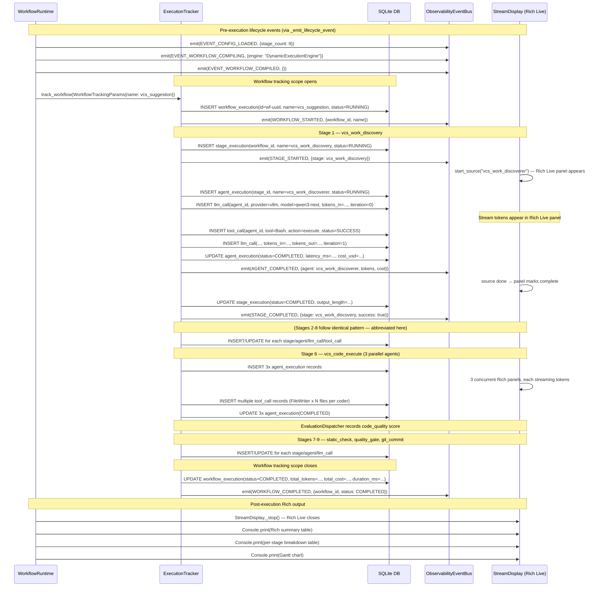
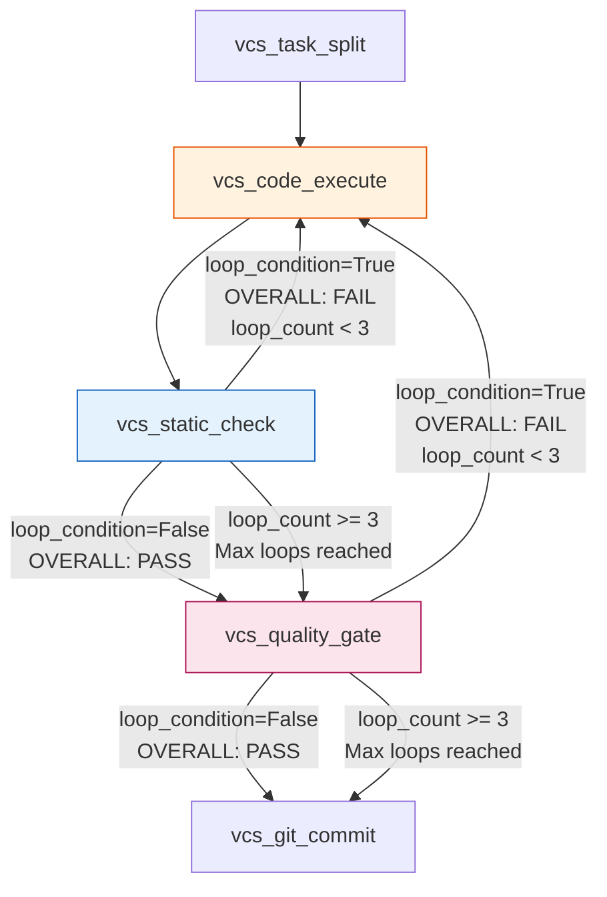

# End-to-End Happy-Path Flow Trace

**Document:** 13-flow-happy-path.md
**System:** temper-ai (Meta-Autonomous Framework)
**Request Traced:** `POST /api/runs` with body `{"workflow": "configs/workflows/vcs_suggestion.yaml", "input_file": "examples/vcs_suggestion_input.yaml"}`
**Date:** 2026-02-22
**Status:** Exhaustive reference trace — every function call, data transformation, and decision point

---

## Table of Contents

1. [Executive Summary](#1-executive-summary)
2. [Workflow Under Analysis](#2-workflow-under-analysis)
3. [Full Sequence Diagram](#3-full-sequence-diagram)
4. [Data Transformation Flowchart](#4-data-transformation-flowchart)
5. [Observability Event Timeline](#5-observability-event-timeline)
6. [Phase 1: API Entry and Request Handling](#6-phase-1-api-entry-and-request-handling)
7. [Phase 2: Infrastructure Initialization](#7-phase-2-infrastructure-initialization)
8. [Phase 3: WorkflowRuntime.run_pipeline()](#8-phase-3-workflowruntimerun_pipeline)
   - 8.1 [load_config() — YAML Parse and Pydantic Validation](#81-load_config--yaml-parse-and-pydantic-validation)
   - 8.2 [adapt_lifecycle() — Optional Adaptation](#82-adapt_lifecycle--optional-adaptation)
   - 8.3 [on_config_loaded Hook — Planning Pass and Input Validation](#83-on_config_loaded-hook--planning-pass-and-input-validation)
   - 8.4 [setup_infrastructure() — Component Creation](#84-setup_infrastructure--component-creation)
   - 8.5 [compile() — DAG Construction](#85-compile--dag-construction)
   - 8.6 [build_state() — Initial State Assembly](#86-build_state--initial-state-assembly)
   - 8.7 [on_state_built Hook (No-Op in Server Mode)](#87-on_state_built-hook-no-op-in-server-mode)
   - 8.8 [execute() — Graph Invocation](#88-execute--graph-invocation)
9. [Phase 4: Stage-by-Stage Execution](#9-phase-4-stage-by-stage-execution)
   - 9.1 [Stage 1: vcs_work_discovery](#91-stage-1-vcs_work_discovery)
   - 9.2 [Stage 2: vcs_design (conditional — parallel + leader)](#92-stage-2-vcs_design-conditional--parallel--leader)
   - 9.3 [Stage 3: vcs_task_planning (sequential, two agents)](#93-stage-3-vcs_task_planning-sequential-two-agents)
   - 9.4 [Stage 4: vcs_git_setup (ScriptAgent)](#94-stage-4-vcs_git_setup-scriptagent)
   - 9.5 [Stage 5: vcs_task_split (single agent)](#95-stage-5-vcs_task_split-single-agent)
   - 9.6 [Stage 6: vcs_code_execute (3 parallel coders)](#96-stage-6-vcs_code_execute-3-parallel-coders)
   - 9.7 [Stage 7: vcs_static_check (StaticCheckerAgent with loop-back)](#97-stage-7-vcs_static_check-staticcheckeragent-with-loop-back)
   - 9.8 [Stage 8: vcs_quality_gate (parallel + leader, loop-back)](#98-stage-8-vcs_quality_gate-parallel--leader-loop-back)
   - 9.9 [Stage 9: vcs_git_commit (conditional on PASS)](#99-stage-9-vcs_git_commit-conditional-on-pass)
10. [Phase 5: Deep Dive — StandardAgent LLM Loop](#10-phase-5-deep-dive--standardagent-llm-loop)
    - 10.1 [Agent Instantiation via AgentFactory](#101-agent-instantiation-via-agentfactory)
    - 10.2 [BaseAgent.execute() — Template Method](#102-baseagentexecute--template-method)
    - 10.3 [StandardAgent._run() — The Main Loop](#103-standardagent_run--the-main-loop)
    - 10.4 [LLMService.run() — The Tool-Calling Loop](#104-llmservicerun--the-tool-calling-loop)
    - 10.5 [Provider Call — vLLM](#105-provider-call--vllm)
    - 10.6 [Tool Execution Pipeline](#106-tool-execution-pipeline)
11. [Phase 6: Safety Stack at Every Tool Call](#11-phase-6-safety-stack-at-every-tool-call)
12. [Phase 7: Post-Execution — Result Recording](#12-phase-7-post-execution--result-recording)
13. [Complete State Dictionary Evolution](#13-complete-state-dictionary-evolution)
14. [Loop-Back Mechanism Deep Dive](#14-loop-back-mechanism-deep-dive)
15. [Key Design Decisions and Patterns](#15-key-design-decisions-and-patterns)
16. [Technical Debt and Observations](#16-technical-debt-and-observations)

---

## 1. Executive Summary

**System Name:** temper-ai (Meta-Autonomous Framework)

**Purpose:** A multi-agent AI workflow orchestration framework. This document traces the exact execution of a `POST /api/runs` request for the `vcs_suggestion` workflow from the moment the HTTP request arrives to the final result returned to the caller.

**Technology Stack:** Python 3.11+, FastAPI/uvicorn, LangGraph (StateGraph/Pregel), DynamicExecutionEngine (Python loop), SQLModel/SQLite, httpx, vLLM (LLM provider), Jinja2 (ImmutableSandboxedEnvironment).

**Scope:** The vcs_suggestion workflow (`engine: dynamic`) runs 9 stages across 4 different executor modes — sequential single-agent, sequential multi-agent, parallel multi-agent with leader synthesis, and script. It demonstrates loop-back from quality gate to coding, conditional branching on approval, structured output extraction, and the full safety stack.

**Workflow Engine Selected:** `DynamicExecutionEngine` (because `engine: dynamic` in the workflow YAML). This means a Python loop via `WorkflowExecutor.run()` rather than a compiled LangGraph `Pregel` graph.

---

## 2. Workflow Under Analysis

The `vcs_suggestion.yaml` workflow defines the following 9-stage pipeline:

```
vcs_work_discovery   (sequential, 1 agent: vcs_work_discoverer)
        │
        │  condition: "DECISION: APPROVE" in output
        ▼
vcs_design           (parallel + leader, 4 agents: arch + impl + safety + decider)
        │
        ▼
vcs_task_planning    (sequential, 2 agents: foundation planner → integration planner)
        │
        ▼
vcs_git_setup        (sequential, 1 ScriptAgent: pulls + creates worktree + feature branch)
        │
        ▼
vcs_task_split       (sequential, 1 agent: vcs_task_splitter)
        │
        ▼  ◄───────────────────────────────────────────────────────────┐
vcs_code_execute     (parallel, 3 agents: vcs_coder_a + b + c)         │ loop-back if FAIL
        │                                                               │ (max_loops: 3)
        ▼                                                               │
vcs_static_check     (sequential, 1 StaticCheckerAgent)  ──────────────┤ loop if OVERALL: FAIL
        │                                                               │
        ▼                                                               │
vcs_quality_gate     (parallel + leader, 4 agents: correctness +       │
                      regression + security_runtime + decider) ─────────┘ loop if OVERALL: FAIL
        │
        │  condition: "OVERALL: PASS" in quality_gate output
        ▼
vcs_git_commit       (sequential, 1 ScriptAgent: commit + push)
```

**Input file (`examples/vcs_suggestion_input.yaml`):**
```yaml
workspace_path: /home/shinelay/temper-ai/workspace/vibe-coding-squad
```

**Required inputs checked:** `workspace_path` — present in input file.

**LLM Provider:** vLLM at `http://localhost:8000` with model `qwen3-next` (used by all non-script agents).

---

## 3. Full Sequence Diagram

This diagram shows the complete happy-path execution, from API request to final result.

```mermaid
sequenceDiagram
    autonumber
    participant Client as HTTP Client
    participant API as interfaces/server/routes.py<br/>_handle_create_run()
    participant ExSvc as WorkflowExecutionService
    participant Runner as WorkflowRunner
    participant RT as workflow/runtime.py<br/>WorkflowRuntime
    participant CL as workflow/config_loader.py<br/>ConfigLoader
    participant ER as workflow/engine_registry.py<br/>EngineRegistry
    participant DE as workflow/engines/dynamic_engine.py<br/>DynamicExecutionEngine
    participant WE as workflow/engines/workflow_executor.py<br/>WorkflowExecutor
    participant NB as workflow/node_builder.py<br/>NodeBuilder
    participant CE as workflow/condition_evaluator.py<br/>ConditionEvaluator
    participant SE as stage/executors/sequential.py<br/>SequentialStageExecutor
    participant PE as stage/executors/parallel.py<br/>ParallelStageExecutor
    participant AF as agent/utils/agent_factory.py<br/>AgentFactory
    participant SA as agent/standard_agent.py<br/>StandardAgent
    participant SC as agent/script_agent.py<br/>ScriptAgent
    participant SCA as agent/static_checker_agent.py<br/>StaticCheckerAgent
    participant LLM as llm/service.py<br/>LLMService
    participant PROV as llm/providers/vllm_provider.py<br/>VllmLLM
    participant VLLM as http://localhost:8000<br/>vLLM Server
    participant TE as tools/executor.py<br/>ToolExecutor
    participant APE as safety/action_policy_engine.py<br/>ActionPolicyEngine
    participant TR as observability/tracker.py<br/>ExecutionTracker
    participant OBS as observability/backends/sql_backend.py<br/>SQLObservabilityBackend

    Client->>API: POST /api/runs {workflow: "vcs_suggestion.yaml", inputs: {workspace_path: "..."}}
    API->>ExSvc: execute_workflow_async(workflow_path, inputs, tenant_id)
    ExSvc->>Runner: WorkflowRunner.run(workflow_path, input_data)
    Runner->>RT: WorkflowRuntime(RuntimeConfig(config_root="configs", trigger_type="api", environment="server"))
    Runner->>RT: rt.run_pipeline(workflow_path, inputs)

    Note over RT: Phase 1: Load and Validate

    RT->>RT: load_config("configs/workflows/vcs_suggestion.yaml", inputs)
    RT->>RT: _validate_file_size(path) — check < 10MB
    RT->>RT: yaml.safe_load(f) — parse vcs_suggestion.yaml
    RT->>RT: _validate_structure(config, path) — depth/node count/circular ref checks
    RT->>RT: _validate_schema(config) — Pydantic WorkflowConfig model validation
    RT->>TR: _emit_lifecycle_event(EVENT_CONFIG_LOADED, {stage_count: 9})
    RT-->>RT: (workflow_config, inputs) returned

    Note over RT: Phase 2: Lifecycle Adaptation (skipped — lifecycle.enabled not set)

    RT->>RT: adapt_lifecycle() → lifecycle_cfg.enabled=False → return unchanged

    Note over RT: Phase 3: Hooks (server path uses no hooks)

    Note over RT: Phase 4: Setup Infrastructure

    RT->>CL: ConfigLoader(config_root="configs")
    RT->>RT: ToolRegistry(auto_discover=True) — discovers 10 built-in tools
    RT->>TR: ExecutionTracker(backend=SQLObservabilityBackend, event_bus=TemperEventBus)
    RT-->>RT: InfrastructureBundle{config_loader, tool_registry, tracker}

    Note over RT: Phase 5: Compile — DynamicExecutionEngine selected

    RT->>ER: EngineRegistry().get_engine_from_config(workflow_config)
    ER-->>RT: DynamicExecutionEngine (because engine: dynamic in YAML)
    RT->>TR: _emit_lifecycle_event(EVENT_WORKFLOW_COMPILING, {engine: "DynamicExecutionEngine"})
    RT->>DE: engine.compile(workflow_config)
    DE->>DE: create_safety_stack() → ActionPolicyEngine + ToolExecutor
    DE->>DE: SequentialStageExecutor(tool_executor=...)
    DE->>DE: ParallelStageExecutor(tool_executor=...)
    DE->>DE: AdaptiveStageExecutor(sequential, parallel)
    DE->>NB: NodeBuilder(config_loader, tool_registry, executors, tool_executor)
    DE->>CE: ConditionEvaluator()
    DE->>DE: WorkflowExecutor(node_builder, condition_evaluator, executors)
    DE->>DE: _extract_stage_refs(workflow_config) → 9 WorkflowStageReference objects
    DE-->>RT: DynamicCompiledWorkflow(workflow_executor, workflow_config, stage_refs)
    RT->>TR: _emit_lifecycle_event(EVENT_WORKFLOW_COMPILED, {engine: "DynamicExecutionEngine"})

    Note over RT: Phase 6: Build State + Tracker Scope Opens

    RT->>TR: tracker.track_workflow(WorkflowTrackingParams{name: "vcs_suggestion", trigger: "api"})
    TR->>OBS: INSERT workflow_execution record — returns workflow_id = "wf-<uuid>"
    RT->>RT: build_state(inputs, infra, workflow_id, workflow_config=..., show_details=True)
    Note over RT: state = {workflow_inputs, tracker, config_loader, tool_registry,<br/>workflow_id, show_details=True, total_stages=9, workflow_name="vcs_suggestion"}

    Note over RT: Phase 7: on_state_built Hook (server path: no hooks — state unchanged)

    Note over RT: Phase 8: Execute — WorkflowExecutor.run() loop

    RT->>RT: compiled.invoke(state) → DynamicCompiledWorkflow.invoke(state)
    RT->>WE: workflow_executor.run(stage_refs, workflow_config, state)
    WE->>WE: build_stage_dag(stage_refs) → StageDAG (topo order, predecessors, depths)
    WE->>WE: compute_depths(dag) → sequential chain, each depth=1 apart

    Note over WE: ═══ STAGE 1: vcs_work_discovery ═══
    WE->>WE: _check_condition(stage_ref, state) — no condition on stage 1 → proceed
    WE->>TR: tracker.track_stage("vcs_work_discovery")
    WE->>NB: node_builder.create_stage_node("vcs_work_discovery", config) → callable
    WE->>WE: stage_node(state) — invoke closure
    NB->>CL: config_loader.load_stage("configs/stages/vcs_work_discovery.yaml")
    NB->>NB: get_agent_mode(stage_cfg) → "sequential"
    NB->>SE: sequential_executor.execute_stage("vcs_work_discovery", stage_cfg, state, ...)
    SE->>SE: _resolve_context(state) → {workspace_path: "/home/.../vibe-coding-squad"}
    SE->>AF: AgentFactory.create(agent_config["vcs_work_discoverer"])
    AF-->>SE: StandardAgent(name="vcs_work_discoverer", llm=VllmLLM, tools=[Bash])
    SE->>SA: agent.execute(input_data={workspace_path: ...}, context={})
    SA->>SA: BaseAgent._setup() — wires tracker, stream_callback, tool_executor
    SA->>SA: _on_setup() → StandardAgent._inject_m9_context() if persistent
    SA->>SA: _build_prompt(input_data) — Jinja2 renders template with workspace_path
    SA->>LLM: llm_service.run(prompt, tools=[Bash], tool_executor=..., observer=...)
    LLM->>LLM: _build_native_tool_defs([Bash]) — SHA-256 cached JSON schemas
    LLM->>LLM: _check_iteration_guards(s, iteration=0) — timeout? hooks?
    LLM->>PROV: vllm.complete(prompt, tools=[bash_schema], temperature=0.3, max_tokens=8192)
    PROV->>API: POST http://localhost:8000/v1/chat/completions {model: qwen3-next, ...}
    API-->>PROV: response with tool_calls: [{name: "Bash", args: {command: "cat VISION.md"}}]
    PROV-->>LLM: LLMResponse(content="", tool_calls=[...])
    LLM->>LLM: parse_tool_calls(response) → [{name: "Bash", parameters: {...}}]
    LLM->>TE: execute_tools([{name: "Bash", parameters: {command: "cat VISION.md"}}])
    TE->>APE: validate_action_sync("bash", {command: "cat VISION.md", workspace: ...})
    APE->>APE: ForbiddenOpsPolicy.check() — "cat" not forbidden ✓
    APE->>APE: FileAccessPolicy.check() — workspace allowed ✓
    APE-->>TE: EnforcementResult(allowed=True)
    TE->>TE: bash_tool.execute(command="cat VISION.md", working_directory=workspace)
    TE-->>LLM: ToolResult(success=True, result="# VISION\n...")
    LLM->>LLM: inject_results(messages, tool_results) — append tool response to messages
    LLM->>PROV: vllm.complete(messages_with_tool_result, ...) — iteration 1
    API-->>PROV: response with content="<answer>WORK_ITEM: ...</answer>", no tool_calls
    PROV-->>LLM: LLMResponse(content="<answer>...</answer>")
    LLM-->>SA: LLMRunResult(content="<answer>WORK_ITEM: ...</answer>", tokens_used=...)
    SA->>SA: _on_after_run(result) → extract_final_answer() → AgentResponse
    SA-->>SE: AgentResponse(output="DECISION: APPROVE\nWORK_ITEM: ...", tokens_used=...)
    SE->>SE: _store_stage_output(state, "vcs_work_discovery", output_data)
    SE->>TR: tracker.track_agent("vcs_work_discoverer", tokens=..., latency=...)
    SE->>TR: tracker.track_stage_complete("vcs_work_discovery", success=True)
    SE->>SD: stream_callback.on_chunk(LLMStreamChunk(chunk_type="done"))
    WE->>WE: state["stage_outputs"]["vcs_work_discovery"] = {output: "DECISION: APPROVE..."}

    Note over WE: ═══ STAGE 2: vcs_design (CONDITIONAL) ═══
    WE->>CE: condition_evaluator.evaluate("{{ 'DECISION: APPROVE' in ... }}", state)
    CE->>CE: Jinja2 ImmutableSandboxedEnvironment.render() — expression = True
    CE-->>WE: True — stage proceeds
    WE->>TR: tracker.track_stage("vcs_design")
    WE->>NB: create_stage_node("vcs_design", config)
    NB->>CL: config_loader.load_stage("configs/stages/vcs_design.yaml")
    NB->>NB: get_agent_mode(stage_cfg) → "parallel"
    NB->>PE: parallel_executor.execute_stage("vcs_design", stage_cfg, state, ...)
    PE->>PE: _resolve_context(state) → {suggestion_text: discovery_output, workspace_path: ...}
    PE->>PE: _build_agent_nodes({arch, impl, safety, decider}) — 4 agent closures
    PE->>PE: _filter_leader_from_agents() → team=[arch, impl, safety], leader=decider
    PE->>PE: LangGraphParallelRunner.run_parallel(team_nodes, state, init_node, collect_node)
    Note over PE: 3 agents run concurrently in LangGraph subgraph
    PE->>AF: AgentFactory.create(arch_config) → StandardAgent(vcs_design_architecture)
    PE->>AF: AgentFactory.create(impl_config) → StandardAgent(vcs_design_implementation)
    PE->>AF: AgentFactory.create(safety_config) → StandardAgent(vcs_design_safety)
    Note over PE: Each agent calls LLMService.run() → vLLM API → returns perspective output
    PE->>PE: collect_node: gather 3 agent outputs into agent_outputs dict
    PE->>PE: _run_synthesis(agent_outputs, stage_cfg, "vcs_design", state, ...)
    PE->>PE: LeaderCollaborationStrategy: format_team_outputs(agent_outputs) → team_text
    PE->>AF: AgentFactory.create(decider_config) → StandardAgent(vcs_design_decider)
    PE->>SA: leader_agent.execute({team_outputs: team_text, workspace_path: ...})
    SA->>LLM: llm_service.run(rendered_prompt, tools=None) → vLLM API
    API-->>SA: synthesis output with DECISION and file_list
    SA-->>PE: AgentResponse(output="unified design spec...")
    PE->>PE: _store_stage_output(state, "vcs_design", {output: ..., design_output: ...})
    PE->>TR: tracker.track_stage_complete("vcs_design", success=True)
    WE->>WE: state["stage_outputs"]["vcs_design"] = {output: ..., design_output: ...}

    Note over WE: ═══ STAGES 3-5: task_planning → git_setup → task_split ═══

    WE->>SE: sequential_executor → vcs_task_plan_foundation → vcs_task_plan_integration
    Note over WE: (foundation specs → then integration planner sees foundation output)
    WE->>SC: script_agent.execute() for vcs_git_setup — zero LLM, subprocess.run(bash_script)
    Note over SC: Creates worktree at /tmp/vcs-run-XXXXXX, outputs worktree_path + branch_name
    WE->>SE: sequential_executor → vcs_task_splitter → splits specs into 3 groups

    Note over WE: ═══ STAGE 6: vcs_code_execute (3 PARALLEL CODERS) ═══
    WE->>PE: parallel_executor.execute_stage("vcs_code_execute", stage_cfg, state, ...)
    PE->>PE: strategy=concatenate → no leader, collect all 3 outputs
    PE->>AF: AgentFactory.create(vcs_coder_a_config) → StandardAgent
    PE->>AF: AgentFactory.create(vcs_coder_b_config) → StandardAgent
    PE->>AF: AgentFactory.create(vcs_coder_c_config) → StandardAgent
    Note over PE: 3 coders run in parallel — each writes assigned files via FileWriter + Bash tools
    PE->>TE: FileWriter.execute(path=worktree/..., content=...) for each file
    TE->>APE: validate_action_sync("file_writer", {path: ..., content: ...})
    APE->>APE: FileAccessPolicy.check(path, workspace) → allowed (under worktree) ✓
    APE->>APE: BlastRadiusPolicy.check(lines_changed=...) ✓
    APE-->>TE: allowed=True
    TE->>TE: file_writer.execute(path, content, overwrite=True)
    PE->>PE: ConcatenateStrategy.synthesize(3 outputs) → combined coder_output
    PE->>PE: _store_stage_output(state, "vcs_code_execute", {coder_output: ...})
    PE->>TR: EvaluationDispatcher.evaluate("code_quality", coder_output) → score stored

    Note over WE: ═══ STAGE 7: vcs_static_check (StaticCheckerAgent) ═══
    WE->>SE: sequential_executor.execute_stage("vcs_static_check", ...)
    SE->>AF: AgentFactory.create(vcs_static_checker_config) → StaticCheckerAgent
    SE->>SCA: static_checker_agent.execute(input_data={workspace_path: worktree})
    SCA->>SCA: _run_pre_commands() — subprocess.run() for each pre_command
    Note over SCA: validate_workspace → py_compile_all → ruff_autofix → ruff_lint → import_modules
    SCA->>SCA: _build_prompt() — inject command_results into Jinja2 template
    SCA->>LLM: llm_service.run(prompt_with_results) → vLLM synthesizes verdict
    API-->>SCA: "OVERALL: PASS\nCHECKS: ..."
    SCA-->>SE: AgentResponse(output="OVERALL: PASS\n...")
    SE->>SE: _store_stage_output(state, "vcs_static_check", ...)
    WE->>CE: loop_condition: "OVERALL: FAIL" in vcs_static_check.output → False
    WE->>WE: No loop-back — proceed to vcs_quality_gate

    Note over WE: ═══ STAGE 8: vcs_quality_gate (parallel + leader) ═══
    WE->>PE: parallel_executor.execute_stage("vcs_quality_gate", ...)
    PE->>PE: team=[correctness, regression, security_runtime], leader=gate_decider
    Note over PE: 3 review agents run in parallel, each reads files via Bash tool
    PE->>PE: LeaderCollaborationStrategy: gate_decider synthesizes verdict
    SA->>LLM: gate_decider: llm_service.run(team_outputs + static_check + design)
    API-->>SA: "OVERALL: PASS\nQUALITY_SUMMARY: ..."
    SA-->>PE: AgentResponse(output="OVERALL: PASS...")
    PE->>TR: EvaluationDispatcher.evaluate("gate_quality", gate_output)
    WE->>CE: loop_condition: "OVERALL: FAIL" in vcs_quality_gate.output → False
    WE->>WE: No loop-back — proceed to vcs_git_commit

    Note over WE: ═══ STAGE 9: vcs_git_commit (CONDITIONAL on PASS) ═══
    WE->>CE: condition: "OVERALL: PASS" in vcs_quality_gate.output → True
    WE->>SE: sequential_executor.execute_stage("vcs_git_commit", ...)
    SE->>AF: AgentFactory.create(vcs_git_commit_config) → ScriptAgent
    SE->>SC: script_agent.execute(input_data={workspace_path: worktree, repo_path: ...})
    SC->>SC: subprocess.run("git add -A && git commit -m ... && git push && git worktree remove")
    SC-->>SE: AgentResponse(output="Committed and pushed feature/...-20260222-...")
    SE->>SE: _store_stage_output(state, "vcs_git_commit", ...)

    WE-->>RT: Final state dict with all stage_outputs populated
    RT->>RT: _emit_workflow_completed(event_bus, "vcs_suggestion", workflow_id) if event_bus
    RT->>TR: tracker scope exits → UPDATE workflow_execution status=COMPLETED, duration=...
    TR->>OBS: UPSERT + batch flush to SQLite

    Note over RT: Phase 9: on_after_execute Hook — Rich Summary

    RT-->>Runner: result dict
    Runner-->>ExSvc: WorkflowRunResult(status="completed")
    ExSvc->>ExSvc: _record_success() — update metadata and RunStore
    ExSvc-->>API: execution_id
    API-->>Client: HTTP 200 {execution_id, status: "pending"}
```



---

## 4. Data Transformation Flowchart

```mermaid
flowchart TD
    A["HTTP Request: POST /api/runs\n\nJSON body:\n- workflow: 'configs/workflows/vcs_suggestion.yaml'\n- inputs: {workspace_path: '...'}"]

    A --> B["Request Handling\ninterfaces/server/routes.py\n_handle_create_run()\n\nPath traversal check\nForward to execution service"]

    B --> C["Input File Loading\nWorkflowRuntime().load_input_file()\n\nYAML → dict:\n{workspace_path: '/home/.../vibe-coding-squad'}"]

    C --> D["Config Loading\nWorkflowRuntime.load_config()\n\nRaw YAML → validated dict:\n- yaml.safe_load() → raw dict\n- _validate_structure() guards\n- Pydantic WorkflowConfig validation\n\nEmits: EVENT_CONFIG_LOADED"]

    D --> E["Infrastructure Setup\nsetup_infrastructure()\n\nCreates:\n- ConfigLoader(config_root='configs')\n- ToolRegistry(auto_discover=True) → 10 tools registered\n- ExecutionTracker(SQL backend)\n- TemperEventBus(persist=False)"]

    E --> F["Engine Selection\nEngineRegistry.get_engine_from_config()\n\nReads: workflow.engine = 'dynamic'\nReturns: DynamicExecutionEngine\n(NOT LangGraphExecutionEngine)"]

    F --> G["Compilation\nDynamicExecutionEngine.compile()\n\nCreates:\n- create_safety_stack() → ActionPolicyEngine + ToolExecutor\n- SequentialStageExecutor, ParallelStageExecutor, AdaptiveStageExecutor\n- NodeBuilder, ConditionEvaluator, WorkflowExecutor\n- 9 WorkflowStageReference objects\n\nReturns: DynamicCompiledWorkflow"]

    G --> H["State Assembly\nbuild_state() inside tracker.track_workflow() scope\n\nInitial state dict:\n- workflow_inputs: {workspace_path: ...}\n- tracker: ExecutionTracker instance\n- config_loader: ConfigLoader instance\n- tool_registry: ToolRegistry instance\n- workflow_id: 'wf-<uuid4>'\n- show_details: False\n- total_stages: 9\n- workflow_name: 'vcs_suggestion'"]

    H --> I["Stage Execution Loop\nWorkflowExecutor.run()\n\nFor each stage:\n1. Condition check (ConditionEvaluator)\n2. Context resolution (SourceResolver)\n3. Stage config load (ConfigLoader)\n4. Executor dispatch (sequential/parallel)\n5. Agent creation (AgentFactory)\n6. LLM call (LLMService → vLLM API)\n7. Tool calls (ToolExecutor → safety check → execute)\n8. Output storage in state[stage_outputs][stage_name]"]

    I --> J["Stage Outputs Accumulated\n\nstate['stage_outputs'] = {\n  vcs_work_discovery: {output: 'DECISION: APPROVE\\nWORK_ITEM: ...'}\n  vcs_design: {output: 'unified_design...', design_output: '...'}\n  vcs_task_planning: {output: 'task_specs...'}\n  vcs_git_setup: {structured: {worktree_path: '/tmp/vcs-run-XXXX', ...}}\n  vcs_task_split: {output: 'CODER_A_TASKS: ...\\nCODER_B_TASKS: ...'}\n  vcs_code_execute: {output: 'FILES_CREATED: ...', coder_output: '...'}\n  vcs_static_check: {output: 'OVERALL: PASS\\n...'}\n  vcs_quality_gate: {output: 'OVERALL: PASS\\n...', gate_output: '...'}\n  vcs_git_commit: {output: 'Committed and pushed feature/...'}\n}"]

    J --> K["Post-Execution Display\non_after_execute hook\n\n- Rich summary table\n- Per-stage breakdown (show_details)\n- Gantt chart (timing)\n- workflow_id displayed\n- Tracker scope closed → SQL committed"]

    K --> L["sys.exit(0)"]

    style A fill:#e3f2fd,stroke:#1565C0
    style D fill:#fff3e0,stroke:#E65100
    style G fill:#f3e5f5,stroke:#6A1B9A
    style H fill:#e8f5e9,stroke:#2E7D32
    style I fill:#fce4ec,stroke:#AD1457
    style J fill:#e8f5e9,stroke:#2E7D32
    style L fill:#e8f5e9,stroke:#2E7D32
```



---

## 5. Observability Event Timeline



---

## 6. Phase 1: API Entry and Request Handling

### 6.1 Entry Point

**File:** `temper_ai/interfaces/server/routes.py`

Workflow execution is triggered via `POST /api/runs` with a JSON body:

```json
{
    "workflow": "configs/workflows/vcs_suggestion.yaml",
    "inputs": {"workspace_path": "/home/shinelay/temper-ai/workspace/vibe-coding-squad"}
}
```

### 6.2 Request Handling

The `_handle_create_run()` handler performs a path traversal security check, then delegates to `WorkflowExecutionService.execute_workflow_async()`, which returns an `execution_id` immediately while the workflow runs in a background thread pool worker.

### 6.3 Server-Side Execution Setup

**File:** `temper_ai/workflow/execution_service.py`

The `WorkflowExecutionService` creates a `WorkflowRunner` which in turn creates a `WorkflowRuntime`:

```python
rt = WorkflowRuntime(config=RuntimeConfig(
    config_root="configs",
    trigger_type="api",
    environment="server",
    initialize_database=False,   # Already done during server startup
    event_bus=event_bus,
))
```

`WorkflowRuntime` (`temper_ai/workflow/runtime.py:149`) is a lightweight class that holds configuration and provides the pipeline methods. It is not a singleton.

---

## 7. Phase 2: Infrastructure Initialization

**File:** `temper_ai/workflow/execution_service.py`, `temper_ai/interfaces/server/workflow_runner.py`

### 7.1 TemperEventBus (Created at Server Startup)

```python
event_bus = TemperEventBus(
    observability_bus=ObservabilityEventBus(),
    persist=False,
)
```

`TemperEventBus` (`temper_ai/events/event_bus.py`) wraps `ObservabilityEventBus` (the in-process pub/sub bus for real-time WebSocket streaming).

### 7.2 Database Initialization (Server Startup)

```python
ExecutionTracker.ensure_database(db_url or get_database_url())
```

`get_database_url()` returns the value of `$TEMPER_DATABASE_URL` environment variable, or defaults to a PostgreSQL connection string. `ensure_database()` creates all tables including `workflow_execution`, `stage_execution`, `agent_execution`, `llm_call`, `tool_call`, `system_metric`, `alert_record`.

### 7.3 WorkflowRunner Creation

```python
runner = WorkflowRunner(
    config=WorkflowRunnerConfig(config_root=self.config_root, workspace=workspace),
    event_bus=self.event_bus,
)
```

`WorkflowRunner` is a thin synchronous wrapper that calls `WorkflowRuntime.run_pipeline()` with no hooks (the server path uses default `None` hooks).

### 7.4 ExecutionHooks

In the server path, no hooks are provided (all `None`). The `WorkflowRunner` calls `run_pipeline()` without hooks:

```python
result_data = rt.run_pipeline(
    workflow_path=workflow_path,
    input_data=input_data,
    workspace=effective_workspace,
    run_id=run_id,
)
```

---

## 8. Phase 3: WorkflowRuntime.run_pipeline()

**File:** `temper_ai/workflow/runtime.py:541–649`

`run_pipeline()` is the single canonical entry point for the shared execution pipeline. Its full body:

```python
def run_pipeline(self, workflow_path, input_data, hooks, workspace, run_id, show_details, mode):
    hooks = hooks or ExecutionHooks()
    engine = None
    try:
        workflow_config, inputs = self.load_config(workflow_path, input_data)     # Step 1
        workflow_config = self.adapt_lifecycle(workflow_config, inputs)            # Step 2
        if hooks.on_config_loaded:
            workflow_config = hooks.on_config_loaded(workflow_config, inputs)      # Step 3
        infra = self.setup_infrastructure()                                        # Step 4
        engine, compiled = self.compile(workflow_config, infra)                    # Step 5
        with infra.tracker.track_workflow(...) as workflow_id:                     # Step 6
            state = self.build_state(inputs, infra, workflow_id, ...)
            if hooks.on_state_built:
                hooks.on_state_built(state, infra)                                 # Step 7
            if hooks.on_before_execute:
                hooks.on_before_execute(compiled, state)                           # Step 8
            result = self.execute(compiled, state)                                 # Step 9
            result["workflow_id"] = workflow_id
        if hooks.on_after_execute:
            hooks.on_after_execute(result, workflow_id)                            # Step 10
        return result
    except Exception as exc:
        if hooks.on_error: hooks.on_error(exc)
        raise
    finally:
        if engine: self.cleanup(engine)                                            # Step 11
```

### 8.1 load_config() — YAML Parse and Pydantic Validation

**File:** `temper_ai/workflow/runtime.py:166–228`

```python
workflow_config, inputs = self.load_config(
    "configs/workflows/vcs_suggestion.yaml",
    {"workspace_path": "/home/.../vibe-coding-squad"}
)
```

**Execution chain:**
1. `_resolve_path("configs/workflows/vcs_suggestion.yaml")` — tries absolute, then `config_root/`, then relative.
2. `_validate_file_size(path)` — reads file stat, rejects if > 10MB.
3. `yaml.safe_load(f)` — parses the 225-line workflow YAML. Returns a Python dict.
4. `isinstance(workflow_config, dict)` — yes, passes.
5. `_validate_structure(workflow_config, path)` — checks:
   - Max nesting depth (default 10 levels)
   - Max node count (default 1000 nodes)
   - No circular references (via DFS)
6. `_validate_schema(workflow_config)` — imports and calls `WorkflowConfig.model_validate(workflow_config)` (Pydantic v2). Validates:
   - `workflow.name` is a string
   - Each stage has `name` and `stage_ref`
   - `depends_on` references exist in the stage list
   - `loops_back_to` references exist
   - `condition` is a string if present
   - `inputs.required` is a list of strings
7. `_emit_lifecycle_event(EVENT_CONFIG_LOADED, {stage_count: 9, workflow_path: ...})`.

**Output:** `(workflow_config_dict, {"workspace_path": "..."})`

### 8.2 adapt_lifecycle() — Optional Adaptation

**File:** `temper_ai/workflow/runtime.py:289–341`

```python
workflow_config = self.adapt_lifecycle(workflow_config, inputs)
```

The vcs_suggestion workflow does not have `workflow.lifecycle.enabled: true`, so `adapt_lifecycle()` returns the workflow config unchanged immediately:

```python
lifecycle_cfg = wf.get("lifecycle", {})
if not lifecycle_cfg.get("enabled", False):
    return workflow_config    # ← exits here for vcs_suggestion
```

No `LifecycleAdapter` is instantiated. No stages are added or removed.

### 8.3 on_config_loaded Hook — Planning Pass and Input Validation

**File:** `temper_ai/interfaces/cli/main.py:916–938`

```python
workflow_config = hooks.on_config_loaded(workflow_config, inputs)
```

The hook closure executes:

1. `WorkflowRuntime.check_required_inputs(wf_config, inputs)`:
   - Reads `workflow.inputs.required` → `["workspace_path"]`
   - Checks `"workspace_path" in inputs` → `True`
   - Returns `[]` (no missing required inputs)
   - If missing inputs existed, would call `console.print("[red]Missing required inputs:[/red]...")` and `raise SystemExit(1)`.

2. `_maybe_run_planning_pass(wf_config, inputs, enable_plan=False, verbose=False)`:
   - `enable_plan=False` and `wf_config` has no `planning.enabled: true` section → skips.
   - No LLM planning call made.

3. `_apply_experiment_variant(experiment_id=None, ...)`:
   - `experiment_id=None` → skips.

4. Stores `wf_config` in `hook_state["wf_config"]` for later use by `on_after_execute`.

5. Returns unmodified `workflow_config`.

### 8.4 setup_infrastructure() — Component Creation

**File:** `temper_ai/workflow/runtime.py:342–378`

```python
infra = self.setup_infrastructure()
```

`initialize_database=False` (already done in `_initialize_infrastructure`), so the schema creation step is skipped.

**Step 1 — ConfigLoader:**
```python
config_loader = ConfigLoader(config_root="configs")
```
`ConfigLoader` (`temper_ai/workflow/config_loader.py`) provides lazy YAML loading for stage and agent configs. It maintains an internal LRU cache keyed by file path to avoid re-reading files. Caches are bounded to 128 entries by default.

**Step 2 — ToolRegistry:**
```python
tool_registry = ToolRegistry(auto_discover=True)
```
`auto_discover=True` triggers `auto_discover()` which inspects the `temper_ai.tools` package using `importlib.import_module` and `inspect.getmembers`. It registers all classes that are subclasses of `BaseTool` and are not abstract. For this installation that is: `Bash`, `Calculator`, `CodeExecutor`, `FileWriter`, `Git`, `HTTPClient`, `JSONParser`, `WebScraper`, `SearXNGSearch`, `TavilySearch` — 10 tools total.

**Step 3 — ExecutionTracker:**
```python
tracker = self._create_tracker(effective_event_bus)
# _create_tracker creates ExecutionTracker(
#     backend=SQLObservabilityBackend(db_path=...),
#     event_bus=TemperEventBus,
#     alert_manager=AlertManager(),
#     sampling_strategy=AlwaysSample(),
# )
```

**Returns:**
```python
InfrastructureBundle(
    config_loader=ConfigLoader,
    tool_registry=ToolRegistry,     # 10 tools registered
    tracker=ExecutionTracker,
    event_bus=TemperEventBus,
)
```

### 8.5 compile() — DAG Construction

**File:** `temper_ai/workflow/runtime.py:380–421`

```python
engine, compiled = self.compile(workflow_config, infra)
```

**Step 1 — Engine selection:**
```python
registry = EngineRegistry()   # Thread-safe singleton
engine = registry.get_engine_from_config(workflow_config, ...)
```

`EngineRegistry.get_engine_from_config()` reads `workflow_config["workflow"]["engine"]` → `"dynamic"`. Looks up `_engines["dynamic"]` → `DynamicExecutionEngine`. Returns a new `DynamicExecutionEngine` instance with `tool_registry` and `config_loader` injected.

**Step 2 — DynamicExecutionEngine.compile():**
```python
compiled = engine.compile(workflow_config)
```

`DynamicExecutionEngine.compile()` (`temper_ai/workflow/engines/dynamic_engine.py`) performs:

1. `create_safety_stack()` (`temper_ai/safety/factory.py`) — creates the full safety stack:
   - `ActionPolicyEngine` with `PolicyRegistry` containing all registered policies
   - `ToolExecutor` wrapping the `ActionPolicyEngine`
   - Policies loaded: `ForbiddenOperationsPolicy`, `SecretDetectionPolicy`, `BlastRadiusPolicy`, `FileAccessPolicy`, `WindowRateLimitPolicy`, `TokenBucketRateLimitPolicy`, `ResourceLimitPolicy`

2. Create the three executor strategies:
   ```python
   seq_exec = SequentialStageExecutor(tool_executor=tool_executor)
   par_exec = ParallelStageExecutor(tool_executor=tool_executor)
   ada_exec = AdaptiveStageExecutor(seq_exec, par_exec)
   ```

3. `NodeBuilder(config_loader, tool_registry, executors, tool_executor, SourceResolver())`
4. `ConditionEvaluator()` — creates `ImmutableSandboxedEnvironment` with LRU template cache
5. `WorkflowExecutor(node_builder, condition_evaluator, executors={sequential, parallel, adaptive})`

6. Extract stage references from workflow config:
   ```python
   stage_refs = _extract_stage_refs(workflow_config)
   # Returns 9 WorkflowStageReference objects, one per stage
   # Each carries: name, stage_ref path, depends_on, condition, loops_back_to, max_loops, loop_condition
   ```

7. Returns:
   ```python
   DynamicCompiledWorkflow(
       workflow_executor=workflow_executor,
       workflow_config=workflow_config,
       stage_refs=stage_refs,    # 9 stages
   )
   ```

### 8.6 build_state() — Initial State Assembly

**File:** `temper_ai/workflow/runtime.py:423–475`

The tracker context manager opens the workflow tracking scope first:

```python
with infra.tracker.track_workflow(WorkflowTrackingParams(
    workflow_name="vcs_suggestion",
    workflow_config=workflow_config,
    trigger_type="api",
    environment="server",
)) as workflow_id:
```

`track_workflow()` (`temper_ai/observability/tracker.py`):
- Generates `workflow_id = str(uuid4())` → e.g., `"wf-7f3d2a1b-..."`
- Inserts a `WorkflowExecution` row into SQLite with `status=RUNNING`, `started_at=datetime.now(UTC)`
- Emits `WORKFLOW_STARTED` event to `ObservabilityEventBus`
- Yields `workflow_id` to the `with` block

Then `build_state()` assembles:

```python
state = {
    "workflow_inputs": {"workspace_path": "/home/.../vibe-coding-squad"},
    "tracker": infra.tracker,              # ExecutionTracker — passed into every node
    "config_loader": infra.config_loader,  # ConfigLoader — for lazy stage/agent config loading
    "tool_registry": infra.tool_registry,  # ToolRegistry — 10 tools
    "workflow_id": "wf-7f3d2a1b-...",
    "show_details": True,
    "detail_console": None,                # filled by on_state_built hook
    "stream_callback": None,               # filled by on_state_built hook
    "total_stages": 9,
    "workflow_name": "vcs_suggestion",
    # Optional: event_bus if workflow config enables it (vcs_suggestion does not)
}
```

`_create_temper_event_bus(workflow_config)` checks `workflow.config.event_bus.enabled` in the YAML — not set in vcs_suggestion → returns `None`.

### 8.7 on_state_built Hook (No-Op in Server Mode)

**File:** `temper_ai/interfaces/cli/main.py:939–977`

```python
hooks.on_state_built(state, infra)
```

Because `show_details=True`:
1. A Rich `Console` object is created.
2. `StreamDisplay(console)` is instantiated — this is the Rich Live multi-panel display.
3. The state is mutated in-place:
   ```python
   state["detail_console"] = console
   state["stream_callback"] = StreamDisplay(console)
   ```

Because `optimization.evaluations` is configured in vcs_suggestion.yaml:
```python
dispatcher = EvaluationDispatcher(
    evaluations_config={
        "discovery_quality": ScoredEvaluator(rubric="Rate this work..."),
        "design_quality": ScoredEvaluator(rubric="Rate this design..."),
        "code_quality": CompositeEvaluator(rubric="...", weights={quality:0.6,cost:0.2,latency:0.2}),
        "gate_quality": ScoredEvaluator(rubric="Rate this quality gate..."),
        "split_quality": ScoredEvaluator(rubric="Rate this task split..."),
    },
    agent_evaluations={
        "vcs_work_discoverer": ["discovery_quality"],
        "vcs_design_decider": ["design_quality"],
        "vcs_task_splitter": ["split_quality"],
        "vcs_coder_a": ["code_quality"],
        "vcs_coder_b": ["code_quality"],
        "vcs_coder_c": ["code_quality"],
        "vcs_gate_decider": ["gate_quality"],
    }
)
state["evaluation_dispatcher"] = dispatcher
```

### 8.8 execute() — Graph Invocation

**File:** `temper_ai/workflow/runtime.py:477–513`

```python
result = self.execute(compiled, state)
```

`execute()` calls:
```python
result = compiled.invoke(state)
# → DynamicCompiledWorkflow.invoke(state)
# → workflow_executor.run(self.stage_refs, self.workflow_config, state)
```

The `workflow.completed` event is emitted if an event bus is in state:
```python
event_bus = state.get("event_bus")
if event_bus is not None:
    _emit_workflow_completed(event_bus, "vcs_suggestion", workflow_id)
```

For vcs_suggestion, `event_bus` is not in state (workflow config does not enable it), so this is skipped.

---

## 9. Phase 4: Stage-by-Stage Execution

**File:** `temper_ai/workflow/engines/workflow_executor.py`

`WorkflowExecutor.run()` is a Python loop that:
1. Calls `build_stage_dag(stage_refs)` to build the dependency DAG
2. Calls `compute_depths(dag)` to assign depth levels
3. Iterates over depth-groups in topo order
4. For each stage, checks conditions, skips, loop-backs, and dispatches to the appropriate executor

**DAG topology for vcs_suggestion** (all `depends_on` declared):
```
Depth 0: vcs_work_discovery   (root, no depends_on)
Depth 1: vcs_design            (depends_on: [vcs_work_discovery])
Depth 2: vcs_task_planning     (depends_on: [vcs_design])
Depth 3: vcs_git_setup         (depends_on: [vcs_task_planning])
Depth 4: vcs_task_split        (depends_on: [vcs_git_setup])
Depth 5: vcs_code_execute      (depends_on: [vcs_task_split])
Depth 6: vcs_static_check      (depends_on: [vcs_code_execute], loops_back_to: vcs_code_execute)
Depth 7: vcs_quality_gate      (depends_on: [vcs_static_check], loops_back_to: vcs_code_execute)
Depth 8: vcs_git_commit        (depends_on: [vcs_quality_gate], condition: OVERALL: PASS)
```

Since every depth group contains exactly one stage (linear chain), `WorkflowExecutor` runs in purely sequential mode — no parallel depth groups.

### 9.1 Stage 1: vcs_work_discovery

**Stage config:** `configs/stages/vcs_work_discovery.yaml`
- **agent_mode:** `sequential`
- **agents:** `[vcs_work_discoverer]`
- **timeout:** 600s

**Context resolution** (`SourceResolver.resolve()`):
```python
# Stage inputs:
#   workspace_path: {source: workflow.workspace_path, required: true}
input_data = {
    "workspace_path": state["workflow_inputs"]["workspace_path"]
    # → "/home/shinelay/temper-ai/workspace/vibe-coding-squad"
}
```

**Executor dispatch:** `SequentialStageExecutor.execute_stage()`

**Agent creation** (`AgentFactory.create(config)`):
- Reads `configs/agents/vcs_work_discoverer.yaml` (loaded via `ConfigLoader`)
- `type: standard` → creates `StandardAgent`
- Provider: `vllm`, model: `qwen3-next` (or similar, depending on agent config)

**LLM call pattern** (see Section 10 for deep dive):
1. Renders Jinja2 prompt template with `workspace_path` injected
2. Tool `Bash` is auto-discovered (agent has `tools: null` or lists Bash)
3. First LLM call → tool_calls: `[{name: "Bash", args: {command: "cat docs/products/VISION.md"}}]`
4. Safety check: `ForbiddenOpsPolicy` allows `cat`, `FileAccessPolicy` allows reading under workspace
5. Bash executes, returns VISION.md content
6. Possibly more tool calls (e.g., `ls`, directory scans)
7. Final LLM response without tool calls → `<answer>DECISION: APPROVE\nWORK_ITEM: ...</answer>`
8. `extract_final_answer()` strips `<answer>` tags

**Output stored:**
```python
state["stage_outputs"]["vcs_work_discovery"] = {
    "output": "DECISION: APPROVE\nWORK_ITEM: Add login page ...",
    "discovery_output": "DECISION: APPROVE\nWORK_ITEM: ...",  # structured field
}
```

**Observability emitted:**
- `STAGE_STARTED`, `AGENT_STARTED`, multiple `LLM_CALL` records, `TOOL_CALL` record(s), `AGENT_COMPLETED`, `STAGE_COMPLETED`

**EvaluationDispatcher:** After agent completion, `EvaluationDispatcher.evaluate("discovery_quality", output)` is called for `vcs_work_discoverer`. The `ScoredEvaluator` makes a secondary LLM call to score the output 0.0–1.0 using the rubric from the workflow config. Score stored in tracker.

### 9.2 Stage 2: vcs_design (conditional — parallel + leader)

**Condition check** (`ConditionEvaluator.evaluate()`):
```python
condition = "{{ 'DECISION: APPROVE' in (stage_outputs.vcs_work_discovery.output | default('') | upper) or 'DECISION:APPROVE' in ... }}"
```

`ConditionEvaluator` uses `ImmutableSandboxedEnvironment`. The safe context is built from state, filtering infrastructure keys (`tracker`, `config_loader`, `tool_registry`, etc.) and only exposing user-facing data (`stage_outputs`, `workflow_inputs`). The expression evaluates to `True` since the discovery output contains `"DECISION: APPROVE"`.

**Stage config:** `configs/stages/vcs_design.yaml`
- **agent_mode:** `parallel`
- **agents:** `[vcs_design_architecture, vcs_design_implementation, vcs_design_safety, vcs_design_decider]`
- **collaboration.strategy:** `leader`
- **leader_agent:** `vcs_design_decider`
- **timeout:** 600s, **max_concurrent:** 3

**Context resolution:**
```python
input_data = {
    "suggestion_text": state["stage_outputs"]["vcs_work_discovery"]["output"],
    "workspace_path": state["workflow_inputs"]["workspace_path"],
}
```

**Executor dispatch:** `ParallelStageExecutor.execute_stage()`

`ParallelStageExecutor._build_agent_nodes()` creates 4 agent node callables. `_filter_leader_from_agents()` separates `vcs_design_decider` from the team (arch, impl, safety).

**LangGraphParallelRunner.run_parallel():** Runs the 3 team agents concurrently in a LangGraph `StateGraph` subgraph:
- `arch_node` → StandardAgent renders its perspective prompt → vLLM API call → returns architecture design
- `impl_node` → StandardAgent renders implementation perspective → vLLM API → returns implementation plan
- `safety_node` → StandardAgent renders safety perspective → vLLM API → returns security considerations

All 3 run concurrently using LangGraph's parallel branch execution. Results are merged via `collect_node` which uses `Annotated` reducers.

**Leader synthesis:** `LeaderCollaborationStrategy.format_team_outputs()` concatenates the 3 outputs:
```
=== vcs_design_architecture ===
[architecture perspective text]

=== vcs_design_implementation ===
[implementation perspective text]

=== vcs_design_safety ===
[safety perspective text]
```

Then `_invoke_leader_agent()` creates `vcs_design_decider` (StandardAgent) and calls it with `{team_outputs: formatted_text, workspace_path: ...}`. The decider synthesizes a unified design specification.

**Output stored:**
```python
state["stage_outputs"]["vcs_design"] = {
    "output": "UNIFIED DESIGN SPEC:\n...",
    "design_output": "UNIFIED DESIGN SPEC:\n...",
    "architecture_summary": "...",
    "file_list": "...",
    "dependencies": "...",
}
```

### 9.3 Stage 3: vcs_task_planning (sequential, two agents)

**Stage config:** `configs/stages/vcs_task_planning.yaml`
- **agent_mode:** `sequential`
- **agents:** `[vcs_task_plan_foundation, vcs_task_plan_integration]`
- **timeout:** 1200s

`SequentialStageExecutor` runs agents one by one. Each agent's output is injected into the next agent's context. The `foundation planner` creates specs for foundational files (models, db). Then the `integration planner` receives the foundation output and creates specs for files that import from foundation (routes, main).

**Output stored:**
```python
state["stage_outputs"]["vcs_task_planning"] = {
    "output": "TASK_SPEC_1: ...\nTASK_SPEC_2: ...",
    "task_specs": "...",
    "task_count": "8",
    "foundation_files": "...",
    "integration_files": "...",
}
```

### 9.4 Stage 4: vcs_git_setup (ScriptAgent)

**Stage config:** `configs/stages/vcs_git_setup.yaml`
- **agent_mode:** `sequential`
- **agents:** `[vcs_git_setup]`
- **timeout:** 120s

**Agent type:** `script` → `AgentFactory` creates `ScriptAgent`.

**ScriptAgent execution** (`temper_ai/agent/script_agent.py`):
1. `_run()` renders the bash script template using Jinja2 with input data:
   - `{{ workspace_path }}` → `/home/.../vibe-coding-squad`
   - `{{ suggestion_text }}` → discovery output text
2. Calls `subprocess.run(rendered_script, shell=True, capture_output=True, timeout=120)`
3. Script outputs `::output` markers that are parsed into structured fields
4. Returns `AgentResponse(output=stdout)` with structured fields parsed from `::output` lines

**Script actions (no LLM calls):**
- `git -C $WORKSPACE init` (if no .git directory)
- `git -C $WORKSPACE pull origin main` (if remote exists)
- `BRANCH_NAME="feature/$SLUG-$(date +%Y%m%d-%H%M%S)"`
- `WORKTREE=$(mktemp -d /tmp/vcs-run-XXXXXX)`
- `git -C $WORKSPACE worktree add $WORKTREE -b $BRANCH_NAME HEAD`

**Output stored:**
```python
state["stage_outputs"]["vcs_git_setup"] = {
    "output": "::output worktree_path=/tmp/vcs-run-X1Y2Z3\n::output feature_branch=feature/...",
    "structured": {
        "worktree_path": "/tmp/vcs-run-X1Y2Z3",
        "feature_branch": "feature/add-login-page-20260222-143512",
        "default_branch": "main",
        "pull_status": "success",
    }
}
```

### 9.5 Stage 5: vcs_task_split (single agent)

**Stage config:** `configs/stages/vcs_task_split.yaml`
- **agents:** `[vcs_task_splitter]`
- **timeout:** 300s

**Context resolution:**
```python
input_data = {
    "task_specs": state["stage_outputs"]["vcs_task_planning"]["output"],
    "design_output": state["stage_outputs"]["vcs_design"]["output"],
    "workspace_path": state["stage_outputs"]["vcs_git_setup"]["structured"]["worktree_path"],
    # ↑ structured output extraction: vcs_git_setup.structured.worktree_path
}
```

Note the structured output accessor: `source: vcs_git_setup.structured.worktree_path` — `SourceResolver` reads `state["stage_outputs"]["vcs_git_setup"]["structured"]["worktree_path"]`.

**Agent behavior:** `vcs_task_splitter` splits task specs into 3 assignment groups (CODER_A, CODER_B, CODER_C) ensuring that files importing from each other land in the same group.

**EvaluationDispatcher:** `split_quality` rubric is evaluated for this agent.

**Output stored:**
```python
state["stage_outputs"]["vcs_task_split"] = {
    "output": "CODER_A_TASKS:\n- models/user.py\n...\nCODER_B_TASKS:\n..."
}
```

### 9.6 Stage 6: vcs_code_execute (3 parallel coders)

**Stage config:** `configs/stages/vcs_code_execute.yaml`
- **agent_mode:** `parallel`
- **agents:** `[vcs_coder_a, vcs_coder_b, vcs_coder_c]`
- **collaboration.strategy:** `concatenate`
- **max_concurrent:** 3
- **timeout:** 1800s

**Context resolution:**
```python
input_data = {
    "workspace_path": state["stage_outputs"]["vcs_git_setup"]["structured"]["worktree_path"],
    "task_assignments": state["stage_outputs"]["vcs_task_split"]["output"],
    "task_specs": state["stage_outputs"]["vcs_task_planning"]["output"],
    "design_output": state["stage_outputs"]["vcs_design"]["output"],
    "quality_gate_output": state["stage_outputs"].get("vcs_quality_gate", {}).get("output", ""),
    "static_check_output": state["stage_outputs"].get("vcs_static_check", {}).get("output", ""),
}
```

**Executor dispatch:** `ParallelStageExecutor.execute_stage()` with `ConcatenateStrategy` (no leader). All 3 agents run concurrently.

**Each coder agent (StandardAgent):**
- Provider: `vllm`, model: `qwen3-next`
- Tools: `FileWriter`, `Bash` (with allowlist: python3, pip, ls, cat, find, mkdir, pwd)
- Max tool calls per execution: 30
- The agent reads its assigned task group from `task_assignments` (filtered by its name: CODER_A, CODER_B, CODER_C)
- Makes LLM calls to generate code
- Calls `FileWriter.execute(path=worktree/..., content=..., overwrite=True)` for each file
- Calls `Bash.execute(command="pip install ...", working_directory=worktree)` for dependencies
- Returns summary in `<answer>` tags

**Each FileWriter call passes through the safety stack:**
1. `ToolExecutor.execute("FileWriter", {path: ..., content: ..., overwrite: True})`
2. `ActionPolicyEngine.validate_action_sync("file_writer", params)`
3. `FileAccessPolicy.check(path, workspace_root=worktree)` — verifies path is under the worktree
4. `BlastRadiusPolicy.check(len(content))` — guards against writing extremely large files
5. `SecretDetectionPolicy.check(content)` — scans for API keys, tokens in content
6. All pass → `FileWriter.execute()` runs → file written to disk
7. `RollbackManager.create_snapshot(path)` saves pre-write state for potential rollback

**ConcatenateStrategy.synthesize():** Concatenates the 3 coder outputs verbatim. No disagreement resolution — each coder worked on non-overlapping files.

**Output stored:**
```python
state["stage_outputs"]["vcs_code_execute"] = {
    "output": "=== vcs_coder_a ===\nFILES_CREATED:\n- /tmp/vcs-run-X1Y2Z3/models/user.py\n...",
    "coder_output": "...",   # structured field
    "files_created": "...",
    "files_modified": "...",
    "dependencies_installed": "...",
}
```

### 9.7 Stage 7: vcs_static_check (StaticCheckerAgent with loop-back)

**Stage config:** `configs/stages/vcs_static_check.yaml`
- **agent_mode:** `sequential`
- **agents:** `[vcs_static_checker]`
- **loops_back_to:** `vcs_code_execute`
- **max_loops:** 3
- **loop_condition:** `"{{ 'OVERALL: FAIL' in ... }}"`
- **timeout:** 900s

**Agent type:** `static_checker` → `AgentFactory` creates `StaticCheckerAgent`.

**StaticCheckerAgent execution** (`temper_ai/agent/static_checker_agent.py`):
1. `_run_pre_commands()` — runs all pre_commands via subprocess **before** any LLM call:
   - `validate_workspace` — `test -d /tmp/vcs-run-X1Y2Z3` (5s timeout) → exit 0
   - `py_compile_all` — `find /tmp/vcs-run-X1Y2Z3 -name '*.py' -exec python3 -m py_compile {} +` (30s) → exit 0 if no syntax errors
   - `ruff_autofix` — `cd /tmp/vcs-run-X1Y2Z3 && python3 -m ruff format . && python3 -m ruff check --select=E,F --fix --unsafe-fixes .` (30s) → applies auto-fixes, exit 0
   - `ruff_lint` — `cd /tmp/vcs-run-X1Y2Z3 && python3 -m ruff check --select=E,F --no-fix .` (30s) → checks remaining issues
   - `import_modules` — attempts to import each top-level module to verify import chains (60s)

2. `_build_prompt()` injects `{{ command_results }}` which contains exit codes + stdout/stderr from all pre_commands.

3. `_run()` calls `LLMService.run(prompt_with_results)` → vLLM synthesizes verdict.

4. LLM output (no tool calls needed — all information comes from pre_commands):
   ```
   OVERALL: PASS
   CHECKS:
   - name: py_compile_all
     result: PASS
     detail: No syntax errors found
   - name: ruff_lint
     result: PASS
     detail: All checks passed
   ...
   ```

**Happy path (PASS):** `loop_condition` evaluates `"OVERALL: FAIL" in output` → `False`.

**WorkflowExecutor behavior for loop-back:**
```python
if loop_condition_evaluates_true and loops_back_to is not None:
    loop_count = state.get(f"_loop_{stage_name}", 0)
    if loop_count < max_loops:
        state[f"_loop_{stage_name}"] = loop_count + 1
        state["_goto"] = loops_back_to    # Signal to jump back
```

On the happy path, loop-back does not occur. The pipeline proceeds to `vcs_quality_gate`.

**Output stored:**
```python
state["stage_outputs"]["vcs_static_check"] = {
    "output": "OVERALL: PASS\nCHECKS:\n...",
    "check_verdict": "PASS",
    "verdict": "PASS",
    "errors_found": "none",
    "warnings_found": "none",
}
```

### 9.8 Stage 8: vcs_quality_gate (parallel + leader, loop-back)

**Stage config:** `configs/stages/vcs_quality_gate.yaml`
- **agent_mode:** `parallel`
- **agents:** `[vcs_gate_correctness, vcs_gate_regression, vcs_gate_security_runtime, vcs_gate_decider]`
- **collaboration.strategy:** `leader`
- **leader_agent:** `vcs_gate_decider`
- **loops_back_to:** `vcs_code_execute`
- **max_loops:** 3
- **loop_condition:** `"{{ 'OVERALL: FAIL' in ... }}"`
- **timeout:** 600s

**Context resolution:**
```python
input_data = {
    "workspace_path": state["stage_outputs"]["vcs_git_setup"]["structured"]["worktree_path"],
    "suggestion_text": state["stage_outputs"]["vcs_work_discovery"]["output"],
    "coder_output": state["stage_outputs"]["vcs_code_execute"]["output"],
    "static_check_output": state["stage_outputs"]["vcs_static_check"]["output"],
    "design_output": state["stage_outputs"]["vcs_design"]["output"],
}
```

**Execution:** Same pattern as vcs_design — 3 reviewers run in parallel, then the leader (vcs_gate_decider) synthesizes.

**Each reviewer uses Bash tool** (cat, ls) to inspect actual files in the worktree. The Bash allowlist `[cat, ls]` ensures read-only access.

**Gate decider prompt** includes:
- `{{ team_outputs }}` — 3 reviewer perspectives formatted by `LeaderCollaborationStrategy`
- `{{ static_check_output }}` — the full static check verdict
- `{{ design_output }}` — the design spec for acceptance criteria comparison

**Happy path output:**
```
OVERALL: PASS
QUALITY_SUMMARY:
  correctness: PASS
  regression: PASS
  security_runtime: PASS
  static_check: PASS
CRITICAL_FAILURES:
- none
```

**Loop-back check:** `loop_condition` → `"OVERALL: FAIL" in output` → `False` → no loop-back.

**EvaluationDispatcher:** `gate_quality` rubric evaluated for `vcs_gate_decider`.

**Output stored:**
```python
state["stage_outputs"]["vcs_quality_gate"] = {
    "output": "OVERALL: PASS\nQUALITY_SUMMARY: ...",
    "gate_output": "OVERALL: PASS\n...",
    "verdict": "PASS",
    "correctness_issues": "none",
    "security_issues": "none",
}
```

### 9.9 Stage 9: vcs_git_commit (conditional on PASS)

**Condition check:**
```python
condition = "{{ 'OVERALL: PASS' in (stage_outputs.vcs_quality_gate.output | default('') | upper) ... }}"
```

`ConditionEvaluator` evaluates → `True` (output contains `"OVERALL: PASS"`).

**Stage config:** `configs/stages/vcs_git_commit.yaml`
- **agent_mode:** `sequential`
- **agents:** `[vcs_git_commit]` (ScriptAgent)
- **timeout:** 120s

**Context resolution:**
```python
input_data = {
    "workspace_path": state["stage_outputs"]["vcs_git_setup"]["structured"]["worktree_path"],
    "repo_path": state["workflow_inputs"]["workspace_path"],
    "suggestion_text": state["stage_outputs"]["vcs_work_discovery"]["output"],
}
```

**ScriptAgent execution:** Runs bash script that:
1. `git -C $WORKSPACE add -A`
2. `git -C $WORKSPACE commit -m "feat: [work item description]"`
3. `git -C $WORKSPACE push origin $BRANCH_NAME` (if remote exists)
4. `git -C $REPO_PATH worktree remove $WORKSPACE --force`

**Output stored:**
```python
state["stage_outputs"]["vcs_git_commit"] = {
    "output": "Committed: feature/add-login-page-20260222-143512\nPushed to origin.",
    "structured": {...},  # parsed ::output markers
}
```

**Final state returned by `WorkflowExecutor.run()`** is the complete `state` dict with all 9 stage outputs populated.

---

## 10. Phase 5: Deep Dive — StandardAgent LLM Loop

### 10.1 Agent Instantiation via AgentFactory

**File:** `temper_ai/agent/utils/agent_factory.py`

```python
agent = AgentFactory.create(agent_config, tool_registry=tool_registry, tool_executor=tool_executor)
```

`AgentFactory.create()` dispatches based on `agent_config["agent"]["type"]`:

| Type value | Class created | Use case |
|---|---|---|
| `"standard"` | `StandardAgent` | LLM with tool loop |
| `"script"` | `ScriptAgent` | Bash script, zero LLM |
| `"static_checker"` | `StaticCheckerAgent` | Pre-commands + LLM synthesis |

For `StandardAgent` creation:
1. `AgentConfig.model_validate(agent_config)` — Pydantic validation of the full agent YAML.
2. `create_llm_from_config(inference_config)` — returns `VllmLLM` (for `provider: vllm`).
3. `LLMService(llm=vllm_provider, inference_config=inference_config)`.
4. `PromptEngine(ImmutableSandboxedEnvironment)` — Jinja2 renderer.
5. `StandardAgent(config=agent_config, llm_service=llm_service, prompt_engine=prompt_engine, ...)`.

**Tool binding** is not done at construction time for `StandardAgent`. Tools are resolved at execute time by auto-discovery or explicit list:
- `tools: null` → `tool_registry.auto_discover()` → all 10 tools
- `tools: [FileWriter, Bash]` → only those two
- `tools: []` → no tools

### 10.2 BaseAgent.execute() — Template Method

**File:** `temper_ai/agent/base_agent.py`

```python
def execute(self, input_data: dict, context: dict) -> AgentResponse:
    self._validate_input(input_data, context)   # type checking
    self._setup(input_data, context)             # wire infrastructure
    self._on_setup(input_data, context)          # subclass hook
    start_time = time.time()
    try:
        input_data = self._on_before_run(input_data, context)  # pre-run hook
        result = self._run(input_data, context, start_time)    # ABSTRACT — subclass
        return self._on_after_run(result)                       # post-run hook
    except Exception as e:
        custom = self._on_error(e, start_time)
        if custom is not None:
            return custom
        return self._build_error_response(e, start_time)
```

**`_setup()` infrastructure wiring** (called before `_run()`):

| Key in `input_data` | Effect |
|---|---|
| `"tool_executor"` | Wires into `self.tool_executor` |
| `"tracker"` | Sets up `AgentObserver(tracker)` on `self._observer` |
| `"stream_callback"` | If has `make_callback()` method: calls `sd.make_callback(agent_name)`. Otherwise assigns directly. |
| `"config_loader"` | Accessible via `self._execution_context` |
| `"workflow_id"` | Stored in execution context |

**`_on_setup()` for StandardAgent:** Calls `_inject_m9_context()` if the agent is registered as persistent (not applicable for standard workflow agents in this pipeline).

### 10.3 StandardAgent._run() — The Main Loop

**File:** `temper_ai/agent/standard_agent.py`

```python
def _run(self, input_data, context, start_time) -> AgentResponse:
    prompt = self._build_prompt(input_data, context)
    result = self.llm_service.run(
        prompt=prompt,
        tools=self._resolve_tools(),        # explicit list or auto-discover
        tool_executor=self.tool_executor,
        observer=self._observer,
        stream_callback=self._stream_callback,
        safety_config=self._safety_config,
        agent_name=self.name,
        max_iterations=self._max_iterations,
        max_execution_time=self._max_execution_time,
        start_time=start_time,
    )
    return self._build_response(result, start_time)
```

**`_build_prompt()` sequence:**
1. `self.prompt_engine.render(template_text, variables)` — Jinja2 renders the inline prompt
2. `_inject_input_context(template, input_data)` — appends additional context keys not already in template
3. `_inject_dialogue_context()` — injects prior agent outputs if in multi-round dialogue (not applicable for basic stages)
4. `_inject_memory_context()` — injects memory excerpts if `memory.enabled: true` (disabled for most vcs agents)
5. `_inject_optimization_context()` — injects DSPy-optimized demonstration examples if `prompt_optimization.enabled: true` and a compiled program exists

### 10.4 LLMService.run() — The Tool-Calling Loop

**File:** `temper_ai/llm/service.py`

```python
def run(self, prompt, *, tools=None, tool_executor=None, observer=None, stream_callback=None,
        safety_config=None, agent_name="unknown", max_iterations=None, ...) -> LLMRunResult:
```

**Initialization:**
```python
s = _RunState(tools, tool_executor, observer, stream_callback, safety_config, ...)
s = self._prepare_run_state(s, prompt, max_iterations, ...)
```

`_prepare_run_state()`:
- Resolves `max_iterations` from `safety_config.max_tool_calls_per_execution` (30 for vcs_coder) or explicit param (default 10)
- Builds native tool schemas: `_build_native_tool_defs([Bash, FileWriter])` using SHA-256 keyed cache
- Sets `s.effective_timeout` from safety config or default (600s for most agents, 1800s for coders)

**The iteration loop:**

```python
for iteration in range(max_iterations):
    # Guard: timeout check
    self._check_iteration_guards(s, iteration)

    # Run pre_call_hooks (none registered for standard agents)
    blocking_reason = self._run_pre_call_hooks(s)
    if blocking_reason:
        break

    # Make the LLM call with retry
    response = call_with_retry_sync(
        llm=self.llm,
        messages=s.messages,
        tools=s.native_tool_defs,   # JSON schemas
        temperature=...,
        max_tokens=...,
    )

    # Track this call
    track_call(observer, response, iteration, cost_estimator)

    # Parse tool calls from response
    tool_calls = parse_tool_calls(response.content, response.tool_calls)

    if not tool_calls:
        # No tool calls → extract final answer and exit loop
        s.final_content = extract_final_answer(response.content)
        emit_llm_iteration_event(observer, iteration, "done", ...)
        break

    # Execute tools (serial or parallel based on count)
    tool_results = execute_tools(tool_calls, tool_executor, observer, stream_callback)

    # Inject results back into messages
    inject_results(s.messages, tool_calls, tool_results)

    # Apply sliding window if context growing too large
    apply_sliding_window(s.messages, context_window_budget)
```

**Streaming behavior** (when `stream_callback` is set):
- Each call to `vllm.complete()` streams tokens
- Each token chunk is forwarded to `stream_callback(LLMStreamChunk(chunk_type="token", content=token))`
- `StreamDisplay.on_chunk()` appends to `content_buffer` for the agent's panel
- Rich Live display updates at 10fps

**Returns:** `LLMRunResult(content=final_content, tool_calls_made=N, iterations=K, tokens_used=TokenUsage(...))`

### 10.5 Provider Call — vLLM

**File:** `temper_ai/llm/providers/vllm_provider.py`

```python
class VllmLLM(BaseLLM):
    def complete(self, messages, tools=None, temperature=0.2, max_tokens=16384, ...) -> LLMResponse:
```

`VllmLLM` uses the OpenAI-compatible API. The vLLM server at `http://localhost:8000` accepts:

```http
POST http://localhost:8000/v1/chat/completions
Content-Type: application/json

{
  "model": "qwen3-next",
  "messages": [
    {"role": "user", "content": "You are a code generation agent..."},
    ...
  ],
  "tools": [
    {
      "type": "function",
      "function": {
        "name": "Bash",
        "description": "Execute bash commands...",
        "parameters": {"type": "object", "properties": {...}}
      }
    }
  ],
  "temperature": 0.2,
  "max_tokens": 16384
}
```

**BaseLLM infrastructure** (`temper_ai/llm/providers/base.py`):
- Circuit breaker check: if circuit is `OPEN`, raises `CircuitBreakerError` immediately (fail-fast)
- Cache lookup: `LLMCache.get(CacheKeyParams(prompt_hash, tools_hash, model, temperature))` — SHA-256 keyed
- Rate limiter check: sliding window per provider
- `httpx.Client` with `httpx.Timeout(timeout=600, connect=30)` for non-streaming; `httpx.AsyncClient` for streaming
- Circuit breaker records success/failure after call completes

**Retry logic** (`temper_ai/llm/_retry.py`):
- `call_with_retry_sync()` wraps the provider call
- Default: 3 retries with exponential backoff (1s, 2s, 4s)
- Retries on: `httpx.TimeoutException`, `httpx.NetworkError`, HTTP 429, HTTP 503
- Raises immediately on: HTTP 401, HTTP 400, JSON parse errors

### 10.6 Tool Execution Pipeline

**File:** `temper_ai/tools/executor.py`

```python
result = tool_executor.execute("FileWriter", {
    "path": "/tmp/vcs-run-X1Y2Z3/models/user.py",
    "content": "from sqlalchemy import ...",
    "overwrite": True
})
```

The 10-step execution pipeline in `ToolExecutor.execute()`:

1. **Workspace path validation** (`_executor_helpers.py`) — if a `workspace_root` is configured, verifies `path` is under it. Raises `SecurityViolationError` on path traversal attempts.

2. **Parameter validation** — `FileWriter.validate_params({path, content, overwrite})` → `ParameterValidationResult(valid=True)`.

3. **Policy check** — `ActionPolicyEngine.validate_action_sync("file_writer", params)`:
   - `FileAccessPolicy.check()` — path is under `allowed_root` in agent config ✓
   - `BlastRadiusPolicy.check()` — file size within limit ✓
   - `SecretDetectionPolicy.check()` — content scanned for API keys/tokens ✓ (no secrets in code)
   - Returns `EnforcementResult(allowed=True)`

4. **Snapshot creation** — `RollbackManager.create_snapshot("/tmp/vcs-run-X1Y2Z3/models/user.py")` saves pre-write state for rollback.

5. **Cache lookup** — `ToolResultCache.get(sha256(tool_name + params))` — miss on first write.

6. **Rate limit** — `WorkflowRateLimiter.acquire(workflow_id, "file_writer")` — within limit ✓

7. **Concurrent slot** — `acquire_concurrent_slot(timeout=30)` — max concurrent tool calls managed by semaphore.

8. **Tool execution** — `file_writer.execute(path=..., content=..., overwrite=True)`:
   ```python
   # Atomic write via tempfile
   with tempfile.NamedTemporaryFile(mode='w', dir=parent, delete=False) as tf:
       tf.write(content)
   os.replace(tf.name, path)   # atomic rename
   ```

9. **Cache store** — `ToolResultCache.put(key, result)` for idempotent re-execution.

10. **Result returned** — `ToolResult(success=True, result="Written to /tmp/.../models/user.py", execution_time_ms=12)`.

---

## 11. Phase 6: Safety Stack at Every Tool Call

**File:** `temper_ai/safety/action_policy_engine.py`

Every tool call passes through `ActionPolicyEngine.validate_action_sync()`:

```python
def validate_action_sync(self, action_type: str, params: dict) -> EnforcementResult:
    policies = self._policy_registry.get_applicable_policies(action_type)
    results = []
    for policy in sorted(policies, key=lambda p: p.priority, reverse=True):
        result = policy.evaluate_sync(action_type, params)
        results.append(result)
        if result.severity == Severity.CRITICAL and not result.allowed:
            break   # Fast-fail on CRITICAL violations
    return self._composer.aggregate(results)
```

**Policy evaluation order** (by priority, highest first):

| Priority | Policy | Action for `bash` | Action for `file_writer` |
|---|---|---|---|
| 200 | `ForbiddenOperationsPolicy` | Checks command against forbidden list | Checks path against write blocklist |
| 180 | `SecretDetectionPolicy` | Scans command string for secrets | Scans content for API keys/tokens |
| 180 | `PromptInjectionPolicy` | Checks for injection markers | N/A |
| 150 | `TokenBucketRateLimitPolicy` | Drains 1 token per bash call | Drains 1 token per write |
| 90 | `BlastRadiusPolicy` | Checks command length/complexity | Checks file size and line count |
| 80 | `ResourceLimitPolicy` | Checks available disk/memory | Checks file size limit |
| N/A | `FileAccessPolicy` | Verifies working_directory is under workspace | Verifies path is under allowed_root |

**`ForbiddenOperationsPolicy` detail:** The policy maintains a pattern config (`_forbidden_ops_pattern_config.py`) with:
- Forbidden bash commands: `rm -rf /`, `rm -rf ~`, `:(){ :|:&};:` (fork bomb), `dd if=/dev/`, `mkfs`, `shutdown`, `reboot`, `eval`, `exec`
- Forbidden file extensions: `.exe`, `.dll`, `.so`, `.pyc` (in write mode)
- Forbidden write paths: `/etc/`, `/sys/`, `/boot/`, `/usr/`

For the vcs workflow agents, typical commands (`cat`, `ls`, `find`, `python3`, `pip`) all pass.

**Circuit Breaker** (`temper_ai/shared/core/circuit_breaker.py`):
Each provider has a circuit breaker with states `CLOSED` → `OPEN` → `HALF_OPEN`. In CLOSED state, calls pass through. After 5 consecutive failures, transitions to OPEN (fail-fast for 60s). After 60s, transitions to HALF_OPEN (test with one call). Success → CLOSED, failure → OPEN again.

---

## 12. Phase 7: Post-Execution — Summary and Display

### 12.1 Tracker Scope Closure

When `WorkflowExecutor.run()` returns, the `with infra.tracker.track_workflow()` context manager exits:

```python
# tracker.py: __exit__ of track_workflow context manager
self.backend.update_workflow(
    workflow_id=workflow_id,
    status=WorkflowStatus.COMPLETED,
    completed_at=datetime.now(UTC),
    total_tokens=sum(agent.tokens_used for agent in self._agents),
    total_cost_usd=sum(agent.cost_usd for agent in self._agents),
    duration_ms=(datetime.now(UTC) - started_at).total_seconds() * 1000,
)
self.event_bus.emit(ObservabilityEvent(
    event_type=EVENT_WORKFLOW_COMPLETED,
    data={"workflow_id": workflow_id, "status": "COMPLETED"},
))
```

The `SQLObservabilityBackend.update_workflow()` flushes all buffered writes (LLM calls, tool calls) to SQLite in a single transaction. If `ObservabilityBuffer` was used (buffered mode), the flush drains the queue.

### 12.2 on_after_execute Hook

**File:** `temper_ai/interfaces/cli/main.py:979–1004`

```python
hooks.on_after_execute(result, workflow_id)
```

1. **`_print_run_summary()`:** Renders a Rich table:
   ```
   ┌──────────────────────────────────────────────┐
   │  Workflow: vcs_suggestion                     │
   │  Run ID:   wf-7f3d2a1b-...                  │
   │  Status:   COMPLETED                         │
   │  Duration: 4m 32s                            │
   │  Stages:   9/9 completed                     │
   │  Tokens:   47,823 (in: 31,205, out: 16,618)  │
   │  Cost:     $0.0047 (estimated)               │
   └──────────────────────────────────────────────┘
   ```

2. **`_display_detailed_report()** (because `show_details=True`): Rich table with per-stage breakdown:
   ```
   Stage                  | Status | Duration | Agents | Tokens | Cost
   -----------------------|--------|----------|--------|--------|------
   vcs_work_discovery     | PASS   | 0:23     | 1      | 3,812  | $0.00038
   vcs_design             | PASS   | 1:07     | 4      | 12,445 | $0.00124
   vcs_task_planning      | PASS   | 0:45     | 2      | 6,234  | $0.00062
   vcs_git_setup          | PASS   | 0:03     | 1 (script) | 0 | $0
   vcs_task_split         | PASS   | 0:18     | 1      | 2,456  | $0.00025
   vcs_code_execute       | PASS   | 1:44     | 3      | 18,234 | $0.00182
   vcs_static_check       | PASS   | 0:12     | 1      | 1,245  | $0.00012
   vcs_quality_gate       | PASS   | 0:47     | 4      | 8,954  | $0.00090
   vcs_git_commit         | PASS   | 0:04     | 1 (script) | 0 | $0
   ```

3. **`_display_gantt_chart()`:** Hierarchical Gantt chart showing stage start/end times overlaid on a timeline. Requires that tracing data is available from the `ExecutionTracker`.

4. **`_run_autonomous_loop()`:** `autonomous=False` → skipped.

5. **`_save_results()`:** `output=None` → skipped (no `--output` flag).

### 12.3 StreamDisplay Cleanup

During execution, `StreamDisplay` keeps a Rich `Live` context active. When the last agent stream marks `done=True`, `_stop()` is called:

```python
def _stop(self) -> None:
    with self._lock:
        if self._live:
            self._live.stop()    # Rich Live display closes
            self._live = None
        self._started = False
```

After the last stage completes, the terminal returns to normal rendering mode, and the summary tables are printed to the console.

---

## 13. Complete State Dictionary Evolution

The `state` dict grows through the pipeline. Here is the schema at each key stage:

**After build_state() (before execution):**
```python
{
    "workflow_inputs": {"workspace_path": "/home/.../vibe-coding-squad"},
    "tracker": <ExecutionTracker>,
    "config_loader": <ConfigLoader>,
    "tool_registry": <ToolRegistry: 10 tools>,
    "workflow_id": "wf-7f3d2a1b-...",
    "show_details": True,
    "detail_console": <Console>,         # injected by on_state_built
    "stream_callback": <StreamDisplay>,  # injected by on_state_built
    "evaluation_dispatcher": <EvaluationDispatcher>,  # injected by on_state_built
    "total_stages": 9,
    "workflow_name": "vcs_suggestion",
    "stage_outputs": {},                 # empty — populated during execution
    "current_stage": "",
}
```

**After vcs_git_setup completes (key structured output used downstream):**
```python
{
    ...,
    "stage_outputs": {
        "vcs_work_discovery": {
            "output": "DECISION: APPROVE\nWORK_ITEM: ...",
            "discovery_output": "...",
        },
        "vcs_design": {
            "output": "UNIFIED DESIGN SPEC:\n...",
            "design_output": "...",
            "architecture_summary": "...",
            "file_list": "...",
            "dependencies": "...",
        },
        "vcs_task_planning": {
            "output": "TASK_SPEC_1: ...",
            "task_specs": "...",
            "task_count": "8",
            "foundation_files": "...",
            "integration_files": "...",
        },
        "vcs_git_setup": {
            "output": "::output worktree_path=/tmp/vcs-run-X1Y2Z3\n...",
            "structured": {
                "worktree_path": "/tmp/vcs-run-X1Y2Z3",
                "feature_branch": "feature/add-login-page-20260222-143512",
                "default_branch": "main",
                "pull_status": "success",
            },
        },
        # ... rest populated as stages complete
    }
}
```

**State keys reserved by the framework** (never overwritten by agents):
```python
RESERVED_STATE_KEYS = {
    "workflow_inputs", "tracker", "config_loader", "tool_registry",
    "workflow_id", "show_details", "detail_console", "stream_callback",
    "evaluation_dispatcher", "total_stages", "workflow_name",
    "stage_outputs", "current_stage", "resumed_stages",
    "_optimization_engine", "event_bus", "workspace_root", "run_id",
}
```

---

## 14. Loop-Back Mechanism Deep Dive

The vcs_suggestion workflow has two loop-back edges:
- `vcs_static_check` → `vcs_code_execute` (max 3 loops)
- `vcs_quality_gate` → `vcs_code_execute` (max 3 loops)



**WorkflowExecutor loop implementation:**

```python
# workflow/engines/workflow_executor.py
def _check_loop_back(self, stage_ref, state) -> str | None:
    """Returns loop_back target name if loop condition is met."""
    if not stage_ref.loops_back_to or not stage_ref.loop_condition:
        return None

    loop_key = f"_loop_count_{stage_ref.name}"
    current_count = state.get(loop_key, 0)

    if current_count >= stage_ref.max_loops:
        logger.info("Stage %s hit max_loops=%d, proceeding", stage_ref.name, stage_ref.max_loops)
        return None

    condition_met = self.condition_evaluator.evaluate(
        stage_ref.loop_condition, state
    )
    if condition_met:
        state[loop_key] = current_count + 1
        logger.info(
            "Loop-back: %s → %s (loop %d/%d)",
            stage_ref.name, stage_ref.loops_back_to,
            current_count + 1, stage_ref.max_loops,
        )
        return stage_ref.loops_back_to
    return None
```

**When a loop occurs:**
1. `state[f"_loop_count_vcs_static_check"] += 1`
2. The executor jumps back to `vcs_code_execute` by rewinding the current position in `topo_order`
3. `vcs_code_execute` re-runs with updated context — now `quality_gate_output` or `static_check_output` contains the failure details
4. The coder agent's Jinja2 template injects the failure feedback:
   ```
   
   ## Validation Feedback (FIX THESE ISSUES)
   {{ validate_output }}
   
   ## Static Check Failures (FIX THESE FIRST)
   {{ static_output }}
   
   ```

---

## 15. Key Design Decisions and Patterns

### 15.1 Template Method Pattern (BaseAgent)

`BaseAgent.execute()` defines the invariant skeleton:
- `_validate_input()` → `_setup()` → `_on_setup()` → `_on_before_run()` → `_run()` → `_on_after_run()`

Subclasses only override `_run()` and optionally the hooks. This prevents code duplication while ensuring every agent has consistent error handling, stream callback wiring, and observer setup.

### 15.2 Hook Injection Pattern (ExecutionHooks)

`ExecutionHooks` is a dataclass with four optional callables. This pattern:
- Keeps `WorkflowRuntime.run_pipeline()` independent of caller-specific concerns
- Allows different callers to define different hooks (e.g., WebSocket streaming, logging)
- Enables testing the pipeline with mock hooks

### 15.3 Two-Phase Engine Design (Compile + Execute)

The `ExecutionEngine.compile()` + `execute()` split:
- Fails fast on config errors before any LLM calls
- Allows compiled graphs to be reused (though currently re-compiled each run)
- Separates validation (compilation) from execution concerns

### 15.4 Source Reference Resolution (ContextProvider)

Instead of passing the entire workflow state to every agent, `SourceResolver.resolve()` reads the `inputs` section of each stage config and extracts only the referenced keys. This prevents context window explosion and makes data flow explicit and auditable.

The `source: vcs_git_setup.structured.worktree_path` syntax traverses:
```python
state["stage_outputs"]["vcs_git_setup"]["structured"]["worktree_path"]
```

### 15.5 Defense in Depth (Safety Stack)

Every tool call passes through 7+ independent policy layers. No single policy failure allows a tool call. The `ActionPolicyEngine` uses a priority-sorted composition model — higher-priority policies (ForbiddenOps at 200) can short-circuit lower ones (BlastRadius at 90) to avoid unnecessary computation.

### 15.6 Structured Output Extraction

`StaticCheckerAgent` and `vcs_git_setup` (ScriptAgent) both produce structured outputs parsed from markup in the raw response:
- StaticCheckerAgent: `<answer>OVERALL: PASS\n...</answer>` parsed by `extract_final_answer()`
- ScriptAgent: `::output key=value` lines parsed into `structured` dict

These structured fields are accessed via `source: stage_name.structured.field_name` by downstream stages.

### 15.7 Jinja2 Sandbox (SSTI Prevention)

All prompt rendering and condition evaluation uses `ImmutableSandboxedEnvironment` from Jinja2. This prevents:
- Server-Side Template Injection (SSTI) — sandboxed Python expressions cannot call arbitrary functions
- Access to system attributes — `__class__`, `__globals__` are blocked
- Import execution — no `import` statements in templates

The `ConditionEvaluator` additionally applies `_build_safe_context()` which filters out infrastructure keys before exposing state to Jinja2 evaluation.

### 15.8 Atomic File Writes (ToolExecutor + FileWriter)

`FileWriter` uses `tempfile.NamedTemporaryFile` + `os.replace()` for atomic writes. If the process is killed mid-write, the original file is preserved. `os.replace()` is atomic on POSIX systems (rename syscall).

---

## 16. Technical Debt and Observations

### 16.1 Engine Re-compilation per Run

The server calls `engine.compile(workflow_config)` on every `POST /api/runs`. The compiled `DynamicCompiledWorkflow` (or LangGraph Pregel graph) is discarded after each run. For high-frequency workflows, caching compiled workflows (keyed by `hash(workflow_yaml)`) could eliminate compilation overhead.

### 16.2 Sequential Python Loop for Dynamic Engine

The `DynamicExecutionEngine` uses a Python `for` loop over `topo_order`. This means each depth group is processed serially. True parallel depth-group execution (multiple independent stages at the same depth running concurrently) is partially supported via `ThreadPoolParallelRunner` but the stage-level parallelism in `WorkflowExecutor` uses a different code path than the LangGraph engine's built-in fan-out.

### 16.3 Condition Evaluation on Every Stage Transition

`ConditionEvaluator.evaluate()` is called on every stage even when no condition is present (it fast-returns `True`). The LRU template cache (128 entries) mitigates repeated condition string compilation, but the Jinja2 environment itself is recreated per `ConditionEvaluator` instance.

### 16.4 State Dictionary Size Growth

By the end of the pipeline, `state["stage_outputs"]` contains the full text output of all 9 stages including design specs, task specs, code summaries, and review outputs. For large codebases, this can exceed 100KB. The context extraction mechanism (`SourceResolver`) prevents this from being passed to individual agents, but the state dict itself grows unbounded.

### 16.5 Loop-Back Rewrites State Outputs

When `vcs_quality_gate` loops back to `vcs_code_execute`, the intermediate stages (`vcs_static_check`, `vcs_quality_gate`) are re-executed but their previous outputs are overwritten in `state["stage_outputs"]`. There is no history of previous loop iterations. This makes debugging loop failures harder and means evaluation scores are only stored for the final iteration.

### 16.6 vcs_design APPROVE Condition Fragility

The condition `"{{ 'DECISION: APPROVE' in (stage_outputs.vcs_work_discovery.output | default('') | upper) }}"` relies on LLM output containing an exact string. If the discovery agent responds with `"I recommend APPROVING"` instead of `"DECISION: APPROVE"`, the condition fails and vcs_design is skipped — silently. A more robust pattern would use structured output extraction with a Pydantic schema before condition evaluation.

### 16.7 Strengths

- **Clean architecture boundaries:** Each subsystem (API server, runtime, engine, executor, agent, LLM, tools, safety) has a clear interface and minimal cross-layer dependencies.
- **Configurable everything:** LLM provider, model, temperature, tools, safety policies, collaboration strategy, output extraction — all driven from YAML with Pydantic validation.
- **Defense in depth:** Seven independent safety policies, with the circuit breaker providing fail-fast protection against cascading LLM provider failures.
- **Streaming works correctly:** The `StreamDisplay` / `make_callback()` pattern correctly handles parallel agent outputs by creating per-agent colored panels.
- **Atomic file operations:** `os.replace()` for file writes, `tempfile` for scratch files, snapshot-based rollback — all prevent corrupted state from partial writes.
- **Loop-back architecture:** The `loops_back_to` + `loop_condition` + `max_loops` pattern elegantly handles iterative code-fix-test cycles without requiring any special workflow engine logic.
