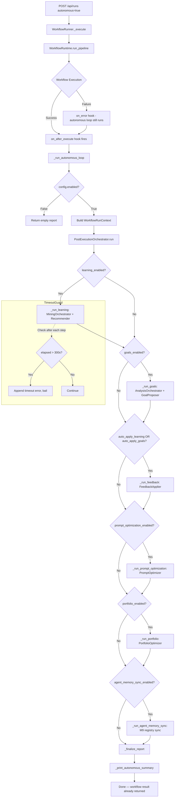
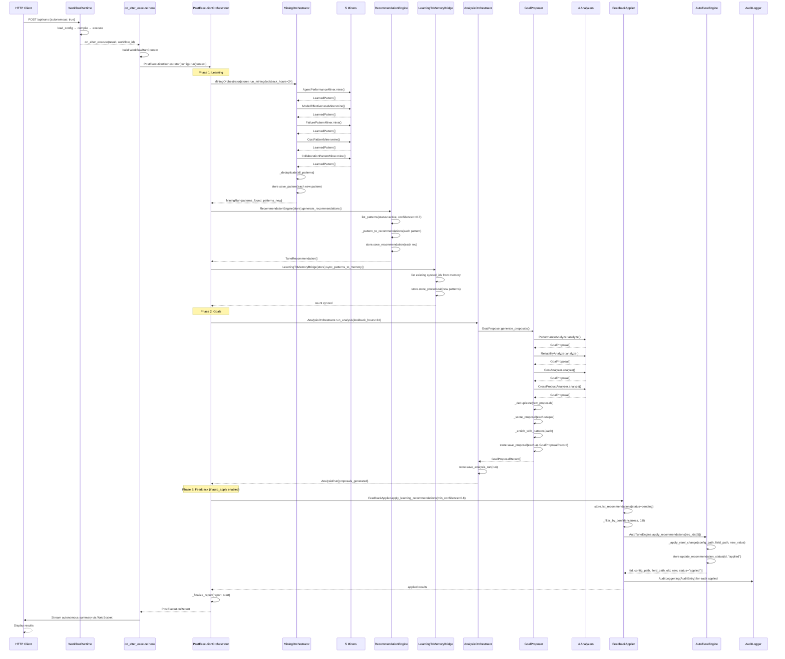
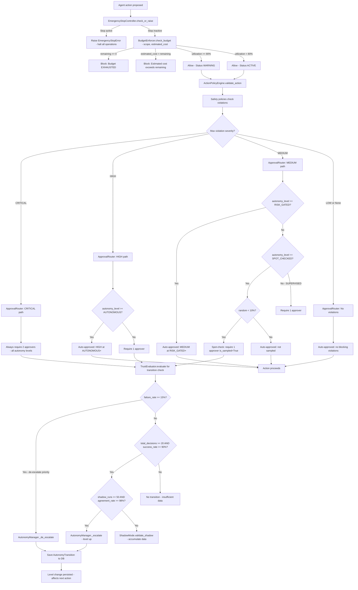
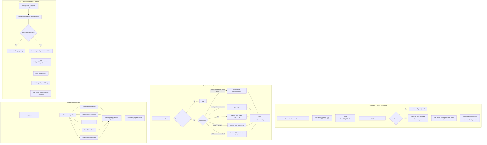
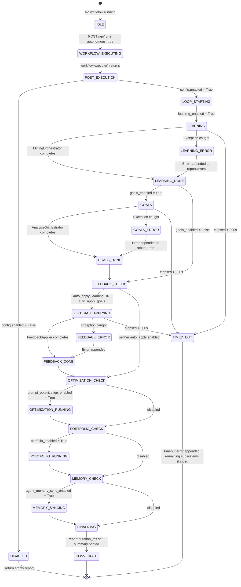
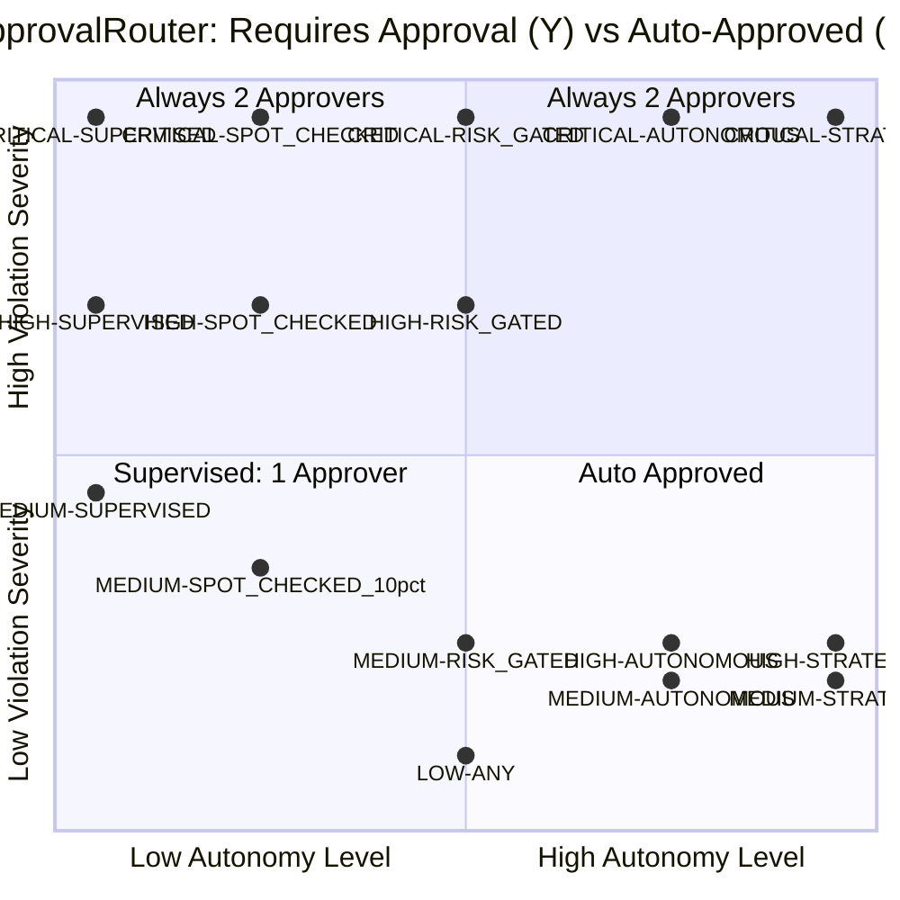
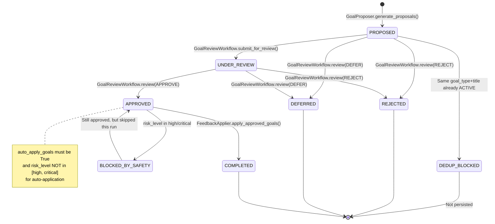

# 14 — Autonomous Execution Loop: Complete Flow Trace

**Document Version:** 1.0.0
**Codebase Revision:** Post-M10 (Multi-Tenant), as of 2026-02-22
**Request Traced:** `POST /api/runs` with body `{"workflow": "workflow.yaml", "autonomous": true}`
**Scope:** Full lifecycle of the autonomous post-execution loop — from activation through pattern mining, goal proposal, feedback application, trust evaluation, budget enforcement, memory sync, and audit persistence.

---

## Table of Contents

1. [Executive Summary](#1-executive-summary)
2. [System Architecture Overview](#2-system-architecture-overview)
3. [API Activation: How `autonomous: true` Activates the Loop](#3-api-activation-how-autonomous-true-activates-the-loop)
4. [Phase 1: Standard Workflow Execution (Pre-Loop)](#4-phase-1-standard-workflow-execution-pre-loop)
5. [Phase 2: Post-Execution Hook — `_on_after_execute`](#5-phase-2-post-execution-hook--_on_after_execute)
6. [Phase 3: PostExecutionOrchestrator — The Main Loop Controller](#6-phase-3-postexecutionorchestrator--the-main-loop-controller)
7. [Phase 4: Learning Subsystem — Pattern Mining](#7-phase-4-learning-subsystem--pattern-mining)
8. [Phase 5: Goals Subsystem — Analysis and Proposal Generation](#8-phase-5-goals-subsystem--analysis-and-proposal-generation)
9. [Phase 6: Feedback Application — Auto-Tuning Configs](#9-phase-6-feedback-application--auto-tuning-configs)
10. [Phase 7: Prompt Optimization (Optional)](#10-phase-7-prompt-optimization-optional)
11. [Phase 8: Portfolio Analysis (Optional)](#11-phase-8-portfolio-analysis-optional)
12. [Phase 9: Agent Memory Sync (M9)](#12-phase-9-agent-memory-sync-m9)
13. [Safety Gates: The Autonomy Safety Stack](#13-safety-gates-the-autonomy-safety-stack)
    - 13.1 [AutonomyManager — The State Machine](#131-autonomymanager--the-state-machine)
    - 13.2 [TrustEvaluator — Merit-Based Transitions](#132-trustevaluator--merit-based-transitions)
    - 13.3 [BudgetEnforcer — Cost Controls](#133-budgetenforcer--cost-controls)
    - 13.4 [ApprovalRouter — Severity x Level Matrix](#134-approvalrouter--severity-x-level-matrix)
    - 13.5 [ShadowMode — Promotion Validation](#135-shadowmode--promotion-validation)
    - 13.6 [EmergencyStopController — Circuit Breaker](#136-emergencystopcontroller--circuit-breaker)
14. [Memory Bridge — Learning to Memory Sync](#14-memory-bridge--learning-to-memory-sync)
15. [Audit Trail](#15-audit-trail)
16. [Rollout Manager — Gradual Config Rollout](#16-rollout-manager--gradual-config-rollout)
17. [Convergence and Termination](#17-convergence-and-termination)
18. [Data Models Reference](#18-data-models-reference)
19. [Configuration Reference](#19-configuration-reference)
20. [Mermaid Diagrams](#20-mermaid-diagrams)
    - 20.1 [Complete Autonomous Loop Flowchart](#201-complete-autonomous-loop-flowchart)
    - 20.2 [Full Iteration Sequence Diagram](#202-full-iteration-sequence-diagram)
    - 20.3 [Trust Evaluation and Budget Enforcement Decision Tree](#203-trust-evaluation-and-budget-enforcement-decision-tree)
    - 20.4 [Feedback Generation and Application Flowchart](#204-feedback-generation-and-application-flowchart)
    - 20.5 [Autonomous Loop State Diagram](#205-autonomous-loop-state-diagram)
    - 20.6 [ApprovalRouter Decision Matrix](#206-approvalrouter-decision-matrix)
    - 20.7 [Goal Proposal Lifecycle State Diagram](#207-goal-proposal-lifecycle-state-diagram)
21. [Extension Points](#21-extension-points)
22. [Observations and Recommendations](#22-observations-and-recommendations)

---

## 1. Executive Summary

**System Name:** temper-ai Autonomous Execution Loop

**Purpose:** After every workflow run with `autonomous: true`, the system enters a structured post-execution feedback loop that mines patterns from execution history, proposes strategic goals, applies approved improvements to YAML configuration files, syncs learnings into agent memory, and enforces safety constraints throughout — all without stopping the primary workflow result from being returned to the user.

**Technology Stack:**
- Python 3.11+, asyncio (workflow execution), threading (EmergencyStop signal)
- Pydantic v2 (schemas: `AutonomousLoopConfig`, `WorkflowRunContext`, `PostExecutionReport`)
- SQLModel / SQLAlchemy (autonomy state, budgets, learned patterns, goal proposals)
- JSONL append-only file (`.meta-autonomous/audit_log.jsonl`)
- YAML (config mutation via `AutoTuneEngine`)

**Scope of Analysis:** All files under `temper_ai/autonomy/`, `temper_ai/safety/autonomy/`, `temper_ai/learning/`, `temper_ai/goals/`, plus the server entry point `temper_ai/interfaces/server/workflow_runner.py`.

**Key Design Principle:** The autonomous loop is a post-execution side-effect — it never blocks the primary workflow result and never propagates its own failures to the user. Every subsystem is individually wrapped in `try/except` with a 5-minute (`LOOP_TIMEOUT_SECONDS = 300`) hard budget. Subsystem failures are logged as warnings and recorded in `PostExecutionReport.errors[]` without crashing the loop.

---

## 2. System Architecture Overview

```
┌──────────────────────────────────────────────────────────────────────────────┐
│                     USER: POST /api/runs {autonomous: true}                   │
└─────────────────────────────┬────────────────────────────────────────────────┘
                              │  Server parses autonomous → bool field
                              ▼
┌──────────────────────────────────────────────────────────────────────────────┐
│         interfaces/server/workflow_runner.py: WorkflowRunner._execute()       │
│                                                                               │
│   WorkflowRuntime.run_pipeline()   ←── Standard workflow execution           │
│         │                                                                     │
│         └── on_after_execute hook ─── _run_autonomous_loop()                 │
│                                             │                                 │
│                              ┌──────────────▼──────────────────┐             │
│                              │    autonomy/_schemas.py           │             │
│                              │    AutonomousLoopConfig           │             │
│                              │    WorkflowRunContext             │             │
│                              └──────────────┬──────────────────┘             │
└─────────────────────────────────────────────┼────────────────────────────────┘
                                              │
                              ┌───────────────▼─────────────────┐
                              │  autonomy/orchestrator.py         │
                              │  PostExecutionOrchestrator        │
                              │  .run(context) → PostExecutionReport│
                              └───────────────┬─────────────────┘
                                              │
              ┌───────────────────────────────┼──────────────────────────────┐
              │               │               │              │                │
              ▼               ▼               ▼              ▼                ▼
┌─────────────────┐ ┌──────────────┐ ┌────────────┐ ┌──────────────┐ ┌────────────┐
│  LEARNING       │ │  GOALS       │ │  FEEDBACK  │ │  PORTFOLIO   │ │  MEMORY    │
│  MiningOrch.   │ │  AnalysisOrc.│ │  Applier   │ │  Optimizer   │ │  Sync (M9) │
│  Recommender   │ │  GoalProposer│ │  AutoTune  │ │  Scorecards  │ │  CrossPoll.│
└───────┬─────────┘ └──────┬───────┘ └─────┬──────┘ └──────────────┘ └────────────┘
        │                  │               │
        ▼                  ▼               ▼
┌─────────────────────────────────────────────────────────────────────────────┐
│                    SAFETY GATES (safety/autonomy/)                            │
│                                                                               │
│   AutonomyManager  ←──  TrustEvaluator (merit scores)                        │
│   BudgetEnforcer   ←──  model pricing YAML                                   │
│   ApprovalRouter   ←──  severity × autonomy level matrix                     │
│   ShadowMode       ←──  shadow agreement tracking                            │
│   EmergencyStop    ←──  threading.Event (O(1) cross-thread signal)            │
└─────────────────────────────────────────────────────────────────────────────┘
        │
        ▼
┌─────────────────────────────────────────────────────────────────────────────┐
│                    PERSISTENCE LAYER                                          │
│                                                                               │
│   learned_patterns (SQL)        tune_recommendations (SQL)                   │
│   goal_proposals (SQL)          analysis_runs (SQL)                          │
│   autonomy_states (SQL)         budget_records (SQL)                         │
│   .meta-autonomous/audit_log.jsonl  (append-only JSONL)                      │
│   memory/service.py (procedural memory namespace)                            │
└─────────────────────────────────────────────────────────────────────────────┘
```

---

## 3. API Activation: How `autonomous: true` Activates the Loop

### 3.1 API Request Field

**Endpoint:** `POST /api/runs`

```json
{
  "workflow": "workflow.yaml",
  "autonomous": true
}
```

The `autonomous` field is a boolean that defaults to `false`. When set to `true` in the request body, the server-side `WorkflowRunner` enables the post-execution autonomous loop. The field is validated by the `CreateRunRequest` Pydantic model in `temper_ai/interfaces/server/models.py`.

### 3.2 `WorkflowRunner._execute()` — Capturing the Flag

**Location:** `temper_ai/interfaces/server/workflow_runner.py`

The `WorkflowRunner` receives the `autonomous` flag from the `CreateRunRequest` and passes it through to the execution pipeline. The autonomous configuration is resolved from both the YAML workflow config and the API request parameter.

### 3.3 Execution Hook Injection

The autonomous loop does not intercept workflow execution itself. It is wired via the `on_after_execute` hook in the execution pipeline. This hook fires after `WorkflowRuntime.execute()` completes, meaning the full workflow result is available before the autonomous loop starts.

### 3.4 Config Resolution: YAML vs API Parameter

The autonomous loop configuration merges the YAML `autonomous_loop:` block with the API request parameter:

```python
wf = workflow_config.get("workflow", {})
loop_raw = wf.get("autonomous_loop", {})
config = AutonomousLoopConfig(**loop_raw)

# API autonomous=true overrides YAML
if autonomous:
    config.enabled = True
```

**Key behavior:** The `autonomous: true` API parameter sets `config.enabled = True` regardless of what the YAML specifies. All other settings (`learning_enabled`, `goals_enabled`, `auto_apply_learning`, etc.) still come from the YAML `autonomous_loop:` block. This means `autonomous: true` is an opt-in override — the loop always runs at minimum with learning and goals enabled (their defaults are `True`), but auto-apply and prompt optimization remain off unless the YAML enables them.

### 3.5 WorkflowRunContext Assembly

```python
result_dict = result if isinstance(result, dict) else {}
context = WorkflowRunContext(
    workflow_id=workflow_id,
    workflow_name=workflow_name,
    product_type=wf.get("product_type"),
    result=result_dict,
    duration_seconds=result_dict.get("duration", 0.0),
    status=result_dict.get("status", "unknown"),
    cost_usd=result_dict.get("total_cost", 0.0),
    total_tokens=result_dict.get("total_tokens", 0),
)
```

The context carries the complete workflow result, cost, token count, and duration. This data feeds both the learning miners (via observability DB) and the portfolio optimizer.

---

## 4. Phase 1: Standard Workflow Execution (Pre-Loop)

Before the autonomous loop runs, the normal workflow executes through `WorkflowRuntime.run_pipeline()`. The autonomous loop has no influence on this phase. The relevant phases from `doc 01-request-lifecycle.md` apply:

1. `load_config()` — parse and validate `workflow.yaml`
2. `adapt_lifecycle()` — optional lifecycle adapter
3. `setup_infrastructure()` — create tracker, tool registry, config loader
4. `compile()` — build LangGraph or dynamic execution graph
5. `build_state()` — assemble state dict
6. `execute()` — run graph, emit events, collect metrics
7. `cleanup()` — teardown resources

The autonomous loop begins immediately after step 6 completes, inside the `on_after_execute` hook. The workflow result is already written to the observability database, which the learning miners will query in Phase 4.

---

## 5. Phase 2: Post-Execution Hook — `_on_after_execute`

**Location:** `temper_ai/interfaces/server/workflow_runner.py` (server path)

**Timing:** This hook fires after `WorkflowRuntime.execute()` returns. The workflow result is fully materialized at this point.

**Call chain:**

```
WorkflowRunner._execute()
  └── WorkflowRuntime.run_pipeline()
      └── execute() → result dict
      └── hooks.on_after_execute(result, workflow_id)
          └── _run_autonomous_loop(...)
              └── PostExecutionOrchestrator(config).run(context)
```

**Post-execution flow:**

1. Records run result to the observability database
2. Streams completion event via WebSocket
3. If `autonomous` is enabled: calls `_run_autonomous_loop()`
4. Persists final run status

The autonomous loop runs after the primary result is persisted and streamed to the client.

---

## 6. Phase 3: PostExecutionOrchestrator — The Main Loop Controller

**Location:** `temper_ai/autonomy/orchestrator.py:21-374`

**Class:** `PostExecutionOrchestrator`

### 6.1 Constructor

```python
def __init__(self, config: AutonomousLoopConfig) -> None:
    self._config = config
```

The orchestrator holds only the configuration. All subsystem clients (stores, miners, analyzers) are created fresh inside each subsystem method using lazy imports. This avoids fan-out import violations and ensures each subsystem can fail independently.

### 6.2 `run()` Method — Entry Point

```python
def run(self, context: WorkflowRunContext) -> PostExecutionReport:
    start = time.monotonic()
    report = PostExecutionReport()

    if not self._config.enabled:
        return report

    logger.info(
        "Autonomous loop starting for workflow %s (%s)",
        context.workflow_name,
        context.workflow_id,
    )

    self._run_subsystems(context, report, start)
    self._finalize_report(report, start)
    return report
```

**Critical path:** If `config.enabled` is `False`, the method returns an empty report immediately. The `autonomous: true` API parameter guarantees `config.enabled = True`.

### 6.3 `_run_subsystems()` — Sequential Execution with Timeout

**Location:** `temper_ai/autonomy/orchestrator.py:49-72`

```python
def _run_subsystems(
    self,
    context: WorkflowRunContext,
    report: PostExecutionReport,
    start: float,
) -> None:
    steps: list[tuple] = [
        (self._config.learning_enabled, "_run_learning", "learning_result"),
        (self._config.goals_enabled, "_run_goals", "goals_result"),
        (
            self._config.auto_apply_learning or self._config.auto_apply_goals,
            "_run_feedback",
            "feedback_result",
        ),
        (self._config.prompt_optimization_enabled, "_run_prompt_optimization", "optimization_result"),
        (self._config.portfolio_enabled, "_run_portfolio", "portfolio_result"),
        (self._config.agent_memory_sync_enabled, "_run_agent_memory_sync", "memory_sync_result"),
    ]
    for enabled, method_name, attr in steps:
        if enabled:
            setattr(report, attr, getattr(self, method_name)(context, report))
        if self._budget_exhausted(start, report):
            return
```

**Execution order** (with default config):
1. `_run_learning()` — pattern mining + recommendations (always on by default)
2. `_run_goals()` — goal analysis + proposals (always on by default)
3. `_run_feedback()` — only if `auto_apply_learning` or `auto_apply_goals` is `True`
4. `_run_prompt_optimization()` — only if `prompt_optimization_enabled` is `True`
5. `_run_portfolio()` — only if `portfolio_enabled` is `True` (default `True`)
6. `_run_agent_memory_sync()` — only if `agent_memory_sync_enabled` is `True` (M9, default `False`)

After each subsystem, the timeout budget is checked.

### 6.4 Timeout Budget Check

**Location:** `temper_ai/autonomy/orchestrator.py:84-93`

```python
def _budget_exhausted(
    self, start: float, report: PostExecutionReport,
) -> bool:
    if (time.monotonic() - start) > LOOP_TIMEOUT_SECONDS:
        report.errors.append("Timeout: skipped remaining subsystems")
        elapsed_ms = (time.monotonic() - start) * MS_PER_SECOND
        report.duration_ms = round(elapsed_ms, 1)
        return True
    return False
```

`LOOP_TIMEOUT_SECONDS = 300` (5 minutes). If any subsystem combination exceeds this, remaining subsystems are skipped. The timeout message is recorded in `report.errors[]` and the report duration is finalized with whatever time was consumed.

### 6.5 `_finalize_report()`

```python
def _finalize_report(self, report: PostExecutionReport, start: float) -> None:
    elapsed_ms = (time.monotonic() - start) * MS_PER_SECOND
    report.duration_ms = round(elapsed_ms, 1)
    logger.info(
        "Autonomous loop completed in %.1fms (%d errors)",
        report.duration_ms,
        len(report.errors),
    )
```

The completed `PostExecutionReport` is returned to `_run_autonomous_loop()`, which records the summary and streams it to the client via WebSocket.

---

## 7. Phase 4: Learning Subsystem — Pattern Mining

**Location:** `temper_ai/autonomy/orchestrator.py:95-127` (caller)
**Implementation:** `temper_ai/learning/orchestrator.py`, `temper_ai/learning/recommender.py`

### 7.1 `_run_learning()` — Top-Level Handler

```python
def _run_learning(
    self, context: WorkflowRunContext, report: PostExecutionReport
) -> dict[str, Any] | None:
    try:
        from temper_ai.learning.orchestrator import MiningOrchestrator
        from temper_ai.learning.recommender import RecommendationEngine
        from temper_ai.learning.store import LearningStore

        store = LearningStore()
        orchestrator = MiningOrchestrator(store=store)
        mining_run = orchestrator.run_mining(
            lookback_hours=DEFAULT_LOOKBACK_HOURS   # 24 hours
        )

        engine = RecommendationEngine(store=store)
        recs = engine.generate_recommendations()

        # Sync learned patterns to memory system
        self._sync_memory_bridge(store, report)

        return {
            "mining_run_id": mining_run.id,
            "patterns_found": mining_run.patterns_found,
            "patterns_new": mining_run.patterns_new,
            "recommendations": len(recs),
            "status": mining_run.status,
        }
    except Exception as exc:  # noqa: BLE001 -- subsystem failures must not crash workflow
        msg = f"Learning subsystem error: {exc}"
        logger.warning(msg)
        report.errors.append(msg)
        return None
```

### 7.2 `MiningOrchestrator.run_mining()` — Five Miners

**Location:** `temper_ai/learning/orchestrator.py:43-71`

The orchestrator runs five miners, each querying the observability database for patterns over the `lookback_hours` window:

| Miner | Class | What It Detects |
|-------|-------|-----------------|
| `AgentPerformanceMiner` | `miners/agent_performance.py` | Slow agents, timeout patterns |
| `ModelEffectivenessMiner` | `miners/model_effectiveness.py` | High error rates per model |
| `FailurePatternMiner` | `miners/failure_patterns.py` | Transient vs. permanent failures |
| `CostPatternMiner` | `miners/cost_patterns.py` | High token consumption |
| `CollaborationPatternMiner` | `miners/collaboration_patterns.py` | Unresolved debates, slow consensus |

```python
for miner in self.miners:
    try:
        found = miner.mine(lookback_hours=lookback_hours)
        all_patterns.extend(found)
        miner_stats[miner.pattern_type] = len(found)
    except Exception as exc:
        logger.warning("Miner %s failed: %s", miner.pattern_type, exc)
```

Each miner produces `LearnedPattern` objects with fields: `id`, `pattern_type`, `title`, `description`, `evidence` (JSON), `confidence` (0.0–1.0), `impact_score`, `recommendation`.

### 7.3 Deduplication

**Location:** `temper_ai/learning/orchestrator.py:73-82`

Patterns are deduplicated by computing `SHA-256(pattern_type:title)[:16]` and comparing against existing patterns in the DB. Only genuinely new patterns are persisted.

```python
def _deduplicate(self, patterns: list[LearnedPattern]) -> list[LearnedPattern]:
    existing = self.store.list_patterns(status=None, limit=1000)
    existing_keys = {_pattern_key(p) for p in existing}
    new_patterns: list[LearnedPattern] = []
    for p in patterns:
        if _pattern_key(p) not in existing_keys:
            new_patterns.append(p)
            existing_keys.add(_pattern_key(p))
    return new_patterns
```

### 7.4 `RecommendationEngine.generate_recommendations()` — Pattern to Action

**Location:** `temper_ai/learning/recommender.py:29-43`

The engine fetches active patterns with `confidence >= 0.7` (default threshold) and maps each to zero or more `TuneRecommendation` objects:

| Pattern Type | Recommendation | Config Field |
|---|---|---|
| `model_effectiveness` (high error) | Switch model | `agent.model` |
| `agent_performance` (slow) | Increase timeout | `agent.timeout` (600 → 1200) |
| `cost` | Reduce max tokens | `agent.max_tokens` (4096 → 2048) |
| `failure` (transient) | Increase retries | `agent.max_retries` (1 → 3) |
| `collaboration` (unresolved/slow) | Reduce debate rounds | `stage.max_debate_rounds` (5 → 3) |

Each `TuneRecommendation` carries: `id`, `pattern_id`, `config_path`, `field_path`, `current_value`, `recommended_value`, `rationale`. Status starts as `"pending"`.

### 7.5 Memory Bridge Sync

After mining, the orchestrator calls `_sync_memory_bridge()`:

```python
def _sync_memory_bridge(
    self, store: object, report: PostExecutionReport,
) -> None:
    from temper_ai.autonomy.memory_bridge import LearningToMemoryBridge
    bridge = LearningToMemoryBridge(learning_store=store)
    synced = bridge.sync_patterns_to_memory()
    report.memory_sync_result = {"patterns_synced": synced}
```

See Section 14 for full memory bridge details.

---

## 8. Phase 5: Goals Subsystem — Analysis and Proposal Generation

**Location:** `temper_ai/autonomy/orchestrator.py:142-186` (caller)
**Implementation:** `temper_ai/goals/analysis_orchestrator.py`, `temper_ai/goals/proposer.py`

### 8.1 `_run_goals()` — Top-Level Handler

```python
def _run_goals(
    self, context: WorkflowRunContext, report: PostExecutionReport
) -> dict[str, Any] | None:
    try:
        from temper_ai.goals.analysis_orchestrator import AnalysisOrchestrator
        from temper_ai.goals.store import GoalStore
        from temper_ai.learning.store import LearningStore

        goal_store = GoalStore()
        learning_store = LearningStore()
        analyzers = self._build_goal_analyzers(learning_store)
        orchestrator = AnalysisOrchestrator(
            store=goal_store, analyzers=analyzers, learning_store=learning_store,
        )
        analysis_run = orchestrator.run_analysis(
            lookback_hours=DEFAULT_LOOKBACK_HOURS  # 24 hours
        )

        return {
            "analysis_run_id": analysis_run.id,
            "proposals_generated": analysis_run.proposals_generated,
            "status": analysis_run.status,
        }
```

### 8.2 Goal Analyzers

Four analyzers are built with `_build_goal_analyzers()`:

```python
def _build_goal_analyzers(self, learning_store: object) -> list:
    from temper_ai.goals.analyzers.cost import CostAnalyzer
    from temper_ai.goals.analyzers.cross_product import CrossProductAnalyzer
    from temper_ai.goals.analyzers.performance import PerformanceAnalyzer
    from temper_ai.goals.analyzers.reliability import ReliabilityAnalyzer

    return [
        PerformanceAnalyzer(),
        ReliabilityAnalyzer(),
        CostAnalyzer(),
        CrossProductAnalyzer(learning_store=learning_store),
    ]
```

| Analyzer | Module | Goal Types Generated |
|---|---|---|
| `PerformanceAnalyzer` | `analyzers/performance.py` | `performance_optimization` |
| `ReliabilityAnalyzer` | `analyzers/reliability.py` | `reliability_improvement` |
| `CostAnalyzer` | `analyzers/cost.py` | `cost_reduction` |
| `CrossProductAnalyzer` | `analyzers/cross_product.py` | `cross_product_opportunity` |

### 8.3 `AnalysisOrchestrator.run_analysis()` — Full Cycle

**Location:** `temper_ai/goals/analysis_orchestrator.py:34-67`

```python
def run_analysis(
    self, lookback_hours: int = DEFAULT_LOOKBACK_HOURS
) -> AnalysisRun:
    run = AnalysisRun(
        id=f"ar-{uuid.uuid4().hex[:UUID_HEX_LEN]}",
        started_at=utcnow(),
        status="running",
    )

    try:
        proposals = self._proposer.generate_proposals(
            lookback_hours=lookback_hours
        )
        run.proposals_generated = len(proposals)
        run.status = "completed"
    except Exception as exc:
        run.status = "failed"
        run.error_message = str(exc)
```

### 8.4 `GoalProposer.generate_proposals()` — Four-Step Pipeline

**Location:** `temper_ai/goals/proposer.py:47-87`

**Step 1: Run analyzers.** Each analyzer returns `GoalProposal` objects via `.analyze(lookback_hours)`. Failures in individual analyzers are caught and logged without stopping others.

**Step 2: Deduplicate.** Proposals are deduplicated against existing active proposals in the DB by computing `SHA-256(goal_type:title)[:DEDUP_KEY_LENGTH]`. This prevents re-proposing the same goal if it's already proposed, under review, approved, or in progress.

```python
ACTIVE_STATUSES = {"proposed", "under_review", "approved", "in_progress"}
```

**Step 3: Score proposals.** The priority score is computed using a weighted formula:

```python
score = (
    WEIGHT_IMPACT * impact_score
    + WEIGHT_CONFIDENCE * avg_confidence
    + WEIGHT_EFFORT_INVERSE * effort_score
    + WEIGHT_RISK_INVERSE * risk_score
)
```

Where:
- `impact_score` = normalized average improvement percentage (capped at 1.0)
- `avg_confidence` = average ImpactEstimate confidence
- `effort_score` = inverse effort (TRIVIAL=1.0, MAJOR=0.1)
- `risk_score` = inverse risk (LOW=1.0, CRITICAL=0.0)

**Step 4: Enrich with pattern cross-references.** If a learning store is available, proposals are enriched with related `pattern_id`s by matching overlapping `source_workflow_ids`:

```python
if (
    pattern.source_workflow_ids
    and proposal.evidence.workflow_ids
):
    overlap = set(pattern.source_workflow_ids) & set(
        proposal.evidence.workflow_ids
    )
    if overlap:
        proposal.evidence.pattern_ids.append(pattern.id)
```

**Step 5: Persist.** Each proposal is saved as a `GoalProposalRecord` with initial status `"proposed"`.

### 8.5 GoalProposalRecord Schema

```python
class GoalProposalRecord(SQLModel, table=True):
    id: str                          # "gp-<12 hex chars>"
    goal_type: str                   # GoalType enum value
    title: str
    description: str
    status: str                      # proposed → under_review → approved → completed
    risk_assessment: dict            # RiskAssessment serialized
    effort_estimate: str             # EffortLevel enum value
    expected_impacts: list[dict]     # ImpactEstimate[] serialized
    evidence: dict                   # GoalEvidence serialized
    source_product_type: str | None
    applicable_product_types: list[str]
    proposed_actions: list[str]      # ["config_path:field_path=value"]
    priority_score: float
    source_agent_id: str | None      # M9: persistent agent origin
```

---

## 9. Phase 6: Feedback Application — Auto-Tuning Configs

**Location:** `temper_ai/autonomy/orchestrator.py:188-230` (caller)
**Implementation:** `temper_ai/autonomy/feedback_applier.py`, `temper_ai/learning/auto_tune.py`

**Activation condition:** This phase only runs if `auto_apply_learning` OR `auto_apply_goals` is `True` in the config. With the default `AutonomousLoopConfig`, both are `False`. They must be explicitly enabled in the YAML:

```yaml
# workflow.yaml
workflow:
  autonomous_loop:
    enabled: true
    auto_apply_learning: true
    auto_apply_goals: true
    auto_apply_min_confidence: 0.85
    max_auto_apply_per_run: 3
```

### 9.1 `_run_feedback()` — Dispatch Handler

```python
def _run_feedback(
    self, context: WorkflowRunContext, report: PostExecutionReport,
) -> dict[str, Any] | None:
    try:
        results: dict[str, Any] = {}
        if self._config.auto_apply_learning:
            results["learning"] = self._apply_learning_feedback()
        if self._config.auto_apply_goals:
            results["goals"] = self._apply_goal_feedback()
        return results if results else None
```

### 9.2 `FeedbackApplier.apply_learning_recommendations()`

**Location:** `temper_ai/autonomy/feedback_applier.py:39-72`

**Step 1: Fetch pending recommendations.**
```python
pending = store.list_recommendations(status="pending")
```

**Step 2: Filter by confidence threshold.**
```python
def _filter_by_confidence(self, store, recommendations, min_confidence):
    for rec in recommendations:
        pattern = typed_store.get_pattern(rec.pattern_id)
        if pattern is not None and pattern.confidence >= min_confidence:
            filtered.append(rec)
    return filtered
```

The filter retrieves the source pattern for each recommendation and checks that `pattern.confidence >= min_confidence` (default `0.8`).

**Step 3: Cap at `max_auto_apply`.** At most `max_auto_apply_per_run` recommendations (default `5`) are applied per run.

**Step 4: Apply via `AutoTuneEngine`.**

```python
engine = AutoTuneEngine(store=store)
results = engine.apply_recommendations(rec_ids)
self._audit_learning_results(results, eligible)
```

### 9.3 `AutoTuneEngine.apply_recommendations()` — YAML Mutation

**Location:** `temper_ai/learning/auto_tune.py:35-72`

For each recommendation:
1. Load the YAML config file at `config_root / rec.config_path`
2. Parse with `yaml.safe_load()`
3. Navigate to the field at `rec.field_path` (dot-separated)
4. Set the new value
5. Write back with `yaml.safe_dump()`
6. Update recommendation status to `"applied"` in DB

```python
def _apply_yaml_change(path: Path, field_path: str, new_value: str) -> bool:
    with open(path) as f:
        data = yaml.safe_load(f) or {}

    keys = field_path.split(".")
    target = data
    for key in keys[:-1]:
        if key not in target or not isinstance(target[key], dict):
            return False
        target = target[key]

    target[keys[-1]] = new_value

    with open(path, "w") as f:
        yaml.safe_dump(data, f, default_flow_style=False)
```

**Important:** This directly modifies YAML config files on disk. The change takes effect on the next workflow run.

### 9.4 `FeedbackApplier.apply_approved_goals()`

**Location:** `temper_ai/autonomy/feedback_applier.py:151-195`

Goals require an additional translation step. Each goal's `proposed_actions` are strings in the format `config_path:field_path=value`:

```python
def _parse_action(action_str: str) -> dict[str, str] | None:
    if "=" not in action_str or ":" not in action_str.split("=", 1)[0]:
        return None
    path_part, value = action_str.split("=", 1)
    parts = path_part.split(":", 1)
    return {
        "config_path": parts[0].strip(),
        "field_path": parts[1].strip(),
        "new_value": value.strip(),
    }
```

**Safety check before applying:**

```python
def _check_goal_safety(self, goal: object) -> bool:
    risk_data = record.risk_assessment or {}
    risk_level = risk_data.get("level", "low")
    # Block high and critical risk by default in auto-apply
    if risk_level in ("high", "critical"):
        return False
    return True
```

High and critical risk goals are blocked from auto-application, regardless of approval status. After successful application, the goal is marked as `"completed"` to prevent re-application.

### 9.5 Audit Logging for All Applied Changes

Every successfully applied recommendation or goal action generates an `AuditEntry`:

```python
entry = AuditEntry(
    id=uuid.uuid4().hex,
    action_type="learning_recommendation",  # or "goal_application"
    source_id=rec.id,
    config_path=result.get("config_path"),
    field_path=result.get("field_path"),
    old_value=str(result.get("current_value")),
    new_value=str(result.get("recommended_value")),
    applied_by="autonomous_loop",
)
self._audit.log(entry)
```

See Section 15 for the full audit system.

---

## 10. Phase 7: Prompt Optimization (Optional)

**Location:** `temper_ai/autonomy/orchestrator.py:232-301`

**Activation:** Requires `prompt_optimization_enabled: true` AND individual agent configs with `prompt_optimization.auto_compile: true`.

When enabled, the orchestrator iterates over every entry in `context.result` (the workflow result dict, where each key is an agent name). For each agent with `auto_compile: true`, it calls `PromptOptimizer.optimize()` which triggers the DSPy compilation pipeline (see `temper_ai/optimization/` for full details).

The result dict reports `agents_compiled` and `agents_skipped`. DSPy not being installed is handled gracefully:

```python
except ImportError:
    logger.warning("DSPy not installed, skipping prompt optimization")
    return None
```

---

## 11. Phase 8: Portfolio Analysis (Optional)

**Location:** `temper_ai/autonomy/orchestrator.py:337-373`

**Activation:** `portfolio_enabled: true` (default `True`) AND `context.product_type` must be set (from the workflow YAML's `product_type:` field).

When a `product_type` is set, the orchestrator:
1. Lists all portfolios from `PortfolioStore`
2. Finds the portfolio containing the matching product type
3. Calls `PortfolioOptimizer.compute_scorecards(target_cfg)` to score each product
4. Calls `PortfolioOptimizer.recommend(scorecards)` to generate portfolio-level recommendations

Result: `{"product_type": <name>, "scorecards": N, "recommendations": N}`

If no `product_type` is set (typical for most workflows), this subsystem returns `{"product_type": None, "skipped": True}` without doing any work.

---

## 12. Phase 9: Agent Memory Sync (M9)

**Location:** `temper_ai/autonomy/orchestrator.py:303-335`

**Activation:** `agent_memory_sync_enabled: true` (default `False`, opt-in M9 feature).

When enabled, the orchestrator looks up all active persistent agents in the registry and calls `sync_workflow_learnings_to_agent()` for each:

```python
from temper_ai.agent._m9_context_helpers import sync_workflow_learnings_to_agent
from temper_ai.registry.store import AgentRegistryStore

store = AgentRegistryStore()
agents = store.list_all(status_filter="active")

for agent_entry in agents:
    result = sync_workflow_learnings_to_agent(
        agent_id=agent_entry.id,
        agent_name=agent_entry.name,
        workflow_name=context.workflow_name,
        memory_service=None,
    )
```

This ensures that persistent agents (created via `POST /api/agents`) accumulate cross-workflow knowledge. Their procedural memory is updated with patterns learned from this run.

---

## 13. Safety Gates: The Autonomy Safety Stack

The autonomy safety components in `temper_ai/safety/autonomy/` operate as independent guardrail layers. They are not called sequentially by the `PostExecutionOrchestrator` — instead, they are components that the system's broader safety infrastructure uses during agent tool call validation. The `FeedbackApplier` consults the `GoalSafetyPolicy` directly. The `AutonomyManager`, `TrustEvaluator`, and related components manage the progressive autonomy level for each agent, which in turn affects what the `ApprovalRouter` decides when the agent proposes actions.

### 13.1 AutonomyManager — The State Machine

**Location:** `temper_ai/safety/autonomy/manager.py:27-291`

**Autonomy Levels** (from `schemas.py`):

```python
class AutonomyLevel(IntEnum):
    SUPERVISED    = 0   # Every action needs human approval
    SPOT_CHECKED  = 1   # 10% of medium-risk actions sampled
    RISK_GATED    = 2   # Medium risk auto-approved; high needs approval
    AUTONOMOUS    = 3   # High risk auto-approved; only critical needs approval
    STRATEGIC     = 4   # All non-critical auto-approved
```

**State persistence:** Each agent's level is stored in `autonomy_states` DB table, keyed by `(agent_name, domain)`. Default level is `SUPERVISED` for any new agent.

**Thread safety:** All transitions use `threading.Lock()` (`self._lock`). This ensures that concurrent workflow runs cannot race on autonomy level changes.

**Cooldown guards:**
- Escalation cooldown: 24 hours (`ESCALATION_COOLDOWN_HOURS`)
- De-escalation cooldown: 1 hour (`DE_ESCALATION_COOLDOWN_HOURS`)

**Max level cap:** The `max_level` parameter prevents escalation beyond a configured ceiling. Default is `RISK_GATED`. To reach `AUTONOMOUS` or `STRATEGIC`, the cap must be explicitly raised.

### 13.2 TrustEvaluator — Merit-Based Transitions

**Location:** `temper_ai/safety/autonomy/trust_evaluator.py:28-136`

The evaluator reads `AgentMeritScore` records from the DB and applies threshold rules:

**Escalation eligibility:**
- `total_decisions >= MIN_DECISIONS_FOR_ESCALATION` (20 decisions)
- `success_rate >= ESCALATION_SUCCESS_RATE` (90%)

**De-escalation trigger:**
- `failure_rate >= DE_ESCALATION_FAILURE_RATE` (15%)
- De-escalation is checked first (safety priority)

```python
def evaluate(
    self,
    session: Any,
    agent_name: str,
    domain: str,
    current_level: AutonomyLevel = AutonomyLevel.SUPERVISED,
) -> TrustEvaluation:
    merit = self._load_merit_score(session, agent_name, domain)
    if merit is None:
        return TrustEvaluation(
            evidence={"reason": "no_merit_record"},
            reasons=["No merit score record found"],
        )

    # De-escalation checked first (safety priority)
    failure_rate = self._compute_failure_rate(merit)
    if failure_rate >= self._de_escalation_rate and current_level > AutonomyLevel.SUPERVISED:
        result.needs_de_escalation = True
        ...
        return result

    # Then escalation eligibility
    if merit.total_decisions < self._min_decisions:
        ...
    if success_rate >= self._escalation_rate:
        result.eligible_for_escalation = True
```

**Evidence collected:**
- `total_decisions`, `successful_decisions`, `failed_decisions`
- `success_rate`, `average_confidence`, `expertise_score`

All evidence is stored in the `AutonomyTransition.merit_snapshot` JSON column for audit purposes.

### 13.3 BudgetEnforcer — Cost Controls

**Location:** `temper_ai/safety/autonomy/budget_enforcer.py:53-208`

**Default budget:** `$100.00 USD` per scope (`DEFAULT_BUDGET_USD`). Scopes are typically agent names or workflow names.

**Budget check:**

```python
def check_budget(
    self, scope: str, estimated_cost: float = 0.0
) -> BudgetCheckResult:
    budget = self._get_or_create_budget(scope)
    remaining = budget.budget_usd - budget.spent_usd

    if remaining <= 0:
        return BudgetCheckResult(allowed=False, status=STATUS_EXHAUSTED, ...)

    if estimated_cost > remaining:
        return BudgetCheckResult(allowed=False, status=STATUS_WARNING, ...)

    utilization = budget.spent_usd / budget.budget_usd
    status = STATUS_WARNING if utilization >= BUDGET_WARNING_THRESHOLD else STATUS_ACTIVE
    return BudgetCheckResult(allowed=True, remaining_usd=remaining, status=status)
```

**Warning threshold:** 80% utilization triggers a warning but does not block actions.

**Cost estimation:**

```python
def estimate_action_cost(
    self, model: str, estimated_tokens: int
) -> float:
    pricing = self._pricing.get(model)
    output_price = pricing.get("output_price", 0.0)
    return float((estimated_tokens / TOKENS_PER_MILLION) * output_price)
```

Pricing is loaded from `configs/model_pricing.yaml` (optional). If the file doesn't exist, all estimates return `0.0`, meaning budget checks always pass.

**Spend recording:** After each action, `record_spend(scope, cost_usd)` updates the `BudgetRecord` in the DB and recomputes the status.

### 13.4 ApprovalRouter — Severity x Level Matrix

**Location:** `temper_ai/safety/autonomy/approval_router.py:27-114`

The router implements a decision matrix: for every tool call, the combination of violation severity and current autonomy level determines whether human approval is required.

| Severity | SUPERVISED | SPOT_CHECKED | RISK_GATED | AUTONOMOUS | STRATEGIC |
|----------|-----------|--------------|------------|------------|-----------|
| CRITICAL | 2 approvers | 2 approvers | 2 approvers | 2 approvers | 2 approvers |
| HIGH | 1 approver | 1 approver | 1 approver | auto | auto |
| MEDIUM | 1 approver | 10% sample | auto | auto | auto |
| LOW/None | auto | auto | auto | auto | auto |

**Spot-check logic** (SPOT_CHECKED + MEDIUM):

```python
def _spot_check_decision(self) -> ApprovalDecision:
    if random.random() < self._spot_check_rate:  # noqa: S311
        return ApprovalDecision(
            requires_approval=True,
            required_approvers=1,
            is_sampled=True,
            reason=f"Spot-check sample ({self._spot_check_rate:.0%} rate)",
        )
    return ApprovalDecision(reason="MEDIUM auto-approved (not sampled)")
```

`SPOT_CHECK_SAMPLE_RATE = 0.10` — 10% of medium-risk actions at SPOT_CHECKED level are sampled for review.

**Critical actions always require 2 approvers** regardless of autonomy level. This is a hard invariant: `CRITICAL_APPROVERS = 2`.

### 13.5 ShadowMode — Promotion Validation

**Location:** `temper_ai/safety/autonomy/shadow_mode.py:35-159`

Shadow mode is a validation mechanism before escalating an agent's autonomy level. It simulates what the `ApprovalRouter` would decide at the proposed higher level, then tracks agreement with the current-level decision.

**Promotion readiness criteria:**
- `shadow_runs >= SHADOW_MIN_RUNS` (50 runs)
- `agreement_rate >= SHADOW_AGREEMENT_THRESHOLD` (98%)

```python
def check_promotion_ready(
    self, agent_name: str, domain: str
) -> bool:
    state = self._store.get_state(agent_name, domain)
    if state is None:
        return False
    if state.shadow_runs < SHADOW_MIN_RUNS:
        return False
    agreement_rate = state.shadow_agreements / state.shadow_runs
    return agreement_rate >= SHADOW_AGREEMENT_THRESHOLD
```

**Shadow counters** are stored in `AutonomyState.shadow_runs` and `AutonomyState.shadow_agreements`. They are reset after any actual level change with `reset_shadow()`.

The high threshold (98%) means that an agent must demonstrate near-perfect consistency between its current-level behavior and what a higher-level policy would decide — before the system automatically promotes it.

### 13.6 EmergencyStopController — Circuit Breaker

**Location:** `temper_ai/safety/autonomy/emergency_stop.py:35-133`

**Design:** Uses a module-level `threading.Event` for O(1) cross-thread signaling. Any thread can check `is_active()` in constant time.

```python
# Module-level — shared across all threads in the process
_stop_event = threading.Event()
_stop_lock = threading.Lock()
_active_event_id: str | None = None
```

**Activation** (via `EmergencyStopController.activate()`)

```python
def activate(self, triggered_by: str, reason: str, ...) -> EmergencyStopEvent:
    with _stop_lock:
        _stop_event.set()
        event_id = f"es-{uuid.uuid4().hex[:UUID_HEX_LEN]}"
        _active_event_id = event_id
    ...
    logger.warning("EMERGENCY STOP activated by %s: %s", triggered_by, reason)
```

**Check in hot path:**

```python
def check_or_raise(self) -> None:
    if _stop_event.is_set():
        raise EmergencyStopError()
```

This can be called at any point in agent or tool execution. If the stop is active, `EmergencyStopError` is raised and propagates up through the call stack.

**Deactivation** (`EmergencyStopController.deactivate()`) clears the threading.Event and persists the resolution timestamp to the DB.

---

## 14. Memory Bridge — Learning to Memory Sync

**Location:** `temper_ai/autonomy/memory_bridge.py`

The `LearningToMemoryBridge` translates learned patterns and approved goals into procedural memory entries accessible to agents during their next prompt-building phase.

### 14.1 Pattern Sync

```python
def sync_patterns_to_memory(
    self, min_confidence: float = DEFAULT_MIN_CONFIDENCE,  # 0.7
) -> int:
    svc = self._get_memory_service()
    scope = svc.build_scope(namespace=PROCEDURAL_NAMESPACE)  # "learned_procedures"
    existing = svc.list_memories(scope, memory_type=MEMORY_TYPE_PROCEDURAL)
    synced_ids = {
        e.metadata.get("pattern_id")
        for e in existing
        if e.metadata.get("pattern_id")
    }

    patterns = self._learning_store.list_patterns(status="active")
    count = 0
    for pattern in patterns:
        if pattern.confidence < min_confidence:
            continue
        if pattern.id in synced_ids:
            continue
        content = self._format_pattern(pattern)
        svc.store_procedural(
            scope,
            content=content,
            metadata={"pattern_id": pattern.id, "pattern_type": ..., "source": "learning_bridge"},
        )
        count += 1
    return count
```

Pattern format stored in memory:

```
[agent_performance] Slow agent detected | Agent X consistently takes >30s | Recommendation: Increase timeout
```

### 14.2 Goal Sync

The `sync_goals_to_memory()` method (called independently, not from the default orchestrator path) syncs approved `GoalProposalRecord`s into the `"goal_insights"` namespace:

```python
content = "[cost_reduction] Reduce token consumption | Model Y using 3x tokens | Actions: agents/my_agent.yaml:agent.max_tokens=2048"
```

### 14.3 Deduplication

Both sync methods check existing memory entries by `pattern_id` or `goal_id` in metadata before writing, ensuring idempotency. Running the autonomous loop multiple times does not create duplicate memory entries.

### 14.4 Memory Service Bootstrap

If no `memory_service` is injected, the bridge lazily creates an in-memory adapter:

```python
def _get_memory_service(self) -> Any:
    if self._memory_service is None:
        from temper_ai.memory.service import MemoryService
        self._memory_service = MemoryService(provider_name="in_memory")
    return self._memory_service
```

In production with PostgreSQL, a persistent adapter should be injected at construction time.

---

## 15. Audit Trail

**Location:** `temper_ai/autonomy/audit.py`

Every configuration change made by the autonomous loop is recorded in an append-only JSONL file:

- **File location:** `.meta-autonomous/audit_log.jsonl` (relative to working directory)
- **Format:** One JSON object per line, UTF-8
- **Created automatically:** The directory is created with `Path.mkdir(parents=True, exist_ok=True)` on first write

### 15.1 AuditEntry Schema

```python
class AuditEntry(BaseModel):
    id: str                          # UUID hex
    timestamp: datetime              # UTC, auto-set
    action_type: str                 # "learning_recommendation" | "goal_application"
    source_id: str                   # recommendation ID or goal proposal ID
    config_path: str                 # e.g., "agents/researcher.yaml"
    field_path: str                  # e.g., "agent.max_tokens"
    old_value: str                   # string representation of old value
    new_value: str                   # string representation of new value
    applied_by: str = "autonomous_loop"
```

### 15.2 Reading the Audit Log

```python
def get_entries(self, limit: int = DEFAULT_ENTRY_LIMIT) -> list[AuditEntry]:
    entries = self._read_all()
    entries.reverse()  # newest first
    return entries[:limit]

def get_entries_by_source(self, source_id: str) -> list[AuditEntry]:
    return [e for e in self._read_all() if e.source_id == source_id]
```

This is accessible via `GET /api/rollbacks` or by reading the JSONL file directly.

### 15.3 Malformed Entry Resilience

```python
for line_number, raw in enumerate(fh, start=1):
    try:
        entries.append(AuditEntry(**json.loads(stripped)))
    except (json.JSONDecodeError, ValueError) as exc:
        logger.warning("Skipping malformed audit entry on line %d: %s", ...)
```

Malformed lines are skipped with a warning. The audit log is never corrupted by a partial write because each entry is written as a single `fh.write(line)` call (atomic at the OS level for typical disk I/O).

---

## 16. Rollout Manager — Gradual Config Rollout

**Location:** `temper_ai/autonomy/rollout.py`

The `RolloutManager` provides a mechanism for gradual rollout of configuration changes identified by the autonomous loop, using the experimentation system as a backing A/B test.

### 16.1 Rollout Phases

Default phases: `[10, 25, 50, 100]` (percent of traffic)

```python
DEFAULT_ROLLOUT_PHASES = [
    ROLLOUT_PHASE_CANARY,    # 10%
    ROLLOUT_PHASE_PARTIAL,   # 25%
    ROLLOUT_PHASE_MAJORITY,  # 50%
    ROLLOUT_PHASE_FULL,      # 100%
]
```

### 16.2 Creating a Rollout

```python
def create_rollout(
    self,
    change_id: str,
    config_path: str,
    baseline_config: dict[str, Any],
    candidate_config: dict[str, Any],
    phases: list[int] | None = None,
) -> RolloutRecord:
```

Under the hood, `_create_backing_experiment()` creates an A/B experiment in `ExperimentService` with:
- Control variant: `baseline_config` (50% traffic)
- Candidate variant: `candidate_config` (50% traffic)

### 16.3 Guardrail Checks

Before advancing to the next phase, `check_guardrails()` delegates to the experiment's early stopping check:

```python
def check_guardrails(self, rollout: RolloutRecord) -> bool:
    result = self._experiment_service.check_early_stopping(rollout.experiment_id)
    return not result.get("should_stop", False)
```

If the experiment detects statistical significance of a negative result, `should_stop=True` and the rollout is halted.

**Note:** The `RolloutManager` is not currently called by the `PostExecutionOrchestrator` directly. It is available as a building block for higher-level orchestration of multi-phase config changes. The `FeedbackApplier` applies changes immediately to YAML files; for production use, the rollout manager provides the safer gradual alternative.

---

## 17. Convergence and Termination

The autonomous loop has no iteration — it runs once per workflow execution and terminates. There is no re-execution of the workflow triggered by the autonomous loop. The "feedback loop" aspect is cross-run: improvements applied in run N take effect in run N+1.

### 17.1 Within-Run Termination Conditions

The loop terminates when any of the following occur:

1. **All subsystems complete** — `_finalize_report()` is called naturally
2. **Timeout exceeded** — `LOOP_TIMEOUT_SECONDS = 300s` (5 minutes). Remaining subsystems are skipped.
3. **Subsystem failure** — Each subsystem failure is caught, logged, and skipped. Other subsystems continue.

### 17.2 Cross-Run Convergence

Convergence in the broader sense occurs when:
- No new patterns are mined (all patterns already exist in DB)
- No new proposals are generated (all goals are already active or completed)
- Applied recommendations produce no additional recommendations (no new patterns triggered)

The system naturally tends toward convergence because:
- Pattern deduplication prevents re-mining the same observations
- Goal deduplication prevents re-proposing completed or approved goals
- Applied recommendations change status to `"applied"` and are filtered from future `list_recommendations(status="pending")` queries

### 17.3 PostExecutionReport — The Termination Signal

```python
class PostExecutionReport(BaseModel):
    learning_result: dict[str, Any] | None = None
    goals_result: dict[str, Any] | None = None
    portfolio_result: dict[str, Any] | None = None
    feedback_result: dict[str, Any] | None = None
    memory_sync_result: dict[str, Any] | None = None
    optimization_result: dict[str, Any] | None = None
    errors: list[str] = Field(default_factory=list)
    duration_ms: float = 0.0
```

A `None` value for a subsystem result means the subsystem was either disabled or failed. An empty dict `{}` means it was enabled and ran but found nothing to do. Both are non-error states.

---

## 18. Data Models Reference

### 18.1 `AutonomousLoopConfig` — Configuration

**Location:** `temper_ai/autonomy/_schemas.py:13-35`

| Field | Type | Default | Description |
|-------|------|---------|-------------|
| `enabled` | `bool` | `False` | Master switch. `autonomous: true` in API request sets to `True`. |
| `learning_enabled` | `bool` | `True` | Run pattern mining |
| `goals_enabled` | `bool` | `True` | Run goal analysis |
| `portfolio_enabled` | `bool` | `True` | Run portfolio optimization |
| `auto_apply_learning` | `bool` | `False` | Apply learning recommendations automatically |
| `auto_apply_goals` | `bool` | `False` | Apply approved goals automatically |
| `auto_apply_min_confidence` | `float` | `0.8` | Min confidence for auto-apply |
| `max_auto_apply_per_run` | `int` | `5` | Max changes per run |
| `prompt_optimization_enabled` | `bool` | `False` | Run DSPy optimization |
| `agent_memory_sync_enabled` | `bool` | `False` | Sync to persistent agents (M9) |

### 18.2 `WorkflowRunContext` — Input to Loop

**Location:** `temper_ai/autonomy/_schemas.py:38-48`

| Field | Type | Description |
|-------|------|-------------|
| `workflow_id` | `str` | UUID of the workflow run |
| `workflow_name` | `str` | Display name from YAML |
| `product_type` | `str | None` | For portfolio scoping |
| `result` | `dict` | Full workflow result dict |
| `duration_seconds` | `float` | Total wall time |
| `status` | `str` | `"completed"`, `"failed"`, etc. |
| `cost_usd` | `float` | Total LLM spend |
| `total_tokens` | `int` | Total token consumption |

### 18.3 `AutonomyState` — Per-Agent DB Record

**Location:** `temper_ai/safety/autonomy/models.py:20-36`
**Table:** `autonomy_states`

| Column | Type | Description |
|--------|------|-------------|
| `id` | `str PK` | `"as-<12 hex>"` |
| `agent_name` | `str` | Agent identifier |
| `domain` | `str` | Domain of expertise |
| `current_level` | `int` | 0-4 AutonomyLevel int |
| `shadow_level` | `int?` | Proposed level being shadow-tested |
| `shadow_runs` | `int` | Total shadow validation runs |
| `shadow_agreements` | `int` | Runs where shadow agreed with current |
| `last_escalation` | `datetime?` | Timestamp of last escalation |
| `last_de_escalation` | `datetime?` | Timestamp of last de-escalation |

### 18.4 `BudgetRecord` — Per-Scope Budget

**Table:** `budget_records`

| Column | Type | Description |
|--------|------|-------------|
| `id` | `str PK` | `"bg-<12 hex>"` |
| `scope` | `str` | Agent name or workflow name |
| `period` | `str` | `"unlimited"` or period descriptor |
| `budget_usd` | `float` | Total budget in USD |
| `spent_usd` | `float` | Accumulated spend |
| `action_count` | `int` | Number of actions recorded |
| `status` | `str` | `"active"`, `"warning"`, `"exhausted"` |

### 18.5 `LearnedPattern` — Mining Output

**Table:** `learned_patterns`

| Column | Type | Description |
|--------|------|-------------|
| `id` | `str PK` | UUID hex |
| `pattern_type` | `str` | One of 5 pattern type constants |
| `title` | `str` | Human-readable title |
| `description` | `str` | Detailed description |
| `evidence` | `JSON` | Supporting data dict |
| `confidence` | `float` | 0.0–1.0 |
| `impact_score` | `float` | Estimated impact |
| `recommendation` | `str?` | Specific recommended change |
| `status` | `str` | `"active"`, `"applied"`, `"dismissed"` |
| `source_workflow_ids` | `JSON` | List of workflow IDs that triggered this |

### 18.6 `GoalProposalRecord` — Goal Store

**Table:** `goal_proposals`

Key fields: `id ("gp-<12 hex>")`, `goal_type`, `title`, `status` (proposed → approved → completed), `risk_assessment (JSON)`, `proposed_actions (JSON list of "config_path:field_path=value")`, `priority_score`.

---

## 19. Configuration Reference

### 19.1 Minimal YAML for Autonomous Execution

```yaml
# workflow.yaml
workflow:
  name: my_workflow
  stages:
    - stage_ref: configs/stages/my_stage.yaml
  # No autonomous_loop: block needed — "autonomous": true in API request activates with defaults
```

### 19.2 Full YAML Autonomous Loop Configuration

```yaml
workflow:
  name: my_workflow
  product_type: my_product   # Required for portfolio analysis
  stages:
    - stage_ref: configs/stages/my_stage.yaml

  autonomous_loop:
    enabled: true                       # Also set by "autonomous": true in API request
    learning_enabled: true              # Run pattern mining (default)
    goals_enabled: true                 # Run goal analysis (default)
    portfolio_enabled: true             # Run portfolio optimization (default)

    # Feedback application (opt-in, off by default)
    auto_apply_learning: true           # Apply recommendations to YAML configs
    auto_apply_goals: true              # Apply approved goals to YAML configs
    auto_apply_min_confidence: 0.85     # Min confidence threshold
    max_auto_apply_per_run: 3           # Max changes per run (cap)

    # Optional features (off by default)
    prompt_optimization_enabled: false  # DSPy compilation
    agent_memory_sync_enabled: false    # M9 persistent agent sync
```

### 19.3 Environment Variables Relevant to Autonomy

| Variable | Used By | Purpose |
|----------|---------|---------|
| `TEMPER_DATABASE_URL` | `_get_store()`, `AutonomyStore` | DB for autonomy state/budgets |
| `TEMPER_WORKSPACE` | `_run_local_workflow()` | Restrict file writes |

### 19.4 Autonomy Level Configuration (per-agent YAML)

```yaml
# configs/agents/my_agent.yaml
agent:
  name: my_agent
  autonomy:
    enabled: true
    level: 1                    # SPOT_CHECKED
    max_level: 2                # Cap at RISK_GATED
    allow_escalation: true
    shadow_mode: true
    budget_usd: 50.0            # Per-scope budget override
    spot_check_rate: 0.10       # 10% sampling at SPOT_CHECKED level
```

---

## 20. Mermaid Diagrams

### 20.1 Complete Autonomous Loop Flowchart



### 20.2 Full Iteration Sequence Diagram



### 20.3 Trust Evaluation and Budget Enforcement Decision Tree



### 20.4 Feedback Generation and Application Flowchart



### 20.5 Autonomous Loop State Diagram



### 20.6 ApprovalRouter Decision Matrix



### 20.7 Goal Proposal Lifecycle State Diagram



---

## 21. Extension Points

### 21.1 Adding a New Miner

1. Create `temper_ai/learning/miners/my_miner.py` extending `BaseMiner`
2. Implement `mine(lookback_hours: int) -> list[LearnedPattern]`
3. Set `pattern_type = "my_pattern"`
4. Add to `ALL_MINERS` list in `temper_ai/learning/orchestrator.py:21-27`
5. Add recommendation handler in `temper_ai/learning/recommender.py:_pattern_to_recommendations()`

### 21.2 Adding a New Goal Analyzer

1. Create `temper_ai/goals/analyzers/my_analyzer.py` extending `BaseAnalyzer`
2. Implement `analyze(lookback_hours: int) -> list[GoalProposal]`
3. Set `analyzer_type = "my_analyzer"`
4. Add to `_build_goal_analyzers()` in `temper_ai/autonomy/orchestrator.py:174-186`

### 21.3 Customizing the Feedback Applier

The `FeedbackApplier` accepts an optional `safety_policy` parameter (the `GoalSafetyPolicy` or any object with a compatible interface). To add custom blocking logic:

```python
applier = FeedbackApplier(
    learning_store=store,
    goal_store=goal_store,
    safety_policy=MyCustomSafetyPolicy(),
    max_auto_apply=3,
)
```

### 21.4 Extending the PostExecutionOrchestrator

The subsystem steps list in `_run_subsystems()` is a plain Python list of tuples. Adding a new subsystem requires:

1. Adding a `(config_flag, "_run_my_subsystem", "my_result")` tuple to `steps`
2. Adding `my_result: dict | None = None` to `PostExecutionReport`
3. Implementing `_run_my_subsystem(context, report) -> dict | None` with full exception handling

### 21.5 Adding a New Autonomy Level

The `AutonomyLevel` enum is an `IntEnum`. Adding a new level between existing ones would require a DB migration for `autonomy_states.current_level` and careful adjustment of the `ApprovalRouter` matrix. The system is designed for exactly 5 levels (0-4); adding intermediate values would require `AutonomyManager._escalate()` logic changes.

### 21.6 Plugging in a Custom Budget Source

`BudgetEnforcer` loads pricing from a YAML file. To use a dynamic pricing source (API-based):

```python
class DynamicBudgetEnforcer(BudgetEnforcer):
    def estimate_action_cost(self, model: str, estimated_tokens: int) -> float:
        return self._pricing_api.get_cost(model, estimated_tokens)
```

### 21.7 Wiring the Autonomous Loop

The autonomous loop is wired via the `on_after_execute` hook in the workflow execution pipeline. The `WorkflowRunner` in `temper_ai/interfaces/server/workflow_runner.py` triggers it when the client passes `"autonomous": true` in the `POST /api/runs` request body.

---

## 22. Observations and Recommendations

### 22.1 Strengths

**Defense-in-depth architecture.** Every subsystem in the autonomous loop is independently fault-isolated. A mining failure never blocks goal analysis. A feedback apply failure never crashes the summary display. The pattern is consistent and correct.

**Zero blocking on the main workflow.** The autonomous loop runs entirely post-execution. Workflow result latency is unaffected. Users see their workflow result before any post-execution analysis begins.

**Comprehensive audit trail.** Every auto-applied configuration change is persisted to `.meta-autonomous/audit_log.jsonl` with the old value, new value, source recommendation or goal ID, and timestamp. This is a well-designed observability primitive.

**Idempotent operations.** Pattern deduplication (SHA-256 hash of type+title), goal deduplication (same hash), and memory bridge deduplication (pattern_id in metadata) all ensure that re-running the autonomous loop produces the same result set without creating duplicate records.

**Trust evaluation prioritizes safety.** De-escalation (reducing autonomy) is checked before escalation (increasing it). A 15% failure rate triggers immediate de-escalation. A 90% success rate with 20+ decisions is required for escalation. Shadow mode requires 98% agreement over 50 runs before promotion is considered.

**Progressive disclosure in configuration.** The `autonomous: true` API parameter is a minimal opt-in. All advanced options (auto_apply, prompt optimization, M9 sync) require explicit YAML configuration, reducing the chance of accidental config mutation.

### 22.2 Areas of Concern

**`auto_apply` directly mutates YAML files.** The `AutoTuneEngine` writes back to the config files that were used to launch the workflow. This means that a workflow run with auto_apply enabled could change its own configuration for the next run. There is no file-level lock or backup mechanism. If the YAML write fails mid-update (e.g., disk full), the config file could be left in a partially written state.

**Recommendation:** Before `yaml.safe_dump()`, create a `.bak` backup file. This would reduce risk of config corruption.

**Budget enforcement is not connected to the autonomous loop.** The `BudgetEnforcer` is a safety component for agent tool calls. The autonomous loop itself (pattern mining, goal analysis, YAML mutation) does not consult the budget enforcer. A runaway `auto_apply_learning` configuration could make many expensive YAML changes per run without budget tracking.

**Memory bridge uses in-memory adapter by default.** In production, `LearningToMemoryBridge` creates a `MemoryService(provider_name="in_memory")` if none is injected. This means learned patterns exist only in the current process and are lost on restart. For persistent agent memory, a PostgreSQL or Mem0 adapter should be injected.

**`PostExecutionOrchestrator` creates new store instances per subsystem.** `LearningStore()` and `GoalStore()` are instantiated inside `_run_learning()` and `_run_goals()` independently. If these open DB connections, this could contribute to connection pressure during the autonomous loop.

**Recommendation:** Pass shared store instances to the orchestrator constructor rather than creating them inside methods.

**Rollout manager is not wired.** The sophisticated `RolloutManager` (gradual canary → 100% rollout with A/B backing experiment) exists but is never called by the `PostExecutionOrchestrator`. All `FeedbackApplier` changes are applied immediately. This means changes go from 0% to 100% with no intermediate validation window.

**Recommendation:** The orchestrator should route high-confidence recommendations through `RolloutManager.create_rollout()` instead of `AutoTuneEngine.apply_recommendations()` directly, providing canary safety.

**ShadowMode counters are per-agent, not per-action-type.** The shadow validation tracks agreement at the agent+domain level but doesn't distinguish between action types. An agent that handles tool calls of wildly varying risk could have its aggregate shadow data mislead the promotion check.

### 22.3 Best Practices Observed

**Lazy imports for cross-domain dependencies.** Every subsystem import in `orchestrator.py` uses `from temper_ai.X import Y` inside the method body. This prevents circular import issues and module fan-out violations at import time.

**Explicit error capture per subsystem.** The `# noqa: BLE001 -- subsystem failures must not crash workflow` comments are a clear signal that broad exception catches are intentional here, not lazy coding. The reasoning is documented.

**`threading.Event` for EmergencyStop.** Using a module-level `threading.Event` rather than a database lock for the emergency stop is excellent engineering. Any thread can check `is_active()` in O(1) without a DB round-trip. This is the right primitive for a circuit breaker.

**`PostExecutionReport` as a complete summary.** Returning a rich `PostExecutionReport` object (rather than side effects) makes the autonomous loop testable in isolation. Unit tests can verify the report fields without needing to inspect DB state.

**`AutonomousLoopConfig` as a Pydantic model.** The config is always validated through Pydantic, meaning any YAML configuration error produces a clear validation error rather than a runtime `KeyError` or `AttributeError` deep in the subsystem.

---

*End of Document — temper-ai Autonomous Execution Loop Architecture (v1.0.0)*
