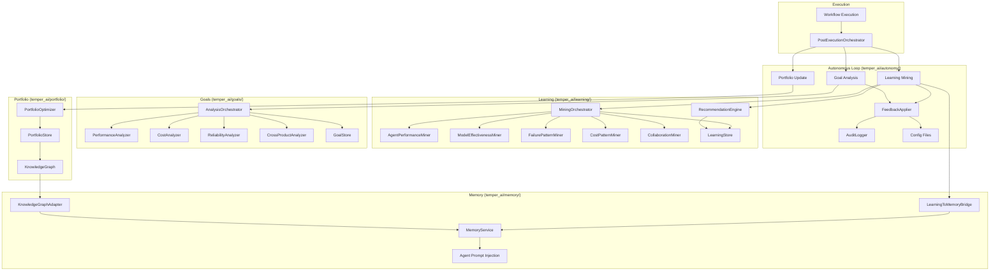

# Autonomous Feedback Loop Architecture

## System Diagram



## Data Flow

### 1. Post-Execution Trigger
```
temper-ai run workflow.yaml --autonomous
    --> _handle_post_execution()
    --> _run_autonomous_loop()
    --> PostExecutionOrchestrator.run(context)
```

### 2. Learning Pipeline
```
MiningOrchestrator.run_mining(lookback_hours=24)
    --> 5 miners scan execution history
    --> Deduplicate patterns (content hash)
    --> Persist to LearningStore (SQLite)
    --> RecommendationEngine.generate_recommendations()
    --> Store as TuneRecommendation records
```

### 3. Goal Pipeline
```
AnalysisOrchestrator.run_analysis(lookback_hours=24)
    --> 4 analyzers scan for improvement opportunities
    --> GoalProposer.generate_proposals()
    --> Deduplicate (SHA256), score, persist
    --> GoalReviewWorkflow manages approval lifecycle
```

### 4. Feedback Application
```
FeedbackApplier.apply_learning_recommendations(min_confidence=0.8)
    --> Filter by confidence threshold
    --> Validate through GoalSafetyPolicy
    --> AutoTuneEngine applies to YAML configs
    --> AuditLogger records every change
```

## Module Dependencies (One-Directional)

```
temper_ai/autonomy/ imports from:
    ├── temper_ai/learning/    (MiningOrchestrator, RecommendationEngine, LearningStore)
    ├── temper_ai/goals/       (AnalysisOrchestrator, GoalStore)
    ├── temper_ai/portfolio/   (PortfolioOptimizer, PortfolioStore)
    └── temper_ai/memory/      (MemoryService)

Never the reverse. No circular dependencies.
```

## Safety Architecture

```
Auto-Apply Request
    --> GoalSafetyPolicy.validate_proposal()
        --> Rate limit check (20/day)
        --> Autonomy level check
        --> Risk matrix evaluation
        --> Budget impact check
    --> If approved: AutoTuneEngine.apply()
    --> AuditLogger.log(entry)  # JSONL audit trail
```
